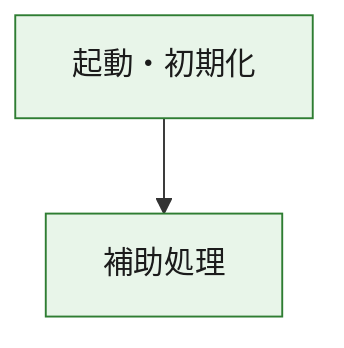
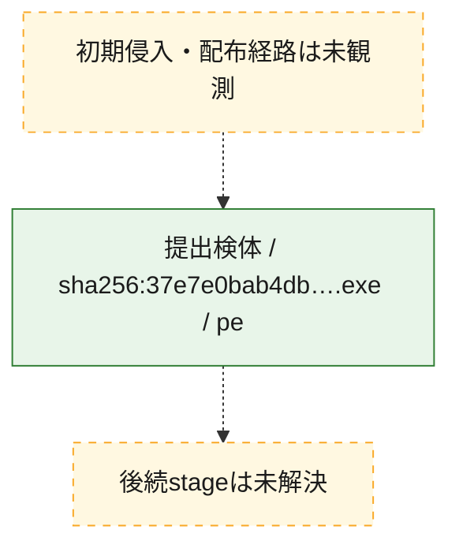
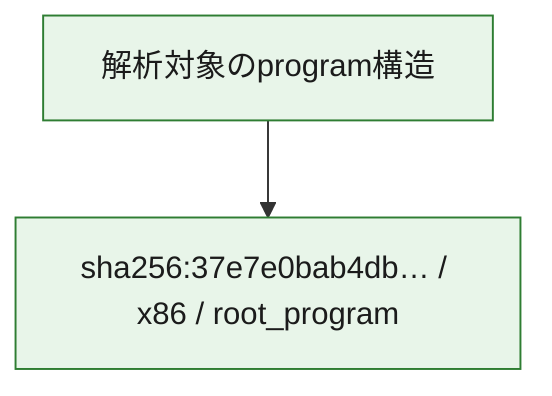

# 全体ロジック：37e7e0bab4dbaa1e26ce5835d86468fb4fa4500192745a425773b4669a8cd8aa

代表関数の静的証跡から、起動・初期化の処理群を確認しました。

## 読み方

- phaseの掲載順は解析上の整理順です。observed_call_edgesがない段階間の実行順を断定しません。
- 図の実線は静的に観測した関係、点線と黄色のノードは未観測・未解決の関係を示します。
- 図は静的な要約であり、動的実行を再現するものではありません。
- 詳細な関数解説とfingerprintは[STATIC-LOGIC.md](STATIC-LOGIC.md)を参照してください。

## 静的可視化

### 実行フロー

### 感染チェーン

### モジュール関係

## 処理段階

### 1. 起動・初期化

entry pointから初期化と後続処理への移行を確認します。
確度: `confirmed_static_function_evidence`

- `37e7e0bab4dbaa1e26ce5835d86468fb4fa4500192745a425773b4669a8cd8aa:ghidra:180001010` — 初期化と主要処理への分岐を行う入口関数です。 状態: `succeeded`、選定理由: `entry_point`, `meaningful_symbol_name`, `reviewed_call_centrality:22`, `role:entrypoint`, `small_program_complete_context`

### 2. 補助処理

主要処理を支える一般内部関数またはlibrary処理を確認します。
確度: `confirmed_static_function_evidence`

- `37e7e0bab4dbaa1e26ce5835d86468fb4fa4500192745a425773b4669a8cd8aa:ghidra:180001240` — 検体内部の一般処理を実装する関数です。 状態: `succeeded`、選定理由: `context_representative`, `reviewed_call_centrality:2`, `small_program_complete_context`
- `37e7e0bab4dbaa1e26ce5835d86468fb4fa4500192745a425773b4669a8cd8aa:ghidra:180001350` — 検体内部の一般処理を実装する関数です。 状態: `succeeded`、選定理由: `context_representative`, `reviewed_call_centrality:25`, `small_program_complete_context`
- `37e7e0bab4dbaa1e26ce5835d86468fb4fa4500192745a425773b4669a8cd8aa:ghidra:180003780` — 検体内部の一般処理を実装する関数です。 状態: `succeeded`、選定理由: `context_representative`, `reviewed_call_centrality:2`, `small_program_complete_context`
- `37e7e0bab4dbaa1e26ce5835d86468fb4fa4500192745a425773b4669a8cd8aa:ghidra:1800038e0` — 検体内部の一般処理を実装する関数です。 状態: `succeeded`、選定理由: `context_representative`, `reviewed_call_centrality:2`, `small_program_complete_context`

## 観測したcall関係

- `37e7e0bab4dbaa1e26ce5835d86468fb4fa4500192745a425773b4669a8cd8aa:ghidra:180001010` → `37e7e0bab4dbaa1e26ce5835d86468fb4fa4500192745a425773b4669a8cd8aa:ghidra:180001240` （`startup` → `support`）
- `37e7e0bab4dbaa1e26ce5835d86468fb4fa4500192745a425773b4669a8cd8aa:ghidra:180001010` → `37e7e0bab4dbaa1e26ce5835d86468fb4fa4500192745a425773b4669a8cd8aa:ghidra:180001350` （`startup` → `support`）
- `37e7e0bab4dbaa1e26ce5835d86468fb4fa4500192745a425773b4669a8cd8aa:ghidra:180001350` → `37e7e0bab4dbaa1e26ce5835d86468fb4fa4500192745a425773b4669a8cd8aa:ghidra:180001240` （`support` → `support`）
- `37e7e0bab4dbaa1e26ce5835d86468fb4fa4500192745a425773b4669a8cd8aa:ghidra:180001350` → `37e7e0bab4dbaa1e26ce5835d86468fb4fa4500192745a425773b4669a8cd8aa:ghidra:180003780` （`support` → `support`）
- `37e7e0bab4dbaa1e26ce5835d86468fb4fa4500192745a425773b4669a8cd8aa:ghidra:180001350` → `37e7e0bab4dbaa1e26ce5835d86468fb4fa4500192745a425773b4669a8cd8aa:ghidra:1800038e0` （`support` → `support`）
- `37e7e0bab4dbaa1e26ce5835d86468fb4fa4500192745a425773b4669a8cd8aa:ghidra:180003780` → `37e7e0bab4dbaa1e26ce5835d86468fb4fa4500192745a425773b4669a8cd8aa:ghidra:1800038e0` （`support` → `support`）
- `ghidra-function:25d07aa784065232b0275853` → `ghidra-function:00f0ad3ed89b3b4d97fda913` （`unclassified` → `unclassified`）
- `ghidra-function:25d07aa784065232b0275853` → `ghidra-function:16ba9cf77e9940f43af1dcb9` （`unclassified` → `unclassified`）
- `ghidra-function:25d07aa784065232b0275853` → `ghidra-function:3cf2158db5200594b7fd53da` （`unclassified` → `unclassified`）
- `ghidra-function:25d07aa784065232b0275853` → `ghidra-function:420fe0c64f824625cb70475b` （`unclassified` → `unclassified`）
- `ghidra-function:25d07aa784065232b0275853` → `ghidra-function:75f4dd693d729acba2d0480c` （`unclassified` → `unclassified`）
- `ghidra-function:25d07aa784065232b0275853` → `ghidra-function:8844ee7dfd598c511c6cd950` （`unclassified` → `unclassified`）
- `ghidra-function:25d07aa784065232b0275853` → `ghidra-function:931ad2b1466163ab7f074a54` （`unclassified` → `unclassified`）
- `ghidra-function:25d07aa784065232b0275853` → `ghidra-function:afa641288237b685a1b88b1b` （`unclassified` → `unclassified`）
- `ghidra-function:25d07aa784065232b0275853` → `ghidra-function:d2245069a47a492bc9ad3bfb` （`unclassified` → `unclassified`）
- `ghidra-function:25d07aa784065232b0275853` → `ghidra-function:d53ab2a15ba1ebfdac2a6218` （`unclassified` → `unclassified`）
- `ghidra-function:25d07aa784065232b0275853` → `ghidra-function:e811f849e68b9f663bfd9d14` （`unclassified` → `unclassified`）
- `ghidra-function:25d07aa784065232b0275853` → `ghidra-function:ed7ce650c4729e426f3dc245` （`unclassified` → `unclassified`）
- `ghidra-function:d2245069a47a492bc9ad3bfb` → `ghidra-external:0d8448b4e803911f4d3322b3` （`unclassified` → `unclassified`）
- `ghidra-function:d2245069a47a492bc9ad3bfb` → `ghidra-external:1010163a18cbfbe42b8fa51c` （`unclassified` → `unclassified`）
- `ghidra-function:d2245069a47a492bc9ad3bfb` → `ghidra-external:13149d64de74f83aa2fd35d8` （`unclassified` → `unclassified`）
- `ghidra-function:d2245069a47a492bc9ad3bfb` → `ghidra-external:1ae4fd979b2689a219d05871` （`unclassified` → `unclassified`）
- `ghidra-function:d2245069a47a492bc9ad3bfb` → `ghidra-external:221f733a5f24bca90b81e3fb` （`unclassified` → `unclassified`）
- `ghidra-function:d2245069a47a492bc9ad3bfb` → `ghidra-external:24fe89a0618c26ef0a3c8f1e` （`unclassified` → `unclassified`）
- `ghidra-function:d2245069a47a492bc9ad3bfb` → `ghidra-external:2a263f0cd02195952699e9a3` （`unclassified` → `unclassified`）
- `ghidra-function:d2245069a47a492bc9ad3bfb` → `ghidra-external:2d110d773623ecc5d8d43d1b` （`unclassified` → `unclassified`）
- `ghidra-function:d2245069a47a492bc9ad3bfb` → `ghidra-external:348978a3fbd5326eb49d4a61` （`unclassified` → `unclassified`）
- `ghidra-function:d2245069a47a492bc9ad3bfb` → `ghidra-external:3dae36803c81c174a15ef371` （`unclassified` → `unclassified`）
- `ghidra-function:d2245069a47a492bc9ad3bfb` → `ghidra-external:4aa6fa75d4a679f1f0e119d6` （`unclassified` → `unclassified`）
- `ghidra-function:d2245069a47a492bc9ad3bfb` → `ghidra-external:70885e33f9435a4ecf77d00a` （`unclassified` → `unclassified`）
- `ghidra-function:d2245069a47a492bc9ad3bfb` → `ghidra-external:792e54969d2e8dc80f4e3dc0` （`unclassified` → `unclassified`）
- `ghidra-function:d2245069a47a492bc9ad3bfb` → `ghidra-external:856037f98728a2c4ec7b278b` （`unclassified` → `unclassified`）
- `ghidra-function:d2245069a47a492bc9ad3bfb` → `ghidra-external:8c868649f06de3251e36c4c5` （`unclassified` → `unclassified`）
- `ghidra-function:d2245069a47a492bc9ad3bfb` → `ghidra-external:d0766927da3be40b032f849f` （`unclassified` → `unclassified`）
- `ghidra-function:d2245069a47a492bc9ad3bfb` → `ghidra-external:d60afcb69e2c1a84dcf2c2c4` （`unclassified` → `unclassified`）
- `ghidra-function:d2245069a47a492bc9ad3bfb` → `ghidra-external:d89b4db0c1c5be1629495bd9` （`unclassified` → `unclassified`）
- `ghidra-function:d2245069a47a492bc9ad3bfb` → `ghidra-external:db93ce6e739c392c50fd886d` （`unclassified` → `unclassified`）
- `ghidra-function:d2245069a47a492bc9ad3bfb` → `ghidra-external:f6a1cd5afe8879a3a4a00789` （`unclassified` → `unclassified`）
- `ghidra-function:d2245069a47a492bc9ad3bfb` → `ghidra-external:fcdd9aadb049c94c483eaa65` （`unclassified` → `unclassified`）
- `ghidra-function:d2245069a47a492bc9ad3bfb` → `ghidra-function:00f0ad3ed89b3b4d97fda913` （`unclassified` → `unclassified`）
- `ghidra-function:d2245069a47a492bc9ad3bfb` → `ghidra-function:336e8cc76fac5a6b860ed2b8` （`unclassified` → `unclassified`）
- `ghidra-function:d2245069a47a492bc9ad3bfb` → `ghidra-function:f9eccb0da32cc01ea6b7ba6c` （`unclassified` → `unclassified`）
- `ghidra-function:f9eccb0da32cc01ea6b7ba6c` → `ghidra-function:336e8cc76fac5a6b860ed2b8` （`unclassified` → `unclassified`）

## 解析範囲と制約

- 選定外関数は全体inventoryへ残しますが、関数本体の個別解説対象にはしていません。
- indirect call、難読化、packer、VM、壊れたcontrol flowによりcall関係が欠落する場合があります。
- 文書は静的解析に基づき、検体実行や外部通信による動的確認は行っていません。
