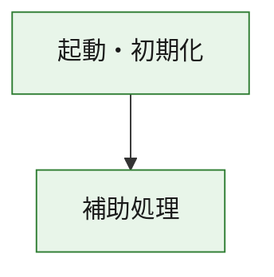
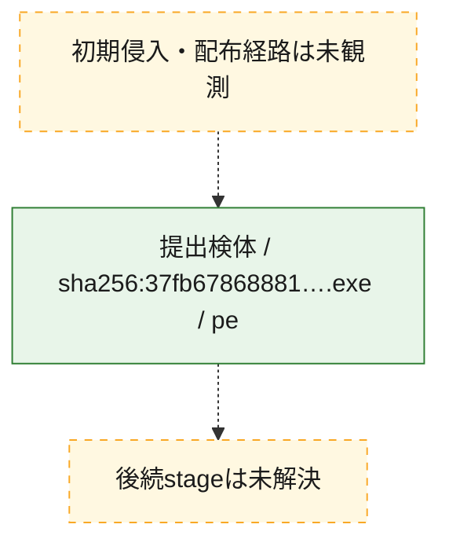
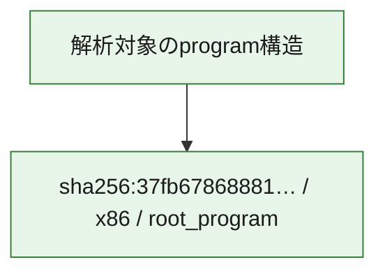

# 全体ロジック：37fb67868881aabce170d9f12d9c05ea7ae2cc750fbc18ec721b682abf5f11d1

代表関数の静的証跡から、起動・初期化の処理群を確認しました。

## 読み方

- phaseの掲載順は解析上の整理順です。observed_call_edgesがない段階間の実行順を断定しません。
- 図の実線は静的に観測した関係、点線と黄色のノードは未観測・未解決の関係を示します。
- 図は静的な要約であり、動的実行を再現するものではありません。
- 詳細な関数解説とfingerprintは[STATIC-LOGIC.md](STATIC-LOGIC.md)を参照してください。

## 静的可視化

### 実行フロー

### 感染チェーン

### モジュール関係

## 処理段階

### 1. 起動・初期化

entry pointから初期化と後続処理への移行を確認します。
確度: `confirmed_static_function_evidence`

- `37fb67868881aabce170d9f12d9c05ea7ae2cc750fbc18ec721b682abf5f11d1:ghidra:180001010` — 初期化と主要処理への分岐を行う入口関数です。 状態: `succeeded`、選定理由: `entry_point`, `meaningful_symbol_name`, `reviewed_call_centrality:22`, `role:entrypoint`, `small_program_complete_context`

### 2. 補助処理

主要処理を支える一般内部関数またはlibrary処理を確認します。
確度: `confirmed_static_function_evidence`

- `37fb67868881aabce170d9f12d9c05ea7ae2cc750fbc18ec721b682abf5f11d1:ghidra:180001240` — 検体内部の一般処理を実装する関数です。 状態: `succeeded`、選定理由: `context_representative`, `reviewed_call_centrality:2`, `small_program_complete_context`
- `37fb67868881aabce170d9f12d9c05ea7ae2cc750fbc18ec721b682abf5f11d1:ghidra:180001350` — 検体内部の一般処理を実装する関数です。 状態: `succeeded`、選定理由: `context_representative`, `reviewed_call_centrality:25`, `small_program_complete_context`
- `37fb67868881aabce170d9f12d9c05ea7ae2cc750fbc18ec721b682abf5f11d1:ghidra:180003780` — 検体内部の一般処理を実装する関数です。 状態: `succeeded`、選定理由: `context_representative`, `reviewed_call_centrality:2`, `small_program_complete_context`
- `37fb67868881aabce170d9f12d9c05ea7ae2cc750fbc18ec721b682abf5f11d1:ghidra:1800038e0` — 検体内部の一般処理を実装する関数です。 状態: `succeeded`、選定理由: `context_representative`, `reviewed_call_centrality:2`, `small_program_complete_context`

## 観測したcall関係

- `37fb67868881aabce170d9f12d9c05ea7ae2cc750fbc18ec721b682abf5f11d1:ghidra:180001010` → `37fb67868881aabce170d9f12d9c05ea7ae2cc750fbc18ec721b682abf5f11d1:ghidra:180001240` （`startup` → `support`）
- `37fb67868881aabce170d9f12d9c05ea7ae2cc750fbc18ec721b682abf5f11d1:ghidra:180001010` → `37fb67868881aabce170d9f12d9c05ea7ae2cc750fbc18ec721b682abf5f11d1:ghidra:180001350` （`startup` → `support`）
- `37fb67868881aabce170d9f12d9c05ea7ae2cc750fbc18ec721b682abf5f11d1:ghidra:180001350` → `37fb67868881aabce170d9f12d9c05ea7ae2cc750fbc18ec721b682abf5f11d1:ghidra:180001240` （`support` → `support`）
- `37fb67868881aabce170d9f12d9c05ea7ae2cc750fbc18ec721b682abf5f11d1:ghidra:180001350` → `37fb67868881aabce170d9f12d9c05ea7ae2cc750fbc18ec721b682abf5f11d1:ghidra:180003780` （`support` → `support`）
- `37fb67868881aabce170d9f12d9c05ea7ae2cc750fbc18ec721b682abf5f11d1:ghidra:180001350` → `37fb67868881aabce170d9f12d9c05ea7ae2cc750fbc18ec721b682abf5f11d1:ghidra:1800038e0` （`support` → `support`）
- `37fb67868881aabce170d9f12d9c05ea7ae2cc750fbc18ec721b682abf5f11d1:ghidra:180003780` → `37fb67868881aabce170d9f12d9c05ea7ae2cc750fbc18ec721b682abf5f11d1:ghidra:1800038e0` （`support` → `support`）
- `ghidra-function:0c7496d42b44008ba382d854` → `ghidra-function:35cbcf10b53d8a380a9c367f` （`unclassified` → `unclassified`）
- `ghidra-function:0c7496d42b44008ba382d854` → `ghidra-function:661d30f7c1696f62e3879b42` （`unclassified` → `unclassified`）
- `ghidra-function:0c7496d42b44008ba382d854` → `ghidra-function:6852330d37f9563865bc56d6` （`unclassified` → `unclassified`）
- `ghidra-function:0c7496d42b44008ba382d854` → `ghidra-function:7390d0aee70abb3454fc962d` （`unclassified` → `unclassified`）
- `ghidra-function:0c7496d42b44008ba382d854` → `ghidra-function:77a3efe72908f2e2af5f17f0` （`unclassified` → `unclassified`）
- `ghidra-function:0c7496d42b44008ba382d854` → `ghidra-function:b52077823e2d481ef8b26a4d` （`unclassified` → `unclassified`）
- `ghidra-function:0c7496d42b44008ba382d854` → `ghidra-function:c36cb424dacbf4595543b417` （`unclassified` → `unclassified`）
- `ghidra-function:0c7496d42b44008ba382d854` → `ghidra-function:c5f3f550cba593b37087e18b` （`unclassified` → `unclassified`）
- `ghidra-function:0c7496d42b44008ba382d854` → `ghidra-function:d093086baf4009ca87bac05d` （`unclassified` → `unclassified`）
- `ghidra-function:0c7496d42b44008ba382d854` → `ghidra-function:ed2c25c771229e09e2e7c749` （`unclassified` → `unclassified`）
- `ghidra-function:0c7496d42b44008ba382d854` → `ghidra-function:edfd034526534d9a78f7d18a` （`unclassified` → `unclassified`）
- `ghidra-function:0c7496d42b44008ba382d854` → `ghidra-function:f8350bc196365e42ea31fb16` （`unclassified` → `unclassified`）
- `ghidra-function:b52077823e2d481ef8b26a4d` → `ghidra-external:0068b0e395e3c9678070d774` （`unclassified` → `unclassified`）
- `ghidra-function:b52077823e2d481ef8b26a4d` → `ghidra-external:0a53f970b6f261c1aa272a6a` （`unclassified` → `unclassified`）
- `ghidra-function:b52077823e2d481ef8b26a4d` → `ghidra-external:190f9050ad00caa130645853` （`unclassified` → `unclassified`）
- `ghidra-function:b52077823e2d481ef8b26a4d` → `ghidra-external:1c5e75454950a965342e2c2f` （`unclassified` → `unclassified`）
- `ghidra-function:b52077823e2d481ef8b26a4d` → `ghidra-external:2a1f2cf1c6d0b7f355762ae3` （`unclassified` → `unclassified`）
- `ghidra-function:b52077823e2d481ef8b26a4d` → `ghidra-external:3092aa3ff4c5b53a6362360d` （`unclassified` → `unclassified`）
- `ghidra-function:b52077823e2d481ef8b26a4d` → `ghidra-external:31c58e567d7c74e9ee04d75a` （`unclassified` → `unclassified`）
- `ghidra-function:b52077823e2d481ef8b26a4d` → `ghidra-external:387aa4f6e14d8a6b8283975b` （`unclassified` → `unclassified`）
- `ghidra-function:b52077823e2d481ef8b26a4d` → `ghidra-external:392ef0ceaa78dad66d57b4f1` （`unclassified` → `unclassified`）
- `ghidra-function:b52077823e2d481ef8b26a4d` → `ghidra-external:46584159e1b097d03d27640f` （`unclassified` → `unclassified`）
- `ghidra-function:b52077823e2d481ef8b26a4d` → `ghidra-external:5c26ca9b77c1f7a3db0e778d` （`unclassified` → `unclassified`）
- `ghidra-function:b52077823e2d481ef8b26a4d` → `ghidra-external:71e175e486402971eca46b31` （`unclassified` → `unclassified`）
- `ghidra-function:b52077823e2d481ef8b26a4d` → `ghidra-external:760719e36ddcb4554b0f30a9` （`unclassified` → `unclassified`）
- `ghidra-function:b52077823e2d481ef8b26a4d` → `ghidra-external:7bca1400001173f91be6aaa8` （`unclassified` → `unclassified`）
- `ghidra-function:b52077823e2d481ef8b26a4d` → `ghidra-external:94b9b37c975fcdce2377f72d` （`unclassified` → `unclassified`）
- `ghidra-function:b52077823e2d481ef8b26a4d` → `ghidra-external:9a634fe53fc607554c0ab4f1` （`unclassified` → `unclassified`）
- `ghidra-function:b52077823e2d481ef8b26a4d` → `ghidra-external:9d44fcf5c15db4bc6cefd512` （`unclassified` → `unclassified`）
- `ghidra-function:b52077823e2d481ef8b26a4d` → `ghidra-external:9f51a34c1caaac00adbc38a0` （`unclassified` → `unclassified`）
- `ghidra-function:b52077823e2d481ef8b26a4d` → `ghidra-external:9fbce22f64f59384548a49db` （`unclassified` → `unclassified`）
- `ghidra-function:b52077823e2d481ef8b26a4d` → `ghidra-external:bbbb8c2b1bcbf1e66fd1d4bc` （`unclassified` → `unclassified`）
- `ghidra-function:b52077823e2d481ef8b26a4d` → `ghidra-external:c98b4f690a1a2e75ab25efb3` （`unclassified` → `unclassified`）
- `ghidra-function:b52077823e2d481ef8b26a4d` → `ghidra-function:c7851821571e5d0188202eaa` （`unclassified` → `unclassified`）
- `ghidra-function:b52077823e2d481ef8b26a4d` → `ghidra-function:ed2c25c771229e09e2e7c749` （`unclassified` → `unclassified`）
- `ghidra-function:b52077823e2d481ef8b26a4d` → `ghidra-function:ef2610ea590cc651e7d8b1a5` （`unclassified` → `unclassified`）
- `ghidra-function:ef2610ea590cc651e7d8b1a5` → `ghidra-function:c7851821571e5d0188202eaa` （`unclassified` → `unclassified`）

## 解析範囲と制約

- 選定外関数は全体inventoryへ残しますが、関数本体の個別解説対象にはしていません。
- indirect call、難読化、packer、VM、壊れたcontrol flowによりcall関係が欠落する場合があります。
- 文書は静的解析に基づき、検体実行や外部通信による動的確認は行っていません。
