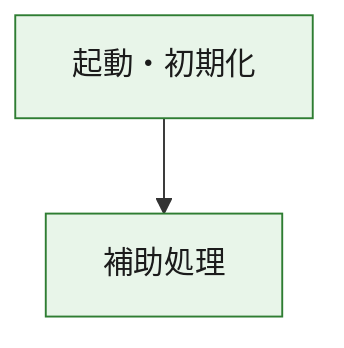
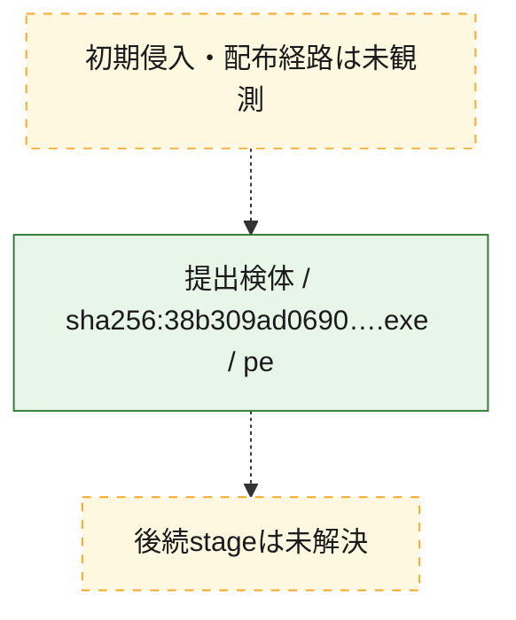
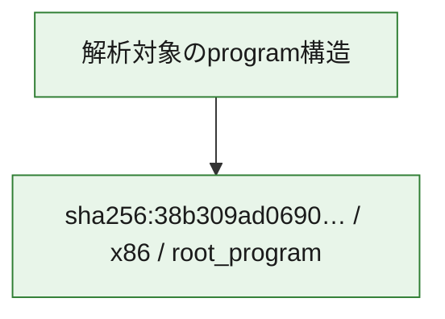

# 全体ロジック：38b309ad06900237dc0e6505b7ac8afbca9429dae8144739f611d450a99b1d66

代表関数の静的証跡から、起動・初期化の処理群を確認しました。

## 読み方

- phaseの掲載順は解析上の整理順です。observed_call_edgesがない段階間の実行順を断定しません。
- 図の実線は静的に観測した関係、点線と黄色のノードは未観測・未解決の関係を示します。
- 図は静的な要約であり、動的実行を再現するものではありません。
- 詳細な関数解説とfingerprintは[STATIC-LOGIC.md](STATIC-LOGIC.md)を参照してください。

## 静的可視化

### 実行フロー

### 感染チェーン

### モジュール関係

## 処理段階

### 1. 起動・初期化

entry pointから初期化と後続処理への移行を確認します。
確度: `confirmed_static_function_evidence`

- `38b309ad06900237dc0e6505b7ac8afbca9429dae8144739f611d450a99b1d66:ghidra:180001010` — 初期化と主要処理への分岐を行う入口関数です。 状態: `succeeded`、選定理由: `entry_point`, `meaningful_symbol_name`, `reviewed_call_centrality:22`, `role:entrypoint`, `small_program_complete_context`

### 2. 補助処理

主要処理を支える一般内部関数またはlibrary処理を確認します。
確度: `confirmed_static_function_evidence`

- `38b309ad06900237dc0e6505b7ac8afbca9429dae8144739f611d450a99b1d66:ghidra:180001240` — 検体内部の一般処理を実装する関数です。 状態: `succeeded`、選定理由: `context_representative`, `reviewed_call_centrality:2`, `small_program_complete_context`
- `38b309ad06900237dc0e6505b7ac8afbca9429dae8144739f611d450a99b1d66:ghidra:180001350` — 検体内部の一般処理を実装する関数です。 状態: `succeeded`、選定理由: `context_representative`, `reviewed_call_centrality:25`, `small_program_complete_context`
- `38b309ad06900237dc0e6505b7ac8afbca9429dae8144739f611d450a99b1d66:ghidra:180003780` — 検体内部の一般処理を実装する関数です。 状態: `succeeded`、選定理由: `context_representative`, `reviewed_call_centrality:2`, `small_program_complete_context`
- `38b309ad06900237dc0e6505b7ac8afbca9429dae8144739f611d450a99b1d66:ghidra:1800038e0` — 検体内部の一般処理を実装する関数です。 状態: `succeeded`、選定理由: `context_representative`, `reviewed_call_centrality:2`, `small_program_complete_context`

## 観測したcall関係

- `38b309ad06900237dc0e6505b7ac8afbca9429dae8144739f611d450a99b1d66:ghidra:180001010` → `38b309ad06900237dc0e6505b7ac8afbca9429dae8144739f611d450a99b1d66:ghidra:180001240` （`startup` → `support`）
- `38b309ad06900237dc0e6505b7ac8afbca9429dae8144739f611d450a99b1d66:ghidra:180001010` → `38b309ad06900237dc0e6505b7ac8afbca9429dae8144739f611d450a99b1d66:ghidra:180001350` （`startup` → `support`）
- `38b309ad06900237dc0e6505b7ac8afbca9429dae8144739f611d450a99b1d66:ghidra:180001350` → `38b309ad06900237dc0e6505b7ac8afbca9429dae8144739f611d450a99b1d66:ghidra:180001240` （`support` → `support`）
- `38b309ad06900237dc0e6505b7ac8afbca9429dae8144739f611d450a99b1d66:ghidra:180001350` → `38b309ad06900237dc0e6505b7ac8afbca9429dae8144739f611d450a99b1d66:ghidra:180003780` （`support` → `support`）
- `38b309ad06900237dc0e6505b7ac8afbca9429dae8144739f611d450a99b1d66:ghidra:180001350` → `38b309ad06900237dc0e6505b7ac8afbca9429dae8144739f611d450a99b1d66:ghidra:1800038e0` （`support` → `support`）
- `38b309ad06900237dc0e6505b7ac8afbca9429dae8144739f611d450a99b1d66:ghidra:180003780` → `38b309ad06900237dc0e6505b7ac8afbca9429dae8144739f611d450a99b1d66:ghidra:1800038e0` （`support` → `support`）
- `ghidra-function:55392cd2db6b68770784a0da` → `ghidra-function:0f2d136e055c9cd47e9619fa` （`unclassified` → `unclassified`）
- `ghidra-function:55392cd2db6b68770784a0da` → `ghidra-function:3aa42439dc4b73f81d3442f6` （`unclassified` → `unclassified`）
- `ghidra-function:55392cd2db6b68770784a0da` → `ghidra-function:56c1058a56e66902b9a8ced7` （`unclassified` → `unclassified`）
- `ghidra-function:55392cd2db6b68770784a0da` → `ghidra-function:6424977025d8f3191460c0ba` （`unclassified` → `unclassified`）
- `ghidra-function:55392cd2db6b68770784a0da` → `ghidra-function:6468aea4b4b3e3b1d981b5bc` （`unclassified` → `unclassified`）
- `ghidra-function:55392cd2db6b68770784a0da` → `ghidra-function:742a4a5a2361af0e18022e3b` （`unclassified` → `unclassified`）
- `ghidra-function:55392cd2db6b68770784a0da` → `ghidra-function:8707019e16ace9c4935199ae` （`unclassified` → `unclassified`）
- `ghidra-function:55392cd2db6b68770784a0da` → `ghidra-function:943cdd3f36fd7ee1e6de29a6` （`unclassified` → `unclassified`）
- `ghidra-function:55392cd2db6b68770784a0da` → `ghidra-function:9c0e56c6fb36417090e66370` （`unclassified` → `unclassified`）
- `ghidra-function:55392cd2db6b68770784a0da` → `ghidra-function:a0910c6468f3fead42326022` （`unclassified` → `unclassified`）
- `ghidra-function:55392cd2db6b68770784a0da` → `ghidra-function:a9eafdd1f2d93f5b1f25bcf8` （`unclassified` → `unclassified`）
- `ghidra-function:55392cd2db6b68770784a0da` → `ghidra-function:bdd7e38e6413ddc3cc9c69a2` （`unclassified` → `unclassified`）
- `ghidra-function:9c0e56c6fb36417090e66370` → `ghidra-external:009138d37634c1a190cbc9f0` （`unclassified` → `unclassified`）
- `ghidra-function:9c0e56c6fb36417090e66370` → `ghidra-external:13f87bfd36733c5207bf4bf9` （`unclassified` → `unclassified`）
- `ghidra-function:9c0e56c6fb36417090e66370` → `ghidra-external:211e1d1580146500aafe0a37` （`unclassified` → `unclassified`）
- `ghidra-function:9c0e56c6fb36417090e66370` → `ghidra-external:24cd83d7975f4276727feda8` （`unclassified` → `unclassified`）
- `ghidra-function:9c0e56c6fb36417090e66370` → `ghidra-external:2c748179d115ba955aae78ba` （`unclassified` → `unclassified`）
- `ghidra-function:9c0e56c6fb36417090e66370` → `ghidra-external:32a7e02f1b8015d7d173ebb5` （`unclassified` → `unclassified`）
- `ghidra-function:9c0e56c6fb36417090e66370` → `ghidra-external:3b12d6073c7e1140566a340e` （`unclassified` → `unclassified`）
- `ghidra-function:9c0e56c6fb36417090e66370` → `ghidra-external:3b436574f314609b13937ca7` （`unclassified` → `unclassified`）
- `ghidra-function:9c0e56c6fb36417090e66370` → `ghidra-external:5837c0ae24287eff862d7ec4` （`unclassified` → `unclassified`）
- `ghidra-function:9c0e56c6fb36417090e66370` → `ghidra-external:5a8a26538b2e476f01349cb2` （`unclassified` → `unclassified`）
- `ghidra-function:9c0e56c6fb36417090e66370` → `ghidra-external:62d094b25a892ccfb4dffa6e` （`unclassified` → `unclassified`）
- `ghidra-function:9c0e56c6fb36417090e66370` → `ghidra-external:6a5763eb6a1dded34b17b7a4` （`unclassified` → `unclassified`）
- `ghidra-function:9c0e56c6fb36417090e66370` → `ghidra-external:796ad01efa78afc7430f5507` （`unclassified` → `unclassified`）
- `ghidra-function:9c0e56c6fb36417090e66370` → `ghidra-external:7abb1495ef1c560eefcc7950` （`unclassified` → `unclassified`）
- `ghidra-function:9c0e56c6fb36417090e66370` → `ghidra-external:80e8f8b7b37a53579a9b0957` （`unclassified` → `unclassified`）
- `ghidra-function:9c0e56c6fb36417090e66370` → `ghidra-external:866fe065924cec18520829d8` （`unclassified` → `unclassified`）
- `ghidra-function:9c0e56c6fb36417090e66370` → `ghidra-external:9cd6bee859c6e85b53616b51` （`unclassified` → `unclassified`）
- `ghidra-function:9c0e56c6fb36417090e66370` → `ghidra-external:ac9073168045e6007797f184` （`unclassified` → `unclassified`）
- `ghidra-function:9c0e56c6fb36417090e66370` → `ghidra-external:b8bff30fdf9e5146d309dc9a` （`unclassified` → `unclassified`）
- `ghidra-function:9c0e56c6fb36417090e66370` → `ghidra-external:ce9f13ebcfbbcf3ec36a046c` （`unclassified` → `unclassified`）
- `ghidra-function:9c0e56c6fb36417090e66370` → `ghidra-external:e11e67333a76029ddc90a43b` （`unclassified` → `unclassified`）
- `ghidra-function:9c0e56c6fb36417090e66370` → `ghidra-function:51b72460afb10cfd10b4bff8` （`unclassified` → `unclassified`）
- `ghidra-function:9c0e56c6fb36417090e66370` → `ghidra-function:8707019e16ace9c4935199ae` （`unclassified` → `unclassified`）
- `ghidra-function:9c0e56c6fb36417090e66370` → `ghidra-function:c3ed413cdc87ece87c5c11f0` （`unclassified` → `unclassified`）
- `ghidra-function:c3ed413cdc87ece87c5c11f0` → `ghidra-function:51b72460afb10cfd10b4bff8` （`unclassified` → `unclassified`）

## 解析範囲と制約

- 選定外関数は全体inventoryへ残しますが、関数本体の個別解説対象にはしていません。
- indirect call、難読化、packer、VM、壊れたcontrol flowによりcall関係が欠落する場合があります。
- 文書は静的解析に基づき、検体実行や外部通信による動的確認は行っていません。
