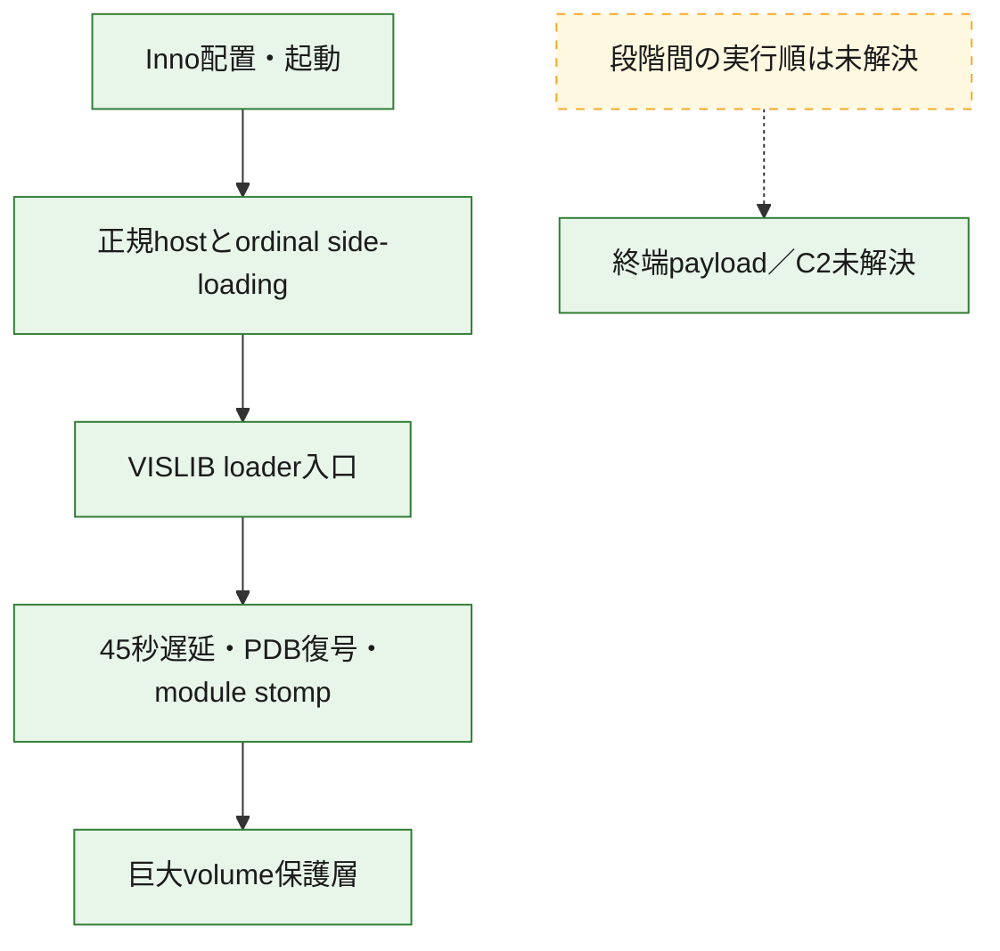
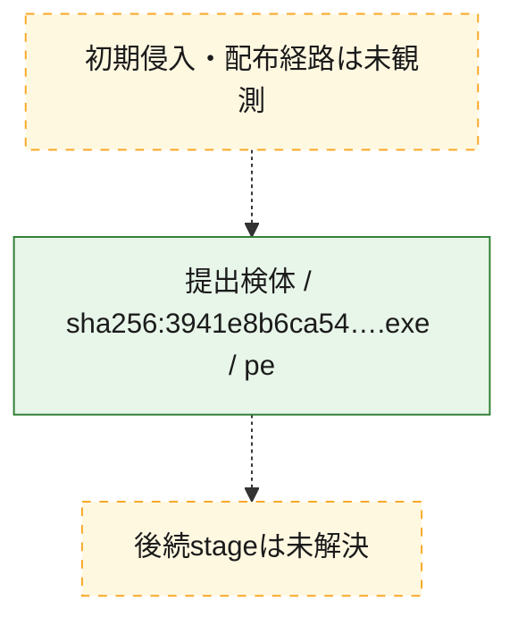
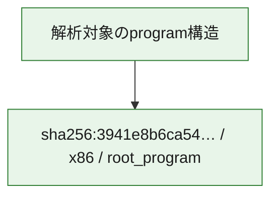

# 全体ロジック：3941e8b6ca541c8f030f7907f265c546e1191159bb844b8f9d21551defd0ba41

静的証拠により、Inno配置・起動から正規hostのordinal side-loading、VISLIB loader、45秒遅延、PDB復号、tapisrv.dll module stomp、巨大volume保護層までを確認しました。終端payloadとC2は未解決です。

## 読み方

- 実線edgeはInno IFPS action、PE import／entry JMP、復号descriptor、module-stomp call、sidecar参照から静的に確認した遷移です。終端payload以降は観測していません。
- 図の実線は静的に観測した関係、点線と黄色のノードは未観測・未解決の関係を示します。
- 図は静的な要約であり、動的実行を再現するものではありません。
- 詳細な関数解説とfingerprintは[STATIC-LOGIC.md](STATIC-LOGIC.md)を参照してください。

## 静的可視化

### 実行フロー

### 感染チェーン

### モジュール関係

## 処理段階

### 1. Inno配置・起動

4 memberを同一一時directoryへ配置し、ProcessorMeta.exeを空引数で起動します。
確度: `confirmed_static_inno_action`

- `3941e8b6ca541c8f030f7907f265c546e1191159bb844b8f9d21551defd0ba41:ghidra:0041181c` — 初期化と主要処理への分岐を行う入口関数です。 状態: `succeeded`、選定理由: `entry_point`, `large_function:instructions=149`, `meaningful_symbol_name`, `reviewed_call_centrality:18`, `role:entrypoint`, `small_program_complete_context`
- import証跡: `Inno IFPS Exec: ProcessorMeta.exe, arguments empty`

### 2. 正規hostとordinal side-loading

Microsoft署名をchain検証した正規hostが同一directoryのVISLIB.dll ordinal 1をimportします。署名自体は悪性根拠ではありません。
確度: `confirmed_static_pe_structure`

- import証跡: `ProcessorMeta.exe -> VISLIB.dll!#1`, `Authenticode status: Valid`

### 3. VISLIB loader入口

VISLIB.DLLのDllEntryPointがRVA 0x2ca4からRVA 0x7e7cへ直接JMPし、scene PDBとvolume sidecarを参照します。
確度: `confirmed_static_ghidra_and_pe_structure`

- import証跡: `entry bytes: e9 d3 51 00 00`, `sceneprime29.pdb`, `volume-ext.dll`

### 4. 45秒遅延・PDB復号・module stomp

NtDelayExecutionを9回呼ぶ合計約45秒の遅延後、PDB recordを復号し、tapisrv.dll BaseOfCodeへ0x16b0 bytesを書き、+0xed0を呼びます。
確度: `confirmed_static_module_stomp`

- import証跡: `NtDelayExecution(FALSE, -50000000) x 9`, `LoadLibraryA`, `VirtualProtect`

### 5. 巨大volume保護層

678個の分割recordと一意sentinelを検証しましたが、宣言出力3,378,203,772 bytesが128 MiB上限を超えるためoutput_size_blockedで停止しました。
確度: `confirmed_structure_output_size_blocked`

- import証跡: `marker mask: ????????49444154`, `parser status: output_size_blocked`

### 6. 終端payload／C2未解決

volume層の安全上限停止により、終端payload、family固有設定、最終C2 endpoint、protocolは未回収です。
確度: `unresolved_output_size_blocked`

## 観測したcall関係

- `inno_ifps_launch` → `signed_host_ordinal_sideload` （`inno_launch` → `ordinal_sideload`）
- `signed_host_ordinal_sideload` → `vislib_entry_loader` （`ordinal_sideload` → `vislib_loader`）
- `vislib_entry_loader` → `delay_and_pdb_decode` （`vislib_loader` → `pdb_module_stomp`）
- `delay_and_pdb_decode` → `tapisrv_module_stomp` （`pdb_module_stomp` → `pdb_module_stomp`）
- `tapisrv_module_stomp` → `bounded_volume_layer` （`pdb_module_stomp` → `volume_protection`）

## 解析範囲と制約

- Microsoft署名はProcessorMeta.exeを正規hostとする根拠であり、悪性判定はordinal 1 side-loading、VISLIB entry JMP、scene PDB／volume sidecar、tapisrv.dll module stompの相関に基づきます。
- volume layerは認証した宣言出力が128 MiB上限を超えたため、3 GiB超のbuffer生成を行わずoutput_size_blockedで停止しました。
- 終端payload、family、C2設定、最終endpoint、protocolは未解決であり、汎用文字列をC2へ昇格していません。
- 検体・抽出PE/DLL・復元コードの実行、CPU emulation、外部通信は行っていません。

## 比較プロファイル

| 軸 | 本caseの観測値 | 確度 |
|---|---|---|
| 感染・復元層 | Inno bundle、正規host、署名なしloader DLL、PDB復号record、巨大volume sidecar | `confirmed_static` |
| 実行段階 | 空引数でhost起動、ordinal 1 side-loading、entry JMP、45秒遅延、module stomp、volume parser | `confirmed_static` |
| module構成 | `ProcessorMeta.exe` → `VISLIB.DLL` → `tapisrv.dll`上書き領域。実行時の追加moduleは未観測 | `confirmed_static_structure` |
| 機能 | DLL side-loading、静的遅延、DWORD加算復号、process内code上書き、巨大memory保護 | `confirmed_static` |
| 代表関数の役割 | root Inno stubは6関数をレビューし、loader連鎖は6処理単位として分離記録 | `confirmed_recorded` |
| code fingerprint | root Inno stubの代表関数fingerprintのみ公開。VISLIB／stomp codeのfamily比較は未実施 | `partial` |

## 他ケースとの比較

現時点では、同一directory DLL side-loadingと正規module code上書きという2軸を同時に満たす比較候補を選定していません。`ProcessorMeta.exe`、`VISLIB.DLL`、`tapisrv.dll`の単一file名、Microsoft署名、単一hashだけではfamily、campaign、actorの同一性を判定しません。終端payload未復元のため、設定形式、C2 protocol、terminal code fingerprintを独立軸にした比較は保留します。
