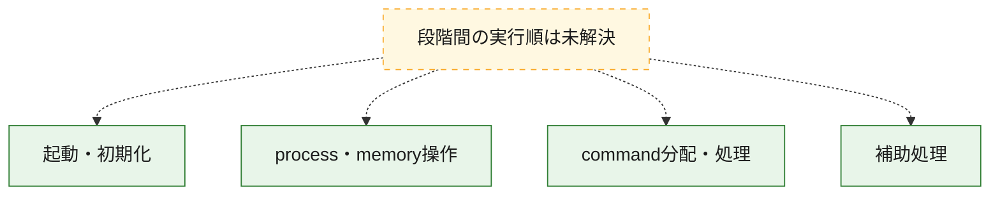
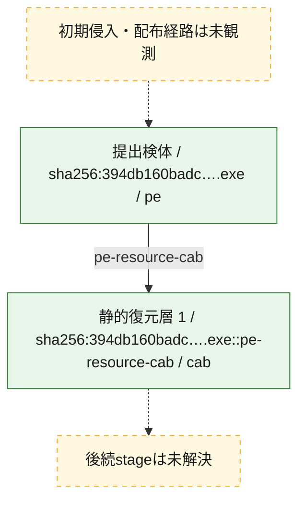
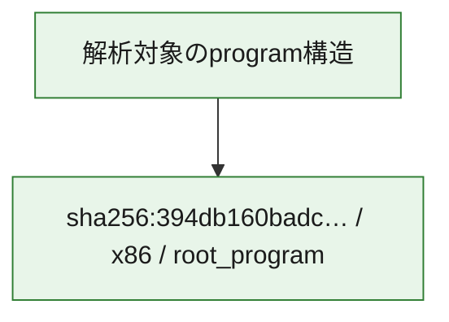

# 全体ロジック：394db160badc3198c94aa6c7fea01e68d6908864e1b35084538079b4f19e3a6f

代表関数の静的証跡から、起動・初期化、process・memory操作、command分配・処理の処理群を確認しました。

## 読み方

- phaseの掲載順は解析上の整理順です。observed_call_edgesがない段階間の実行順を断定しません。
- 図の実線は静的に観測した関係、点線と黄色のノードは未観測・未解決の関係を示します。
- 図は静的な要約であり、動的実行を再現するものではありません。
- 詳細な関数解説とfingerprintは[STATIC-LOGIC.md](STATIC-LOGIC.md)を参照してください。

## 静的可視化

### 実行フロー

### 感染チェーン

### モジュール関係

## 処理段階

### 1. 起動・初期化

entry pointから初期化と後続処理への移行を確認します。
確度: `confirmed_static_function_evidence`

- `394db160badc3198c94aa6c7fea01e68d6908864e1b35084538079b4f19e3a6f:ghidra:14000a770` — 初期化と主要処理への分岐を行う入口関数です。 状態: `succeeded`、選定理由: `entry_point`, `meaningful_symbol_name`, `reviewed_call_centrality:4`, `role:entrypoint`

### 2. process・memory操作

process、thread、module、memory操作と実行移行を確認します。
確度: `confirmed_static_function_evidence_with_limits`

- `394db160badc3198c94aa6c7fea01e68d6908864e1b35084538079b4f19e3a6f:ghidra:140003ca0` — process、thread、module、またはmemory操作に関係する関数です。 状態: `limited_bad_instruction_or_flow`、選定理由: `context_representative`, `reviewed_call_centrality:3`, `role:process_or_memory_operation`

### 3. command分配・処理

受信commandやtaskの解釈、分配、個別handlerへの移行を確認します。
確度: `confirmed_static_function_evidence_with_limits`

- `394db160badc3198c94aa6c7fea01e68d6908864e1b35084538079b4f19e3a6f:ghidra:14002f0e0` — commandの解釈、分配、または個別処理を担当する関数です。 状態: `limited_bad_instruction_or_flow`、選定理由: `meaningful_symbol_name`, `role:command_dispatch_or_handler`

### 4. 補助処理

主要処理を支える一般内部関数またはlibrary処理を確認します。
確度: `confirmed_static_function_evidence_with_limits`

- `394db160badc3198c94aa6c7fea01e68d6908864e1b35084538079b4f19e3a6f:ghidra:140001e60` — 検体内部の一般処理を実装する関数です。 状態: `succeeded`、選定理由: `context_representative`, `reviewed_call_centrality:4`
- `394db160badc3198c94aa6c7fea01e68d6908864e1b35084538079b4f19e3a6f:ghidra:140001ee0` — 検体内部の一般処理を実装する関数です。 状態: `succeeded`、選定理由: `context_representative`, `reviewed_call_centrality:5`
- `394db160badc3198c94aa6c7fea01e68d6908864e1b35084538079b4f19e3a6f:ghidra:140001ef0` — 検体内部の一般処理を実装する関数です。 状態: `succeeded`、選定理由: `context_representative`, `reviewed_call_centrality:4`
- `394db160badc3198c94aa6c7fea01e68d6908864e1b35084538079b4f19e3a6f:ghidra:140001f00` — 検体内部の一般処理を実装する関数です。 状態: `succeeded`、選定理由: `context_representative`, `reviewed_call_centrality:5`
- `394db160badc3198c94aa6c7fea01e68d6908864e1b35084538079b4f19e3a6f:ghidra:140001f20` — 検体内部の一般処理を実装する関数です。 状態: `succeeded`、選定理由: `context_representative`, `reviewed_call_centrality:3`
- `394db160badc3198c94aa6c7fea01e68d6908864e1b35084538079b4f19e3a6f:ghidra:140001f50` — 検体内部の一般処理を実装する関数です。 状態: `succeeded`、選定理由: `context_representative`, `reviewed_call_centrality:2`
- `394db160badc3198c94aa6c7fea01e68d6908864e1b35084538079b4f19e3a6f:ghidra:140001f60` — 検体内部の一般処理を実装する関数です。 状態: `succeeded`、選定理由: `context_representative`, `reviewed_call_centrality:2`
- `394db160badc3198c94aa6c7fea01e68d6908864e1b35084538079b4f19e3a6f:ghidra:140001f80` — 検体内部の一般処理を実装する関数です。 状態: `limited_bad_instruction_or_flow`、選定理由: `context_representative`, `reviewed_call_centrality:3`
- `394db160badc3198c94aa6c7fea01e68d6908864e1b35084538079b4f19e3a6f:ghidra:140002a60` — 検体内部の一般処理を実装する関数です。 状態: `limited_bad_instruction_or_flow`、選定理由: `context_representative`, `reviewed_call_centrality:2`
- `394db160badc3198c94aa6c7fea01e68d6908864e1b35084538079b4f19e3a6f:ghidra:140002ee0` — 検体内部の一般処理を実装する関数です。 状態: `limited_bad_instruction_or_flow`、選定理由: `context_representative`, `reviewed_call_centrality:5`
- `394db160badc3198c94aa6c7fea01e68d6908864e1b35084538079b4f19e3a6f:ghidra:140002f20` — 検体内部の一般処理を実装する関数です。 状態: `limited_bad_instruction_or_flow`、選定理由: `context_representative`, `reviewed_call_centrality:5`
- `394db160badc3198c94aa6c7fea01e68d6908864e1b35084538079b4f19e3a6f:ghidra:1400030a0` — 検体内部の一般処理を実装する関数です。 状態: `limited_bad_instruction_or_flow`、選定理由: `context_representative`, `reviewed_call_centrality:2`
- `394db160badc3198c94aa6c7fea01e68d6908864e1b35084538079b4f19e3a6f:ghidra:140003710` — 検体内部の一般処理を実装する関数です。 状態: `succeeded`、選定理由: `context_representative`, `reviewed_call_centrality:8`
- `394db160badc3198c94aa6c7fea01e68d6908864e1b35084538079b4f19e3a6f:ghidra:140003780` — 検体内部の一般処理を実装する関数です。 状態: `succeeded`、選定理由: `context_representative`, `reviewed_call_centrality:8`
- `394db160badc3198c94aa6c7fea01e68d6908864e1b35084538079b4f19e3a6f:ghidra:140003c70` — 検体内部の一般処理を実装する関数です。 状態: `succeeded`、選定理由: `context_representative`
- `394db160badc3198c94aa6c7fea01e68d6908864e1b35084538079b4f19e3a6f:ghidra:140004000` — 検体内部の一般処理を実装する関数です。 状態: `succeeded`、選定理由: `context_representative`, `reviewed_call_centrality:9`
- `394db160badc3198c94aa6c7fea01e68d6908864e1b35084538079b4f19e3a6f:ghidra:140004098` — 検体内部の一般処理を実装する関数です。 状態: `succeeded`、選定理由: `context_representative`, `reviewed_call_centrality:3`
- `394db160badc3198c94aa6c7fea01e68d6908864e1b35084538079b4f19e3a6f:ghidra:140004238` — 検体内部の一般処理を実装する関数です。 状態: `succeeded`、選定理由: `context_representative`, `reviewed_call_centrality:3`
- `394db160badc3198c94aa6c7fea01e68d6908864e1b35084538079b4f19e3a6f:ghidra:1400043f0` — 検体内部の一般処理を実装する関数です。 状態: `succeeded`、選定理由: `context_representative`, `reviewed_call_centrality:3`
- `394db160badc3198c94aa6c7fea01e68d6908864e1b35084538079b4f19e3a6f:ghidra:1400044f0` — 検体内部の一般処理を実装する関数です。 状態: `succeeded`、選定理由: `context_representative`, `reviewed_call_centrality:2`
- `394db160badc3198c94aa6c7fea01e68d6908864e1b35084538079b4f19e3a6f:ghidra:140004574` — 検体内部の一般処理を実装する関数です。 状態: `succeeded`、選定理由: `context_representative`, `reviewed_call_centrality:3`
- `394db160badc3198c94aa6c7fea01e68d6908864e1b35084538079b4f19e3a6f:ghidra:140004824` — 検体内部の一般処理を実装する関数です。 状態: `succeeded`、選定理由: `context_representative`, `reviewed_call_centrality:3`
- `394db160badc3198c94aa6c7fea01e68d6908864e1b35084538079b4f19e3a6f:ghidra:140004b0c` — 検体内部の一般処理を実装する関数です。 状態: `succeeded`、選定理由: `context_representative`, `reviewed_call_centrality:3`
- `394db160badc3198c94aa6c7fea01e68d6908864e1b35084538079b4f19e3a6f:ghidra:140004da0` — 検体内部の一般処理を実装する関数です。 状態: `succeeded`、選定理由: `context_representative`, `reviewed_call_centrality:5`
- `394db160badc3198c94aa6c7fea01e68d6908864e1b35084538079b4f19e3a6f:ghidra:140004e60` — 検体内部の一般処理を実装する関数です。 状態: `succeeded`、選定理由: `context_representative`, `reviewed_call_centrality:1`
- `394db160badc3198c94aa6c7fea01e68d6908864e1b35084538079b4f19e3a6f:ghidra:140004f20` — 検体内部の一般処理を実装する関数です。 状態: `succeeded`、選定理由: `context_representative`, `reviewed_call_centrality:1`
- `394db160badc3198c94aa6c7fea01e68d6908864e1b35084538079b4f19e3a6f:ghidra:140004f60` — 検体内部の一般処理を実装する関数です。 状態: `succeeded`、選定理由: `context_representative`, `reviewed_call_centrality:2`
- `394db160badc3198c94aa6c7fea01e68d6908864e1b35084538079b4f19e3a6f:ghidra:140004f80` — 検体内部の一般処理を実装する関数です。 状態: `succeeded`、選定理由: `context_representative`, `reviewed_call_centrality:2`
- `394db160badc3198c94aa6c7fea01e68d6908864e1b35084538079b4f19e3a6f:ghidra:14002b230` — 検体内部の一般処理を実装する関数です。 状態: `succeeded`、選定理由: `meaningful_symbol_name`

## 観測したcall関係

- `394db160badc3198c94aa6c7fea01e68d6908864e1b35084538079b4f19e3a6f:ghidra:140004098` → `394db160badc3198c94aa6c7fea01e68d6908864e1b35084538079b4f19e3a6f:ghidra:140004000` （`support` → `support`）
- `394db160badc3198c94aa6c7fea01e68d6908864e1b35084538079b4f19e3a6f:ghidra:140004238` → `394db160badc3198c94aa6c7fea01e68d6908864e1b35084538079b4f19e3a6f:ghidra:140004000` （`support` → `support`）
- `394db160badc3198c94aa6c7fea01e68d6908864e1b35084538079b4f19e3a6f:ghidra:1400043f0` → `394db160badc3198c94aa6c7fea01e68d6908864e1b35084538079b4f19e3a6f:ghidra:140004000` （`support` → `support`）
- `394db160badc3198c94aa6c7fea01e68d6908864e1b35084538079b4f19e3a6f:ghidra:1400044f0` → `394db160badc3198c94aa6c7fea01e68d6908864e1b35084538079b4f19e3a6f:ghidra:140004000` （`support` → `support`）
- `394db160badc3198c94aa6c7fea01e68d6908864e1b35084538079b4f19e3a6f:ghidra:140004574` → `394db160badc3198c94aa6c7fea01e68d6908864e1b35084538079b4f19e3a6f:ghidra:140004000` （`support` → `support`）
- `394db160badc3198c94aa6c7fea01e68d6908864e1b35084538079b4f19e3a6f:ghidra:140004824` → `394db160badc3198c94aa6c7fea01e68d6908864e1b35084538079b4f19e3a6f:ghidra:140004000` （`support` → `support`）
- `394db160badc3198c94aa6c7fea01e68d6908864e1b35084538079b4f19e3a6f:ghidra:140004b0c` → `394db160badc3198c94aa6c7fea01e68d6908864e1b35084538079b4f19e3a6f:ghidra:140004000` （`support` → `support`）
- `ghidra-function:0c6b123c167bd29b14688a4d` → `ghidra-external:32ba9a5ec95b6acf3d4a63b1` （`unclassified` → `unclassified`）
- `ghidra-function:0c6b123c167bd29b14688a4d` → `ghidra-external:96a78653198c009ef808f342` （`unclassified` → `unclassified`）
- `ghidra-function:0c6b123c167bd29b14688a4d` → `ghidra-external:af025e7f803e1f27cbf41700` （`unclassified` → `unclassified`）
- `ghidra-function:0c6b123c167bd29b14688a4d` → `ghidra-external:d6f040b6f603ba1b01b342e1` （`unclassified` → `unclassified`）
- `ghidra-function:1604adae9e3bc943823532fb` → `ghidra-function:decf0b9a5b72390e81d0b9ce` （`unclassified` → `unclassified`）
- `ghidra-function:240ef5be61fb5cded206da01` → `ghidra-external:96a78653198c009ef808f342` （`unclassified` → `unclassified`）
- `ghidra-function:240ef5be61fb5cded206da01` → `ghidra-external:e9c0903e8537db339a84cbee` （`unclassified` → `unclassified`）
- `ghidra-function:28c60228668a6c51d82e9b43` → `ghidra-function:1604adae9e3bc943823532fb` （`unclassified` → `unclassified`）
- `ghidra-function:28c60228668a6c51d82e9b43` → `ghidra-function:60efc874fdfdc1007e3ce852` （`unclassified` → `unclassified`）
- `ghidra-function:28c60228668a6c51d82e9b43` → `ghidra-function:70f0de6ffaa02c4393d2dad3` （`unclassified` → `unclassified`）
- `ghidra-function:2a3cc7194ab78ba2cce21af9` → `ghidra-external:26c55b50a51b8fa03c07ffba` （`unclassified` → `unclassified`）
- `ghidra-function:2a3cc7194ab78ba2cce21af9` → `ghidra-external:3560664818fafc1da89b6492` （`unclassified` → `unclassified`）
- `ghidra-function:2a3cc7194ab78ba2cce21af9` → `ghidra-external:5c6f485b2833e0bf8d8b010c` （`unclassified` → `unclassified`）
- `ghidra-function:2a3cc7194ab78ba2cce21af9` → `ghidra-external:9540ee39179d6041673c096f` （`unclassified` → `unclassified`）
- `ghidra-function:2a3cc7194ab78ba2cce21af9` → `ghidra-external:a3705c4959b3d307e19ee4ad` （`unclassified` → `unclassified`）
- `ghidra-function:2a3cc7194ab78ba2cce21af9` → `ghidra-external:af025e7f803e1f27cbf41700` （`unclassified` → `unclassified`）
- `ghidra-function:2a3cc7194ab78ba2cce21af9` → `ghidra-external:f0924ce89d6c267351bbfe57` （`unclassified` → `unclassified`）
- `ghidra-function:2a3cc7194ab78ba2cce21af9` → `ghidra-external:f0ea0ca0791c6513aeefe404` （`unclassified` → `unclassified`）
- `ghidra-function:2ba83be5459d1dd3408ae6b0` → `ghidra-external:32ba9a5ec95b6acf3d4a63b1` （`unclassified` → `unclassified`）
- `ghidra-function:2ba83be5459d1dd3408ae6b0` → `ghidra-external:a3705c4959b3d307e19ee4ad` （`unclassified` → `unclassified`）
- `ghidra-function:2ba83be5459d1dd3408ae6b0` → `ghidra-external:af025e7f803e1f27cbf41700` （`unclassified` → `unclassified`）
- `ghidra-function:3a25c24e662689e4d9005ce7` → `ghidra-external:3fd39231c54dfadf80229e0e` （`unclassified` → `unclassified`）
- `ghidra-function:3a25c24e662689e4d9005ce7` → `ghidra-external:4e466d0f81f34761b7ec68ca` （`unclassified` → `unclassified`）
- `ghidra-function:3a25c24e662689e4d9005ce7` → `ghidra-external:c05c4651b931320c013f6546` （`unclassified` → `unclassified`）
- `ghidra-function:3a25c24e662689e4d9005ce7` → `ghidra-function:f3f7fb797f28ee9b8174f598` （`unclassified` → `unclassified`）
- `ghidra-function:3a740d2e223f99bed608aa70` → `ghidra-function:1604adae9e3bc943823532fb` （`unclassified` → `unclassified`）
- `ghidra-function:3a740d2e223f99bed608aa70` → `ghidra-function:60efc874fdfdc1007e3ce852` （`unclassified` → `unclassified`）
- `ghidra-function:3ccfa26245a104c07bf96ccc` → `ghidra-function:1604adae9e3bc943823532fb` （`unclassified` → `unclassified`）
- `ghidra-function:3ccfa26245a104c07bf96ccc` → `ghidra-function:60efc874fdfdc1007e3ce852` （`unclassified` → `unclassified`）
- `ghidra-function:3ccfa26245a104c07bf96ccc` → `ghidra-function:70f0de6ffaa02c4393d2dad3` （`unclassified` → `unclassified`）
- `ghidra-function:4351dba0fc91f57f17dfe86a` → `ghidra-external:2df6dcf3acff938123671ed8` （`unclassified` → `unclassified`）
- `ghidra-function:4351dba0fc91f57f17dfe86a` → `ghidra-external:96a78653198c009ef808f342` （`unclassified` → `unclassified`）
- `ghidra-function:4351dba0fc91f57f17dfe86a` → `ghidra-external:af025e7f803e1f27cbf41700` （`unclassified` → `unclassified`）
- `ghidra-function:4351dba0fc91f57f17dfe86a` → `ghidra-external:e9c0903e8537db339a84cbee` （`unclassified` → `unclassified`）
- `ghidra-function:4351dba0fc91f57f17dfe86a` → `ghidra-external:f0ea0ca0791c6513aeefe404` （`unclassified` → `unclassified`）
- `ghidra-function:4736859b20611f2564b7e1d7` → `ghidra-external:32ba9a5ec95b6acf3d4a63b1` （`unclassified` → `unclassified`）
- `ghidra-function:4736859b20611f2564b7e1d7` → `ghidra-function:517b64ff2eed2aed32eebb46` （`unclassified` → `unclassified`）
- `ghidra-function:4736859b20611f2564b7e1d7` → `ghidra-function:60efc874fdfdc1007e3ce852` （`unclassified` → `unclassified`）
- `ghidra-function:4736859b20611f2564b7e1d7` → `ghidra-function:ebf0d1c771f33cd0b6ffd6df` （`unclassified` → `unclassified`）
- `ghidra-function:585346f5ab0e16b43334499d` → `ghidra-function:1604adae9e3bc943823532fb` （`unclassified` → `unclassified`）
- `ghidra-function:585346f5ab0e16b43334499d` → `ghidra-function:60efc874fdfdc1007e3ce852` （`unclassified` → `unclassified`）
- `ghidra-function:585346f5ab0e16b43334499d` → `ghidra-function:70f0de6ffaa02c4393d2dad3` （`unclassified` → `unclassified`）
- `ghidra-function:5968b56b7a33b581f0a1b344` → `ghidra-function:e7d92f0d1eb85a6f3640433e` （`unclassified` → `unclassified`）
- `ghidra-function:73c19fdbe777576ea8a1561b` → `ghidra-external:246b7c39953d8b08cb0f4faf` （`unclassified` → `unclassified`）
- `ghidra-function:73c19fdbe777576ea8a1561b` → `ghidra-external:2df6dcf3acff938123671ed8` （`unclassified` → `unclassified`）
- `ghidra-function:73c19fdbe777576ea8a1561b` → `ghidra-external:96a78653198c009ef808f342` （`unclassified` → `unclassified`）
- `ghidra-function:73c19fdbe777576ea8a1561b` → `ghidra-external:af025e7f803e1f27cbf41700` （`unclassified` → `unclassified`）
- `ghidra-function:73c19fdbe777576ea8a1561b` → `ghidra-external:e9c0903e8537db339a84cbee` （`unclassified` → `unclassified`）
- `ghidra-function:8610ef5e72873a39658ecdb8` → `ghidra-function:517b64ff2eed2aed32eebb46` （`unclassified` → `unclassified`）
- `ghidra-function:878f251c563b634116c76c27` → `ghidra-external:a3705c4959b3d307e19ee4ad` （`unclassified` → `unclassified`）
- `ghidra-function:878f251c563b634116c76c27` → `ghidra-function:79d597667e411e71a795c3da` （`unclassified` → `unclassified`）
- `ghidra-function:96bebb07778951566b887a15` → `ghidra-external:32ba9a5ec95b6acf3d4a63b1` （`unclassified` → `unclassified`）
- `ghidra-function:96bebb07778951566b887a15` → `ghidra-external:96a78653198c009ef808f342` （`unclassified` → `unclassified`）
- `ghidra-function:96bebb07778951566b887a15` → `ghidra-external:a3705c4959b3d307e19ee4ad` （`unclassified` → `unclassified`）
- `ghidra-function:96bebb07778951566b887a15` → `ghidra-external:af025e7f803e1f27cbf41700` （`unclassified` → `unclassified`）
- `ghidra-function:96bebb07778951566b887a15` → `ghidra-external:d6f040b6f603ba1b01b342e1` （`unclassified` → `unclassified`）
- `ghidra-function:a6a12392eaa8c78737927236` → `ghidra-external:9bff8b1c8e2f6f04ccf36500` （`unclassified` → `unclassified`）
- `ghidra-function:a6a12392eaa8c78737927236` → `ghidra-external:ad0039bd01b0d811df186eba` （`unclassified` → `unclassified`）
- `ghidra-function:bad390c8b7f7e01bac3c34af` → `ghidra-external:32ba9a5ec95b6acf3d4a63b1` （`unclassified` → `unclassified`）
- `ghidra-function:bad390c8b7f7e01bac3c34af` → `ghidra-external:96a78653198c009ef808f342` （`unclassified` → `unclassified`）
- `ghidra-function:bad390c8b7f7e01bac3c34af` → `ghidra-external:a3705c4959b3d307e19ee4ad` （`unclassified` → `unclassified`）
- `ghidra-function:bad390c8b7f7e01bac3c34af` → `ghidra-external:af025e7f803e1f27cbf41700` （`unclassified` → `unclassified`）
- `ghidra-function:bad390c8b7f7e01bac3c34af` → `ghidra-external:d6f040b6f603ba1b01b342e1` （`unclassified` → `unclassified`）
- `ghidra-function:bfb0891f48bb5b7a50865a93` → `ghidra-external:26c55b50a51b8fa03c07ffba` （`unclassified` → `unclassified`）
- `ghidra-function:bfb0891f48bb5b7a50865a93` → `ghidra-external:3560664818fafc1da89b6492` （`unclassified` → `unclassified`）
- `ghidra-function:bfb0891f48bb5b7a50865a93` → `ghidra-external:5c6f485b2833e0bf8d8b010c` （`unclassified` → `unclassified`）
- `ghidra-function:bfb0891f48bb5b7a50865a93` → `ghidra-external:9540ee39179d6041673c096f` （`unclassified` → `unclassified`）
- `ghidra-function:bfb0891f48bb5b7a50865a93` → `ghidra-external:a3705c4959b3d307e19ee4ad` （`unclassified` → `unclassified`）
- `ghidra-function:bfb0891f48bb5b7a50865a93` → `ghidra-external:af025e7f803e1f27cbf41700` （`unclassified` → `unclassified`）
- `ghidra-function:bfb0891f48bb5b7a50865a93` → `ghidra-external:f0924ce89d6c267351bbfe57` （`unclassified` → `unclassified`）
- `ghidra-function:bfb0891f48bb5b7a50865a93` → `ghidra-external:f0ea0ca0791c6513aeefe404` （`unclassified` → `unclassified`）
- `ghidra-function:d8649a56796fbf20800978f1` → `ghidra-function:1604adae9e3bc943823532fb` （`unclassified` → `unclassified`）
- `ghidra-function:d8649a56796fbf20800978f1` → `ghidra-function:60efc874fdfdc1007e3ce852` （`unclassified` → `unclassified`）
- `ghidra-function:d8649a56796fbf20800978f1` → `ghidra-function:70f0de6ffaa02c4393d2dad3` （`unclassified` → `unclassified`）
- `ghidra-function:e05512df3a53b9a06edc18b6` → `ghidra-external:32ba9a5ec95b6acf3d4a63b1` （`unclassified` → `unclassified`）
- `ghidra-function:e05512df3a53b9a06edc18b6` → `ghidra-external:96a78653198c009ef808f342` （`unclassified` → `unclassified`）
- `ghidra-function:e05512df3a53b9a06edc18b6` → `ghidra-external:af025e7f803e1f27cbf41700` （`unclassified` → `unclassified`）
- `ghidra-function:e05512df3a53b9a06edc18b6` → `ghidra-external:d6f040b6f603ba1b01b342e1` （`unclassified` → `unclassified`）
- `ghidra-function:e35da8122253e5f169b84543` → `ghidra-external:9bff8b1c8e2f6f04ccf36500` （`unclassified` → `unclassified`）
- `ghidra-function:e35da8122253e5f169b84543` → `ghidra-external:ad0039bd01b0d811df186eba` （`unclassified` → `unclassified`）
- `ghidra-function:e507afd6382e6a7e71a31a65` → `ghidra-function:1604adae9e3bc943823532fb` （`unclassified` → `unclassified`）
- `ghidra-function:e507afd6382e6a7e71a31a65` → `ghidra-function:60efc874fdfdc1007e3ce852` （`unclassified` → `unclassified`）
- `ghidra-function:e507afd6382e6a7e71a31a65` → `ghidra-function:70f0de6ffaa02c4393d2dad3` （`unclassified` → `unclassified`）
- `ghidra-function:e81fca66754dc996f8a15741` → `ghidra-external:96a78653198c009ef808f342` （`unclassified` → `unclassified`）
- `ghidra-function:e81fca66754dc996f8a15741` → `ghidra-external:af025e7f803e1f27cbf41700` （`unclassified` → `unclassified`）
- `ghidra-function:e81fca66754dc996f8a15741` → `ghidra-external:e9c0903e8537db339a84cbee` （`unclassified` → `unclassified`）
- `ghidra-function:ee7ba6b0c0257679cb6fae5b` → `ghidra-external:32ba9a5ec95b6acf3d4a63b1` （`unclassified` → `unclassified`）
- `ghidra-function:ee7ba6b0c0257679cb6fae5b` → `ghidra-external:a3705c4959b3d307e19ee4ad` （`unclassified` → `unclassified`）
- `ghidra-function:f207f53aeb75686aa11f1165` → `ghidra-function:1604adae9e3bc943823532fb` （`unclassified` → `unclassified`）
- `ghidra-function:f207f53aeb75686aa11f1165` → `ghidra-function:60efc874fdfdc1007e3ce852` （`unclassified` → `unclassified`）
- `ghidra-function:f207f53aeb75686aa11f1165` → `ghidra-function:70f0de6ffaa02c4393d2dad3` （`unclassified` → `unclassified`）
- `ghidra-function:f4a763d305399f0862b9fc48` → `ghidra-external:a3705c4959b3d307e19ee4ad` （`unclassified` → `unclassified`）
- `ghidra-function:f4a763d305399f0862b9fc48` → `ghidra-external:e9c0903e8537db339a84cbee` （`unclassified` → `unclassified`）
- `ghidra-function:fe748c908e1284bac2dd8433` → `ghidra-external:32ba9a5ec95b6acf3d4a63b1` （`unclassified` → `unclassified`）
- `ghidra-function:fe748c908e1284bac2dd8433` → `ghidra-external:a3705c4959b3d307e19ee4ad` （`unclassified` → `unclassified`）

## 解析範囲と制約

- 選定外関数は全体inventoryへ残しますが、関数本体の個別解説対象にはしていません。
- indirect call、難読化、packer、VM、壊れたcontrol flowによりcall関係が欠落する場合があります。
- 文書は静的解析に基づき、検体実行や外部通信による動的確認は行っていません。
