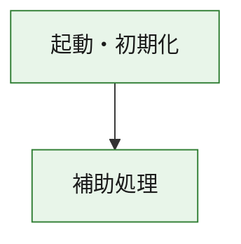
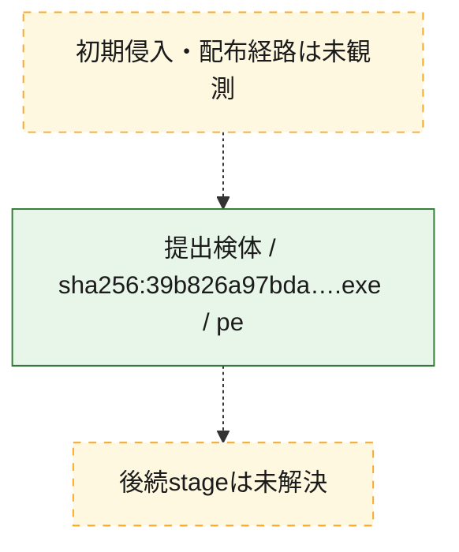
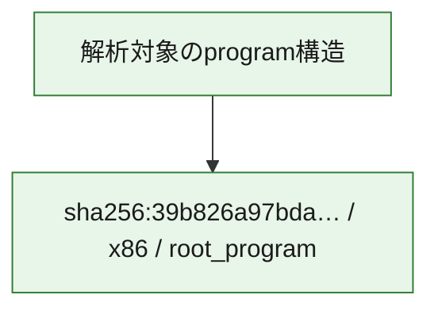

# 全体ロジック：39b826a97bda538d8d4670047c21ba156334f5c553cf189adbe5198a64e53826

代表関数の静的証跡から、起動・初期化の処理群を確認しました。

## 読み方

- phaseの掲載順は解析上の整理順です。observed_call_edgesがない段階間の実行順を断定しません。
- 図の実線は静的に観測した関係、点線と黄色のノードは未観測・未解決の関係を示します。
- 図は静的な要約であり、動的実行を再現するものではありません。
- 詳細な関数解説とfingerprintは[STATIC-LOGIC.md](STATIC-LOGIC.md)を参照してください。

## 静的可視化

### 実行フロー

### 感染チェーン

### モジュール関係

## 処理段階

### 1. 起動・初期化

entry pointから初期化と後続処理への移行を確認します。
確度: `confirmed_static_function_evidence`

- `39b826a97bda538d8d4670047c21ba156334f5c553cf189adbe5198a64e53826:ghidra:180001010` — 初期化と主要処理への分岐を行う入口関数です。 状態: `succeeded`、選定理由: `entry_point`, `meaningful_symbol_name`, `reviewed_call_centrality:22`, `role:entrypoint`, `small_program_complete_context`

### 2. 補助処理

主要処理を支える一般内部関数またはlibrary処理を確認します。
確度: `confirmed_static_function_evidence`

- `39b826a97bda538d8d4670047c21ba156334f5c553cf189adbe5198a64e53826:ghidra:180001240` — 検体内部の一般処理を実装する関数です。 状態: `succeeded`、選定理由: `context_representative`, `reviewed_call_centrality:2`, `small_program_complete_context`
- `39b826a97bda538d8d4670047c21ba156334f5c553cf189adbe5198a64e53826:ghidra:180001350` — 検体内部の一般処理を実装する関数です。 状態: `succeeded`、選定理由: `context_representative`, `reviewed_call_centrality:25`, `small_program_complete_context`
- `39b826a97bda538d8d4670047c21ba156334f5c553cf189adbe5198a64e53826:ghidra:180003780` — 検体内部の一般処理を実装する関数です。 状態: `succeeded`、選定理由: `context_representative`, `reviewed_call_centrality:2`, `small_program_complete_context`
- `39b826a97bda538d8d4670047c21ba156334f5c553cf189adbe5198a64e53826:ghidra:1800038e0` — 検体内部の一般処理を実装する関数です。 状態: `succeeded`、選定理由: `context_representative`, `reviewed_call_centrality:2`, `small_program_complete_context`

## 観測したcall関係

- `39b826a97bda538d8d4670047c21ba156334f5c553cf189adbe5198a64e53826:ghidra:180001010` → `39b826a97bda538d8d4670047c21ba156334f5c553cf189adbe5198a64e53826:ghidra:180001240` （`startup` → `support`）
- `39b826a97bda538d8d4670047c21ba156334f5c553cf189adbe5198a64e53826:ghidra:180001010` → `39b826a97bda538d8d4670047c21ba156334f5c553cf189adbe5198a64e53826:ghidra:180001350` （`startup` → `support`）
- `39b826a97bda538d8d4670047c21ba156334f5c553cf189adbe5198a64e53826:ghidra:180001350` → `39b826a97bda538d8d4670047c21ba156334f5c553cf189adbe5198a64e53826:ghidra:180001240` （`support` → `support`）
- `39b826a97bda538d8d4670047c21ba156334f5c553cf189adbe5198a64e53826:ghidra:180001350` → `39b826a97bda538d8d4670047c21ba156334f5c553cf189adbe5198a64e53826:ghidra:180003780` （`support` → `support`）
- `39b826a97bda538d8d4670047c21ba156334f5c553cf189adbe5198a64e53826:ghidra:180001350` → `39b826a97bda538d8d4670047c21ba156334f5c553cf189adbe5198a64e53826:ghidra:1800038e0` （`support` → `support`）
- `39b826a97bda538d8d4670047c21ba156334f5c553cf189adbe5198a64e53826:ghidra:180003780` → `39b826a97bda538d8d4670047c21ba156334f5c553cf189adbe5198a64e53826:ghidra:1800038e0` （`support` → `support`）
- `ghidra-function:0eb57ee588ec88c5207ba805` → `ghidra-function:1e5ced940da04166cba01b2d` （`unclassified` → `unclassified`）
- `ghidra-function:0eb57ee588ec88c5207ba805` → `ghidra-function:1f280f7f4136ba9df299a291` （`unclassified` → `unclassified`）
- `ghidra-function:0eb57ee588ec88c5207ba805` → `ghidra-function:78f62e2d53d4f9013a54e6ac` （`unclassified` → `unclassified`）
- `ghidra-function:0eb57ee588ec88c5207ba805` → `ghidra-function:91da274367264cdc9dc14ad8` （`unclassified` → `unclassified`）
- `ghidra-function:0eb57ee588ec88c5207ba805` → `ghidra-function:9f8af17ae39a3623111925ec` （`unclassified` → `unclassified`）
- `ghidra-function:0eb57ee588ec88c5207ba805` → `ghidra-function:a48d772770cde4e95f7e20e9` （`unclassified` → `unclassified`）
- `ghidra-function:0eb57ee588ec88c5207ba805` → `ghidra-function:a4f779ebec5e7b2821c0383e` （`unclassified` → `unclassified`）
- `ghidra-function:0eb57ee588ec88c5207ba805` → `ghidra-function:aff2c3fbfd46bfb57965be89` （`unclassified` → `unclassified`）
- `ghidra-function:0eb57ee588ec88c5207ba805` → `ghidra-function:ba1d62a5923311527190f4fa` （`unclassified` → `unclassified`）
- `ghidra-function:0eb57ee588ec88c5207ba805` → `ghidra-function:c6ac4e7aab5f475b48794998` （`unclassified` → `unclassified`）
- `ghidra-function:0eb57ee588ec88c5207ba805` → `ghidra-function:c9523629edab755254b0b1e9` （`unclassified` → `unclassified`）
- `ghidra-function:0eb57ee588ec88c5207ba805` → `ghidra-function:cfac7241ccf2e4f9a7dba2db` （`unclassified` → `unclassified`）
- `ghidra-function:1767816ee58099fa6471c4f1` → `ghidra-function:c7ef9a04f800a4bbe2d08b34` （`unclassified` → `unclassified`）
- `ghidra-function:1e5ced940da04166cba01b2d` → `ghidra-external:0d4ac469ea3d0c4d7a45d144` （`unclassified` → `unclassified`）
- `ghidra-function:1e5ced940da04166cba01b2d` → `ghidra-external:18f29808c8318290e33970e7` （`unclassified` → `unclassified`）
- `ghidra-function:1e5ced940da04166cba01b2d` → `ghidra-external:1b12406fb779b5d2bb37eb75` （`unclassified` → `unclassified`）
- `ghidra-function:1e5ced940da04166cba01b2d` → `ghidra-external:2e84cb97e8dec3e14d630312` （`unclassified` → `unclassified`）
- `ghidra-function:1e5ced940da04166cba01b2d` → `ghidra-external:33b80f5ce6985f71d4ad4396` （`unclassified` → `unclassified`）
- `ghidra-function:1e5ced940da04166cba01b2d` → `ghidra-external:36ae67f4ac10528defad30cb` （`unclassified` → `unclassified`）
- `ghidra-function:1e5ced940da04166cba01b2d` → `ghidra-external:657dd7ee4cc2979931921dff` （`unclassified` → `unclassified`）
- `ghidra-function:1e5ced940da04166cba01b2d` → `ghidra-external:66cabcc16a809cd97194d713` （`unclassified` → `unclassified`）
- `ghidra-function:1e5ced940da04166cba01b2d` → `ghidra-external:67f75c32d8ab82ed8ee2af05` （`unclassified` → `unclassified`）
- `ghidra-function:1e5ced940da04166cba01b2d` → `ghidra-external:6d96b6110e50869c88861c80` （`unclassified` → `unclassified`）
- `ghidra-function:1e5ced940da04166cba01b2d` → `ghidra-external:7aa3af9e58aa1a29ad931696` （`unclassified` → `unclassified`）
- `ghidra-function:1e5ced940da04166cba01b2d` → `ghidra-external:7dd43526ba32b0b41e2341a2` （`unclassified` → `unclassified`）
- `ghidra-function:1e5ced940da04166cba01b2d` → `ghidra-external:a0b08c662333d96ec5af21f1` （`unclassified` → `unclassified`）
- `ghidra-function:1e5ced940da04166cba01b2d` → `ghidra-external:a20f33d1b83d63d8e6cd96cb` （`unclassified` → `unclassified`）
- `ghidra-function:1e5ced940da04166cba01b2d` → `ghidra-external:ba78960d96c4465da9f67d1f` （`unclassified` → `unclassified`）
- `ghidra-function:1e5ced940da04166cba01b2d` → `ghidra-external:c0d7ed2fc305521e0d4ad01f` （`unclassified` → `unclassified`）
- `ghidra-function:1e5ced940da04166cba01b2d` → `ghidra-external:cff41cb2c91546a12852eff3` （`unclassified` → `unclassified`）
- `ghidra-function:1e5ced940da04166cba01b2d` → `ghidra-external:d748496061f591a2111ab377` （`unclassified` → `unclassified`）
- `ghidra-function:1e5ced940da04166cba01b2d` → `ghidra-external:dcb109f78602f3f7998fb37a` （`unclassified` → `unclassified`）
- `ghidra-function:1e5ced940da04166cba01b2d` → `ghidra-external:ed9423201a021e8bea43625a` （`unclassified` → `unclassified`）
- `ghidra-function:1e5ced940da04166cba01b2d` → `ghidra-external:fb6aacb3314aa6cb27270d2c` （`unclassified` → `unclassified`）
- `ghidra-function:1e5ced940da04166cba01b2d` → `ghidra-function:1767816ee58099fa6471c4f1` （`unclassified` → `unclassified`）
- `ghidra-function:1e5ced940da04166cba01b2d` → `ghidra-function:c7ef9a04f800a4bbe2d08b34` （`unclassified` → `unclassified`）
- `ghidra-function:1e5ced940da04166cba01b2d` → `ghidra-function:c9523629edab755254b0b1e9` （`unclassified` → `unclassified`）

## 解析範囲と制約

- 選定外関数は全体inventoryへ残しますが、関数本体の個別解説対象にはしていません。
- indirect call、難読化、packer、VM、壊れたcontrol flowによりcall関係が欠落する場合があります。
- 文書は静的解析に基づき、検体実行や外部通信による動的確認は行っていません。
