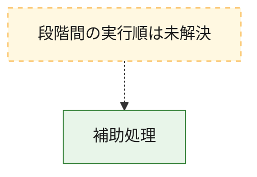
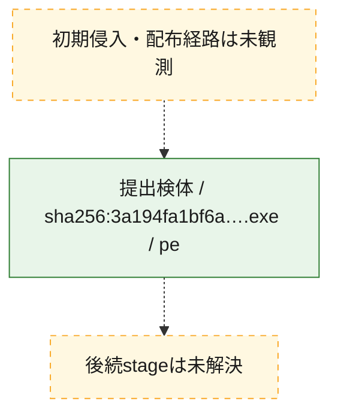
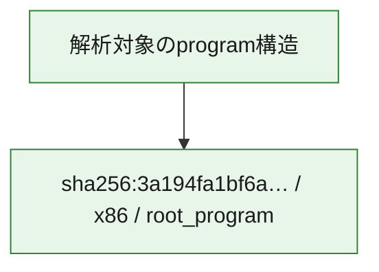

# 全体ロジック：3a194fa1bf6a0bbf7b9f164b5a81d6d4f8258c5aec5943db0b35977849950ad2

代表関数から主要なmalware処理段階を自動分類できませんでした。

## 読み方

- phaseの掲載順は解析上の整理順です。observed_call_edgesがない段階間の実行順を断定しません。
- 図の実線は静的に観測した関係、点線と黄色のノードは未観測・未解決の関係を示します。
- 図は静的な要約であり、動的実行を再現するものではありません。
- 詳細な関数解説とfingerprintは[STATIC-LOGIC.md](STATIC-LOGIC.md)を参照してください。

## 静的可視化

### 実行フロー

### 感染チェーン

### モジュール関係

## 処理段階

### 1. 補助処理

主要処理を支える一般内部関数またはlibrary処理を確認します。
確度: `confirmed_static_function_evidence_with_limits`

- `3a194fa1bf6a0bbf7b9f164b5a81d6d4f8258c5aec5943db0b35977849950ad2:ghidra:1400034b0` — 検体内部の一般処理を実装する関数です。 状態: `limited_bad_instruction_or_flow`、選定理由: `context_representative`, `reviewed_call_centrality:1`
- `3a194fa1bf6a0bbf7b9f164b5a81d6d4f8258c5aec5943db0b35977849950ad2:ghidra:1400034d4` — 検体内部の一般処理を実装する関数です。 状態: `limited_bad_instruction_or_flow`、選定理由: `context_representative`, `reviewed_call_centrality:1`
- `3a194fa1bf6a0bbf7b9f164b5a81d6d4f8258c5aec5943db0b35977849950ad2:ghidra:1400034f0` — 検体内部の一般処理を実装する関数です。 状態: `limited_bad_instruction_or_flow`、選定理由: `context_representative`, `reviewed_call_centrality:1`
- `3a194fa1bf6a0bbf7b9f164b5a81d6d4f8258c5aec5943db0b35977849950ad2:ghidra:1400035c0` — 検体内部の一般処理を実装する関数です。 状態: `limited_bad_instruction_or_flow`、選定理由: `context_representative`, `reviewed_call_centrality:1`
- `3a194fa1bf6a0bbf7b9f164b5a81d6d4f8258c5aec5943db0b35977849950ad2:ghidra:140003690` — 検体内部の一般処理を実装する関数です。 状態: `limited_bad_instruction_or_flow`、選定理由: `context_representative`, `reviewed_call_centrality:1`
- `3a194fa1bf6a0bbf7b9f164b5a81d6d4f8258c5aec5943db0b35977849950ad2:ghidra:1400038b8` — 検体内部の一般処理を実装する関数です。 状態: `limited_bad_instruction_or_flow`、選定理由: `context_representative`, `reviewed_call_centrality:1`
- `3a194fa1bf6a0bbf7b9f164b5a81d6d4f8258c5aec5943db0b35977849950ad2:ghidra:140003970` — 検体内部の一般処理を実装する関数です。 状態: `limited_bad_instruction_or_flow`、選定理由: `context_representative`, `reviewed_call_centrality:1`
- `3a194fa1bf6a0bbf7b9f164b5a81d6d4f8258c5aec5943db0b35977849950ad2:ghidra:140003a28` — 検体内部の一般処理を実装する関数です。 状態: `limited_bad_instruction_or_flow`、選定理由: `context_representative`, `reviewed_call_centrality:1`
- `3a194fa1bf6a0bbf7b9f164b5a81d6d4f8258c5aec5943db0b35977849950ad2:ghidra:140003ae0` — 検体内部の一般処理を実装する関数です。 状態: `limited_bad_instruction_or_flow`、選定理由: `context_representative`, `reviewed_call_centrality:1`
- `3a194fa1bf6a0bbf7b9f164b5a81d6d4f8258c5aec5943db0b35977849950ad2:ghidra:140003b9c` — 検体内部の一般処理を実装する関数です。 状態: `limited_bad_instruction_or_flow`、選定理由: `context_representative`, `reviewed_call_centrality:1`
- `3a194fa1bf6a0bbf7b9f164b5a81d6d4f8258c5aec5943db0b35977849950ad2:ghidra:140003c54` — 検体内部の一般処理を実装する関数です。 状態: `limited_bad_instruction_or_flow`、選定理由: `context_representative`, `reviewed_call_centrality:1`
- `3a194fa1bf6a0bbf7b9f164b5a81d6d4f8258c5aec5943db0b35977849950ad2:ghidra:140003cfc` — 検体内部の一般処理を実装する関数です。 状態: `limited_bad_instruction_or_flow`、選定理由: `context_representative`, `reviewed_call_centrality:1`
- `3a194fa1bf6a0bbf7b9f164b5a81d6d4f8258c5aec5943db0b35977849950ad2:ghidra:140003db4` — 検体内部の一般処理を実装する関数です。 状態: `limited_bad_instruction_or_flow`、選定理由: `context_representative`, `reviewed_call_centrality:1`
- `3a194fa1bf6a0bbf7b9f164b5a81d6d4f8258c5aec5943db0b35977849950ad2:ghidra:140003e6c` — 検体内部の一般処理を実装する関数です。 状態: `limited_bad_instruction_or_flow`、選定理由: `context_representative`, `reviewed_call_centrality:1`
- `3a194fa1bf6a0bbf7b9f164b5a81d6d4f8258c5aec5943db0b35977849950ad2:ghidra:140003ea0` — 検体内部の一般処理を実装する関数です。 状態: `limited_bad_instruction_or_flow`、選定理由: `context_representative`, `reviewed_call_centrality:1`
- `3a194fa1bf6a0bbf7b9f164b5a81d6d4f8258c5aec5943db0b35977849950ad2:ghidra:140003ed4` — 検体内部の一般処理を実装する関数です。 状態: `limited_bad_instruction_or_flow`、選定理由: `context_representative`, `reviewed_call_centrality:1`
- `3a194fa1bf6a0bbf7b9f164b5a81d6d4f8258c5aec5943db0b35977849950ad2:ghidra:140004798` — 検体内部の一般処理を実装する関数です。 状態: `limited_bad_instruction_or_flow`、選定理由: `context_representative`, `reviewed_call_centrality:1`
- `3a194fa1bf6a0bbf7b9f164b5a81d6d4f8258c5aec5943db0b35977849950ad2:ghidra:1400047b8` — 検体内部の一般処理を実装する関数です。 状態: `limited_bad_instruction_or_flow`、選定理由: `context_representative`, `reviewed_call_centrality:1`
- `3a194fa1bf6a0bbf7b9f164b5a81d6d4f8258c5aec5943db0b35977849950ad2:ghidra:140004824` — 検体内部の一般処理を実装する関数です。 状態: `limited_bad_instruction_or_flow`、選定理由: `context_representative`, `reviewed_call_centrality:1`
- `3a194fa1bf6a0bbf7b9f164b5a81d6d4f8258c5aec5943db0b35977849950ad2:ghidra:140004844` — 検体内部の一般処理を実装する関数です。 状態: `limited_bad_instruction_or_flow`、選定理由: `context_representative`, `reviewed_call_centrality:1`
- `3a194fa1bf6a0bbf7b9f164b5a81d6d4f8258c5aec5943db0b35977849950ad2:ghidra:140004880` — 検体内部の一般処理を実装する関数です。 状態: `limited_bad_instruction_or_flow`、選定理由: `context_representative`, `reviewed_call_centrality:1`
- `3a194fa1bf6a0bbf7b9f164b5a81d6d4f8258c5aec5943db0b35977849950ad2:ghidra:1400048bc` — 検体内部の一般処理を実装する関数です。 状態: `limited_bad_instruction_or_flow`、選定理由: `context_representative`, `reviewed_call_centrality:1`
- `3a194fa1bf6a0bbf7b9f164b5a81d6d4f8258c5aec5943db0b35977849950ad2:ghidra:140004908` — 検体内部の一般処理を実装する関数です。 状態: `limited_bad_instruction_or_flow`、選定理由: `context_representative`, `reviewed_call_centrality:1`
- `3a194fa1bf6a0bbf7b9f164b5a81d6d4f8258c5aec5943db0b35977849950ad2:ghidra:140004954` — 検体内部の一般処理を実装する関数です。 状態: `limited_bad_instruction_or_flow`、選定理由: `context_representative`, `reviewed_call_centrality:1`
- `3a194fa1bf6a0bbf7b9f164b5a81d6d4f8258c5aec5943db0b35977849950ad2:ghidra:140004a40` — 検体内部の一般処理を実装する関数です。 状態: `limited_bad_instruction_or_flow`、選定理由: `context_representative`, `reviewed_call_centrality:1`
- `3a194fa1bf6a0bbf7b9f164b5a81d6d4f8258c5aec5943db0b35977849950ad2:ghidra:140005a80` — 検体内部の一般処理を実装する関数です。 状態: `limited_bad_instruction_or_flow`、選定理由: `context_representative`, `reviewed_call_centrality:1`
- `3a194fa1bf6a0bbf7b9f164b5a81d6d4f8258c5aec5943db0b35977849950ad2:ghidra:140005b1c` — 検体内部の一般処理を実装する関数です。 状態: `limited_bad_instruction_or_flow`、選定理由: `context_representative`, `reviewed_call_centrality:1`
- `3a194fa1bf6a0bbf7b9f164b5a81d6d4f8258c5aec5943db0b35977849950ad2:ghidra:140005c24` — 検体内部の一般処理を実装する関数です。 状態: `limited_bad_instruction_or_flow`、選定理由: `context_representative`, `reviewed_call_centrality:1`
- `3a194fa1bf6a0bbf7b9f164b5a81d6d4f8258c5aec5943db0b35977849950ad2:ghidra:140005cb0` — 検体内部の一般処理を実装する関数です。 状態: `limited_bad_instruction_or_flow`、選定理由: `context_representative`, `reviewed_call_centrality:1`
- `3a194fa1bf6a0bbf7b9f164b5a81d6d4f8258c5aec5943db0b35977849950ad2:ghidra:140005d0c` — 検体内部の一般処理を実装する関数です。 状態: `limited_bad_instruction_or_flow`、選定理由: `context_representative`, `reviewed_call_centrality:1`
- `3a194fa1bf6a0bbf7b9f164b5a81d6d4f8258c5aec5943db0b35977849950ad2:ghidra:140005d6c` — 検体内部の一般処理を実装する関数です。 状態: `limited_bad_instruction_or_flow`、選定理由: `context_representative`, `reviewed_call_centrality:1`
- `3a194fa1bf6a0bbf7b9f164b5a81d6d4f8258c5aec5943db0b35977849950ad2:ghidra:140005dcc` — 検体内部の一般処理を実装する関数です。 状態: `limited_bad_instruction_or_flow`、選定理由: `context_representative`, `reviewed_call_centrality:1`

## 観測したcall関係

- `ghidra-function:0800a65c427eb3908a500042` → `ghidra-external:51fc96a46ccd98ee6d4e299b` （`unclassified` → `unclassified`）
- `ghidra-function:0c98866c236335d4eb8b08c6` → `ghidra-external:51fc96a46ccd98ee6d4e299b` （`unclassified` → `unclassified`）
- `ghidra-function:14b815bb6a9bebf73008eeb8` → `ghidra-external:51fc96a46ccd98ee6d4e299b` （`unclassified` → `unclassified`）
- `ghidra-function:18fa40ea8060161db2050314` → `ghidra-external:51fc96a46ccd98ee6d4e299b` （`unclassified` → `unclassified`）
- `ghidra-function:1c2dd81bfa1ee6763a583bcf` → `ghidra-external:51fc96a46ccd98ee6d4e299b` （`unclassified` → `unclassified`）
- `ghidra-function:2228b8a4a6857be2c51a1fdd` → `ghidra-external:51fc96a46ccd98ee6d4e299b` （`unclassified` → `unclassified`）
- `ghidra-function:248ff6431a0043a6bfd4f450` → `ghidra-external:51fc96a46ccd98ee6d4e299b` （`unclassified` → `unclassified`）
- `ghidra-function:2a0e58e50012fcc4f0cde1f4` → `ghidra-external:51fc96a46ccd98ee6d4e299b` （`unclassified` → `unclassified`）
- `ghidra-function:2e96cfd7bfff6e578218ed24` → `ghidra-external:51fc96a46ccd98ee6d4e299b` （`unclassified` → `unclassified`）
- `ghidra-function:50388f0b0a9835c70ba7f81b` → `ghidra-external:51fc96a46ccd98ee6d4e299b` （`unclassified` → `unclassified`）
- `ghidra-function:53e184cb4b01e950cf0f8f58` → `ghidra-external:51fc96a46ccd98ee6d4e299b` （`unclassified` → `unclassified`）
- `ghidra-function:60621b03224ec2be7ddf755d` → `ghidra-external:51fc96a46ccd98ee6d4e299b` （`unclassified` → `unclassified`）
- `ghidra-function:65f5b1a2c157844245bd8c9f` → `ghidra-external:51fc96a46ccd98ee6d4e299b` （`unclassified` → `unclassified`）
- `ghidra-function:682891902a9fa2cdd16d5104` → `ghidra-external:51fc96a46ccd98ee6d4e299b` （`unclassified` → `unclassified`）
- `ghidra-function:724cceb0f7fe0da1e424d26d` → `ghidra-external:51fc96a46ccd98ee6d4e299b` （`unclassified` → `unclassified`）
- `ghidra-function:766c462bcea2e32507651eb7` → `ghidra-external:51fc96a46ccd98ee6d4e299b` （`unclassified` → `unclassified`）
- `ghidra-function:7d510869b750d82b39731a87` → `ghidra-external:51fc96a46ccd98ee6d4e299b` （`unclassified` → `unclassified`）
- `ghidra-function:81fcbb15dff47fe6ae2bc334` → `ghidra-external:51fc96a46ccd98ee6d4e299b` （`unclassified` → `unclassified`）
- `ghidra-function:9341a315f7e8df9399ef75b6` → `ghidra-external:51fc96a46ccd98ee6d4e299b` （`unclassified` → `unclassified`）
- `ghidra-function:95dba93469d9df5fbc29b42e` → `ghidra-external:51fc96a46ccd98ee6d4e299b` （`unclassified` → `unclassified`）
- `ghidra-function:9616ba525b52e014f7e67637` → `ghidra-external:51fc96a46ccd98ee6d4e299b` （`unclassified` → `unclassified`）
- `ghidra-function:9a654cf75f38bb5e1721f3bf` → `ghidra-external:51fc96a46ccd98ee6d4e299b` （`unclassified` → `unclassified`）
- `ghidra-function:9c8ef7b06accf9f7d5a0d7eb` → `ghidra-external:51fc96a46ccd98ee6d4e299b` （`unclassified` → `unclassified`）
- `ghidra-function:a9954b38477afdced0bc0ba1` → `ghidra-external:51fc96a46ccd98ee6d4e299b` （`unclassified` → `unclassified`）
- `ghidra-function:b68909b9cda1dd54010f53b0` → `ghidra-external:51fc96a46ccd98ee6d4e299b` （`unclassified` → `unclassified`）
- `ghidra-function:bb3e658f506adb4a38c1ba61` → `ghidra-external:51fc96a46ccd98ee6d4e299b` （`unclassified` → `unclassified`）
- `ghidra-function:bf844cfa5a26455279ea1429` → `ghidra-external:51fc96a46ccd98ee6d4e299b` （`unclassified` → `unclassified`）
- `ghidra-function:c5232c5150f057454f6bed8f` → `ghidra-external:51fc96a46ccd98ee6d4e299b` （`unclassified` → `unclassified`）
- `ghidra-function:c52d9c50f57bb223547e14e5` → `ghidra-external:51fc96a46ccd98ee6d4e299b` （`unclassified` → `unclassified`）
- `ghidra-function:e43da704652ca881c534d4a3` → `ghidra-external:51fc96a46ccd98ee6d4e299b` （`unclassified` → `unclassified`）
- `ghidra-function:e72519f90414dc191ca75da1` → `ghidra-external:51fc96a46ccd98ee6d4e299b` （`unclassified` → `unclassified`）
- `ghidra-function:f21a294ce36f963af0b992b9` → `ghidra-external:51fc96a46ccd98ee6d4e299b` （`unclassified` → `unclassified`）

## 解析範囲と制約

- 選定外関数は全体inventoryへ残しますが、関数本体の個別解説対象にはしていません。
- indirect call、難読化、packer、VM、壊れたcontrol flowによりcall関係が欠落する場合があります。
- 文書は静的解析に基づき、検体実行や外部通信による動的確認は行っていません。
