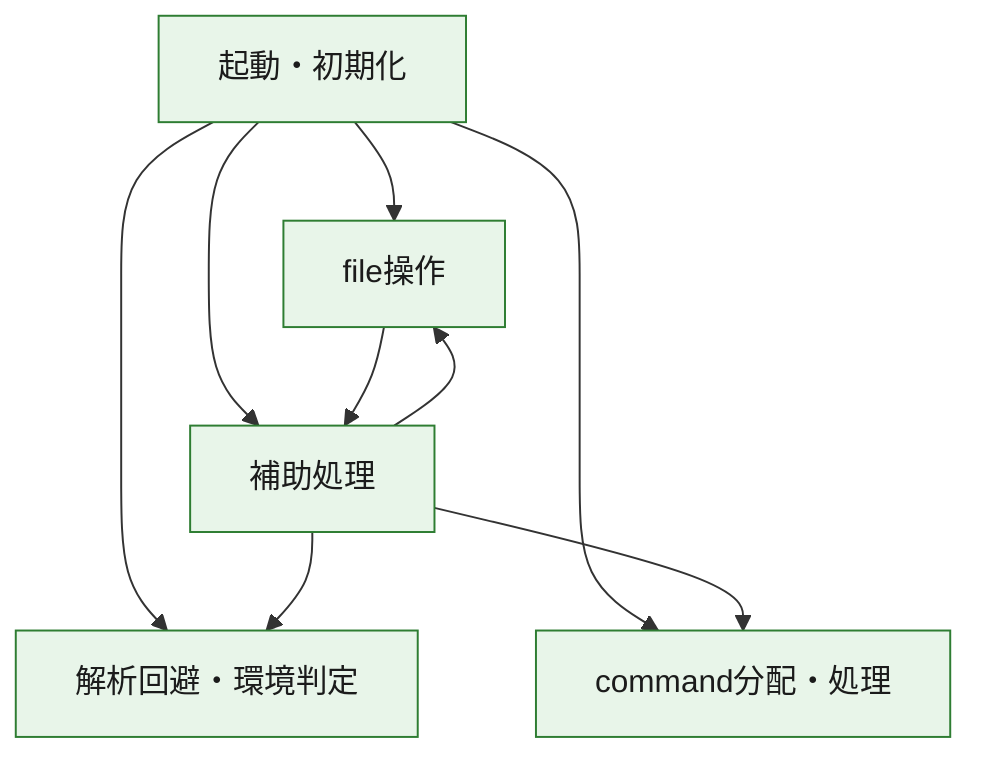
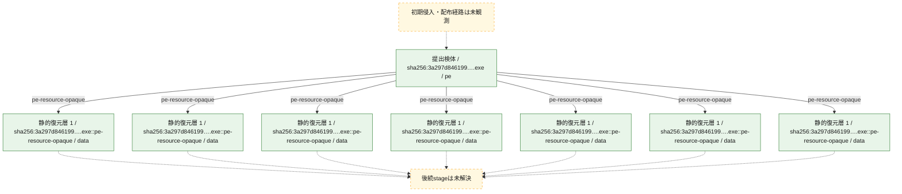
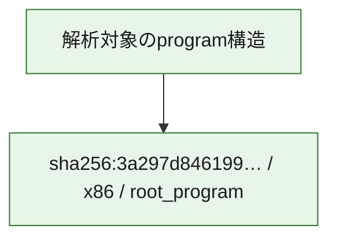

# 全体ロジック：3a297d846199ddff323b30eadb510daedbbd08a9e76949c06df09e1592dd0f02

代表関数の静的証跡から、起動・初期化、解析回避・環境判定、command分配・処理、file操作の処理群を確認しました。

## 読み方

- phaseの掲載順は解析上の整理順です。observed_call_edgesがない段階間の実行順を断定しません。
- 図の実線は静的に観測した関係、点線と黄色のノードは未観測・未解決の関係を示します。
- 図は静的な要約であり、動的実行を再現するものではありません。
- 詳細な関数解説とfingerprintは[STATIC-LOGIC.md](STATIC-LOGIC.md)を参照してください。

## 静的可視化

### 実行フロー

### 感染チェーン

### モジュール関係

## 処理段階

### 1. 起動・初期化

entry pointから初期化と後続処理への移行を確認します。
確度: `confirmed_static_function_evidence`

- `3a297d846199ddff323b30eadb510daedbbd08a9e76949c06df09e1592dd0f02:ghidra:140001708` — 初期化と主要処理への分岐を行う入口関数です。 状態: `succeeded`、選定理由: `entry_point`, `meaningful_symbol_name`, `reviewed_call_centrality:22`, `role:entrypoint`

### 2. 解析回避・環境判定

debugger、sandbox、仮想環境、時間差などの判定を確認します。
確度: `confirmed_static_function_evidence`

- `3a297d846199ddff323b30eadb510daedbbd08a9e76949c06df09e1592dd0f02:ghidra:140001c08` — debugger、仮想環境、sandbox、または時間差の確認に関係する関数です。 状態: `succeeded`、選定理由: `context_representative`, `reviewed_call_centrality:10`, `role:anti_analysis`
- `3a297d846199ddff323b30eadb510daedbbd08a9e76949c06df09e1592dd0f02:ghidra:140001d30` — debugger、仮想環境、sandbox、または時間差の確認に関係する関数です。 状態: `succeeded`、選定理由: `context_representative`, `reviewed_call_centrality:21`, `role:anti_analysis`

### 3. command分配・処理

受信commandやtaskの解釈、分配、個別handlerへの移行を確認します。
確度: `confirmed_static_function_evidence_with_limits`

- `3a297d846199ddff323b30eadb510daedbbd08a9e76949c06df09e1592dd0f02:ghidra:14000c2f0` — commandの解釈、分配、または個別処理を担当する関数です。 状態: `limited_bad_instruction_or_flow`、選定理由: `meaningful_symbol_name`, `reviewed_call_centrality:3`, `role:command_dispatch_or_handler`

### 4. file操作

fileやdirectoryの作成、読書き、削除を確認します。
確度: `confirmed_static_function_evidence`

- `3a297d846199ddff323b30eadb510daedbbd08a9e76949c06df09e1592dd0f02:ghidra:140001000` — fileまたはdirectoryの読書き・管理に関係する関数です。 状態: `succeeded`、選定理由: `context_representative`, `reviewed_call_centrality:39`, `role:file_operation`

### 5. 補助処理

主要処理を支える一般内部関数またはlibrary処理を確認します。
確度: `confirmed_static_function_evidence_with_limits`

- `3a297d846199ddff323b30eadb510daedbbd08a9e76949c06df09e1592dd0f02:ghidra:140001400` — 検体内部の一般処理を実装する関数です。 状態: `succeeded`、選定理由: `context_representative`, `reviewed_call_centrality:1`
- `3a297d846199ddff323b30eadb510daedbbd08a9e76949c06df09e1592dd0f02:ghidra:140001420` — 検体内部の一般処理を実装する関数です。 状態: `succeeded`、選定理由: `context_representative`, `reviewed_call_centrality:6`
- `3a297d846199ddff323b30eadb510daedbbd08a9e76949c06df09e1592dd0f02:ghidra:140001490` — 検体内部の一般処理を実装する関数です。 状態: `succeeded`、選定理由: `context_representative`, `reviewed_call_centrality:6`
- `3a297d846199ddff323b30eadb510daedbbd08a9e76949c06df09e1592dd0f02:ghidra:1400014b0` — 検体内部の一般処理を実装する関数です。 状態: `succeeded`、選定理由: `context_representative`, `reviewed_call_centrality:20`
- `3a297d846199ddff323b30eadb510daedbbd08a9e76949c06df09e1592dd0f02:ghidra:140001568` — 検体内部の一般処理を実装する関数です。 状態: `succeeded`、選定理由: `context_representative`, `reviewed_call_centrality:1`
- `3a297d846199ddff323b30eadb510daedbbd08a9e76949c06df09e1592dd0f02:ghidra:140001578` — 検体内部の一般処理を実装する関数です。 状態: `succeeded`、選定理由: `context_representative`, `reviewed_call_centrality:6`
- `3a297d846199ddff323b30eadb510daedbbd08a9e76949c06df09e1592dd0f02:ghidra:140001594` — 検体内部の一般処理を実装する関数です。 状態: `succeeded`、選定理由: `context_representative`, `reviewed_call_centrality:21`
- `3a297d846199ddff323b30eadb510daedbbd08a9e76949c06df09e1592dd0f02:ghidra:14000171c` — 検体内部の一般処理を実装する関数です。 状態: `limited_bad_instruction_or_flow`、選定理由: `context_representative`, `reviewed_call_centrality:12`
- `3a297d846199ddff323b30eadb510daedbbd08a9e76949c06df09e1592dd0f02:ghidra:140001750` — 検体内部の一般処理を実装する関数です。 状態: `succeeded`、選定理由: `context_representative`, `reviewed_call_centrality:5`
- `3a297d846199ddff323b30eadb510daedbbd08a9e76949c06df09e1592dd0f02:ghidra:140001824` — 検体内部の一般処理を実装する関数です。 状態: `succeeded`、選定理由: `context_representative`, `reviewed_call_centrality:1`
- `3a297d846199ddff323b30eadb510daedbbd08a9e76949c06df09e1592dd0f02:ghidra:140001838` — 検体内部の一般処理を実装する関数です。 状態: `succeeded`、選定理由: `context_representative`, `reviewed_call_centrality:6`
- `3a297d846199ddff323b30eadb510daedbbd08a9e76949c06df09e1592dd0f02:ghidra:1400018d4` — 検体内部の一般処理を実装する関数です。 状態: `succeeded`、選定理由: `context_representative`, `reviewed_call_centrality:7`
- `3a297d846199ddff323b30eadb510daedbbd08a9e76949c06df09e1592dd0f02:ghidra:140001944` — 検体内部の一般処理を実装する関数です。 状態: `succeeded`、選定理由: `context_representative`, `reviewed_call_centrality:9`
- `3a297d846199ddff323b30eadb510daedbbd08a9e76949c06df09e1592dd0f02:ghidra:1400019b8` — 検体内部の一般処理を実装する関数です。 状態: `succeeded`、選定理由: `context_representative`, `reviewed_call_centrality:5`
- `3a297d846199ddff323b30eadb510daedbbd08a9e76949c06df09e1592dd0f02:ghidra:1400019f4` — 検体内部の一般処理を実装する関数です。 状態: `succeeded`、選定理由: `context_representative`, `reviewed_call_centrality:6`
- `3a297d846199ddff323b30eadb510daedbbd08a9e76949c06df09e1592dd0f02:ghidra:140001a40` — 検体内部の一般処理を実装する関数です。 状態: `succeeded`、選定理由: `context_representative`, `reviewed_call_centrality:5`
- `3a297d846199ddff323b30eadb510daedbbd08a9e76949c06df09e1592dd0f02:ghidra:140001acc` — 検体内部の一般処理を実装する関数です。 状態: `succeeded`、選定理由: `context_representative`, `reviewed_call_centrality:4`
- `3a297d846199ddff323b30eadb510daedbbd08a9e76949c06df09e1592dd0f02:ghidra:140001b64` — 検体内部の一般処理を実装する関数です。 状態: `succeeded`、選定理由: `context_representative`, `reviewed_call_centrality:5`
- `3a297d846199ddff323b30eadb510daedbbd08a9e76949c06df09e1592dd0f02:ghidra:140001b88` — 検体内部の一般処理を実装する関数です。 状態: `succeeded`、選定理由: `context_representative`, `reviewed_call_centrality:4`
- `3a297d846199ddff323b30eadb510daedbbd08a9e76949c06df09e1592dd0f02:ghidra:140001bb4` — 検体内部の一般処理を実装する関数です。 状態: `succeeded`、選定理由: `context_representative`, `reviewed_call_centrality:3`
- `3a297d846199ddff323b30eadb510daedbbd08a9e76949c06df09e1592dd0f02:ghidra:140001bf0` — 検体内部の一般処理を実装する関数です。 状態: `succeeded`、選定理由: `context_representative`, `reviewed_call_centrality:2`
- `3a297d846199ddff323b30eadb510daedbbd08a9e76949c06df09e1592dd0f02:ghidra:140001cdc` — 検体内部の一般処理を実装する関数です。 状態: `succeeded`、選定理由: `meaningful_symbol_name`, `reviewed_call_centrality:1`
- `3a297d846199ddff323b30eadb510daedbbd08a9e76949c06df09e1592dd0f02:ghidra:140001cf0` — 検体内部の一般処理を実装する関数です。 状態: `succeeded`、選定理由: `context_representative`, `reviewed_call_centrality:3`
- `3a297d846199ddff323b30eadb510daedbbd08a9e76949c06df09e1592dd0f02:ghidra:140001e7c` — 検体内部の一般処理を実装する関数です。 状態: `succeeded`、選定理由: `context_representative`, `reviewed_call_centrality:5`
- `3a297d846199ddff323b30eadb510daedbbd08a9e76949c06df09e1592dd0f02:ghidra:140001ec0` — 検体内部の一般処理を実装する関数です。 状態: `succeeded`、選定理由: `context_representative`, `reviewed_call_centrality:4`
- `3a297d846199ddff323b30eadb510daedbbd08a9e76949c06df09e1592dd0f02:ghidra:140001f24` — 検体内部の一般処理を実装する関数です。 状態: `succeeded`、選定理由: `context_representative`, `reviewed_call_centrality:4`
- `3a297d846199ddff323b30eadb510daedbbd08a9e76949c06df09e1592dd0f02:ghidra:140001f80` — 検体内部の一般処理を実装する関数です。 状態: `succeeded`、選定理由: `context_representative`, `reviewed_call_centrality:2`

## 観測したcall関係

- `3a297d846199ddff323b30eadb510daedbbd08a9e76949c06df09e1592dd0f02:ghidra:140001000` → `3a297d846199ddff323b30eadb510daedbbd08a9e76949c06df09e1592dd0f02:ghidra:140001490` （`file_activity` → `support`）
- `3a297d846199ddff323b30eadb510daedbbd08a9e76949c06df09e1592dd0f02:ghidra:140001400` → `3a297d846199ddff323b30eadb510daedbbd08a9e76949c06df09e1592dd0f02:ghidra:140001420` （`support` → `support`）
- `3a297d846199ddff323b30eadb510daedbbd08a9e76949c06df09e1592dd0f02:ghidra:140001420` → `3a297d846199ddff323b30eadb510daedbbd08a9e76949c06df09e1592dd0f02:ghidra:14000171c` （`support` → `support`）
- `3a297d846199ddff323b30eadb510daedbbd08a9e76949c06df09e1592dd0f02:ghidra:140001420` → `3a297d846199ddff323b30eadb510daedbbd08a9e76949c06df09e1592dd0f02:ghidra:140001944` （`support` → `support`）
- `3a297d846199ddff323b30eadb510daedbbd08a9e76949c06df09e1592dd0f02:ghidra:140001490` → `3a297d846199ddff323b30eadb510daedbbd08a9e76949c06df09e1592dd0f02:ghidra:14000171c` （`support` → `support`）
- `3a297d846199ddff323b30eadb510daedbbd08a9e76949c06df09e1592dd0f02:ghidra:140001490` → `3a297d846199ddff323b30eadb510daedbbd08a9e76949c06df09e1592dd0f02:ghidra:140001944` （`support` → `support`）
- `3a297d846199ddff323b30eadb510daedbbd08a9e76949c06df09e1592dd0f02:ghidra:1400014b0` → `3a297d846199ddff323b30eadb510daedbbd08a9e76949c06df09e1592dd0f02:ghidra:140001a40` （`support` → `support`）
- `3a297d846199ddff323b30eadb510daedbbd08a9e76949c06df09e1592dd0f02:ghidra:1400014b0` → `3a297d846199ddff323b30eadb510daedbbd08a9e76949c06df09e1592dd0f02:ghidra:140001bf0` （`support` → `support`）
- `3a297d846199ddff323b30eadb510daedbbd08a9e76949c06df09e1592dd0f02:ghidra:1400014b0` → `3a297d846199ddff323b30eadb510daedbbd08a9e76949c06df09e1592dd0f02:ghidra:140001cdc` （`support` → `support`）
- `3a297d846199ddff323b30eadb510daedbbd08a9e76949c06df09e1592dd0f02:ghidra:1400014b0` → `3a297d846199ddff323b30eadb510daedbbd08a9e76949c06df09e1592dd0f02:ghidra:140001d30` （`support` → `evasion`）
- `3a297d846199ddff323b30eadb510daedbbd08a9e76949c06df09e1592dd0f02:ghidra:1400014b0` → `3a297d846199ddff323b30eadb510daedbbd08a9e76949c06df09e1592dd0f02:ghidra:140001f80` （`support` → `support`）
- `3a297d846199ddff323b30eadb510daedbbd08a9e76949c06df09e1592dd0f02:ghidra:140001568` → `3a297d846199ddff323b30eadb510daedbbd08a9e76949c06df09e1592dd0f02:ghidra:140001cf0` （`support` → `support`）
- `3a297d846199ddff323b30eadb510daedbbd08a9e76949c06df09e1592dd0f02:ghidra:140001594` → `3a297d846199ddff323b30eadb510daedbbd08a9e76949c06df09e1592dd0f02:ghidra:140001000` （`support` → `file_activity`）
- `3a297d846199ddff323b30eadb510daedbbd08a9e76949c06df09e1592dd0f02:ghidra:140001594` → `3a297d846199ddff323b30eadb510daedbbd08a9e76949c06df09e1592dd0f02:ghidra:1400019b8` （`support` → `support`）
- `3a297d846199ddff323b30eadb510daedbbd08a9e76949c06df09e1592dd0f02:ghidra:140001594` → `3a297d846199ddff323b30eadb510daedbbd08a9e76949c06df09e1592dd0f02:ghidra:1400019f4` （`support` → `support`）
- `3a297d846199ddff323b30eadb510daedbbd08a9e76949c06df09e1592dd0f02:ghidra:140001594` → `3a297d846199ddff323b30eadb510daedbbd08a9e76949c06df09e1592dd0f02:ghidra:140001acc` （`support` → `support`）
- `3a297d846199ddff323b30eadb510daedbbd08a9e76949c06df09e1592dd0f02:ghidra:140001594` → `3a297d846199ddff323b30eadb510daedbbd08a9e76949c06df09e1592dd0f02:ghidra:140001b64` （`support` → `support`）
- `3a297d846199ddff323b30eadb510daedbbd08a9e76949c06df09e1592dd0f02:ghidra:140001594` → `3a297d846199ddff323b30eadb510daedbbd08a9e76949c06df09e1592dd0f02:ghidra:140001b88` （`support` → `support`）
- `3a297d846199ddff323b30eadb510daedbbd08a9e76949c06df09e1592dd0f02:ghidra:140001594` → `3a297d846199ddff323b30eadb510daedbbd08a9e76949c06df09e1592dd0f02:ghidra:140001d30` （`support` → `evasion`）
- `3a297d846199ddff323b30eadb510daedbbd08a9e76949c06df09e1592dd0f02:ghidra:140001594` → `3a297d846199ddff323b30eadb510daedbbd08a9e76949c06df09e1592dd0f02:ghidra:140001e7c` （`support` → `support`）
- `3a297d846199ddff323b30eadb510daedbbd08a9e76949c06df09e1592dd0f02:ghidra:140001594` → `3a297d846199ddff323b30eadb510daedbbd08a9e76949c06df09e1592dd0f02:ghidra:140001ec0` （`support` → `support`）
- `3a297d846199ddff323b30eadb510daedbbd08a9e76949c06df09e1592dd0f02:ghidra:140001594` → `3a297d846199ddff323b30eadb510daedbbd08a9e76949c06df09e1592dd0f02:ghidra:14000c2f0` （`support` → `dispatch`）
- `3a297d846199ddff323b30eadb510daedbbd08a9e76949c06df09e1592dd0f02:ghidra:140001708` → `3a297d846199ddff323b30eadb510daedbbd08a9e76949c06df09e1592dd0f02:ghidra:140001000` （`startup` → `file_activity`）
- `3a297d846199ddff323b30eadb510daedbbd08a9e76949c06df09e1592dd0f02:ghidra:140001708` → `3a297d846199ddff323b30eadb510daedbbd08a9e76949c06df09e1592dd0f02:ghidra:1400019b8` （`startup` → `support`）
- `3a297d846199ddff323b30eadb510daedbbd08a9e76949c06df09e1592dd0f02:ghidra:140001708` → `3a297d846199ddff323b30eadb510daedbbd08a9e76949c06df09e1592dd0f02:ghidra:1400019f4` （`startup` → `support`）
- `3a297d846199ddff323b30eadb510daedbbd08a9e76949c06df09e1592dd0f02:ghidra:140001708` → `3a297d846199ddff323b30eadb510daedbbd08a9e76949c06df09e1592dd0f02:ghidra:140001acc` （`startup` → `support`）
- `3a297d846199ddff323b30eadb510daedbbd08a9e76949c06df09e1592dd0f02:ghidra:140001708` → `3a297d846199ddff323b30eadb510daedbbd08a9e76949c06df09e1592dd0f02:ghidra:140001b64` （`startup` → `support`）
- `3a297d846199ddff323b30eadb510daedbbd08a9e76949c06df09e1592dd0f02:ghidra:140001708` → `3a297d846199ddff323b30eadb510daedbbd08a9e76949c06df09e1592dd0f02:ghidra:140001b88` （`startup` → `support`）
- `3a297d846199ddff323b30eadb510daedbbd08a9e76949c06df09e1592dd0f02:ghidra:140001708` → `3a297d846199ddff323b30eadb510daedbbd08a9e76949c06df09e1592dd0f02:ghidra:140001c08` （`startup` → `evasion`）
- `3a297d846199ddff323b30eadb510daedbbd08a9e76949c06df09e1592dd0f02:ghidra:140001708` → `3a297d846199ddff323b30eadb510daedbbd08a9e76949c06df09e1592dd0f02:ghidra:140001d30` （`startup` → `evasion`）
- `3a297d846199ddff323b30eadb510daedbbd08a9e76949c06df09e1592dd0f02:ghidra:140001708` → `3a297d846199ddff323b30eadb510daedbbd08a9e76949c06df09e1592dd0f02:ghidra:140001e7c` （`startup` → `support`）
- `3a297d846199ddff323b30eadb510daedbbd08a9e76949c06df09e1592dd0f02:ghidra:140001708` → `3a297d846199ddff323b30eadb510daedbbd08a9e76949c06df09e1592dd0f02:ghidra:140001ec0` （`startup` → `support`）
- `3a297d846199ddff323b30eadb510daedbbd08a9e76949c06df09e1592dd0f02:ghidra:140001708` → `3a297d846199ddff323b30eadb510daedbbd08a9e76949c06df09e1592dd0f02:ghidra:14000c2f0` （`startup` → `dispatch`）
- `3a297d846199ddff323b30eadb510daedbbd08a9e76949c06df09e1592dd0f02:ghidra:140001750` → `3a297d846199ddff323b30eadb510daedbbd08a9e76949c06df09e1592dd0f02:ghidra:14000171c` （`support` → `support`）
- `3a297d846199ddff323b30eadb510daedbbd08a9e76949c06df09e1592dd0f02:ghidra:140001750` → `3a297d846199ddff323b30eadb510daedbbd08a9e76949c06df09e1592dd0f02:ghidra:140001944` （`support` → `support`）
- `3a297d846199ddff323b30eadb510daedbbd08a9e76949c06df09e1592dd0f02:ghidra:140001824` → `3a297d846199ddff323b30eadb510daedbbd08a9e76949c06df09e1592dd0f02:ghidra:140001838` （`support` → `support`）
- `3a297d846199ddff323b30eadb510daedbbd08a9e76949c06df09e1592dd0f02:ghidra:140001838` → `3a297d846199ddff323b30eadb510daedbbd08a9e76949c06df09e1592dd0f02:ghidra:14000171c` （`support` → `support`）
- `3a297d846199ddff323b30eadb510daedbbd08a9e76949c06df09e1592dd0f02:ghidra:140001838` → `3a297d846199ddff323b30eadb510daedbbd08a9e76949c06df09e1592dd0f02:ghidra:1400018d4` （`support` → `support`）
- `3a297d846199ddff323b30eadb510daedbbd08a9e76949c06df09e1592dd0f02:ghidra:140001a40` → `3a297d846199ddff323b30eadb510daedbbd08a9e76949c06df09e1592dd0f02:ghidra:140001d30` （`support` → `evasion`）
- `3a297d846199ddff323b30eadb510daedbbd08a9e76949c06df09e1592dd0f02:ghidra:140001bf0` → `3a297d846199ddff323b30eadb510daedbbd08a9e76949c06df09e1592dd0f02:ghidra:140001bb4` （`support` → `support`）
- `3a297d846199ddff323b30eadb510daedbbd08a9e76949c06df09e1592dd0f02:ghidra:140001f80` → `3a297d846199ddff323b30eadb510daedbbd08a9e76949c06df09e1592dd0f02:ghidra:14000c2f0` （`support` → `dispatch`）
- `ghidra-function:02e5ff6862abff2c22460f58` → `ghidra-function:50419c2b995e184cbfabd073` （`unclassified` → `unclassified`）
- `ghidra-function:06012e8e5dd74a1b692cebc7` → `ghidra-external:269ea728962a5df370a3366d` （`unclassified` → `unclassified`）
- `ghidra-function:06012e8e5dd74a1b692cebc7` → `ghidra-external:2bc70941e6057c8a725158d9` （`unclassified` → `unclassified`）
- `ghidra-function:06012e8e5dd74a1b692cebc7` → `ghidra-external:e43e1d46e2b3d7d24f28b91d` （`unclassified` → `unclassified`）
- `ghidra-function:06012e8e5dd74a1b692cebc7` → `ghidra-function:2bab553245f0d9f0d27a2051` （`unclassified` → `unclassified`）
- `ghidra-function:154d1a943110d9466a811829` → `ghidra-function:2ba8eccffb8c04dad0e68c8f` （`unclassified` → `unclassified`）
- `ghidra-function:1e4c4805eb97d4939b0b703d` → `ghidra-function:017d3ee3c8d8bae750f0af8a` （`unclassified` → `unclassified`）
- `ghidra-function:1e4c4805eb97d4939b0b703d` → `ghidra-function:04e8ed7010cdb291adce89e7` （`unclassified` → `unclassified`）
- `ghidra-function:1e4c4805eb97d4939b0b703d` → `ghidra-function:2e8908936f7118e1d6eb22a3` （`unclassified` → `unclassified`）
- `ghidra-function:1e4c4805eb97d4939b0b703d` → `ghidra-function:73ca149e1570e7df6918a6ee` （`unclassified` → `unclassified`）
- `ghidra-function:210b13a9278a2a8140aba4d9` → `ghidra-external:2bc70941e6057c8a725158d9` （`unclassified` → `unclassified`）
- `ghidra-function:210b13a9278a2a8140aba4d9` → `ghidra-function:1e4c4805eb97d4939b0b703d` （`unclassified` → `unclassified`）
- `ghidra-function:210b13a9278a2a8140aba4d9` → `ghidra-function:4362ec4e0fc5c5311d21c22c` （`unclassified` → `unclassified`）
- `ghidra-function:210b13a9278a2a8140aba4d9` → `ghidra-function:5433e4ae6dc08dc22331791b` （`unclassified` → `unclassified`）
- `ghidra-function:21236e30924c1234416369f9` → `ghidra-external:48cb1dea83104784651305b8` （`unclassified` → `unclassified`）
- `ghidra-function:21236e30924c1234416369f9` → `ghidra-external:4f8916ce95f55b1c2a02a75d` （`unclassified` → `unclassified`）
- `ghidra-function:2bab553245f0d9f0d27a2051` → `ghidra-external:2bc70941e6057c8a725158d9` （`unclassified` → `unclassified`）
- `ghidra-function:2bab553245f0d9f0d27a2051` → `ghidra-external:d87af222ed0a7ac50ed1a3ad` （`unclassified` → `unclassified`）
- `ghidra-function:2bab553245f0d9f0d27a2051` → `ghidra-function:04e8ed7010cdb291adce89e7` （`unclassified` → `unclassified`）
- `ghidra-function:2bab553245f0d9f0d27a2051` → `ghidra-function:2126d4cc8c2df819218e8844` （`unclassified` → `unclassified`）
- `ghidra-function:2bab553245f0d9f0d27a2051` → `ghidra-function:5433e4ae6dc08dc22331791b` （`unclassified` → `unclassified`）
- `ghidra-function:2bab553245f0d9f0d27a2051` → `ghidra-function:5803ebead7bfa74272cca0ed` （`unclassified` → `unclassified`）
- `ghidra-function:2bab553245f0d9f0d27a2051` → `ghidra-function:73ca149e1570e7df6918a6ee` （`unclassified` → `unclassified`）
- `ghidra-function:2bab553245f0d9f0d27a2051` → `ghidra-function:7dab811c4a8a2bae12177803` （`unclassified` → `unclassified`）
- `ghidra-function:2bab553245f0d9f0d27a2051` → `ghidra-function:8ed5b8d934255134fbc7d630` （`unclassified` → `unclassified`）
- `ghidra-function:2bab553245f0d9f0d27a2051` → `ghidra-function:9b297874f467b046ef39df46` （`unclassified` → `unclassified`）
- `ghidra-function:2cf152fe992bf246d5f58314` → `ghidra-function:c95e401fd867c4662a103c28` （`unclassified` → `unclassified`）
- `ghidra-function:2e60b37c18f21b5be2af53df` → `ghidra-function:cf55c8d03b9a8b2e02c2f726` （`unclassified` → `unclassified`）
- `ghidra-function:2e7a74dcc9b98d4acb410329` → `ghidra-external:09d34e39185d901aee5d043c` （`unclassified` → `unclassified`）
- `ghidra-function:2e7a74dcc9b98d4acb410329` → `ghidra-external:5b0eabc98283e2f10aae5ef5` （`unclassified` → `unclassified`）
- `ghidra-function:2e7a74dcc9b98d4acb410329` → `ghidra-external:d0701d7a1e3843cf26349b15` （`unclassified` → `unclassified`）
- `ghidra-function:2e7a74dcc9b98d4acb410329` → `ghidra-external:d33a8c72bcd28d696dbc520c` （`unclassified` → `unclassified`）
- `ghidra-function:2e7a74dcc9b98d4acb410329` → `ghidra-function:3cc6accf79a8adf414d9b95e` （`unclassified` → `unclassified`）
- `ghidra-function:2e7a74dcc9b98d4acb410329` → `ghidra-function:ed6a9365c01eb533f0afb2b5` （`unclassified` → `unclassified`）
- `ghidra-function:348e43a62eb1aff66d279bbf` → `ghidra-external:2bc70941e6057c8a725158d9` （`unclassified` → `unclassified`）
- `ghidra-function:348e43a62eb1aff66d279bbf` → `ghidra-function:1e4c4805eb97d4939b0b703d` （`unclassified` → `unclassified`）
- `ghidra-function:348e43a62eb1aff66d279bbf` → `ghidra-function:4362ec4e0fc5c5311d21c22c` （`unclassified` → `unclassified`）
- `ghidra-function:348e43a62eb1aff66d279bbf` → `ghidra-function:5433e4ae6dc08dc22331791b` （`unclassified` → `unclassified`）
- `ghidra-function:4362ec4e0fc5c5311d21c22c` → `ghidra-function:2126d4cc8c2df819218e8844` （`unclassified` → `unclassified`）
- `ghidra-function:4362ec4e0fc5c5311d21c22c` → `ghidra-function:5803ebead7bfa74272cca0ed` （`unclassified` → `unclassified`）
- `ghidra-function:4362ec4e0fc5c5311d21c22c` → `ghidra-function:7dab811c4a8a2bae12177803` （`unclassified` → `unclassified`）
- `ghidra-function:925d97a8310ec1d45ed8a72f` → `ghidra-external:9a20554ecb148672621b5baa` （`unclassified` → `unclassified`）
- `ghidra-function:925d97a8310ec1d45ed8a72f` → `ghidra-function:832b871006d845a896f7ae8d` （`unclassified` → `unclassified`）
- `ghidra-function:925d97a8310ec1d45ed8a72f` → `ghidra-function:9896c5c61d185af2b05e0d7e` （`unclassified` → `unclassified`）
- `ghidra-function:925d97a8310ec1d45ed8a72f` → `ghidra-function:c6a503b4d7640d1112b76933` （`unclassified` → `unclassified`）
- `ghidra-function:979bc37c28886ce33362d068` → `ghidra-external:4b5e18b3e7970ce1ff82887f` （`unclassified` → `unclassified`）
- `ghidra-function:979bc37c28886ce33362d068` → `ghidra-function:0075924f54a24f26bc5e674c` （`unclassified` → `unclassified`）
- `ghidra-function:979bc37c28886ce33362d068` → `ghidra-function:398d15d949891b3728fa4729` （`unclassified` → `unclassified`）
- `ghidra-function:979bc37c28886ce33362d068` → `ghidra-function:72ff7b40fc09f0a2a6616283` （`unclassified` → `unclassified`）
- `ghidra-function:979bc37c28886ce33362d068` → `ghidra-function:f40253ffd8e6d732c783727a` （`unclassified` → `unclassified`）
- `ghidra-function:9aebe12a38d28f3e57cb9532` → `ghidra-function:348e43a62eb1aff66d279bbf` （`unclassified` → `unclassified`）
- `ghidra-function:a8f00d645d00db9da5b10e69` → `ghidra-external:2bc70941e6057c8a725158d9` （`unclassified` → `unclassified`）
- `ghidra-function:a8f00d645d00db9da5b10e69` → `ghidra-function:3e473229c8a2495a7a44f738` （`unclassified` → `unclassified`）
- `ghidra-function:a8f00d645d00db9da5b10e69` → `ghidra-function:57a2412f7c6a3c0299d3e8bd` （`unclassified` → `unclassified`）
- `ghidra-function:a8f00d645d00db9da5b10e69` → `ghidra-function:69ae2eb27787d4fd4e16a9d3` （`unclassified` → `unclassified`）
- `ghidra-function:b17f012cd1cbbfef48fc8d2f` → `ghidra-external:269ea728962a5df370a3366d` （`unclassified` → `unclassified`）
- `ghidra-function:b17f012cd1cbbfef48fc8d2f` → `ghidra-external:5b0eabc98283e2f10aae5ef5` （`unclassified` → `unclassified`）
- `ghidra-function:b17f012cd1cbbfef48fc8d2f` → `ghidra-external:d33a8c72bcd28d696dbc520c` （`unclassified` → `unclassified`）
- `ghidra-function:b60061a0ad49faad2be40529` → `ghidra-function:1ee76aaf345575cec17faaa3` （`unclassified` → `unclassified`）
- `ghidra-function:b60061a0ad49faad2be40529` → `ghidra-function:832b871006d845a896f7ae8d` （`unclassified` → `unclassified`）
- `ghidra-function:ba66683d573cac4a80dcf4ed` → `ghidra-external:2bc70941e6057c8a725158d9` （`unclassified` → `unclassified`）
- `ghidra-function:ba66683d573cac4a80dcf4ed` → `ghidra-external:4f8916ce95f55b1c2a02a75d` （`unclassified` → `unclassified`）
- `ghidra-function:ba66683d573cac4a80dcf4ed` → `ghidra-external:57300fa240a6af35705bf3ac` （`unclassified` → `unclassified`）
- `ghidra-function:ba66683d573cac4a80dcf4ed` → `ghidra-external:59f72ef7b02da1cc259b9d59` （`unclassified` → `unclassified`）
- `ghidra-function:ba66683d573cac4a80dcf4ed` → `ghidra-external:5d61cf3a5423d8fc4f80887a` （`unclassified` → `unclassified`）
- `ghidra-function:ba66683d573cac4a80dcf4ed` → `ghidra-external:c404d8b25bdd0681b486ad5f` （`unclassified` → `unclassified`）
- `ghidra-function:ba66683d573cac4a80dcf4ed` → `ghidra-external:d2499ccc8acadc9147f66593` （`unclassified` → `unclassified`）
- `ghidra-function:ba66683d573cac4a80dcf4ed` → `ghidra-function:031122a68540c8dc11edc9ef` （`unclassified` → `unclassified`）
- `ghidra-function:ba66683d573cac4a80dcf4ed` → `ghidra-function:154d1a943110d9466a811829` （`unclassified` → `unclassified`）
- `ghidra-function:ba66683d573cac4a80dcf4ed` → `ghidra-function:21236e30924c1234416369f9` （`unclassified` → `unclassified`）
- `ghidra-function:ba66683d573cac4a80dcf4ed` → `ghidra-function:2bab553245f0d9f0d27a2051` （`unclassified` → `unclassified`）
- `ghidra-function:ba66683d573cac4a80dcf4ed` → `ghidra-function:50419c2b995e184cbfabd073` （`unclassified` → `unclassified`）
- `ghidra-function:ba66683d573cac4a80dcf4ed` → `ghidra-function:5edd84a24dc75919fa7f510d` （`unclassified` → `unclassified`）
- `ghidra-function:ba66683d573cac4a80dcf4ed` → `ghidra-function:61ad0422c4535f6c92426a73` （`unclassified` → `unclassified`）
- `ghidra-function:ba66683d573cac4a80dcf4ed` → `ghidra-function:925d97a8310ec1d45ed8a72f` （`unclassified` → `unclassified`）
- `ghidra-function:ba66683d573cac4a80dcf4ed` → `ghidra-function:9ff6e7a09747638fbca1c190` （`unclassified` → `unclassified`）
- `ghidra-function:ba66683d573cac4a80dcf4ed` → `ghidra-function:b17f012cd1cbbfef48fc8d2f` （`unclassified` → `unclassified`）
- `ghidra-function:ba66683d573cac4a80dcf4ed` → `ghidra-function:b60061a0ad49faad2be40529` （`unclassified` → `unclassified`）
- `ghidra-function:ba66683d573cac4a80dcf4ed` → `ghidra-function:c99083fcffc8c118c9250609` （`unclassified` → `unclassified`）
- `ghidra-function:ba66683d573cac4a80dcf4ed` → `ghidra-function:caa497ffa0c010eb1bed96a8` （`unclassified` → `unclassified`）
- `ghidra-function:ba66683d573cac4a80dcf4ed` → `ghidra-function:f6c130bcebf4e67ecbf33542` （`unclassified` → `unclassified`）
- `ghidra-function:bd6795600ca68ccc6a77b93c` → `ghidra-external:5bfa632d5f6ed5a8fe43270a` （`unclassified` → `unclassified`）
- `ghidra-function:bd6795600ca68ccc6a77b93c` → `ghidra-external:7db1407b158c02b5628d2d63` （`unclassified` → `unclassified`）
- `ghidra-function:bde5bd598f9b5e869893e3bc` → `ghidra-external:2bc70941e6057c8a725158d9` （`unclassified` → `unclassified`）
- `ghidra-function:bde5bd598f9b5e869893e3bc` → `ghidra-external:4f8916ce95f55b1c2a02a75d` （`unclassified` → `unclassified`）
- `ghidra-function:bde5bd598f9b5e869893e3bc` → `ghidra-external:57300fa240a6af35705bf3ac` （`unclassified` → `unclassified`）
- `ghidra-function:bde5bd598f9b5e869893e3bc` → `ghidra-external:59f72ef7b02da1cc259b9d59` （`unclassified` → `unclassified`）
- `ghidra-function:bde5bd598f9b5e869893e3bc` → `ghidra-external:5d61cf3a5423d8fc4f80887a` （`unclassified` → `unclassified`）
- `ghidra-function:bde5bd598f9b5e869893e3bc` → `ghidra-external:c404d8b25bdd0681b486ad5f` （`unclassified` → `unclassified`）
- `ghidra-function:bde5bd598f9b5e869893e3bc` → `ghidra-external:d2499ccc8acadc9147f66593` （`unclassified` → `unclassified`）
- `ghidra-function:bde5bd598f9b5e869893e3bc` → `ghidra-function:031122a68540c8dc11edc9ef` （`unclassified` → `unclassified`）
- `ghidra-function:bde5bd598f9b5e869893e3bc` → `ghidra-function:154d1a943110d9466a811829` （`unclassified` → `unclassified`）
- `ghidra-function:bde5bd598f9b5e869893e3bc` → `ghidra-function:21236e30924c1234416369f9` （`unclassified` → `unclassified`）
- `ghidra-function:bde5bd598f9b5e869893e3bc` → `ghidra-function:2bab553245f0d9f0d27a2051` （`unclassified` → `unclassified`）
- `ghidra-function:bde5bd598f9b5e869893e3bc` → `ghidra-function:50419c2b995e184cbfabd073` （`unclassified` → `unclassified`）
- `ghidra-function:bde5bd598f9b5e869893e3bc` → `ghidra-function:5edd84a24dc75919fa7f510d` （`unclassified` → `unclassified`）
- `ghidra-function:bde5bd598f9b5e869893e3bc` → `ghidra-function:61ad0422c4535f6c92426a73` （`unclassified` → `unclassified`）
- `ghidra-function:bde5bd598f9b5e869893e3bc` → `ghidra-function:925d97a8310ec1d45ed8a72f` （`unclassified` → `unclassified`）
- `ghidra-function:bde5bd598f9b5e869893e3bc` → `ghidra-function:979bc37c28886ce33362d068` （`unclassified` → `unclassified`）
- `ghidra-function:bde5bd598f9b5e869893e3bc` → `ghidra-function:9ff6e7a09747638fbca1c190` （`unclassified` → `unclassified`）
- `ghidra-function:bde5bd598f9b5e869893e3bc` → `ghidra-function:b17f012cd1cbbfef48fc8d2f` （`unclassified` → `unclassified`）
- `ghidra-function:bde5bd598f9b5e869893e3bc` → `ghidra-function:b60061a0ad49faad2be40529` （`unclassified` → `unclassified`）
- `ghidra-function:bde5bd598f9b5e869893e3bc` → `ghidra-function:c99083fcffc8c118c9250609` （`unclassified` → `unclassified`）
- `ghidra-function:bde5bd598f9b5e869893e3bc` → `ghidra-function:caa497ffa0c010eb1bed96a8` （`unclassified` → `unclassified`）
- `ghidra-function:bde5bd598f9b5e869893e3bc` → `ghidra-function:f6c130bcebf4e67ecbf33542` （`unclassified` → `unclassified`）
- `ghidra-function:c95e401fd867c4662a103c28` → `ghidra-external:d5e6f960de3f1f224138f58f` （`unclassified` → `unclassified`）
- `ghidra-function:c95e401fd867c4662a103c28` → `ghidra-function:29c7acdb3d605488e097c298` （`unclassified` → `unclassified`）
- `ghidra-function:c99083fcffc8c118c9250609` → `ghidra-external:269ea728962a5df370a3366d` （`unclassified` → `unclassified`）
- `ghidra-function:c99083fcffc8c118c9250609` → `ghidra-external:5b0eabc98283e2f10aae5ef5` （`unclassified` → `unclassified`）
- `ghidra-function:c99083fcffc8c118c9250609` → `ghidra-external:d33a8c72bcd28d696dbc520c` （`unclassified` → `unclassified`）
- `ghidra-function:caa497ffa0c010eb1bed96a8` → `ghidra-external:4b5e18b3e7970ce1ff82887f` （`unclassified` → `unclassified`）
- `ghidra-function:caa497ffa0c010eb1bed96a8` → `ghidra-function:065d773d9db1bcf9aaccc44d` （`unclassified` → `unclassified`）
- `ghidra-function:caa497ffa0c010eb1bed96a8` → `ghidra-function:133d20be0345b18faf76aba7` （`unclassified` → `unclassified`）
- `ghidra-function:caa497ffa0c010eb1bed96a8` → `ghidra-function:18dc9a45a96ca51ba8182130` （`unclassified` → `unclassified`）
- `ghidra-function:caa497ffa0c010eb1bed96a8` → `ghidra-function:1b9df8905953b465c8a6202c` （`unclassified` → `unclassified`）
- `ghidra-function:caa497ffa0c010eb1bed96a8` → `ghidra-function:34816e3faed574588f7ec5f4` （`unclassified` → `unclassified`）
- `ghidra-function:caa497ffa0c010eb1bed96a8` → `ghidra-function:443111c61656782c58be9d57` （`unclassified` → `unclassified`）
- `ghidra-function:caa497ffa0c010eb1bed96a8` → `ghidra-function:639fbec61d0c42294819f816` （`unclassified` → `unclassified`）
- `ghidra-function:caa497ffa0c010eb1bed96a8` → `ghidra-function:6803d2ae8ffd7ddcfe2c1119` （`unclassified` → `unclassified`）
- `ghidra-function:caa497ffa0c010eb1bed96a8` → `ghidra-function:680c3c7c57ae571a38914cda` （`unclassified` → `unclassified`）
- `ghidra-function:caa497ffa0c010eb1bed96a8` → `ghidra-function:71415d9bba7659270e7c12a4` （`unclassified` → `unclassified`）
- `ghidra-function:caa497ffa0c010eb1bed96a8` → `ghidra-function:79c008f67b0b19dc83f677a5` （`unclassified` → `unclassified`）
- `ghidra-function:caa497ffa0c010eb1bed96a8` → `ghidra-function:a051ab7d890d95b3b7bd762f` （`unclassified` → `unclassified`）
- `ghidra-function:caa497ffa0c010eb1bed96a8` → `ghidra-function:aee31786a871873fd0602cb0` （`unclassified` → `unclassified`）
- `ghidra-function:caa497ffa0c010eb1bed96a8` → `ghidra-function:d96382b40a02912c7c0e74bd` （`unclassified` → `unclassified`）
- `ghidra-function:caa497ffa0c010eb1bed96a8` → `ghidra-function:db5e37f16faef09ee7d0dd8e` （`unclassified` → `unclassified`）
- `ghidra-function:caa497ffa0c010eb1bed96a8` → `ghidra-function:e540690cbb5c85a37f791058` （`unclassified` → `unclassified`）
- `ghidra-function:caa497ffa0c010eb1bed96a8` → `ghidra-function:e5738d7fee4729d40ba70e4d` （`unclassified` → `unclassified`）
- `ghidra-function:caa497ffa0c010eb1bed96a8` → `ghidra-function:f0c06ac0a00c3ef5f1cc9f91` （`unclassified` → `unclassified`）
- `ghidra-function:caa497ffa0c010eb1bed96a8` → `ghidra-function:fe1911f2a955247cc6f927e5` （`unclassified` → `unclassified`）
- `ghidra-function:cf55c8d03b9a8b2e02c2f726` → `ghidra-external:2bc70941e6057c8a725158d9` （`unclassified` → `unclassified`）
- `ghidra-function:cf55c8d03b9a8b2e02c2f726` → `ghidra-function:1e4c4805eb97d4939b0b703d` （`unclassified` → `unclassified`）
- `ghidra-function:cf55c8d03b9a8b2e02c2f726` → `ghidra-function:5433e4ae6dc08dc22331791b` （`unclassified` → `unclassified`）
- `ghidra-function:cf55c8d03b9a8b2e02c2f726` → `ghidra-function:d3f1f72de0e694745d50337e` （`unclassified` → `unclassified`）
- `ghidra-function:d1d3072f8cc4b9a59207fad7` → `ghidra-external:13a3d92b2be4187ed68553a5` （`unclassified` → `unclassified`）
- `ghidra-function:d1d3072f8cc4b9a59207fad7` → `ghidra-external:2bc70941e6057c8a725158d9` （`unclassified` → `unclassified`）
- `ghidra-function:d1d3072f8cc4b9a59207fad7` → `ghidra-external:491914362b75dd8646481b51` （`unclassified` → `unclassified`）
- `ghidra-function:d1d3072f8cc4b9a59207fad7` → `ghidra-external:4d36e3711e9d9b118fd32902` （`unclassified` → `unclassified`）
- `ghidra-function:d1d3072f8cc4b9a59207fad7` → `ghidra-external:880d8f5ef86157084a3910d4` （`unclassified` → `unclassified`）
- `ghidra-function:d1d3072f8cc4b9a59207fad7` → `ghidra-external:a24308e85faccdea832a0c20` （`unclassified` → `unclassified`）
- `ghidra-function:d1d3072f8cc4b9a59207fad7` → `ghidra-external:bf269d3218490844405603e9` （`unclassified` → `unclassified`）
- `ghidra-function:d1d3072f8cc4b9a59207fad7` → `ghidra-external:d0701d7a1e3843cf26349b15` （`unclassified` → `unclassified`）
- `ghidra-function:d1d3072f8cc4b9a59207fad7` → `ghidra-external:d7ea3f6690a1b64af0481905` （`unclassified` → `unclassified`）
- `ghidra-function:d1d3072f8cc4b9a59207fad7` → `ghidra-external:eb2c8c6a1c6845df5bcd9847` （`unclassified` → `unclassified`）
- `ghidra-function:d1d3072f8cc4b9a59207fad7` → `ghidra-external:fc90eb7836e773c79e6afbb7` （`unclassified` → `unclassified`）
- `ghidra-function:d1d3072f8cc4b9a59207fad7` → `ghidra-external:ffb0a432e01cb0b37e7e4ae3` （`unclassified` → `unclassified`）
- `ghidra-function:d1d3072f8cc4b9a59207fad7` → `ghidra-function:02e5ff6862abff2c22460f58` （`unclassified` → `unclassified`）
- `ghidra-function:d1d3072f8cc4b9a59207fad7` → `ghidra-function:06012e8e5dd74a1b692cebc7` （`unclassified` → `unclassified`）
- `ghidra-function:d1d3072f8cc4b9a59207fad7` → `ghidra-function:1d8ac5b206c515cf200ce7cf` （`unclassified` → `unclassified`）
- `ghidra-function:d1d3072f8cc4b9a59207fad7` → `ghidra-function:2bab553245f0d9f0d27a2051` （`unclassified` → `unclassified`）
- `ghidra-function:d1d3072f8cc4b9a59207fad7` → `ghidra-function:2cf152fe992bf246d5f58314` （`unclassified` → `unclassified`）
- `ghidra-function:d1d3072f8cc4b9a59207fad7` → `ghidra-function:6f7dfcd50864c1eb4e923cfe` （`unclassified` → `unclassified`）
- `ghidra-function:d1d3072f8cc4b9a59207fad7` → `ghidra-function:88dc51ca6f35116f4a34600f` （`unclassified` → `unclassified`）
- `ghidra-function:d1d3072f8cc4b9a59207fad7` → `ghidra-function:b9813f018e1c74f72923e58f` （`unclassified` → `unclassified`）
- `ghidra-function:d3f1f72de0e694745d50337e` → `ghidra-function:2126d4cc8c2df819218e8844` （`unclassified` → `unclassified`）
- `ghidra-function:d3f1f72de0e694745d50337e` → `ghidra-function:5803ebead7bfa74272cca0ed` （`unclassified` → `unclassified`）
- `ghidra-function:d3f1f72de0e694745d50337e` → `ghidra-function:7dab811c4a8a2bae12177803` （`unclassified` → `unclassified`）
- `ghidra-function:d96382b40a02912c7c0e74bd` → `ghidra-external:2bc70941e6057c8a725158d9` （`unclassified` → `unclassified`）
- `ghidra-function:d96382b40a02912c7c0e74bd` → `ghidra-function:1e4c4805eb97d4939b0b703d` （`unclassified` → `unclassified`）
- 残り5件は`static-logic.json`に記録しています。

## 解析範囲と制約

- 選定外関数は全体inventoryへ残しますが、関数本体の個別解説対象にはしていません。
- indirect call、難読化、packer、VM、壊れたcontrol flowによりcall関係が欠落する場合があります。
- 文書は静的解析に基づき、検体実行や外部通信による動的確認は行っていません。
