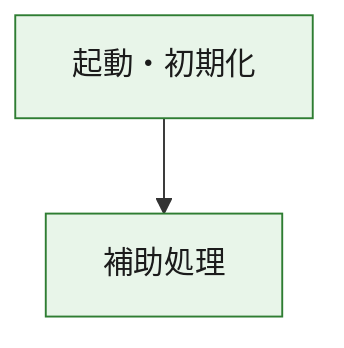
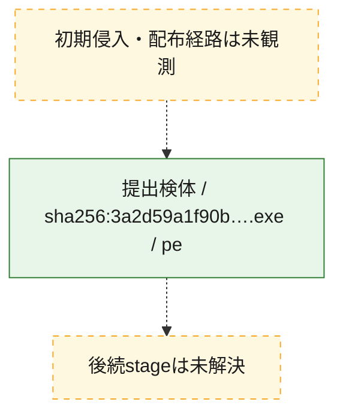
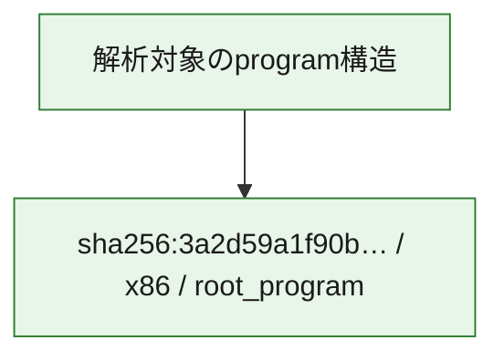

# 全体ロジック：3a2d59a1f90b7a74d2d358266e88e21c148f2c2979eabbeb64d23569e887545e

代表関数の静的証跡から、起動・初期化の処理群を確認しました。

## 読み方

- phaseの掲載順は解析上の整理順です。observed_call_edgesがない段階間の実行順を断定しません。
- 図の実線は静的に観測した関係、点線と黄色のノードは未観測・未解決の関係を示します。
- 図は静的な要約であり、動的実行を再現するものではありません。
- 詳細な関数解説とfingerprintは[STATIC-LOGIC.md](STATIC-LOGIC.md)を参照してください。

## 静的可視化

### 実行フロー

### 感染チェーン

### モジュール関係

## 処理段階

### 1. 起動・初期化

entry pointから初期化と後続処理への移行を確認します。
確度: `confirmed_static_function_evidence`

- `3a2d59a1f90b7a74d2d358266e88e21c148f2c2979eabbeb64d23569e887545e:ghidra:180001010` — 初期化と主要処理への分岐を行う入口関数です。 状態: `succeeded`、選定理由: `entry_point`, `meaningful_symbol_name`, `reviewed_call_centrality:22`, `role:entrypoint`, `small_program_complete_context`

### 2. 補助処理

主要処理を支える一般内部関数またはlibrary処理を確認します。
確度: `confirmed_static_function_evidence`

- `3a2d59a1f90b7a74d2d358266e88e21c148f2c2979eabbeb64d23569e887545e:ghidra:180001240` — 検体内部の一般処理を実装する関数です。 状態: `succeeded`、選定理由: `context_representative`, `reviewed_call_centrality:2`, `small_program_complete_context`
- `3a2d59a1f90b7a74d2d358266e88e21c148f2c2979eabbeb64d23569e887545e:ghidra:180001350` — 検体内部の一般処理を実装する関数です。 状態: `succeeded`、選定理由: `context_representative`, `reviewed_call_centrality:25`, `small_program_complete_context`
- `3a2d59a1f90b7a74d2d358266e88e21c148f2c2979eabbeb64d23569e887545e:ghidra:180003780` — 検体内部の一般処理を実装する関数です。 状態: `succeeded`、選定理由: `context_representative`, `reviewed_call_centrality:2`, `small_program_complete_context`
- `3a2d59a1f90b7a74d2d358266e88e21c148f2c2979eabbeb64d23569e887545e:ghidra:1800038e0` — 検体内部の一般処理を実装する関数です。 状態: `succeeded`、選定理由: `context_representative`, `reviewed_call_centrality:2`, `small_program_complete_context`

## 観測したcall関係

- `3a2d59a1f90b7a74d2d358266e88e21c148f2c2979eabbeb64d23569e887545e:ghidra:180001010` → `3a2d59a1f90b7a74d2d358266e88e21c148f2c2979eabbeb64d23569e887545e:ghidra:180001240` （`startup` → `support`）
- `3a2d59a1f90b7a74d2d358266e88e21c148f2c2979eabbeb64d23569e887545e:ghidra:180001010` → `3a2d59a1f90b7a74d2d358266e88e21c148f2c2979eabbeb64d23569e887545e:ghidra:180001350` （`startup` → `support`）
- `3a2d59a1f90b7a74d2d358266e88e21c148f2c2979eabbeb64d23569e887545e:ghidra:180001350` → `3a2d59a1f90b7a74d2d358266e88e21c148f2c2979eabbeb64d23569e887545e:ghidra:180001240` （`support` → `support`）
- `3a2d59a1f90b7a74d2d358266e88e21c148f2c2979eabbeb64d23569e887545e:ghidra:180001350` → `3a2d59a1f90b7a74d2d358266e88e21c148f2c2979eabbeb64d23569e887545e:ghidra:180003780` （`support` → `support`）
- `3a2d59a1f90b7a74d2d358266e88e21c148f2c2979eabbeb64d23569e887545e:ghidra:180001350` → `3a2d59a1f90b7a74d2d358266e88e21c148f2c2979eabbeb64d23569e887545e:ghidra:1800038e0` （`support` → `support`）
- `3a2d59a1f90b7a74d2d358266e88e21c148f2c2979eabbeb64d23569e887545e:ghidra:180003780` → `3a2d59a1f90b7a74d2d358266e88e21c148f2c2979eabbeb64d23569e887545e:ghidra:1800038e0` （`support` → `support`）
- `ghidra-function:2cf59ccc05070d52552158e0` → `ghidra-function:2a26a974d5f16d380b8fbdee` （`unclassified` → `unclassified`）
- `ghidra-function:2cf59ccc05070d52552158e0` → `ghidra-function:39c91a1478aded3739709e48` （`unclassified` → `unclassified`）
- `ghidra-function:2cf59ccc05070d52552158e0` → `ghidra-function:50b113ecbeb7dc8ee7e0d9af` （`unclassified` → `unclassified`）
- `ghidra-function:2cf59ccc05070d52552158e0` → `ghidra-function:656b75788e306ed9b193a05c` （`unclassified` → `unclassified`）
- `ghidra-function:2cf59ccc05070d52552158e0` → `ghidra-function:7ce4b1637aec80afbd8a3bcf` （`unclassified` → `unclassified`）
- `ghidra-function:2cf59ccc05070d52552158e0` → `ghidra-function:7d58af5e04d163ae2f873a08` （`unclassified` → `unclassified`）
- `ghidra-function:2cf59ccc05070d52552158e0` → `ghidra-function:8446a5b0c649a4fee17b4e0b` （`unclassified` → `unclassified`）
- `ghidra-function:2cf59ccc05070d52552158e0` → `ghidra-function:8d408dbf4da71b94d0230020` （`unclassified` → `unclassified`）
- `ghidra-function:2cf59ccc05070d52552158e0` → `ghidra-function:a5e97950103aa21d1c464d0d` （`unclassified` → `unclassified`）
- `ghidra-function:2cf59ccc05070d52552158e0` → `ghidra-function:b49e9191d9d67295634c0741` （`unclassified` → `unclassified`）
- `ghidra-function:2cf59ccc05070d52552158e0` → `ghidra-function:b7db8cdb27d18445cde61bcc` （`unclassified` → `unclassified`）
- `ghidra-function:2cf59ccc05070d52552158e0` → `ghidra-function:c63cc23d7df4306986362751` （`unclassified` → `unclassified`）
- `ghidra-function:8d408dbf4da71b94d0230020` → `ghidra-external:03c7de59f93d2d14ed58315e` （`unclassified` → `unclassified`）
- `ghidra-function:8d408dbf4da71b94d0230020` → `ghidra-external:0b4f10f673f155fd4ae948ad` （`unclassified` → `unclassified`）
- `ghidra-function:8d408dbf4da71b94d0230020` → `ghidra-external:13076a4c8e379d126b0991f5` （`unclassified` → `unclassified`）
- `ghidra-function:8d408dbf4da71b94d0230020` → `ghidra-external:1be23a95a5973dd75273623e` （`unclassified` → `unclassified`）
- `ghidra-function:8d408dbf4da71b94d0230020` → `ghidra-external:2c8be84a78f2af02786fc7b4` （`unclassified` → `unclassified`）
- `ghidra-function:8d408dbf4da71b94d0230020` → `ghidra-external:32c04a2f3b6b42f5b065adc0` （`unclassified` → `unclassified`）
- `ghidra-function:8d408dbf4da71b94d0230020` → `ghidra-external:3f604dcac48fd66ed05a0adc` （`unclassified` → `unclassified`）
- `ghidra-function:8d408dbf4da71b94d0230020` → `ghidra-external:5b002e87dab768bac897819c` （`unclassified` → `unclassified`）
- `ghidra-function:8d408dbf4da71b94d0230020` → `ghidra-external:77b3b3c3d4f25ae98dd9cf92` （`unclassified` → `unclassified`）
- `ghidra-function:8d408dbf4da71b94d0230020` → `ghidra-external:7d0c25c8f9499f99b92e1d38` （`unclassified` → `unclassified`）
- `ghidra-function:8d408dbf4da71b94d0230020` → `ghidra-external:a3268504f03a91001499e281` （`unclassified` → `unclassified`）
- `ghidra-function:8d408dbf4da71b94d0230020` → `ghidra-external:ae46043345bd2decc20e6f66` （`unclassified` → `unclassified`）
- `ghidra-function:8d408dbf4da71b94d0230020` → `ghidra-external:b4d83cc4194ebc87d8a9c07d` （`unclassified` → `unclassified`）
- `ghidra-function:8d408dbf4da71b94d0230020` → `ghidra-external:c35a30df6589dff2f8957981` （`unclassified` → `unclassified`）
- `ghidra-function:8d408dbf4da71b94d0230020` → `ghidra-external:c6d5044d4d51bef499f739df` （`unclassified` → `unclassified`）
- `ghidra-function:8d408dbf4da71b94d0230020` → `ghidra-external:d05620e8bc69d83d5b9d0100` （`unclassified` → `unclassified`）
- `ghidra-function:8d408dbf4da71b94d0230020` → `ghidra-external:d532da431bda4ae09407ec98` （`unclassified` → `unclassified`）
- `ghidra-function:8d408dbf4da71b94d0230020` → `ghidra-external:e441acbb511d47ed7f17310b` （`unclassified` → `unclassified`）
- `ghidra-function:8d408dbf4da71b94d0230020` → `ghidra-external:f00dcf83c672c23ca3dcac6f` （`unclassified` → `unclassified`）
- `ghidra-function:8d408dbf4da71b94d0230020` → `ghidra-external:f2f354aa04cc702d39c80690` （`unclassified` → `unclassified`）
- `ghidra-function:8d408dbf4da71b94d0230020` → `ghidra-external:f62c847d70d7826e02266583` （`unclassified` → `unclassified`）
- `ghidra-function:8d408dbf4da71b94d0230020` → `ghidra-function:7d639e67b44915c79ea3607f` （`unclassified` → `unclassified`）
- `ghidra-function:8d408dbf4da71b94d0230020` → `ghidra-function:9a4d58cb68744f4eab536605` （`unclassified` → `unclassified`）
- `ghidra-function:8d408dbf4da71b94d0230020` → `ghidra-function:c63cc23d7df4306986362751` （`unclassified` → `unclassified`）
- `ghidra-function:9a4d58cb68744f4eab536605` → `ghidra-function:7d639e67b44915c79ea3607f` （`unclassified` → `unclassified`）

## 解析範囲と制約

- 選定外関数は全体inventoryへ残しますが、関数本体の個別解説対象にはしていません。
- indirect call、難読化、packer、VM、壊れたcontrol flowによりcall関係が欠落する場合があります。
- 文書は静的解析に基づき、検体実行や外部通信による動的確認は行っていません。
