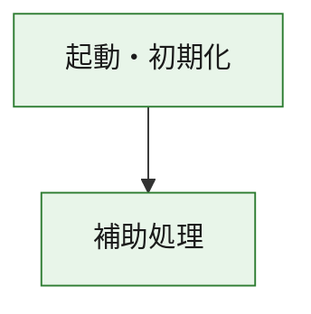
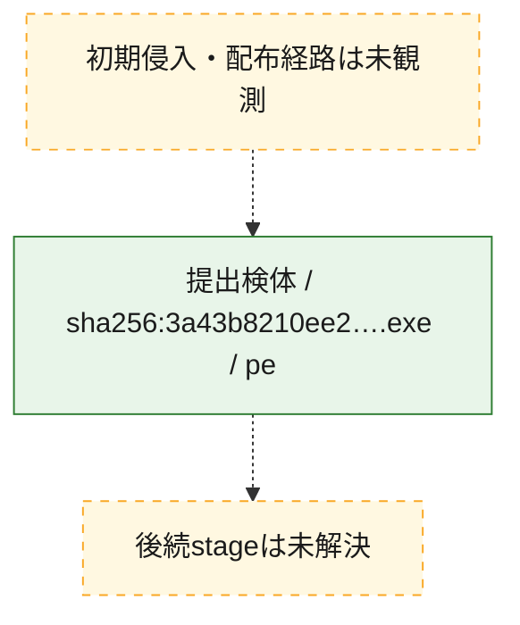
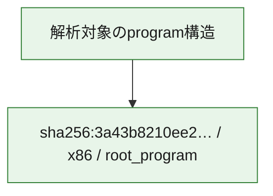

# 全体ロジック：3a43b8210ee21ea98c7257ac028439e26e41508d07ec6fc5ad0f48443f57cb5d

代表関数の静的証跡から、起動・初期化の処理群を確認しました。

## 読み方

- phaseの掲載順は解析上の整理順です。observed_call_edgesがない段階間の実行順を断定しません。
- 図の実線は静的に観測した関係、点線と黄色のノードは未観測・未解決の関係を示します。
- 図は静的な要約であり、動的実行を再現するものではありません。
- 詳細な関数解説とfingerprintは[STATIC-LOGIC.md](STATIC-LOGIC.md)を参照してください。

## 静的可視化

### 実行フロー

### 感染チェーン

### モジュール関係

## 処理段階

### 1. 起動・初期化

entry pointから初期化と後続処理への移行を確認します。
確度: `confirmed_static_function_evidence`

- `3a43b8210ee21ea98c7257ac028439e26e41508d07ec6fc5ad0f48443f57cb5d:ghidra:180001010` — 初期化と主要処理への分岐を行う入口関数です。 状態: `succeeded`、選定理由: `entry_point`, `meaningful_symbol_name`, `reviewed_call_centrality:22`, `role:entrypoint`, `small_program_complete_context`

### 2. 補助処理

主要処理を支える一般内部関数またはlibrary処理を確認します。
確度: `confirmed_static_function_evidence`

- `3a43b8210ee21ea98c7257ac028439e26e41508d07ec6fc5ad0f48443f57cb5d:ghidra:180001240` — 検体内部の一般処理を実装する関数です。 状態: `succeeded`、選定理由: `context_representative`, `reviewed_call_centrality:2`, `small_program_complete_context`
- `3a43b8210ee21ea98c7257ac028439e26e41508d07ec6fc5ad0f48443f57cb5d:ghidra:180001350` — 検体内部の一般処理を実装する関数です。 状態: `succeeded`、選定理由: `context_representative`, `reviewed_call_centrality:25`, `small_program_complete_context`
- `3a43b8210ee21ea98c7257ac028439e26e41508d07ec6fc5ad0f48443f57cb5d:ghidra:180003780` — 検体内部の一般処理を実装する関数です。 状態: `succeeded`、選定理由: `context_representative`, `reviewed_call_centrality:2`, `small_program_complete_context`
- `3a43b8210ee21ea98c7257ac028439e26e41508d07ec6fc5ad0f48443f57cb5d:ghidra:1800038e0` — 検体内部の一般処理を実装する関数です。 状態: `succeeded`、選定理由: `context_representative`, `reviewed_call_centrality:2`, `small_program_complete_context`

## 観測したcall関係

- `3a43b8210ee21ea98c7257ac028439e26e41508d07ec6fc5ad0f48443f57cb5d:ghidra:180001010` → `3a43b8210ee21ea98c7257ac028439e26e41508d07ec6fc5ad0f48443f57cb5d:ghidra:180001240` （`startup` → `support`）
- `3a43b8210ee21ea98c7257ac028439e26e41508d07ec6fc5ad0f48443f57cb5d:ghidra:180001010` → `3a43b8210ee21ea98c7257ac028439e26e41508d07ec6fc5ad0f48443f57cb5d:ghidra:180001350` （`startup` → `support`）
- `3a43b8210ee21ea98c7257ac028439e26e41508d07ec6fc5ad0f48443f57cb5d:ghidra:180001350` → `3a43b8210ee21ea98c7257ac028439e26e41508d07ec6fc5ad0f48443f57cb5d:ghidra:180001240` （`support` → `support`）
- `3a43b8210ee21ea98c7257ac028439e26e41508d07ec6fc5ad0f48443f57cb5d:ghidra:180001350` → `3a43b8210ee21ea98c7257ac028439e26e41508d07ec6fc5ad0f48443f57cb5d:ghidra:180003780` （`support` → `support`）
- `3a43b8210ee21ea98c7257ac028439e26e41508d07ec6fc5ad0f48443f57cb5d:ghidra:180001350` → `3a43b8210ee21ea98c7257ac028439e26e41508d07ec6fc5ad0f48443f57cb5d:ghidra:1800038e0` （`support` → `support`）
- `3a43b8210ee21ea98c7257ac028439e26e41508d07ec6fc5ad0f48443f57cb5d:ghidra:180003780` → `3a43b8210ee21ea98c7257ac028439e26e41508d07ec6fc5ad0f48443f57cb5d:ghidra:1800038e0` （`support` → `support`）
- `ghidra-function:2abc8104f7600b4b8b7727f2` → `ghidra-external:00a971da9620e1437f74c59b` （`unclassified` → `unclassified`）
- `ghidra-function:2abc8104f7600b4b8b7727f2` → `ghidra-external:01a3fb61bc71ba24bd759d98` （`unclassified` → `unclassified`）
- `ghidra-function:2abc8104f7600b4b8b7727f2` → `ghidra-external:06f2d5900cc305b954da98ce` （`unclassified` → `unclassified`）
- `ghidra-function:2abc8104f7600b4b8b7727f2` → `ghidra-external:26c5fdd58371a344c1474d22` （`unclassified` → `unclassified`）
- `ghidra-function:2abc8104f7600b4b8b7727f2` → `ghidra-external:2d518dc53e3d9d14f71374a7` （`unclassified` → `unclassified`）
- `ghidra-function:2abc8104f7600b4b8b7727f2` → `ghidra-external:4f0da91bf4345cf4fad5ddf3` （`unclassified` → `unclassified`）
- `ghidra-function:2abc8104f7600b4b8b7727f2` → `ghidra-external:7c0708d94a67b3bbbea78f6f` （`unclassified` → `unclassified`）
- `ghidra-function:2abc8104f7600b4b8b7727f2` → `ghidra-external:872867757b9ea3b66dfd66ee` （`unclassified` → `unclassified`）
- `ghidra-function:2abc8104f7600b4b8b7727f2` → `ghidra-external:8f623dedd95c916665cd4fcf` （`unclassified` → `unclassified`）
- `ghidra-function:2abc8104f7600b4b8b7727f2` → `ghidra-external:9f12edd9eab712f36f603eae` （`unclassified` → `unclassified`）
- `ghidra-function:2abc8104f7600b4b8b7727f2` → `ghidra-external:aa1f330b9f518db9d17357a0` （`unclassified` → `unclassified`）
- `ghidra-function:2abc8104f7600b4b8b7727f2` → `ghidra-external:ab2cdb7a5550b23a24efd6a3` （`unclassified` → `unclassified`）
- `ghidra-function:2abc8104f7600b4b8b7727f2` → `ghidra-external:b9645c776e0bccbf59486630` （`unclassified` → `unclassified`）
- `ghidra-function:2abc8104f7600b4b8b7727f2` → `ghidra-external:c9c3dcbed04b656f1113abf5` （`unclassified` → `unclassified`）
- `ghidra-function:2abc8104f7600b4b8b7727f2` → `ghidra-external:ca7a0f84c1edcb686572a956` （`unclassified` → `unclassified`）
- `ghidra-function:2abc8104f7600b4b8b7727f2` → `ghidra-external:d1611fbca557503544ee4ea3` （`unclassified` → `unclassified`）
- `ghidra-function:2abc8104f7600b4b8b7727f2` → `ghidra-external:d56a928bdbdc47c3f85e5f02` （`unclassified` → `unclassified`）
- `ghidra-function:2abc8104f7600b4b8b7727f2` → `ghidra-external:d8864f708228a0378e6834f0` （`unclassified` → `unclassified`）
- `ghidra-function:2abc8104f7600b4b8b7727f2` → `ghidra-external:e3551fb45817c2778b6173db` （`unclassified` → `unclassified`）
- `ghidra-function:2abc8104f7600b4b8b7727f2` → `ghidra-external:e90236f8692b9f3fb716ae23` （`unclassified` → `unclassified`）
- `ghidra-function:2abc8104f7600b4b8b7727f2` → `ghidra-external:fc764665a933bb48efd253d9` （`unclassified` → `unclassified`）
- `ghidra-function:2abc8104f7600b4b8b7727f2` → `ghidra-function:365dbada16e35dcb69c104d8` （`unclassified` → `unclassified`）
- `ghidra-function:2abc8104f7600b4b8b7727f2` → `ghidra-function:bc3b15a7b621f107405feafe` （`unclassified` → `unclassified`）
- `ghidra-function:2abc8104f7600b4b8b7727f2` → `ghidra-function:f6fe6e67f1db99407030bb6d` （`unclassified` → `unclassified`）
- `ghidra-function:5a3567b25429efa4381c5a60` → `ghidra-function:0cf548a4908f71c7b0ccbaf5` （`unclassified` → `unclassified`）
- `ghidra-function:5a3567b25429efa4381c5a60` → `ghidra-function:101960f0811a24e9cd185082` （`unclassified` → `unclassified`）
- `ghidra-function:5a3567b25429efa4381c5a60` → `ghidra-function:12fa865bbe6bbb2cd35c1386` （`unclassified` → `unclassified`）
- `ghidra-function:5a3567b25429efa4381c5a60` → `ghidra-function:2abc8104f7600b4b8b7727f2` （`unclassified` → `unclassified`）
- `ghidra-function:5a3567b25429efa4381c5a60` → `ghidra-function:4cb4f535eab6857b1afacaeb` （`unclassified` → `unclassified`）
- `ghidra-function:5a3567b25429efa4381c5a60` → `ghidra-function:5b99e9c86997220c88d10f23` （`unclassified` → `unclassified`）
- `ghidra-function:5a3567b25429efa4381c5a60` → `ghidra-function:78778181c89bab7e5f15d459` （`unclassified` → `unclassified`）
- `ghidra-function:5a3567b25429efa4381c5a60` → `ghidra-function:9264926b1595084595f905e3` （`unclassified` → `unclassified`）
- `ghidra-function:5a3567b25429efa4381c5a60` → `ghidra-function:b0faeffeba41ad9246b27c40` （`unclassified` → `unclassified`）
- `ghidra-function:5a3567b25429efa4381c5a60` → `ghidra-function:bc3b15a7b621f107405feafe` （`unclassified` → `unclassified`）
- `ghidra-function:5a3567b25429efa4381c5a60` → `ghidra-function:f33b542dd57fe38f8880039b` （`unclassified` → `unclassified`）
- `ghidra-function:5a3567b25429efa4381c5a60` → `ghidra-function:fcecfed56360e5a0da2faffd` （`unclassified` → `unclassified`）
- `ghidra-function:f6fe6e67f1db99407030bb6d` → `ghidra-function:365dbada16e35dcb69c104d8` （`unclassified` → `unclassified`）

## 解析範囲と制約

- 選定外関数は全体inventoryへ残しますが、関数本体の個別解説対象にはしていません。
- indirect call、難読化、packer、VM、壊れたcontrol flowによりcall関係が欠落する場合があります。
- 文書は静的解析に基づき、検体実行や外部通信による動的確認は行っていません。
