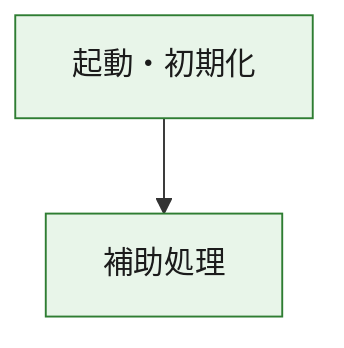
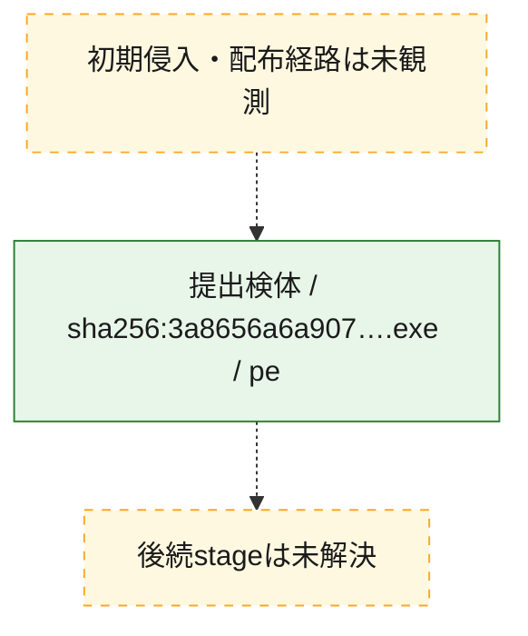
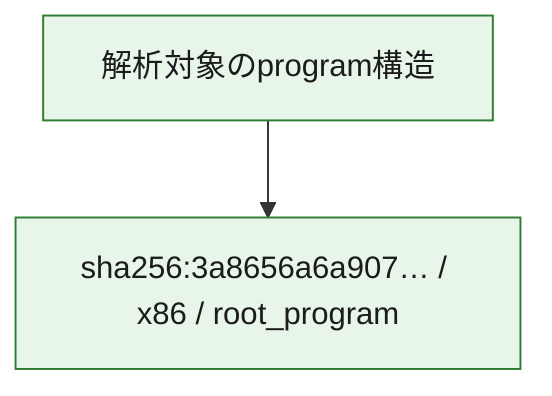

# 全体ロジック：3a8656a6a9072945dad912ae9fd150433586f14b47e37f83eb835b926b81c892

代表関数の静的証跡から、起動・初期化の処理群を確認しました。

## 読み方

- phaseの掲載順は解析上の整理順です。observed_call_edgesがない段階間の実行順を断定しません。
- 図の実線は静的に観測した関係、点線と黄色のノードは未観測・未解決の関係を示します。
- 図は静的な要約であり、動的実行を再現するものではありません。
- 詳細な関数解説とfingerprintは[STATIC-LOGIC.md](STATIC-LOGIC.md)を参照してください。

## 静的可視化

### 実行フロー

### 感染チェーン

### モジュール関係

## 処理段階

### 1. 起動・初期化

entry pointから初期化と後続処理への移行を確認します。
確度: `confirmed_static_function_evidence`

- `3a8656a6a9072945dad912ae9fd150433586f14b47e37f83eb835b926b81c892:ghidra:180001010` — 初期化と主要処理への分岐を行う入口関数です。 状態: `succeeded`、選定理由: `entry_point`, `meaningful_symbol_name`, `reviewed_call_centrality:22`, `role:entrypoint`, `small_program_complete_context`

### 2. 補助処理

主要処理を支える一般内部関数またはlibrary処理を確認します。
確度: `confirmed_static_function_evidence`

- `3a8656a6a9072945dad912ae9fd150433586f14b47e37f83eb835b926b81c892:ghidra:180001240` — 検体内部の一般処理を実装する関数です。 状態: `succeeded`、選定理由: `context_representative`, `reviewed_call_centrality:2`, `small_program_complete_context`
- `3a8656a6a9072945dad912ae9fd150433586f14b47e37f83eb835b926b81c892:ghidra:180001350` — 検体内部の一般処理を実装する関数です。 状態: `succeeded`、選定理由: `context_representative`, `reviewed_call_centrality:25`, `small_program_complete_context`
- `3a8656a6a9072945dad912ae9fd150433586f14b47e37f83eb835b926b81c892:ghidra:180003780` — 検体内部の一般処理を実装する関数です。 状態: `succeeded`、選定理由: `context_representative`, `reviewed_call_centrality:2`, `small_program_complete_context`
- `3a8656a6a9072945dad912ae9fd150433586f14b47e37f83eb835b926b81c892:ghidra:1800038e0` — 検体内部の一般処理を実装する関数です。 状態: `succeeded`、選定理由: `context_representative`, `reviewed_call_centrality:2`, `small_program_complete_context`

## 観測したcall関係

- `3a8656a6a9072945dad912ae9fd150433586f14b47e37f83eb835b926b81c892:ghidra:180001010` → `3a8656a6a9072945dad912ae9fd150433586f14b47e37f83eb835b926b81c892:ghidra:180001240` （`startup` → `support`）
- `3a8656a6a9072945dad912ae9fd150433586f14b47e37f83eb835b926b81c892:ghidra:180001010` → `3a8656a6a9072945dad912ae9fd150433586f14b47e37f83eb835b926b81c892:ghidra:180001350` （`startup` → `support`）
- `3a8656a6a9072945dad912ae9fd150433586f14b47e37f83eb835b926b81c892:ghidra:180001350` → `3a8656a6a9072945dad912ae9fd150433586f14b47e37f83eb835b926b81c892:ghidra:180001240` （`support` → `support`）
- `3a8656a6a9072945dad912ae9fd150433586f14b47e37f83eb835b926b81c892:ghidra:180001350` → `3a8656a6a9072945dad912ae9fd150433586f14b47e37f83eb835b926b81c892:ghidra:180003780` （`support` → `support`）
- `3a8656a6a9072945dad912ae9fd150433586f14b47e37f83eb835b926b81c892:ghidra:180001350` → `3a8656a6a9072945dad912ae9fd150433586f14b47e37f83eb835b926b81c892:ghidra:1800038e0` （`support` → `support`）
- `3a8656a6a9072945dad912ae9fd150433586f14b47e37f83eb835b926b81c892:ghidra:180003780` → `3a8656a6a9072945dad912ae9fd150433586f14b47e37f83eb835b926b81c892:ghidra:1800038e0` （`support` → `support`）
- `ghidra-function:aa7f8ae3e3686ec6bd1ac49e` → `ghidra-external:05b9a6d7017f70f7589c3289` （`unclassified` → `unclassified`）
- `ghidra-function:aa7f8ae3e3686ec6bd1ac49e` → `ghidra-external:0ef16456907f95c9d3572323` （`unclassified` → `unclassified`）
- `ghidra-function:aa7f8ae3e3686ec6bd1ac49e` → `ghidra-external:251c04010b3ff689c29541a2` （`unclassified` → `unclassified`）
- `ghidra-function:aa7f8ae3e3686ec6bd1ac49e` → `ghidra-external:25fcb33d01bce79df7923a25` （`unclassified` → `unclassified`）
- `ghidra-function:aa7f8ae3e3686ec6bd1ac49e` → `ghidra-external:2bd36e1df2230cfa3b946b9b` （`unclassified` → `unclassified`）
- `ghidra-function:aa7f8ae3e3686ec6bd1ac49e` → `ghidra-external:397b9b5b8f4e4ec2ed6bf235` （`unclassified` → `unclassified`）
- `ghidra-function:aa7f8ae3e3686ec6bd1ac49e` → `ghidra-external:40c113c167c7e7ce390c46fe` （`unclassified` → `unclassified`）
- `ghidra-function:aa7f8ae3e3686ec6bd1ac49e` → `ghidra-external:4723f7f6fc97231b8a62055f` （`unclassified` → `unclassified`）
- `ghidra-function:aa7f8ae3e3686ec6bd1ac49e` → `ghidra-external:4c6bed2a88764307f7fbca34` （`unclassified` → `unclassified`）
- `ghidra-function:aa7f8ae3e3686ec6bd1ac49e` → `ghidra-external:4e1620e3b651fa355b8b9ce7` （`unclassified` → `unclassified`）
- `ghidra-function:aa7f8ae3e3686ec6bd1ac49e` → `ghidra-external:552e61d3d8a4c81bececc0c0` （`unclassified` → `unclassified`）
- `ghidra-function:aa7f8ae3e3686ec6bd1ac49e` → `ghidra-external:5a01155a6a45baa809bcf5fa` （`unclassified` → `unclassified`）
- `ghidra-function:aa7f8ae3e3686ec6bd1ac49e` → `ghidra-external:5e2c5e01d89b86aaba430d80` （`unclassified` → `unclassified`）
- `ghidra-function:aa7f8ae3e3686ec6bd1ac49e` → `ghidra-external:6b60b3013aad0db2f7e39ee9` （`unclassified` → `unclassified`）
- `ghidra-function:aa7f8ae3e3686ec6bd1ac49e` → `ghidra-external:73d83f293377f3b738a9df19` （`unclassified` → `unclassified`）
- `ghidra-function:aa7f8ae3e3686ec6bd1ac49e` → `ghidra-external:7d4f58142d71c41deeeb32b0` （`unclassified` → `unclassified`）
- `ghidra-function:aa7f8ae3e3686ec6bd1ac49e` → `ghidra-external:a6acbe7c65a8208436f04272` （`unclassified` → `unclassified`）
- `ghidra-function:aa7f8ae3e3686ec6bd1ac49e` → `ghidra-external:b110703325be3817af2ff6cf` （`unclassified` → `unclassified`）
- `ghidra-function:aa7f8ae3e3686ec6bd1ac49e` → `ghidra-external:d7bb29a4f3356b2bc703bfa2` （`unclassified` → `unclassified`）
- `ghidra-function:aa7f8ae3e3686ec6bd1ac49e` → `ghidra-external:dfef01028b8c8783193b9ee6` （`unclassified` → `unclassified`）
- `ghidra-function:aa7f8ae3e3686ec6bd1ac49e` → `ghidra-external:f1df02471f84f599ec2d30bd` （`unclassified` → `unclassified`）
- `ghidra-function:aa7f8ae3e3686ec6bd1ac49e` → `ghidra-function:62468f8a4de631592b8333b1` （`unclassified` → `unclassified`）
- `ghidra-function:aa7f8ae3e3686ec6bd1ac49e` → `ghidra-function:9cbc2aaf8047e20c69f87b74` （`unclassified` → `unclassified`）
- `ghidra-function:aa7f8ae3e3686ec6bd1ac49e` → `ghidra-function:b1b0ca4255941c538f8a88ed` （`unclassified` → `unclassified`）
- `ghidra-function:b1b0ca4255941c538f8a88ed` → `ghidra-function:9cbc2aaf8047e20c69f87b74` （`unclassified` → `unclassified`）
- `ghidra-function:c234b4411b999151232a089c` → `ghidra-function:003fe4428755a2f3889335a2` （`unclassified` → `unclassified`）
- `ghidra-function:c234b4411b999151232a089c` → `ghidra-function:231b9c1ecd850a9676cc595c` （`unclassified` → `unclassified`）
- `ghidra-function:c234b4411b999151232a089c` → `ghidra-function:30293d318b7d22e81485ee2f` （`unclassified` → `unclassified`）
- `ghidra-function:c234b4411b999151232a089c` → `ghidra-function:3d2674b6e28a5ace956c07d1` （`unclassified` → `unclassified`）
- `ghidra-function:c234b4411b999151232a089c` → `ghidra-function:437f2380927e94e2abeb0638` （`unclassified` → `unclassified`）
- `ghidra-function:c234b4411b999151232a089c` → `ghidra-function:62468f8a4de631592b8333b1` （`unclassified` → `unclassified`）
- `ghidra-function:c234b4411b999151232a089c` → `ghidra-function:67e051f65ad759be427ff327` （`unclassified` → `unclassified`）
- `ghidra-function:c234b4411b999151232a089c` → `ghidra-function:6c89a0aa1bbfa21f0bc83c11` （`unclassified` → `unclassified`）
- `ghidra-function:c234b4411b999151232a089c` → `ghidra-function:aa7f8ae3e3686ec6bd1ac49e` （`unclassified` → `unclassified`）
- `ghidra-function:c234b4411b999151232a089c` → `ghidra-function:ad5ce3d7b7f93d9fc50482b1` （`unclassified` → `unclassified`）
- `ghidra-function:c234b4411b999151232a089c` → `ghidra-function:ada50998d87e4f0962c78ee3` （`unclassified` → `unclassified`）
- `ghidra-function:c234b4411b999151232a089c` → `ghidra-function:e18384799e49e52101282fc6` （`unclassified` → `unclassified`）

## 解析範囲と制約

- 選定外関数は全体inventoryへ残しますが、関数本体の個別解説対象にはしていません。
- indirect call、難読化、packer、VM、壊れたcontrol flowによりcall関係が欠落する場合があります。
- 文書は静的解析に基づき、検体実行や外部通信による動的確認は行っていません。
