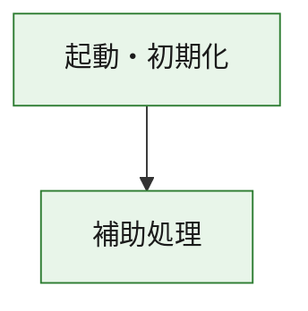
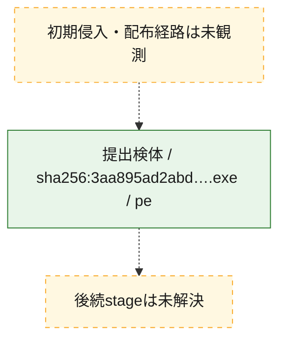
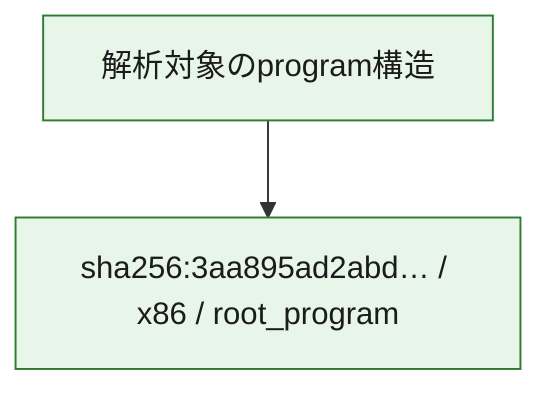

# 全体ロジック：3aa895ad2abdcc4926f052cf69f02f3b8ecff66b0c93e01e2e98b2252c4781af

代表関数の静的証跡から、起動・初期化の処理群を確認しました。

## 読み方

- phaseの掲載順は解析上の整理順です。observed_call_edgesがない段階間の実行順を断定しません。
- 図の実線は静的に観測した関係、点線と黄色のノードは未観測・未解決の関係を示します。
- 図は静的な要約であり、動的実行を再現するものではありません。
- 詳細な関数解説とfingerprintは[STATIC-LOGIC.md](STATIC-LOGIC.md)を参照してください。

## 静的可視化

### 実行フロー

### 感染チェーン

### モジュール関係

## 処理段階

### 1. 起動・初期化

entry pointから初期化と後続処理への移行を確認します。
確度: `confirmed_static_function_evidence`

- `3aa895ad2abdcc4926f052cf69f02f3b8ecff66b0c93e01e2e98b2252c4781af:ghidra:180001010` — 初期化と主要処理への分岐を行う入口関数です。 状態: `succeeded`、選定理由: `entry_point`, `meaningful_symbol_name`, `reviewed_call_centrality:22`, `role:entrypoint`, `small_program_complete_context`

### 2. 補助処理

主要処理を支える一般内部関数またはlibrary処理を確認します。
確度: `confirmed_static_function_evidence`

- `3aa895ad2abdcc4926f052cf69f02f3b8ecff66b0c93e01e2e98b2252c4781af:ghidra:180001240` — 検体内部の一般処理を実装する関数です。 状態: `succeeded`、選定理由: `context_representative`, `reviewed_call_centrality:2`, `small_program_complete_context`
- `3aa895ad2abdcc4926f052cf69f02f3b8ecff66b0c93e01e2e98b2252c4781af:ghidra:180001350` — 検体内部の一般処理を実装する関数です。 状態: `succeeded`、選定理由: `context_representative`, `reviewed_call_centrality:25`, `small_program_complete_context`
- `3aa895ad2abdcc4926f052cf69f02f3b8ecff66b0c93e01e2e98b2252c4781af:ghidra:180003780` — 検体内部の一般処理を実装する関数です。 状態: `succeeded`、選定理由: `context_representative`, `reviewed_call_centrality:2`, `small_program_complete_context`
- `3aa895ad2abdcc4926f052cf69f02f3b8ecff66b0c93e01e2e98b2252c4781af:ghidra:1800038e0` — 検体内部の一般処理を実装する関数です。 状態: `succeeded`、選定理由: `context_representative`, `reviewed_call_centrality:2`, `small_program_complete_context`

## 観測したcall関係

- `3aa895ad2abdcc4926f052cf69f02f3b8ecff66b0c93e01e2e98b2252c4781af:ghidra:180001010` → `3aa895ad2abdcc4926f052cf69f02f3b8ecff66b0c93e01e2e98b2252c4781af:ghidra:180001240` （`startup` → `support`）
- `3aa895ad2abdcc4926f052cf69f02f3b8ecff66b0c93e01e2e98b2252c4781af:ghidra:180001010` → `3aa895ad2abdcc4926f052cf69f02f3b8ecff66b0c93e01e2e98b2252c4781af:ghidra:180001350` （`startup` → `support`）
- `3aa895ad2abdcc4926f052cf69f02f3b8ecff66b0c93e01e2e98b2252c4781af:ghidra:180001350` → `3aa895ad2abdcc4926f052cf69f02f3b8ecff66b0c93e01e2e98b2252c4781af:ghidra:180001240` （`support` → `support`）
- `3aa895ad2abdcc4926f052cf69f02f3b8ecff66b0c93e01e2e98b2252c4781af:ghidra:180001350` → `3aa895ad2abdcc4926f052cf69f02f3b8ecff66b0c93e01e2e98b2252c4781af:ghidra:180003780` （`support` → `support`）
- `3aa895ad2abdcc4926f052cf69f02f3b8ecff66b0c93e01e2e98b2252c4781af:ghidra:180001350` → `3aa895ad2abdcc4926f052cf69f02f3b8ecff66b0c93e01e2e98b2252c4781af:ghidra:1800038e0` （`support` → `support`）
- `3aa895ad2abdcc4926f052cf69f02f3b8ecff66b0c93e01e2e98b2252c4781af:ghidra:180003780` → `3aa895ad2abdcc4926f052cf69f02f3b8ecff66b0c93e01e2e98b2252c4781af:ghidra:1800038e0` （`support` → `support`）
- `ghidra-function:1f256ea9221ce27d0ed895d7` → `ghidra-external:13b6ad8760481c591a69f0d0` （`unclassified` → `unclassified`）
- `ghidra-function:1f256ea9221ce27d0ed895d7` → `ghidra-external:16359b9319edb4bd2337bf56` （`unclassified` → `unclassified`）
- `ghidra-function:1f256ea9221ce27d0ed895d7` → `ghidra-external:21b8e0537175a3262b327eb1` （`unclassified` → `unclassified`）
- `ghidra-function:1f256ea9221ce27d0ed895d7` → `ghidra-external:2928166e87a561528a26644c` （`unclassified` → `unclassified`）
- `ghidra-function:1f256ea9221ce27d0ed895d7` → `ghidra-external:2a8fac051f85421d993c28ec` （`unclassified` → `unclassified`）
- `ghidra-function:1f256ea9221ce27d0ed895d7` → `ghidra-external:31221b8ac368b9a15c1ff375` （`unclassified` → `unclassified`）
- `ghidra-function:1f256ea9221ce27d0ed895d7` → `ghidra-external:3ca966fc197d0111d617d2bf` （`unclassified` → `unclassified`）
- `ghidra-function:1f256ea9221ce27d0ed895d7` → `ghidra-external:3e3ff8a6c6d71823f0cf1fe2` （`unclassified` → `unclassified`）
- `ghidra-function:1f256ea9221ce27d0ed895d7` → `ghidra-external:3ed4b8978b3394aa5b5bda5d` （`unclassified` → `unclassified`）
- `ghidra-function:1f256ea9221ce27d0ed895d7` → `ghidra-external:49a58b648303ad962184c87b` （`unclassified` → `unclassified`）
- `ghidra-function:1f256ea9221ce27d0ed895d7` → `ghidra-external:4a5b823bf4ad23b552f0a411` （`unclassified` → `unclassified`）
- `ghidra-function:1f256ea9221ce27d0ed895d7` → `ghidra-external:579ccd3db79ed19028e0ae5b` （`unclassified` → `unclassified`）
- `ghidra-function:1f256ea9221ce27d0ed895d7` → `ghidra-external:64b17d10e2a328b92134733d` （`unclassified` → `unclassified`）
- `ghidra-function:1f256ea9221ce27d0ed895d7` → `ghidra-external:86c40c13a95468aea63caa07` （`unclassified` → `unclassified`）
- `ghidra-function:1f256ea9221ce27d0ed895d7` → `ghidra-external:8727d37c05c7c938714a3473` （`unclassified` → `unclassified`）
- `ghidra-function:1f256ea9221ce27d0ed895d7` → `ghidra-external:994e556fdb2f29501d044f80` （`unclassified` → `unclassified`）
- `ghidra-function:1f256ea9221ce27d0ed895d7` → `ghidra-external:9f7926f196fc9b16ea0d28b6` （`unclassified` → `unclassified`）
- `ghidra-function:1f256ea9221ce27d0ed895d7` → `ghidra-external:b4edb900e64771495b695f06` （`unclassified` → `unclassified`）
- `ghidra-function:1f256ea9221ce27d0ed895d7` → `ghidra-external:d451b1f14981805e9f576a57` （`unclassified` → `unclassified`）
- `ghidra-function:1f256ea9221ce27d0ed895d7` → `ghidra-external:e7de43d3067dd9ccdec096ad` （`unclassified` → `unclassified`）
- `ghidra-function:1f256ea9221ce27d0ed895d7` → `ghidra-external:fd8fa7860129354012c3661c` （`unclassified` → `unclassified`）
- `ghidra-function:1f256ea9221ce27d0ed895d7` → `ghidra-function:46b3ce751f27080a3d6013d4` （`unclassified` → `unclassified`）
- `ghidra-function:1f256ea9221ce27d0ed895d7` → `ghidra-function:668d45a45406b99687080516` （`unclassified` → `unclassified`）
- `ghidra-function:1f256ea9221ce27d0ed895d7` → `ghidra-function:9aa7ddc636e9bffe1752cb6c` （`unclassified` → `unclassified`）
- `ghidra-function:668d45a45406b99687080516` → `ghidra-function:9aa7ddc636e9bffe1752cb6c` （`unclassified` → `unclassified`）
- `ghidra-function:9a89596783701d3e5b11a396` → `ghidra-function:1f256ea9221ce27d0ed895d7` （`unclassified` → `unclassified`）
- `ghidra-function:9a89596783701d3e5b11a396` → `ghidra-function:46b3ce751f27080a3d6013d4` （`unclassified` → `unclassified`）
- `ghidra-function:9a89596783701d3e5b11a396` → `ghidra-function:4926fcc77deedf5847bd2392` （`unclassified` → `unclassified`）
- `ghidra-function:9a89596783701d3e5b11a396` → `ghidra-function:77f13daff31f49fd56ad2386` （`unclassified` → `unclassified`）
- `ghidra-function:9a89596783701d3e5b11a396` → `ghidra-function:79ad4065d681da6a502c6891` （`unclassified` → `unclassified`）
- `ghidra-function:9a89596783701d3e5b11a396` → `ghidra-function:8362679d0a6c4c732404926c` （`unclassified` → `unclassified`）
- `ghidra-function:9a89596783701d3e5b11a396` → `ghidra-function:8a3bee830e2f0223b70d4aa9` （`unclassified` → `unclassified`）
- `ghidra-function:9a89596783701d3e5b11a396` → `ghidra-function:ad41210d3d6f4748dfbfcb8d` （`unclassified` → `unclassified`）
- `ghidra-function:9a89596783701d3e5b11a396` → `ghidra-function:d15804bb43b1010a82932175` （`unclassified` → `unclassified`）
- `ghidra-function:9a89596783701d3e5b11a396` → `ghidra-function:e588cab0c76e130da31e4aae` （`unclassified` → `unclassified`）
- `ghidra-function:9a89596783701d3e5b11a396` → `ghidra-function:e5cd7b3a6b7618cd83e03d36` （`unclassified` → `unclassified`）
- `ghidra-function:9a89596783701d3e5b11a396` → `ghidra-function:ec29b09c9ef1a6bb029ab559` （`unclassified` → `unclassified`）

## 解析範囲と制約

- 選定外関数は全体inventoryへ残しますが、関数本体の個別解説対象にはしていません。
- indirect call、難読化、packer、VM、壊れたcontrol flowによりcall関係が欠落する場合があります。
- 文書は静的解析に基づき、検体実行や外部通信による動的確認は行っていません。
