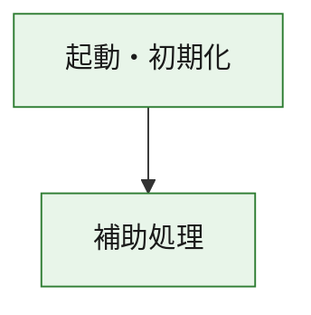
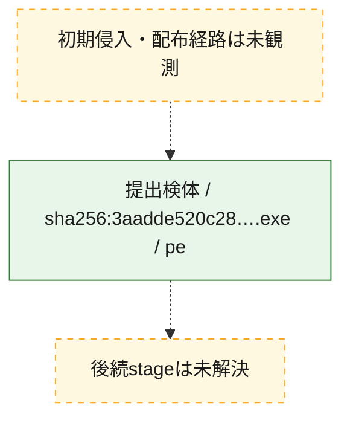
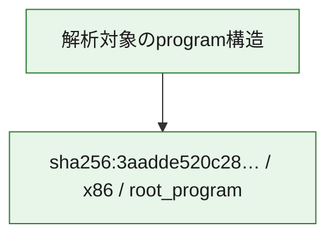

# 全体ロジック：3aadde520c28b8c8ae30ed970a23a4074b1519a611c592fe0d0396b287ca3e45

代表関数の静的証跡から、起動・初期化の処理群を確認しました。

## 読み方

- phaseの掲載順は解析上の整理順です。observed_call_edgesがない段階間の実行順を断定しません。
- 図の実線は静的に観測した関係、点線と黄色のノードは未観測・未解決の関係を示します。
- 図は静的な要約であり、動的実行を再現するものではありません。
- 詳細な関数解説とfingerprintは[STATIC-LOGIC.md](STATIC-LOGIC.md)を参照してください。

## 静的可視化

### 実行フロー

### 感染チェーン

### モジュール関係

## 処理段階

### 1. 起動・初期化

entry pointから初期化と後続処理への移行を確認します。
確度: `confirmed_static_function_evidence`

- `3aadde520c28b8c8ae30ed970a23a4074b1519a611c592fe0d0396b287ca3e45:ghidra:180001010` — 初期化と主要処理への分岐を行う入口関数です。 状態: `succeeded`、選定理由: `entry_point`, `meaningful_symbol_name`, `reviewed_call_centrality:22`, `role:entrypoint`, `small_program_complete_context`

### 2. 補助処理

主要処理を支える一般内部関数またはlibrary処理を確認します。
確度: `confirmed_static_function_evidence`

- `3aadde520c28b8c8ae30ed970a23a4074b1519a611c592fe0d0396b287ca3e45:ghidra:180001240` — 検体内部の一般処理を実装する関数です。 状態: `succeeded`、選定理由: `context_representative`, `reviewed_call_centrality:2`, `small_program_complete_context`
- `3aadde520c28b8c8ae30ed970a23a4074b1519a611c592fe0d0396b287ca3e45:ghidra:180001350` — 検体内部の一般処理を実装する関数です。 状態: `succeeded`、選定理由: `context_representative`, `reviewed_call_centrality:25`, `small_program_complete_context`
- `3aadde520c28b8c8ae30ed970a23a4074b1519a611c592fe0d0396b287ca3e45:ghidra:180003780` — 検体内部の一般処理を実装する関数です。 状態: `succeeded`、選定理由: `context_representative`, `reviewed_call_centrality:2`, `small_program_complete_context`
- `3aadde520c28b8c8ae30ed970a23a4074b1519a611c592fe0d0396b287ca3e45:ghidra:1800038e0` — 検体内部の一般処理を実装する関数です。 状態: `succeeded`、選定理由: `context_representative`, `reviewed_call_centrality:2`, `small_program_complete_context`

## 観測したcall関係

- `3aadde520c28b8c8ae30ed970a23a4074b1519a611c592fe0d0396b287ca3e45:ghidra:180001010` → `3aadde520c28b8c8ae30ed970a23a4074b1519a611c592fe0d0396b287ca3e45:ghidra:180001240` （`startup` → `support`）
- `3aadde520c28b8c8ae30ed970a23a4074b1519a611c592fe0d0396b287ca3e45:ghidra:180001010` → `3aadde520c28b8c8ae30ed970a23a4074b1519a611c592fe0d0396b287ca3e45:ghidra:180001350` （`startup` → `support`）
- `3aadde520c28b8c8ae30ed970a23a4074b1519a611c592fe0d0396b287ca3e45:ghidra:180001350` → `3aadde520c28b8c8ae30ed970a23a4074b1519a611c592fe0d0396b287ca3e45:ghidra:180001240` （`support` → `support`）
- `3aadde520c28b8c8ae30ed970a23a4074b1519a611c592fe0d0396b287ca3e45:ghidra:180001350` → `3aadde520c28b8c8ae30ed970a23a4074b1519a611c592fe0d0396b287ca3e45:ghidra:180003780` （`support` → `support`）
- `3aadde520c28b8c8ae30ed970a23a4074b1519a611c592fe0d0396b287ca3e45:ghidra:180001350` → `3aadde520c28b8c8ae30ed970a23a4074b1519a611c592fe0d0396b287ca3e45:ghidra:1800038e0` （`support` → `support`）
- `3aadde520c28b8c8ae30ed970a23a4074b1519a611c592fe0d0396b287ca3e45:ghidra:180003780` → `3aadde520c28b8c8ae30ed970a23a4074b1519a611c592fe0d0396b287ca3e45:ghidra:1800038e0` （`support` → `support`）
- `ghidra-function:c4d309099270d45608858c05` → `ghidra-function:2593dc2e6717fadd150dabac` （`unclassified` → `unclassified`）
- `ghidra-function:d0e75ffc1b54159e3e40e76c` → `ghidra-external:1a12547c643bc7aabe894e43` （`unclassified` → `unclassified`）
- `ghidra-function:d0e75ffc1b54159e3e40e76c` → `ghidra-external:2e5d676b78308976686f1238` （`unclassified` → `unclassified`）
- `ghidra-function:d0e75ffc1b54159e3e40e76c` → `ghidra-external:2f521de091430c332a5046f3` （`unclassified` → `unclassified`）
- `ghidra-function:d0e75ffc1b54159e3e40e76c` → `ghidra-external:505d11fd8ab2b6489d9499ed` （`unclassified` → `unclassified`）
- `ghidra-function:d0e75ffc1b54159e3e40e76c` → `ghidra-external:56b09fc6c35feed6b9211626` （`unclassified` → `unclassified`）
- `ghidra-function:d0e75ffc1b54159e3e40e76c` → `ghidra-external:59ac54d7e13ff631efc67c5d` （`unclassified` → `unclassified`）
- `ghidra-function:d0e75ffc1b54159e3e40e76c` → `ghidra-external:621317451113822179743030` （`unclassified` → `unclassified`）
- `ghidra-function:d0e75ffc1b54159e3e40e76c` → `ghidra-external:6eff6b226e45979492cb794d` （`unclassified` → `unclassified`）
- `ghidra-function:d0e75ffc1b54159e3e40e76c` → `ghidra-external:706ba8ea8af0d20bf0b9ac06` （`unclassified` → `unclassified`）
- `ghidra-function:d0e75ffc1b54159e3e40e76c` → `ghidra-external:75f8b19341f178cb412d9ec6` （`unclassified` → `unclassified`）
- `ghidra-function:d0e75ffc1b54159e3e40e76c` → `ghidra-external:7cea5718d65a9f07dfa82063` （`unclassified` → `unclassified`）
- `ghidra-function:d0e75ffc1b54159e3e40e76c` → `ghidra-external:7ea8035bb637f16bf1c207e5` （`unclassified` → `unclassified`）
- `ghidra-function:d0e75ffc1b54159e3e40e76c` → `ghidra-external:889d72666e6151e99770ba2a` （`unclassified` → `unclassified`）
- `ghidra-function:d0e75ffc1b54159e3e40e76c` → `ghidra-external:9a83d38517e4c75c34df1074` （`unclassified` → `unclassified`）
- `ghidra-function:d0e75ffc1b54159e3e40e76c` → `ghidra-external:c1c1c176546f1d3ce2cd3381` （`unclassified` → `unclassified`）
- `ghidra-function:d0e75ffc1b54159e3e40e76c` → `ghidra-external:c3410c2f59c51f945fd4adf5` （`unclassified` → `unclassified`）
- `ghidra-function:d0e75ffc1b54159e3e40e76c` → `ghidra-external:ceb7b37396f23f5f73db95bf` （`unclassified` → `unclassified`）
- `ghidra-function:d0e75ffc1b54159e3e40e76c` → `ghidra-external:d5dfb3ca948d557050beae9a` （`unclassified` → `unclassified`）
- `ghidra-function:d0e75ffc1b54159e3e40e76c` → `ghidra-external:d9bda445c633ce5b2d1e646c` （`unclassified` → `unclassified`）
- `ghidra-function:d0e75ffc1b54159e3e40e76c` → `ghidra-external:e6984b57b2dd266123e3874f` （`unclassified` → `unclassified`）
- `ghidra-function:d0e75ffc1b54159e3e40e76c` → `ghidra-external:fc32a5fb974b2c2c7e1ffd41` （`unclassified` → `unclassified`）
- `ghidra-function:d0e75ffc1b54159e3e40e76c` → `ghidra-function:2593dc2e6717fadd150dabac` （`unclassified` → `unclassified`）
- `ghidra-function:d0e75ffc1b54159e3e40e76c` → `ghidra-function:88a130ca81ebf21c916cbcbf` （`unclassified` → `unclassified`）
- `ghidra-function:d0e75ffc1b54159e3e40e76c` → `ghidra-function:c4d309099270d45608858c05` （`unclassified` → `unclassified`）
- `ghidra-function:e0c36a03ee93e40173262b6e` → `ghidra-function:083aecfd722bb4866540e706` （`unclassified` → `unclassified`）
- `ghidra-function:e0c36a03ee93e40173262b6e` → `ghidra-function:1e5c49ca897b54aa8ae6201e` （`unclassified` → `unclassified`）
- `ghidra-function:e0c36a03ee93e40173262b6e` → `ghidra-function:272b26688b53b0a38ab7a9bc` （`unclassified` → `unclassified`）
- `ghidra-function:e0c36a03ee93e40173262b6e` → `ghidra-function:324578a733219c9a19831dc3` （`unclassified` → `unclassified`）
- `ghidra-function:e0c36a03ee93e40173262b6e` → `ghidra-function:3c25865a47a4129d3af07bf3` （`unclassified` → `unclassified`）
- `ghidra-function:e0c36a03ee93e40173262b6e` → `ghidra-function:81331f4df41b1e61ef9624f1` （`unclassified` → `unclassified`）
- `ghidra-function:e0c36a03ee93e40173262b6e` → `ghidra-function:88a130ca81ebf21c916cbcbf` （`unclassified` → `unclassified`）
- `ghidra-function:e0c36a03ee93e40173262b6e` → `ghidra-function:97da31c3962fa230e86ae6f6` （`unclassified` → `unclassified`）
- `ghidra-function:e0c36a03ee93e40173262b6e` → `ghidra-function:9f466ac6f03b8624b2d00a90` （`unclassified` → `unclassified`）
- `ghidra-function:e0c36a03ee93e40173262b6e` → `ghidra-function:c05b74eb7b4cebeca48b4295` （`unclassified` → `unclassified`）
- `ghidra-function:e0c36a03ee93e40173262b6e` → `ghidra-function:d0e75ffc1b54159e3e40e76c` （`unclassified` → `unclassified`）
- `ghidra-function:e0c36a03ee93e40173262b6e` → `ghidra-function:ea2d89b7d86a48cd5787368a` （`unclassified` → `unclassified`）

## 解析範囲と制約

- 選定外関数は全体inventoryへ残しますが、関数本体の個別解説対象にはしていません。
- indirect call、難読化、packer、VM、壊れたcontrol flowによりcall関係が欠落する場合があります。
- 文書は静的解析に基づき、検体実行や外部通信による動的確認は行っていません。
