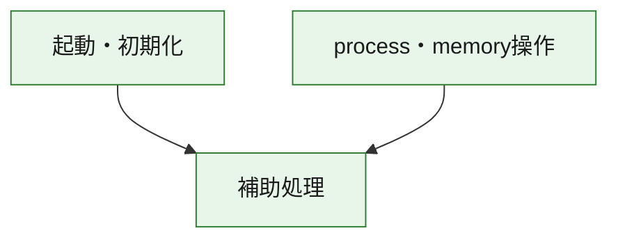
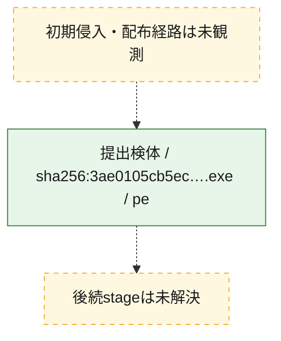
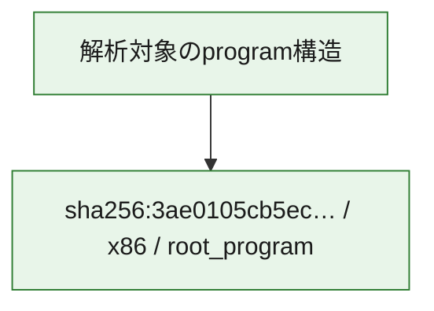

# 全体ロジック：3ae0105cb5ecc1c0cb6fdf2ba994a43f9ff703b832f2abc6c21849a5a1788a45

代表関数の静的証跡から、起動・初期化、process・memory操作の処理群を確認しました。

## 読み方

- phaseの掲載順は解析上の整理順です。observed_call_edgesがない段階間の実行順を断定しません。
- 図の実線は静的に観測した関係、点線と黄色のノードは未観測・未解決の関係を示します。
- 図は静的な要約であり、動的実行を再現するものではありません。
- 詳細な関数解説とfingerprintは[STATIC-LOGIC.md](STATIC-LOGIC.md)を参照してください。

## 静的可視化

### 実行フロー

### 感染チェーン

### モジュール関係

## 処理段階

### 1. 起動・初期化

entry pointから初期化と後続処理への移行を確認します。
確度: `confirmed_static_function_evidence`

- `3ae0105cb5ecc1c0cb6fdf2ba994a43f9ff703b832f2abc6c21849a5a1788a45:ghidra:1400013e0` — 初期化と主要処理への分岐を行う入口関数です。 状態: `succeeded`、選定理由: `entry_point`, `meaningful_symbol_name`, `reviewed_call_centrality:1`, `role:entrypoint`

### 2. process・memory操作

process、thread、module、memory操作と実行移行を確認します。
確度: `confirmed_static_function_evidence`

- `3ae0105cb5ecc1c0cb6fdf2ba994a43f9ff703b832f2abc6c21849a5a1788a45:ghidra:14000ad90` — process、thread、module、またはmemory操作に関係する関数です。 状態: `succeeded`、選定理由: `context_representative`, `reviewed_call_centrality:16`, `role:process_or_memory_operation`
- `3ae0105cb5ecc1c0cb6fdf2ba994a43f9ff703b832f2abc6c21849a5a1788a45:ghidra:14000ae00` — process、thread、module、またはmemory操作に関係する関数です。 状態: `succeeded`、選定理由: `context_representative`, `reviewed_call_centrality:12`, `role:process_or_memory_operation`

### 3. 補助処理

主要処理を支える一般内部関数またはlibrary処理を確認します。
確度: `confirmed_static_function_evidence_with_limits`

- `3ae0105cb5ecc1c0cb6fdf2ba994a43f9ff703b832f2abc6c21849a5a1788a45:ghidra:140001000` — 検体内部の一般処理を実装する関数です。 状態: `succeeded`、選定理由: `context_representative`
- `3ae0105cb5ecc1c0cb6fdf2ba994a43f9ff703b832f2abc6c21849a5a1788a45:ghidra:140001010` — 検体内部の一般処理を実装する関数です。 状態: `succeeded`、選定理由: `context_representative`, `reviewed_call_centrality:6`
- `3ae0105cb5ecc1c0cb6fdf2ba994a43f9ff703b832f2abc6c21849a5a1788a45:ghidra:140001140` — 検体内部の一般処理を実装する関数です。 状態: `succeeded`、選定理由: `context_representative`, `reviewed_call_centrality:1`
- `3ae0105cb5ecc1c0cb6fdf2ba994a43f9ff703b832f2abc6c21849a5a1788a45:ghidra:140001190` — 検体内部の一般処理を実装する関数です。 状態: `succeeded`、選定理由: `context_representative`, `reviewed_call_centrality:21`
- `3ae0105cb5ecc1c0cb6fdf2ba994a43f9ff703b832f2abc6c21849a5a1788a45:ghidra:140001410` — 検体内部の一般処理を実装する関数です。 状態: `succeeded`、選定理由: `context_representative`, `reviewed_call_centrality:1`
- `3ae0105cb5ecc1c0cb6fdf2ba994a43f9ff703b832f2abc6c21849a5a1788a45:ghidra:140001440` — 検体内部の一般処理を実装する関数です。 状態: `succeeded`、選定理由: `context_representative`, `reviewed_call_centrality:1`
- `3ae0105cb5ecc1c0cb6fdf2ba994a43f9ff703b832f2abc6c21849a5a1788a45:ghidra:140001460` — 検体内部の一般処理を実装する関数です。 状態: `succeeded`、選定理由: `context_representative`, `reviewed_call_centrality:1`
- `3ae0105cb5ecc1c0cb6fdf2ba994a43f9ff703b832f2abc6c21849a5a1788a45:ghidra:140001470` — 検体内部の一般処理を実装する関数です。 状態: `succeeded`、選定理由: `context_representative`
- `3ae0105cb5ecc1c0cb6fdf2ba994a43f9ff703b832f2abc6c21849a5a1788a45:ghidra:14000aab0` — 検体内部の一般処理を実装する関数です。 状態: `succeeded`、選定理由: `context_representative`
- `3ae0105cb5ecc1c0cb6fdf2ba994a43f9ff703b832f2abc6c21849a5a1788a45:ghidra:14000ab00` — 検体内部の一般処理を実装する関数です。 状態: `succeeded`、選定理由: `context_representative`, `reviewed_call_centrality:1`
- `3ae0105cb5ecc1c0cb6fdf2ba994a43f9ff703b832f2abc6c21849a5a1788a45:ghidra:14000ab80` — 検体内部の一般処理を実装する関数です。 状態: `succeeded`、選定理由: `context_representative`, `reviewed_call_centrality:2`
- `3ae0105cb5ecc1c0cb6fdf2ba994a43f9ff703b832f2abc6c21849a5a1788a45:ghidra:14000aba0` — 検体内部の一般処理を実装する関数です。 状態: `succeeded`、選定理由: `context_representative`, `reviewed_call_centrality:1`
- `3ae0105cb5ecc1c0cb6fdf2ba994a43f9ff703b832f2abc6c21849a5a1788a45:ghidra:14000abb0` — compiler生成処理または汎用library処理とみられる関数です。 状態: `succeeded`、選定理由: `entry_point`, `meaningful_symbol_name`, `reviewed_call_centrality:1`
- `3ae0105cb5ecc1c0cb6fdf2ba994a43f9ff703b832f2abc6c21849a5a1788a45:ghidra:14000abe0` — compiler生成処理または汎用library処理とみられる関数です。 状態: `succeeded`、選定理由: `entry_point`, `meaningful_symbol_name`, `reviewed_call_centrality:3`
- `3ae0105cb5ecc1c0cb6fdf2ba994a43f9ff703b832f2abc6c21849a5a1788a45:ghidra:14000ac70` — 検体内部の一般処理を実装する関数です。 状態: `succeeded`、選定理由: `context_representative`
- `3ae0105cb5ecc1c0cb6fdf2ba994a43f9ff703b832f2abc6c21849a5a1788a45:ghidra:14000ac80` — 検体内部の一般処理を実装する関数です。 状態: `succeeded`、選定理由: `context_representative`, `reviewed_call_centrality:2`
- `3ae0105cb5ecc1c0cb6fdf2ba994a43f9ff703b832f2abc6c21849a5a1788a45:ghidra:14000ad80` — 検体内部の一般処理を実装する関数です。 状態: `succeeded`、選定理由: `context_representative`, `reviewed_call_centrality:3`
- `3ae0105cb5ecc1c0cb6fdf2ba994a43f9ff703b832f2abc6c21849a5a1788a45:ghidra:14000af70` — 検体内部の一般処理を実装する関数です。 状態: `succeeded`、選定理由: `context_representative`, `reviewed_call_centrality:4`
- `3ae0105cb5ecc1c0cb6fdf2ba994a43f9ff703b832f2abc6c21849a5a1788a45:ghidra:14000b2d0` — 検体内部の一般処理を実装する関数です。 状態: `succeeded`、選定理由: `context_representative`
- `3ae0105cb5ecc1c0cb6fdf2ba994a43f9ff703b832f2abc6c21849a5a1788a45:ghidra:14000b310` — 検体内部の一般処理を実装する関数です。 状態: `limited_bad_instruction_or_flow`、選定理由: `context_representative`, `reviewed_call_centrality:3`
- `3ae0105cb5ecc1c0cb6fdf2ba994a43f9ff703b832f2abc6c21849a5a1788a45:ghidra:14000b320` — 検体内部の一般処理を実装する関数です。 状態: `limited_bad_instruction_or_flow`、選定理由: `context_representative`, `reviewed_call_centrality:2`
- `3ae0105cb5ecc1c0cb6fdf2ba994a43f9ff703b832f2abc6c21849a5a1788a45:ghidra:14000b4e0` — 検体内部の一般処理を実装する関数です。 状態: `limited_bad_instruction_or_flow`、選定理由: `context_representative`, `reviewed_call_centrality:9`
- `3ae0105cb5ecc1c0cb6fdf2ba994a43f9ff703b832f2abc6c21849a5a1788a45:ghidra:14000b560` — 検体内部の一般処理を実装する関数です。 状態: `succeeded`、選定理由: `context_representative`, `reviewed_call_centrality:5`
- `3ae0105cb5ecc1c0cb6fdf2ba994a43f9ff703b832f2abc6c21849a5a1788a45:ghidra:14000b5e0` — 検体内部の一般処理を実装する関数です。 状態: `succeeded`、選定理由: `context_representative`, `reviewed_call_centrality:5`
- `3ae0105cb5ecc1c0cb6fdf2ba994a43f9ff703b832f2abc6c21849a5a1788a45:ghidra:14000b680` — 検体内部の一般処理を実装する関数です。 状態: `succeeded`、選定理由: `context_representative`, `reviewed_call_centrality:9`
- `3ae0105cb5ecc1c0cb6fdf2ba994a43f9ff703b832f2abc6c21849a5a1788a45:ghidra:14000b780` — 検体内部の一般処理を実装する関数です。 状態: `succeeded`、選定理由: `context_representative`
- `3ae0105cb5ecc1c0cb6fdf2ba994a43f9ff703b832f2abc6c21849a5a1788a45:ghidra:14000b7b0` — 検体内部の一般処理を実装する関数です。 状態: `succeeded`、選定理由: `context_representative`
- `3ae0105cb5ecc1c0cb6fdf2ba994a43f9ff703b832f2abc6c21849a5a1788a45:ghidra:14000b800` — 検体内部の一般処理を実装する関数です。 状態: `succeeded`、選定理由: `context_representative`, `reviewed_call_centrality:2`
- `3ae0105cb5ecc1c0cb6fdf2ba994a43f9ff703b832f2abc6c21849a5a1788a45:ghidra:14000b8b0` — 検体内部の一般処理を実装する関数です。 状態: `succeeded`、選定理由: `context_representative`, `reviewed_call_centrality:2`

## 観測したcall関係

- `3ae0105cb5ecc1c0cb6fdf2ba994a43f9ff703b832f2abc6c21849a5a1788a45:ghidra:140001010` → `3ae0105cb5ecc1c0cb6fdf2ba994a43f9ff703b832f2abc6c21849a5a1788a45:ghidra:14000aba0` （`support` → `support`）
- `3ae0105cb5ecc1c0cb6fdf2ba994a43f9ff703b832f2abc6c21849a5a1788a45:ghidra:140001010` → `3ae0105cb5ecc1c0cb6fdf2ba994a43f9ff703b832f2abc6c21849a5a1788a45:ghidra:14000b310` （`support` → `support`）
- `3ae0105cb5ecc1c0cb6fdf2ba994a43f9ff703b832f2abc6c21849a5a1788a45:ghidra:140001190` → `3ae0105cb5ecc1c0cb6fdf2ba994a43f9ff703b832f2abc6c21849a5a1788a45:ghidra:14000ab80` （`support` → `support`）
- `3ae0105cb5ecc1c0cb6fdf2ba994a43f9ff703b832f2abc6c21849a5a1788a45:ghidra:140001190` → `3ae0105cb5ecc1c0cb6fdf2ba994a43f9ff703b832f2abc6c21849a5a1788a45:ghidra:14000abe0` （`support` → `support`）
- `3ae0105cb5ecc1c0cb6fdf2ba994a43f9ff703b832f2abc6c21849a5a1788a45:ghidra:140001190` → `3ae0105cb5ecc1c0cb6fdf2ba994a43f9ff703b832f2abc6c21849a5a1788a45:ghidra:14000ad80` （`support` → `support`）
- `3ae0105cb5ecc1c0cb6fdf2ba994a43f9ff703b832f2abc6c21849a5a1788a45:ghidra:140001190` → `3ae0105cb5ecc1c0cb6fdf2ba994a43f9ff703b832f2abc6c21849a5a1788a45:ghidra:14000af70` （`support` → `support`）
- `3ae0105cb5ecc1c0cb6fdf2ba994a43f9ff703b832f2abc6c21849a5a1788a45:ghidra:1400013e0` → `3ae0105cb5ecc1c0cb6fdf2ba994a43f9ff703b832f2abc6c21849a5a1788a45:ghidra:140001190` （`startup` → `support`）
- `3ae0105cb5ecc1c0cb6fdf2ba994a43f9ff703b832f2abc6c21849a5a1788a45:ghidra:140001410` → `3ae0105cb5ecc1c0cb6fdf2ba994a43f9ff703b832f2abc6c21849a5a1788a45:ghidra:140001190` （`support` → `support`）
- `3ae0105cb5ecc1c0cb6fdf2ba994a43f9ff703b832f2abc6c21849a5a1788a45:ghidra:14000abb0` → `3ae0105cb5ecc1c0cb6fdf2ba994a43f9ff703b832f2abc6c21849a5a1788a45:ghidra:14000b680` （`support` → `support`）
- `3ae0105cb5ecc1c0cb6fdf2ba994a43f9ff703b832f2abc6c21849a5a1788a45:ghidra:14000abe0` → `3ae0105cb5ecc1c0cb6fdf2ba994a43f9ff703b832f2abc6c21849a5a1788a45:ghidra:14000b680` （`support` → `support`）
- `3ae0105cb5ecc1c0cb6fdf2ba994a43f9ff703b832f2abc6c21849a5a1788a45:ghidra:14000ad90` → `3ae0105cb5ecc1c0cb6fdf2ba994a43f9ff703b832f2abc6c21849a5a1788a45:ghidra:14000b8b0` （`execution` → `support`）
- `3ae0105cb5ecc1c0cb6fdf2ba994a43f9ff703b832f2abc6c21849a5a1788a45:ghidra:14000ae00` → `3ae0105cb5ecc1c0cb6fdf2ba994a43f9ff703b832f2abc6c21849a5a1788a45:ghidra:14000ad90` （`execution` → `execution`）
- `3ae0105cb5ecc1c0cb6fdf2ba994a43f9ff703b832f2abc6c21849a5a1788a45:ghidra:14000ae00` → `3ae0105cb5ecc1c0cb6fdf2ba994a43f9ff703b832f2abc6c21849a5a1788a45:ghidra:14000b8b0` （`execution` → `support`）
- `3ae0105cb5ecc1c0cb6fdf2ba994a43f9ff703b832f2abc6c21849a5a1788a45:ghidra:14000b320` → `3ae0105cb5ecc1c0cb6fdf2ba994a43f9ff703b832f2abc6c21849a5a1788a45:ghidra:14000ad80` （`support` → `support`）
- `3ae0105cb5ecc1c0cb6fdf2ba994a43f9ff703b832f2abc6c21849a5a1788a45:ghidra:14000b680` → `3ae0105cb5ecc1c0cb6fdf2ba994a43f9ff703b832f2abc6c21849a5a1788a45:ghidra:14000ad80` （`support` → `support`）
- `3ae0105cb5ecc1c0cb6fdf2ba994a43f9ff703b832f2abc6c21849a5a1788a45:ghidra:14000b680` → `3ae0105cb5ecc1c0cb6fdf2ba994a43f9ff703b832f2abc6c21849a5a1788a45:ghidra:14000b4e0` （`support` → `support`）
- `ghidra-function:0362ef56db3c26eefcd28665` → `ghidra-external:8f6a2b0c1f14a41899c3f91b` （`unclassified` → `unclassified`）
- `ghidra-function:0362ef56db3c26eefcd28665` → `ghidra-function:d6d833bab57aa8513715ff96` （`unclassified` → `unclassified`）
- `ghidra-function:0362ef56db3c26eefcd28665` → `ghidra-function:ea51ce3207e2ea7c27df2447` （`unclassified` → `unclassified`）
- `ghidra-function:04e6ccd2b3b1b44c25a60fcd` → `ghidra-external:571dc69bd34aa1aea6e80ca6` （`unclassified` → `unclassified`）
- `ghidra-function:04e6ccd2b3b1b44c25a60fcd` → `ghidra-function:745ce393b97c096311c9ef02` （`unclassified` → `unclassified`）
- `ghidra-function:21395960d66e5081f1000e91` → `ghidra-external:066e51a3aaec86b8758052bb` （`unclassified` → `unclassified`）
- `ghidra-function:21395960d66e5081f1000e91` → `ghidra-external:2cdc2aebe11ae5fd4ac9e2d6` （`unclassified` → `unclassified`）
- `ghidra-function:21395960d66e5081f1000e91` → `ghidra-external:55f9801076570c7894808380` （`unclassified` → `unclassified`）
- `ghidra-function:21395960d66e5081f1000e91` → `ghidra-external:564a1debb708d4fd3149fad5` （`unclassified` → `unclassified`）
- `ghidra-function:21395960d66e5081f1000e91` → `ghidra-external:a502426e7d92f086a8e6b599` （`unclassified` → `unclassified`）
- `ghidra-function:21395960d66e5081f1000e91` → `ghidra-external:bbfbfecf578f84ebd4fce1f9` （`unclassified` → `unclassified`）
- `ghidra-function:21395960d66e5081f1000e91` → `ghidra-external:da8260be350cbf8bbea54834` （`unclassified` → `unclassified`）
- `ghidra-function:21395960d66e5081f1000e91` → `ghidra-external:e1f70aa980be92ed9127dbad` （`unclassified` → `unclassified`）
- `ghidra-function:21395960d66e5081f1000e91` → `ghidra-external:e655aa04e2a1bbb24b1c2c05` （`unclassified` → `unclassified`）
- `ghidra-function:21395960d66e5081f1000e91` → `ghidra-external:e8488f288e1a4ee06fb394be` （`unclassified` → `unclassified`）
- `ghidra-function:21395960d66e5081f1000e91` → `ghidra-function:04e6ccd2b3b1b44c25a60fcd` （`unclassified` → `unclassified`）
- `ghidra-function:21395960d66e5081f1000e91` → `ghidra-function:1ba5b3e35f255a54f5229237` （`unclassified` → `unclassified`）
- `ghidra-function:21395960d66e5081f1000e91` → `ghidra-function:3f23cf218db9d940d27a2774` （`unclassified` → `unclassified`）
- `ghidra-function:21395960d66e5081f1000e91` → `ghidra-function:792c8bb455d4d99accd98a1e` （`unclassified` → `unclassified`）
- `ghidra-function:21395960d66e5081f1000e91` → `ghidra-function:b2433088b0650f69f59bc3e1` （`unclassified` → `unclassified`）
- `ghidra-function:21395960d66e5081f1000e91` → `ghidra-function:f43361cb64a621f91f95c495` （`unclassified` → `unclassified`）
- `ghidra-function:21395960d66e5081f1000e91` → `ghidra-function:fe16e49f0cc982a2471e47b2` （`unclassified` → `unclassified`）
- `ghidra-function:3f23cf218db9d940d27a2774` → `ghidra-external:3ad16be2894c16e45a45dedf` （`unclassified` → `unclassified`）
- `ghidra-function:5d59cc46162a412f48296704` → `ghidra-external:3ad16be2894c16e45a45dedf` （`unclassified` → `unclassified`）
- `ghidra-function:607534419927b697a87dd840` → `ghidra-external:ba2046501364bbf60c770698` （`unclassified` → `unclassified`）
- `ghidra-function:607534419927b697a87dd840` → `ghidra-function:d6d833bab57aa8513715ff96` （`unclassified` → `unclassified`）
- `ghidra-function:607534419927b697a87dd840` → `ghidra-function:ea51ce3207e2ea7c27df2447` （`unclassified` → `unclassified`）
- `ghidra-function:745ce393b97c096311c9ef02` → `ghidra-external:ba2046501364bbf60c770698` （`unclassified` → `unclassified`）
- `ghidra-function:745ce393b97c096311c9ef02` → `ghidra-function:a1216ef74b05447bdf895a9f` （`unclassified` → `unclassified`）
- `ghidra-function:745ce393b97c096311c9ef02` → `ghidra-function:dd402b6016f435a530bd9d06` （`unclassified` → `unclassified`）
- `ghidra-function:745ce393b97c096311c9ef02` → `ghidra-function:e7c71c0f358384ec3f0ac0f2` （`unclassified` → `unclassified`）
- `ghidra-function:745ce393b97c096311c9ef02` → `ghidra-function:f43361cb64a621f91f95c495` （`unclassified` → `unclassified`）
- `ghidra-function:792c8bb455d4d99accd98a1e` → `ghidra-external:571dc69bd34aa1aea6e80ca6` （`unclassified` → `unclassified`）
- `ghidra-function:792c8bb455d4d99accd98a1e` → `ghidra-external:cb79cba219dfb4cb71a6d393` （`unclassified` → `unclassified`）
- `ghidra-function:792c8bb455d4d99accd98a1e` → `ghidra-function:6691e116d7eb4c4f990571e9` （`unclassified` → `unclassified`）
- `ghidra-function:823dd6609b39eefdcac2b9a2` → `ghidra-external:a3070f3199408e6a8e328952` （`unclassified` → `unclassified`）
- `ghidra-function:8bb9a866c86294d3d8695896` → `ghidra-external:3ad16be2894c16e45a45dedf` （`unclassified` → `unclassified`）
- `ghidra-function:95c4634ecb1608c1b3fb09b6` → `ghidra-function:21395960d66e5081f1000e91` （`unclassified` → `unclassified`）
- `ghidra-function:9984e7d8284e91585a2688e0` → `ghidra-external:082bfc50b8147e820f30d8b1` （`unclassified` → `unclassified`）
- `ghidra-function:9984e7d8284e91585a2688e0` → `ghidra-external:571dc69bd34aa1aea6e80ca6` （`unclassified` → `unclassified`）
- `ghidra-function:9984e7d8284e91585a2688e0` → `ghidra-function:56a79574a1e678280419c77d` （`unclassified` → `unclassified`）
- `ghidra-function:9984e7d8284e91585a2688e0` → `ghidra-function:a2c22129b9b1802d2b805cef` （`unclassified` → `unclassified`）
- `ghidra-function:9984e7d8284e91585a2688e0` → `ghidra-function:e9aca6d9b559738fd9eb95ec` （`unclassified` → `unclassified`）
- `ghidra-function:9984e7d8284e91585a2688e0` → `ghidra-function:fb3daceb3fb12e4b2f542e10` （`unclassified` → `unclassified`）
- `ghidra-function:c2748106d4b383fd11d844b1` → `ghidra-external:3ad16be2894c16e45a45dedf` （`unclassified` → `unclassified`）
- `ghidra-function:d19c1cec56fc8ec0f2c341ee` → `ghidra-external:5056e54cacbeee784e4dcc9a` （`unclassified` → `unclassified`）
- `ghidra-function:d19c1cec56fc8ec0f2c341ee` → `ghidra-external:571dc69bd34aa1aea6e80ca6` （`unclassified` → `unclassified`）
- `ghidra-function:d19c1cec56fc8ec0f2c341ee` → `ghidra-external:a8880cd9139b83fde3ffc2fb` （`unclassified` → `unclassified`）
- `ghidra-function:d19c1cec56fc8ec0f2c341ee` → `ghidra-external:b22dcbdbb7fac42acbc7d47f` （`unclassified` → `unclassified`）
- `ghidra-function:d19c1cec56fc8ec0f2c341ee` → `ghidra-external:cb79cba219dfb4cb71a6d393` （`unclassified` → `unclassified`）
- `ghidra-function:d19c1cec56fc8ec0f2c341ee` → `ghidra-function:59842620b84accc3e1ae20fd` （`unclassified` → `unclassified`）
- `ghidra-function:d19c1cec56fc8ec0f2c341ee` → `ghidra-function:60ddf9f0eec66041991e1f49` （`unclassified` → `unclassified`）
- `ghidra-function:d19c1cec56fc8ec0f2c341ee` → `ghidra-function:6691e116d7eb4c4f990571e9` （`unclassified` → `unclassified`）
- `ghidra-function:d19c1cec56fc8ec0f2c341ee` → `ghidra-function:8f75363f54d5f8f1ebcb71f6` （`unclassified` → `unclassified`）
- `ghidra-function:d19c1cec56fc8ec0f2c341ee` → `ghidra-function:92fe1fb90d1747a465be89f6` （`unclassified` → `unclassified`）
- `ghidra-function:d19c1cec56fc8ec0f2c341ee` → `ghidra-function:c88efe2bc3bbbe7e7b7d92cd` （`unclassified` → `unclassified`）
- `ghidra-function:d19c1cec56fc8ec0f2c341ee` → `ghidra-function:e67dad9860fba99549fb5772` （`unclassified` → `unclassified`）
- `ghidra-function:d8c912692e3a91a9a3b1fceb` → `ghidra-function:745ce393b97c096311c9ef02` （`unclassified` → `unclassified`）
- `ghidra-function:e0b70574acb6c980695607cc` → `ghidra-external:23543c370caf05a5535775fd` （`unclassified` → `unclassified`）
- `ghidra-function:e0b70574acb6c980695607cc` → `ghidra-function:8f75363f54d5f8f1ebcb71f6` （`unclassified` → `unclassified`）
- `ghidra-function:e7c71c0f358384ec3f0ac0f2` → `ghidra-function:68850627c561cbf8e3030139` （`unclassified` → `unclassified`）
- `ghidra-function:e7c71c0f358384ec3f0ac0f2` → `ghidra-function:92fe1fb90d1747a465be89f6` （`unclassified` → `unclassified`）
- `ghidra-function:e7c71c0f358384ec3f0ac0f2` → `ghidra-function:d6d833bab57aa8513715ff96` （`unclassified` → `unclassified`）
- `ghidra-function:e7c71c0f358384ec3f0ac0f2` → `ghidra-function:ea51ce3207e2ea7c27df2447` （`unclassified` → `unclassified`）
- `ghidra-function:f0117ecf5286244b68152cc7` → `ghidra-external:571dc69bd34aa1aea6e80ca6` （`unclassified` → `unclassified`）
- `ghidra-function:f0117ecf5286244b68152cc7` → `ghidra-external:cb79cba219dfb4cb71a6d393` （`unclassified` → `unclassified`）
- `ghidra-function:f0117ecf5286244b68152cc7` → `ghidra-function:59842620b84accc3e1ae20fd` （`unclassified` → `unclassified`）
- `ghidra-function:f0117ecf5286244b68152cc7` → `ghidra-function:60ddf9f0eec66041991e1f49` （`unclassified` → `unclassified`）
- `ghidra-function:f0117ecf5286244b68152cc7` → `ghidra-function:6691e116d7eb4c4f990571e9` （`unclassified` → `unclassified`）
- `ghidra-function:f0117ecf5286244b68152cc7` → `ghidra-function:92fe1fb90d1747a465be89f6` （`unclassified` → `unclassified`）
- `ghidra-function:f0117ecf5286244b68152cc7` → `ghidra-function:c88efe2bc3bbbe7e7b7d92cd` （`unclassified` → `unclassified`）
- `ghidra-function:f0117ecf5286244b68152cc7` → `ghidra-function:d19c1cec56fc8ec0f2c341ee` （`unclassified` → `unclassified`）
- `ghidra-function:f0117ecf5286244b68152cc7` → `ghidra-function:e67dad9860fba99549fb5772` （`unclassified` → `unclassified`）
- `ghidra-function:f6c86ee5c313ff007a794d13` → `ghidra-external:57a41cbf90f59b0ff99a5ca3` （`unclassified` → `unclassified`）
- `ghidra-function:f6c86ee5c313ff007a794d13` → `ghidra-function:f43361cb64a621f91f95c495` （`unclassified` → `unclassified`）
- `ghidra-function:f908f340b1fa9dab9d61de70` → `ghidra-external:55f9801076570c7894808380` （`unclassified` → `unclassified`）
- `ghidra-function:f908f340b1fa9dab9d61de70` → `ghidra-external:63839d9513792d8190b18552` （`unclassified` → `unclassified`）
- `ghidra-function:fb3daceb3fb12e4b2f542e10` → `ghidra-function:7190f2f52369bbac5f9169c7` （`unclassified` → `unclassified`）
- `ghidra-function:fe479bebe771e3a95a15be05` → `ghidra-function:21395960d66e5081f1000e91` （`unclassified` → `unclassified`）

## 解析範囲と制約

- 選定外関数は全体inventoryへ残しますが、関数本体の個別解説対象にはしていません。
- indirect call、難読化、packer、VM、壊れたcontrol flowによりcall関係が欠落する場合があります。
- 文書は静的解析に基づき、検体実行や外部通信による動的確認は行っていません。
