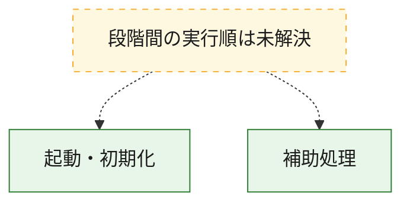
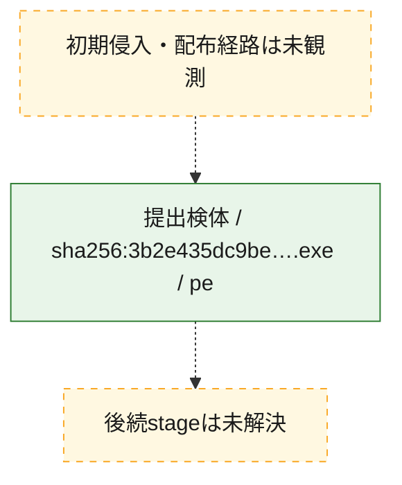
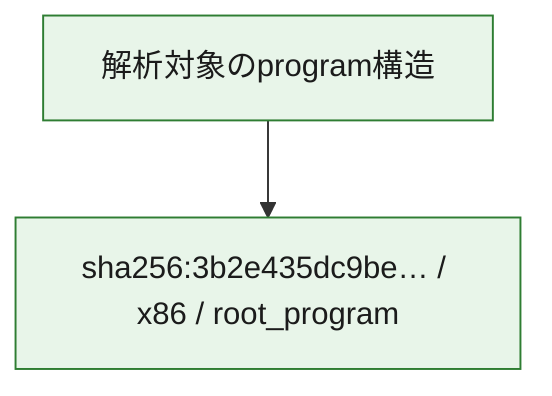

# 全体ロジック：3b2e435dc9bea6c2123f9c725543a6140cef01884c9c11ad76a0c2581ee8684d

代表関数の静的証跡から、起動・初期化の処理群を確認しました。

## 読み方

- phaseの掲載順は解析上の整理順です。observed_call_edgesがない段階間の実行順を断定しません。
- 図の実線は静的に観測した関係、点線と黄色のノードは未観測・未解決の関係を示します。
- 図は静的な要約であり、動的実行を再現するものではありません。
- 詳細な関数解説とfingerprintは[STATIC-LOGIC.md](STATIC-LOGIC.md)を参照してください。

## 静的可視化

### 実行フロー

### 感染チェーン

### モジュール関係

## 処理段階

### 1. 起動・初期化

entry pointから初期化と後続処理への移行を確認します。
確度: `confirmed_static_function_evidence`

- `3b2e435dc9bea6c2123f9c725543a6140cef01884c9c11ad76a0c2581ee8684d:ghidra:00401000` — 初期化と主要処理への分岐を行う入口関数です。 状態: `succeeded`、選定理由: `entry_point`, `meaningful_symbol_name`, `reviewed_call_centrality:3`, `role:entrypoint`

### 2. 補助処理

主要処理を支える一般内部関数またはlibrary処理を確認します。
確度: `confirmed_static_function_evidence_with_limits`

- `3b2e435dc9bea6c2123f9c725543a6140cef01884c9c11ad76a0c2581ee8684d:ghidra:00401011` — 検体内部の一般処理を実装する関数です。 状態: `succeeded`、選定理由: `context_representative`, `reviewed_call_centrality:37`
- `3b2e435dc9bea6c2123f9c725543a6140cef01884c9c11ad76a0c2581ee8684d:ghidra:00402494` — 検体内部の一般処理を実装する関数です。 状態: `succeeded`、選定理由: `context_representative`, `reviewed_call_centrality:64`
- `3b2e435dc9bea6c2123f9c725543a6140cef01884c9c11ad76a0c2581ee8684d:ghidra:00406162` — 検体内部の一般処理を実装する関数です。 状態: `succeeded`、選定理由: `context_representative`, `reviewed_call_centrality:2`
- `3b2e435dc9bea6c2123f9c725543a6140cef01884c9c11ad76a0c2581ee8684d:ghidra:00406193` — 検体内部の一般処理を実装する関数です。 状態: `succeeded`、選定理由: `context_representative`, `reviewed_call_centrality:2`
- `3b2e435dc9bea6c2123f9c725543a6140cef01884c9c11ad76a0c2581ee8684d:ghidra:00406204` — 検体内部の一般処理を実装する関数です。 状態: `succeeded`、選定理由: `context_representative`, `reviewed_call_centrality:14`
- `3b2e435dc9bea6c2123f9c725543a6140cef01884c9c11ad76a0c2581ee8684d:ghidra:00406871` — 検体内部の一般処理を実装する関数です。 状態: `succeeded`、選定理由: `context_representative`, `reviewed_call_centrality:5`
- `3b2e435dc9bea6c2123f9c725543a6140cef01884c9c11ad76a0c2581ee8684d:ghidra:004069e6` — 検体内部の一般処理を実装する関数です。 状態: `limited_bad_instruction_or_flow`、選定理由: `context_representative`, `reviewed_call_centrality:10`
- `3b2e435dc9bea6c2123f9c725543a6140cef01884c9c11ad76a0c2581ee8684d:ghidra:00406bcb` — 検体内部の一般処理を実装する関数です。 状態: `succeeded`、選定理由: `context_representative`, `reviewed_call_centrality:2`
- `3b2e435dc9bea6c2123f9c725543a6140cef01884c9c11ad76a0c2581ee8684d:ghidra:00406c30` — 検体内部の一般処理を実装する関数です。 状態: `succeeded`、選定理由: `context_representative`, `reviewed_call_centrality:3`
- `3b2e435dc9bea6c2123f9c725543a6140cef01884c9c11ad76a0c2581ee8684d:ghidra:00406dda` — 検体内部の一般処理を実装する関数です。 状態: `succeeded`、選定理由: `context_representative`, `reviewed_call_centrality:6`
- `3b2e435dc9bea6c2123f9c725543a6140cef01884c9c11ad76a0c2581ee8684d:ghidra:00406ef1` — 検体内部の一般処理を実装する関数です。 状態: `succeeded`、選定理由: `context_representative`, `reviewed_call_centrality:3`
- `3b2e435dc9bea6c2123f9c725543a6140cef01884c9c11ad76a0c2581ee8684d:ghidra:00406f4d` — 検体内部の一般処理を実装する関数です。 状態: `succeeded`、選定理由: `context_representative`, `reviewed_call_centrality:1`
- `3b2e435dc9bea6c2123f9c725543a6140cef01884c9c11ad76a0c2581ee8684d:ghidra:00406f72` — 検体内部の一般処理を実装する関数です。 状態: `succeeded`、選定理由: `context_representative`, `reviewed_call_centrality:4`
- `3b2e435dc9bea6c2123f9c725543a6140cef01884c9c11ad76a0c2581ee8684d:ghidra:00406fbb` — 検体内部の一般処理を実装する関数です。 状態: `succeeded`、選定理由: `context_representative`, `reviewed_call_centrality:7`
- `3b2e435dc9bea6c2123f9c725543a6140cef01884c9c11ad76a0c2581ee8684d:ghidra:004070a3` — 検体内部の一般処理を実装する関数です。 状態: `succeeded`、選定理由: `context_representative`, `reviewed_call_centrality:10`
- `3b2e435dc9bea6c2123f9c725543a6140cef01884c9c11ad76a0c2581ee8684d:ghidra:00407237` — 検体内部の一般処理を実装する関数です。 状態: `succeeded`、選定理由: `context_representative`, `reviewed_call_centrality:2`
- `3b2e435dc9bea6c2123f9c725543a6140cef01884c9c11ad76a0c2581ee8684d:ghidra:0040726b` — 検体内部の一般処理を実装する関数です。 状態: `succeeded`、選定理由: `context_representative`, `reviewed_call_centrality:2`
- `3b2e435dc9bea6c2123f9c725543a6140cef01884c9c11ad76a0c2581ee8684d:ghidra:0040729f` — 検体内部の一般処理を実装する関数です。 状態: `succeeded`、選定理由: `context_representative`, `reviewed_call_centrality:2`
- `3b2e435dc9bea6c2123f9c725543a6140cef01884c9c11ad76a0c2581ee8684d:ghidra:004072e2` — 検体内部の一般処理を実装する関数です。 状態: `succeeded`、選定理由: `context_representative`, `reviewed_call_centrality:6`
- `3b2e435dc9bea6c2123f9c725543a6140cef01884c9c11ad76a0c2581ee8684d:ghidra:0040731d` — 検体内部の一般処理を実装する関数です。 状態: `succeeded`、選定理由: `context_representative`, `reviewed_call_centrality:5`
- `3b2e435dc9bea6c2123f9c725543a6140cef01884c9c11ad76a0c2581ee8684d:ghidra:0040736c` — 検体内部の一般処理を実装する関数です。 状態: `succeeded`、選定理由: `context_representative`, `reviewed_call_centrality:15`
- `3b2e435dc9bea6c2123f9c725543a6140cef01884c9c11ad76a0c2581ee8684d:ghidra:00407751` — 検体内部の一般処理を実装する関数です。 状態: `succeeded`、選定理由: `context_representative`, `reviewed_call_centrality:9`
- `3b2e435dc9bea6c2123f9c725543a6140cef01884c9c11ad76a0c2581ee8684d:ghidra:004078c0` — 検体内部の一般処理を実装する関数です。 状態: `succeeded`、選定理由: `context_representative`, `reviewed_call_centrality:8`
- `3b2e435dc9bea6c2123f9c725543a6140cef01884c9c11ad76a0c2581ee8684d:ghidra:004079ed` — 検体内部の一般処理を実装する関数です。 状態: `succeeded`、選定理由: `context_representative`, `reviewed_call_centrality:3`
- `3b2e435dc9bea6c2123f9c725543a6140cef01884c9c11ad76a0c2581ee8684d:ghidra:00407a15` — 検体内部の一般処理を実装する関数です。 状態: `succeeded`、選定理由: `context_representative`, `reviewed_call_centrality:3`
- `3b2e435dc9bea6c2123f9c725543a6140cef01884c9c11ad76a0c2581ee8684d:ghidra:00407a78` — 検体内部の一般処理を実装する関数です。 状態: `succeeded`、選定理由: `context_representative`, `reviewed_call_centrality:24`
- `3b2e435dc9bea6c2123f9c725543a6140cef01884c9c11ad76a0c2581ee8684d:ghidra:0040af6a` — 検体内部の一般処理を実装する関数です。 状態: `succeeded`、選定理由: `context_representative`, `reviewed_call_centrality:3`
- `3b2e435dc9bea6c2123f9c725543a6140cef01884c9c11ad76a0c2581ee8684d:ghidra:0040afb7` — 検体内部の一般処理を実装する関数です。 状態: `succeeded`、選定理由: `context_representative`, `reviewed_call_centrality:2`
- `3b2e435dc9bea6c2123f9c725543a6140cef01884c9c11ad76a0c2581ee8684d:ghidra:0040b035` — 検体内部の一般処理を実装する関数です。 状態: `succeeded`、選定理由: `context_representative`, `reviewed_call_centrality:3`
- `3b2e435dc9bea6c2123f9c725543a6140cef01884c9c11ad76a0c2581ee8684d:ghidra:0040b07f` — 検体内部の一般処理を実装する関数です。 状態: `succeeded`、選定理由: `context_representative`, `reviewed_call_centrality:4`
- `3b2e435dc9bea6c2123f9c725543a6140cef01884c9c11ad76a0c2581ee8684d:ghidra:0040b177` — 検体内部の一般処理を実装する関数です。 状態: `succeeded`、選定理由: `context_representative`, `reviewed_call_centrality:4`

## 観測したcall関係

- 代表関数間で直接解決できた呼出関係はありません。

## 解析範囲と制約

- 選定外関数は全体inventoryへ残しますが、関数本体の個別解説対象にはしていません。
- indirect call、難読化、packer、VM、壊れたcontrol flowによりcall関係が欠落する場合があります。
- 文書は静的解析に基づき、検体実行や外部通信による動的確認は行っていません。
