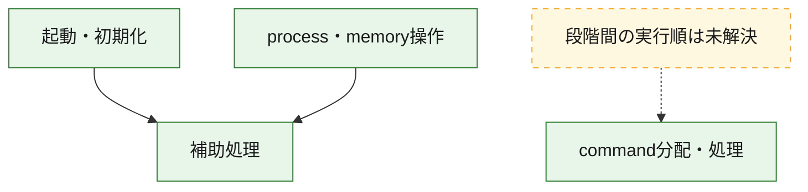
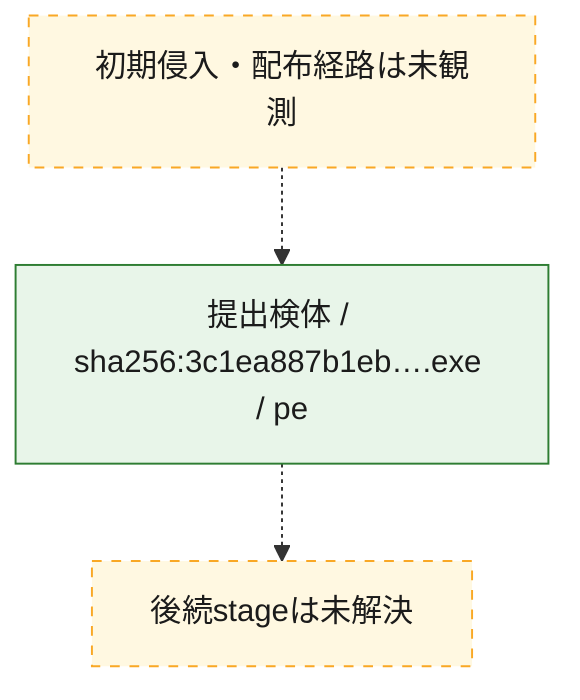
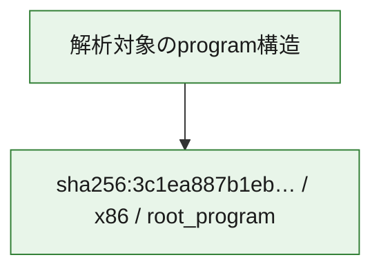

# 全体ロジック：3c1ea887b1ebe313d29fe724be3ba5eb97f6897711381cd2b6d38a48e7aff31c

代表関数の静的証跡から、起動・初期化、process・memory操作、command分配・処理の処理群を確認しました。

## 読み方

- phaseの掲載順は解析上の整理順です。observed_call_edgesがない段階間の実行順を断定しません。
- 図の実線は静的に観測した関係、点線と黄色のノードは未観測・未解決の関係を示します。
- 図は静的な要約であり、動的実行を再現するものではありません。
- 詳細な関数解説とfingerprintは[STATIC-LOGIC.md](STATIC-LOGIC.md)を参照してください。

## 静的可視化

### 実行フロー

### 感染チェーン

### モジュール関係

## 処理段階

### 1. 起動・初期化

entry pointから初期化と後続処理への移行を確認します。
確度: `confirmed_static_function_evidence`

- `3c1ea887b1ebe313d29fe724be3ba5eb97f6897711381cd2b6d38a48e7aff31c:ghidra:14000af4d` — 初期化と主要処理への分岐を行う入口関数です。 状態: `succeeded`、選定理由: `entry_point`, `meaningful_symbol_name`, `probable_go_main_user_code`, `reviewed_call_centrality:23`, `role:entrypoint`

### 2. process・memory操作

process、thread、module、memory操作と実行移行を確認します。
確度: `confirmed_static_function_evidence`

- `3c1ea887b1ebe313d29fe724be3ba5eb97f6897711381cd2b6d38a48e7aff31c:ghidra:14000b890` — process、thread、module、またはmemory操作に関係する関数です。 状態: `succeeded`、選定理由: `meaningful_symbol_name`, `reviewed_call_centrality:16`, `role:process_or_memory_operation`
- `3c1ea887b1ebe313d29fe724be3ba5eb97f6897711381cd2b6d38a48e7aff31c:ghidra:14000b900` — process、thread、module、またはmemory操作に関係する関数です。 状態: `succeeded`、選定理由: `meaningful_symbol_name`, `reviewed_call_centrality:12`, `role:process_or_memory_operation`

### 3. command分配・処理

受信commandやtaskの解釈、分配、個別handlerへの移行を確認します。
確度: `confirmed_static_function_evidence`

- `3c1ea887b1ebe313d29fe724be3ba5eb97f6897711381cd2b6d38a48e7aff31c:ghidra:140011430` — commandの解釈、分配、または個別処理を担当する関数です。 状態: `succeeded`、選定理由: `meaningful_symbol_name`, `role:command_dispatch_or_handler`
- `3c1ea887b1ebe313d29fe724be3ba5eb97f6897711381cd2b6d38a48e7aff31c:ghidra:140011440` — commandの解釈、分配、または個別処理を担当する関数です。 状態: `succeeded`、選定理由: `meaningful_symbol_name`, `reviewed_call_centrality:2`, `role:command_dispatch_or_handler`

### 4. 補助処理

主要処理を支える一般内部関数またはlibrary処理を確認します。
確度: `confirmed_static_function_evidence_with_limits`

- `3c1ea887b1ebe313d29fe724be3ba5eb97f6897711381cd2b6d38a48e7aff31c:ghidra:140001010` — 検体内部の一般処理を実装する関数です。 状態: `succeeded`、選定理由: `meaningful_symbol_name`, `reviewed_call_centrality:6`
- `3c1ea887b1ebe313d29fe724be3ba5eb97f6897711381cd2b6d38a48e7aff31c:ghidra:140001140` — 検体内部の一般処理を実装する関数です。 状態: `succeeded`、選定理由: `meaningful_symbol_name`, `reviewed_call_centrality:1`
- `3c1ea887b1ebe313d29fe724be3ba5eb97f6897711381cd2b6d38a48e7aff31c:ghidra:1400013e0` — 検体内部の一般処理を実装する関数です。 状態: `succeeded`、選定理由: `meaningful_symbol_name`, `reviewed_call_centrality:1`
- `3c1ea887b1ebe313d29fe724be3ba5eb97f6897711381cd2b6d38a48e7aff31c:ghidra:140001410` — 検体内部の一般処理を実装する関数です。 状態: `succeeded`、選定理由: `entry_point`, `meaningful_symbol_name`, `reviewed_call_centrality:1`
- `3c1ea887b1ebe313d29fe724be3ba5eb97f6897711381cd2b6d38a48e7aff31c:ghidra:140001440` — 検体内部の一般処理を実装する関数です。 状態: `succeeded`、選定理由: `meaningful_symbol_name`, `reviewed_call_centrality:2`
- `3c1ea887b1ebe313d29fe724be3ba5eb97f6897711381cd2b6d38a48e7aff31c:ghidra:14000a5d0` — 検体内部の一般処理を実装する関数です。 状態: `succeeded`、選定理由: `meaningful_symbol_name`, `reviewed_call_centrality:2`
- `3c1ea887b1ebe313d29fe724be3ba5eb97f6897711381cd2b6d38a48e7aff31c:ghidra:14000a61a` — 検体内部の一般処理を実装する関数です。 状態: `succeeded`、選定理由: `meaningful_symbol_name`, `reviewed_call_centrality:2`
- `3c1ea887b1ebe313d29fe724be3ba5eb97f6897711381cd2b6d38a48e7aff31c:ghidra:14000a669` — 検体内部の一般処理を実装する関数です。 状態: `succeeded`、選定理由: `meaningful_symbol_name`, `reviewed_call_centrality:2`
- `3c1ea887b1ebe313d29fe724be3ba5eb97f6897711381cd2b6d38a48e7aff31c:ghidra:14000a745` — 検体内部の一般処理を実装する関数です。 状態: `succeeded`、選定理由: `meaningful_symbol_name`, `reviewed_call_centrality:22`
- `3c1ea887b1ebe313d29fe724be3ba5eb97f6897711381cd2b6d38a48e7aff31c:ghidra:14000ae90` — 検体内部の一般処理を実装する関数です。 状態: `succeeded`、選定理由: `meaningful_symbol_name`, `reviewed_call_centrality:5`
- `3c1ea887b1ebe313d29fe724be3ba5eb97f6897711381cd2b6d38a48e7aff31c:ghidra:14000b5b0` — 検体内部の一般処理を実装する関数です。 状態: `succeeded`、選定理由: `meaningful_symbol_name`, `reviewed_call_centrality:1`
- `3c1ea887b1ebe313d29fe724be3ba5eb97f6897711381cd2b6d38a48e7aff31c:ghidra:14000b6a0` — 検体内部の一般処理を実装する関数です。 状態: `succeeded`、選定理由: `meaningful_symbol_name`, `reviewed_call_centrality:1`
- `3c1ea887b1ebe313d29fe724be3ba5eb97f6897711381cd2b6d38a48e7aff31c:ghidra:14000b6b0` — compiler生成処理または汎用library処理とみられる関数です。 状態: `succeeded`、選定理由: `entry_point`, `meaningful_symbol_name`, `reviewed_call_centrality:1`
- `3c1ea887b1ebe313d29fe724be3ba5eb97f6897711381cd2b6d38a48e7aff31c:ghidra:14000b6e0` — compiler生成処理または汎用library処理とみられる関数です。 状態: `succeeded`、選定理由: `entry_point`, `meaningful_symbol_name`, `reviewed_call_centrality:2`
- `3c1ea887b1ebe313d29fe724be3ba5eb97f6897711381cd2b6d38a48e7aff31c:ghidra:14000b780` — 検体内部の一般処理を実装する関数です。 状態: `succeeded`、選定理由: `meaningful_symbol_name`, `reviewed_call_centrality:3`
- `3c1ea887b1ebe313d29fe724be3ba5eb97f6897711381cd2b6d38a48e7aff31c:ghidra:14000b880` — 検体内部の一般処理を実装する関数です。 状態: `succeeded`、選定理由: `meaningful_symbol_name`, `reviewed_call_centrality:1`
- `3c1ea887b1ebe313d29fe724be3ba5eb97f6897711381cd2b6d38a48e7aff31c:ghidra:14000ba70` — 検体内部の一般処理を実装する関数です。 状態: `succeeded`、選定理由: `meaningful_symbol_name`, `reviewed_call_centrality:3`
- `3c1ea887b1ebe313d29fe724be3ba5eb97f6897711381cd2b6d38a48e7aff31c:ghidra:14000be20` — 検体内部の一般処理を実装する関数です。 状態: `limited_bad_instruction_or_flow`、選定理由: `meaningful_symbol_name`, `reviewed_call_centrality:3`
- `3c1ea887b1ebe313d29fe724be3ba5eb97f6897711381cd2b6d38a48e7aff31c:ghidra:14000c280` — 検体内部の一般処理を実装する関数です。 状態: `succeeded`、選定理由: `meaningful_symbol_name`, `reviewed_call_centrality:1`
- `3c1ea887b1ebe313d29fe724be3ba5eb97f6897711381cd2b6d38a48e7aff31c:ghidra:14000c2b0` — 検体内部の一般処理を実装する関数です。 状態: `succeeded`、選定理由: `meaningful_symbol_name`
- `3c1ea887b1ebe313d29fe724be3ba5eb97f6897711381cd2b6d38a48e7aff31c:ghidra:14000c300` — 検体内部の一般処理を実装する関数です。 状態: `succeeded`、選定理由: `meaningful_symbol_name`, `reviewed_call_centrality:2`
- `3c1ea887b1ebe313d29fe724be3ba5eb97f6897711381cd2b6d38a48e7aff31c:ghidra:14000c470` — 検体内部の一般処理を実装する関数です。 状態: `succeeded`、選定理由: `meaningful_symbol_name`
- `3c1ea887b1ebe313d29fe724be3ba5eb97f6897711381cd2b6d38a48e7aff31c:ghidra:14000c4f0` — 検体内部の一般処理を実装する関数です。 状態: `succeeded`、選定理由: `meaningful_symbol_name`, `reviewed_call_centrality:3`
- `3c1ea887b1ebe313d29fe724be3ba5eb97f6897711381cd2b6d38a48e7aff31c:ghidra:14000c530` — 検体内部の一般処理を実装する関数です。 状態: `succeeded`、選定理由: `meaningful_symbol_name`, `reviewed_call_centrality:1`
- `3c1ea887b1ebe313d29fe724be3ba5eb97f6897711381cd2b6d38a48e7aff31c:ghidra:14000c6c0` — 検体内部の一般処理を実装する関数です。 状態: `succeeded`、選定理由: `meaningful_symbol_name`, `reviewed_call_centrality:2`
- `3c1ea887b1ebe313d29fe724be3ba5eb97f6897711381cd2b6d38a48e7aff31c:ghidra:1400106d0` — 検体内部の一般処理を実装する関数です。 状態: `limited_bad_instruction_or_flow`、選定理由: `meaningful_symbol_name`, `reviewed_call_centrality:10`
- `3c1ea887b1ebe313d29fe724be3ba5eb97f6897711381cd2b6d38a48e7aff31c:ghidra:1400107c0` — 検体内部の一般処理を実装する関数です。 状態: `limited_bad_instruction_or_flow`、選定理由: `meaningful_symbol_name`, `reviewed_call_centrality:4`

## 観測したcall関係

- `3c1ea887b1ebe313d29fe724be3ba5eb97f6897711381cd2b6d38a48e7aff31c:ghidra:14000a745` → `3c1ea887b1ebe313d29fe724be3ba5eb97f6897711381cd2b6d38a48e7aff31c:ghidra:14000a61a` （`support` → `support`）
- `3c1ea887b1ebe313d29fe724be3ba5eb97f6897711381cd2b6d38a48e7aff31c:ghidra:14000a745` → `3c1ea887b1ebe313d29fe724be3ba5eb97f6897711381cd2b6d38a48e7aff31c:ghidra:14000a669` （`support` → `support`）
- `3c1ea887b1ebe313d29fe724be3ba5eb97f6897711381cd2b6d38a48e7aff31c:ghidra:14000ae90` → `3c1ea887b1ebe313d29fe724be3ba5eb97f6897711381cd2b6d38a48e7aff31c:ghidra:14000a61a` （`support` → `support`）
- `3c1ea887b1ebe313d29fe724be3ba5eb97f6897711381cd2b6d38a48e7aff31c:ghidra:14000ae90` → `3c1ea887b1ebe313d29fe724be3ba5eb97f6897711381cd2b6d38a48e7aff31c:ghidra:14000a745` （`support` → `support`）
- `3c1ea887b1ebe313d29fe724be3ba5eb97f6897711381cd2b6d38a48e7aff31c:ghidra:14000af4d` → `3c1ea887b1ebe313d29fe724be3ba5eb97f6897711381cd2b6d38a48e7aff31c:ghidra:14000a5d0` （`startup` → `support`）
- `3c1ea887b1ebe313d29fe724be3ba5eb97f6897711381cd2b6d38a48e7aff31c:ghidra:14000af4d` → `3c1ea887b1ebe313d29fe724be3ba5eb97f6897711381cd2b6d38a48e7aff31c:ghidra:14000a669` （`startup` → `support`）
- `3c1ea887b1ebe313d29fe724be3ba5eb97f6897711381cd2b6d38a48e7aff31c:ghidra:14000af4d` → `3c1ea887b1ebe313d29fe724be3ba5eb97f6897711381cd2b6d38a48e7aff31c:ghidra:14000ae90` （`startup` → `support`）
- `3c1ea887b1ebe313d29fe724be3ba5eb97f6897711381cd2b6d38a48e7aff31c:ghidra:14000b890` → `3c1ea887b1ebe313d29fe724be3ba5eb97f6897711381cd2b6d38a48e7aff31c:ghidra:14000c4f0` （`execution` → `support`）
- `3c1ea887b1ebe313d29fe724be3ba5eb97f6897711381cd2b6d38a48e7aff31c:ghidra:14000b900` → `3c1ea887b1ebe313d29fe724be3ba5eb97f6897711381cd2b6d38a48e7aff31c:ghidra:14000c4f0` （`execution` → `support`）
- `3c1ea887b1ebe313d29fe724be3ba5eb97f6897711381cd2b6d38a48e7aff31c:ghidra:14000be20` → `3c1ea887b1ebe313d29fe724be3ba5eb97f6897711381cd2b6d38a48e7aff31c:ghidra:14000b880` （`support` → `support`）
- `3c1ea887b1ebe313d29fe724be3ba5eb97f6897711381cd2b6d38a48e7aff31c:ghidra:1400106d0` → `3c1ea887b1ebe313d29fe724be3ba5eb97f6897711381cd2b6d38a48e7aff31c:ghidra:140001440` （`support` → `support`）
- `ghidra-function:0067d95fe710baa21e023b64` → `ghidra-external:57a9be68ea2bc8268e050e7d` （`unclassified` → `unclassified`）
- `ghidra-function:0067d95fe710baa21e023b64` → `ghidra-external:71946ec51010cb201e7696ce` （`unclassified` → `unclassified`）
- `ghidra-function:0f6e8e8297e8f01a9e6c5bde` → `ghidra-external:7fa0cce0aa35b2a0f210cf20` （`unclassified` → `unclassified`）
- `ghidra-function:12ca6beb1d809a49551ed17b` → `ghidra-external:06bd590a14c1048121ce5b63` （`unclassified` → `unclassified`）
- `ghidra-function:12ca6beb1d809a49551ed17b` → `ghidra-external:0de078b50515723f3bc4942d` （`unclassified` → `unclassified`）
- `ghidra-function:12ca6beb1d809a49551ed17b` → `ghidra-external:401f2def3f9ef1c0bad97264` （`unclassified` → `unclassified`）
- `ghidra-function:12ca6beb1d809a49551ed17b` → `ghidra-external:5bc15258a67c0d21f4e3dd90` （`unclassified` → `unclassified`）
- `ghidra-function:12ca6beb1d809a49551ed17b` → `ghidra-external:5bd8b7c2c4dc34976c5af15a` （`unclassified` → `unclassified`）
- `ghidra-function:12ca6beb1d809a49551ed17b` → `ghidra-external:64bc47c880e6235f5798c40b` （`unclassified` → `unclassified`）
- `ghidra-function:12ca6beb1d809a49551ed17b` → `ghidra-external:69783419602f3c0802a641a4` （`unclassified` → `unclassified`）
- `ghidra-function:12ca6beb1d809a49551ed17b` → `ghidra-external:7c5c81fa00707c61594d386f` （`unclassified` → `unclassified`）
- `ghidra-function:12ca6beb1d809a49551ed17b` → `ghidra-external:82ba916dc254947159bac76e` （`unclassified` → `unclassified`）
- `ghidra-function:12ca6beb1d809a49551ed17b` → `ghidra-external:b7ae7f9b9b576ceec2b0fcd0` （`unclassified` → `unclassified`）
- `ghidra-function:12ca6beb1d809a49551ed17b` → `ghidra-external:be1d0de8f333aefb7bbd32cb` （`unclassified` → `unclassified`）
- `ghidra-function:12ca6beb1d809a49551ed17b` → `ghidra-external:c33a61fe66fdfee09babbf5a` （`unclassified` → `unclassified`）
- `ghidra-function:12ca6beb1d809a49551ed17b` → `ghidra-external:ff16f0e3e7bba554ee66aa4e` （`unclassified` → `unclassified`）
- `ghidra-function:12ca6beb1d809a49551ed17b` → `ghidra-function:04408ce645d834d8557fa99c` （`unclassified` → `unclassified`）
- `ghidra-function:12ca6beb1d809a49551ed17b` → `ghidra-function:0f6e8e8297e8f01a9e6c5bde` （`unclassified` → `unclassified`）
- `ghidra-function:12ca6beb1d809a49551ed17b` → `ghidra-function:26241053b51fbae106aa5864` （`unclassified` → `unclassified`）
- `ghidra-function:12ca6beb1d809a49551ed17b` → `ghidra-function:8bd8cb5c70cb583b4a83a800` （`unclassified` → `unclassified`）
- `ghidra-function:12ca6beb1d809a49551ed17b` → `ghidra-function:ddcd24e8f8e07e0aaf85ed5e` （`unclassified` → `unclassified`）
- `ghidra-function:12ca6beb1d809a49551ed17b` → `ghidra-function:e6c0d7c6c4610cad030964dc` （`unclassified` → `unclassified`）
- `ghidra-function:12ca6beb1d809a49551ed17b` → `ghidra-function:fe59a76a94ae95dd968e11f6` （`unclassified` → `unclassified`）
- `ghidra-function:131f8c380ac69c09b95bb841` → `ghidra-external:14f0055b46c7794e8c77c4b9` （`unclassified` → `unclassified`）
- `ghidra-function:131f8c380ac69c09b95bb841` → `ghidra-external:57a9be68ea2bc8268e050e7d` （`unclassified` → `unclassified`）
- `ghidra-function:131f8c380ac69c09b95bb841` → `ghidra-external:71946ec51010cb201e7696ce` （`unclassified` → `unclassified`）
- `ghidra-function:131f8c380ac69c09b95bb841` → `ghidra-function:26241053b51fbae106aa5864` （`unclassified` → `unclassified`）
- `ghidra-function:131f8c380ac69c09b95bb841` → `ghidra-function:45ae0177ff1153d1356dea89` （`unclassified` → `unclassified`）
- `ghidra-function:131f8c380ac69c09b95bb841` → `ghidra-function:4711919d6b7b971364555726` （`unclassified` → `unclassified`）
- `ghidra-function:131f8c380ac69c09b95bb841` → `ghidra-function:79ba21947111a5308fafa20d` （`unclassified` → `unclassified`）
- `ghidra-function:271a50cb394693564ed62e83` → `ghidra-external:0304f5c69518fc1a4c9f5d62` （`unclassified` → `unclassified`）
- `ghidra-function:271a50cb394693564ed62e83` → `ghidra-external:0719a54735ac3db1f3923e60` （`unclassified` → `unclassified`）
- `ghidra-function:271a50cb394693564ed62e83` → `ghidra-external:10f0bd4871002eef5027f2ad` （`unclassified` → `unclassified`）
- `ghidra-function:271a50cb394693564ed62e83` → `ghidra-external:1716db86d09142363829f7a8` （`unclassified` → `unclassified`）
- `ghidra-function:271a50cb394693564ed62e83` → `ghidra-external:1df438c11dd130fcc744314f` （`unclassified` → `unclassified`）
- `ghidra-function:271a50cb394693564ed62e83` → `ghidra-external:26681f705b5a99174fc9f2cb` （`unclassified` → `unclassified`）
- `ghidra-function:271a50cb394693564ed62e83` → `ghidra-external:483c75a6400d9abfea853eba` （`unclassified` → `unclassified`）
- `ghidra-function:271a50cb394693564ed62e83` → `ghidra-external:5e79a462b3e6bbafc48d3613` （`unclassified` → `unclassified`）
- `ghidra-function:271a50cb394693564ed62e83` → `ghidra-external:60a0c25744eef0e723b788c4` （`unclassified` → `unclassified`）
- `ghidra-function:271a50cb394693564ed62e83` → `ghidra-external:62bf4ed21c9de058a750f4ba` （`unclassified` → `unclassified`）
- `ghidra-function:271a50cb394693564ed62e83` → `ghidra-external:6b0abbb2f9be40e44bf36df8` （`unclassified` → `unclassified`）
- `ghidra-function:271a50cb394693564ed62e83` → `ghidra-external:74685c8f546de75f79071b86` （`unclassified` → `unclassified`）
- `ghidra-function:271a50cb394693564ed62e83` → `ghidra-external:97e1d08761cb459dbee534be` （`unclassified` → `unclassified`）
- `ghidra-function:271a50cb394693564ed62e83` → `ghidra-external:b187e5e55bf1074ee1eaeb46` （`unclassified` → `unclassified`）
- `ghidra-function:271a50cb394693564ed62e83` → `ghidra-external:bc68dc6d3d665eba52e74599` （`unclassified` → `unclassified`）
- `ghidra-function:271a50cb394693564ed62e83` → `ghidra-external:bd40628fd332ec499977afca` （`unclassified` → `unclassified`）
- `ghidra-function:271a50cb394693564ed62e83` → `ghidra-external:be1d0de8f333aefb7bbd32cb` （`unclassified` → `unclassified`）
- `ghidra-function:271a50cb394693564ed62e83` → `ghidra-external:c57a9e141e57d9cdc19fbad5` （`unclassified` → `unclassified`）
- `ghidra-function:271a50cb394693564ed62e83` → `ghidra-external:cbf5e46847c487592566d237` （`unclassified` → `unclassified`）
- `ghidra-function:271a50cb394693564ed62e83` → `ghidra-function:0a3cd1b4a7bdceae97e1bc44` （`unclassified` → `unclassified`）
- `ghidra-function:271a50cb394693564ed62e83` → `ghidra-function:fe59a76a94ae95dd968e11f6` （`unclassified` → `unclassified`）
- `ghidra-function:2d32c999a684acec54cf4687` → `ghidra-external:7fa0cce0aa35b2a0f210cf20` （`unclassified` → `unclassified`）
- `ghidra-function:349ab65978366c19b5793b24` → `ghidra-external:7fa0cce0aa35b2a0f210cf20` （`unclassified` → `unclassified`）
- `ghidra-function:3d2816f5326008600f47ff3e` → `ghidra-external:1b0e001e705d99a2a76b028d` （`unclassified` → `unclassified`）
- `ghidra-function:3d2816f5326008600f47ff3e` → `ghidra-external:7fa0cce0aa35b2a0f210cf20` （`unclassified` → `unclassified`）
- `ghidra-function:3d2816f5326008600f47ff3e` → `ghidra-function:0b97c2c3bd1a685acb91ba66` （`unclassified` → `unclassified`）
- `ghidra-function:4001fea01751998cfa9cf34a` → `ghidra-external:14f0055b46c7794e8c77c4b9` （`unclassified` → `unclassified`）
- `ghidra-function:4711919d6b7b971364555726` → `ghidra-external:09b20dbaf131a787c97d76f0` （`unclassified` → `unclassified`）
- `ghidra-function:5cbcb945b82cc68e38f285b2` → `ghidra-external:326def16134a28a29a52b680` （`unclassified` → `unclassified`）
- `ghidra-function:64c3668b859faec2f4be7614` → `ghidra-external:14f0055b46c7794e8c77c4b9` （`unclassified` → `unclassified`）
- `ghidra-function:64c3668b859faec2f4be7614` → `ghidra-function:5bd77e4d4e2feff6f05d0a76` （`unclassified` → `unclassified`）
- `ghidra-function:662b60d3eba2053d7a393b32` → `ghidra-external:4074446b24bacf3bf179e558` （`unclassified` → `unclassified`）
- `ghidra-function:662b60d3eba2053d7a393b32` → `ghidra-external:75e085e8ee1fd1482ce67789` （`unclassified` → `unclassified`）
- `ghidra-function:69600130ad01690fdb9c89ef` → `ghidra-external:14f0055b46c7794e8c77c4b9` （`unclassified` → `unclassified`）
- `ghidra-function:69600130ad01690fdb9c89ef` → `ghidra-external:4cd301a63096ad776b36c21d` （`unclassified` → `unclassified`）
- `ghidra-function:69600130ad01690fdb9c89ef` → `ghidra-external:7fa0cce0aa35b2a0f210cf20` （`unclassified` → `unclassified`）
- `ghidra-function:69600130ad01690fdb9c89ef` → `ghidra-function:0544570096bad5d61450ec47` （`unclassified` → `unclassified`）
- `ghidra-function:69600130ad01690fdb9c89ef` → `ghidra-function:272ac0cae59d3e82fbb837ce` （`unclassified` → `unclassified`）
- `ghidra-function:69600130ad01690fdb9c89ef` → `ghidra-function:2f8662af72b94cff4857aa75` （`unclassified` → `unclassified`）
- `ghidra-function:77357d60a104a78b4b3ac649` → `ghidra-external:7fa0cce0aa35b2a0f210cf20` （`unclassified` → `unclassified`）
- `ghidra-function:8705f19075ccd8cd3da1805b` → `ghidra-external:14f0055b46c7794e8c77c4b9` （`unclassified` → `unclassified`）
- `ghidra-function:8705f19075ccd8cd3da1805b` → `ghidra-external:64bc47c880e6235f5798c40b` （`unclassified` → `unclassified`）
- `ghidra-function:8705f19075ccd8cd3da1805b` → `ghidra-external:7fa0cce0aa35b2a0f210cf20` （`unclassified` → `unclassified`）
- `ghidra-function:8705f19075ccd8cd3da1805b` → `ghidra-function:057116a303ca4798eede0dc9` （`unclassified` → `unclassified`）
- `ghidra-function:8705f19075ccd8cd3da1805b` → `ghidra-function:1b4a4f1b48edb4e3d6ee28d7` （`unclassified` → `unclassified`）
- `ghidra-function:8705f19075ccd8cd3da1805b` → `ghidra-function:348aa8ba4053534666a755dd` （`unclassified` → `unclassified`）
- `ghidra-function:8705f19075ccd8cd3da1805b` → `ghidra-function:894ec1e8e6f158588ec81c90` （`unclassified` → `unclassified`）
- `ghidra-function:8705f19075ccd8cd3da1805b` → `ghidra-function:8a6612f4553a0be85f9885a8` （`unclassified` → `unclassified`）
- `ghidra-function:8705f19075ccd8cd3da1805b` → `ghidra-function:bcceb32d52245ded9df9c4bd` （`unclassified` → `unclassified`）
- `ghidra-function:8a6612f4553a0be85f9885a8` → `ghidra-external:14f0055b46c7794e8c77c4b9` （`unclassified` → `unclassified`）
- `ghidra-function:8ad8e36236cd0ec182c6c431` → `ghidra-external:14f0055b46c7794e8c77c4b9` （`unclassified` → `unclassified`）
- `ghidra-function:8ad8e36236cd0ec182c6c431` → `ghidra-external:2c6fd513b8762b99c5bdd7ec` （`unclassified` → `unclassified`）
- `ghidra-function:8ad8e36236cd0ec182c6c431` → `ghidra-external:3038217c565f081320369b47` （`unclassified` → `unclassified`）
- `ghidra-function:8ad8e36236cd0ec182c6c431` → `ghidra-external:5ecb9ec55d6b11e8b6e0a469` （`unclassified` → `unclassified`）
- `ghidra-function:8ad8e36236cd0ec182c6c431` → `ghidra-external:64bc47c880e6235f5798c40b` （`unclassified` → `unclassified`）
- `ghidra-function:8ad8e36236cd0ec182c6c431` → `ghidra-external:7fa0cce0aa35b2a0f210cf20` （`unclassified` → `unclassified`）
- `ghidra-function:8ad8e36236cd0ec182c6c431` → `ghidra-function:057116a303ca4798eede0dc9` （`unclassified` → `unclassified`）
- `ghidra-function:8ad8e36236cd0ec182c6c431` → `ghidra-function:0b97c2c3bd1a685acb91ba66` （`unclassified` → `unclassified`）
- `ghidra-function:8ad8e36236cd0ec182c6c431` → `ghidra-function:1b4a4f1b48edb4e3d6ee28d7` （`unclassified` → `unclassified`）
- `ghidra-function:8ad8e36236cd0ec182c6c431` → `ghidra-function:348aa8ba4053534666a755dd` （`unclassified` → `unclassified`）
- `ghidra-function:8ad8e36236cd0ec182c6c431` → `ghidra-function:894ec1e8e6f158588ec81c90` （`unclassified` → `unclassified`）
- `ghidra-function:8ad8e36236cd0ec182c6c431` → `ghidra-function:8a6612f4553a0be85f9885a8` （`unclassified` → `unclassified`）
- `ghidra-function:8ad8e36236cd0ec182c6c431` → `ghidra-function:bcceb32d52245ded9df9c4bd` （`unclassified` → `unclassified`）
- `ghidra-function:966099465619443a76978342` → `ghidra-external:14f0055b46c7794e8c77c4b9` （`unclassified` → `unclassified`）
- `ghidra-function:966099465619443a76978342` → `ghidra-external:64bc47c880e6235f5798c40b` （`unclassified` → `unclassified`）
- `ghidra-function:966099465619443a76978342` → `ghidra-function:057116a303ca4798eede0dc9` （`unclassified` → `unclassified`）
- `ghidra-function:974eb52b96579f47c271f4d0` → `ghidra-function:bcc3f81d2b4ce6214907d8b0` （`unclassified` → `unclassified`）
- `ghidra-function:a213fb9d3bfc93bc86a85518` → `ghidra-external:7fa0cce0aa35b2a0f210cf20` （`unclassified` → `unclassified`）
- `ghidra-function:a213fb9d3bfc93bc86a85518` → `ghidra-function:9dee4b5efb8c5f92815e01d8` （`unclassified` → `unclassified`）
- `ghidra-function:a767c4bd04764f5876925757` → `ghidra-function:5bd77e4d4e2feff6f05d0a76` （`unclassified` → `unclassified`）
- `ghidra-function:b2febc6829c2ea98b895533d` → `ghidra-function:bcc3f81d2b4ce6214907d8b0` （`unclassified` → `unclassified`）
- `ghidra-function:e30c3617e02b9aff125db482` → `ghidra-external:6d687c7ce3915f3ead1a4315` （`unclassified` → `unclassified`）
- `ghidra-function:e30c3617e02b9aff125db482` → `ghidra-external:7fa0cce0aa35b2a0f210cf20` （`unclassified` → `unclassified`）
- `ghidra-function:e30c3617e02b9aff125db482` → `ghidra-function:1f454908c50a5f1967976259` （`unclassified` → `unclassified`）
- `ghidra-function:e6c0d7c6c4610cad030964dc` → `ghidra-external:6976a243851f41565255b5c4` （`unclassified` → `unclassified`）
- `ghidra-function:e6c0d7c6c4610cad030964dc` → `ghidra-external:6b0abbb2f9be40e44bf36df8` （`unclassified` → `unclassified`）
- `ghidra-function:e6c0d7c6c4610cad030964dc` → `ghidra-function:0a3cd1b4a7bdceae97e1bc44` （`unclassified` → `unclassified`）
- `ghidra-function:e6c0d7c6c4610cad030964dc` → `ghidra-function:271a50cb394693564ed62e83` （`unclassified` → `unclassified`）
- `ghidra-function:fbfd764f426763d75b428918` → `ghidra-external:57a9be68ea2bc8268e050e7d` （`unclassified` → `unclassified`）
- `ghidra-function:fbfd764f426763d75b428918` → `ghidra-external:71946ec51010cb201e7696ce` （`unclassified` → `unclassified`）
- `ghidra-function:fbfd764f426763d75b428918` → `ghidra-function:43256f8db9421f8517c8434b` （`unclassified` → `unclassified`）

## 解析範囲と制約

- 選定外関数は全体inventoryへ残しますが、関数本体の個別解説対象にはしていません。
- indirect call、難読化、packer、VM、壊れたcontrol flowによりcall関係が欠落する場合があります。
- 文書は静的解析に基づき、検体実行や外部通信による動的確認は行っていません。
