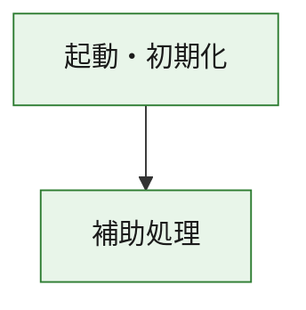
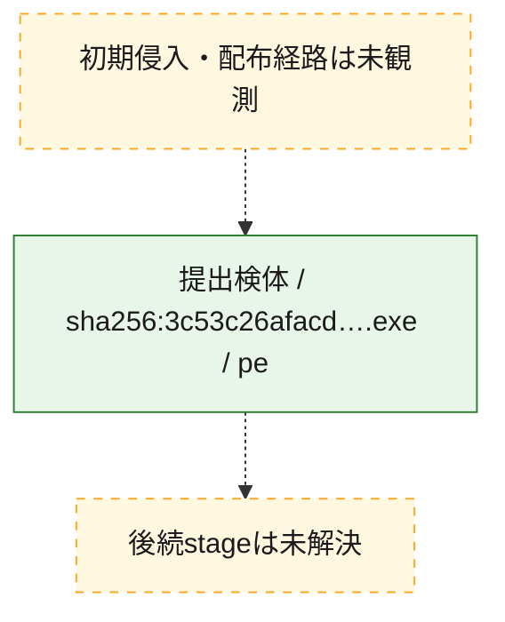
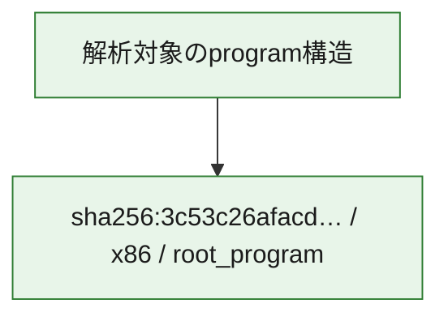

# 全体ロジック：3c53c26afacd7fbc92202979456bb024ecf6ab3c119ecf56507ca8d25657727f

代表関数の静的証跡から、起動・初期化の処理群を確認しました。

## 読み方

- phaseの掲載順は解析上の整理順です。observed_call_edgesがない段階間の実行順を断定しません。
- 図の実線は静的に観測した関係、点線と黄色のノードは未観測・未解決の関係を示します。
- 図は静的な要約であり、動的実行を再現するものではありません。
- 詳細な関数解説とfingerprintは[STATIC-LOGIC.md](STATIC-LOGIC.md)を参照してください。

## 静的可視化

### 実行フロー

### 感染チェーン

### モジュール関係

## 処理段階

### 1. 起動・初期化

entry pointから初期化と後続処理への移行を確認します。
確度: `confirmed_static_function_evidence`

- `3c53c26afacd7fbc92202979456bb024ecf6ab3c119ecf56507ca8d25657727f:ghidra:180001010` — 初期化と主要処理への分岐を行う入口関数です。 状態: `succeeded`、選定理由: `entry_point`, `meaningful_symbol_name`, `reviewed_call_centrality:22`, `role:entrypoint`, `small_program_complete_context`

### 2. 補助処理

主要処理を支える一般内部関数またはlibrary処理を確認します。
確度: `confirmed_static_function_evidence`

- `3c53c26afacd7fbc92202979456bb024ecf6ab3c119ecf56507ca8d25657727f:ghidra:180001240` — 検体内部の一般処理を実装する関数です。 状態: `succeeded`、選定理由: `context_representative`, `reviewed_call_centrality:2`, `small_program_complete_context`
- `3c53c26afacd7fbc92202979456bb024ecf6ab3c119ecf56507ca8d25657727f:ghidra:180001350` — 検体内部の一般処理を実装する関数です。 状態: `succeeded`、選定理由: `context_representative`, `reviewed_call_centrality:25`, `small_program_complete_context`
- `3c53c26afacd7fbc92202979456bb024ecf6ab3c119ecf56507ca8d25657727f:ghidra:180003780` — 検体内部の一般処理を実装する関数です。 状態: `succeeded`、選定理由: `context_representative`, `reviewed_call_centrality:2`, `small_program_complete_context`
- `3c53c26afacd7fbc92202979456bb024ecf6ab3c119ecf56507ca8d25657727f:ghidra:1800038e0` — 検体内部の一般処理を実装する関数です。 状態: `succeeded`、選定理由: `context_representative`, `reviewed_call_centrality:2`, `small_program_complete_context`

## 観測したcall関係

- `3c53c26afacd7fbc92202979456bb024ecf6ab3c119ecf56507ca8d25657727f:ghidra:180001010` → `3c53c26afacd7fbc92202979456bb024ecf6ab3c119ecf56507ca8d25657727f:ghidra:180001240` （`startup` → `support`）
- `3c53c26afacd7fbc92202979456bb024ecf6ab3c119ecf56507ca8d25657727f:ghidra:180001010` → `3c53c26afacd7fbc92202979456bb024ecf6ab3c119ecf56507ca8d25657727f:ghidra:180001350` （`startup` → `support`）
- `3c53c26afacd7fbc92202979456bb024ecf6ab3c119ecf56507ca8d25657727f:ghidra:180001350` → `3c53c26afacd7fbc92202979456bb024ecf6ab3c119ecf56507ca8d25657727f:ghidra:180001240` （`support` → `support`）
- `3c53c26afacd7fbc92202979456bb024ecf6ab3c119ecf56507ca8d25657727f:ghidra:180001350` → `3c53c26afacd7fbc92202979456bb024ecf6ab3c119ecf56507ca8d25657727f:ghidra:180003780` （`support` → `support`）
- `3c53c26afacd7fbc92202979456bb024ecf6ab3c119ecf56507ca8d25657727f:ghidra:180001350` → `3c53c26afacd7fbc92202979456bb024ecf6ab3c119ecf56507ca8d25657727f:ghidra:1800038e0` （`support` → `support`）
- `3c53c26afacd7fbc92202979456bb024ecf6ab3c119ecf56507ca8d25657727f:ghidra:180003780` → `3c53c26afacd7fbc92202979456bb024ecf6ab3c119ecf56507ca8d25657727f:ghidra:1800038e0` （`support` → `support`）
- `ghidra-function:36f6d4aa673b78aaa39177fa` → `ghidra-function:0d5021ff88532f3a30f4bcc6` （`unclassified` → `unclassified`）
- `ghidra-function:36f6d4aa673b78aaa39177fa` → `ghidra-function:128904eff4d84bf9f1a72a6f` （`unclassified` → `unclassified`）
- `ghidra-function:36f6d4aa673b78aaa39177fa` → `ghidra-function:12b86281dc244d49d4f57db2` （`unclassified` → `unclassified`）
- `ghidra-function:36f6d4aa673b78aaa39177fa` → `ghidra-function:33bb910a3a5c03c2baea11e4` （`unclassified` → `unclassified`）
- `ghidra-function:36f6d4aa673b78aaa39177fa` → `ghidra-function:4709bdb36e3c8dc8e71f4547` （`unclassified` → `unclassified`）
- `ghidra-function:36f6d4aa673b78aaa39177fa` → `ghidra-function:5dc7c066e8f641ccebde49bc` （`unclassified` → `unclassified`）
- `ghidra-function:36f6d4aa673b78aaa39177fa` → `ghidra-function:80e53142e5aeaddb1168c0c6` （`unclassified` → `unclassified`）
- `ghidra-function:36f6d4aa673b78aaa39177fa` → `ghidra-function:92a28412800f5f1dc9533114` （`unclassified` → `unclassified`）
- `ghidra-function:36f6d4aa673b78aaa39177fa` → `ghidra-function:b4e2472687a70d1ca328abe2` （`unclassified` → `unclassified`）
- `ghidra-function:36f6d4aa673b78aaa39177fa` → `ghidra-function:dcee79af1d8ce05651509f3e` （`unclassified` → `unclassified`）
- `ghidra-function:36f6d4aa673b78aaa39177fa` → `ghidra-function:e91f08f64d45eafff19e4863` （`unclassified` → `unclassified`）
- `ghidra-function:36f6d4aa673b78aaa39177fa` → `ghidra-function:fc641d7b11e2fa8cf2f9ea86` （`unclassified` → `unclassified`）
- `ghidra-function:5dc7c066e8f641ccebde49bc` → `ghidra-external:06c60593dbab1bbd863c08b9` （`unclassified` → `unclassified`）
- `ghidra-function:5dc7c066e8f641ccebde49bc` → `ghidra-external:06f3424f4ab6e228f8ce7e7f` （`unclassified` → `unclassified`）
- `ghidra-function:5dc7c066e8f641ccebde49bc` → `ghidra-external:10a110e3d13655222fb8fcc3` （`unclassified` → `unclassified`）
- `ghidra-function:5dc7c066e8f641ccebde49bc` → `ghidra-external:2bd2ebfa260519815d6af4ea` （`unclassified` → `unclassified`）
- `ghidra-function:5dc7c066e8f641ccebde49bc` → `ghidra-external:3754aedef24a4890b4dd6315` （`unclassified` → `unclassified`）
- `ghidra-function:5dc7c066e8f641ccebde49bc` → `ghidra-external:47294700f7dc4da948596885` （`unclassified` → `unclassified`）
- `ghidra-function:5dc7c066e8f641ccebde49bc` → `ghidra-external:4f236c02ad1b81cd6a94846e` （`unclassified` → `unclassified`）
- `ghidra-function:5dc7c066e8f641ccebde49bc` → `ghidra-external:55a3cbccc4006386e3ec4fe5` （`unclassified` → `unclassified`）
- `ghidra-function:5dc7c066e8f641ccebde49bc` → `ghidra-external:610e40aca0c0d35da77382da` （`unclassified` → `unclassified`）
- `ghidra-function:5dc7c066e8f641ccebde49bc` → `ghidra-external:6857e522bb5eb87701e2ad5b` （`unclassified` → `unclassified`）
- `ghidra-function:5dc7c066e8f641ccebde49bc` → `ghidra-external:8249742d53e08779a9784439` （`unclassified` → `unclassified`）
- `ghidra-function:5dc7c066e8f641ccebde49bc` → `ghidra-external:9d78aa2dc5ad7ec4557abd1e` （`unclassified` → `unclassified`）
- `ghidra-function:5dc7c066e8f641ccebde49bc` → `ghidra-external:a038700e558cee9b0578c7b9` （`unclassified` → `unclassified`）
- `ghidra-function:5dc7c066e8f641ccebde49bc` → `ghidra-external:a9532aefd3f2eebb8b075e8e` （`unclassified` → `unclassified`）
- `ghidra-function:5dc7c066e8f641ccebde49bc` → `ghidra-external:b251eb494d1f6d27c4cf965c` （`unclassified` → `unclassified`）
- `ghidra-function:5dc7c066e8f641ccebde49bc` → `ghidra-external:bb66b864b6f1440f4c36146a` （`unclassified` → `unclassified`）
- `ghidra-function:5dc7c066e8f641ccebde49bc` → `ghidra-external:c324ae78c421a961205856f9` （`unclassified` → `unclassified`）
- `ghidra-function:5dc7c066e8f641ccebde49bc` → `ghidra-external:c4566b7f7d94325f3775310f` （`unclassified` → `unclassified`）
- `ghidra-function:5dc7c066e8f641ccebde49bc` → `ghidra-external:cca8a73cd79538628db7f070` （`unclassified` → `unclassified`）
- `ghidra-function:5dc7c066e8f641ccebde49bc` → `ghidra-external:d5c053049da9fab0faa47cbe` （`unclassified` → `unclassified`）
- `ghidra-function:5dc7c066e8f641ccebde49bc` → `ghidra-external:e4d6b8504263ba9305b2f0ff` （`unclassified` → `unclassified`）
- `ghidra-function:5dc7c066e8f641ccebde49bc` → `ghidra-function:2bbc8f308db177e31eebaa38` （`unclassified` → `unclassified`）
- `ghidra-function:5dc7c066e8f641ccebde49bc` → `ghidra-function:b4e2472687a70d1ca328abe2` （`unclassified` → `unclassified`）
- `ghidra-function:5dc7c066e8f641ccebde49bc` → `ghidra-function:f821406d9cbb71a0e4423ba5` （`unclassified` → `unclassified`）
- `ghidra-function:f821406d9cbb71a0e4423ba5` → `ghidra-function:2bbc8f308db177e31eebaa38` （`unclassified` → `unclassified`）

## 解析範囲と制約

- 選定外関数は全体inventoryへ残しますが、関数本体の個別解説対象にはしていません。
- indirect call、難読化、packer、VM、壊れたcontrol flowによりcall関係が欠落する場合があります。
- 文書は静的解析に基づき、検体実行や外部通信による動的確認は行っていません。
