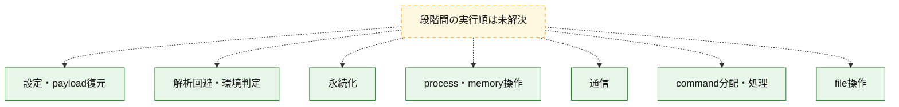
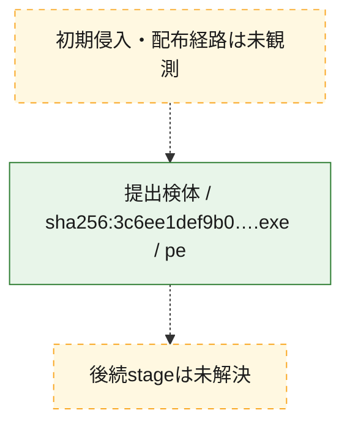
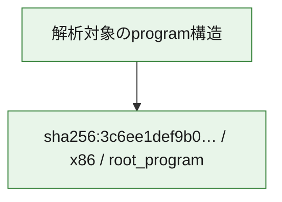

# 全体ロジック：3c6ee1def9b061e4591fd063ab29ea0df40e205a9c7540e23716f32313568f32

代表関数の静的証跡から、設定・payload復元、解析回避・環境判定、永続化、process・memory操作、通信、command分配・処理、file操作の処理群を確認しました。

## 読み方

- phaseの掲載順は解析上の整理順です。observed_call_edgesがない段階間の実行順を断定しません。
- 図の実線は静的に観測した関係、点線と黄色のノードは未観測・未解決の関係を示します。
- 図は静的な要約であり、動的実行を再現するものではありません。
- 詳細な関数解説とfingerprintは[STATIC-LOGIC.md](STATIC-LOGIC.md)を参照してください。

## 静的可視化

### 実行フロー

### 感染チェーン

### モジュール関係

## 処理段階

### 1. 設定・payload復元

設定、resource、payload、暗号化データの復元・変換を確認します。
確度: `confirmed_static_function_evidence`

- `3c6ee1def9b061e4591fd063ab29ea0df40e205a9c7540e23716f32313568f32:ghidra:14000efc8` — 設定、resource、payloadなどの解析・変換を行う関数です。 状態: `succeeded`、選定理由: `call_graph_centrality:in=2,out=45`, `large_function:instructions=461`, `reviewed_call_centrality:49`, `reviewed_call_centrality:80`, `role:config_or_data_transform`, `role:process_or_memory_operation`
- `3c6ee1def9b061e4591fd063ab29ea0df40e205a9c7540e23716f32313568f32:ghidra:14001491c` — 暗号、hash、encoding、または復号処理に関係する関数です。 状態: `succeeded`、選定理由: `call_graph_centrality:in=4,out=4`, `reviewed_call_centrality:12`, `reviewed_call_centrality:8`, `role:cryptographic_transform`
- `3c6ee1def9b061e4591fd063ab29ea0df40e205a9c7540e23716f32313568f32:ghidra:140014960` — 暗号、hash、encoding、または復号処理に関係する関数です。 状態: `succeeded`、選定理由: `call_graph_centrality:in=3,out=31`, `large_function:instructions=420`, `reviewed_call_centrality:36`, `reviewed_call_centrality:61`, `role:cryptographic_transform`
- `3c6ee1def9b061e4591fd063ab29ea0df40e205a9c7540e23716f32313568f32:ghidra:140015058` — 暗号、hash、encoding、または復号処理に関係する関数です。 状態: `succeeded`、選定理由: `call_graph_centrality:in=1,out=15`, `large_function:instructions=168`, `reviewed_call_centrality:18`, `reviewed_call_centrality:30`, `role:cryptographic_transform`
- `3c6ee1def9b061e4591fd063ab29ea0df40e205a9c7540e23716f32313568f32:ghidra:14001531c` — 暗号、hash、encoding、または復号処理に関係する関数です。 状態: `succeeded`、選定理由: `call_graph_centrality:in=3,out=30`, `large_function:instructions=577`, `reviewed_call_centrality:35`, `reviewed_call_centrality:62`, `role:cryptographic_transform`

### 2. 解析回避・環境判定

debugger、sandbox、仮想環境、時間差などの判定を確認します。
確度: `confirmed_static_function_evidence`

- `3c6ee1def9b061e4591fd063ab29ea0df40e205a9c7540e23716f32313568f32:ghidra:140022b24` — debugger、仮想環境、sandbox、または時間差の確認に関係する関数です。 状態: `succeeded`、選定理由: `call_graph_centrality:in=2,out=2`, `reviewed_call_centrality:4`, `role:anti_analysis`

### 3. 永続化

自動起動や永続化に関係する設定変更を確認します。
確度: `confirmed_static_function_evidence`

- `3c6ee1def9b061e4591fd063ab29ea0df40e205a9c7540e23716f32313568f32:ghidra:140013f24` — 自動起動または永続化に関係する処理を含む関数です。 状態: `succeeded`、選定理由: `call_graph_centrality:in=1,out=7`, `reviewed_call_centrality:14`, `reviewed_call_centrality:8`, `role:persistence`
- `3c6ee1def9b061e4591fd063ab29ea0df40e205a9c7540e23716f32313568f32:ghidra:1400148ac` — 自動起動または永続化に関係する処理を含む関数です。 状態: `succeeded`、選定理由: `call_graph_centrality:in=2,out=3`, `reviewed_call_centrality:5`, `reviewed_call_centrality:8`, `role:persistence`

### 4. process・memory操作

process、thread、module、memory操作と実行移行を確認します。
確度: `confirmed_static_function_evidence_with_limits`

- `3c6ee1def9b061e4591fd063ab29ea0df40e205a9c7540e23716f32313568f32:ghidra:1400021b8` — process、thread、module、またはmemory操作に関係する関数です。 状態: `succeeded`、選定理由: `call_graph_centrality:in=0,out=19`, `large_function:instructions=216`, `reviewed_call_centrality:19`, `reviewed_call_centrality:27`, `role:process_or_memory_operation`
- `3c6ee1def9b061e4591fd063ab29ea0df40e205a9c7540e23716f32313568f32:ghidra:14000a768` — process、thread、module、またはmemory操作に関係する関数です。 状態: `succeeded`、選定理由: `call_graph_centrality:in=2,out=10`, `large_function:instructions=99`, `reviewed_call_centrality:12`, `reviewed_call_centrality:20`, `role:process_or_memory_operation`
- `3c6ee1def9b061e4591fd063ab29ea0df40e205a9c7540e23716f32313568f32:ghidra:14000fb7c` — process、thread、module、またはmemory操作に関係する関数です。 状態: `succeeded`、選定理由: `call_graph_centrality:in=0,out=8`, `large_function:instructions=77`, `reviewed_call_centrality:14`, `reviewed_call_centrality:9`, `role:process_or_memory_operation`
- `3c6ee1def9b061e4591fd063ab29ea0df40e205a9c7540e23716f32313568f32:ghidra:14000fd50` — process、thread、module、またはmemory操作に関係する関数です。 状態: `limited_bad_instruction_or_flow`、選定理由: `call_graph_centrality:in=0,out=5`, `large_function:instructions=71`, `reviewed_call_centrality:10`, `reviewed_call_centrality:7`, `role:process_or_memory_operation`
- `3c6ee1def9b061e4591fd063ab29ea0df40e205a9c7540e23716f32313568f32:ghidra:14000ffb8` — process、thread、module、またはmemory操作に関係する関数です。 状態: `succeeded`、選定理由: `call_graph_centrality:in=1,out=12`, `large_function:instructions=182`, `reviewed_call_centrality:14`, `reviewed_call_centrality:23`, `role:process_or_memory_operation`
- `3c6ee1def9b061e4591fd063ab29ea0df40e205a9c7540e23716f32313568f32:ghidra:140010ad0` — process、thread、module、またはmemory操作に関係する関数です。 状態: `succeeded`、選定理由: `call_graph_centrality:in=2,out=12`, `large_function:instructions=183`, `reviewed_call_centrality:15`, `reviewed_call_centrality:24`, `role:process_or_memory_operation`
- `3c6ee1def9b061e4591fd063ab29ea0df40e205a9c7540e23716f32313568f32:ghidra:140011a54` — process、thread、module、またはmemory操作に関係する関数です。 状態: `succeeded`、選定理由: `call_graph_centrality:in=2,out=6`, `large_function:instructions=69`, `reviewed_call_centrality:13`, `reviewed_call_centrality:8`, `role:process_or_memory_operation`
- `3c6ee1def9b061e4591fd063ab29ea0df40e205a9c7540e23716f32313568f32:ghidra:140011df4` — process、thread、module、またはmemory操作に関係する関数です。 状態: `succeeded`、選定理由: `call_graph_centrality:in=1,out=6`, `large_function:instructions=91`, `reviewed_call_centrality:12`, `reviewed_call_centrality:8`, `role:file_operation`, `role:process_or_memory_operation`
- `3c6ee1def9b061e4591fd063ab29ea0df40e205a9c7540e23716f32313568f32:ghidra:140011fc8` — process、thread、module、またはmemory操作に関係する関数です。 状態: `succeeded`、選定理由: `call_graph_centrality:in=1,out=30`, `large_function:instructions=494`, `reviewed_call_centrality:35`, `reviewed_call_centrality:54`, `role:process_or_memory_operation`
- `3c6ee1def9b061e4591fd063ab29ea0df40e205a9c7540e23716f32313568f32:ghidra:140012818` — process、thread、module、またはmemory操作に関係する関数です。 状態: `succeeded`、選定理由: `call_graph_centrality:in=1,out=6`, `reviewed_call_centrality:10`, `reviewed_call_centrality:7`, `role:file_operation`, `role:process_or_memory_operation`
- `3c6ee1def9b061e4591fd063ab29ea0df40e205a9c7540e23716f32313568f32:ghidra:140012d20` — process、thread、module、またはmemory操作に関係する関数です。 状態: `succeeded`、選定理由: `call_graph_centrality:in=2,out=3`, `reviewed_call_centrality:5`, `reviewed_call_centrality:8`, `role:process_or_memory_operation`
- `3c6ee1def9b061e4591fd063ab29ea0df40e205a9c7540e23716f32313568f32:ghidra:140013030` — process、thread、module、またはmemory操作に関係する関数です。 状態: `succeeded`、選定理由: `call_graph_centrality:in=1,out=17`, `large_function:instructions=426`, `reviewed_call_centrality:19`, `reviewed_call_centrality:34`, `role:file_operation`, `role:process_or_memory_operation`
- `3c6ee1def9b061e4591fd063ab29ea0df40e205a9c7540e23716f32313568f32:ghidra:1400146cc` — process、thread、module、またはmemory操作に関係する関数です。 状態: `succeeded`、選定理由: `call_graph_centrality:in=1,out=13`, `large_function:instructions=130`, `reviewed_call_centrality:15`, `reviewed_call_centrality:27`, `role:process_or_memory_operation`

### 5. 通信

通信初期化、endpoint処理、送受信の役割を確認します。
確度: `confirmed_static_function_evidence_with_limits`

- `3c6ee1def9b061e4591fd063ab29ea0df40e205a9c7540e23716f32313568f32:ghidra:140005bdc` — 通信初期化、送受信、またはendpoint処理に関係する関数です。 状態: `failed`、選定理由: `call_graph_centrality:in=1,out=91`, `large_function:instructions=1503`, `reviewed_call_centrality:107`, `reviewed_call_centrality:146`, `role:anti_analysis`, `role:network_communication`
- `3c6ee1def9b061e4591fd063ab29ea0df40e205a9c7540e23716f32313568f32:ghidra:1400076c8` — 通信初期化、送受信、またはendpoint処理に関係する関数です。 状態: `failed`、選定理由: `call_graph_centrality:in=0,out=51`, `large_function:instructions=560`, `reviewed_call_centrality:58`, `reviewed_call_centrality:81`, `role:network_communication`
- `3c6ee1def9b061e4591fd063ab29ea0df40e205a9c7540e23716f32313568f32:ghidra:140008250` — 通信初期化、送受信、またはendpoint処理に関係する関数です。 状態: `succeeded`、選定理由: `call_graph_centrality:in=5,out=66`, `large_function:instructions=1355`, `reviewed_call_centrality:120`, `reviewed_call_centrality:79`, `role:network_communication`
- `3c6ee1def9b061e4591fd063ab29ea0df40e205a9c7540e23716f32313568f32:ghidra:14000af84` — 通信初期化、送受信、またはendpoint処理に関係する関数です。 状態: `failed`、選定理由: `call_graph_centrality:in=4,out=104`, `large_function:instructions=2507`, `reviewed_call_centrality:130`, `reviewed_call_centrality:179`, `role:network_communication`, `role:process_or_memory_operation`
- `3c6ee1def9b061e4591fd063ab29ea0df40e205a9c7540e23716f32313568f32:ghidra:14000e5fc` — 通信初期化、送受信、またはendpoint処理に関係する関数です。 状態: `failed`、選定理由: `call_graph_centrality:in=0,out=51`, `large_function:instructions=598`, `reviewed_call_centrality:58`, `reviewed_call_centrality:79`, `role:network_communication`
- `3c6ee1def9b061e4591fd063ab29ea0df40e205a9c7540e23716f32313568f32:ghidra:14001053c` — 通信初期化、送受信、またはendpoint処理に関係する関数です。 状態: `succeeded`、選定理由: `call_graph_centrality:in=0,out=8`, `reviewed_call_centrality:16`, `reviewed_call_centrality:8`, `role:network_communication`, `role:process_or_memory_operation`
- `3c6ee1def9b061e4591fd063ab29ea0df40e205a9c7540e23716f32313568f32:ghidra:140010f00` — 通信初期化、送受信、またはendpoint処理に関係する関数です。 状態: `succeeded`、選定理由: `call_graph_centrality:in=2,out=29`, `large_function:instructions=675`, `reviewed_call_centrality:38`, `reviewed_call_centrality:55`, `role:network_communication`
- `3c6ee1def9b061e4591fd063ab29ea0df40e205a9c7540e23716f32313568f32:ghidra:140014058` — 通信初期化、送受信、またはendpoint処理に関係する関数です。 状態: `succeeded`、選定理由: `call_graph_centrality:in=1,out=9`, `large_function:instructions=340`, `reviewed_call_centrality:11`, `reviewed_call_centrality:18`, `role:network_communication`

### 6. command分配・処理

受信commandやtaskの解釈、分配、個別handlerへの移行を確認します。
確度: `confirmed_static_function_evidence`

- `3c6ee1def9b061e4591fd063ab29ea0df40e205a9c7540e23716f32313568f32:ghidra:14000fe5c` — commandの解釈、分配、または個別処理を担当する関数です。 状態: `succeeded`、選定理由: `call_graph_centrality:in=0,out=11`, `large_function:instructions=76`, `reviewed_call_centrality:11`, `reviewed_call_centrality:22`, `role:command_dispatch_or_handler`

### 7. file操作

fileやdirectoryの作成、読書き、削除を確認します。
確度: `confirmed_static_function_evidence`

- `3c6ee1def9b061e4591fd063ab29ea0df40e205a9c7540e23716f32313568f32:ghidra:140004144` — fileまたはdirectoryの読書き・管理に関係する関数です。 状態: `succeeded`、選定理由: `call_graph_centrality:in=6,out=6`, `large_function:instructions=98`, `reviewed_call_centrality:12`, `reviewed_call_centrality:17`, `role:file_operation`
- `3c6ee1def9b061e4591fd063ab29ea0df40e205a9c7540e23716f32313568f32:ghidra:1400104d0` — fileまたはdirectoryの読書き・管理に関係する関数です。 状態: `succeeded`、選定理由: `call_graph_centrality:in=0,out=2`, `reviewed_call_centrality:2`, `reviewed_call_centrality:4`, `role:file_operation`

## 観測したcall関係

- 代表関数間で直接解決できた呼出関係はありません。

## 解析範囲と制約

- 選定外関数は全体inventoryへ残しますが、関数本体の個別解説対象にはしていません。
- indirect call、難読化、packer、VM、壊れたcontrol flowによりcall関係が欠落する場合があります。
- 文書は静的解析に基づき、検体実行や外部通信による動的確認は行っていません。
