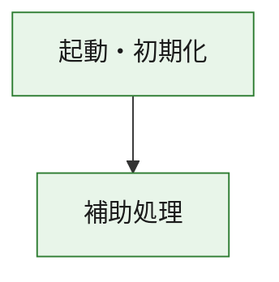
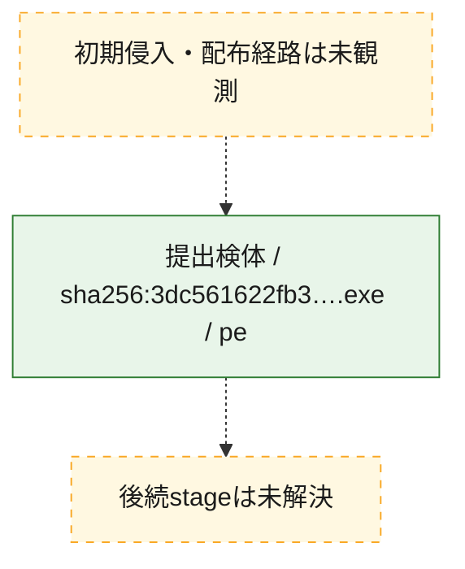
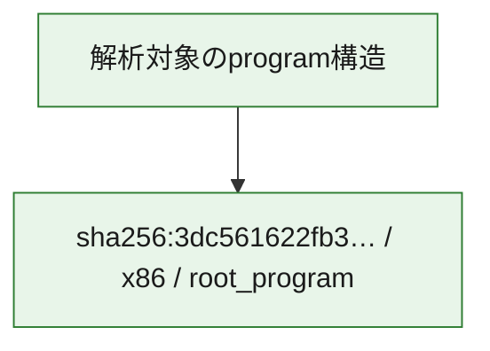

# 全体ロジック：3dc561622fb319c9e1770ed313741f8616a1a996fe274adc999ef558c0b15bb1

代表関数の静的証跡から、起動・初期化の処理群を確認しました。

## 読み方

- phaseの掲載順は解析上の整理順です。observed_call_edgesがない段階間の実行順を断定しません。
- 図の実線は静的に観測した関係、点線と黄色のノードは未観測・未解決の関係を示します。
- 図は静的な要約であり、動的実行を再現するものではありません。
- 詳細な関数解説とfingerprintは[STATIC-LOGIC.md](STATIC-LOGIC.md)を参照してください。

## 静的可視化

### 実行フロー

### 感染チェーン

### モジュール関係

## 処理段階

### 1. 起動・初期化

entry pointから初期化と後続処理への移行を確認します。
確度: `confirmed_static_function_evidence`

- `3dc561622fb319c9e1770ed313741f8616a1a996fe274adc999ef558c0b15bb1:ghidra:180001010` — 初期化と主要処理への分岐を行う入口関数です。 状態: `succeeded`、選定理由: `entry_point`, `meaningful_symbol_name`, `reviewed_call_centrality:22`, `role:entrypoint`, `small_program_complete_context`

### 2. 補助処理

主要処理を支える一般内部関数またはlibrary処理を確認します。
確度: `confirmed_static_function_evidence`

- `3dc561622fb319c9e1770ed313741f8616a1a996fe274adc999ef558c0b15bb1:ghidra:180001240` — 検体内部の一般処理を実装する関数です。 状態: `succeeded`、選定理由: `context_representative`, `reviewed_call_centrality:2`, `small_program_complete_context`
- `3dc561622fb319c9e1770ed313741f8616a1a996fe274adc999ef558c0b15bb1:ghidra:180001350` — 検体内部の一般処理を実装する関数です。 状態: `succeeded`、選定理由: `context_representative`, `reviewed_call_centrality:25`, `small_program_complete_context`
- `3dc561622fb319c9e1770ed313741f8616a1a996fe274adc999ef558c0b15bb1:ghidra:180003780` — 検体内部の一般処理を実装する関数です。 状態: `succeeded`、選定理由: `context_representative`, `reviewed_call_centrality:2`, `small_program_complete_context`
- `3dc561622fb319c9e1770ed313741f8616a1a996fe274adc999ef558c0b15bb1:ghidra:1800038e0` — 検体内部の一般処理を実装する関数です。 状態: `succeeded`、選定理由: `context_representative`, `reviewed_call_centrality:2`, `small_program_complete_context`

## 観測したcall関係

- `3dc561622fb319c9e1770ed313741f8616a1a996fe274adc999ef558c0b15bb1:ghidra:180001010` → `3dc561622fb319c9e1770ed313741f8616a1a996fe274adc999ef558c0b15bb1:ghidra:180001240` （`startup` → `support`）
- `3dc561622fb319c9e1770ed313741f8616a1a996fe274adc999ef558c0b15bb1:ghidra:180001010` → `3dc561622fb319c9e1770ed313741f8616a1a996fe274adc999ef558c0b15bb1:ghidra:180001350` （`startup` → `support`）
- `3dc561622fb319c9e1770ed313741f8616a1a996fe274adc999ef558c0b15bb1:ghidra:180001350` → `3dc561622fb319c9e1770ed313741f8616a1a996fe274adc999ef558c0b15bb1:ghidra:180001240` （`support` → `support`）
- `3dc561622fb319c9e1770ed313741f8616a1a996fe274adc999ef558c0b15bb1:ghidra:180001350` → `3dc561622fb319c9e1770ed313741f8616a1a996fe274adc999ef558c0b15bb1:ghidra:180003780` （`support` → `support`）
- `3dc561622fb319c9e1770ed313741f8616a1a996fe274adc999ef558c0b15bb1:ghidra:180001350` → `3dc561622fb319c9e1770ed313741f8616a1a996fe274adc999ef558c0b15bb1:ghidra:1800038e0` （`support` → `support`）
- `3dc561622fb319c9e1770ed313741f8616a1a996fe274adc999ef558c0b15bb1:ghidra:180003780` → `3dc561622fb319c9e1770ed313741f8616a1a996fe274adc999ef558c0b15bb1:ghidra:1800038e0` （`support` → `support`）
- `ghidra-function:b33201722f4248fba3e8de0b` → `ghidra-function:fed65b5495ff8dca70db41a2` （`unclassified` → `unclassified`）
- `ghidra-function:c1fe6a19b3f7b0e9524e725f` → `ghidra-external:1f79591d6a9418ac4c83f334` （`unclassified` → `unclassified`）
- `ghidra-function:c1fe6a19b3f7b0e9524e725f` → `ghidra-external:28385a1c6bac09c0bdff75fa` （`unclassified` → `unclassified`）
- `ghidra-function:c1fe6a19b3f7b0e9524e725f` → `ghidra-external:3eca099c7ec4158b8adbbdd1` （`unclassified` → `unclassified`）
- `ghidra-function:c1fe6a19b3f7b0e9524e725f` → `ghidra-external:422c1da9cb4f06f026ddcc0a` （`unclassified` → `unclassified`）
- `ghidra-function:c1fe6a19b3f7b0e9524e725f` → `ghidra-external:48d735c91b63ea07e00bdf89` （`unclassified` → `unclassified`）
- `ghidra-function:c1fe6a19b3f7b0e9524e725f` → `ghidra-external:5918521a2bd9bf344d87af6c` （`unclassified` → `unclassified`）
- `ghidra-function:c1fe6a19b3f7b0e9524e725f` → `ghidra-external:5b00b635142c25736425b32b` （`unclassified` → `unclassified`）
- `ghidra-function:c1fe6a19b3f7b0e9524e725f` → `ghidra-external:607dc11184ab937c88f2fc96` （`unclassified` → `unclassified`）
- `ghidra-function:c1fe6a19b3f7b0e9524e725f` → `ghidra-external:61319984134dd44c2ed4d6cc` （`unclassified` → `unclassified`）
- `ghidra-function:c1fe6a19b3f7b0e9524e725f` → `ghidra-external:6d253c8fa5e8561a94e0cd98` （`unclassified` → `unclassified`）
- `ghidra-function:c1fe6a19b3f7b0e9524e725f` → `ghidra-external:71faec411aea2cd30a96ee51` （`unclassified` → `unclassified`）
- `ghidra-function:c1fe6a19b3f7b0e9524e725f` → `ghidra-external:725d3c95418c78ece091b5c5` （`unclassified` → `unclassified`）
- `ghidra-function:c1fe6a19b3f7b0e9524e725f` → `ghidra-external:7850006ca5dc6a196e25b2f1` （`unclassified` → `unclassified`）
- `ghidra-function:c1fe6a19b3f7b0e9524e725f` → `ghidra-external:84a3848077860fbd0deae97f` （`unclassified` → `unclassified`）
- `ghidra-function:c1fe6a19b3f7b0e9524e725f` → `ghidra-external:9745963456d9ad52afa979f5` （`unclassified` → `unclassified`）
- `ghidra-function:c1fe6a19b3f7b0e9524e725f` → `ghidra-external:99cc0ca529a6755a77fdcf1a` （`unclassified` → `unclassified`）
- `ghidra-function:c1fe6a19b3f7b0e9524e725f` → `ghidra-external:b4711f54882320a233f44045` （`unclassified` → `unclassified`）
- `ghidra-function:c1fe6a19b3f7b0e9524e725f` → `ghidra-external:b6203e444a4f5ae01679546f` （`unclassified` → `unclassified`）
- `ghidra-function:c1fe6a19b3f7b0e9524e725f` → `ghidra-external:c2d472462fda5f05fbcc6d6f` （`unclassified` → `unclassified`）
- `ghidra-function:c1fe6a19b3f7b0e9524e725f` → `ghidra-external:d0a049e286018d711b402457` （`unclassified` → `unclassified`）
- `ghidra-function:c1fe6a19b3f7b0e9524e725f` → `ghidra-external:f9186af5a61b7d8bb1275e86` （`unclassified` → `unclassified`）
- `ghidra-function:c1fe6a19b3f7b0e9524e725f` → `ghidra-function:317a236795248bb4063a818a` （`unclassified` → `unclassified`）
- `ghidra-function:c1fe6a19b3f7b0e9524e725f` → `ghidra-function:b33201722f4248fba3e8de0b` （`unclassified` → `unclassified`）
- `ghidra-function:c1fe6a19b3f7b0e9524e725f` → `ghidra-function:fed65b5495ff8dca70db41a2` （`unclassified` → `unclassified`）
- `ghidra-function:e3ab71c7adf2c76905e7f84b` → `ghidra-function:2bd395c4b07a7e881fa0a68b` （`unclassified` → `unclassified`）
- `ghidra-function:e3ab71c7adf2c76905e7f84b` → `ghidra-function:317a236795248bb4063a818a` （`unclassified` → `unclassified`）
- `ghidra-function:e3ab71c7adf2c76905e7f84b` → `ghidra-function:39b43234b59bebe94879ce4b` （`unclassified` → `unclassified`）
- `ghidra-function:e3ab71c7adf2c76905e7f84b` → `ghidra-function:4244feae42234678ed8d114d` （`unclassified` → `unclassified`）
- `ghidra-function:e3ab71c7adf2c76905e7f84b` → `ghidra-function:6f955cf12614d0478426ffbb` （`unclassified` → `unclassified`）
- `ghidra-function:e3ab71c7adf2c76905e7f84b` → `ghidra-function:79661b83ef43255df581d815` （`unclassified` → `unclassified`）
- `ghidra-function:e3ab71c7adf2c76905e7f84b` → `ghidra-function:81b7baf602c930af5939e4d3` （`unclassified` → `unclassified`）
- `ghidra-function:e3ab71c7adf2c76905e7f84b` → `ghidra-function:8cfeb50b569b5fbcca60f88c` （`unclassified` → `unclassified`）
- `ghidra-function:e3ab71c7adf2c76905e7f84b` → `ghidra-function:c1fe6a19b3f7b0e9524e725f` （`unclassified` → `unclassified`）
- `ghidra-function:e3ab71c7adf2c76905e7f84b` → `ghidra-function:dd4454b06d9e56eeff540a54` （`unclassified` → `unclassified`）
- `ghidra-function:e3ab71c7adf2c76905e7f84b` → `ghidra-function:e657693e0159f8469844d536` （`unclassified` → `unclassified`）
- `ghidra-function:e3ab71c7adf2c76905e7f84b` → `ghidra-function:f2295ad6e28b3c947039281a` （`unclassified` → `unclassified`）

## 解析範囲と制約

- 選定外関数は全体inventoryへ残しますが、関数本体の個別解説対象にはしていません。
- indirect call、難読化、packer、VM、壊れたcontrol flowによりcall関係が欠落する場合があります。
- 文書は静的解析に基づき、検体実行や外部通信による動的確認は行っていません。
