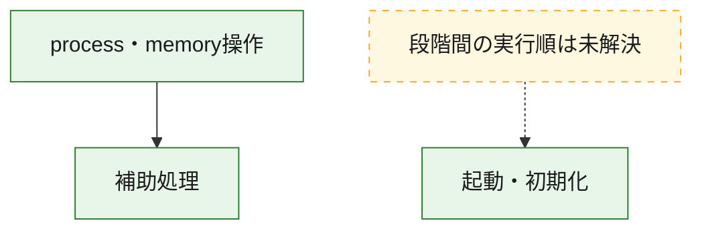
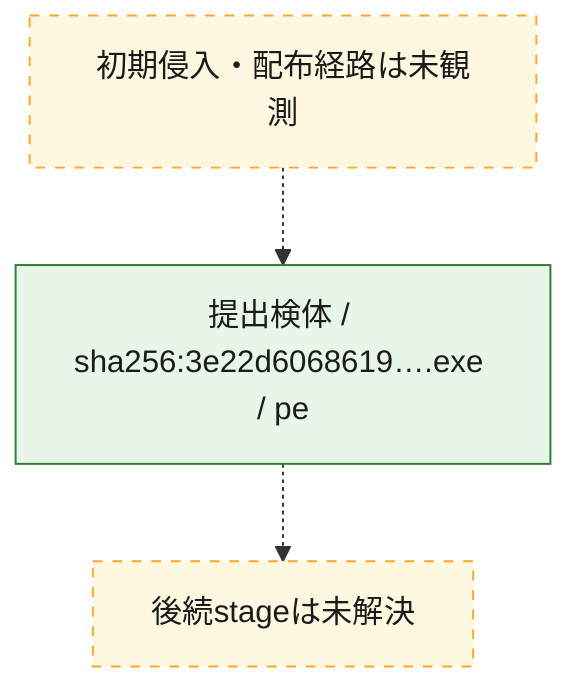
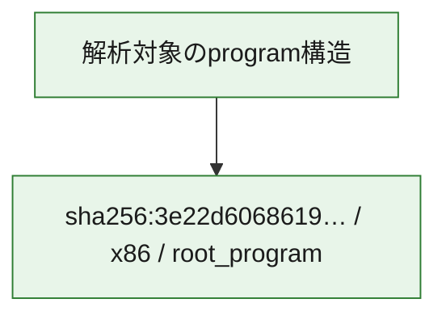

# 全体ロジック：3e22d606861955ef829cc9f5a2ee4e3b1c20e16cabe77973f26542e02bd7415d

代表関数の静的証跡から、起動・初期化、process・memory操作の処理群を確認しました。

## 読み方

- phaseの掲載順は解析上の整理順です。observed_call_edgesがない段階間の実行順を断定しません。
- 図の実線は静的に観測した関係、点線と黄色のノードは未観測・未解決の関係を示します。
- 図は静的な要約であり、動的実行を再現するものではありません。
- 詳細な関数解説とfingerprintは[STATIC-LOGIC.md](STATIC-LOGIC.md)を参照してください。

## 静的可視化

### 実行フロー

### 感染チェーン

### モジュール関係

## 処理段階

### 1. 起動・初期化

entry pointから初期化と後続処理への移行を確認します。
確度: `confirmed_static_function_evidence`

- `3e22d606861955ef829cc9f5a2ee4e3b1c20e16cabe77973f26542e02bd7415d:ghidra:14000c9a0` — 初期化と主要処理への分岐を行う入口関数です。 状態: `succeeded`、選定理由: `entry_point`, `meaningful_symbol_name`, `reviewed_call_centrality:22`, `role:entrypoint`

### 2. process・memory操作

process、thread、module、memory操作と実行移行を確認します。
確度: `confirmed_static_function_evidence`

- `3e22d606861955ef829cc9f5a2ee4e3b1c20e16cabe77973f26542e02bd7415d:ghidra:140001000` — process、thread、module、またはmemory操作に関係する関数です。 状態: `succeeded`、選定理由: `context_representative`, `reviewed_call_centrality:23`, `role:process_or_memory_operation`

### 3. 補助処理

主要処理を支える一般内部関数またはlibrary処理を確認します。
確度: `confirmed_static_function_evidence_with_limits`

- `3e22d606861955ef829cc9f5a2ee4e3b1c20e16cabe77973f26542e02bd7415d:ghidra:140002029` — 検体内部の一般処理を実装する関数です。 状態: `succeeded`、選定理由: `context_representative`, `reviewed_call_centrality:11`
- `3e22d606861955ef829cc9f5a2ee4e3b1c20e16cabe77973f26542e02bd7415d:ghidra:140002264` — 検体内部の一般処理を実装する関数です。 状態: `limited_bad_instruction_or_flow`、選定理由: `context_representative`
- `3e22d606861955ef829cc9f5a2ee4e3b1c20e16cabe77973f26542e02bd7415d:ghidra:140002706` — 検体内部の一般処理を実装する関数です。 状態: `succeeded`、選定理由: `context_representative`, `reviewed_call_centrality:1`
- `3e22d606861955ef829cc9f5a2ee4e3b1c20e16cabe77973f26542e02bd7415d:ghidra:140002989` — 検体内部の一般処理を実装する関数です。 状態: `succeeded`、選定理由: `context_representative`, `reviewed_call_centrality:6`
- `3e22d606861955ef829cc9f5a2ee4e3b1c20e16cabe77973f26542e02bd7415d:ghidra:1400029ca` — 検体内部の一般処理を実装する関数です。 状態: `limited_bad_instruction_or_flow`、選定理由: `context_representative`, `reviewed_call_centrality:4`
- `3e22d606861955ef829cc9f5a2ee4e3b1c20e16cabe77973f26542e02bd7415d:ghidra:140002a2f` — 検体内部の一般処理を実装する関数です。 状態: `succeeded`、選定理由: `context_representative`, `reviewed_call_centrality:4`
- `3e22d606861955ef829cc9f5a2ee4e3b1c20e16cabe77973f26542e02bd7415d:ghidra:140002a94` — 検体内部の一般処理を実装する関数です。 状態: `succeeded`、選定理由: `context_representative`, `reviewed_call_centrality:25`
- `3e22d606861955ef829cc9f5a2ee4e3b1c20e16cabe77973f26542e02bd7415d:ghidra:140003050` — 検体内部の一般処理を実装する関数です。 状態: `limited_bad_instruction_or_flow`、選定理由: `context_representative`, `reviewed_call_centrality:6`
- `3e22d606861955ef829cc9f5a2ee4e3b1c20e16cabe77973f26542e02bd7415d:ghidra:1400030b7` — 検体内部の一般処理を実装する関数です。 状態: `succeeded`、選定理由: `context_representative`, `reviewed_call_centrality:7`
- `3e22d606861955ef829cc9f5a2ee4e3b1c20e16cabe77973f26542e02bd7415d:ghidra:140003146` — 検体内部の一般処理を実装する関数です。 状態: `succeeded`、選定理由: `context_representative`, `reviewed_call_centrality:5`
- `3e22d606861955ef829cc9f5a2ee4e3b1c20e16cabe77973f26542e02bd7415d:ghidra:1400031af` — 検体内部の一般処理を実装する関数です。 状態: `succeeded`、選定理由: `context_representative`, `reviewed_call_centrality:2`
- `3e22d606861955ef829cc9f5a2ee4e3b1c20e16cabe77973f26542e02bd7415d:ghidra:1400031e7` — 検体内部の一般処理を実装する関数です。 状態: `succeeded`、選定理由: `context_representative`, `reviewed_call_centrality:2`
- `3e22d606861955ef829cc9f5a2ee4e3b1c20e16cabe77973f26542e02bd7415d:ghidra:1400032f1` — 検体内部の一般処理を実装する関数です。 状態: `succeeded`、選定理由: `context_representative`, `reviewed_call_centrality:27`
- `3e22d606861955ef829cc9f5a2ee4e3b1c20e16cabe77973f26542e02bd7415d:ghidra:1400038ca` — 検体内部の一般処理を実装する関数です。 状態: `succeeded`、選定理由: `context_representative`, `reviewed_call_centrality:26`
- `3e22d606861955ef829cc9f5a2ee4e3b1c20e16cabe77973f26542e02bd7415d:ghidra:140003f30` — 検体内部の一般処理を実装する関数です。 状態: `succeeded`、選定理由: `context_representative`, `reviewed_call_centrality:10`
- `3e22d606861955ef829cc9f5a2ee4e3b1c20e16cabe77973f26542e02bd7415d:ghidra:140003fd3` — 検体内部の一般処理を実装する関数です。 状態: `succeeded`、選定理由: `context_representative`, `reviewed_call_centrality:9`
- `3e22d606861955ef829cc9f5a2ee4e3b1c20e16cabe77973f26542e02bd7415d:ghidra:140004111` — 検体内部の一般処理を実装する関数です。 状態: `succeeded`、選定理由: `context_representative`, `reviewed_call_centrality:2`
- `3e22d606861955ef829cc9f5a2ee4e3b1c20e16cabe77973f26542e02bd7415d:ghidra:14000421b` — 検体内部の一般処理を実装する関数です。 状態: `succeeded`、選定理由: `context_representative`, `reviewed_call_centrality:4`
- `3e22d606861955ef829cc9f5a2ee4e3b1c20e16cabe77973f26542e02bd7415d:ghidra:140004264` — 検体内部の一般処理を実装する関数です。 状態: `succeeded`、選定理由: `context_representative`, `reviewed_call_centrality:1`
- `3e22d606861955ef829cc9f5a2ee4e3b1c20e16cabe77973f26542e02bd7415d:ghidra:14000437f` — 検体内部の一般処理を実装する関数です。 状態: `succeeded`、選定理由: `context_representative`, `reviewed_call_centrality:3`
- `3e22d606861955ef829cc9f5a2ee4e3b1c20e16cabe77973f26542e02bd7415d:ghidra:1400043b7` — 検体内部の一般処理を実装する関数です。 状態: `succeeded`、選定理由: `context_representative`, `reviewed_call_centrality:11`
- `3e22d606861955ef829cc9f5a2ee4e3b1c20e16cabe77973f26542e02bd7415d:ghidra:14000447a` — compiler生成処理または汎用library処理とみられる関数です。 状態: `limited_bad_instruction_or_flow`、選定理由: `entry_point`, `meaningful_symbol_name`, `reviewed_call_centrality:7`
- `3e22d606861955ef829cc9f5a2ee4e3b1c20e16cabe77973f26542e02bd7415d:ghidra:14000458a` — 検体内部の一般処理を実装する関数です。 状態: `succeeded`、選定理由: `context_representative`, `reviewed_call_centrality:29`
- `3e22d606861955ef829cc9f5a2ee4e3b1c20e16cabe77973f26542e02bd7415d:ghidra:140005036` — 検体内部の一般処理を実装する関数です。 状態: `succeeded`、選定理由: `context_representative`, `reviewed_call_centrality:15`
- `3e22d606861955ef829cc9f5a2ee4e3b1c20e16cabe77973f26542e02bd7415d:ghidra:1400051fc` — 検体内部の一般処理を実装する関数です。 状態: `failed`、選定理由: `context_representative`, `reviewed_call_centrality:1`
- `3e22d606861955ef829cc9f5a2ee4e3b1c20e16cabe77973f26542e02bd7415d:ghidra:140008725` — 検体内部の一般処理を実装する関数です。 状態: `limited_bad_instruction_or_flow`、選定理由: `context_representative`, `reviewed_call_centrality:4`
- `3e22d606861955ef829cc9f5a2ee4e3b1c20e16cabe77973f26542e02bd7415d:ghidra:14000878b` — 検体内部の一般処理を実装する関数です。 状態: `limited_bad_instruction_or_flow`、選定理由: `context_representative`, `reviewed_call_centrality:4`
- `3e22d606861955ef829cc9f5a2ee4e3b1c20e16cabe77973f26542e02bd7415d:ghidra:1400087ba` — 検体内部の一般処理を実装する関数です。 状態: `limited_bad_instruction_or_flow`、選定理由: `context_representative`, `reviewed_call_centrality:20`
- `3e22d606861955ef829cc9f5a2ee4e3b1c20e16cabe77973f26542e02bd7415d:ghidra:1400094c1` — 検体内部の一般処理を実装する関数です。 状態: `limited_bad_instruction_or_flow`、選定理由: `context_representative`, `reviewed_call_centrality:11`
- `3e22d606861955ef829cc9f5a2ee4e3b1c20e16cabe77973f26542e02bd7415d:ghidra:1400094f6` — 検体内部の一般処理を実装する関数です。 状態: `succeeded`、選定理由: `context_representative`, `reviewed_call_centrality:4`

## 観測したcall関係

- `3e22d606861955ef829cc9f5a2ee4e3b1c20e16cabe77973f26542e02bd7415d:ghidra:140001000` → `3e22d606861955ef829cc9f5a2ee4e3b1c20e16cabe77973f26542e02bd7415d:ghidra:140002989` （`execution` → `support`）
- `3e22d606861955ef829cc9f5a2ee4e3b1c20e16cabe77973f26542e02bd7415d:ghidra:140001000` → `3e22d606861955ef829cc9f5a2ee4e3b1c20e16cabe77973f26542e02bd7415d:ghidra:1400030b7` （`execution` → `support`）
- `3e22d606861955ef829cc9f5a2ee4e3b1c20e16cabe77973f26542e02bd7415d:ghidra:140001000` → `3e22d606861955ef829cc9f5a2ee4e3b1c20e16cabe77973f26542e02bd7415d:ghidra:140004111` （`execution` → `support`）
- `3e22d606861955ef829cc9f5a2ee4e3b1c20e16cabe77973f26542e02bd7415d:ghidra:140001000` → `3e22d606861955ef829cc9f5a2ee4e3b1c20e16cabe77973f26542e02bd7415d:ghidra:1400094c1` （`execution` → `support`）
- `3e22d606861955ef829cc9f5a2ee4e3b1c20e16cabe77973f26542e02bd7415d:ghidra:140002029` → `3e22d606861955ef829cc9f5a2ee4e3b1c20e16cabe77973f26542e02bd7415d:ghidra:14000437f` （`support` → `support`）
- `3e22d606861955ef829cc9f5a2ee4e3b1c20e16cabe77973f26542e02bd7415d:ghidra:140002029` → `3e22d606861955ef829cc9f5a2ee4e3b1c20e16cabe77973f26542e02bd7415d:ghidra:1400094c1` （`support` → `support`）
- `3e22d606861955ef829cc9f5a2ee4e3b1c20e16cabe77973f26542e02bd7415d:ghidra:140002989` → `3e22d606861955ef829cc9f5a2ee4e3b1c20e16cabe77973f26542e02bd7415d:ghidra:1400030b7` （`support` → `support`）
- `3e22d606861955ef829cc9f5a2ee4e3b1c20e16cabe77973f26542e02bd7415d:ghidra:140002a2f` → `3e22d606861955ef829cc9f5a2ee4e3b1c20e16cabe77973f26542e02bd7415d:ghidra:1400094c1` （`support` → `support`）
- `3e22d606861955ef829cc9f5a2ee4e3b1c20e16cabe77973f26542e02bd7415d:ghidra:140002a94` → `3e22d606861955ef829cc9f5a2ee4e3b1c20e16cabe77973f26542e02bd7415d:ghidra:1400094c1` （`support` → `support`）
- `3e22d606861955ef829cc9f5a2ee4e3b1c20e16cabe77973f26542e02bd7415d:ghidra:1400031af` → `3e22d606861955ef829cc9f5a2ee4e3b1c20e16cabe77973f26542e02bd7415d:ghidra:1400030b7` （`support` → `support`）
- `3e22d606861955ef829cc9f5a2ee4e3b1c20e16cabe77973f26542e02bd7415d:ghidra:1400032f1` → `3e22d606861955ef829cc9f5a2ee4e3b1c20e16cabe77973f26542e02bd7415d:ghidra:1400030b7` （`support` → `support`）
- `3e22d606861955ef829cc9f5a2ee4e3b1c20e16cabe77973f26542e02bd7415d:ghidra:1400032f1` → `3e22d606861955ef829cc9f5a2ee4e3b1c20e16cabe77973f26542e02bd7415d:ghidra:140003fd3` （`support` → `support`）
- `3e22d606861955ef829cc9f5a2ee4e3b1c20e16cabe77973f26542e02bd7415d:ghidra:1400032f1` → `3e22d606861955ef829cc9f5a2ee4e3b1c20e16cabe77973f26542e02bd7415d:ghidra:1400043b7` （`support` → `support`）
- `3e22d606861955ef829cc9f5a2ee4e3b1c20e16cabe77973f26542e02bd7415d:ghidra:1400032f1` → `3e22d606861955ef829cc9f5a2ee4e3b1c20e16cabe77973f26542e02bd7415d:ghidra:1400094c1` （`support` → `support`）
- `3e22d606861955ef829cc9f5a2ee4e3b1c20e16cabe77973f26542e02bd7415d:ghidra:1400038ca` → `3e22d606861955ef829cc9f5a2ee4e3b1c20e16cabe77973f26542e02bd7415d:ghidra:140002706` （`support` → `support`）
- `3e22d606861955ef829cc9f5a2ee4e3b1c20e16cabe77973f26542e02bd7415d:ghidra:1400038ca` → `3e22d606861955ef829cc9f5a2ee4e3b1c20e16cabe77973f26542e02bd7415d:ghidra:140003f30` （`support` → `support`）
- `3e22d606861955ef829cc9f5a2ee4e3b1c20e16cabe77973f26542e02bd7415d:ghidra:140003fd3` → `3e22d606861955ef829cc9f5a2ee4e3b1c20e16cabe77973f26542e02bd7415d:ghidra:140002989` （`support` → `support`）
- `3e22d606861955ef829cc9f5a2ee4e3b1c20e16cabe77973f26542e02bd7415d:ghidra:140003fd3` → `3e22d606861955ef829cc9f5a2ee4e3b1c20e16cabe77973f26542e02bd7415d:ghidra:1400043b7` （`support` → `support`）
- `3e22d606861955ef829cc9f5a2ee4e3b1c20e16cabe77973f26542e02bd7415d:ghidra:14000421b` → `3e22d606861955ef829cc9f5a2ee4e3b1c20e16cabe77973f26542e02bd7415d:ghidra:1400094c1` （`support` → `support`）
- `3e22d606861955ef829cc9f5a2ee4e3b1c20e16cabe77973f26542e02bd7415d:ghidra:140004264` → `3e22d606861955ef829cc9f5a2ee4e3b1c20e16cabe77973f26542e02bd7415d:ghidra:140002989` （`support` → `support`）
- `3e22d606861955ef829cc9f5a2ee4e3b1c20e16cabe77973f26542e02bd7415d:ghidra:14000437f` → `3e22d606861955ef829cc9f5a2ee4e3b1c20e16cabe77973f26542e02bd7415d:ghidra:1400030b7` （`support` → `support`）
- `3e22d606861955ef829cc9f5a2ee4e3b1c20e16cabe77973f26542e02bd7415d:ghidra:14000458a` → `3e22d606861955ef829cc9f5a2ee4e3b1c20e16cabe77973f26542e02bd7415d:ghidra:140002989` （`support` → `support`）
- `3e22d606861955ef829cc9f5a2ee4e3b1c20e16cabe77973f26542e02bd7415d:ghidra:14000458a` → `3e22d606861955ef829cc9f5a2ee4e3b1c20e16cabe77973f26542e02bd7415d:ghidra:140002a2f` （`support` → `support`）
- `3e22d606861955ef829cc9f5a2ee4e3b1c20e16cabe77973f26542e02bd7415d:ghidra:14000458a` → `3e22d606861955ef829cc9f5a2ee4e3b1c20e16cabe77973f26542e02bd7415d:ghidra:1400032f1` （`support` → `support`）
- `3e22d606861955ef829cc9f5a2ee4e3b1c20e16cabe77973f26542e02bd7415d:ghidra:14000458a` → `3e22d606861955ef829cc9f5a2ee4e3b1c20e16cabe77973f26542e02bd7415d:ghidra:14000421b` （`support` → `support`）
- `3e22d606861955ef829cc9f5a2ee4e3b1c20e16cabe77973f26542e02bd7415d:ghidra:14000458a` → `3e22d606861955ef829cc9f5a2ee4e3b1c20e16cabe77973f26542e02bd7415d:ghidra:1400051fc` （`support` → `support`）
- `3e22d606861955ef829cc9f5a2ee4e3b1c20e16cabe77973f26542e02bd7415d:ghidra:1400087ba` → `3e22d606861955ef829cc9f5a2ee4e3b1c20e16cabe77973f26542e02bd7415d:ghidra:1400031e7` （`support` → `support`）
- `3e22d606861955ef829cc9f5a2ee4e3b1c20e16cabe77973f26542e02bd7415d:ghidra:1400087ba` → `3e22d606861955ef829cc9f5a2ee4e3b1c20e16cabe77973f26542e02bd7415d:ghidra:1400094c1` （`support` → `support`）
- `ghidra-function:1284ec7b2e239a1bf4baea85` → `ghidra-function:658a4f9bd3d05c1a9379f59d` （`unclassified` → `unclassified`）
- `ghidra-function:1bb003668d38ba9c5fe4552c` → `ghidra-external:9a69adaf74606aaab292cc0d` （`unclassified` → `unclassified`）
- `ghidra-function:1bb003668d38ba9c5fe4552c` → `ghidra-external:f4d280f5e2c43456e5c8f42c` （`unclassified` → `unclassified`）
- `ghidra-function:1bb003668d38ba9c5fe4552c` → `ghidra-external:fff8841ad25aad6686583d56` （`unclassified` → `unclassified`）
- `ghidra-function:1bb003668d38ba9c5fe4552c` → `ghidra-function:31d9bc05f70427e6ec287f1e` （`unclassified` → `unclassified`）
- `ghidra-function:1bb003668d38ba9c5fe4552c` → `ghidra-function:99621f0cae124a7351658fec` （`unclassified` → `unclassified`）
- `ghidra-function:1bb003668d38ba9c5fe4552c` → `ghidra-function:a2d04acffd5a7d2273f30e41` （`unclassified` → `unclassified`）
- `ghidra-function:1bb003668d38ba9c5fe4552c` → `ghidra-function:bd31b5bbc4d6575fa175cdd7` （`unclassified` → `unclassified`）
- `ghidra-function:1bb003668d38ba9c5fe4552c` → `ghidra-function:d54fd1dcd2ba95ce9413a02d` （`unclassified` → `unclassified`）
- `ghidra-function:1bb003668d38ba9c5fe4552c` → `ghidra-function:ff2e9c9fa59a2365f8f971da` （`unclassified` → `unclassified`）
- `ghidra-function:1c7ec6afd0c78401fc9b52cc` → `ghidra-function:a2d04acffd5a7d2273f30e41` （`unclassified` → `unclassified`）
- `ghidra-function:1c7ec6afd0c78401fc9b52cc` → `ghidra-function:bc2d3eea3e88f57a5a4f15c9` （`unclassified` → `unclassified`）
- `ghidra-function:29b15eb1f9408af607066238` → `ghidra-external:4d98373b11b508095a97f1c0` （`unclassified` → `unclassified`）
- `ghidra-function:29b15eb1f9408af607066238` → `ghidra-external:7ae51ffa35bdfe6a5cbd6494` （`unclassified` → `unclassified`）
- `ghidra-function:29b15eb1f9408af607066238` → `ghidra-external:a477aa16f07c18d78523fb07` （`unclassified` → `unclassified`）
- `ghidra-function:29b15eb1f9408af607066238` → `ghidra-external:c6634af406645daeb0d2d88a` （`unclassified` → `unclassified`）
- `ghidra-function:29b15eb1f9408af607066238` → `ghidra-external:cc3fb39687933511a768b189` （`unclassified` → `unclassified`）
- `ghidra-function:29b15eb1f9408af607066238` → `ghidra-external:cee7ed98930d774e6f04818e` （`unclassified` → `unclassified`）
- `ghidra-function:29b15eb1f9408af607066238` → `ghidra-external:f906c1225044e2c38b0201a9` （`unclassified` → `unclassified`）
- `ghidra-function:29b15eb1f9408af607066238` → `ghidra-function:0d37f46a6eccc1083df2a1d2` （`unclassified` → `unclassified`）
- `ghidra-function:29b15eb1f9408af607066238` → `ghidra-function:12b354df347663f2c244a368` （`unclassified` → `unclassified`）
- `ghidra-function:29b15eb1f9408af607066238` → `ghidra-function:438b97ee86548799ea93323d` （`unclassified` → `unclassified`）
- `ghidra-function:29b15eb1f9408af607066238` → `ghidra-function:4e15053f4ce228926fdbbb54` （`unclassified` → `unclassified`）
- `ghidra-function:29b15eb1f9408af607066238` → `ghidra-function:5a0fbcb59ceca30ae3e23896` （`unclassified` → `unclassified`）
- `ghidra-function:29b15eb1f9408af607066238` → `ghidra-function:808d39819f7712b3c3958d53` （`unclassified` → `unclassified`）
- `ghidra-function:29b15eb1f9408af607066238` → `ghidra-function:aa30861cd955457bf4764633` （`unclassified` → `unclassified`）
- `ghidra-function:29b15eb1f9408af607066238` → `ghidra-function:da80bed1fcab6fc306cb43a6` （`unclassified` → `unclassified`）
- `ghidra-function:29b15eb1f9408af607066238` → `ghidra-function:dd3b638812fe51c5195e88b6` （`unclassified` → `unclassified`）
- `ghidra-function:29b15eb1f9408af607066238` → `ghidra-function:fba80c06cffe848f0c85e393` （`unclassified` → `unclassified`）
- `ghidra-function:2f4da34d6649466ca6b7e319` → `ghidra-external:15b72cd808063a648b6d271b` （`unclassified` → `unclassified`）
- `ghidra-function:2f4da34d6649466ca6b7e319` → `ghidra-function:8137e3b9a8344c7cbf991202` （`unclassified` → `unclassified`）
- `ghidra-function:342c24c89fe8128645e639c3` → `ghidra-function:658a4f9bd3d05c1a9379f59d` （`unclassified` → `unclassified`）
- `ghidra-function:374f607e2453fa91fd5e84fa` → `ghidra-external:294399792eaf16c44dab48de` （`unclassified` → `unclassified`）
- `ghidra-function:374f607e2453fa91fd5e84fa` → `ghidra-external:7155f5f19d5acbf6941bcf2b` （`unclassified` → `unclassified`）
- `ghidra-function:374f607e2453fa91fd5e84fa` → `ghidra-external:7ae51ffa35bdfe6a5cbd6494` （`unclassified` → `unclassified`）
- `ghidra-function:374f607e2453fa91fd5e84fa` → `ghidra-external:a477aa16f07c18d78523fb07` （`unclassified` → `unclassified`）
- `ghidra-function:374f607e2453fa91fd5e84fa` → `ghidra-external:b02e7673f4c4dcd844b5131e` （`unclassified` → `unclassified`）
- `ghidra-function:374f607e2453fa91fd5e84fa` → `ghidra-external:b202bb59cc23802712ed9b0e` （`unclassified` → `unclassified`）
- `ghidra-function:374f607e2453fa91fd5e84fa` → `ghidra-external:bb524da2f27c97bbccb84eb3` （`unclassified` → `unclassified`）
- `ghidra-function:374f607e2453fa91fd5e84fa` → `ghidra-external:bc524dc051d296e177e41356` （`unclassified` → `unclassified`）
- `ghidra-function:374f607e2453fa91fd5e84fa` → `ghidra-external:e916e472abd73c1d4f3d03b2` （`unclassified` → `unclassified`）
- `ghidra-function:374f607e2453fa91fd5e84fa` → `ghidra-function:4e15053f4ce228926fdbbb54` （`unclassified` → `unclassified`）
- `ghidra-function:374f607e2453fa91fd5e84fa` → `ghidra-function:55ea4f175f63e3d27461397d` （`unclassified` → `unclassified`）
- `ghidra-function:374f607e2453fa91fd5e84fa` → `ghidra-function:6230aefe9d176ac6239f5801` （`unclassified` → `unclassified`）
- `ghidra-function:374f607e2453fa91fd5e84fa` → `ghidra-function:6e275d673cd4a9c2c0e51ee8` （`unclassified` → `unclassified`）
- `ghidra-function:374f607e2453fa91fd5e84fa` → `ghidra-function:796f9e909c069625d06be3b2` （`unclassified` → `unclassified`）
- `ghidra-function:374f607e2453fa91fd5e84fa` → `ghidra-function:808d39819f7712b3c3958d53` （`unclassified` → `unclassified`）
- `ghidra-function:374f607e2453fa91fd5e84fa` → `ghidra-function:97dd58d4cc62c1ac351af3b4` （`unclassified` → `unclassified`）
- `ghidra-function:374f607e2453fa91fd5e84fa` → `ghidra-function:97fbdc7745a276608e90e03b` （`unclassified` → `unclassified`）
- `ghidra-function:374f607e2453fa91fd5e84fa` → `ghidra-function:b9020e72c54ff3624981a00d` （`unclassified` → `unclassified`）
- `ghidra-function:374f607e2453fa91fd5e84fa` → `ghidra-function:c06255a9f0ac171e4c25e22e` （`unclassified` → `unclassified`）
- `ghidra-function:374f607e2453fa91fd5e84fa` → `ghidra-function:c2ac9557e15b5d45d4e6e9ad` （`unclassified` → `unclassified`）
- `ghidra-function:374f607e2453fa91fd5e84fa` → `ghidra-function:c806ac1c655191b0d2f87371` （`unclassified` → `unclassified`）
- `ghidra-function:374f607e2453fa91fd5e84fa` → `ghidra-function:cb3178abd0abc4f67d7299dd` （`unclassified` → `unclassified`）
- `ghidra-function:374f607e2453fa91fd5e84fa` → `ghidra-function:d0f0d65af9d8d24245bed6a1` （`unclassified` → `unclassified`）
- `ghidra-function:374f607e2453fa91fd5e84fa` → `ghidra-function:d54fd1dcd2ba95ce9413a02d` （`unclassified` → `unclassified`）
- `ghidra-function:395e93421a9f1f496f4e7682` → `ghidra-external:4d98373b11b508095a97f1c0` （`unclassified` → `unclassified`）
- `ghidra-function:395e93421a9f1f496f4e7682` → `ghidra-function:2f4da34d6649466ca6b7e319` （`unclassified` → `unclassified`）
- `ghidra-function:4ff39731244b2bf7ddde0818` → `ghidra-function:4e15053f4ce228926fdbbb54` （`unclassified` → `unclassified`）
- `ghidra-function:4ff39731244b2bf7ddde0818` → `ghidra-function:808d39819f7712b3c3958d53` （`unclassified` → `unclassified`）
- `ghidra-function:549ee3f5c2ff2c94bd11a1f6` → `ghidra-external:4d98373b11b508095a97f1c0` （`unclassified` → `unclassified`）
- `ghidra-function:549ee3f5c2ff2c94bd11a1f6` → `ghidra-external:68c2a881ad53098df3d7b86e` （`unclassified` → `unclassified`）
- `ghidra-function:549ee3f5c2ff2c94bd11a1f6` → `ghidra-external:b419025b320f2b0e4d76e90b` （`unclassified` → `unclassified`）
- `ghidra-function:549ee3f5c2ff2c94bd11a1f6` → `ghidra-function:44b8ad878dbbd1b241a95794` （`unclassified` → `unclassified`）
- `ghidra-function:549ee3f5c2ff2c94bd11a1f6` → `ghidra-function:bf4e82acde17f0caf27370f8` （`unclassified` → `unclassified`）
- `ghidra-function:549ee3f5c2ff2c94bd11a1f6` → `ghidra-function:dae701379b3fd31335f31fd2` （`unclassified` → `unclassified`）
- `ghidra-function:55ea4f175f63e3d27461397d` → `ghidra-external:4d98373b11b508095a97f1c0` （`unclassified` → `unclassified`）
- `ghidra-function:55ea4f175f63e3d27461397d` → `ghidra-function:5a0fbcb59ceca30ae3e23896` （`unclassified` → `unclassified`）
- `ghidra-function:55ea4f175f63e3d27461397d` → `ghidra-function:658a4f9bd3d05c1a9379f59d` （`unclassified` → `unclassified`）
- `ghidra-function:5a0fbcb59ceca30ae3e23896` → `ghidra-function:4e15053f4ce228926fdbbb54` （`unclassified` → `unclassified`）
- `ghidra-function:5a0fbcb59ceca30ae3e23896` → `ghidra-function:bd84b9d124f97af8a303981e` （`unclassified` → `unclassified`）
- `ghidra-function:5b16dd09903fdeee7d31557e` → `ghidra-external:4d98373b11b508095a97f1c0` （`unclassified` → `unclassified`）
- `ghidra-function:5b16dd09903fdeee7d31557e` → `ghidra-function:2f4da34d6649466ca6b7e319` （`unclassified` → `unclassified`）
- `ghidra-function:5d04cb8639a7886116b7ab44` → `ghidra-external:4d98373b11b508095a97f1c0` （`unclassified` → `unclassified`）
- `ghidra-function:5d04cb8639a7886116b7ab44` → `ghidra-external:9a69adaf74606aaab292cc0d` （`unclassified` → `unclassified`）
- `ghidra-function:5d04cb8639a7886116b7ab44` → `ghidra-external:f4d280f5e2c43456e5c8f42c` （`unclassified` → `unclassified`）
- `ghidra-function:5d04cb8639a7886116b7ab44` → `ghidra-function:062768cad198c8dccbb8b173` （`unclassified` → `unclassified`）
- `ghidra-function:5d04cb8639a7886116b7ab44` → `ghidra-function:13b0159d82624093ee97ac4a` （`unclassified` → `unclassified`）
- `ghidra-function:5d04cb8639a7886116b7ab44` → `ghidra-function:145a7fb9dde5d24030cdf5f0` （`unclassified` → `unclassified`）
- `ghidra-function:5d04cb8639a7886116b7ab44` → `ghidra-function:2449bf68c318c9f45fb80b0d` （`unclassified` → `unclassified`）
- `ghidra-function:5d04cb8639a7886116b7ab44` → `ghidra-function:342c24c89fe8128645e639c3` （`unclassified` → `unclassified`）
- `ghidra-function:5d04cb8639a7886116b7ab44` → `ghidra-function:5a0fbcb59ceca30ae3e23896` （`unclassified` → `unclassified`）
- `ghidra-function:5d04cb8639a7886116b7ab44` → `ghidra-function:658a4f9bd3d05c1a9379f59d` （`unclassified` → `unclassified`）
- `ghidra-function:5d04cb8639a7886116b7ab44` → `ghidra-function:81e39b5346275fd95f521931` （`unclassified` → `unclassified`）
- `ghidra-function:5d04cb8639a7886116b7ab44` → `ghidra-function:99fbc68daf7623b5f914225b` （`unclassified` → `unclassified`）
- `ghidra-function:5d04cb8639a7886116b7ab44` → `ghidra-function:ae21ad5c78f4352ff79c1899` （`unclassified` → `unclassified`）
- `ghidra-function:6230aefe9d176ac6239f5801` → `ghidra-external:294399792eaf16c44dab48de` （`unclassified` → `unclassified`）
- `ghidra-function:6230aefe9d176ac6239f5801` → `ghidra-external:45a29442e11260c75727b076` （`unclassified` → `unclassified`）
- `ghidra-function:6230aefe9d176ac6239f5801` → `ghidra-external:4fcb3ddfe031221424b96c7c` （`unclassified` → `unclassified`）
- `ghidra-function:6230aefe9d176ac6239f5801` → `ghidra-external:728201188ef34f88ed6ed8d8` （`unclassified` → `unclassified`）
- `ghidra-function:6230aefe9d176ac6239f5801` → `ghidra-external:a477aa16f07c18d78523fb07` （`unclassified` → `unclassified`）
- `ghidra-function:6230aefe9d176ac6239f5801` → `ghidra-external:bb524da2f27c97bbccb84eb3` （`unclassified` → `unclassified`）
- `ghidra-function:6230aefe9d176ac6239f5801` → `ghidra-external:e358a8f687690d959b600310` （`unclassified` → `unclassified`）
- `ghidra-function:6230aefe9d176ac6239f5801` → `ghidra-external:e916e472abd73c1d4f3d03b2` （`unclassified` → `unclassified`）
- `ghidra-function:6230aefe9d176ac6239f5801` → `ghidra-function:2f4da34d6649466ca6b7e319` （`unclassified` → `unclassified`）
- `ghidra-function:6230aefe9d176ac6239f5801` → `ghidra-function:376ede848685ceebf8012be9` （`unclassified` → `unclassified`）
- `ghidra-function:6230aefe9d176ac6239f5801` → `ghidra-function:4e15053f4ce228926fdbbb54` （`unclassified` → `unclassified`）
- `ghidra-function:6230aefe9d176ac6239f5801` → `ghidra-function:5a0fbcb59ceca30ae3e23896` （`unclassified` → `unclassified`）
- `ghidra-function:6230aefe9d176ac6239f5801` → `ghidra-function:6d7850546a46280e06cfa04d` （`unclassified` → `unclassified`）
- `ghidra-function:6230aefe9d176ac6239f5801` → `ghidra-function:702696ef3a585289fae27a9f` （`unclassified` → `unclassified`）
- `ghidra-function:6230aefe9d176ac6239f5801` → `ghidra-function:808d39819f7712b3c3958d53` （`unclassified` → `unclassified`）
- `ghidra-function:6230aefe9d176ac6239f5801` → `ghidra-function:a2d04acffd5a7d2273f30e41` （`unclassified` → `unclassified`）
- `ghidra-function:6230aefe9d176ac6239f5801` → `ghidra-function:b41d691bb4b83005cc60435e` （`unclassified` → `unclassified`）
- `ghidra-function:6230aefe9d176ac6239f5801` → `ghidra-function:b4879dc4335275023f58d2f4` （`unclassified` → `unclassified`）
- `ghidra-function:6230aefe9d176ac6239f5801` → `ghidra-function:c2ac9557e15b5d45d4e6e9ad` （`unclassified` → `unclassified`）
- `ghidra-function:6230aefe9d176ac6239f5801` → `ghidra-function:ff0ff875de9bc5f05da96e3b` （`unclassified` → `unclassified`）
- `ghidra-function:6d7850546a46280e06cfa04d` → `ghidra-external:44d4270d22622445cb052496` （`unclassified` → `unclassified`）
- `ghidra-function:6d7850546a46280e06cfa04d` → `ghidra-external:4d98373b11b508095a97f1c0` （`unclassified` → `unclassified`）
- `ghidra-function:6d7850546a46280e06cfa04d` → `ghidra-external:4fcb3ddfe031221424b96c7c` （`unclassified` → `unclassified`）
- `ghidra-function:6d7850546a46280e06cfa04d` → `ghidra-external:bc524dc051d296e177e41356` （`unclassified` → `unclassified`）
- `ghidra-function:6d7850546a46280e06cfa04d` → `ghidra-function:658a4f9bd3d05c1a9379f59d` （`unclassified` → `unclassified`）
- `ghidra-function:6d7850546a46280e06cfa04d` → `ghidra-function:97dd58d4cc62c1ac351af3b4` （`unclassified` → `unclassified`）
- `ghidra-function:6d7850546a46280e06cfa04d` → `ghidra-function:b41d691bb4b83005cc60435e` （`unclassified` → `unclassified`）
- `ghidra-function:6d7850546a46280e06cfa04d` → `ghidra-function:c2ac9557e15b5d45d4e6e9ad` （`unclassified` → `unclassified`）
- `ghidra-function:6e275d673cd4a9c2c0e51ee8` → `ghidra-external:4d98373b11b508095a97f1c0` （`unclassified` → `unclassified`）
- `ghidra-function:6e275d673cd4a9c2c0e51ee8` → `ghidra-function:5a0fbcb59ceca30ae3e23896` （`unclassified` → `unclassified`）
- `ghidra-function:6e275d673cd4a9c2c0e51ee8` → `ghidra-function:658a4f9bd3d05c1a9379f59d` （`unclassified` → `unclassified`）
- `ghidra-function:6f4a917a6dc0c5fee93de3af` → `ghidra-function:12b354df347663f2c244a368` （`unclassified` → `unclassified`）
- `ghidra-function:6f4a917a6dc0c5fee93de3af` → `ghidra-function:81e39b5346275fd95f521931` （`unclassified` → `unclassified`）
- `ghidra-function:6fcb0460d20d4bcf2908157a` → `ghidra-external:9a69adaf74606aaab292cc0d` （`unclassified` → `unclassified`）
- `ghidra-function:6fcb0460d20d4bcf2908157a` → `ghidra-external:f4d280f5e2c43456e5c8f42c` （`unclassified` → `unclassified`）
- `ghidra-function:6fcb0460d20d4bcf2908157a` → `ghidra-function:4e15053f4ce228926fdbbb54` （`unclassified` → `unclassified`）
- `ghidra-function:6fcb0460d20d4bcf2908157a` → `ghidra-function:808d39819f7712b3c3958d53` （`unclassified` → `unclassified`）
- `ghidra-function:8c3619eabfb87e83a779e6e6` → `ghidra-external:4d98373b11b508095a97f1c0` （`unclassified` → `unclassified`）
- `ghidra-function:8c3619eabfb87e83a779e6e6` → `ghidra-external:9a69adaf74606aaab292cc0d` （`unclassified` → `unclassified`）
- `ghidra-function:8c3619eabfb87e83a779e6e6` → `ghidra-external:f4d280f5e2c43456e5c8f42c` （`unclassified` → `unclassified`）
- `ghidra-function:8c3619eabfb87e83a779e6e6` → `ghidra-function:4e15053f4ce228926fdbbb54` （`unclassified` → `unclassified`）
- `ghidra-function:8c3619eabfb87e83a779e6e6` → `ghidra-function:808d39819f7712b3c3958d53` （`unclassified` → `unclassified`）
- `ghidra-function:8cb8f9d1c95f3f1604182fd4` → `ghidra-external:15b72cd808063a648b6d271b` （`unclassified` → `unclassified`）
- `ghidra-function:8cb8f9d1c95f3f1604182fd4` → `ghidra-external:4d98373b11b508095a97f1c0` （`unclassified` → `unclassified`）
- `ghidra-function:8cb8f9d1c95f3f1604182fd4` → `ghidra-external:9a69adaf74606aaab292cc0d` （`unclassified` → `unclassified`）
- `ghidra-function:8cb8f9d1c95f3f1604182fd4` → `ghidra-external:a477aa16f07c18d78523fb07` （`unclassified` → `unclassified`）
- `ghidra-function:8cb8f9d1c95f3f1604182fd4` → `ghidra-external:bc524dc051d296e177e41356` （`unclassified` → `unclassified`）
- `ghidra-function:8cb8f9d1c95f3f1604182fd4` → `ghidra-external:f4d280f5e2c43456e5c8f42c` （`unclassified` → `unclassified`）
- `ghidra-function:8cb8f9d1c95f3f1604182fd4` → `ghidra-external:fff8841ad25aad6686583d56` （`unclassified` → `unclassified`）
- `ghidra-function:8cb8f9d1c95f3f1604182fd4` → `ghidra-function:1284ec7b2e239a1bf4baea85` （`unclassified` → `unclassified`）
- `ghidra-function:8cb8f9d1c95f3f1604182fd4` → `ghidra-function:13b0159d82624093ee97ac4a` （`unclassified` → `unclassified`）
- `ghidra-function:8cb8f9d1c95f3f1604182fd4` → `ghidra-function:145a7fb9dde5d24030cdf5f0` （`unclassified` → `unclassified`）
- `ghidra-function:8cb8f9d1c95f3f1604182fd4` → `ghidra-function:2f4da34d6649466ca6b7e319` （`unclassified` → `unclassified`）
- `ghidra-function:8cb8f9d1c95f3f1604182fd4` → `ghidra-function:4e15053f4ce228926fdbbb54` （`unclassified` → `unclassified`）
- `ghidra-function:8cb8f9d1c95f3f1604182fd4` → `ghidra-function:5a0fbcb59ceca30ae3e23896` （`unclassified` → `unclassified`）
- `ghidra-function:8cb8f9d1c95f3f1604182fd4` → `ghidra-function:658a4f9bd3d05c1a9379f59d` （`unclassified` → `unclassified`）
- `ghidra-function:8cb8f9d1c95f3f1604182fd4` → `ghidra-function:67bea146085b7e7c8d6093cb` （`unclassified` → `unclassified`）
- `ghidra-function:8cb8f9d1c95f3f1604182fd4` → `ghidra-function:808d39819f7712b3c3958d53` （`unclassified` → `unclassified`）
- `ghidra-function:8cb8f9d1c95f3f1604182fd4` → `ghidra-function:97dd58d4cc62c1ac351af3b4` （`unclassified` → `unclassified`）
- `ghidra-function:8cb8f9d1c95f3f1604182fd4` → `ghidra-function:db3f3761677994017838bb12` （`unclassified` → `unclassified`）
- `ghidra-function:97dd58d4cc62c1ac351af3b4` → `ghidra-external:4d98373b11b508095a97f1c0` （`unclassified` → `unclassified`）
- `ghidra-function:97dd58d4cc62c1ac351af3b4` → `ghidra-function:2f4da34d6649466ca6b7e319` （`unclassified` → `unclassified`）
- `ghidra-function:9e512085de26776cb165add5` → `ghidra-function:97dd58d4cc62c1ac351af3b4` （`unclassified` → `unclassified`）
- `ghidra-function:a4ca48dc04825d3162e1f77e` → `ghidra-external:4d98373b11b508095a97f1c0` （`unclassified` → `unclassified`）
- `ghidra-function:a4ca48dc04825d3162e1f77e` → `ghidra-external:9a69adaf74606aaab292cc0d` （`unclassified` → `unclassified`）
- `ghidra-function:a4ca48dc04825d3162e1f77e` → `ghidra-external:f4d280f5e2c43456e5c8f42c` （`unclassified` → `unclassified`）
- `ghidra-function:a4ca48dc04825d3162e1f77e` → `ghidra-function:702696ef3a585289fae27a9f` （`unclassified` → `unclassified`）
- `ghidra-function:aa507ed949b0c4ce18886532` → `ghidra-external:03e59e8f3cd767ba32bb4744` （`unclassified` → `unclassified`）
- `ghidra-function:aa507ed949b0c4ce18886532` → `ghidra-external:0c508d37f08db6d0244cc2a2` （`unclassified` → `unclassified`）
- `ghidra-function:aa507ed949b0c4ce18886532` → `ghidra-external:0f5098bf21120816a8416af8` （`unclassified` → `unclassified`）
- `ghidra-function:aa507ed949b0c4ce18886532` → `ghidra-external:6d2b605f2ca31b8c539f9610` （`unclassified` → `unclassified`）
- `ghidra-function:aa507ed949b0c4ce18886532` → `ghidra-external:854ada09ea7c430ea36bc55d` （`unclassified` → `unclassified`）
- `ghidra-function:aa507ed949b0c4ce18886532` → `ghidra-external:a477aa16f07c18d78523fb07` （`unclassified` → `unclassified`）
- `ghidra-function:aa507ed949b0c4ce18886532` → `ghidra-external:b6ef004408342f7698182d05` （`unclassified` → `unclassified`）
- `ghidra-function:aa507ed949b0c4ce18886532` → `ghidra-external:be523385ab2fdd282bf01831` （`unclassified` → `unclassified`）
- `ghidra-function:aa507ed949b0c4ce18886532` → `ghidra-external:c79296470b23682b8ab94d37` （`unclassified` → `unclassified`）
- `ghidra-function:aa507ed949b0c4ce18886532` → `ghidra-function:05f8acc79cf1f52402dcb24c` （`unclassified` → `unclassified`）
- `ghidra-function:aa507ed949b0c4ce18886532` → `ghidra-function:081c462bf04b647a4ce650ef` （`unclassified` → `unclassified`）
- `ghidra-function:aa507ed949b0c4ce18886532` → `ghidra-function:09c09f661e563025e020939c` （`unclassified` → `unclassified`）
- `ghidra-function:aa507ed949b0c4ce18886532` → `ghidra-function:2f081cf2a357c4424ed758eb` （`unclassified` → `unclassified`）
- `ghidra-function:aa507ed949b0c4ce18886532` → `ghidra-function:6964ab230c895bec95d64698` （`unclassified` → `unclassified`）
- `ghidra-function:aa507ed949b0c4ce18886532` → `ghidra-function:70c9d7441e9d083e1fe33bdb` （`unclassified` → `unclassified`）
- `ghidra-function:aa507ed949b0c4ce18886532` → `ghidra-function:77d950e17b09c091df3c2e72` （`unclassified` → `unclassified`）
- `ghidra-function:aa507ed949b0c4ce18886532` → `ghidra-function:90644e122c42620c6bcfc11d` （`unclassified` → `unclassified`）
- `ghidra-function:aa507ed949b0c4ce18886532` → `ghidra-function:a9f08ce241afa0ac130bfaf3` （`unclassified` → `unclassified`）
- `ghidra-function:aa507ed949b0c4ce18886532` → `ghidra-function:b203755374fa8a57b6986d27` （`unclassified` → `unclassified`）
- 残り38件は`static-logic.json`に記録しています。

## 解析範囲と制約

- 選定外関数は全体inventoryへ残しますが、関数本体の個別解説対象にはしていません。
- indirect call、難読化、packer、VM、壊れたcontrol flowによりcall関係が欠落する場合があります。
- 文書は静的解析に基づき、検体実行や外部通信による動的確認は行っていません。
