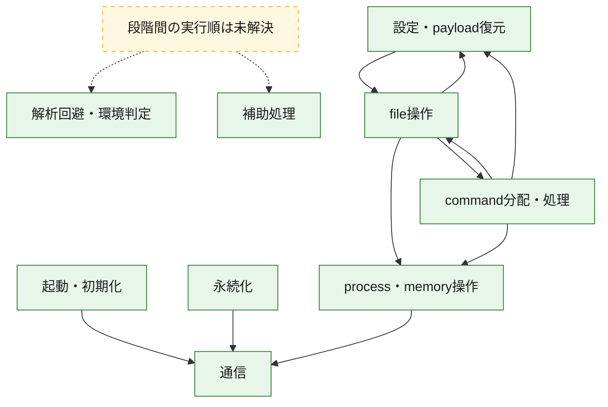

# 全体ロジック：3e4e88255066faa5d0bcae00b6dfd75d2ae4fd13c4d28109b814a9b126f8ef63

代表関数の静的証跡から、起動・初期化、設定・payload復元、解析回避・環境判定、永続化、process・memory操作、通信、command分配・処理、file操作の処理群を確認しました。

## 読み方

- phaseの掲載順は解析上の整理順です。observed_call_edgesがない段階間の実行順を断定しません。
- 図の実線は静的に観測した関係、点線と黄色のノードは未観測・未解決の関係を示します。
- 図は静的な要約であり、動的実行を再現するものではありません。
- 詳細な関数解説とfingerprintは[STATIC-LOGIC.md](STATIC-LOGIC.md)を参照してください。

## 静的可視化

### 実行フロー

### 感染チェーン

```mermaid
flowchart TD
  chain_initial["初期侵入・配布経路は未観測"]
  chain_01["提出検体 / sha256:3e4e88255066….exe / pe"]
  chain_02["静的復元層 1 / sha256:3e4e88255066….exe::embedded-pe / pe"]
  chain_03["静的復元層 1 / sha256:3e4e88255066….exe::embedded-pe / pe"]
  chain_04["静的復元層 1 / sha256:3e4e88255066….exe::embedded-pe / pe"]
  chain_05["静的復元層 1 / sha256:3e4e88255066….exe::embedded-pe / pe"]
  chain_06["静的復元層 1 / sha256:3e4e88255066….exe::embedded-pe / pe"]
  chain_07["静的復元層 1 / sha256:3e4e88255066….exe::embedded-pe / pe"]
  chain_08["静的復元層 1 / sha256:3e4e88255066….exe::embedded-pe / pe"]
  chain_09["静的復元層 1 / sha256:3e4e88255066….exe::embedded-pe / pe"]
  chain_10["静的復元層 1 / sha256:3e4e88255066….exe::pe-resource-pe / pe"]
  chain_11["静的復元層 1 / sha256:3e4e88255066….exe::pe-resource-pe / pe"]
  chain_12["静的復元層 1 / sha256:3e4e88255066….exe::pe-resource-pe / pe"]
  chain_13["静的復元層 1 / sha256:3e4e88255066….exe::pe-resource-pe / pe"]
  chain_14["静的復元層 1 / sha256:3e4e88255066….exe::pe-resource-pe / pe"]
  chain_15["静的復元層 2 / sha256:3e4e88255066….exe::pe-resource-pe::dotnet-resource-ole / ole"]
  chain_16["静的復元層 3 / sha256:3e4e88255066….exe::pe-resource-pe::dotnet-resource-ole::o / cab"]
  chain_01 -->|embedded-pe| chain_02
  chain_01 -->|embedded-pe| chain_03
  chain_01 -->|embedded-pe| chain_04
  chain_01 -->|embedded-pe| chain_05
  chain_01 -->|embedded-pe| chain_06
  chain_01 -->|embedded-pe| chain_07
  chain_01 -->|embedded-pe| chain_08
  chain_01 -->|embedded-pe| chain_09
  chain_01 -->|pe-resource-pe| chain_10
  chain_01 -->|pe-resource-pe| chain_11
  chain_01 -->|pe-resource-pe| chain_12
  chain_01 -->|pe-resource-pe| chain_13
  chain_01 -->|pe-resource-pe| chain_14
  chain_11 -->|dotnet-resource-ole| chain_15
  chain_15 -->|ole-cab-stream| chain_16
  chain_initial -.-> chain_01
  chain_more["その他113層はstatic-layers.jsonを参照"]
  chain_02 -.-> chain_more
  chain_03 -.-> chain_more
  chain_04 -.-> chain_more
  chain_05 -.-> chain_more
  chain_06 -.-> chain_more
  chain_07 -.-> chain_more
  chain_08 -.-> chain_more
  chain_09 -.-> chain_more
  chain_10 -.-> chain_more
  chain_12 -.-> chain_more
  chain_13 -.-> chain_more
  chain_14 -.-> chain_more
  chain_16 -.-> chain_more
  class chain_more unresolved
  class chain_01,chain_02,chain_03,chain_04,chain_05,chain_06,chain_07,chain_08,chain_09,chain_10,chain_11,chain_12,chain_13,chain_14,chain_15,chain_16 confirmed
  class chain_initial unresolved
  classDef confirmed fill:#e8f5e9,stroke:#2e7d32,color:#1b1b1b
  classDef unresolved fill:#fff8e1,stroke:#f9a825,color:#1b1b1b,stroke-dasharray:5 5
```

### モジュール関係

```mermaid
flowchart TD
  module_scope["解析対象のprogram構造"]
  module_01["sha256:19ac323ca6ea… / x86 / statically_recovered_program"]
  module_02["sha256:c79a22accadb… / x86 / statically_recovered_program"]
  module_03["sha256:e04de7988a2a… / x86 / statically_recovered_program"]
  module_04["sha256:9d32032109ff… / x86 / statically_recovered_program"]
  module_05["sha256:548c551f6ebc… / x86 / statically_recovered_program"]
  module_06["sha256:1404090db312… / x86 / statically_recovered_program"]
  module_07["sha256:319ba24115e6… / x86 / statically_recovered_program"]
  module_08["sha256:ad6062215032… / x86 / statically_recovered_program"]
  module_09["sha256:13f8cfe4648b… / x86 / statically_recovered_program"]
  module_10["sha256:8a55c15cc76e… / x86 / statically_recovered_program"]
  module_11["sha256:f048400c23ad… / x86 / statically_recovered_program"]
  module_12["sha256:e84dfe0b660f… / x86 / statically_recovered_program"]
  module_parent_unknown["復元元・親moduleは未特定"]
  module_parent_unknown -.-> module_01
  module_parent_unknown -.-> module_02
  module_parent_unknown -.-> module_03
  module_parent_unknown -.-> module_04
  module_parent_unknown -.-> module_05
  module_parent_unknown -.-> module_06
  module_parent_unknown -.-> module_07
  module_parent_unknown -.-> module_08
  module_parent_unknown -.-> module_09
  module_parent_unknown -.-> module_10
  module_parent_unknown -.-> module_11
  module_parent_unknown -.-> module_12
  class module_parent_unknown unresolved
  module_more["その他17moduleはstatic-logic.jsonを参照"]
  module_scope -.-> module_more
  class module_more unresolved
  class module_scope confirmed
  class module_01,module_02,module_03,module_04,module_05,module_06,module_07,module_08,module_09,module_10,module_11,module_12 confirmed
  classDef confirmed fill:#e8f5e9,stroke:#2e7d32,color:#1b1b1b
  classDef unresolved fill:#fff8e1,stroke:#f9a825,color:#1b1b1b,stroke-dasharray:5 5
```

## 処理段階

### 1. 起動・初期化

entry pointから初期化と後続処理への移行を確認します。
確度: `confirmed_static_function_evidence`

- `19ac323ca6eae2f8145cdc2bac865b32cd5a48ad6ff199d4ca7da214b056e1dc:cil:0x06000001` — 初期化と主要処理への分岐を行う入口関数です。 状態: `succeeded`、選定理由: `entry_point`, `reviewed_call_centrality:10`, `small_program_complete_context`
- `19ac323ca6eae2f8145cdc2bac865b32cd5a48ad6ff199d4ca7da214b056e1dc:cil:0x0600000d` — 初期化と主要処理への分岐を行う入口関数です。 状態: `succeeded`、選定理由: `entry_point`, `reviewed_call_centrality:16`, `small_program_complete_context`
- `1404090db3128de503ba4d991a960c7c1bc3b910a62d06ecf7e7081a2fcf11b9:cil:0x06000006` — 初期化と主要処理への分岐を行う入口関数です。 状態: `succeeded`、選定理由: `entry_point`, `reviewed_call_centrality:32`
- `13f8cfe4648b807a0cbddd653c75254b60d1951e11e715f4e5a1a2c9ab29360b:cil:0x06000006` — 初期化と主要処理への分岐を行う入口関数です。 状態: `succeeded`、選定理由: `entry_point`, `large_function:instructions=132`, `reviewed_call_centrality:60`
- `13f8cfe4648b807a0cbddd653c75254b60d1951e11e715f4e5a1a2c9ab29360b:cil:0x06000007` — 初期化と主要処理への分岐を行う入口関数です。 状態: `succeeded`、選定理由: `entry_point`, `reviewed_call_centrality:4`
- `13f8cfe4648b807a0cbddd653c75254b60d1951e11e715f4e5a1a2c9ab29360b:cil:0x0600003c` — 初期化と主要処理への分岐を行う入口関数です。 状態: `succeeded`、選定理由: `entry_point`, `reviewed_call_centrality:12`
- `13f8cfe4648b807a0cbddd653c75254b60d1951e11e715f4e5a1a2c9ab29360b:cil:0x0600003d` — 初期化と主要処理への分岐を行う入口関数です。 状態: `succeeded`、選定理由: `entry_point`, `reviewed_call_centrality:2`
- `13f8cfe4648b807a0cbddd653c75254b60d1951e11e715f4e5a1a2c9ab29360b:cil:0x0600003f` — 初期化と主要処理への分岐を行う入口関数です。 状態: `succeeded`、選定理由: `entry_point`, `reviewed_call_centrality:2`
- `13f8cfe4648b807a0cbddd653c75254b60d1951e11e715f4e5a1a2c9ab29360b:cil:0x06000040` — 初期化と主要処理への分岐を行う入口関数です。 状態: `succeeded`、選定理由: `entry_point`, `large_function:instructions=87`, `reviewed_call_centrality:24`
- `13f8cfe4648b807a0cbddd653c75254b60d1951e11e715f4e5a1a2c9ab29360b:cil:0x06000041` — 初期化と主要処理への分岐を行う入口関数です。 状態: `succeeded`、選定理由: `entry_point`, `large_function:instructions=195`, `reviewed_call_centrality:60`
- `13f8cfe4648b807a0cbddd653c75254b60d1951e11e715f4e5a1a2c9ab29360b:cil:0x06000042` — 初期化と主要処理への分岐を行う入口関数です。 状態: `succeeded`、選定理由: `entry_point`, `large_function:instructions=272`, `reviewed_call_centrality:78`
- `8a55c15cc76e31042e17458c479772aa95bc1b908016c85b1dc8b8e3eff23254:ghidra:180007e50` — 初期化と主要処理への分岐を行う入口関数です。 状態: `succeeded`、選定理由: `entry_point`, `meaningful_symbol_name`, `reviewed_call_centrality:4`, `role:entrypoint`
- `a5b8f0070201e4f26260af6a25941ea38bd7042aefd48cd68b9acf951fa99ee5:ghidra:180008a8c` — 初期化と主要処理への分岐を行う入口関数です。 状態: `succeeded`、選定理由: `entry_point`, `meaningful_symbol_name`, `reviewed_call_centrality:5`, `role:entrypoint`
- `808c61a09e220c361cff01e76c30f269e6c037c85069e0811662fd86c137874a:ghidra:1800380f8` — 初期化と主要処理への分岐を行う入口関数です。 状態: `succeeded`、選定理由: `entry_point`, `meaningful_symbol_name`, `reviewed_call_centrality:4`, `role:entrypoint`
- `e4b29e87ae288199964726c10ea221827cfde794c2aee17f71f4561cd09bf472:ghidra:180036be8` — 初期化と主要処理への分岐を行う入口関数です。 状態: `succeeded`、選定理由: `entry_point`, `meaningful_symbol_name`, `reviewed_call_centrality:4`, `role:entrypoint`
- `b8100e5ab07983cbf82d721cf719576ca3f60e352628dcaabd42d428011fdedf:cil:0x06001192` — 初期化と主要処理への分岐を行う入口関数です。 状態: `succeeded`、選定理由: `entry_point`, `reviewed_call_centrality:2`
- `b80d07610b81bddb3d7f30a207a2e134b559e06b8440598a926f3a9c1d439218:cil:0x060003eb` — 初期化と主要処理への分岐を行う入口関数です。 状態: `succeeded`、選定理由: `entry_point`, `large_function:instructions=275`, `reviewed_call_centrality:122`
- `b80d07610b81bddb3d7f30a207a2e134b559e06b8440598a926f3a9c1d439218:cil:0x06000a6b` — 初期化と主要処理への分岐を行う入口関数です。 状態: `succeeded`、選定理由: `entry_point`, `reviewed_call_centrality:2`
- `b80d07610b81bddb3d7f30a207a2e134b559e06b8440598a926f3a9c1d439218:cil:0x06000a6c` — 初期化と主要処理への分岐を行う入口関数です。 状態: `succeeded`、選定理由: `entry_point`, `reviewed_call_centrality:2`
- `b80d07610b81bddb3d7f30a207a2e134b559e06b8440598a926f3a9c1d439218:cil:0x06000a6d` — 初期化と主要処理への分岐を行う入口関数です。 状態: `succeeded`、選定理由: `entry_point`, `reviewed_call_centrality:2`
- `b80d07610b81bddb3d7f30a207a2e134b559e06b8440598a926f3a9c1d439218:cil:0x06000a6e` — 初期化と主要処理への分岐を行う入口関数です。 状態: `succeeded`、選定理由: `entry_point`, `reviewed_call_centrality:32`
- `b80d07610b81bddb3d7f30a207a2e134b559e06b8440598a926f3a9c1d439218:cil:0x06000a6f` — 初期化と主要処理への分岐を行う入口関数です。 状態: `succeeded`、選定理由: `entry_point`, `reviewed_call_centrality:4`
- `b80d07610b81bddb3d7f30a207a2e134b559e06b8440598a926f3a9c1d439218:cil:0x06000a74` — 初期化と主要処理への分岐を行う入口関数です。 状態: `succeeded`、選定理由: `entry_point`, `reviewed_call_centrality:2`
- `b80d07610b81bddb3d7f30a207a2e134b559e06b8440598a926f3a9c1d439218:cil:0x06000a76` — 初期化と主要処理への分岐を行う入口関数です。 状態: `succeeded`、選定理由: `entry_point`
- `471f006f8fa65639c35f754bf173b5f7749e0e0bbc4c8e1a699c5358b995684c:cil:0x06000014` — 初期化と主要処理への分岐を行う入口関数です。 状態: `succeeded`、選定理由: `entry_point`, `reviewed_call_centrality:4`, `small_program_complete_context`
- `471f006f8fa65639c35f754bf173b5f7749e0e0bbc4c8e1a699c5358b995684c:cil:0x06000017` — 初期化と主要処理への分岐を行う入口関数です。 状態: `succeeded`、選定理由: `entry_point`, `large_function:instructions=192`, `reviewed_call_centrality:82`, `small_program_complete_context`
- `471f006f8fa65639c35f754bf173b5f7749e0e0bbc4c8e1a699c5358b995684c:cil:0x06000018` — 初期化と主要処理への分岐を行う入口関数です。 状態: `succeeded`、選定理由: `entry_point`, `reviewed_call_centrality:4`, `small_program_complete_context`
- `471f006f8fa65639c35f754bf173b5f7749e0e0bbc4c8e1a699c5358b995684c:cil:0x06000019` — 初期化と主要処理への分岐を行う入口関数です。 状態: `succeeded`、選定理由: `entry_point`, `reviewed_call_centrality:8`, `small_program_complete_context`
- `471f006f8fa65639c35f754bf173b5f7749e0e0bbc4c8e1a699c5358b995684c:cil:0x0600001a` — 初期化と主要処理への分岐を行う入口関数です。 状態: `succeeded`、選定理由: `entry_point`, `reviewed_call_centrality:20`, `small_program_complete_context`
- `471f006f8fa65639c35f754bf173b5f7749e0e0bbc4c8e1a699c5358b995684c:cil:0x0600001c` — 初期化と主要処理への分岐を行う入口関数です。 状態: `succeeded`、選定理由: `entry_point`, `reviewed_call_centrality:2`, `small_program_complete_context`
- `471f006f8fa65639c35f754bf173b5f7749e0e0bbc4c8e1a699c5358b995684c:cil:0x0600001e` — 初期化と主要処理への分岐を行う入口関数です。 状態: `succeeded`、選定理由: `entry_point`, `reviewed_call_centrality:8`, `small_program_complete_context`
- `471f006f8fa65639c35f754bf173b5f7749e0e0bbc4c8e1a699c5358b995684c:cil:0x0600001f` — 初期化と主要処理への分岐を行う入口関数です。 状態: `succeeded`、選定理由: `entry_point`, `reviewed_call_centrality:6`, `small_program_complete_context`

### 2. 設定・payload復元

設定、resource、payload、暗号化データの復元・変換を確認します。
確度: `confirmed_static_function_evidence`

- `e04de7988a2a39931831977fa22d2a4c39cf3f70211b77b618cae9243170f1a7:cil:0x0600002f` — 設定、resource、payloadなどの解析・変換を行う関数です。 状態: `succeeded`、選定理由: `reviewed_call_centrality:14`, `role:config_or_data_transform`
- `e04de7988a2a39931831977fa22d2a4c39cf3f70211b77b618cae9243170f1a7:cil:0x06000032` — 設定、resource、payloadなどの解析・変換を行う関数です。 状態: `succeeded`、選定理由: `reviewed_call_centrality:10`, `role:config_or_data_transform`
- `e04de7988a2a39931831977fa22d2a4c39cf3f70211b77b618cae9243170f1a7:cil:0x06000034` — 設定、resource、payloadなどの解析・変換を行う関数です。 状態: `succeeded`、選定理由: `reviewed_call_centrality:16`, `role:config_or_data_transform`
- `e04de7988a2a39931831977fa22d2a4c39cf3f70211b77b618cae9243170f1a7:cil:0x06000035` — 設定、resource、payloadなどの解析・変換を行う関数です。 状態: `succeeded`、選定理由: `reviewed_call_centrality:10`, `role:config_or_data_transform`
- `e04de7988a2a39931831977fa22d2a4c39cf3f70211b77b618cae9243170f1a7:cil:0x0600007d` — 設定、resource、payloadなどの解析・変換を行う関数です。 状態: `succeeded`、選定理由: `reviewed_call_centrality:10`, `role:config_or_data_transform`
- `9d32032109ffc217b7dc49390bd01a067a49883843459356ebfb4d29ba696bf8:cil:0x06000015` — 暗号、hash、encoding、または復号処理に関係する関数です。 状態: `succeeded`、選定理由: `reviewed_call_centrality:14`, `role:cryptographic_transform`
- `9d32032109ffc217b7dc49390bd01a067a49883843459356ebfb4d29ba696bf8:cil:0x0600004a` — 設定、resource、payloadなどの解析・変換を行う関数です。 状態: `succeeded`、選定理由: `reviewed_call_centrality:10`, `role:config_or_data_transform`
- `9d32032109ffc217b7dc49390bd01a067a49883843459356ebfb4d29ba696bf8:cil:0x0600004c` — 設定、resource、payloadなどの解析・変換を行う関数です。 状態: `succeeded`、選定理由: `reviewed_call_centrality:16`, `role:config_or_data_transform`
- `9d32032109ffc217b7dc49390bd01a067a49883843459356ebfb4d29ba696bf8:cil:0x0600004d` — 設定、resource、payloadなどの解析・変換を行う関数です。 状態: `succeeded`、選定理由: `large_function:instructions=87`, `reviewed_call_centrality:20`, `role:config_or_data_transform`
- `9d32032109ffc217b7dc49390bd01a067a49883843459356ebfb4d29ba696bf8:cil:0x0600004e` — 設定、resource、payloadなどの解析・変換を行う関数です。 状態: `succeeded`、選定理由: `reviewed_call_centrality:8`, `role:config_or_data_transform`
- `9d32032109ffc217b7dc49390bd01a067a49883843459356ebfb4d29ba696bf8:cil:0x0600004f` — 設定、resource、payloadなどの解析・変換を行う関数です。 状態: `succeeded`、選定理由: `large_function:instructions=98`, `reviewed_call_centrality:36`, `role:config_or_data_transform`
- `9d32032109ffc217b7dc49390bd01a067a49883843459356ebfb4d29ba696bf8:cil:0x06000050` — 設定、resource、payloadなどの解析・変換を行う関数です。 状態: `succeeded`、選定理由: `large_function:instructions=145`, `reviewed_call_centrality:48`, `role:config_or_data_transform`
- `9d32032109ffc217b7dc49390bd01a067a49883843459356ebfb4d29ba696bf8:cil:0x06000051` — 設定、resource、payloadなどの解析・変換を行う関数です。 状態: `succeeded`、選定理由: `large_function:instructions=85`, `reviewed_call_centrality:26`, `role:config_or_data_transform`
- `9d32032109ffc217b7dc49390bd01a067a49883843459356ebfb4d29ba696bf8:cil:0x06000052` — 設定、resource、payloadなどの解析・変換を行う関数です。 状態: `succeeded`、選定理由: `reviewed_call_centrality:10`, `role:config_or_data_transform`
- `9d32032109ffc217b7dc49390bd01a067a49883843459356ebfb4d29ba696bf8:cil:0x06000054` — 設定、resource、payloadなどの解析・変換を行う関数です。 状態: `succeeded`、選定理由: `reviewed_call_centrality:18`, `role:config_or_data_transform`
- `9d32032109ffc217b7dc49390bd01a067a49883843459356ebfb4d29ba696bf8:cil:0x06000056` — 設定、resource、payloadなどの解析・変換を行う関数です。 状態: `succeeded`、選定理由: `reviewed_call_centrality:16`, `role:config_or_data_transform`
- `9d32032109ffc217b7dc49390bd01a067a49883843459356ebfb4d29ba696bf8:cil:0x06000057` — 設定、resource、payloadなどの解析・変換を行う関数です。 状態: `succeeded`、選定理由: `large_function:instructions=66`, `reviewed_call_centrality:22`, `role:config_or_data_transform`
- `9d32032109ffc217b7dc49390bd01a067a49883843459356ebfb4d29ba696bf8:cil:0x06000058` — 設定、resource、payloadなどの解析・変換を行う関数です。 状態: `succeeded`、選定理由: `large_function:instructions=99`, `reviewed_call_centrality:18`, `role:config_or_data_transform`
- `9d32032109ffc217b7dc49390bd01a067a49883843459356ebfb4d29ba696bf8:cil:0x06000059` — 設定、resource、payloadなどの解析・変換を行う関数です。 状態: `succeeded`、選定理由: `reviewed_call_centrality:22`, `role:config_or_data_transform`
- `9d32032109ffc217b7dc49390bd01a067a49883843459356ebfb4d29ba696bf8:cil:0x0600005a` — 設定、resource、payloadなどの解析・変換を行う関数です。 状態: `succeeded`、選定理由: `large_function:instructions=97`, `reviewed_call_centrality:16`, `role:config_or_data_transform`
- `9d32032109ffc217b7dc49390bd01a067a49883843459356ebfb4d29ba696bf8:cil:0x0600005b` — 設定、resource、payloadなどの解析・変換を行う関数です。 状態: `succeeded`、選定理由: `large_function:instructions=67`, `reviewed_call_centrality:20`, `role:config_or_data_transform`
- `548c551f6ebc5d829158a1e9ad1948d301d7c921906c3d8d6b6d69925fc624a1:cil:0x06000030` — 設定、resource、payloadなどの解析・変換を行う関数です。 状態: `succeeded`、選定理由: `reviewed_call_centrality:6`, `role:config_or_data_transform`
- `548c551f6ebc5d829158a1e9ad1948d301d7c921906c3d8d6b6d69925fc624a1:cil:0x06000031` — 設定、resource、payloadなどの解析・変換を行う関数です。 状態: `succeeded`、選定理由: `large_function:instructions=159`, `reviewed_call_centrality:8`, `role:config_or_data_transform`
- `548c551f6ebc5d829158a1e9ad1948d301d7c921906c3d8d6b6d69925fc624a1:cil:0x0600009d` — 設定、resource、payloadなどの解析・変換を行う関数です。 状態: `succeeded`、選定理由: `reviewed_call_centrality:10`, `role:config_or_data_transform`
- `548c551f6ebc5d829158a1e9ad1948d301d7c921906c3d8d6b6d69925fc624a1:cil:0x0600009f` — 設定、resource、payloadなどの解析・変換を行う関数です。 状態: `succeeded`、選定理由: `large_function:instructions=95`, `reviewed_call_centrality:20`, `role:config_or_data_transform`
- `e84dfe0b660f1698d83b0ee959c1b228eb51e2d5cbee90fcc2fe987a6fe08441:cil:0x0600022f` — 設定、resource、payloadなどの解析・変換を行う関数です。 状態: `succeeded`、選定理由: `large_function:instructions=104`, `reviewed_call_centrality:20`, `role:config_or_data_transform`
- `e84dfe0b660f1698d83b0ee959c1b228eb51e2d5cbee90fcc2fe987a6fe08441:cil:0x0600024e` — 暗号、hash、encoding、または復号処理に関係する関数です。 状態: `succeeded`、選定理由: `role:cryptographic_transform`
- `3e54286e348ebd3d70eaed8174cca500455c3e098cdd1fccb167bc43d93db29d:cil:0x06000017` — 設定、resource、payloadなどの解析・変換を行う関数です。 状態: `succeeded`、選定理由: `large_function:instructions=113`, `reviewed_call_centrality:20`, `role:config_or_data_transform`
- `3e54286e348ebd3d70eaed8174cca500455c3e098cdd1fccb167bc43d93db29d:cil:0x0600005d` — 設定、resource、payloadなどの解析・変換を行う関数です。 状態: `succeeded`、選定理由: `reviewed_call_centrality:24`, `role:config_or_data_transform`
- `3e54286e348ebd3d70eaed8174cca500455c3e098cdd1fccb167bc43d93db29d:cil:0x06000064` — 暗号、hash、encoding、または復号処理に関係する関数です。 状態: `succeeded`、選定理由: `large_function:instructions=144`, `reviewed_call_centrality:44`, `role:cryptographic_transform`
- `3e54286e348ebd3d70eaed8174cca500455c3e098cdd1fccb167bc43d93db29d:cil:0x06000071` — 設定、resource、payloadなどの解析・変換を行う関数です。 状態: `succeeded`、選定理由: `reviewed_call_centrality:20`, `role:config_or_data_transform`
- `3e54286e348ebd3d70eaed8174cca500455c3e098cdd1fccb167bc43d93db29d:cil:0x06000102` — 設定、resource、payloadなどの解析・変換を行う関数です。 状態: `succeeded`、選定理由: `large_function:instructions=106`, `reviewed_call_centrality:44`, `role:config_or_data_transform`
- `6526705b685c2f221a6675118c73cba98c47d948169d81ea4544c3e3336b8f2b:cil:0x06000493` — 暗号、hash、encoding、または復号処理に関係する関数です。 状態: `succeeded`、選定理由: `reviewed_call_centrality:2`, `role:cryptographic_transform`
- `6526705b685c2f221a6675118c73cba98c47d948169d81ea4544c3e3336b8f2b:cil:0x0600049f` — 設定、resource、payloadなどの解析・変換を行う関数です。 状態: `succeeded`、選定理由: `reviewed_call_centrality:2`, `role:config_or_data_transform`
- `e4b29e87ae288199964726c10ea221827cfde794c2aee17f71f4561cd09bf472:ghidra:180007b50` — 設定、resource、payloadなどの解析・変換を行う関数です。 状態: `succeeded`、選定理由: `entry_point`, `meaningful_symbol_name`, `reviewed_call_centrality:1`, `role:config_or_data_transform`
- `b8100e5ab07983cbf82d721cf719576ca3f60e352628dcaabd42d428011fdedf:cil:0x06000de3` — 設定、resource、payloadなどの解析・変換を行う関数です。 状態: `succeeded`、選定理由: `reviewed_call_centrality:22`, `role:config_or_data_transform`
- `b8100e5ab07983cbf82d721cf719576ca3f60e352628dcaabd42d428011fdedf:cil:0x060010e7` — 暗号、hash、encoding、または復号処理に関係する関数です。 状態: `succeeded`、選定理由: `large_function:instructions=94`, `reviewed_call_centrality:26`, `role:cryptographic_transform`
- `b80d07610b81bddb3d7f30a207a2e134b559e06b8440598a926f3a9c1d439218:cil:0x06000a25` — 設定、resource、payloadなどの解析・変換を行う関数です。 状態: `succeeded`、選定理由: `large_function:instructions=142`, `reviewed_call_centrality:64`, `role:config_or_data_transform`
- `b80d07610b81bddb3d7f30a207a2e134b559e06b8440598a926f3a9c1d439218:cil:0x06000ada` — 暗号、hash、encoding、または復号処理に関係する関数です。 状態: `succeeded`、選定理由: `large_function:instructions=85`, `reviewed_call_centrality:50`, `role:cryptographic_transform`
- `da29455a64858fda773319c32c0a6cd40edbe8042ed005aa2befb8a4f0fb0522:cil:0x060002db` — 暗号、hash、encoding、または復号処理に関係する関数です。 状態: `succeeded`、選定理由: `reviewed_call_centrality:6`, `role:cryptographic_transform`
- `da29455a64858fda773319c32c0a6cd40edbe8042ed005aa2befb8a4f0fb0522:cil:0x060002ed` — 設定、resource、payloadなどの解析・変換を行う関数です。 状態: `succeeded`、選定理由: `reviewed_call_centrality:18`, `role:config_or_data_transform`
- `471f006f8fa65639c35f754bf173b5f7749e0e0bbc4c8e1a699c5358b995684c:cil:0x0600000d` — 暗号、hash、encoding、または復号処理に関係する関数です。 状態: `succeeded`、選定理由: `large_function:instructions=72`, `reviewed_call_centrality:4`, `role:cryptographic_transform`, `small_program_complete_context`

### 3. 解析回避・環境判定

debugger、sandbox、仮想環境、時間差などの判定を確認します。
確度: `confirmed_static_function_evidence_with_limits`

- `3e54286e348ebd3d70eaed8174cca500455c3e098cdd1fccb167bc43d93db29d:cil:0x0600009a` — debugger、仮想環境、sandbox、または時間差の確認に関係する関数です。 状態: `succeeded`、選定理由: `large_function:instructions=81`, `reviewed_call_centrality:28`, `role:anti_analysis`
- `3e54286e348ebd3d70eaed8174cca500455c3e098cdd1fccb167bc43d93db29d:cil:0x0600009d` — debugger、仮想環境、sandbox、または時間差の確認に関係する関数です。 状態: `succeeded`、選定理由: `reviewed_call_centrality:20`, `role:anti_analysis`
- `a5b8f0070201e4f26260af6a25941ea38bd7042aefd48cd68b9acf951fa99ee5:ghidra:180001ea0` — debugger、仮想環境、sandbox、または時間差の確認に関係する関数です。 状態: `limited_bad_instruction_or_flow`、選定理由: `entry_point`, `meaningful_symbol_name`, `reviewed_call_centrality:2`, `role:anti_analysis`
- `a5b8f0070201e4f26260af6a25941ea38bd7042aefd48cd68b9acf951fa99ee5:ghidra:180001ed0` — debugger、仮想環境、sandbox、または時間差の確認に関係する関数です。 状態: `succeeded`、選定理由: `entry_point`, `meaningful_symbol_name`, `reviewed_call_centrality:2`, `role:anti_analysis`
- `a5b8f0070201e4f26260af6a25941ea38bd7042aefd48cd68b9acf951fa99ee5:ghidra:180001f00` — debugger、仮想環境、sandbox、または時間差の確認に関係する関数です。 状態: `succeeded`、選定理由: `entry_point`, `meaningful_symbol_name`, `reviewed_call_centrality:2`, `role:anti_analysis`
- `a5b8f0070201e4f26260af6a25941ea38bd7042aefd48cd68b9acf951fa99ee5:ghidra:180001f20` — debugger、仮想環境、sandbox、または時間差の確認に関係する関数です。 状態: `succeeded`、選定理由: `entry_point`, `meaningful_symbol_name`, `reviewed_call_centrality:2`, `role:anti_analysis`
- `a5b8f0070201e4f26260af6a25941ea38bd7042aefd48cd68b9acf951fa99ee5:ghidra:180002c70` — debugger、仮想環境、sandbox、または時間差の確認に関係する関数です。 状態: `succeeded`、選定理由: `entry_point`, `meaningful_symbol_name`, `reviewed_call_centrality:8`, `role:anti_analysis`
- `808c61a09e220c361cff01e76c30f269e6c037c85069e0811662fd86c137874a:ghidra:1800055e0` — debugger、仮想環境、sandbox、または時間差の確認に関係する関数です。 状態: `succeeded`、選定理由: `context_representative`, `reviewed_call_centrality:5`, `role:anti_analysis`

### 4. 永続化

自動起動や永続化に関係する設定変更を確認します。
確度: `confirmed_static_function_evidence`

- `c79a22accadb1f8a716669ca68c6d6f4e9a21c0d639e2846f288b60bc8adc770:cil:0x06000002` — 自動起動または永続化に関係する処理を含む関数です。 状態: `succeeded`、選定理由: `reviewed_call_centrality:2`, `role:persistence`, `small_program_complete_context`
- `c79a22accadb1f8a716669ca68c6d6f4e9a21c0d639e2846f288b60bc8adc770:cil:0x06000003` — 自動起動または永続化に関係する処理を含む関数です。 状態: `succeeded`、選定理由: `reviewed_call_centrality:2`, `role:persistence`, `small_program_complete_context`
- `c79a22accadb1f8a716669ca68c6d6f4e9a21c0d639e2846f288b60bc8adc770:cil:0x06000004` — 自動起動または永続化に関係する処理を含む関数です。 状態: `succeeded`、選定理由: `reviewed_call_centrality:2`, `role:persistence`, `small_program_complete_context`
- `c79a22accadb1f8a716669ca68c6d6f4e9a21c0d639e2846f288b60bc8adc770:cil:0x06000005` — 自動起動または永続化に関係する処理を含む関数です。 状態: `succeeded`、選定理由: `reviewed_call_centrality:2`, `role:persistence`, `small_program_complete_context`
- `c79a22accadb1f8a716669ca68c6d6f4e9a21c0d639e2846f288b60bc8adc770:cil:0x06000012` — 自動起動または永続化に関係する処理を含む関数です。 状態: `succeeded`、選定理由: `reviewed_call_centrality:2`, `role:persistence`, `small_program_complete_context`
- `c79a22accadb1f8a716669ca68c6d6f4e9a21c0d639e2846f288b60bc8adc770:cil:0x06000014` — 自動起動または永続化に関係する処理を含む関数です。 状態: `succeeded`、選定理由: `reviewed_call_centrality:2`, `role:persistence`, `small_program_complete_context`
- `9d32032109ffc217b7dc49390bd01a067a49883843459356ebfb4d29ba696bf8:cil:0x06000009` — 自動起動または永続化に関係する処理を含む関数です。 状態: `succeeded`、選定理由: `large_function:instructions=118`, `reviewed_call_centrality:36`, `role:persistence`
- `1404090db3128de503ba4d991a960c7c1bc3b910a62d06ecf7e7081a2fcf11b9:cil:0x06000002` — 自動起動または永続化に関係する処理を含む関数です。 状態: `succeeded`、選定理由: `reviewed_call_centrality:2`, `role:persistence`
- `319ba24115e64ea4b714caf4e88d3d5a658defd51d714c2291b9758466925281:cil:0x0600008b` — 自動起動または永続化に関係する処理を含む関数です。 状態: `succeeded`、選定理由: `reviewed_call_centrality:20`, `role:persistence`
- `13f8cfe4648b807a0cbddd653c75254b60d1951e11e715f4e5a1a2c9ab29360b:cil:0x06000002` — 自動起動または永続化に関係する処理を含む関数です。 状態: `succeeded`、選定理由: `reviewed_call_centrality:2`, `role:persistence`
- `13f8cfe4648b807a0cbddd653c75254b60d1951e11e715f4e5a1a2c9ab29360b:cil:0x06000003` — 自動起動または永続化に関係する処理を含む関数です。 状態: `succeeded`、選定理由: `reviewed_call_centrality:2`, `role:persistence`
- `13f8cfe4648b807a0cbddd653c75254b60d1951e11e715f4e5a1a2c9ab29360b:cil:0x06000004` — 自動起動または永続化に関係する処理を含む関数です。 状態: `succeeded`、選定理由: `reviewed_call_centrality:2`, `role:persistence`
- `13f8cfe4648b807a0cbddd653c75254b60d1951e11e715f4e5a1a2c9ab29360b:cil:0x06000005` — 自動起動または永続化に関係する処理を含む関数です。 状態: `succeeded`、選定理由: `reviewed_call_centrality:2`, `role:persistence`
- `e84dfe0b660f1698d83b0ee959c1b228eb51e2d5cbee90fcc2fe987a6fe08441:cil:0x06000005` — 自動起動または永続化に関係する処理を含む関数です。 状態: `succeeded`、選定理由: `reviewed_call_centrality:2`, `role:persistence`
- `3e54286e348ebd3d70eaed8174cca500455c3e098cdd1fccb167bc43d93db29d:cil:0x0600007c` — 自動起動または永続化に関係する処理を含む関数です。 状態: `succeeded`、選定理由: `reviewed_call_centrality:14`, `role:persistence`
- `6526705b685c2f221a6675118c73cba98c47d948169d81ea4544c3e3336b8f2b:cil:0x06000003` — 自動起動または永続化に関係する処理を含む関数です。 状態: `succeeded`、選定理由: `reviewed_call_centrality:2`, `role:persistence`
- `b8100e5ab07983cbf82d721cf719576ca3f60e352628dcaabd42d428011fdedf:cil:0x06000022` — 自動起動または永続化に関係する処理を含む関数です。 状態: `succeeded`、選定理由: `reviewed_call_centrality:2`, `role:persistence`
- `b80d07610b81bddb3d7f30a207a2e134b559e06b8440598a926f3a9c1d439218:cil:0x0600081c` — 自動起動または永続化に関係する処理を含む関数です。 状態: `succeeded`、選定理由: `reviewed_call_centrality:12`, `role:persistence`
- `da29455a64858fda773319c32c0a6cd40edbe8042ed005aa2befb8a4f0fb0522:cil:0x06000002` — 自動起動または永続化に関係する処理を含む関数です。 状態: `succeeded`、選定理由: `reviewed_call_centrality:2`, `role:persistence`
- `471f006f8fa65639c35f754bf173b5f7749e0e0bbc4c8e1a699c5358b995684c:cil:0x06000010` — 自動起動または永続化に関係する処理を含む関数です。 状態: `succeeded`、選定理由: `reviewed_call_centrality:2`, `role:persistence`, `small_program_complete_context`
- `471f006f8fa65639c35f754bf173b5f7749e0e0bbc4c8e1a699c5358b995684c:cil:0x06000011` — 自動起動または永続化に関係する処理を含む関数です。 状態: `succeeded`、選定理由: `reviewed_call_centrality:2`, `role:persistence`, `small_program_complete_context`
- `471f006f8fa65639c35f754bf173b5f7749e0e0bbc4c8e1a699c5358b995684c:cil:0x06000012` — 自動起動または永続化に関係する処理を含む関数です。 状態: `succeeded`、選定理由: `reviewed_call_centrality:2`, `role:persistence`, `small_program_complete_context`
- `471f006f8fa65639c35f754bf173b5f7749e0e0bbc4c8e1a699c5358b995684c:cil:0x06000013` — 自動起動または永続化に関係する処理を含む関数です。 状態: `succeeded`、選定理由: `reviewed_call_centrality:2`, `role:persistence`, `small_program_complete_context`

### 5. process・memory操作

process、thread、module、memory操作と実行移行を確認します。
確度: `confirmed_static_function_evidence`

- `e04de7988a2a39931831977fa22d2a4c39cf3f70211b77b618cae9243170f1a7:cil:0x06000048` — process、thread、module、またはmemory操作に関係する関数です。 状態: `succeeded`、選定理由: `role:process_or_memory_operation`
- `9d32032109ffc217b7dc49390bd01a067a49883843459356ebfb4d29ba696bf8:cil:0x0600000a` — process、thread、module、またはmemory操作に関係する関数です。 状態: `succeeded`、選定理由: `large_function:instructions=256`, `reviewed_call_centrality:56`, `role:process_or_memory_operation`
- `548c551f6ebc5d829158a1e9ad1948d301d7c921906c3d8d6b6d69925fc624a1:cil:0x06000018` — process、thread、module、またはmemory操作に関係する関数です。 状態: `succeeded`、選定理由: `large_function:instructions=237`, `reviewed_call_centrality:50`, `role:process_or_memory_operation`
- `319ba24115e64ea4b714caf4e88d3d5a658defd51d714c2291b9758466925281:cil:0x0600005c` — process、thread、module、またはmemory操作に関係する関数です。 状態: `succeeded`、選定理由: `reviewed_call_centrality:16`, `role:process_or_memory_operation`
- `319ba24115e64ea4b714caf4e88d3d5a658defd51d714c2291b9758466925281:cil:0x0600005d` — process、thread、module、またはmemory操作に関係する関数です。 状態: `succeeded`、選定理由: `large_function:instructions=468`, `reviewed_call_centrality:128`, `role:process_or_memory_operation`
- `319ba24115e64ea4b714caf4e88d3d5a658defd51d714c2291b9758466925281:cil:0x0600005e` — process、thread、module、またはmemory操作に関係する関数です。 状態: `succeeded`、選定理由: `reviewed_call_centrality:18`, `role:process_or_memory_operation`
- `319ba24115e64ea4b714caf4e88d3d5a658defd51d714c2291b9758466925281:cil:0x06000060` — process、thread、module、またはmemory操作に関係する関数です。 状態: `succeeded`、選定理由: `large_function:instructions=72`, `reviewed_call_centrality:32`, `role:process_or_memory_operation`
- `319ba24115e64ea4b714caf4e88d3d5a658defd51d714c2291b9758466925281:cil:0x06000075` — process、thread、module、またはmemory操作に関係する関数です。 状態: `succeeded`、選定理由: `reviewed_call_centrality:16`, `role:process_or_memory_operation`
- `319ba24115e64ea4b714caf4e88d3d5a658defd51d714c2291b9758466925281:cil:0x06000091` — process、thread、module、またはmemory操作に関係する関数です。 状態: `succeeded`、選定理由: `large_function:instructions=93`, `reviewed_call_centrality:42`, `role:process_or_memory_operation`
- `319ba24115e64ea4b714caf4e88d3d5a658defd51d714c2291b9758466925281:cil:0x06000095` — process、thread、module、またはmemory操作に関係する関数です。 状態: `succeeded`、選定理由: `large_function:instructions=307`, `reviewed_call_centrality:74`, `role:process_or_memory_operation`
- `319ba24115e64ea4b714caf4e88d3d5a658defd51d714c2291b9758466925281:cil:0x060000b0` — process、thread、module、またはmemory操作に関係する関数です。 状態: `succeeded`、選定理由: `reviewed_call_centrality:24`, `role:process_or_memory_operation`
- `e84dfe0b660f1698d83b0ee959c1b228eb51e2d5cbee90fcc2fe987a6fe08441:cil:0x06000267` — process、thread、module、またはmemory操作に関係する関数です。 状態: `succeeded`、選定理由: `reviewed_call_centrality:6`, `role:process_or_memory_operation`
- `3e54286e348ebd3d70eaed8174cca500455c3e098cdd1fccb167bc43d93db29d:cil:0x06000073` — process、thread、module、またはmemory操作に関係する関数です。 状態: `succeeded`、選定理由: `reviewed_call_centrality:20`, `role:process_or_memory_operation`
- `3e54286e348ebd3d70eaed8174cca500455c3e098cdd1fccb167bc43d93db29d:cil:0x0600028f` — process、thread、module、またはmemory操作に関係する関数です。 状態: `succeeded`、選定理由: `reviewed_call_centrality:18`, `role:process_or_memory_operation`
- `3e54286e348ebd3d70eaed8174cca500455c3e098cdd1fccb167bc43d93db29d:cil:0x06000290` — process、thread、module、またはmemory操作に関係する関数です。 状態: `succeeded`、選定理由: `reviewed_call_centrality:24`, `role:process_or_memory_operation`
- `3e54286e348ebd3d70eaed8174cca500455c3e098cdd1fccb167bc43d93db29d:cil:0x060002bd` — process、thread、module、またはmemory操作に関係する関数です。 状態: `succeeded`、選定理由: `large_function:instructions=115`, `reviewed_call_centrality:22`, `role:process_or_memory_operation`
- `3e54286e348ebd3d70eaed8174cca500455c3e098cdd1fccb167bc43d93db29d:cil:0x060002c0` — process、thread、module、またはmemory操作に関係する関数です。 状態: `succeeded`、選定理由: `reviewed_call_centrality:18`, `role:process_or_memory_operation`
- `6526705b685c2f221a6675118c73cba98c47d948169d81ea4544c3e3336b8f2b:cil:0x060004bf` — process、thread、module、またはmemory操作に関係する関数です。 状態: `succeeded`、選定理由: `reviewed_call_centrality:10`, `role:process_or_memory_operation`
- `b8100e5ab07983cbf82d721cf719576ca3f60e352628dcaabd42d428011fdedf:cil:0x06000142` — process、thread、module、またはmemory操作に関係する関数です。 状態: `succeeded`、選定理由: `large_function:instructions=71`, `reviewed_call_centrality:30`, `role:process_or_memory_operation`
- `b80d07610b81bddb3d7f30a207a2e134b559e06b8440598a926f3a9c1d439218:cil:0x06000a68` — process、thread、module、またはmemory操作に関係する関数です。 状態: `succeeded`、選定理由: `large_function:instructions=250`, `reviewed_call_centrality:36`, `role:process_or_memory_operation`
- `da29455a64858fda773319c32c0a6cd40edbe8042ed005aa2befb8a4f0fb0522:cil:0x06000313` — process、thread、module、またはmemory操作に関係する関数です。 状態: `succeeded`、選定理由: `reviewed_call_centrality:16`, `role:process_or_memory_operation`

### 6. 通信

通信初期化、endpoint処理、送受信の役割を確認します。
確度: `confirmed_static_function_evidence`

- `c79a22accadb1f8a716669ca68c6d6f4e9a21c0d639e2846f288b60bc8adc770:cil:0x06000006` — 通信初期化、送受信、またはendpoint処理に関係する関数です。 状態: `succeeded`、選定理由: `large_function:instructions=127`, `reviewed_call_centrality:40`, `role:network_communication`, `small_program_complete_context`
- `c79a22accadb1f8a716669ca68c6d6f4e9a21c0d639e2846f288b60bc8adc770:cil:0x06000007` — 通信初期化、送受信、またはendpoint処理に関係する関数です。 状態: `succeeded`、選定理由: `reviewed_call_centrality:8`, `role:network_communication`, `small_program_complete_context`
- `c79a22accadb1f8a716669ca68c6d6f4e9a21c0d639e2846f288b60bc8adc770:cil:0x06000008` — 通信初期化、送受信、またはendpoint処理に関係する関数です。 状態: `succeeded`、選定理由: `large_function:instructions=81`, `reviewed_call_centrality:18`, `role:network_communication`, `small_program_complete_context`
- `c79a22accadb1f8a716669ca68c6d6f4e9a21c0d639e2846f288b60bc8adc770:cil:0x06000009` — 通信初期化、送受信、またはendpoint処理に関係する関数です。 状態: `succeeded`、選定理由: `large_function:instructions=86`, `reviewed_call_centrality:16`, `role:network_communication`, `small_program_complete_context`
- `c79a22accadb1f8a716669ca68c6d6f4e9a21c0d639e2846f288b60bc8adc770:cil:0x0600000a` — 通信初期化、送受信、またはendpoint処理に関係する関数です。 状態: `succeeded`、選定理由: `reviewed_call_centrality:8`, `role:network_communication`, `small_program_complete_context`
- `c79a22accadb1f8a716669ca68c6d6f4e9a21c0d639e2846f288b60bc8adc770:cil:0x0600000b` — 通信初期化、送受信、またはendpoint処理に関係する関数です。 状態: `succeeded`、選定理由: `reviewed_call_centrality:8`, `role:network_communication`, `small_program_complete_context`
- `c79a22accadb1f8a716669ca68c6d6f4e9a21c0d639e2846f288b60bc8adc770:cil:0x0600000c` — 通信初期化、送受信、またはendpoint処理に関係する関数です。 状態: `succeeded`、選定理由: `reviewed_call_centrality:2`, `role:network_communication`, `small_program_complete_context`
- `c79a22accadb1f8a716669ca68c6d6f4e9a21c0d639e2846f288b60bc8adc770:cil:0x0600000d` — 通信初期化、送受信、またはendpoint処理に関係する関数です。 状態: `succeeded`、選定理由: `reviewed_call_centrality:8`, `role:network_communication`, `small_program_complete_context`
- `c79a22accadb1f8a716669ca68c6d6f4e9a21c0d639e2846f288b60bc8adc770:cil:0x0600000e` — 通信初期化、送受信、またはendpoint処理に関係する関数です。 状態: `succeeded`、選定理由: `reviewed_call_centrality:10`, `role:network_communication`, `small_program_complete_context`
- `c79a22accadb1f8a716669ca68c6d6f4e9a21c0d639e2846f288b60bc8adc770:cil:0x0600000f` — 通信初期化、送受信、またはendpoint処理に関係する関数です。 状態: `succeeded`、選定理由: `reviewed_call_centrality:8`, `role:network_communication`, `small_program_complete_context`
- `1404090db3128de503ba4d991a960c7c1bc3b910a62d06ecf7e7081a2fcf11b9:cil:0x06000007` — 通信初期化、送受信、またはendpoint処理に関係する関数です。 状態: `succeeded`、選定理由: `reviewed_call_centrality:30`, `role:network_communication`
- `1404090db3128de503ba4d991a960c7c1bc3b910a62d06ecf7e7081a2fcf11b9:cil:0x0600000a` — 通信初期化、送受信、またはendpoint処理に関係する関数です。 状態: `succeeded`、選定理由: `large_function:instructions=314`, `reviewed_call_centrality:112`, `role:network_communication`
- `1404090db3128de503ba4d991a960c7c1bc3b910a62d06ecf7e7081a2fcf11b9:cil:0x0600000b` — 通信初期化、送受信、またはendpoint処理に関係する関数です。 状態: `succeeded`、選定理由: `large_function:instructions=263`, `reviewed_call_centrality:62`, `role:network_communication`
- `1404090db3128de503ba4d991a960c7c1bc3b910a62d06ecf7e7081a2fcf11b9:cil:0x0600000d` — 通信初期化、送受信、またはendpoint処理に関係する関数です。 状態: `succeeded`、選定理由: `large_function:instructions=159`, `reviewed_call_centrality:60`, `role:network_communication`
- `1404090db3128de503ba4d991a960c7c1bc3b910a62d06ecf7e7081a2fcf11b9:cil:0x0600000e` — 通信初期化、送受信、またはendpoint処理に関係する関数です。 状態: `succeeded`、選定理由: `reviewed_call_centrality:18`, `role:network_communication`
- `1404090db3128de503ba4d991a960c7c1bc3b910a62d06ecf7e7081a2fcf11b9:cil:0x06000014` — 通信初期化、送受信、またはendpoint処理に関係する関数です。 状態: `succeeded`、選定理由: `large_function:instructions=64`, `reviewed_call_centrality:30`, `role:network_communication`
- `1404090db3128de503ba4d991a960c7c1bc3b910a62d06ecf7e7081a2fcf11b9:cil:0x06000015` — 通信初期化、送受信、またはendpoint処理に関係する関数です。 状態: `succeeded`、選定理由: `large_function:instructions=67`, `reviewed_call_centrality:22`, `role:network_communication`
- `1404090db3128de503ba4d991a960c7c1bc3b910a62d06ecf7e7081a2fcf11b9:cil:0x0600001a` — 通信初期化、送受信、またはendpoint処理に関係する関数です。 状態: `succeeded`、選定理由: `reviewed_call_centrality:22`, `role:network_communication`
- `1404090db3128de503ba4d991a960c7c1bc3b910a62d06ecf7e7081a2fcf11b9:cil:0x0600001b` — 通信初期化、送受信、またはendpoint処理に関係する関数です。 状態: `succeeded`、選定理由: `reviewed_call_centrality:18`, `role:network_communication`
- `1404090db3128de503ba4d991a960c7c1bc3b910a62d06ecf7e7081a2fcf11b9:cil:0x0600001f` — 通信初期化、送受信、またはendpoint処理に関係する関数です。 状態: `succeeded`、選定理由: `reviewed_call_centrality:20`, `role:network_communication`
- `1404090db3128de503ba4d991a960c7c1bc3b910a62d06ecf7e7081a2fcf11b9:cil:0x06000021` — 通信初期化、送受信、またはendpoint処理に関係する関数です。 状態: `succeeded`、選定理由: `large_function:instructions=95`, `reviewed_call_centrality:20`, `role:network_communication`
- `1404090db3128de503ba4d991a960c7c1bc3b910a62d06ecf7e7081a2fcf11b9:cil:0x06000023` — 通信初期化、送受信、またはendpoint処理に関係する関数です。 状態: `succeeded`、選定理由: `reviewed_call_centrality:24`, `role:network_communication`
- `1404090db3128de503ba4d991a960c7c1bc3b910a62d06ecf7e7081a2fcf11b9:cil:0x0600003c` — 通信初期化、送受信、またはendpoint処理に関係する関数です。 状態: `succeeded`、選定理由: `reviewed_call_centrality:24`, `role:network_communication`
- `1404090db3128de503ba4d991a960c7c1bc3b910a62d06ecf7e7081a2fcf11b9:cil:0x06000048` — 通信初期化、送受信、またはendpoint処理に関係する関数です。 状態: `succeeded`、選定理由: `large_function:instructions=204`, `reviewed_call_centrality:100`, `role:network_communication`
- `1404090db3128de503ba4d991a960c7c1bc3b910a62d06ecf7e7081a2fcf11b9:cil:0x06000056` — 通信初期化、送受信、またはendpoint処理に関係する関数です。 状態: `succeeded`、選定理由: `reviewed_call_centrality:16`, `role:network_communication`
- `1404090db3128de503ba4d991a960c7c1bc3b910a62d06ecf7e7081a2fcf11b9:cil:0x0600005a` — 通信初期化、送受信、またはendpoint処理に関係する関数です。 状態: `succeeded`、選定理由: `large_function:instructions=99`, `reviewed_call_centrality:16`, `role:network_communication`
- `1404090db3128de503ba4d991a960c7c1bc3b910a62d06ecf7e7081a2fcf11b9:cil:0x0600005b` — 通信初期化、送受信、またはendpoint処理に関係する関数です。 状態: `succeeded`、選定理由: `reviewed_call_centrality:18`, `role:network_communication`
- `1404090db3128de503ba4d991a960c7c1bc3b910a62d06ecf7e7081a2fcf11b9:cil:0x0600005e` — 通信初期化、送受信、またはendpoint処理に関係する関数です。 状態: `succeeded`、選定理由: `large_function:instructions=199`, `reviewed_call_centrality:58`, `role:network_communication`
- `1404090db3128de503ba4d991a960c7c1bc3b910a62d06ecf7e7081a2fcf11b9:cil:0x06000060` — 通信初期化、送受信、またはendpoint処理に関係する関数です。 状態: `succeeded`、選定理由: `large_function:instructions=221`, `reviewed_call_centrality:10`, `role:network_communication`
- `1404090db3128de503ba4d991a960c7c1bc3b910a62d06ecf7e7081a2fcf11b9:cil:0x06000065` — 通信初期化、送受信、またはendpoint処理に関係する関数です。 状態: `succeeded`、選定理由: `reviewed_call_centrality:26`, `role:network_communication`
- `1404090db3128de503ba4d991a960c7c1bc3b910a62d06ecf7e7081a2fcf11b9:cil:0x06000068` — 通信初期化、送受信、またはendpoint処理に関係する関数です。 状態: `succeeded`、選定理由: `large_function:instructions=98`, `reviewed_call_centrality:26`, `role:network_communication`
- `1404090db3128de503ba4d991a960c7c1bc3b910a62d06ecf7e7081a2fcf11b9:cil:0x0600006b` — 通信初期化、送受信、またはendpoint処理に関係する関数です。 状態: `succeeded`、選定理由: `reviewed_call_centrality:18`, `role:network_communication`
- `1404090db3128de503ba4d991a960c7c1bc3b910a62d06ecf7e7081a2fcf11b9:cil:0x0600006e` — 通信初期化、送受信、またはendpoint処理に関係する関数です。 状態: `succeeded`、選定理由: `reviewed_call_centrality:16`, `role:network_communication`
- `1404090db3128de503ba4d991a960c7c1bc3b910a62d06ecf7e7081a2fcf11b9:cil:0x06000073` — 通信初期化、送受信、またはendpoint処理に関係する関数です。 状態: `succeeded`、選定理由: `reviewed_call_centrality:24`, `role:network_communication`
- `1404090db3128de503ba4d991a960c7c1bc3b910a62d06ecf7e7081a2fcf11b9:cil:0x060000a6` — 通信初期化、送受信、またはendpoint処理に関係する関数です。 状態: `succeeded`、選定理由: `reviewed_call_centrality:24`, `role:network_communication`
- `319ba24115e64ea4b714caf4e88d3d5a658defd51d714c2291b9758466925281:cil:0x06000008` — 通信初期化、送受信、またはendpoint処理に関係する関数です。 状態: `succeeded`、選定理由: `large_function:instructions=96`, `reviewed_call_centrality:20`, `role:network_communication`
- `319ba24115e64ea4b714caf4e88d3d5a658defd51d714c2291b9758466925281:cil:0x0600000a` — 通信初期化、送受信、またはendpoint処理に関係する関数です。 状態: `succeeded`、選定理由: `reviewed_call_centrality:24`, `role:network_communication`
- `319ba24115e64ea4b714caf4e88d3d5a658defd51d714c2291b9758466925281:cil:0x0600000c` — 通信初期化、送受信、またはendpoint処理に関係する関数です。 状態: `succeeded`、選定理由: `large_function:instructions=875`, `reviewed_call_centrality:180`, `role:network_communication`
- `319ba24115e64ea4b714caf4e88d3d5a658defd51d714c2291b9758466925281:cil:0x0600000e` — 通信初期化、送受信、またはendpoint処理に関係する関数です。 状態: `succeeded`、選定理由: `large_function:instructions=75`, `reviewed_call_centrality:26`, `role:network_communication`
- `319ba24115e64ea4b714caf4e88d3d5a658defd51d714c2291b9758466925281:cil:0x0600000f` — 通信初期化、送受信、またはendpoint処理に関係する関数です。 状態: `succeeded`、選定理由: `large_function:instructions=140`, `reviewed_call_centrality:64`, `role:network_communication`
- `319ba24115e64ea4b714caf4e88d3d5a658defd51d714c2291b9758466925281:cil:0x06000010` — 通信初期化、送受信、またはendpoint処理に関係する関数です。 状態: `succeeded`、選定理由: `large_function:instructions=134`, `reviewed_call_centrality:34`, `role:network_communication`
- `319ba24115e64ea4b714caf4e88d3d5a658defd51d714c2291b9758466925281:cil:0x06000014` — 通信初期化、送受信、またはendpoint処理に関係する関数です。 状態: `succeeded`、選定理由: `reviewed_call_centrality:22`, `role:network_communication`
- `319ba24115e64ea4b714caf4e88d3d5a658defd51d714c2291b9758466925281:cil:0x06000015` — 通信初期化、送受信、またはendpoint処理に関係する関数です。 状態: `succeeded`、選定理由: `large_function:instructions=135`, `reviewed_call_centrality:36`, `role:network_communication`
- `319ba24115e64ea4b714caf4e88d3d5a658defd51d714c2291b9758466925281:cil:0x06000017` — 通信初期化、送受信、またはendpoint処理に関係する関数です。 状態: `succeeded`、選定理由: `large_function:instructions=102`, `reviewed_call_centrality:34`, `role:network_communication`
- `319ba24115e64ea4b714caf4e88d3d5a658defd51d714c2291b9758466925281:cil:0x06000018` — 通信初期化、送受信、またはendpoint処理に関係する関数です。 状態: `succeeded`、選定理由: `large_function:instructions=269`, `reviewed_call_centrality:88`, `role:network_communication`
- `319ba24115e64ea4b714caf4e88d3d5a658defd51d714c2291b9758466925281:cil:0x0600001b` — 通信初期化、送受信、またはendpoint処理に関係する関数です。 状態: `succeeded`、選定理由: `large_function:instructions=137`, `reviewed_call_centrality:44`, `role:network_communication`
- `319ba24115e64ea4b714caf4e88d3d5a658defd51d714c2291b9758466925281:cil:0x06000020` — 通信初期化、送受信、またはendpoint処理に関係する関数です。 状態: `succeeded`、選定理由: `reviewed_call_centrality:16`, `role:network_communication`
- `319ba24115e64ea4b714caf4e88d3d5a658defd51d714c2291b9758466925281:cil:0x06000021` — 通信初期化、送受信、またはendpoint処理に関係する関数です。 状態: `succeeded`、選定理由: `large_function:instructions=79`, `reviewed_call_centrality:22`, `role:network_communication`
- `319ba24115e64ea4b714caf4e88d3d5a658defd51d714c2291b9758466925281:cil:0x06000022` — 通信初期化、送受信、またはendpoint処理に関係する関数です。 状態: `succeeded`、選定理由: `reviewed_call_centrality:18`, `role:network_communication`
- `319ba24115e64ea4b714caf4e88d3d5a658defd51d714c2291b9758466925281:cil:0x06000032` — 通信初期化、送受信、またはendpoint処理に関係する関数です。 状態: `succeeded`、選定理由: `large_function:instructions=311`, `reviewed_call_centrality:54`, `role:network_communication`
- `319ba24115e64ea4b714caf4e88d3d5a658defd51d714c2291b9758466925281:cil:0x06000040` — 通信初期化、送受信、またはendpoint処理に関係する関数です。 状態: `succeeded`、選定理由: `reviewed_call_centrality:16`, `role:network_communication`
- `319ba24115e64ea4b714caf4e88d3d5a658defd51d714c2291b9758466925281:cil:0x0600007c` — 通信初期化、送受信、またはendpoint処理に関係する関数です。 状態: `succeeded`、選定理由: `reviewed_call_centrality:18`, `role:network_communication`
- `319ba24115e64ea4b714caf4e88d3d5a658defd51d714c2291b9758466925281:cil:0x0600008d` — 通信初期化、送受信、またはendpoint処理に関係する関数です。 状態: `succeeded`、選定理由: `reviewed_call_centrality:22`, `role:network_communication`
- `319ba24115e64ea4b714caf4e88d3d5a658defd51d714c2291b9758466925281:cil:0x060000dd` — 通信初期化、送受信、またはendpoint処理に関係する関数です。 状態: `succeeded`、選定理由: `large_function:instructions=72`, `reviewed_call_centrality:26`, `role:network_communication`
- `319ba24115e64ea4b714caf4e88d3d5a658defd51d714c2291b9758466925281:cil:0x060000ec` — 通信初期化、送受信、またはendpoint処理に関係する関数です。 状態: `succeeded`、選定理由: `large_function:instructions=103`, `reviewed_call_centrality:16`, `role:network_communication`
- `13f8cfe4648b807a0cbddd653c75254b60d1951e11e715f4e5a1a2c9ab29360b:cil:0x06000008` — 通信初期化、送受信、またはendpoint処理に関係する関数です。 状態: `succeeded`、選定理由: `reviewed_call_centrality:2`, `role:network_communication`
- `13f8cfe4648b807a0cbddd653c75254b60d1951e11e715f4e5a1a2c9ab29360b:cil:0x06000009` — 通信初期化、送受信、またはendpoint処理に関係する関数です。 状態: `succeeded`、選定理由: `reviewed_call_centrality:4`, `role:network_communication`
- `13f8cfe4648b807a0cbddd653c75254b60d1951e11e715f4e5a1a2c9ab29360b:cil:0x0600000a` — 通信初期化、送受信、またはendpoint処理に関係する関数です。 状態: `succeeded`、選定理由: `role:network_communication`
- `13f8cfe4648b807a0cbddd653c75254b60d1951e11e715f4e5a1a2c9ab29360b:cil:0x0600000b` — 通信初期化、送受信、またはendpoint処理に関係する関数です。 状態: `succeeded`、選定理由: `role:network_communication`
- `13f8cfe4648b807a0cbddd653c75254b60d1951e11e715f4e5a1a2c9ab29360b:cil:0x0600000c` — 通信初期化、送受信、またはendpoint処理に関係する関数です。 状態: `succeeded`、選定理由: `role:network_communication`
- `13f8cfe4648b807a0cbddd653c75254b60d1951e11e715f4e5a1a2c9ab29360b:cil:0x0600000d` — 通信初期化、送受信、またはendpoint処理に関係する関数です。 状態: `succeeded`、選定理由: `role:network_communication`
- `13f8cfe4648b807a0cbddd653c75254b60d1951e11e715f4e5a1a2c9ab29360b:cil:0x0600000e` — 通信初期化、送受信、またはendpoint処理に関係する関数です。 状態: `succeeded`、選定理由: `role:network_communication`
- `13f8cfe4648b807a0cbddd653c75254b60d1951e11e715f4e5a1a2c9ab29360b:cil:0x0600000f` — 通信初期化、送受信、またはendpoint処理に関係する関数です。 状態: `succeeded`、選定理由: `role:network_communication`
- `13f8cfe4648b807a0cbddd653c75254b60d1951e11e715f4e5a1a2c9ab29360b:cil:0x06000010` — 通信初期化、送受信、またはendpoint処理に関係する関数です。 状態: `succeeded`、選定理由: `reviewed_call_centrality:10`, `role:network_communication`
- `13f8cfe4648b807a0cbddd653c75254b60d1951e11e715f4e5a1a2c9ab29360b:cil:0x06000011` — 通信初期化、送受信、またはendpoint処理に関係する関数です。 状態: `succeeded`、選定理由: `reviewed_call_centrality:4`, `role:network_communication`
- `13f8cfe4648b807a0cbddd653c75254b60d1951e11e715f4e5a1a2c9ab29360b:cil:0x06000012` — 通信初期化、送受信、またはendpoint処理に関係する関数です。 状態: `succeeded`、選定理由: `reviewed_call_centrality:2`, `role:network_communication`
- `13f8cfe4648b807a0cbddd653c75254b60d1951e11e715f4e5a1a2c9ab29360b:cil:0x06000013` — 通信初期化、送受信、またはendpoint処理に関係する関数です。 状態: `succeeded`、選定理由: `reviewed_call_centrality:2`, `role:network_communication`
- `13f8cfe4648b807a0cbddd653c75254b60d1951e11e715f4e5a1a2c9ab29360b:cil:0x06000014` — 通信初期化、送受信、またはendpoint処理に関係する関数です。 状態: `succeeded`、選定理由: `reviewed_call_centrality:2`, `role:network_communication`
- `13f8cfe4648b807a0cbddd653c75254b60d1951e11e715f4e5a1a2c9ab29360b:cil:0x06000015` — 通信初期化、送受信、またはendpoint処理に関係する関数です。 状態: `succeeded`、選定理由: `reviewed_call_centrality:2`, `role:network_communication`
- `13f8cfe4648b807a0cbddd653c75254b60d1951e11e715f4e5a1a2c9ab29360b:cil:0x06000016` — 通信初期化、送受信、またはendpoint処理に関係する関数です。 状態: `succeeded`、選定理由: `reviewed_call_centrality:2`, `role:network_communication`
- `13f8cfe4648b807a0cbddd653c75254b60d1951e11e715f4e5a1a2c9ab29360b:cil:0x06000017` — 通信初期化、送受信、またはendpoint処理に関係する関数です。 状態: `succeeded`、選定理由: `reviewed_call_centrality:2`, `role:network_communication`
- `13f8cfe4648b807a0cbddd653c75254b60d1951e11e715f4e5a1a2c9ab29360b:cil:0x06000018` — 通信初期化、送受信、またはendpoint処理に関係する関数です。 状態: `succeeded`、選定理由: `reviewed_call_centrality:2`, `role:network_communication`
- `13f8cfe4648b807a0cbddd653c75254b60d1951e11e715f4e5a1a2c9ab29360b:cil:0x06000019` — 通信初期化、送受信、またはendpoint処理に関係する関数です。 状態: `succeeded`、選定理由: `reviewed_call_centrality:4`, `role:network_communication`
- `13f8cfe4648b807a0cbddd653c75254b60d1951e11e715f4e5a1a2c9ab29360b:cil:0x0600001a` — 通信初期化、送受信、またはendpoint処理に関係する関数です。 状態: `succeeded`、選定理由: `reviewed_call_centrality:18`, `role:network_communication`
- `e84dfe0b660f1698d83b0ee959c1b228eb51e2d5cbee90fcc2fe987a6fe08441:cil:0x06000069` — 通信初期化、送受信、またはendpoint処理に関係する関数です。 状態: `succeeded`、選定理由: `large_function:instructions=81`, `reviewed_call_centrality:26`, `role:network_communication`
- `e84dfe0b660f1698d83b0ee959c1b228eb51e2d5cbee90fcc2fe987a6fe08441:cil:0x0600006f` — 通信初期化、送受信、またはendpoint処理に関係する関数です。 状態: `succeeded`、選定理由: `large_function:instructions=204`, `reviewed_call_centrality:26`, `role:network_communication`
- `e84dfe0b660f1698d83b0ee959c1b228eb51e2d5cbee90fcc2fe987a6fe08441:cil:0x06000070` — 通信初期化、送受信、またはendpoint処理に関係する関数です。 状態: `succeeded`、選定理由: `large_function:instructions=225`, `reviewed_call_centrality:22`, `role:network_communication`
- `e84dfe0b660f1698d83b0ee959c1b228eb51e2d5cbee90fcc2fe987a6fe08441:cil:0x06000071` — 通信初期化、送受信、またはendpoint処理に関係する関数です。 状態: `succeeded`、選定理由: `large_function:instructions=193`, `reviewed_call_centrality:26`, `role:network_communication`
- `e84dfe0b660f1698d83b0ee959c1b228eb51e2d5cbee90fcc2fe987a6fe08441:cil:0x06000078` — 通信初期化、送受信、またはendpoint処理に関係する関数です。 状態: `succeeded`、選定理由: `large_function:instructions=168`, `reviewed_call_centrality:46`, `role:network_communication`
- `e84dfe0b660f1698d83b0ee959c1b228eb51e2d5cbee90fcc2fe987a6fe08441:cil:0x0600007e` — 通信初期化、送受信、またはendpoint処理に関係する関数です。 状態: `succeeded`、選定理由: `large_function:instructions=72`, `reviewed_call_centrality:30`, `role:network_communication`
- `e84dfe0b660f1698d83b0ee959c1b228eb51e2d5cbee90fcc2fe987a6fe08441:cil:0x06000082` — 通信初期化、送受信、またはendpoint処理に関係する関数です。 状態: `succeeded`、選定理由: `large_function:instructions=405`, `reviewed_call_centrality:34`, `role:network_communication`
- `e84dfe0b660f1698d83b0ee959c1b228eb51e2d5cbee90fcc2fe987a6fe08441:cil:0x06000089` — 通信初期化、送受信、またはendpoint処理に関係する関数です。 状態: `succeeded`、選定理由: `large_function:instructions=486`, `reviewed_call_centrality:68`, `role:network_communication`
- `e84dfe0b660f1698d83b0ee959c1b228eb51e2d5cbee90fcc2fe987a6fe08441:cil:0x060000a5` — 通信初期化、送受信、またはendpoint処理に関係する関数です。 状態: `succeeded`、選定理由: `large_function:instructions=67`, `reviewed_call_centrality:28`, `role:network_communication`
- `e84dfe0b660f1698d83b0ee959c1b228eb51e2d5cbee90fcc2fe987a6fe08441:cil:0x060000fc` — 通信初期化、送受信、またはendpoint処理に関係する関数です。 状態: `succeeded`、選定理由: `large_function:instructions=65`, `reviewed_call_centrality:30`, `role:network_communication`
- `e84dfe0b660f1698d83b0ee959c1b228eb51e2d5cbee90fcc2fe987a6fe08441:cil:0x06000103` — 通信初期化、送受信、またはendpoint処理に関係する関数です。 状態: `succeeded`、選定理由: `large_function:instructions=69`, `reviewed_call_centrality:30`, `role:network_communication`
- `e84dfe0b660f1698d83b0ee959c1b228eb51e2d5cbee90fcc2fe987a6fe08441:cil:0x06000105` — 通信初期化、送受信、またはendpoint処理に関係する関数です。 状態: `succeeded`、選定理由: `large_function:instructions=143`, `reviewed_call_centrality:40`, `role:network_communication`
- `e84dfe0b660f1698d83b0ee959c1b228eb51e2d5cbee90fcc2fe987a6fe08441:cil:0x0600011f` — 通信初期化、送受信、またはendpoint処理に関係する関数です。 状態: `succeeded`、選定理由: `large_function:instructions=146`, `reviewed_call_centrality:40`, `role:network_communication`
- `e84dfe0b660f1698d83b0ee959c1b228eb51e2d5cbee90fcc2fe987a6fe08441:cil:0x06000125` — 通信初期化、送受信、またはendpoint処理に関係する関数です。 状態: `succeeded`、選定理由: `large_function:instructions=179`, `reviewed_call_centrality:48`, `role:network_communication`
- `e84dfe0b660f1698d83b0ee959c1b228eb51e2d5cbee90fcc2fe987a6fe08441:cil:0x0600012a` — 通信初期化、送受信、またはendpoint処理に関係する関数です。 状態: `succeeded`、選定理由: `large_function:instructions=169`, `reviewed_call_centrality:40`, `role:network_communication`
- `e84dfe0b660f1698d83b0ee959c1b228eb51e2d5cbee90fcc2fe987a6fe08441:cil:0x0600012f` — 通信初期化、送受信、またはendpoint処理に関係する関数です。 状態: `succeeded`、選定理由: `large_function:instructions=413`, `reviewed_call_centrality:54`, `role:network_communication`
- `e84dfe0b660f1698d83b0ee959c1b228eb51e2d5cbee90fcc2fe987a6fe08441:cil:0x06000130` — 通信初期化、送受信、またはendpoint処理に関係する関数です。 状態: `succeeded`、選定理由: `large_function:instructions=116`, `reviewed_call_centrality:26`, `role:network_communication`
- `e84dfe0b660f1698d83b0ee959c1b228eb51e2d5cbee90fcc2fe987a6fe08441:cil:0x06000132` — 通信初期化、送受信、またはendpoint処理に関係する関数です。 状態: `succeeded`、選定理由: `large_function:instructions=171`, `reviewed_call_centrality:30`, `role:network_communication`
- `e84dfe0b660f1698d83b0ee959c1b228eb51e2d5cbee90fcc2fe987a6fe08441:cil:0x06000133` — 通信初期化、送受信、またはendpoint処理に関係する関数です。 状態: `succeeded`、選定理由: `large_function:instructions=99`, `reviewed_call_centrality:26`, `role:network_communication`
- `e84dfe0b660f1698d83b0ee959c1b228eb51e2d5cbee90fcc2fe987a6fe08441:cil:0x06000134` — 通信初期化、送受信、またはendpoint処理に関係する関数です。 状態: `succeeded`、選定理由: `large_function:instructions=106`, `reviewed_call_centrality:34`, `role:network_communication`
- `e84dfe0b660f1698d83b0ee959c1b228eb51e2d5cbee90fcc2fe987a6fe08441:cil:0x06000142` — 通信初期化、送受信、またはendpoint処理に関係する関数です。 状態: `succeeded`、選定理由: `large_function:instructions=100`, `reviewed_call_centrality:36`, `role:network_communication`
- `e84dfe0b660f1698d83b0ee959c1b228eb51e2d5cbee90fcc2fe987a6fe08441:cil:0x06000144` — 通信初期化、送受信、またはendpoint処理に関係する関数です。 状態: `succeeded`、選定理由: `large_function:instructions=78`, `reviewed_call_centrality:28`, `role:network_communication`
- `e84dfe0b660f1698d83b0ee959c1b228eb51e2d5cbee90fcc2fe987a6fe08441:cil:0x06000145` — 通信初期化、送受信、またはendpoint処理に関係する関数です。 状態: `succeeded`、選定理由: `large_function:instructions=159`, `reviewed_call_centrality:42`, `role:network_communication`
- `e84dfe0b660f1698d83b0ee959c1b228eb51e2d5cbee90fcc2fe987a6fe08441:cil:0x06000147` — 通信初期化、送受信、またはendpoint処理に関係する関数です。 状態: `succeeded`、選定理由: `large_function:instructions=442`, `reviewed_call_centrality:54`, `role:network_communication`
- `e84dfe0b660f1698d83b0ee959c1b228eb51e2d5cbee90fcc2fe987a6fe08441:cil:0x06000149` — 通信初期化、送受信、またはendpoint処理に関係する関数です。 状態: `succeeded`、選定理由: `large_function:instructions=97`, `reviewed_call_centrality:24`, `role:network_communication`
- `e84dfe0b660f1698d83b0ee959c1b228eb51e2d5cbee90fcc2fe987a6fe08441:cil:0x06000162` — 通信初期化、送受信、またはendpoint処理に関係する関数です。 状態: `succeeded`、選定理由: `large_function:instructions=75`, `reviewed_call_centrality:36`, `role:network_communication`
- `6526705b685c2f221a6675118c73cba98c47d948169d81ea4544c3e3336b8f2b:cil:0x060000b5` — 通信初期化、送受信、またはendpoint処理に関係する関数です。 状態: `succeeded`、選定理由: `large_function:instructions=65`, `reviewed_call_centrality:20`, `role:network_communication`
- `6526705b685c2f221a6675118c73cba98c47d948169d81ea4544c3e3336b8f2b:cil:0x060003b3` — 通信初期化、送受信、またはendpoint処理に関係する関数です。 状態: `succeeded`、選定理由: `large_function:instructions=131`, `reviewed_call_centrality:88`, `role:network_communication`
- `6526705b685c2f221a6675118c73cba98c47d948169d81ea4544c3e3336b8f2b:cil:0x060003c4` — 通信初期化、送受信、またはendpoint処理に関係する関数です。 状態: `succeeded`、選定理由: `large_function:instructions=569`, `reviewed_call_centrality:176`, `role:network_communication`
- `6526705b685c2f221a6675118c73cba98c47d948169d81ea4544c3e3336b8f2b:cil:0x060003c5` — 通信初期化、送受信、またはendpoint処理に関係する関数です。 状態: `succeeded`、選定理由: `large_function:instructions=362`, `reviewed_call_centrality:100`, `role:network_communication`
- `6526705b685c2f221a6675118c73cba98c47d948169d81ea4544c3e3336b8f2b:cil:0x060003c6` — 通信初期化、送受信、またはendpoint処理に関係する関数です。 状態: `succeeded`、選定理由: `reviewed_call_centrality:30`, `role:network_communication`
- `6526705b685c2f221a6675118c73cba98c47d948169d81ea4544c3e3336b8f2b:cil:0x060003c8` — 通信初期化、送受信、またはendpoint処理に関係する関数です。 状態: `succeeded`、選定理由: `large_function:instructions=301`, `reviewed_call_centrality:100`, `role:network_communication`
- `6526705b685c2f221a6675118c73cba98c47d948169d81ea4544c3e3336b8f2b:cil:0x060003da` — 通信初期化、送受信、またはendpoint処理に関係する関数です。 状態: `succeeded`、選定理由: `reviewed_call_centrality:18`, `role:network_communication`
- `6526705b685c2f221a6675118c73cba98c47d948169d81ea4544c3e3336b8f2b:cil:0x060003dd` — 通信初期化、送受信、またはendpoint処理に関係する関数です。 状態: `succeeded`、選定理由: `reviewed_call_centrality:24`, `role:network_communication`
- `6526705b685c2f221a6675118c73cba98c47d948169d81ea4544c3e3336b8f2b:cil:0x060003de` — 通信初期化、送受信、またはendpoint処理に関係する関数です。 状態: `succeeded`、選定理由: `large_function:instructions=135`, `reviewed_call_centrality:54`, `role:network_communication`
- `6526705b685c2f221a6675118c73cba98c47d948169d81ea4544c3e3336b8f2b:cil:0x060003df` — 通信初期化、送受信、またはendpoint処理に関係する関数です。 状態: `succeeded`、選定理由: `reviewed_call_centrality:26`, `role:network_communication`
- `6526705b685c2f221a6675118c73cba98c47d948169d81ea4544c3e3336b8f2b:cil:0x06000400` — 通信初期化、送受信、またはendpoint処理に関係する関数です。 状態: `succeeded`、選定理由: `reviewed_call_centrality:26`, `role:network_communication`
- `6526705b685c2f221a6675118c73cba98c47d948169d81ea4544c3e3336b8f2b:cil:0x06000402` — 通信初期化、送受信、またはendpoint処理に関係する関数です。 状態: `succeeded`、選定理由: `large_function:instructions=151`, `reviewed_call_centrality:42`, `role:network_communication`
- `6526705b685c2f221a6675118c73cba98c47d948169d81ea4544c3e3336b8f2b:cil:0x06000403` — 通信初期化、送受信、またはendpoint処理に関係する関数です。 状態: `succeeded`、選定理由: `large_function:instructions=159`, `reviewed_call_centrality:56`, `role:network_communication`
- `6526705b685c2f221a6675118c73cba98c47d948169d81ea4544c3e3336b8f2b:cil:0x06000405` — 通信初期化、送受信、またはendpoint処理に関係する関数です。 状態: `succeeded`、選定理由: `reviewed_call_centrality:20`, `role:network_communication`
- `6526705b685c2f221a6675118c73cba98c47d948169d81ea4544c3e3336b8f2b:cil:0x0600040a` — 通信初期化、送受信、またはendpoint処理に関係する関数です。 状態: `succeeded`、選定理由: `large_function:instructions=67`, `reviewed_call_centrality:28`, `role:network_communication`
- `6526705b685c2f221a6675118c73cba98c47d948169d81ea4544c3e3336b8f2b:cil:0x0600040b` — 通信初期化、送受信、またはendpoint処理に関係する関数です。 状態: `succeeded`、選定理由: `large_function:instructions=191`, `reviewed_call_centrality:32`, `role:network_communication`
- `6526705b685c2f221a6675118c73cba98c47d948169d81ea4544c3e3336b8f2b:cil:0x0600040d` — 通信初期化、送受信、またはendpoint処理に関係する関数です。 状態: `succeeded`、選定理由: `reviewed_call_centrality:20`, `role:network_communication`
- `6526705b685c2f221a6675118c73cba98c47d948169d81ea4544c3e3336b8f2b:cil:0x06000410` — 通信初期化、送受信、またはendpoint処理に関係する関数です。 状態: `succeeded`、選定理由: `large_function:instructions=69`, `reviewed_call_centrality:26`, `role:network_communication`
- `6526705b685c2f221a6675118c73cba98c47d948169d81ea4544c3e3336b8f2b:cil:0x06000411` — 通信初期化、送受信、またはendpoint処理に関係する関数です。 状態: `succeeded`、選定理由: `large_function:instructions=204`, `reviewed_call_centrality:24`, `role:network_communication`
- `6526705b685c2f221a6675118c73cba98c47d948169d81ea4544c3e3336b8f2b:cil:0x06000417` — 通信初期化、送受信、またはendpoint処理に関係する関数です。 状態: `succeeded`、選定理由: `large_function:instructions=77`, `reviewed_call_centrality:34`, `role:network_communication`
- `6526705b685c2f221a6675118c73cba98c47d948169d81ea4544c3e3336b8f2b:cil:0x06000420` — 通信初期化、送受信、またはendpoint処理に関係する関数です。 状態: `succeeded`、選定理由: `large_function:instructions=301`, `reviewed_call_centrality:60`, `role:network_communication`
- `6526705b685c2f221a6675118c73cba98c47d948169d81ea4544c3e3336b8f2b:cil:0x0600043d` — 通信初期化、送受信、またはendpoint処理に関係する関数です。 状態: `succeeded`、選定理由: `large_function:instructions=511`, `reviewed_call_centrality:98`, `role:network_communication`
- `6526705b685c2f221a6675118c73cba98c47d948169d81ea4544c3e3336b8f2b:cil:0x06000440` — 通信初期化、送受信、またはendpoint処理に関係する関数です。 状態: `succeeded`、選定理由: `reviewed_call_centrality:28`, `role:network_communication`
- `6526705b685c2f221a6675118c73cba98c47d948169d81ea4544c3e3336b8f2b:cil:0x06000473` — 通信初期化、送受信、またはendpoint処理に関係する関数です。 状態: `succeeded`、選定理由: `large_function:instructions=468`, `reviewed_call_centrality:84`, `role:network_communication`
- `6526705b685c2f221a6675118c73cba98c47d948169d81ea4544c3e3336b8f2b:cil:0x06000475` — 通信初期化、送受信、またはendpoint処理に関係する関数です。 状態: `succeeded`、選定理由: `reviewed_call_centrality:24`, `role:network_communication`
- `6526705b685c2f221a6675118c73cba98c47d948169d81ea4544c3e3336b8f2b:cil:0x060004b0` — 通信初期化、送受信、またはendpoint処理に関係する関数です。 状態: `succeeded`、選定理由: `reviewed_call_centrality:18`, `role:network_communication`
- `b8100e5ab07983cbf82d721cf719576ca3f60e352628dcaabd42d428011fdedf:cil:0x0600025a` — 通信初期化、送受信、またはendpoint処理に関係する関数です。 状態: `succeeded`、選定理由: `large_function:instructions=140`, `reviewed_call_centrality:48`, `role:network_communication`
- `b8100e5ab07983cbf82d721cf719576ca3f60e352628dcaabd42d428011fdedf:cil:0x0600025d` — 通信初期化、送受信、またはendpoint処理に関係する関数です。 状態: `succeeded`、選定理由: `large_function:instructions=170`, `reviewed_call_centrality:42`, `role:network_communication`
- `b8100e5ab07983cbf82d721cf719576ca3f60e352628dcaabd42d428011fdedf:cil:0x06000266` — 通信初期化、送受信、またはendpoint処理に関係する関数です。 状態: `succeeded`、選定理由: `large_function:instructions=81`, `reviewed_call_centrality:46`, `role:network_communication`
- `b8100e5ab07983cbf82d721cf719576ca3f60e352628dcaabd42d428011fdedf:cil:0x0600041f` — 通信初期化、送受信、またはendpoint処理に関係する関数です。 状態: `succeeded`、選定理由: `large_function:instructions=74`, `reviewed_call_centrality:28`, `role:network_communication`
- `b8100e5ab07983cbf82d721cf719576ca3f60e352628dcaabd42d428011fdedf:cil:0x0600050d` — 通信初期化、送受信、またはendpoint処理に関係する関数です。 状態: `succeeded`、選定理由: `large_function:instructions=64`, `reviewed_call_centrality:32`, `role:network_communication`
- `b8100e5ab07983cbf82d721cf719576ca3f60e352628dcaabd42d428011fdedf:cil:0x06000555` — 通信初期化、送受信、またはendpoint処理に関係する関数です。 状態: `succeeded`、選定理由: `large_function:instructions=97`, `reviewed_call_centrality:28`, `role:network_communication`
- `b8100e5ab07983cbf82d721cf719576ca3f60e352628dcaabd42d428011fdedf:cil:0x060005d5` — 通信初期化、送受信、またはendpoint処理に関係する関数です。 状態: `succeeded`、選定理由: `large_function:instructions=308`, `reviewed_call_centrality:22`, `role:network_communication`
- `b8100e5ab07983cbf82d721cf719576ca3f60e352628dcaabd42d428011fdedf:cil:0x060006c2` — 通信初期化、送受信、またはendpoint処理に関係する関数です。 状態: `succeeded`、選定理由: `large_function:instructions=81`, `reviewed_call_centrality:36`, `role:network_communication`
- `b8100e5ab07983cbf82d721cf719576ca3f60e352628dcaabd42d428011fdedf:cil:0x06000766` — 通信初期化、送受信、またはendpoint処理に関係する関数です。 状態: `succeeded`、選定理由: `large_function:instructions=110`, `reviewed_call_centrality:28`, `role:network_communication`
- `b8100e5ab07983cbf82d721cf719576ca3f60e352628dcaabd42d428011fdedf:cil:0x06000977` — 通信初期化、送受信、またはendpoint処理に関係する関数です。 状態: `succeeded`、選定理由: `large_function:instructions=152`, `reviewed_call_centrality:36`, `role:network_communication`
- `b8100e5ab07983cbf82d721cf719576ca3f60e352628dcaabd42d428011fdedf:cil:0x060009be` — 通信初期化、送受信、またはendpoint処理に関係する関数です。 状態: `succeeded`、選定理由: `large_function:instructions=328`, `reviewed_call_centrality:76`, `role:network_communication`
- `b8100e5ab07983cbf82d721cf719576ca3f60e352628dcaabd42d428011fdedf:cil:0x06000a05` — 通信初期化、送受信、またはendpoint処理に関係する関数です。 状態: `succeeded`、選定理由: `large_function:instructions=218`, `reviewed_call_centrality:56`, `role:network_communication`
- `b8100e5ab07983cbf82d721cf719576ca3f60e352628dcaabd42d428011fdedf:cil:0x06000b09` — 通信初期化、送受信、またはendpoint処理に関係する関数です。 状態: `succeeded`、選定理由: `reviewed_call_centrality:32`, `role:network_communication`
- `b8100e5ab07983cbf82d721cf719576ca3f60e352628dcaabd42d428011fdedf:cil:0x06000b33` — 通信初期化、送受信、またはendpoint処理に関係する関数です。 状態: `succeeded`、選定理由: `reviewed_call_centrality:34`, `role:network_communication`
- `b8100e5ab07983cbf82d721cf719576ca3f60e352628dcaabd42d428011fdedf:cil:0x06000b3a` — 通信初期化、送受信、またはendpoint処理に関係する関数です。 状態: `succeeded`、選定理由: `large_function:instructions=216`, `reviewed_call_centrality:88`, `role:network_communication`
- `b8100e5ab07983cbf82d721cf719576ca3f60e352628dcaabd42d428011fdedf:cil:0x06000b40` — 通信初期化、送受信、またはendpoint処理に関係する関数です。 状態: `succeeded`、選定理由: `large_function:instructions=76`, `reviewed_call_centrality:34`, `role:network_communication`
- `b8100e5ab07983cbf82d721cf719576ca3f60e352628dcaabd42d428011fdedf:cil:0x06000b4b` — 通信初期化、送受信、またはendpoint処理に関係する関数です。 状態: `succeeded`、選定理由: `large_function:instructions=75`, `reviewed_call_centrality:34`, `role:network_communication`
- `b8100e5ab07983cbf82d721cf719576ca3f60e352628dcaabd42d428011fdedf:cil:0x06000b8b` — 通信初期化、送受信、またはendpoint処理に関係する関数です。 状態: `succeeded`、選定理由: `large_function:instructions=72`, `reviewed_call_centrality:30`, `role:network_communication`
- `b8100e5ab07983cbf82d721cf719576ca3f60e352628dcaabd42d428011fdedf:cil:0x06000bfc` — 通信初期化、送受信、またはendpoint処理に関係する関数です。 状態: `succeeded`、選定理由: `large_function:instructions=151`, `reviewed_call_centrality:40`, `role:network_communication`
- `b8100e5ab07983cbf82d721cf719576ca3f60e352628dcaabd42d428011fdedf:cil:0x06000bff` — 通信初期化、送受信、またはendpoint処理に関係する関数です。 状態: `succeeded`、選定理由: `large_function:instructions=133`, `reviewed_call_centrality:32`, `role:network_communication`
- `b8100e5ab07983cbf82d721cf719576ca3f60e352628dcaabd42d428011fdedf:cil:0x06000c51` — 通信初期化、送受信、またはendpoint処理に関係する関数です。 状態: `succeeded`、選定理由: `reviewed_call_centrality:34`, `role:network_communication`
- `b8100e5ab07983cbf82d721cf719576ca3f60e352628dcaabd42d428011fdedf:cil:0x06000c5c` — 通信初期化、送受信、またはendpoint処理に関係する関数です。 状態: `succeeded`、選定理由: `large_function:instructions=136`, `reviewed_call_centrality:38`, `role:network_communication`
- `b80d07610b81bddb3d7f30a207a2e134b559e06b8440598a926f3a9c1d439218:cil:0x060000ab` — 通信初期化、送受信、またはendpoint処理に関係する関数です。 状態: `succeeded`、選定理由: `large_function:instructions=803`, `reviewed_call_centrality:230`, `role:network_communication`
- `b80d07610b81bddb3d7f30a207a2e134b559e06b8440598a926f3a9c1d439218:cil:0x060000fe` — 通信初期化、送受信、またはendpoint処理に関係する関数です。 状態: `succeeded`、選定理由: `large_function:instructions=1232`, `reviewed_call_centrality:258`, `role:network_communication`
- `b80d07610b81bddb3d7f30a207a2e134b559e06b8440598a926f3a9c1d439218:cil:0x06000109` — 通信初期化、送受信、またはendpoint処理に関係する関数です。 状態: `succeeded`、選定理由: `large_function:instructions=827`, `reviewed_call_centrality:156`, `role:network_communication`
- `b80d07610b81bddb3d7f30a207a2e134b559e06b8440598a926f3a9c1d439218:cil:0x06000123` — 通信初期化、送受信、またはendpoint処理に関係する関数です。 状態: `succeeded`、選定理由: `large_function:instructions=450`, `reviewed_call_centrality:120`, `role:network_communication`
- `b80d07610b81bddb3d7f30a207a2e134b559e06b8440598a926f3a9c1d439218:cil:0x0600014b` — 通信初期化、送受信、またはendpoint処理に関係する関数です。 状態: `succeeded`、選定理由: `large_function:instructions=1321`, `reviewed_call_centrality:156`, `role:network_communication`
- `b80d07610b81bddb3d7f30a207a2e134b559e06b8440598a926f3a9c1d439218:cil:0x0600014d` — 通信初期化、送受信、またはendpoint処理に関係する関数です。 状態: `succeeded`、選定理由: `large_function:instructions=1752`, `reviewed_call_centrality:452`, `role:network_communication`
- `b80d07610b81bddb3d7f30a207a2e134b559e06b8440598a926f3a9c1d439218:cil:0x06000246` — 通信初期化、送受信、またはendpoint処理に関係する関数です。 状態: `succeeded`、選定理由: `large_function:instructions=376`, `reviewed_call_centrality:106`, `role:network_communication`
- `b80d07610b81bddb3d7f30a207a2e134b559e06b8440598a926f3a9c1d439218:cil:0x0600027b` — 通信初期化、送受信、またはendpoint処理に関係する関数です。 状態: `succeeded`、選定理由: `large_function:instructions=403`, `reviewed_call_centrality:92`, `role:network_communication`
- `b80d07610b81bddb3d7f30a207a2e134b559e06b8440598a926f3a9c1d439218:cil:0x0600030c` — 通信初期化、送受信、またはendpoint処理に関係する関数です。 状態: `succeeded`、選定理由: `large_function:instructions=378`, `reviewed_call_centrality:108`, `role:network_communication`
- `b80d07610b81bddb3d7f30a207a2e134b559e06b8440598a926f3a9c1d439218:cil:0x06000345` — 通信初期化、送受信、またはendpoint処理に関係する関数です。 状態: `succeeded`、選定理由: `large_function:instructions=395`, `reviewed_call_centrality:110`, `role:network_communication`
- `b80d07610b81bddb3d7f30a207a2e134b559e06b8440598a926f3a9c1d439218:cil:0x060003da` — 通信初期化、送受信、またはendpoint処理に関係する関数です。 状態: `succeeded`、選定理由: `large_function:instructions=509`, `reviewed_call_centrality:126`, `role:network_communication`
- `b80d07610b81bddb3d7f30a207a2e134b559e06b8440598a926f3a9c1d439218:cil:0x060003e6` — 通信初期化、送受信、またはendpoint処理に関係する関数です。 状態: `succeeded`、選定理由: `large_function:instructions=550`, `reviewed_call_centrality:148`, `role:network_communication`
- `b80d07610b81bddb3d7f30a207a2e134b559e06b8440598a926f3a9c1d439218:cil:0x0600043c` — 通信初期化、送受信、またはendpoint処理に関係する関数です。 状態: `succeeded`、選定理由: `large_function:instructions=361`, `reviewed_call_centrality:136`, `role:network_communication`
- `b80d07610b81bddb3d7f30a207a2e134b559e06b8440598a926f3a9c1d439218:cil:0x06000481` — 通信初期化、送受信、またはendpoint処理に関係する関数です。 状態: `succeeded`、選定理由: `large_function:instructions=422`, `reviewed_call_centrality:122`, `role:network_communication`
- `b80d07610b81bddb3d7f30a207a2e134b559e06b8440598a926f3a9c1d439218:cil:0x0600049a` — 通信初期化、送受信、またはendpoint処理に関係する関数です。 状態: `succeeded`、選定理由: `large_function:instructions=363`, `reviewed_call_centrality:76`, `role:network_communication`
- `b80d07610b81bddb3d7f30a207a2e134b559e06b8440598a926f3a9c1d439218:cil:0x060005a9` — 通信初期化、送受信、またはendpoint処理に関係する関数です。 状態: `succeeded`、選定理由: `large_function:instructions=418`, `reviewed_call_centrality:108`, `role:network_communication`
- `b80d07610b81bddb3d7f30a207a2e134b559e06b8440598a926f3a9c1d439218:cil:0x060007ea` — 通信初期化、送受信、またはendpoint処理に関係する関数です。 状態: `succeeded`、選定理由: `large_function:instructions=381`, `reviewed_call_centrality:128`, `role:network_communication`
- `da29455a64858fda773319c32c0a6cd40edbe8042ed005aa2befb8a4f0fb0522:cil:0x0600001c` — 通信初期化、送受信、またはendpoint処理に関係する関数です。 状態: `succeeded`、選定理由: `reviewed_call_centrality:28`, `role:network_communication`
- `da29455a64858fda773319c32c0a6cd40edbe8042ed005aa2befb8a4f0fb0522:cil:0x06000055` — 通信初期化、送受信、またはendpoint処理に関係する関数です。 状態: `succeeded`、選定理由: `large_function:instructions=132`, `reviewed_call_centrality:30`, `role:network_communication`
- `da29455a64858fda773319c32c0a6cd40edbe8042ed005aa2befb8a4f0fb0522:cil:0x06000059` — 通信初期化、送受信、またはendpoint処理に関係する関数です。 状態: `succeeded`、選定理由: `large_function:instructions=85`, `reviewed_call_centrality:50`, `role:network_communication`
- `da29455a64858fda773319c32c0a6cd40edbe8042ed005aa2befb8a4f0fb0522:cil:0x0600005a` — 通信初期化、送受信、またはendpoint処理に関係する関数です。 状態: `succeeded`、選定理由: `large_function:instructions=119`, `reviewed_call_centrality:50`, `role:network_communication`
- `da29455a64858fda773319c32c0a6cd40edbe8042ed005aa2befb8a4f0fb0522:cil:0x0600006b` — 通信初期化、送受信、またはendpoint処理に関係する関数です。 状態: `succeeded`、選定理由: `large_function:instructions=138`, `reviewed_call_centrality:56`, `role:network_communication`
- `da29455a64858fda773319c32c0a6cd40edbe8042ed005aa2befb8a4f0fb0522:cil:0x06000074` — 通信初期化、送受信、またはendpoint処理に関係する関数です。 状態: `succeeded`、選定理由: `large_function:instructions=218`, `reviewed_call_centrality:52`, `role:network_communication`
- `da29455a64858fda773319c32c0a6cd40edbe8042ed005aa2befb8a4f0fb0522:cil:0x0600007a` — 通信初期化、送受信、またはendpoint処理に関係する関数です。 状態: `succeeded`、選定理由: `large_function:instructions=623`, `reviewed_call_centrality:88`, `role:network_communication`
- `da29455a64858fda773319c32c0a6cd40edbe8042ed005aa2befb8a4f0fb0522:cil:0x0600007b` — 通信初期化、送受信、またはendpoint処理に関係する関数です。 状態: `succeeded`、選定理由: `large_function:instructions=105`, `reviewed_call_centrality:54`, `role:network_communication`
- `da29455a64858fda773319c32c0a6cd40edbe8042ed005aa2befb8a4f0fb0522:cil:0x0600008e` — 通信初期化、送受信、またはendpoint処理に関係する関数です。 状態: `succeeded`、選定理由: `large_function:instructions=144`, `reviewed_call_centrality:42`, `role:network_communication`
- `da29455a64858fda773319c32c0a6cd40edbe8042ed005aa2befb8a4f0fb0522:cil:0x06000098` — 通信初期化、送受信、またはendpoint処理に関係する関数です。 状態: `succeeded`、選定理由: `reviewed_call_centrality:28`, `role:network_communication`
- `da29455a64858fda773319c32c0a6cd40edbe8042ed005aa2befb8a4f0fb0522:cil:0x0600009b` — 通信初期化、送受信、またはendpoint処理に関係する関数です。 状態: `succeeded`、選定理由: `large_function:instructions=117`, `reviewed_call_centrality:42`, `role:network_communication`
- `da29455a64858fda773319c32c0a6cd40edbe8042ed005aa2befb8a4f0fb0522:cil:0x060000a2` — 通信初期化、送受信、またはendpoint処理に関係する関数です。 状態: `succeeded`、選定理由: `large_function:instructions=85`, `reviewed_call_centrality:28`, `role:network_communication`
- `da29455a64858fda773319c32c0a6cd40edbe8042ed005aa2befb8a4f0fb0522:cil:0x060000ac` — 通信初期化、送受信、またはendpoint処理に関係する関数です。 状態: `succeeded`、選定理由: `reviewed_call_centrality:26`, `role:network_communication`
- `da29455a64858fda773319c32c0a6cd40edbe8042ed005aa2befb8a4f0fb0522:cil:0x060000b1` — 通信初期化、送受信、またはendpoint処理に関係する関数です。 状態: `succeeded`、選定理由: `reviewed_call_centrality:26`, `role:network_communication`
- `da29455a64858fda773319c32c0a6cd40edbe8042ed005aa2befb8a4f0fb0522:cil:0x060000ba` — 通信初期化、送受信、またはendpoint処理に関係する関数です。 状態: `succeeded`、選定理由: `large_function:instructions=237`, `reviewed_call_centrality:104`, `role:network_communication`
- `da29455a64858fda773319c32c0a6cd40edbe8042ed005aa2befb8a4f0fb0522:cil:0x060000bb` — 通信初期化、送受信、またはendpoint処理に関係する関数です。 状態: `succeeded`、選定理由: `large_function:instructions=104`, `reviewed_call_centrality:30`, `role:network_communication`
- `da29455a64858fda773319c32c0a6cd40edbe8042ed005aa2befb8a4f0fb0522:cil:0x060000be` — 通信初期化、送受信、またはendpoint処理に関係する関数です。 状態: `succeeded`、選定理由: `reviewed_call_centrality:34`, `role:network_communication`
- `da29455a64858fda773319c32c0a6cd40edbe8042ed005aa2befb8a4f0fb0522:cil:0x060000d1` — 通信初期化、送受信、またはendpoint処理に関係する関数です。 状態: `succeeded`、選定理由: `large_function:instructions=93`, `reviewed_call_centrality:32`, `role:network_communication`
- `da29455a64858fda773319c32c0a6cd40edbe8042ed005aa2befb8a4f0fb0522:cil:0x060000d4` — 通信初期化、送受信、またはendpoint処理に関係する関数です。 状態: `succeeded`、選定理由: `large_function:instructions=131`, `reviewed_call_centrality:32`, `role:network_communication`
- `da29455a64858fda773319c32c0a6cd40edbe8042ed005aa2befb8a4f0fb0522:cil:0x060000e2` — 通信初期化、送受信、またはendpoint処理に関係する関数です。 状態: `succeeded`、選定理由: `large_function:instructions=88`, `reviewed_call_centrality:44`, `role:network_communication`
- `da29455a64858fda773319c32c0a6cd40edbe8042ed005aa2befb8a4f0fb0522:cil:0x0600013c` — 通信初期化、送受信、またはendpoint処理に関係する関数です。 状態: `succeeded`、選定理由: `large_function:instructions=220`, `reviewed_call_centrality:50`, `role:network_communication`
- `da29455a64858fda773319c32c0a6cd40edbe8042ed005aa2befb8a4f0fb0522:cil:0x060002ea` — 通信初期化、送受信、またはendpoint処理に関係する関数です。 状態: `succeeded`、選定理由: `reviewed_call_centrality:28`, `role:network_communication`
- `da29455a64858fda773319c32c0a6cd40edbe8042ed005aa2befb8a4f0fb0522:cil:0x060002f8` — 通信初期化、送受信、またはendpoint処理に関係する関数です。 状態: `succeeded`、選定理由: `reviewed_call_centrality:36`, `role:network_communication`
- `da29455a64858fda773319c32c0a6cd40edbe8042ed005aa2befb8a4f0fb0522:cil:0x06000314` — 通信初期化、送受信、またはendpoint処理に関係する関数です。 状態: `succeeded`、選定理由: `large_function:instructions=74`, `reviewed_call_centrality:28`, `role:network_communication`
- `da29455a64858fda773319c32c0a6cd40edbe8042ed005aa2befb8a4f0fb0522:cil:0x0600045a` — 通信初期化、送受信、またはendpoint処理に関係する関数です。 状態: `succeeded`、選定理由: `large_function:instructions=145`, `reviewed_call_centrality:24`, `role:network_communication`

### 7. command分配・処理

受信commandやtaskの解釈、分配、個別handlerへの移行を確認します。
確度: `confirmed_static_function_evidence_with_limits`

- `548c551f6ebc5d829158a1e9ad1948d301d7c921906c3d8d6b6d69925fc624a1:cil:0x0600001f` — commandの解釈、分配、または個別処理を担当する関数です。 状態: `succeeded`、選定理由: `large_function:instructions=273`, `reviewed_call_centrality:78`, `role:command_dispatch_or_handler`
- `548c551f6ebc5d829158a1e9ad1948d301d7c921906c3d8d6b6d69925fc624a1:cil:0x06000020` — commandの解釈、分配、または個別処理を担当する関数です。 状態: `succeeded`、選定理由: `large_function:instructions=69`, `reviewed_call_centrality:22`, `role:command_dispatch_or_handler`
- `548c551f6ebc5d829158a1e9ad1948d301d7c921906c3d8d6b6d69925fc624a1:cil:0x06000021` — commandの解釈、分配、または個別処理を担当する関数です。 状態: `succeeded`、選定理由: `large_function:instructions=163`, `reviewed_call_centrality:56`, `role:command_dispatch_or_handler`
- `548c551f6ebc5d829158a1e9ad1948d301d7c921906c3d8d6b6d69925fc624a1:cil:0x0600002a` — commandの解釈、分配、または個別処理を担当する関数です。 状態: `succeeded`、選定理由: `large_function:instructions=595`, `reviewed_call_centrality:98`, `role:command_dispatch_or_handler`
- `548c551f6ebc5d829158a1e9ad1948d301d7c921906c3d8d6b6d69925fc624a1:cil:0x0600002d` — commandの解釈、分配、または個別処理を担当する関数です。 状態: `succeeded`、選定理由: `reviewed_call_centrality:6`, `role:command_dispatch_or_handler`
- `548c551f6ebc5d829158a1e9ad1948d301d7c921906c3d8d6b6d69925fc624a1:cil:0x0600002e` — commandの解釈、分配、または個別処理を担当する関数です。 状態: `succeeded`、選定理由: `reviewed_call_centrality:6`, `role:command_dispatch_or_handler`
- `548c551f6ebc5d829158a1e9ad1948d301d7c921906c3d8d6b6d69925fc624a1:cil:0x06000053` — commandの解釈、分配、または個別処理を担当する関数です。 状態: `succeeded`、選定理由: `large_function:instructions=64`, `reviewed_call_centrality:22`, `role:command_dispatch_or_handler`
- `548c551f6ebc5d829158a1e9ad1948d301d7c921906c3d8d6b6d69925fc624a1:cil:0x0600009c` — commandの解釈、分配、または個別処理を担当する関数です。 状態: `succeeded`、選定理由: `reviewed_call_centrality:16`, `role:command_dispatch_or_handler`
- `1404090db3128de503ba4d991a960c7c1bc3b910a62d06ecf7e7081a2fcf11b9:cil:0x06000083` — commandの解釈、分配、または個別処理を担当する関数です。 状態: `succeeded`、選定理由: `reviewed_call_centrality:8`, `role:command_dispatch_or_handler`
- `319ba24115e64ea4b714caf4e88d3d5a658defd51d714c2291b9758466925281:cil:0x060000a5` — commandの解釈、分配、または個別処理を担当する関数です。 状態: `succeeded`、選定理由: `reviewed_call_centrality:2`, `role:command_dispatch_or_handler`
- `3e54286e348ebd3d70eaed8174cca500455c3e098cdd1fccb167bc43d93db29d:cil:0x0600007b` — commandの解釈、分配、または個別処理を担当する関数です。 状態: `succeeded`、選定理由: `large_function:instructions=89`, `reviewed_call_centrality:30`, `role:command_dispatch_or_handler`
- `3e54286e348ebd3d70eaed8174cca500455c3e098cdd1fccb167bc43d93db29d:cil:0x0600007f` — commandの解釈、分配、または個別処理を担当する関数です。 状態: `succeeded`、選定理由: `large_function:instructions=159`, `reviewed_call_centrality:38`, `role:command_dispatch_or_handler`
- `3e54286e348ebd3d70eaed8174cca500455c3e098cdd1fccb167bc43d93db29d:cil:0x06000080` — commandの解釈、分配、または個別処理を担当する関数です。 状態: `succeeded`、選定理由: `large_function:instructions=109`, `reviewed_call_centrality:32`, `role:command_dispatch_or_handler`
- `3e54286e348ebd3d70eaed8174cca500455c3e098cdd1fccb167bc43d93db29d:cil:0x0600008b` — commandの解釈、分配、または個別処理を担当する関数です。 状態: `succeeded`、選定理由: `large_function:instructions=74`, `reviewed_call_centrality:24`, `role:command_dispatch_or_handler`
- `3e54286e348ebd3d70eaed8174cca500455c3e098cdd1fccb167bc43d93db29d:cil:0x0600008d` — commandの解釈、分配、または個別処理を担当する関数です。 状態: `succeeded`、選定理由: `large_function:instructions=73`, `reviewed_call_centrality:24`, `role:command_dispatch_or_handler`
- `3e54286e348ebd3d70eaed8174cca500455c3e098cdd1fccb167bc43d93db29d:cil:0x0600008f` — commandの解釈、分配、または個別処理を担当する関数です。 状態: `succeeded`、選定理由: `large_function:instructions=73`, `reviewed_call_centrality:24`, `role:command_dispatch_or_handler`
- `3e54286e348ebd3d70eaed8174cca500455c3e098cdd1fccb167bc43d93db29d:cil:0x06000098` — commandの解釈、分配、または個別処理を担当する関数です。 状態: `succeeded`、選定理由: `large_function:instructions=186`, `reviewed_call_centrality:34`, `role:command_dispatch_or_handler`
- `3e54286e348ebd3d70eaed8174cca500455c3e098cdd1fccb167bc43d93db29d:cil:0x060000bc` — commandの解釈、分配、または個別処理を担当する関数です。 状態: `succeeded`、選定理由: `large_function:instructions=66`, `reviewed_call_centrality:22`, `role:command_dispatch_or_handler`
- `3e54286e348ebd3d70eaed8174cca500455c3e098cdd1fccb167bc43d93db29d:cil:0x06000370` — commandの解釈、分配、または個別処理を担当する関数です。 状態: `succeeded`、選定理由: `large_function:instructions=97`, `reviewed_call_centrality:24`, `role:command_dispatch_or_handler`
- `3e54286e348ebd3d70eaed8174cca500455c3e098cdd1fccb167bc43d93db29d:cil:0x0600039c` — commandの解釈、分配、または個別処理を担当する関数です。 状態: `succeeded`、選定理由: `large_function:instructions=97`, `reviewed_call_centrality:24`, `role:command_dispatch_or_handler`
- `808c61a09e220c361cff01e76c30f269e6c037c85069e0811662fd86c137874a:ghidra:1800429a0` — commandの解釈、分配、または個別処理を担当する関数です。 状態: `limited_bad_instruction_or_flow`、選定理由: `meaningful_symbol_name`, `role:command_dispatch_or_handler`
- `b8100e5ab07983cbf82d721cf719576ca3f60e352628dcaabd42d428011fdedf:cil:0x06001191` — commandの解釈、分配、または個別処理を担当する関数です。 状態: `succeeded`、選定理由: `reviewed_call_centrality:4`, `role:command_dispatch_or_handler`
- `b80d07610b81bddb3d7f30a207a2e134b559e06b8440598a926f3a9c1d439218:cil:0x06000980` — commandの解釈、分配、または個別処理を担当する関数です。 状態: `succeeded`、選定理由: `reviewed_call_centrality:22`, `role:command_dispatch_or_handler`
- `da29455a64858fda773319c32c0a6cd40edbe8042ed005aa2befb8a4f0fb0522:cil:0x06000346` — commandの解釈、分配、または個別処理を担当する関数です。 状態: `succeeded`、選定理由: `large_function:instructions=145`, `reviewed_call_centrality:22`, `role:command_dispatch_or_handler`

### 8. file操作

fileやdirectoryの作成、読書き、削除を確認します。
確度: `confirmed_static_function_evidence`

- `c79a22accadb1f8a716669ca68c6d6f4e9a21c0d639e2846f288b60bc8adc770:cil:0x06000015` — fileまたはdirectoryの読書き・管理に関係する関数です。 状態: `succeeded`、選定理由: `reviewed_call_centrality:6`, `role:file_operation`, `small_program_complete_context`
- `c79a22accadb1f8a716669ca68c6d6f4e9a21c0d639e2846f288b60bc8adc770:cil:0x06000016` — fileまたはdirectoryの読書き・管理に関係する関数です。 状態: `succeeded`、選定理由: `reviewed_call_centrality:2`, `role:file_operation`, `small_program_complete_context`
- `c79a22accadb1f8a716669ca68c6d6f4e9a21c0d639e2846f288b60bc8adc770:cil:0x06000017` — fileまたはdirectoryの読書き・管理に関係する関数です。 状態: `succeeded`、選定理由: `large_function:instructions=127`, `reviewed_call_centrality:16`, `role:file_operation`, `small_program_complete_context`
- `c79a22accadb1f8a716669ca68c6d6f4e9a21c0d639e2846f288b60bc8adc770:cil:0x06000018` — fileまたはdirectoryの読書き・管理に関係する関数です。 状態: `succeeded`、選定理由: `reviewed_call_centrality:2`, `role:file_operation`, `small_program_complete_context`
- `c79a22accadb1f8a716669ca68c6d6f4e9a21c0d639e2846f288b60bc8adc770:cil:0x06000019` — fileまたはdirectoryの読書き・管理に関係する関数です。 状態: `succeeded`、選定理由: `role:file_operation`, `small_program_complete_context`
- `c79a22accadb1f8a716669ca68c6d6f4e9a21c0d639e2846f288b60bc8adc770:cil:0x0600001a` — fileまたはdirectoryの読書き・管理に関係する関数です。 状態: `succeeded`、選定理由: `reviewed_call_centrality:2`, `role:file_operation`, `small_program_complete_context`
- `c79a22accadb1f8a716669ca68c6d6f4e9a21c0d639e2846f288b60bc8adc770:cil:0x0600001b` — fileまたはdirectoryの読書き・管理に関係する関数です。 状態: `succeeded`、選定理由: `role:file_operation`, `small_program_complete_context`
- `c79a22accadb1f8a716669ca68c6d6f4e9a21c0d639e2846f288b60bc8adc770:cil:0x0600001c` — fileまたはdirectoryの読書き・管理に関係する関数です。 状態: `succeeded`、選定理由: `reviewed_call_centrality:6`, `role:file_operation`, `small_program_complete_context`
- `c79a22accadb1f8a716669ca68c6d6f4e9a21c0d639e2846f288b60bc8adc770:cil:0x0600001d` — fileまたはdirectoryの読書き・管理に関係する関数です。 状態: `succeeded`、選定理由: `reviewed_call_centrality:2`, `role:file_operation`, `small_program_complete_context`
- `e04de7988a2a39931831977fa22d2a4c39cf3f70211b77b618cae9243170f1a7:cil:0x06000001` — fileまたはdirectoryの読書き・管理に関係する関数です。 状態: `succeeded`、選定理由: `large_function:instructions=117`, `reviewed_call_centrality:44`, `role:file_operation`
- `e04de7988a2a39931831977fa22d2a4c39cf3f70211b77b618cae9243170f1a7:cil:0x06000008` — fileまたはdirectoryの読書き・管理に関係する関数です。 状態: `succeeded`、選定理由: `reviewed_call_centrality:10`, `role:file_operation`
- `e04de7988a2a39931831977fa22d2a4c39cf3f70211b77b618cae9243170f1a7:cil:0x0600000a` — fileまたはdirectoryの読書き・管理に関係する関数です。 状態: `succeeded`、選定理由: `reviewed_call_centrality:16`, `role:file_operation`
- `e04de7988a2a39931831977fa22d2a4c39cf3f70211b77b618cae9243170f1a7:cil:0x0600000d` — fileまたはdirectoryの読書き・管理に関係する関数です。 状態: `succeeded`、選定理由: `reviewed_call_centrality:10`, `role:file_operation`
- `e04de7988a2a39931831977fa22d2a4c39cf3f70211b77b618cae9243170f1a7:cil:0x06000019` — fileまたはdirectoryの読書き・管理に関係する関数です。 状態: `succeeded`、選定理由: `reviewed_call_centrality:16`, `role:file_operation`
- `e04de7988a2a39931831977fa22d2a4c39cf3f70211b77b618cae9243170f1a7:cil:0x0600001b` — fileまたはdirectoryの読書き・管理に関係する関数です。 状態: `succeeded`、選定理由: `reviewed_call_centrality:18`, `role:file_operation`
- `e04de7988a2a39931831977fa22d2a4c39cf3f70211b77b618cae9243170f1a7:cil:0x0600001c` — fileまたはdirectoryの読書き・管理に関係する関数です。 状態: `succeeded`、選定理由: `reviewed_call_centrality:10`, `role:file_operation`
- `e04de7988a2a39931831977fa22d2a4c39cf3f70211b77b618cae9243170f1a7:cil:0x0600001d` — fileまたはdirectoryの読書き・管理に関係する関数です。 状態: `succeeded`、選定理由: `reviewed_call_centrality:10`, `role:file_operation`
- `e04de7988a2a39931831977fa22d2a4c39cf3f70211b77b618cae9243170f1a7:cil:0x0600002b` — fileまたはdirectoryの読書き・管理に関係する関数です。 状態: `succeeded`、選定理由: `reviewed_call_centrality:10`, `role:file_operation`
- `e04de7988a2a39931831977fa22d2a4c39cf3f70211b77b618cae9243170f1a7:cil:0x0600002d` — fileまたはdirectoryの読書き・管理に関係する関数です。 状態: `succeeded`、選定理由: `reviewed_call_centrality:16`, `role:file_operation`
- `e04de7988a2a39931831977fa22d2a4c39cf3f70211b77b618cae9243170f1a7:cil:0x0600003a` — fileまたはdirectoryの読書き・管理に関係する関数です。 状態: `succeeded`、選定理由: `large_function:instructions=73`, `reviewed_call_centrality:28`, `role:file_operation`
- `e04de7988a2a39931831977fa22d2a4c39cf3f70211b77b618cae9243170f1a7:cil:0x0600003c` — fileまたはdirectoryの読書き・管理に関係する関数です。 状態: `succeeded`、選定理由: `reviewed_call_centrality:24`, `role:file_operation`
- `e04de7988a2a39931831977fa22d2a4c39cf3f70211b77b618cae9243170f1a7:cil:0x0600003e` — fileまたはdirectoryの読書き・管理に関係する関数です。 状態: `succeeded`、選定理由: `reviewed_call_centrality:8`, `role:file_operation`
- `e04de7988a2a39931831977fa22d2a4c39cf3f70211b77b618cae9243170f1a7:cil:0x06000041` — fileまたはdirectoryの読書き・管理に関係する関数です。 状態: `succeeded`、選定理由: `reviewed_call_centrality:12`, `role:file_operation`
- `e04de7988a2a39931831977fa22d2a4c39cf3f70211b77b618cae9243170f1a7:cil:0x06000042` — fileまたはdirectoryの読書き・管理に関係する関数です。 状態: `succeeded`、選定理由: `reviewed_call_centrality:18`, `role:file_operation`
- `e04de7988a2a39931831977fa22d2a4c39cf3f70211b77b618cae9243170f1a7:cil:0x0600005c` — fileまたはdirectoryの読書き・管理に関係する関数です。 状態: `succeeded`、選定理由: `large_function:instructions=65`, `reviewed_call_centrality:24`, `role:file_operation`
- `e04de7988a2a39931831977fa22d2a4c39cf3f70211b77b618cae9243170f1a7:cil:0x0600005d` — fileまたはdirectoryの読書き・管理に関係する関数です。 状態: `succeeded`、選定理由: `reviewed_call_centrality:22`, `role:file_operation`
- `e04de7988a2a39931831977fa22d2a4c39cf3f70211b77b618cae9243170f1a7:cil:0x0600005e` — fileまたはdirectoryの読書き・管理に関係する関数です。 状態: `succeeded`、選定理由: `reviewed_call_centrality:10`, `role:file_operation`
- `e04de7988a2a39931831977fa22d2a4c39cf3f70211b77b618cae9243170f1a7:cil:0x06000061` — fileまたはdirectoryの読書き・管理に関係する関数です。 状態: `succeeded`、選定理由: `reviewed_call_centrality:12`, `role:file_operation`
- `e04de7988a2a39931831977fa22d2a4c39cf3f70211b77b618cae9243170f1a7:cil:0x06000063` — fileまたはdirectoryの読書き・管理に関係する関数です。 状態: `succeeded`、選定理由: `reviewed_call_centrality:22`, `role:file_operation`
- `e04de7988a2a39931831977fa22d2a4c39cf3f70211b77b618cae9243170f1a7:cil:0x06000064` — fileまたはdirectoryの読書き・管理に関係する関数です。 状態: `succeeded`、選定理由: `reviewed_call_centrality:12`, `role:file_operation`
- `e04de7988a2a39931831977fa22d2a4c39cf3f70211b77b618cae9243170f1a7:cil:0x06000078` — fileまたはdirectoryの読書き・管理に関係する関数です。 状態: `succeeded`、選定理由: `reviewed_call_centrality:8`, `role:file_operation`
- `e04de7988a2a39931831977fa22d2a4c39cf3f70211b77b618cae9243170f1a7:cil:0x0600007c` — fileまたはdirectoryの読書き・管理に関係する関数です。 状態: `succeeded`、選定理由: `reviewed_call_centrality:14`, `role:file_operation`
- `e04de7988a2a39931831977fa22d2a4c39cf3f70211b77b618cae9243170f1a7:cil:0x06000081` — fileまたはdirectoryの読書き・管理に関係する関数です。 状態: `succeeded`、選定理由: `reviewed_call_centrality:8`, `role:file_operation`
- `e04de7988a2a39931831977fa22d2a4c39cf3f70211b77b618cae9243170f1a7:cil:0x0600008e` — fileまたはdirectoryの読書き・管理に関係する関数です。 状態: `succeeded`、選定理由: `reviewed_call_centrality:10`, `role:file_operation`
- `9d32032109ffc217b7dc49390bd01a067a49883843459356ebfb4d29ba696bf8:cil:0x06000001` — fileまたはdirectoryの読書き・管理に関係する関数です。 状態: `succeeded`、選定理由: `large_function:instructions=117`, `reviewed_call_centrality:44`, `role:file_operation`
- `9d32032109ffc217b7dc49390bd01a067a49883843459356ebfb4d29ba696bf8:cil:0x0600000b` — fileまたはdirectoryの読書き・管理に関係する関数です。 状態: `succeeded`、選定理由: `large_function:instructions=120`, `reviewed_call_centrality:46`, `role:file_operation`
- `9d32032109ffc217b7dc49390bd01a067a49883843459356ebfb4d29ba696bf8:cil:0x0600000c` — fileまたはdirectoryの読書き・管理に関係する関数です。 状態: `succeeded`、選定理由: `reviewed_call_centrality:10`, `role:file_operation`
- `9d32032109ffc217b7dc49390bd01a067a49883843459356ebfb4d29ba696bf8:cil:0x0600000d` — fileまたはdirectoryの読書き・管理に関係する関数です。 状態: `succeeded`、選定理由: `large_function:instructions=126`, `reviewed_call_centrality:32`, `role:file_operation`
- `9d32032109ffc217b7dc49390bd01a067a49883843459356ebfb4d29ba696bf8:cil:0x06000010` — fileまたはdirectoryの読書き・管理に関係する関数です。 状態: `succeeded`、選定理由: `large_function:instructions=94`, `reviewed_call_centrality:32`, `role:file_operation`
- `9d32032109ffc217b7dc49390bd01a067a49883843459356ebfb4d29ba696bf8:cil:0x06000013` — fileまたはdirectoryの読書き・管理に関係する関数です。 状態: `succeeded`、選定理由: `reviewed_call_centrality:12`, `role:file_operation`
- `9d32032109ffc217b7dc49390bd01a067a49883843459356ebfb4d29ba696bf8:cil:0x06000017` — fileまたはdirectoryの読書き・管理に関係する関数です。 状態: `succeeded`、選定理由: `reviewed_call_centrality:14`, `role:file_operation`
- `9d32032109ffc217b7dc49390bd01a067a49883843459356ebfb4d29ba696bf8:cil:0x06000018` — fileまたはdirectoryの読書き・管理に関係する関数です。 状態: `succeeded`、選定理由: `reviewed_call_centrality:8`, `role:file_operation`
- `9d32032109ffc217b7dc49390bd01a067a49883843459356ebfb4d29ba696bf8:cil:0x0600001d` — fileまたはdirectoryの読書き・管理に関係する関数です。 状態: `succeeded`、選定理由: `reviewed_call_centrality:12`, `role:file_operation`
- `9d32032109ffc217b7dc49390bd01a067a49883843459356ebfb4d29ba696bf8:cil:0x06000039` — fileまたはdirectoryの読書き・管理に関係する関数です。 状態: `succeeded`、選定理由: `reviewed_call_centrality:6`, `role:file_operation`
- `9d32032109ffc217b7dc49390bd01a067a49883843459356ebfb4d29ba696bf8:cil:0x0600003b` — fileまたはdirectoryの読書き・管理に関係する関数です。 状態: `succeeded`、選定理由: `reviewed_call_centrality:6`, `role:file_operation`
- `9d32032109ffc217b7dc49390bd01a067a49883843459356ebfb4d29ba696bf8:cil:0x06000067` — fileまたはdirectoryの読書き・管理に関係する関数です。 状態: `succeeded`、選定理由: `reviewed_call_centrality:18`, `role:file_operation`
- `9d32032109ffc217b7dc49390bd01a067a49883843459356ebfb4d29ba696bf8:cil:0x06000068` — fileまたはdirectoryの読書き・管理に関係する関数です。 状態: `succeeded`、選定理由: `reviewed_call_centrality:18`, `role:file_operation`
- `548c551f6ebc5d829158a1e9ad1948d301d7c921906c3d8d6b6d69925fc624a1:cil:0x06000001` — fileまたはdirectoryの読書き・管理に関係する関数です。 状態: `succeeded`、選定理由: `large_function:instructions=117`, `reviewed_call_centrality:44`, `role:file_operation`
- `548c551f6ebc5d829158a1e9ad1948d301d7c921906c3d8d6b6d69925fc624a1:cil:0x06000009` — fileまたはdirectoryの読書き・管理に関係する関数です。 状態: `succeeded`、選定理由: `reviewed_call_centrality:8`, `role:file_operation`
- `548c551f6ebc5d829158a1e9ad1948d301d7c921906c3d8d6b6d69925fc624a1:cil:0x06000012` — fileまたはdirectoryの読書き・管理に関係する関数です。 状態: `succeeded`、選定理由: `reviewed_call_centrality:28`, `role:file_operation`
- `548c551f6ebc5d829158a1e9ad1948d301d7c921906c3d8d6b6d69925fc624a1:cil:0x06000013` — fileまたはdirectoryの読書き・管理に関係する関数です。 状態: `succeeded`、選定理由: `reviewed_call_centrality:26`, `role:file_operation`
- `548c551f6ebc5d829158a1e9ad1948d301d7c921906c3d8d6b6d69925fc624a1:cil:0x06000017` — fileまたはdirectoryの読書き・管理に関係する関数です。 状態: `succeeded`、選定理由: `reviewed_call_centrality:14`, `role:file_operation`
- `548c551f6ebc5d829158a1e9ad1948d301d7c921906c3d8d6b6d69925fc624a1:cil:0x06000019` — fileまたはdirectoryの読書き・管理に関係する関数です。 状態: `succeeded`、選定理由: `large_function:instructions=202`, `reviewed_call_centrality:68`, `role:file_operation`
- `548c551f6ebc5d829158a1e9ad1948d301d7c921906c3d8d6b6d69925fc624a1:cil:0x0600001a` — fileまたはdirectoryの読書き・管理に関係する関数です。 状態: `succeeded`、選定理由: `reviewed_call_centrality:16`, `role:file_operation`
- `548c551f6ebc5d829158a1e9ad1948d301d7c921906c3d8d6b6d69925fc624a1:cil:0x0600001d` — fileまたはdirectoryの読書き・管理に関係する関数です。 状態: `succeeded`、選定理由: `large_function:instructions=293`, `reviewed_call_centrality:90`, `role:file_operation`
- `548c551f6ebc5d829158a1e9ad1948d301d7c921906c3d8d6b6d69925fc624a1:cil:0x0600001e` — fileまたはdirectoryの読書き・管理に関係する関数です。 状態: `succeeded`、選定理由: `large_function:instructions=126`, `reviewed_call_centrality:32`, `role:file_operation`
- `548c551f6ebc5d829158a1e9ad1948d301d7c921906c3d8d6b6d69925fc624a1:cil:0x06000022` — fileまたはdirectoryの読書き・管理に関係する関数です。 状態: `succeeded`、選定理由: `reviewed_call_centrality:18`, `role:file_operation`
- `548c551f6ebc5d829158a1e9ad1948d301d7c921906c3d8d6b6d69925fc624a1:cil:0x06000023` — fileまたはdirectoryの読書き・管理に関係する関数です。 状態: `succeeded`、選定理由: `large_function:instructions=131`, `reviewed_call_centrality:46`, `role:file_operation`
- `548c551f6ebc5d829158a1e9ad1948d301d7c921906c3d8d6b6d69925fc624a1:cil:0x06000024` — fileまたはdirectoryの読書き・管理に関係する関数です。 状態: `succeeded`、選定理由: `large_function:instructions=191`, `reviewed_call_centrality:48`, `role:file_operation`
- `548c551f6ebc5d829158a1e9ad1948d301d7c921906c3d8d6b6d69925fc624a1:cil:0x06000025` — fileまたはdirectoryの読書き・管理に関係する関数です。 状態: `succeeded`、選定理由: `reviewed_call_centrality:6`, `role:file_operation`
- `548c551f6ebc5d829158a1e9ad1948d301d7c921906c3d8d6b6d69925fc624a1:cil:0x06000027` — fileまたはdirectoryの読書き・管理に関係する関数です。 状態: `succeeded`、選定理由: `reviewed_call_centrality:6`, `role:file_operation`
- `548c551f6ebc5d829158a1e9ad1948d301d7c921906c3d8d6b6d69925fc624a1:cil:0x06000052` — fileまたはdirectoryの読書き・管理に関係する関数です。 状態: `succeeded`、選定理由: `large_function:instructions=87`, `reviewed_call_centrality:30`, `role:file_operation`
- `548c551f6ebc5d829158a1e9ad1948d301d7c921906c3d8d6b6d69925fc624a1:cil:0x06000055` — fileまたはdirectoryの読書き・管理に関係する関数です。 状態: `succeeded`、選定理由: `large_function:instructions=133`, `reviewed_call_centrality:42`, `role:file_operation`
- `548c551f6ebc5d829158a1e9ad1948d301d7c921906c3d8d6b6d69925fc624a1:cil:0x0600009a` — fileまたはdirectoryの読書き・管理に関係する関数です。 状態: `succeeded`、選定理由: `reviewed_call_centrality:14`, `role:file_operation`
- `548c551f6ebc5d829158a1e9ad1948d301d7c921906c3d8d6b6d69925fc624a1:cil:0x0600009b` — fileまたはdirectoryの読書き・管理に関係する関数です。 状態: `succeeded`、選定理由: `large_function:instructions=93`, `reviewed_call_centrality:30`, `role:file_operation`
- `1404090db3128de503ba4d991a960c7c1bc3b910a62d06ecf7e7081a2fcf11b9:cil:0x060000a7` — fileまたはdirectoryの読書き・管理に関係する関数です。 状態: `succeeded`、選定理由: `reviewed_call_centrality:36`, `role:file_operation`
- `1404090db3128de503ba4d991a960c7c1bc3b910a62d06ecf7e7081a2fcf11b9:cil:0x060000c3` — fileまたはdirectoryの読書き・管理に関係する関数です。 状態: `succeeded`、選定理由: `reviewed_call_centrality:16`, `role:file_operation`
- `1404090db3128de503ba4d991a960c7c1bc3b910a62d06ecf7e7081a2fcf11b9:cil:0x060000c9` — fileまたはdirectoryの読書き・管理に関係する関数です。 状態: `succeeded`、選定理由: `reviewed_call_centrality:26`, `role:file_operation`
- `319ba24115e64ea4b714caf4e88d3d5a658defd51d714c2291b9758466925281:cil:0x060000db` — fileまたはdirectoryの読書き・管理に関係する関数です。 状態: `succeeded`、選定理由: `reviewed_call_centrality:4`, `role:file_operation`
- `e84dfe0b660f1698d83b0ee959c1b228eb51e2d5cbee90fcc2fe987a6fe08441:cil:0x060002a6` — fileまたはdirectoryの読書き・管理に関係する関数です。 状態: `succeeded`、選定理由: `reviewed_call_centrality:24`, `role:file_operation`
- `3e54286e348ebd3d70eaed8174cca500455c3e098cdd1fccb167bc43d93db29d:cil:0x06000001` — fileまたはdirectoryの読書き・管理に関係する関数です。 状態: `succeeded`、選定理由: `large_function:instructions=117`, `reviewed_call_centrality:44`, `role:file_operation`
- `3e54286e348ebd3d70eaed8174cca500455c3e098cdd1fccb167bc43d93db29d:cil:0x0600007e` — fileまたはdirectoryの読書き・管理に関係する関数です。 状態: `succeeded`、選定理由: `reviewed_call_centrality:20`, `role:file_operation`
- `3e54286e348ebd3d70eaed8174cca500455c3e098cdd1fccb167bc43d93db29d:cil:0x06000083` — fileまたはdirectoryの読書き・管理に関係する関数です。 状態: `succeeded`、選定理由: `large_function:instructions=68`, `reviewed_call_centrality:26`, `role:file_operation`
- `3e54286e348ebd3d70eaed8174cca500455c3e098cdd1fccb167bc43d93db29d:cil:0x0600010a` — fileまたはdirectoryの読書き・管理に関係する関数です。 状態: `succeeded`、選定理由: `large_function:instructions=107`, `reviewed_call_centrality:34`, `role:file_operation`
- `3e54286e348ebd3d70eaed8174cca500455c3e098cdd1fccb167bc43d93db29d:cil:0x0600025a` — fileまたはdirectoryの読書き・管理に関係する関数です。 状態: `succeeded`、選定理由: `large_function:instructions=122`, `reviewed_call_centrality:40`, `role:file_operation`
- `3e54286e348ebd3d70eaed8174cca500455c3e098cdd1fccb167bc43d93db29d:cil:0x06000260` — fileまたはdirectoryの読書き・管理に関係する関数です。 状態: `succeeded`、選定理由: `large_function:instructions=87`, `reviewed_call_centrality:28`, `role:file_operation`
- `3e54286e348ebd3d70eaed8174cca500455c3e098cdd1fccb167bc43d93db29d:cil:0x060002b4` — fileまたはdirectoryの読書き・管理に関係する関数です。 状態: `succeeded`、選定理由: `reviewed_call_centrality:22`, `role:file_operation`
- `3e54286e348ebd3d70eaed8174cca500455c3e098cdd1fccb167bc43d93db29d:cil:0x06000334` — fileまたはdirectoryの読書き・管理に関係する関数です。 状態: `succeeded`、選定理由: `large_function:instructions=137`, `reviewed_call_centrality:26`, `role:file_operation`
- `6526705b685c2f221a6675118c73cba98c47d948169d81ea4544c3e3336b8f2b:cil:0x060004c2` — fileまたはdirectoryの読書き・管理に関係する関数です。 状態: `succeeded`、選定理由: `reviewed_call_centrality:2`, `role:file_operation`
- `808c61a09e220c361cff01e76c30f269e6c037c85069e0811662fd86c137874a:ghidra:180006e20` — fileまたはdirectoryの読書き・管理に関係する関数です。 状態: `succeeded`、選定理由: `entry_point`, `meaningful_symbol_name`, `reviewed_call_centrality:2`, `role:file_operation`
- `808c61a09e220c361cff01e76c30f269e6c037c85069e0811662fd86c137874a:ghidra:180006eb0` — fileまたはdirectoryの読書き・管理に関係する関数です。 状態: `succeeded`、選定理由: `entry_point`, `meaningful_symbol_name`, `reviewed_call_centrality:1`, `role:file_operation`
- `808c61a09e220c361cff01e76c30f269e6c037c85069e0811662fd86c137874a:ghidra:180006fb0` — fileまたはdirectoryの読書き・管理に関係する関数です。 状態: `succeeded`、選定理由: `entry_point`, `meaningful_symbol_name`, `reviewed_call_centrality:9`, `role:file_operation`
- `808c61a09e220c361cff01e76c30f269e6c037c85069e0811662fd86c137874a:ghidra:180012110` — fileまたはdirectoryの読書き・管理に関係する関数です。 状態: `succeeded`、選定理由: `entry_point`, `meaningful_symbol_name`, `reviewed_call_centrality:4`, `role:file_operation`
- `b8100e5ab07983cbf82d721cf719576ca3f60e352628dcaabd42d428011fdedf:cil:0x06000fd0` — fileまたはdirectoryの読書き・管理に関係する関数です。 状態: `succeeded`、選定理由: `large_function:instructions=98`, `reviewed_call_centrality:28`, `role:file_operation`
- `b8100e5ab07983cbf82d721cf719576ca3f60e352628dcaabd42d428011fdedf:cil:0x06001190` — fileまたはdirectoryの読書き・管理に関係する関数です。 状態: `succeeded`、選定理由: `large_function:instructions=107`, `reviewed_call_centrality:32`, `role:file_operation`
- `b8100e5ab07983cbf82d721cf719576ca3f60e352628dcaabd42d428011fdedf:cil:0x06001194` — fileまたはdirectoryの読書き・管理に関係する関数です。 状態: `succeeded`、選定理由: `reviewed_call_centrality:36`, `role:file_operation`
- `b80d07610b81bddb3d7f30a207a2e134b559e06b8440598a926f3a9c1d439218:cil:0x06000c79` — fileまたはdirectoryの読書き・管理に関係する関数です。 状態: `succeeded`、選定理由: `large_function:instructions=162`, `reviewed_call_centrality:42`, `role:file_operation`
- `da29455a64858fda773319c32c0a6cd40edbe8042ed005aa2befb8a4f0fb0522:cil:0x06000445` — fileまたはdirectoryの読書き・管理に関係する関数です。 状態: `succeeded`、選定理由: `reviewed_call_centrality:8`, `role:file_operation`
- `471f006f8fa65639c35f754bf173b5f7749e0e0bbc4c8e1a699c5358b995684c:cil:0x06000006` — fileまたはdirectoryの読書き・管理に関係する関数です。 状態: `succeeded`、選定理由: `role:file_operation`, `small_program_complete_context`

### 9. 補助処理

主要処理を支える一般内部関数またはlibrary処理を確認します。
確度: `confirmed_static_function_evidence_with_limits`

- `19ac323ca6eae2f8145cdc2bac865b32cd5a48ad6ff199d4ca7da214b056e1dc:cil:0x06000007` — 検体内部の一般処理を実装する関数です。 状態: `succeeded`、選定理由: `reviewed_call_centrality:2`, `small_program_complete_context`
- `19ac323ca6eae2f8145cdc2bac865b32cd5a48ad6ff199d4ca7da214b056e1dc:cil:0x0600000c` — 検体内部の一般処理を実装する関数です。 状態: `succeeded`、選定理由: `reviewed_call_centrality:2`, `small_program_complete_context`
- `c79a22accadb1f8a716669ca68c6d6f4e9a21c0d639e2846f288b60bc8adc770:cil:0x06000001` — 検体内部の一般処理を実装する関数です。 状態: `succeeded`、選定理由: `reviewed_call_centrality:2`, `small_program_complete_context`
- `c79a22accadb1f8a716669ca68c6d6f4e9a21c0d639e2846f288b60bc8adc770:cil:0x06000010` — 検体内部の一般処理を実装する関数です。 状態: `succeeded`、選定理由: `reviewed_call_centrality:2`, `small_program_complete_context`
- `c79a22accadb1f8a716669ca68c6d6f4e9a21c0d639e2846f288b60bc8adc770:cil:0x06000011` — 検体内部の一般処理を実装する関数です。 状態: `succeeded`、選定理由: `reviewed_call_centrality:2`, `small_program_complete_context`
- `c79a22accadb1f8a716669ca68c6d6f4e9a21c0d639e2846f288b60bc8adc770:cil:0x06000013` — 検体内部の一般処理を実装する関数です。 状態: `succeeded`、選定理由: `reviewed_call_centrality:2`, `small_program_complete_context`
- `e04de7988a2a39931831977fa22d2a4c39cf3f70211b77b618cae9243170f1a7:cil:0x06000040` — 検体内部の一般処理を実装する関数です。 状態: `succeeded`、選定理由: `reviewed_call_centrality:10`
- `9d32032109ffc217b7dc49390bd01a067a49883843459356ebfb4d29ba696bf8:cil:0x06000041` — 検体内部の一般処理を実装する関数です。 状態: `succeeded`、選定理由: `reviewed_call_centrality:12`
- `548c551f6ebc5d829158a1e9ad1948d301d7c921906c3d8d6b6d69925fc624a1:cil:0x06000056` — 検体内部の一般処理を実装する関数です。 状態: `succeeded`、選定理由: `reviewed_call_centrality:20`
- `1404090db3128de503ba4d991a960c7c1bc3b910a62d06ecf7e7081a2fcf11b9:cil:0x06000096` — 検体内部の一般処理を実装する関数です。 状態: `succeeded`、選定理由: `reviewed_call_centrality:34`
- `319ba24115e64ea4b714caf4e88d3d5a658defd51d714c2291b9758466925281:cil:0x060000e9` — 検体内部の一般処理を実装する関数です。 状態: `succeeded`、選定理由: `reviewed_call_centrality:4`
- `13f8cfe4648b807a0cbddd653c75254b60d1951e11e715f4e5a1a2c9ab29360b:cil:0x06000001` — 検体内部の一般処理を実装する関数です。 状態: `succeeded`、選定理由: `reviewed_call_centrality:2`
- `8a55c15cc76e31042e17458c479772aa95bc1b908016c85b1dc8b8e3eff23254:ghidra:180001000` — 検体内部の一般処理を実装する関数です。 状態: `succeeded`、選定理由: `context_representative`, `reviewed_call_centrality:6`
- `8a55c15cc76e31042e17458c479772aa95bc1b908016c85b1dc8b8e3eff23254:ghidra:180001370` — 検体内部の一般処理を実装する関数です。 状態: `succeeded`、選定理由: `context_representative`
- `8a55c15cc76e31042e17458c479772aa95bc1b908016c85b1dc8b8e3eff23254:ghidra:180001690` — 検体内部の一般処理を実装する関数です。 状態: `succeeded`、選定理由: `entry_point`, `meaningful_symbol_name`, `reviewed_call_centrality:2`
- `8a55c15cc76e31042e17458c479772aa95bc1b908016c85b1dc8b8e3eff23254:ghidra:180001920` — 検体内部の一般処理を実装する関数です。 状態: `succeeded`、選定理由: `context_representative`, `reviewed_call_centrality:4`
- `8a55c15cc76e31042e17458c479772aa95bc1b908016c85b1dc8b8e3eff23254:ghidra:1800019f0` — 検体内部の一般処理を実装する関数です。 状態: `succeeded`、選定理由: `context_representative`, `reviewed_call_centrality:3`
- `8a55c15cc76e31042e17458c479772aa95bc1b908016c85b1dc8b8e3eff23254:ghidra:180001a50` — 検体内部の一般処理を実装する関数です。 状態: `succeeded`、選定理由: `context_representative`, `reviewed_call_centrality:8`
- `8a55c15cc76e31042e17458c479772aa95bc1b908016c85b1dc8b8e3eff23254:ghidra:180001ad0` — 検体内部の一般処理を実装する関数です。 状態: `succeeded`、選定理由: `entry_point`, `meaningful_symbol_name`, `reviewed_call_centrality:9`
- `8a55c15cc76e31042e17458c479772aa95bc1b908016c85b1dc8b8e3eff23254:ghidra:180002390` — 検体内部の一般処理を実装する関数です。 状態: `succeeded`、選定理由: `entry_point`, `meaningful_symbol_name`, `reviewed_call_centrality:1`
- `8a55c15cc76e31042e17458c479772aa95bc1b908016c85b1dc8b8e3eff23254:ghidra:180002470` — 検体内部の一般処理を実装する関数です。 状態: `succeeded`、選定理由: `context_representative`, `reviewed_call_centrality:4`
- `8a55c15cc76e31042e17458c479772aa95bc1b908016c85b1dc8b8e3eff23254:ghidra:180002520` — 検体内部の一般処理を実装する関数です。 状態: `succeeded`、選定理由: `context_representative`, `reviewed_call_centrality:2`
- `8a55c15cc76e31042e17458c479772aa95bc1b908016c85b1dc8b8e3eff23254:ghidra:1800025e0` — 検体内部の一般処理を実装する関数です。 状態: `succeeded`、選定理由: `context_representative`, `reviewed_call_centrality:8`
- `8a55c15cc76e31042e17458c479772aa95bc1b908016c85b1dc8b8e3eff23254:ghidra:180002850` — 検体内部の一般処理を実装する関数です。 状態: `succeeded`、選定理由: `context_representative`, `reviewed_call_centrality:3`
- `8a55c15cc76e31042e17458c479772aa95bc1b908016c85b1dc8b8e3eff23254:ghidra:180002a60` — 検体内部の一般処理を実装する関数です。 状態: `succeeded`、選定理由: `context_representative`, `reviewed_call_centrality:4`
- `8a55c15cc76e31042e17458c479772aa95bc1b908016c85b1dc8b8e3eff23254:ghidra:180002e70` — 検体内部の一般処理を実装する関数です。 状態: `succeeded`、選定理由: `context_representative`, `reviewed_call_centrality:4`
- `8a55c15cc76e31042e17458c479772aa95bc1b908016c85b1dc8b8e3eff23254:ghidra:180003390` — 検体内部の一般処理を実装する関数です。 状態: `succeeded`、選定理由: `context_representative`, `reviewed_call_centrality:4`
- `8a55c15cc76e31042e17458c479772aa95bc1b908016c85b1dc8b8e3eff23254:ghidra:1800036e0` — 検体内部の一般処理を実装する関数です。 状態: `succeeded`、選定理由: `context_representative`, `reviewed_call_centrality:4`
- `8a55c15cc76e31042e17458c479772aa95bc1b908016c85b1dc8b8e3eff23254:ghidra:1800038b0` — 検体内部の一般処理を実装する関数です。 状態: `succeeded`、選定理由: `context_representative`, `reviewed_call_centrality:2`
- `8a55c15cc76e31042e17458c479772aa95bc1b908016c85b1dc8b8e3eff23254:ghidra:180003b10` — 検体内部の一般処理を実装する関数です。 状態: `succeeded`、選定理由: `context_representative`, `reviewed_call_centrality:2`
- `8a55c15cc76e31042e17458c479772aa95bc1b908016c85b1dc8b8e3eff23254:ghidra:180003bc0` — 検体内部の一般処理を実装する関数です。 状態: `succeeded`、選定理由: `entry_point`, `meaningful_symbol_name`, `reviewed_call_centrality:1`
- `8a55c15cc76e31042e17458c479772aa95bc1b908016c85b1dc8b8e3eff23254:ghidra:180003ce0` — 検体内部の一般処理を実装する関数です。 状態: `succeeded`、選定理由: `context_representative`, `reviewed_call_centrality:2`
- `8a55c15cc76e31042e17458c479772aa95bc1b908016c85b1dc8b8e3eff23254:ghidra:180003de0` — 検体内部の一般処理を実装する関数です。 状態: `succeeded`、選定理由: `entry_point`, `meaningful_symbol_name`, `reviewed_call_centrality:7`
- `8a55c15cc76e31042e17458c479772aa95bc1b908016c85b1dc8b8e3eff23254:ghidra:180005530` — 検体内部の一般処理を実装する関数です。 状態: `succeeded`、選定理由: `entry_point`, `meaningful_symbol_name`
- `8a55c15cc76e31042e17458c479772aa95bc1b908016c85b1dc8b8e3eff23254:ghidra:180005590` — 検体内部の一般処理を実装する関数です。 状態: `succeeded`、選定理由: `context_representative`, `reviewed_call_centrality:4`
- `8a55c15cc76e31042e17458c479772aa95bc1b908016c85b1dc8b8e3eff23254:ghidra:180005af0` — 検体内部の一般処理を実装する関数です。 状態: `succeeded`、選定理由: `context_representative`, `reviewed_call_centrality:2`
- `8a55c15cc76e31042e17458c479772aa95bc1b908016c85b1dc8b8e3eff23254:ghidra:180005be0` — 検体内部の一般処理を実装する関数です。 状態: `succeeded`、選定理由: `context_representative`, `reviewed_call_centrality:1`
- `8a55c15cc76e31042e17458c479772aa95bc1b908016c85b1dc8b8e3eff23254:ghidra:180005e00` — 検体内部の一般処理を実装する関数です。 状態: `succeeded`、選定理由: `context_representative`, `reviewed_call_centrality:1`
- `8a55c15cc76e31042e17458c479772aa95bc1b908016c85b1dc8b8e3eff23254:ghidra:180005e80` — 検体内部の一般処理を実装する関数です。 状態: `succeeded`、選定理由: `context_representative`, `reviewed_call_centrality:4`
- `8a55c15cc76e31042e17458c479772aa95bc1b908016c85b1dc8b8e3eff23254:ghidra:1800060d0` — 検体内部の一般処理を実装する関数です。 状態: `succeeded`、選定理由: `context_representative`, `reviewed_call_centrality:1`
- `8a55c15cc76e31042e17458c479772aa95bc1b908016c85b1dc8b8e3eff23254:ghidra:1800061c0` — 検体内部の一般処理を実装する関数です。 状態: `succeeded`、選定理由: `context_representative`, `reviewed_call_centrality:1`
- `8a55c15cc76e31042e17458c479772aa95bc1b908016c85b1dc8b8e3eff23254:ghidra:180006730` — 検体内部の一般処理を実装する関数です。 状態: `succeeded`、選定理由: `context_representative`, `reviewed_call_centrality:2`
- `8a55c15cc76e31042e17458c479772aa95bc1b908016c85b1dc8b8e3eff23254:ghidra:1800067c0` — 検体内部の一般処理を実装する関数です。 状態: `succeeded`、選定理由: `context_representative`, `reviewed_call_centrality:1`
- `f048400c23add8c75abe189393d33c873c02c74eeaf43d47b950c8d643763b35:ghidra:00402189` — 検体内部の一般処理を実装する関数です。 状態: `succeeded`、選定理由: `meaningful_symbol_name`, `small_program_complete_context`
- `e84dfe0b660f1698d83b0ee959c1b228eb51e2d5cbee90fcc2fe987a6fe08441:cil:0x06000277` — 検体内部の一般処理を実装する関数です。 状態: `succeeded`、選定理由: `large_function:instructions=119`, `reviewed_call_centrality:32`
- `3e54286e348ebd3d70eaed8174cca500455c3e098cdd1fccb167bc43d93db29d:cil:0x06000358` — 検体内部の一般処理を実装する関数です。 状態: `succeeded`、選定理由: `large_function:instructions=227`, `reviewed_call_centrality:24`
- `6526705b685c2f221a6675118c73cba98c47d948169d81ea4544c3e3336b8f2b:cil:0x060004a2` — 検体内部の一般処理を実装する関数です。 状態: `succeeded`、選定理由: `reviewed_call_centrality:8`
- `3cff4ac91288a0ff0c13278e73b282a64e83d089c5a61a45d483194ab336b852:ghidra:1000afe9` — 検体内部の一般処理を実装する関数です。 状態: `succeeded`、選定理由: `meaningful_symbol_name`, `small_program_complete_context`
- `a5b8f0070201e4f26260af6a25941ea38bd7042aefd48cd68b9acf951fa99ee5:ghidra:180001000` — 検体内部の一般処理を実装する関数です。 状態: `succeeded`、選定理由: `context_representative`, `reviewed_call_centrality:2`
- `a5b8f0070201e4f26260af6a25941ea38bd7042aefd48cd68b9acf951fa99ee5:ghidra:180001038` — 検体内部の一般処理を実装する関数です。 状態: `succeeded`、選定理由: `context_representative`, `reviewed_call_centrality:2`
- `a5b8f0070201e4f26260af6a25941ea38bd7042aefd48cd68b9acf951fa99ee5:ghidra:180001080` — 検体内部の一般処理を実装する関数です。 状態: `succeeded`、選定理由: `context_representative`, `reviewed_call_centrality:2`
- `a5b8f0070201e4f26260af6a25941ea38bd7042aefd48cd68b9acf951fa99ee5:ghidra:1800010e0` — 検体内部の一般処理を実装する関数です。 状態: `succeeded`、選定理由: `context_representative`, `reviewed_call_centrality:1`
- `a5b8f0070201e4f26260af6a25941ea38bd7042aefd48cd68b9acf951fa99ee5:ghidra:180001140` — 検体内部の一般処理を実装する関数です。 状態: `succeeded`、選定理由: `context_representative`, `reviewed_call_centrality:2`
- `a5b8f0070201e4f26260af6a25941ea38bd7042aefd48cd68b9acf951fa99ee5:ghidra:1800011e0` — 検体内部の一般処理を実装する関数です。 状態: `succeeded`、選定理由: `context_representative`, `reviewed_call_centrality:4`
- `a5b8f0070201e4f26260af6a25941ea38bd7042aefd48cd68b9acf951fa99ee5:ghidra:180001200` — 検体内部の一般処理を実装する関数です。 状態: `succeeded`、選定理由: `context_representative`, `reviewed_call_centrality:1`
- `a5b8f0070201e4f26260af6a25941ea38bd7042aefd48cd68b9acf951fa99ee5:ghidra:180001240` — 検体内部の一般処理を実装する関数です。 状態: `succeeded`、選定理由: `context_representative`, `reviewed_call_centrality:1`
- `a5b8f0070201e4f26260af6a25941ea38bd7042aefd48cd68b9acf951fa99ee5:ghidra:180001280` — 検体内部の一般処理を実装する関数です。 状態: `succeeded`、選定理由: `context_representative`, `reviewed_call_centrality:3`
- `a5b8f0070201e4f26260af6a25941ea38bd7042aefd48cd68b9acf951fa99ee5:ghidra:1800012a0` — 検体内部の一般処理を実装する関数です。 状態: `succeeded`、選定理由: `context_representative`, `reviewed_call_centrality:1`
- `a5b8f0070201e4f26260af6a25941ea38bd7042aefd48cd68b9acf951fa99ee5:ghidra:1800012f0` — 検体内部の一般処理を実装する関数です。 状態: `succeeded`、選定理由: `context_representative`
- `a5b8f0070201e4f26260af6a25941ea38bd7042aefd48cd68b9acf951fa99ee5:ghidra:180001370` — 検体内部の一般処理を実装する関数です。 状態: `succeeded`、選定理由: `context_representative`, `reviewed_call_centrality:10`
- `a5b8f0070201e4f26260af6a25941ea38bd7042aefd48cd68b9acf951fa99ee5:ghidra:180001620` — 検体内部の一般処理を実装する関数です。 状態: `succeeded`、選定理由: `context_representative`, `reviewed_call_centrality:2`
- `a5b8f0070201e4f26260af6a25941ea38bd7042aefd48cd68b9acf951fa99ee5:ghidra:180001670` — 検体内部の一般処理を実装する関数です。 状態: `succeeded`、選定理由: `context_representative`, `reviewed_call_centrality:1`
- `a5b8f0070201e4f26260af6a25941ea38bd7042aefd48cd68b9acf951fa99ee5:ghidra:1800016d0` — 検体内部の一般処理を実装する関数です。 状態: `succeeded`、選定理由: `context_representative`, `reviewed_call_centrality:1`
- `a5b8f0070201e4f26260af6a25941ea38bd7042aefd48cd68b9acf951fa99ee5:ghidra:180001730` — 検体内部の一般処理を実装する関数です。 状態: `succeeded`、選定理由: `context_representative`, `reviewed_call_centrality:2`
- `a5b8f0070201e4f26260af6a25941ea38bd7042aefd48cd68b9acf951fa99ee5:ghidra:1800017b0` — 検体内部の一般処理を実装する関数です。 状態: `succeeded`、選定理由: `context_representative`, `reviewed_call_centrality:1`
- `a5b8f0070201e4f26260af6a25941ea38bd7042aefd48cd68b9acf951fa99ee5:ghidra:180001810` — 検体内部の一般処理を実装する関数です。 状態: `succeeded`、選定理由: `context_representative`, `reviewed_call_centrality:3`
- `a5b8f0070201e4f26260af6a25941ea38bd7042aefd48cd68b9acf951fa99ee5:ghidra:180001830` — 検体内部の一般処理を実装する関数です。 状態: `succeeded`、選定理由: `context_representative`, `reviewed_call_centrality:1`
- `a5b8f0070201e4f26260af6a25941ea38bd7042aefd48cd68b9acf951fa99ee5:ghidra:180001870` — 検体内部の一般処理を実装する関数です。 状態: `succeeded`、選定理由: `context_representative`, `reviewed_call_centrality:1`
- `a5b8f0070201e4f26260af6a25941ea38bd7042aefd48cd68b9acf951fa99ee5:ghidra:1800018a0` — 検体内部の一般処理を実装する関数です。 状態: `limited_bad_instruction_or_flow`、選定理由: `context_representative`, `reviewed_call_centrality:5`
- `a5b8f0070201e4f26260af6a25941ea38bd7042aefd48cd68b9acf951fa99ee5:ghidra:180001970` — 検体内部の一般処理を実装する関数です。 状態: `limited_bad_instruction_or_flow`、選定理由: `context_representative`
- `a5b8f0070201e4f26260af6a25941ea38bd7042aefd48cd68b9acf951fa99ee5:ghidra:1800019a0` — 検体内部の一般処理を実装する関数です。 状態: `succeeded`、選定理由: `context_representative`, `reviewed_call_centrality:9`
- `a5b8f0070201e4f26260af6a25941ea38bd7042aefd48cd68b9acf951fa99ee5:ghidra:180001b40` — 検体内部の一般処理を実装する関数です。 状態: `succeeded`、選定理由: `context_representative`, `reviewed_call_centrality:1`
- `a5b8f0070201e4f26260af6a25941ea38bd7042aefd48cd68b9acf951fa99ee5:ghidra:180001f40` — 検体内部の一般処理を実装する関数です。 状態: `succeeded`、選定理由: `entry_point`, `meaningful_symbol_name`, `reviewed_call_centrality:26`
- `a5b8f0070201e4f26260af6a25941ea38bd7042aefd48cd68b9acf951fa99ee5:ghidra:1800034a0` — 検体内部の一般処理を実装する関数です。 状態: `succeeded`、選定理由: `meaningful_symbol_name`
- `289a4eea79baa4141744e44d60db713e18b5f23322663c63047962f51b467614:ghidra:1003100b` — 検体内部の一般処理を実装する関数です。 状態: `succeeded`、選定理由: `meaningful_symbol_name`, `small_program_complete_context`
- `808c61a09e220c361cff01e76c30f269e6c037c85069e0811662fd86c137874a:ghidra:180001000` — 検体内部の一般処理を実装する関数です。 状態: `succeeded`、選定理由: `context_representative`, `reviewed_call_centrality:3`
- `808c61a09e220c361cff01e76c30f269e6c037c85069e0811662fd86c137874a:ghidra:1800012f0` — 検体内部の一般処理を実装する関数です。 状態: `succeeded`、選定理由: `context_representative`, `reviewed_call_centrality:3`
- `808c61a09e220c361cff01e76c30f269e6c037c85069e0811662fd86c137874a:ghidra:1800017b0` — 検体内部の一般処理を実装する関数です。 状態: `succeeded`、選定理由: `context_representative`, `reviewed_call_centrality:2`
- `808c61a09e220c361cff01e76c30f269e6c037c85069e0811662fd86c137874a:ghidra:180001970` — 検体内部の一般処理を実装する関数です。 状態: `succeeded`、選定理由: `context_representative`, `reviewed_call_centrality:3`
- `808c61a09e220c361cff01e76c30f269e6c037c85069e0811662fd86c137874a:ghidra:1800021f0` — 検体内部の一般処理を実装する関数です。 状態: `succeeded`、選定理由: `context_representative`, `reviewed_call_centrality:4`
- `808c61a09e220c361cff01e76c30f269e6c037c85069e0811662fd86c137874a:ghidra:1800022b0` — 検体内部の一般処理を実装する関数です。 状態: `succeeded`、選定理由: `context_representative`, `reviewed_call_centrality:1`
- `808c61a09e220c361cff01e76c30f269e6c037c85069e0811662fd86c137874a:ghidra:180002330` — 検体内部の一般処理を実装する関数です。 状態: `succeeded`、選定理由: `context_representative`, `reviewed_call_centrality:1`
- `808c61a09e220c361cff01e76c30f269e6c037c85069e0811662fd86c137874a:ghidra:1800024e0` — 検体内部の一般処理を実装する関数です。 状態: `succeeded`、選定理由: `context_representative`
- `808c61a09e220c361cff01e76c30f269e6c037c85069e0811662fd86c137874a:ghidra:180002790` — 検体内部の一般処理を実装する関数です。 状態: `succeeded`、選定理由: `context_representative`, `reviewed_call_centrality:4`
- `808c61a09e220c361cff01e76c30f269e6c037c85069e0811662fd86c137874a:ghidra:180002910` — 検体内部の一般処理を実装する関数です。 状態: `succeeded`、選定理由: `context_representative`, `reviewed_call_centrality:1`
- `808c61a09e220c361cff01e76c30f269e6c037c85069e0811662fd86c137874a:ghidra:180002b70` — 検体内部の一般処理を実装する関数です。 状態: `succeeded`、選定理由: `context_representative`, `reviewed_call_centrality:4`
- `808c61a09e220c361cff01e76c30f269e6c037c85069e0811662fd86c137874a:ghidra:180003820` — 検体内部の一般処理を実装する関数です。 状態: `succeeded`、選定理由: `context_representative`, `reviewed_call_centrality:2`
- `808c61a09e220c361cff01e76c30f269e6c037c85069e0811662fd86c137874a:ghidra:1800038b0` — 検体内部の一般処理を実装する関数です。 状態: `succeeded`、選定理由: `context_representative`, `reviewed_call_centrality:3`
- `808c61a09e220c361cff01e76c30f269e6c037c85069e0811662fd86c137874a:ghidra:180003ba0` — 検体内部の一般処理を実装する関数です。 状態: `succeeded`、選定理由: `context_representative`, `reviewed_call_centrality:6`
- `808c61a09e220c361cff01e76c30f269e6c037c85069e0811662fd86c137874a:ghidra:180003ef0` — 検体内部の一般処理を実装する関数です。 状態: `succeeded`、選定理由: `context_representative`, `reviewed_call_centrality:1`
- `808c61a09e220c361cff01e76c30f269e6c037c85069e0811662fd86c137874a:ghidra:1800042a0` — 検体内部の一般処理を実装する関数です。 状態: `succeeded`、選定理由: `context_representative`, `reviewed_call_centrality:4`
- `808c61a09e220c361cff01e76c30f269e6c037c85069e0811662fd86c137874a:ghidra:180005460` — 検体内部の一般処理を実装する関数です。 状態: `succeeded`、選定理由: `context_representative`, `reviewed_call_centrality:2`
- `808c61a09e220c361cff01e76c30f269e6c037c85069e0811662fd86c137874a:ghidra:1800054f0` — 検体内部の一般処理を実装する関数です。 状態: `succeeded`、選定理由: `context_representative`, `reviewed_call_centrality:3`
- `808c61a09e220c361cff01e76c30f269e6c037c85069e0811662fd86c137874a:ghidra:180005690` — 検体内部の一般処理を実装する関数です。 状態: `succeeded`、選定理由: `context_representative`, `reviewed_call_centrality:2`
- `808c61a09e220c361cff01e76c30f269e6c037c85069e0811662fd86c137874a:ghidra:180005760` — 検体内部の一般処理を実装する関数です。 状態: `succeeded`、選定理由: `context_representative`, `reviewed_call_centrality:1`
- `808c61a09e220c361cff01e76c30f269e6c037c85069e0811662fd86c137874a:ghidra:1800057e0` — 検体内部の一般処理を実装する関数です。 状態: `succeeded`、選定理由: `context_representative`, `reviewed_call_centrality:3`
- `808c61a09e220c361cff01e76c30f269e6c037c85069e0811662fd86c137874a:ghidra:1800059c0` — 検体内部の一般処理を実装する関数です。 状態: `succeeded`、選定理由: `context_representative`, `reviewed_call_centrality:3`
- `808c61a09e220c361cff01e76c30f269e6c037c85069e0811662fd86c137874a:ghidra:180006f00` — 検体内部の一般処理を実装する関数です。 状態: `succeeded`、選定理由: `entry_point`, `meaningful_symbol_name`
- `808c61a09e220c361cff01e76c30f269e6c037c85069e0811662fd86c137874a:ghidra:18000cf60` — 検体内部の一般処理を実装する関数です。 状態: `succeeded`、選定理由: `entry_point`, `meaningful_symbol_name`, `reviewed_call_centrality:2`
- `808c61a09e220c361cff01e76c30f269e6c037c85069e0811662fd86c137874a:ghidra:180038784` — 検体内部の一般処理を実装する関数です。 状態: `succeeded`、選定理由: `meaningful_symbol_name`
- `9342c7be8036a5f8dc3895d75e3314dce961fd3bc70ee59928c67fa04f0c7e08:ghidra:10008390` — 検体内部の一般処理を実装する関数です。 状態: `succeeded`、選定理由: `meaningful_symbol_name`, `small_program_complete_context`
- `e4b29e87ae288199964726c10ea221827cfde794c2aee17f71f4561cd09bf472:ghidra:180001000` — 検体内部の一般処理を実装する関数です。 状態: `succeeded`、選定理由: `context_representative`, `reviewed_call_centrality:10`
- `e4b29e87ae288199964726c10ea221827cfde794c2aee17f71f4561cd09bf472:ghidra:1800013d0` — 検体内部の一般処理を実装する関数です。 状態: `succeeded`、選定理由: `context_representative`, `reviewed_call_centrality:1`
- `e4b29e87ae288199964726c10ea221827cfde794c2aee17f71f4561cd09bf472:ghidra:180001420` — 検体内部の一般処理を実装する関数です。 状態: `succeeded`、選定理由: `context_representative`, `reviewed_call_centrality:1`
- `e4b29e87ae288199964726c10ea221827cfde794c2aee17f71f4561cd09bf472:ghidra:1800015f0` — 検体内部の一般処理を実装する関数です。 状態: `succeeded`、選定理由: `context_representative`, `reviewed_call_centrality:3`
- `e4b29e87ae288199964726c10ea221827cfde794c2aee17f71f4561cd09bf472:ghidra:180001950` — 検体内部の一般処理を実装する関数です。 状態: `succeeded`、選定理由: `context_representative`, `reviewed_call_centrality:1`
- `e4b29e87ae288199964726c10ea221827cfde794c2aee17f71f4561cd09bf472:ghidra:180001980` — 検体内部の一般処理を実装する関数です。 状態: `succeeded`、選定理由: `context_representative`, `reviewed_call_centrality:1`
- `e4b29e87ae288199964726c10ea221827cfde794c2aee17f71f4561cd09bf472:ghidra:1800019c0` — 検体内部の一般処理を実装する関数です。 状態: `succeeded`、選定理由: `context_representative`, `reviewed_call_centrality:6`
- `e4b29e87ae288199964726c10ea221827cfde794c2aee17f71f4561cd09bf472:ghidra:180001cd0` — 検体内部の一般処理を実装する関数です。 状態: `succeeded`、選定理由: `context_representative`, `reviewed_call_centrality:1`
- `e4b29e87ae288199964726c10ea221827cfde794c2aee17f71f4561cd09bf472:ghidra:180002000` — 検体内部の一般処理を実装する関数です。 状態: `succeeded`、選定理由: `context_representative`, `reviewed_call_centrality:3`
- `e4b29e87ae288199964726c10ea221827cfde794c2aee17f71f4561cd09bf472:ghidra:1800023f0` — 検体内部の一般処理を実装する関数です。 状態: `succeeded`、選定理由: `context_representative`, `reviewed_call_centrality:2`
- `e4b29e87ae288199964726c10ea221827cfde794c2aee17f71f4561cd09bf472:ghidra:180002700` — 検体内部の一般処理を実装する関数です。 状態: `succeeded`、選定理由: `context_representative`, `reviewed_call_centrality:6`
- `e4b29e87ae288199964726c10ea221827cfde794c2aee17f71f4561cd09bf472:ghidra:180002a40` — 検体内部の一般処理を実装する関数です。 状態: `succeeded`、選定理由: `context_representative`, `reviewed_call_centrality:1`
- `e4b29e87ae288199964726c10ea221827cfde794c2aee17f71f4561cd09bf472:ghidra:180002dd0` — 検体内部の一般処理を実装する関数です。 状態: `succeeded`、選定理由: `context_representative`, `reviewed_call_centrality:4`
- `e4b29e87ae288199964726c10ea221827cfde794c2aee17f71f4561cd09bf472:ghidra:1800036d0` — 検体内部の一般処理を実装する関数です。 状態: `succeeded`、選定理由: `context_representative`, `reviewed_call_centrality:2`
- `e4b29e87ae288199964726c10ea221827cfde794c2aee17f71f4561cd09bf472:ghidra:1800037e0` — 検体内部の一般処理を実装する関数です。 状態: `succeeded`、選定理由: `context_representative`, `reviewed_call_centrality:1`
- `e4b29e87ae288199964726c10ea221827cfde794c2aee17f71f4561cd09bf472:ghidra:180003850` — 検体内部の一般処理を実装する関数です。 状態: `succeeded`、選定理由: `context_representative`, `reviewed_call_centrality:1`
- `e4b29e87ae288199964726c10ea221827cfde794c2aee17f71f4561cd09bf472:ghidra:180003a00` — 検体内部の一般処理を実装する関数です。 状態: `succeeded`、選定理由: `context_representative`, `reviewed_call_centrality:4`
- `e4b29e87ae288199964726c10ea221827cfde794c2aee17f71f4561cd09bf472:ghidra:180003b10` — 検体内部の一般処理を実装する関数です。 状態: `succeeded`、選定理由: `context_representative`, `reviewed_call_centrality:7`
- `e4b29e87ae288199964726c10ea221827cfde794c2aee17f71f4561cd09bf472:ghidra:180003cc0` — 検体内部の一般処理を実装する関数です。 状態: `succeeded`、選定理由: `context_representative`
- `e4b29e87ae288199964726c10ea221827cfde794c2aee17f71f4561cd09bf472:ghidra:180003d30` — 検体内部の一般処理を実装する関数です。 状態: `succeeded`、選定理由: `context_representative`, `reviewed_call_centrality:5`
- `e4b29e87ae288199964726c10ea221827cfde794c2aee17f71f4561cd09bf472:ghidra:180003e90` — 検体内部の一般処理を実装する関数です。 状態: `succeeded`、選定理由: `context_representative`, `reviewed_call_centrality:1`
- `e4b29e87ae288199964726c10ea221827cfde794c2aee17f71f4561cd09bf472:ghidra:180003ec0` — 検体内部の一般処理を実装する関数です。 状態: `succeeded`、選定理由: `context_representative`
- `e4b29e87ae288199964726c10ea221827cfde794c2aee17f71f4561cd09bf472:ghidra:180003ff0` — 検体内部の一般処理を実装する関数です。 状態: `succeeded`、選定理由: `context_representative`
- `e4b29e87ae288199964726c10ea221827cfde794c2aee17f71f4561cd09bf472:ghidra:180004140` — 検体内部の一般処理を実装する関数です。 状態: `succeeded`、選定理由: `context_representative`, `reviewed_call_centrality:2`
- `e4b29e87ae288199964726c10ea221827cfde794c2aee17f71f4561cd09bf472:ghidra:180004200` — 検体内部の一般処理を実装する関数です。 状態: `succeeded`、選定理由: `context_representative`, `reviewed_call_centrality:1`
- `e4b29e87ae288199964726c10ea221827cfde794c2aee17f71f4561cd09bf472:ghidra:180004430` — 検体内部の一般処理を実装する関数です。 状態: `succeeded`、選定理由: `context_representative`, `reviewed_call_centrality:1`
- `e4b29e87ae288199964726c10ea221827cfde794c2aee17f71f4561cd09bf472:ghidra:1800044a0` — 検体内部の一般処理を実装する関数です。 状態: `succeeded`、選定理由: `context_representative`, `reviewed_call_centrality:1`
- `e4b29e87ae288199964726c10ea221827cfde794c2aee17f71f4561cd09bf472:ghidra:1800045b0` — 検体内部の一般処理を実装する関数です。 状態: `succeeded`、選定理由: `context_representative`, `reviewed_call_centrality:2`
- `e4b29e87ae288199964726c10ea221827cfde794c2aee17f71f4561cd09bf472:ghidra:180009e40` — 検体内部の一般処理を実装する関数です。 状態: `succeeded`、選定理由: `meaningful_symbol_name`
- `e4b29e87ae288199964726c10ea221827cfde794c2aee17f71f4561cd09bf472:ghidra:18000f280` — 検体内部の一般処理を実装する関数です。 状態: `succeeded`、選定理由: `entry_point`, `meaningful_symbol_name`, `reviewed_call_centrality:6`
- `b8100e5ab07983cbf82d721cf719576ca3f60e352628dcaabd42d428011fdedf:cil:0x06000ce0` — 検体内部の一般処理を実装する関数です。 状態: `succeeded`、選定理由: `large_function:instructions=103`, `reviewed_call_centrality:24`
- `b80d07610b81bddb3d7f30a207a2e134b559e06b8440598a926f3a9c1d439218:cil:0x0600086e` — 検体内部の一般処理を実装する関数です。 状態: `succeeded`、選定理由: `large_function:instructions=148`, `reviewed_call_centrality:56`
- `36ad3b4858ee84fd2a73522a9ad25d177f492a65e1cbc6630169dc820dc2b63d:ghidra:180001000` — 検体内部の一般処理を実装する関数です。 状態: `succeeded`、選定理由: `context_representative`, `reviewed_call_centrality:2`
- `36ad3b4858ee84fd2a73522a9ad25d177f492a65e1cbc6630169dc820dc2b63d:ghidra:180001048` — 検体内部の一般処理を実装する関数です。 状態: `succeeded`、選定理由: `context_representative`, `reviewed_call_centrality:3`
- `36ad3b4858ee84fd2a73522a9ad25d177f492a65e1cbc6630169dc820dc2b63d:ghidra:180001089` — 検体内部の一般処理を実装する関数です。 状態: `succeeded`、選定理由: `context_representative`, `reviewed_call_centrality:3`
- `36ad3b4858ee84fd2a73522a9ad25d177f492a65e1cbc6630169dc820dc2b63d:ghidra:180001180` — 検体内部の一般処理を実装する関数です。 状態: `succeeded`、選定理由: `context_representative`, `reviewed_call_centrality:1`
- `36ad3b4858ee84fd2a73522a9ad25d177f492a65e1cbc6630169dc820dc2b63d:ghidra:18000128e` — 検体内部の一般処理を実装する関数です。 状態: `succeeded`、選定理由: `context_representative`, `reviewed_call_centrality:3`
- `36ad3b4858ee84fd2a73522a9ad25d177f492a65e1cbc6630169dc820dc2b63d:ghidra:180001339` — 検体内部の一般処理を実装する関数です。 状態: `succeeded`、選定理由: `context_representative`, `reviewed_call_centrality:3`
- `36ad3b4858ee84fd2a73522a9ad25d177f492a65e1cbc6630169dc820dc2b63d:ghidra:18000149b` — 検体内部の一般処理を実装する関数です。 状態: `succeeded`、選定理由: `context_representative`, `reviewed_call_centrality:2`
- `36ad3b4858ee84fd2a73522a9ad25d177f492a65e1cbc6630169dc820dc2b63d:ghidra:1800014d5` — 検体内部の一般処理を実装する関数です。 状態: `succeeded`、選定理由: `context_representative`, `reviewed_call_centrality:11`
- `36ad3b4858ee84fd2a73522a9ad25d177f492a65e1cbc6630169dc820dc2b63d:ghidra:180001509` — 検体内部の一般処理を実装する関数です。 状態: `succeeded`、選定理由: `context_representative`, `reviewed_call_centrality:2`
- `36ad3b4858ee84fd2a73522a9ad25d177f492a65e1cbc6630169dc820dc2b63d:ghidra:180001544` — 検体内部の一般処理を実装する関数です。 状態: `succeeded`、選定理由: `context_representative`, `reviewed_call_centrality:2`
- `36ad3b4858ee84fd2a73522a9ad25d177f492a65e1cbc6630169dc820dc2b63d:ghidra:180001582` — 検体内部の一般処理を実装する関数です。 状態: `succeeded`、選定理由: `context_representative`, `reviewed_call_centrality:6`
- `36ad3b4858ee84fd2a73522a9ad25d177f492a65e1cbc6630169dc820dc2b63d:ghidra:1800015ca` — 検体内部の一般処理を実装する関数です。 状態: `limited_bad_instruction_or_flow`、選定理由: `context_representative`, `reviewed_call_centrality:8`
- `36ad3b4858ee84fd2a73522a9ad25d177f492a65e1cbc6630169dc820dc2b63d:ghidra:18000160d` — 検体内部の一般処理を実装する関数です。 状態: `succeeded`、選定理由: `context_representative`, `reviewed_call_centrality:2`
- `36ad3b4858ee84fd2a73522a9ad25d177f492a65e1cbc6630169dc820dc2b63d:ghidra:18000164a` — 検体内部の一般処理を実装する関数です。 状態: `succeeded`、選定理由: `context_representative`, `reviewed_call_centrality:2`
- `36ad3b4858ee84fd2a73522a9ad25d177f492a65e1cbc6630169dc820dc2b63d:ghidra:180001688` — 検体内部の一般処理を実装する関数です。 状態: `succeeded`、選定理由: `context_representative`, `reviewed_call_centrality:2`
- `36ad3b4858ee84fd2a73522a9ad25d177f492a65e1cbc6630169dc820dc2b63d:ghidra:18000178d` — 検体内部の一般処理を実装する関数です。 状態: `limited_bad_instruction_or_flow`、選定理由: `context_representative`
- `36ad3b4858ee84fd2a73522a9ad25d177f492a65e1cbc6630169dc820dc2b63d:ghidra:1800017e1` — 検体内部の一般処理を実装する関数です。 状態: `limited_bad_instruction_or_flow`、選定理由: `context_representative`
- `36ad3b4858ee84fd2a73522a9ad25d177f492a65e1cbc6630169dc820dc2b63d:ghidra:180001835` — 検体内部の一般処理を実装する関数です。 状態: `limited_bad_instruction_or_flow`、選定理由: `context_representative`
- `36ad3b4858ee84fd2a73522a9ad25d177f492a65e1cbc6630169dc820dc2b63d:ghidra:180001889` — 検体内部の一般処理を実装する関数です。 状態: `limited_bad_instruction_or_flow`、選定理由: `context_representative`
- `36ad3b4858ee84fd2a73522a9ad25d177f492a65e1cbc6630169dc820dc2b63d:ghidra:180001902` — 検体内部の一般処理を実装する関数です。 状態: `limited_bad_instruction_or_flow`、選定理由: `context_representative`
- `36ad3b4858ee84fd2a73522a9ad25d177f492a65e1cbc6630169dc820dc2b63d:ghidra:180001981` — 検体内部の一般処理を実装する関数です。 状態: `limited_bad_instruction_or_flow`、選定理由: `context_representative`
- `36ad3b4858ee84fd2a73522a9ad25d177f492a65e1cbc6630169dc820dc2b63d:ghidra:180001a00` — 検体内部の一般処理を実装する関数です。 状態: `limited_bad_instruction_or_flow`、選定理由: `context_representative`
- `36ad3b4858ee84fd2a73522a9ad25d177f492a65e1cbc6630169dc820dc2b63d:ghidra:180001a7f` — 検体内部の一般処理を実装する関数です。 状態: `limited_bad_instruction_or_flow`、選定理由: `context_representative`
- `36ad3b4858ee84fd2a73522a9ad25d177f492a65e1cbc6630169dc820dc2b63d:ghidra:180001ac9` — 検体内部の一般処理を実装する関数です。 状態: `limited_bad_instruction_or_flow`、選定理由: `context_representative`
- `36ad3b4858ee84fd2a73522a9ad25d177f492a65e1cbc6630169dc820dc2b63d:ghidra:180001b08` — 検体内部の一般処理を実装する関数です。 状態: `limited_bad_instruction_or_flow`、選定理由: `context_representative`
- `36ad3b4858ee84fd2a73522a9ad25d177f492a65e1cbc6630169dc820dc2b63d:ghidra:180001b81` — 検体内部の一般処理を実装する関数です。 状態: `limited_bad_instruction_or_flow`、選定理由: `context_representative`
- `36ad3b4858ee84fd2a73522a9ad25d177f492a65e1cbc6630169dc820dc2b63d:ghidra:180001bfa` — 検体内部の一般処理を実装する関数です。 状態: `limited_bad_instruction_or_flow`、選定理由: `context_representative`
- `36ad3b4858ee84fd2a73522a9ad25d177f492a65e1cbc6630169dc820dc2b63d:ghidra:180001c73` — 検体内部の一般処理を実装する関数です。 状態: `limited_bad_instruction_or_flow`、選定理由: `context_representative`
- `36ad3b4858ee84fd2a73522a9ad25d177f492a65e1cbc6630169dc820dc2b63d:ghidra:180001cf1` — 検体内部の一般処理を実装する関数です。 状態: `succeeded`、選定理由: `context_representative`, `reviewed_call_centrality:1`
- `36ad3b4858ee84fd2a73522a9ad25d177f492a65e1cbc6630169dc820dc2b63d:ghidra:180001da3` — 検体内部の一般処理を実装する関数です。 状態: `succeeded`、選定理由: `context_representative`, `reviewed_call_centrality:2`
- `36ad3b4858ee84fd2a73522a9ad25d177f492a65e1cbc6630169dc820dc2b63d:ghidra:180001dca` — 検体内部の一般処理を実装する関数です。 状態: `succeeded`、選定理由: `context_representative`, `reviewed_call_centrality:2`
- `36ad3b4858ee84fd2a73522a9ad25d177f492a65e1cbc6630169dc820dc2b63d:ghidra:180001df1` — 検体内部の一般処理を実装する関数です。 状態: `succeeded`、選定理由: `context_representative`, `reviewed_call_centrality:2`
- `da29455a64858fda773319c32c0a6cd40edbe8042ed005aa2befb8a4f0fb0522:cil:0x06000366` — 検体内部の一般処理を実装する関数です。 状態: `succeeded`、選定理由: `large_function:instructions=178`, `reviewed_call_centrality:36`
- `471f006f8fa65639c35f754bf173b5f7749e0e0bbc4c8e1a699c5358b995684c:cil:0x06000001` — 検体内部の一般処理を実装する関数です。 状態: `succeeded`、選定理由: `context_representative`, `small_program_complete_context`
- `471f006f8fa65639c35f754bf173b5f7749e0e0bbc4c8e1a699c5358b995684c:cil:0x06000002` — 検体内部の一般処理を実装する関数です。 状態: `succeeded`、選定理由: `context_representative`, `small_program_complete_context`
- `471f006f8fa65639c35f754bf173b5f7749e0e0bbc4c8e1a699c5358b995684c:cil:0x06000003` — 検体内部の一般処理を実装する関数です。 状態: `succeeded`、選定理由: `context_representative`, `small_program_complete_context`
- `471f006f8fa65639c35f754bf173b5f7749e0e0bbc4c8e1a699c5358b995684c:cil:0x06000004` — 検体内部の一般処理を実装する関数です。 状態: `succeeded`、選定理由: `context_representative`, `small_program_complete_context`
- `471f006f8fa65639c35f754bf173b5f7749e0e0bbc4c8e1a699c5358b995684c:cil:0x06000005` — 検体内部の一般処理を実装する関数です。 状態: `succeeded`、選定理由: `context_representative`, `small_program_complete_context`
- `471f006f8fa65639c35f754bf173b5f7749e0e0bbc4c8e1a699c5358b995684c:cil:0x06000007` — 検体内部の一般処理を実装する関数です。 状態: `succeeded`、選定理由: `context_representative`, `small_program_complete_context`
- `471f006f8fa65639c35f754bf173b5f7749e0e0bbc4c8e1a699c5358b995684c:cil:0x06000008` — 検体内部の一般処理を実装する関数です。 状態: `succeeded`、選定理由: `context_representative`, `small_program_complete_context`
- `471f006f8fa65639c35f754bf173b5f7749e0e0bbc4c8e1a699c5358b995684c:cil:0x06000009` — 検体内部の一般処理を実装する関数です。 状態: `succeeded`、選定理由: `context_representative`, `small_program_complete_context`
- `471f006f8fa65639c35f754bf173b5f7749e0e0bbc4c8e1a699c5358b995684c:cil:0x0600000a` — 検体内部の一般処理を実装する関数です。 状態: `succeeded`、選定理由: `context_representative`, `small_program_complete_context`
- `471f006f8fa65639c35f754bf173b5f7749e0e0bbc4c8e1a699c5358b995684c:cil:0x0600000b` — 検体内部の一般処理を実装する関数です。 状態: `succeeded`、選定理由: `reviewed_call_centrality:2`, `small_program_complete_context`
- `471f006f8fa65639c35f754bf173b5f7749e0e0bbc4c8e1a699c5358b995684c:cil:0x0600000c` — 検体内部の一般処理を実装する関数です。 状態: `succeeded`、選定理由: `large_function:instructions=82`, `reviewed_call_centrality:4`, `small_program_complete_context`
- `471f006f8fa65639c35f754bf173b5f7749e0e0bbc4c8e1a699c5358b995684c:cil:0x0600000e` — 検体内部の一般処理を実装する関数です。 状態: `succeeded`、選定理由: `large_function:instructions=166`, `reviewed_call_centrality:4`, `small_program_complete_context`
- `471f006f8fa65639c35f754bf173b5f7749e0e0bbc4c8e1a699c5358b995684c:cil:0x0600000f` — 検体内部の一般処理を実装する関数です。 状態: `succeeded`、選定理由: `reviewed_call_centrality:2`, `small_program_complete_context`
- `471f006f8fa65639c35f754bf173b5f7749e0e0bbc4c8e1a699c5358b995684c:cil:0x06000015` — 検体内部の一般処理を実装する関数です。 状態: `succeeded`、選定理由: `reviewed_call_centrality:2`, `small_program_complete_context`
- `471f006f8fa65639c35f754bf173b5f7749e0e0bbc4c8e1a699c5358b995684c:cil:0x06000016` — 検体内部の一般処理を実装する関数です。 状態: `succeeded`、選定理由: `reviewed_call_centrality:2`, `small_program_complete_context`
- `471f006f8fa65639c35f754bf173b5f7749e0e0bbc4c8e1a699c5358b995684c:cil:0x0600001b` — 検体内部の一般処理を実装する関数です。 状態: `succeeded`、選定理由: `reviewed_call_centrality:2`, `small_program_complete_context`
- `471f006f8fa65639c35f754bf173b5f7749e0e0bbc4c8e1a699c5358b995684c:cil:0x0600001d` — 検体内部の一般処理を実装する関数です。 状態: `succeeded`、選定理由: `reviewed_call_centrality:2`, `small_program_complete_context`
- `3e4e88255066faa5d0bcae00b6dfd75d2ae4fd13c4d28109b814a9b126f8ef63:ghidra:004018ff` — 検体内部の一般処理を実装する関数です。 状態: `succeeded`、選定理由: `meaningful_symbol_name`, `small_program_complete_context`

## 観測したcall関係

- `319ba24115e64ea4b714caf4e88d3d5a658defd51d714c2291b9758466925281:cil:0x0600000c` → `b8100e5ab07983cbf82d721cf719576ca3f60e352628dcaabd42d428011fdedf:cil:0x06000c51` （`communication` → `communication`）
- `319ba24115e64ea4b714caf4e88d3d5a658defd51d714c2291b9758466925281:cil:0x06000015` → `da29455a64858fda773319c32c0a6cd40edbe8042ed005aa2befb8a4f0fb0522:cil:0x060000ac` （`communication` → `communication`）
- `319ba24115e64ea4b714caf4e88d3d5a658defd51d714c2291b9758466925281:cil:0x0600001b` → `da29455a64858fda773319c32c0a6cd40edbe8042ed005aa2befb8a4f0fb0522:cil:0x060000ba` （`communication` → `communication`）
- `319ba24115e64ea4b714caf4e88d3d5a658defd51d714c2291b9758466925281:cil:0x0600005d` → `da29455a64858fda773319c32c0a6cd40edbe8042ed005aa2befb8a4f0fb0522:cil:0x060000d4` （`execution` → `communication`）
- `319ba24115e64ea4b714caf4e88d3d5a658defd51d714c2291b9758466925281:cil:0x0600008b` → `da29455a64858fda773319c32c0a6cd40edbe8042ed005aa2befb8a4f0fb0522:cil:0x0600009b` （`persistence` → `communication`）
- `471f006f8fa65639c35f754bf173b5f7749e0e0bbc4c8e1a699c5358b995684c:cil:0x06000017` → `e84dfe0b660f1698d83b0ee959c1b228eb51e2d5cbee90fcc2fe987a6fe08441:cil:0x06000082` （`startup` → `communication`）
- `471f006f8fa65639c35f754bf173b5f7749e0e0bbc4c8e1a699c5358b995684c:cil:0x06000017` → `e84dfe0b660f1698d83b0ee959c1b228eb51e2d5cbee90fcc2fe987a6fe08441:cil:0x06000089` （`startup` → `communication`）
- `548c551f6ebc5d829158a1e9ad1948d301d7c921906c3d8d6b6d69925fc624a1:cil:0x06000018` → `3e54286e348ebd3d70eaed8174cca500455c3e098cdd1fccb167bc43d93db29d:cil:0x06000073` （`execution` → `execution`）
- `548c551f6ebc5d829158a1e9ad1948d301d7c921906c3d8d6b6d69925fc624a1:cil:0x06000019` → `3e54286e348ebd3d70eaed8174cca500455c3e098cdd1fccb167bc43d93db29d:cil:0x0600025a` （`file_activity` → `file_activity`）
- `548c551f6ebc5d829158a1e9ad1948d301d7c921906c3d8d6b6d69925fc624a1:cil:0x06000019` → `e04de7988a2a39931831977fa22d2a4c39cf3f70211b77b618cae9243170f1a7:cil:0x06000034` （`file_activity` → `configuration`）
- `548c551f6ebc5d829158a1e9ad1948d301d7c921906c3d8d6b6d69925fc624a1:cil:0x0600001d` → `3e54286e348ebd3d70eaed8174cca500455c3e098cdd1fccb167bc43d93db29d:cil:0x0600025a` （`file_activity` → `file_activity`）
- `548c551f6ebc5d829158a1e9ad1948d301d7c921906c3d8d6b6d69925fc624a1:cil:0x0600001d` → `3e54286e348ebd3d70eaed8174cca500455c3e098cdd1fccb167bc43d93db29d:cil:0x06000260` （`file_activity` → `file_activity`）
- `548c551f6ebc5d829158a1e9ad1948d301d7c921906c3d8d6b6d69925fc624a1:cil:0x0600001d` → `9d32032109ffc217b7dc49390bd01a067a49883843459356ebfb4d29ba696bf8:cil:0x06000067` （`file_activity` → `file_activity`）
- `548c551f6ebc5d829158a1e9ad1948d301d7c921906c3d8d6b6d69925fc624a1:cil:0x0600001d` → `e04de7988a2a39931831977fa22d2a4c39cf3f70211b77b618cae9243170f1a7:cil:0x06000032` （`file_activity` → `configuration`）
- `548c551f6ebc5d829158a1e9ad1948d301d7c921906c3d8d6b6d69925fc624a1:cil:0x0600001d` → `e04de7988a2a39931831977fa22d2a4c39cf3f70211b77b618cae9243170f1a7:cil:0x0600003a` （`file_activity` → `file_activity`）
- `548c551f6ebc5d829158a1e9ad1948d301d7c921906c3d8d6b6d69925fc624a1:cil:0x0600001f` → `3e54286e348ebd3d70eaed8174cca500455c3e098cdd1fccb167bc43d93db29d:cil:0x06000073` （`dispatch` → `execution`）
- `548c551f6ebc5d829158a1e9ad1948d301d7c921906c3d8d6b6d69925fc624a1:cil:0x0600001f` → `3e54286e348ebd3d70eaed8174cca500455c3e098cdd1fccb167bc43d93db29d:cil:0x06000260` （`dispatch` → `file_activity`）
- `548c551f6ebc5d829158a1e9ad1948d301d7c921906c3d8d6b6d69925fc624a1:cil:0x0600001f` → `e04de7988a2a39931831977fa22d2a4c39cf3f70211b77b618cae9243170f1a7:cil:0x0600003a` （`dispatch` → `file_activity`）
- `548c551f6ebc5d829158a1e9ad1948d301d7c921906c3d8d6b6d69925fc624a1:cil:0x06000021` → `3e54286e348ebd3d70eaed8174cca500455c3e098cdd1fccb167bc43d93db29d:cil:0x0600025a` （`dispatch` → `file_activity`）
- `548c551f6ebc5d829158a1e9ad1948d301d7c921906c3d8d6b6d69925fc624a1:cil:0x06000021` → `e04de7988a2a39931831977fa22d2a4c39cf3f70211b77b618cae9243170f1a7:cil:0x06000032` （`dispatch` → `configuration`）
- `548c551f6ebc5d829158a1e9ad1948d301d7c921906c3d8d6b6d69925fc624a1:cil:0x06000024` → `3e54286e348ebd3d70eaed8174cca500455c3e098cdd1fccb167bc43d93db29d:cil:0x0600025a` （`file_activity` → `file_activity`）
- `548c551f6ebc5d829158a1e9ad1948d301d7c921906c3d8d6b6d69925fc624a1:cil:0x0600002a` → `3e54286e348ebd3d70eaed8174cca500455c3e098cdd1fccb167bc43d93db29d:cil:0x06000073` （`dispatch` → `execution`）
- `548c551f6ebc5d829158a1e9ad1948d301d7c921906c3d8d6b6d69925fc624a1:cil:0x0600002a` → `3e54286e348ebd3d70eaed8174cca500455c3e098cdd1fccb167bc43d93db29d:cil:0x0600007b` （`dispatch` → `dispatch`）
- `548c551f6ebc5d829158a1e9ad1948d301d7c921906c3d8d6b6d69925fc624a1:cil:0x0600002a` → `3e54286e348ebd3d70eaed8174cca500455c3e098cdd1fccb167bc43d93db29d:cil:0x0600008d` （`dispatch` → `dispatch`）
- `548c551f6ebc5d829158a1e9ad1948d301d7c921906c3d8d6b6d69925fc624a1:cil:0x0600002a` → `3e54286e348ebd3d70eaed8174cca500455c3e098cdd1fccb167bc43d93db29d:cil:0x0600008f` （`dispatch` → `dispatch`）
- `548c551f6ebc5d829158a1e9ad1948d301d7c921906c3d8d6b6d69925fc624a1:cil:0x0600002a` → `3e54286e348ebd3d70eaed8174cca500455c3e098cdd1fccb167bc43d93db29d:cil:0x0600025a` （`dispatch` → `file_activity`）
- `548c551f6ebc5d829158a1e9ad1948d301d7c921906c3d8d6b6d69925fc624a1:cil:0x0600002a` → `3e54286e348ebd3d70eaed8174cca500455c3e098cdd1fccb167bc43d93db29d:cil:0x06000260` （`dispatch` → `file_activity`）
- `548c551f6ebc5d829158a1e9ad1948d301d7c921906c3d8d6b6d69925fc624a1:cil:0x0600002d` → `3e54286e348ebd3d70eaed8174cca500455c3e098cdd1fccb167bc43d93db29d:cil:0x0600008f` （`dispatch` → `dispatch`）
- `548c551f6ebc5d829158a1e9ad1948d301d7c921906c3d8d6b6d69925fc624a1:cil:0x0600009b` → `3e54286e348ebd3d70eaed8174cca500455c3e098cdd1fccb167bc43d93db29d:cil:0x06000073` （`file_activity` → `execution`）
- `548c551f6ebc5d829158a1e9ad1948d301d7c921906c3d8d6b6d69925fc624a1:cil:0x0600009b` → `3e54286e348ebd3d70eaed8174cca500455c3e098cdd1fccb167bc43d93db29d:cil:0x06000098` （`file_activity` → `dispatch`）
- `548c551f6ebc5d829158a1e9ad1948d301d7c921906c3d8d6b6d69925fc624a1:cil:0x0600009c` → `3e54286e348ebd3d70eaed8174cca500455c3e098cdd1fccb167bc43d93db29d:cil:0x0600025a` （`dispatch` → `file_activity`）
- `9d32032109ffc217b7dc49390bd01a067a49883843459356ebfb4d29ba696bf8:cil:0x06000058` → `e04de7988a2a39931831977fa22d2a4c39cf3f70211b77b618cae9243170f1a7:cil:0x06000081` （`configuration` → `file_activity`）
- `9d32032109ffc217b7dc49390bd01a067a49883843459356ebfb4d29ba696bf8:cil:0x0600005a` → `e04de7988a2a39931831977fa22d2a4c39cf3f70211b77b618cae9243170f1a7:cil:0x06000081` （`configuration` → `file_activity`）
- `9d32032109ffc217b7dc49390bd01a067a49883843459356ebfb4d29ba696bf8:cil:0x0600005b` → `e04de7988a2a39931831977fa22d2a4c39cf3f70211b77b618cae9243170f1a7:cil:0x06000081` （`configuration` → `file_activity`）
- `9d32032109ffc217b7dc49390bd01a067a49883843459356ebfb4d29ba696bf8:cil:0x06000067` → `e04de7988a2a39931831977fa22d2a4c39cf3f70211b77b618cae9243170f1a7:cil:0x0600002d` （`file_activity` → `file_activity`）
- `9d32032109ffc217b7dc49390bd01a067a49883843459356ebfb4d29ba696bf8:cil:0x06000068` → `e04de7988a2a39931831977fa22d2a4c39cf3f70211b77b618cae9243170f1a7:cil:0x0600002d` （`file_activity` → `file_activity`）
- `b80d07610b81bddb3d7f30a207a2e134b559e06b8440598a926f3a9c1d439218:cil:0x06000109` → `b8100e5ab07983cbf82d721cf719576ca3f60e352628dcaabd42d428011fdedf:cil:0x060006c2` （`communication` → `communication`）
- `b80d07610b81bddb3d7f30a207a2e134b559e06b8440598a926f3a9c1d439218:cil:0x0600014d` → `6526705b685c2f221a6675118c73cba98c47d948169d81ea4544c3e3336b8f2b:cil:0x06000417` （`communication` → `communication`）
- `b80d07610b81bddb3d7f30a207a2e134b559e06b8440598a926f3a9c1d439218:cil:0x060003eb` → `b8100e5ab07983cbf82d721cf719576ca3f60e352628dcaabd42d428011fdedf:cil:0x0600025a` （`startup` → `communication`）
- `b80d07610b81bddb3d7f30a207a2e134b559e06b8440598a926f3a9c1d439218:cil:0x060007ea` → `da29455a64858fda773319c32c0a6cd40edbe8042ed005aa2befb8a4f0fb0522:cil:0x060000b1` （`communication` → `communication`）
- `b80d07610b81bddb3d7f30a207a2e134b559e06b8440598a926f3a9c1d439218:cil:0x06000a6e` → `da29455a64858fda773319c32c0a6cd40edbe8042ed005aa2befb8a4f0fb0522:cil:0x060000ac` （`startup` → `communication`）

## 解析範囲と制約

- 選定外関数は全体inventoryへ残しますが、関数本体の個別解説対象にはしていません。
- indirect call、難読化、packer、VM、壊れたcontrol flowによりcall関係が欠落する場合があります。
- 文書は静的解析に基づき、検体実行や外部通信による動的確認は行っていません。
