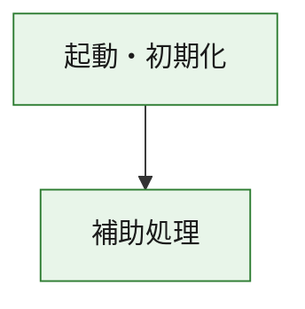
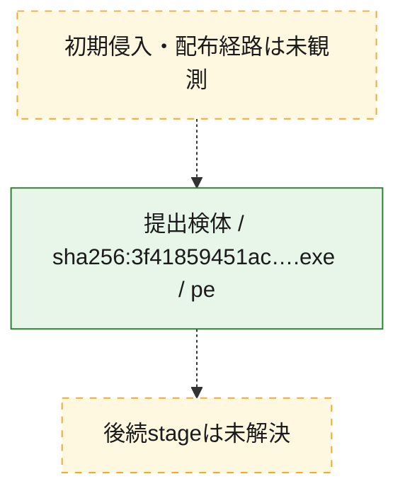
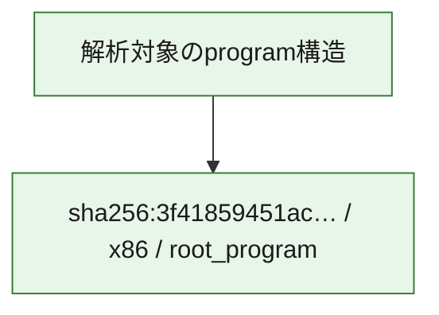

# 全体ロジック：3f41859451acb64cb101290e361714bc8e2ed6bc937a977c79473a6b59094756

代表関数の静的証跡から、起動・初期化の処理群を確認しました。

## 読み方

- phaseの掲載順は解析上の整理順です。observed_call_edgesがない段階間の実行順を断定しません。
- 図の実線は静的に観測した関係、点線と黄色のノードは未観測・未解決の関係を示します。
- 図は静的な要約であり、動的実行を再現するものではありません。
- 詳細な関数解説とfingerprintは[STATIC-LOGIC.md](STATIC-LOGIC.md)を参照してください。

## 静的可視化

### 実行フロー

### 感染チェーン

### モジュール関係

## 処理段階

### 1. 起動・初期化

entry pointから初期化と後続処理への移行を確認します。
確度: `confirmed_static_function_evidence`

- `3f41859451acb64cb101290e361714bc8e2ed6bc937a977c79473a6b59094756:ghidra:180001010` — 初期化と主要処理への分岐を行う入口関数です。 状態: `succeeded`、選定理由: `entry_point`, `meaningful_symbol_name`, `reviewed_call_centrality:22`, `role:entrypoint`, `small_program_complete_context`

### 2. 補助処理

主要処理を支える一般内部関数またはlibrary処理を確認します。
確度: `confirmed_static_function_evidence`

- `3f41859451acb64cb101290e361714bc8e2ed6bc937a977c79473a6b59094756:ghidra:180001240` — 検体内部の一般処理を実装する関数です。 状態: `succeeded`、選定理由: `context_representative`, `reviewed_call_centrality:2`, `small_program_complete_context`
- `3f41859451acb64cb101290e361714bc8e2ed6bc937a977c79473a6b59094756:ghidra:180001350` — 検体内部の一般処理を実装する関数です。 状態: `succeeded`、選定理由: `context_representative`, `reviewed_call_centrality:25`, `small_program_complete_context`
- `3f41859451acb64cb101290e361714bc8e2ed6bc937a977c79473a6b59094756:ghidra:180003780` — 検体内部の一般処理を実装する関数です。 状態: `succeeded`、選定理由: `context_representative`, `reviewed_call_centrality:2`, `small_program_complete_context`
- `3f41859451acb64cb101290e361714bc8e2ed6bc937a977c79473a6b59094756:ghidra:1800038e0` — 検体内部の一般処理を実装する関数です。 状態: `succeeded`、選定理由: `context_representative`, `reviewed_call_centrality:2`, `small_program_complete_context`

## 観測したcall関係

- `3f41859451acb64cb101290e361714bc8e2ed6bc937a977c79473a6b59094756:ghidra:180001010` → `3f41859451acb64cb101290e361714bc8e2ed6bc937a977c79473a6b59094756:ghidra:180001240` （`startup` → `support`）
- `3f41859451acb64cb101290e361714bc8e2ed6bc937a977c79473a6b59094756:ghidra:180001010` → `3f41859451acb64cb101290e361714bc8e2ed6bc937a977c79473a6b59094756:ghidra:180001350` （`startup` → `support`）
- `3f41859451acb64cb101290e361714bc8e2ed6bc937a977c79473a6b59094756:ghidra:180001350` → `3f41859451acb64cb101290e361714bc8e2ed6bc937a977c79473a6b59094756:ghidra:180001240` （`support` → `support`）
- `3f41859451acb64cb101290e361714bc8e2ed6bc937a977c79473a6b59094756:ghidra:180001350` → `3f41859451acb64cb101290e361714bc8e2ed6bc937a977c79473a6b59094756:ghidra:180003780` （`support` → `support`）
- `3f41859451acb64cb101290e361714bc8e2ed6bc937a977c79473a6b59094756:ghidra:180001350` → `3f41859451acb64cb101290e361714bc8e2ed6bc937a977c79473a6b59094756:ghidra:1800038e0` （`support` → `support`）
- `3f41859451acb64cb101290e361714bc8e2ed6bc937a977c79473a6b59094756:ghidra:180003780` → `3f41859451acb64cb101290e361714bc8e2ed6bc937a977c79473a6b59094756:ghidra:1800038e0` （`support` → `support`）
- `ghidra-function:6fc0f0021055f15270592399` → `ghidra-function:55920a362c26a85736c674b5` （`unclassified` → `unclassified`）
- `ghidra-function:a0a4d113c1bc6ad081a8c9d8` → `ghidra-function:018abee095dc36a7331d3294` （`unclassified` → `unclassified`）
- `ghidra-function:a0a4d113c1bc6ad081a8c9d8` → `ghidra-function:03b3c936ec21867efc611425` （`unclassified` → `unclassified`）
- `ghidra-function:a0a4d113c1bc6ad081a8c9d8` → `ghidra-function:0facb0baa8f7ef3a922678e8` （`unclassified` → `unclassified`）
- `ghidra-function:a0a4d113c1bc6ad081a8c9d8` → `ghidra-function:5db761f7d1a287ea34c2e9f1` （`unclassified` → `unclassified`）
- `ghidra-function:a0a4d113c1bc6ad081a8c9d8` → `ghidra-function:5ee34afda7143220a06356c0` （`unclassified` → `unclassified`）
- `ghidra-function:a0a4d113c1bc6ad081a8c9d8` → `ghidra-function:6472dbf3a683193bb8eaa13b` （`unclassified` → `unclassified`）
- `ghidra-function:a0a4d113c1bc6ad081a8c9d8` → `ghidra-function:8525b049505f6e0b1d1c9000` （`unclassified` → `unclassified`）
- `ghidra-function:a0a4d113c1bc6ad081a8c9d8` → `ghidra-function:8fa0a82c0af2132331af99e6` （`unclassified` → `unclassified`）
- `ghidra-function:a0a4d113c1bc6ad081a8c9d8` → `ghidra-function:b482621bfbbecbbd8e58b014` （`unclassified` → `unclassified`）
- `ghidra-function:a0a4d113c1bc6ad081a8c9d8` → `ghidra-function:e918a6aa025cc47d72f4bc9f` （`unclassified` → `unclassified`）
- `ghidra-function:a0a4d113c1bc6ad081a8c9d8` → `ghidra-function:ea3f612807c370bab48c1b64` （`unclassified` → `unclassified`）
- `ghidra-function:a0a4d113c1bc6ad081a8c9d8` → `ghidra-function:ee1d769a90d805acc99ecd94` （`unclassified` → `unclassified`）
- `ghidra-function:e918a6aa025cc47d72f4bc9f` → `ghidra-external:1aa6c498e485dea3504a0c7c` （`unclassified` → `unclassified`）
- `ghidra-function:e918a6aa025cc47d72f4bc9f` → `ghidra-external:1c75ecd321f3c9db7dc4a4ff` （`unclassified` → `unclassified`）
- `ghidra-function:e918a6aa025cc47d72f4bc9f` → `ghidra-external:2af3bee7389e11e8413729c3` （`unclassified` → `unclassified`）
- `ghidra-function:e918a6aa025cc47d72f4bc9f` → `ghidra-external:3a80bf71ddcab9d05dc7d2bf` （`unclassified` → `unclassified`）
- `ghidra-function:e918a6aa025cc47d72f4bc9f` → `ghidra-external:44db038582d87c1e84a96aa4` （`unclassified` → `unclassified`）
- `ghidra-function:e918a6aa025cc47d72f4bc9f` → `ghidra-external:5a4ad2e6a81688a4e8f035c2` （`unclassified` → `unclassified`）
- `ghidra-function:e918a6aa025cc47d72f4bc9f` → `ghidra-external:5bf6129ea397bf2d512ba3e1` （`unclassified` → `unclassified`）
- `ghidra-function:e918a6aa025cc47d72f4bc9f` → `ghidra-external:5c9c0a426cc780fe24e125cc` （`unclassified` → `unclassified`）
- `ghidra-function:e918a6aa025cc47d72f4bc9f` → `ghidra-external:709151defbd274ac8df9b5de` （`unclassified` → `unclassified`）
- `ghidra-function:e918a6aa025cc47d72f4bc9f` → `ghidra-external:70fbf14c2d82a5be2d685831` （`unclassified` → `unclassified`）
- `ghidra-function:e918a6aa025cc47d72f4bc9f` → `ghidra-external:759f0aa10926c176b4d9df08` （`unclassified` → `unclassified`）
- `ghidra-function:e918a6aa025cc47d72f4bc9f` → `ghidra-external:78d95d1519a000934e5a3fa7` （`unclassified` → `unclassified`）
- `ghidra-function:e918a6aa025cc47d72f4bc9f` → `ghidra-external:7b7024844ef48eb0e994d7b5` （`unclassified` → `unclassified`）
- `ghidra-function:e918a6aa025cc47d72f4bc9f` → `ghidra-external:8744317be60f9aa38fd4107d` （`unclassified` → `unclassified`）
- `ghidra-function:e918a6aa025cc47d72f4bc9f` → `ghidra-external:9a9476b6fa2f5b5f590460e3` （`unclassified` → `unclassified`）
- `ghidra-function:e918a6aa025cc47d72f4bc9f` → `ghidra-external:a10a825b15869f0e8b5e8125` （`unclassified` → `unclassified`）
- `ghidra-function:e918a6aa025cc47d72f4bc9f` → `ghidra-external:a5d2cbaaa0d498e07bdf227f` （`unclassified` → `unclassified`）
- `ghidra-function:e918a6aa025cc47d72f4bc9f` → `ghidra-external:b37297827f8df245be632883` （`unclassified` → `unclassified`）
- `ghidra-function:e918a6aa025cc47d72f4bc9f` → `ghidra-external:bf2bc5d65ef2eddf279468ba` （`unclassified` → `unclassified`）
- `ghidra-function:e918a6aa025cc47d72f4bc9f` → `ghidra-external:dbd0ec2ffe7e6779d84652b4` （`unclassified` → `unclassified`）
- `ghidra-function:e918a6aa025cc47d72f4bc9f` → `ghidra-external:dbf077ab281a8481c828f3db` （`unclassified` → `unclassified`）
- `ghidra-function:e918a6aa025cc47d72f4bc9f` → `ghidra-function:55920a362c26a85736c674b5` （`unclassified` → `unclassified`）
- `ghidra-function:e918a6aa025cc47d72f4bc9f` → `ghidra-function:6fc0f0021055f15270592399` （`unclassified` → `unclassified`）
- `ghidra-function:e918a6aa025cc47d72f4bc9f` → `ghidra-function:8525b049505f6e0b1d1c9000` （`unclassified` → `unclassified`）

## 解析範囲と制約

- 選定外関数は全体inventoryへ残しますが、関数本体の個別解説対象にはしていません。
- indirect call、難読化、packer、VM、壊れたcontrol flowによりcall関係が欠落する場合があります。
- 文書は静的解析に基づき、検体実行や外部通信による動的確認は行っていません。
