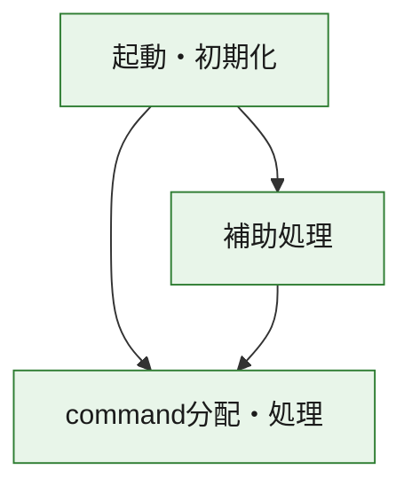
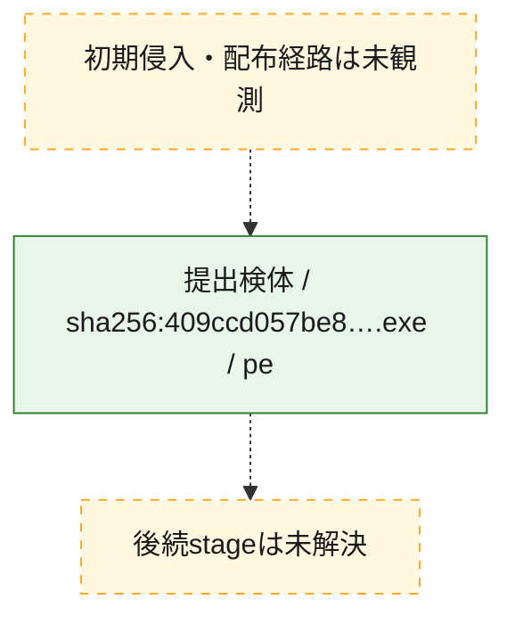
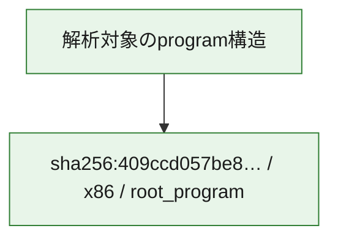

# 全体ロジック：409ccd057be807603e155a2a8579dfd9c7b67c0984db27b5e259fe438ef3fa8c

代表関数の静的証跡から、起動・初期化、command分配・処理の処理群を確認しました。

## 読み方

- phaseの掲載順は解析上の整理順です。observed_call_edgesがない段階間の実行順を断定しません。
- 図の実線は静的に観測した関係、点線と黄色のノードは未観測・未解決の関係を示します。
- 図は静的な要約であり、動的実行を再現するものではありません。
- 詳細な関数解説とfingerprintは[STATIC-LOGIC.md](STATIC-LOGIC.md)を参照してください。

## 静的可視化

### 実行フロー

### 感染チェーン

### モジュール関係

## 処理段階

### 1. 起動・初期化

entry pointから初期化と後続処理への移行を確認します。
確度: `confirmed_static_function_evidence`

- `409ccd057be807603e155a2a8579dfd9c7b67c0984db27b5e259fe438ef3fa8c:ghidra:14000c1f0` — 初期化と主要処理への分岐を行う入口関数です。 状態: `succeeded`、選定理由: `entry_point`, `meaningful_symbol_name`, `reviewed_call_centrality:22`, `role:entrypoint`

### 2. command分配・処理

受信commandやtaskの解釈、分配、個別handlerへの移行を確認します。
確度: `confirmed_static_function_evidence_with_limits`

- `409ccd057be807603e155a2a8579dfd9c7b67c0984db27b5e259fe438ef3fa8c:ghidra:14002a6a0` — commandの解釈、分配、または個別処理を担当する関数です。 状態: `limited_bad_instruction_or_flow`、選定理由: `meaningful_symbol_name`, `reviewed_call_centrality:4`, `role:command_dispatch_or_handler`

### 3. 補助処理

主要処理を支える一般内部関数またはlibrary処理を確認します。
確度: `confirmed_static_function_evidence`

- `409ccd057be807603e155a2a8579dfd9c7b67c0984db27b5e259fe438ef3fa8c:ghidra:140001000` — 検体内部の一般処理を実装する関数です。 状態: `succeeded`、選定理由: `context_representative`, `reviewed_call_centrality:39`
- `409ccd057be807603e155a2a8579dfd9c7b67c0984db27b5e259fe438ef3fa8c:ghidra:140001050` — 検体内部の一般処理を実装する関数です。 状態: `succeeded`、選定理由: `context_representative`, `reviewed_call_centrality:14`
- `409ccd057be807603e155a2a8579dfd9c7b67c0984db27b5e259fe438ef3fa8c:ghidra:1400012b0` — 検体内部の一般処理を実装する関数です。 状態: `succeeded`、選定理由: `context_representative`, `reviewed_call_centrality:15`
- `409ccd057be807603e155a2a8579dfd9c7b67c0984db27b5e259fe438ef3fa8c:ghidra:1400014f0` — 検体内部の一般処理を実装する関数です。 状態: `succeeded`、選定理由: `context_representative`, `reviewed_call_centrality:4`
- `409ccd057be807603e155a2a8579dfd9c7b67c0984db27b5e259fe438ef3fa8c:ghidra:1400015a0` — 検体内部の一般処理を実装する関数です。 状態: `succeeded`、選定理由: `context_representative`, `reviewed_call_centrality:11`
- `409ccd057be807603e155a2a8579dfd9c7b67c0984db27b5e259fe438ef3fa8c:ghidra:140001710` — 検体内部の一般処理を実装する関数です。 状態: `succeeded`、選定理由: `context_representative`, `reviewed_call_centrality:14`
- `409ccd057be807603e155a2a8579dfd9c7b67c0984db27b5e259fe438ef3fa8c:ghidra:140001950` — 検体内部の一般処理を実装する関数です。 状態: `succeeded`、選定理由: `context_representative`, `reviewed_call_centrality:1`
- `409ccd057be807603e155a2a8579dfd9c7b67c0984db27b5e259fe438ef3fa8c:ghidra:140001a00` — 検体内部の一般処理を実装する関数です。 状態: `succeeded`、選定理由: `context_representative`, `reviewed_call_centrality:4`
- `409ccd057be807603e155a2a8579dfd9c7b67c0984db27b5e259fe438ef3fa8c:ghidra:140001aa0` — 検体内部の一般処理を実装する関数です。 状態: `succeeded`、選定理由: `context_representative`, `reviewed_call_centrality:12`
- `409ccd057be807603e155a2a8579dfd9c7b67c0984db27b5e259fe438ef3fa8c:ghidra:140001cb0` — 検体内部の一般処理を実装する関数です。 状態: `succeeded`、選定理由: `context_representative`, `reviewed_call_centrality:8`
- `409ccd057be807603e155a2a8579dfd9c7b67c0984db27b5e259fe438ef3fa8c:ghidra:140001e80` — 検体内部の一般処理を実装する関数です。 状態: `succeeded`、選定理由: `context_representative`, `reviewed_call_centrality:4`
- `409ccd057be807603e155a2a8579dfd9c7b67c0984db27b5e259fe438ef3fa8c:ghidra:140001eb0` — 検体内部の一般処理を実装する関数です。 状態: `succeeded`、選定理由: `context_representative`, `reviewed_call_centrality:4`
- `409ccd057be807603e155a2a8579dfd9c7b67c0984db27b5e259fe438ef3fa8c:ghidra:140001ef0` — 検体内部の一般処理を実装する関数です。 状態: `succeeded`、選定理由: `context_representative`, `reviewed_call_centrality:10`
- `409ccd057be807603e155a2a8579dfd9c7b67c0984db27b5e259fe438ef3fa8c:ghidra:140001f50` — 検体内部の一般処理を実装する関数です。 状態: `succeeded`、選定理由: `context_representative`, `reviewed_call_centrality:22`
- `409ccd057be807603e155a2a8579dfd9c7b67c0984db27b5e259fe438ef3fa8c:ghidra:140002330` — 検体内部の一般処理を実装する関数です。 状態: `succeeded`、選定理由: `context_representative`, `reviewed_call_centrality:10`
- `409ccd057be807603e155a2a8579dfd9c7b67c0984db27b5e259fe438ef3fa8c:ghidra:1400023f0` — 検体内部の一般処理を実装する関数です。 状態: `succeeded`、選定理由: `context_representative`, `reviewed_call_centrality:13`
- `409ccd057be807603e155a2a8579dfd9c7b67c0984db27b5e259fe438ef3fa8c:ghidra:140002600` — 検体内部の一般処理を実装する関数です。 状態: `succeeded`、選定理由: `context_representative`, `reviewed_call_centrality:15`
- `409ccd057be807603e155a2a8579dfd9c7b67c0984db27b5e259fe438ef3fa8c:ghidra:140002770` — 検体内部の一般処理を実装する関数です。 状態: `succeeded`、選定理由: `context_representative`, `reviewed_call_centrality:5`
- `409ccd057be807603e155a2a8579dfd9c7b67c0984db27b5e259fe438ef3fa8c:ghidra:140002830` — 検体内部の一般処理を実装する関数です。 状態: `succeeded`、選定理由: `context_representative`, `reviewed_call_centrality:4`
- `409ccd057be807603e155a2a8579dfd9c7b67c0984db27b5e259fe438ef3fa8c:ghidra:140002890` — 検体内部の一般処理を実装する関数です。 状態: `succeeded`、選定理由: `context_representative`, `reviewed_call_centrality:19`
- `409ccd057be807603e155a2a8579dfd9c7b67c0984db27b5e259fe438ef3fa8c:ghidra:1400029e0` — 検体内部の一般処理を実装する関数です。 状態: `succeeded`、選定理由: `context_representative`, `reviewed_call_centrality:14`
- `409ccd057be807603e155a2a8579dfd9c7b67c0984db27b5e259fe438ef3fa8c:ghidra:140002b30` — 検体内部の一般処理を実装する関数です。 状態: `succeeded`、選定理由: `context_representative`, `reviewed_call_centrality:20`
- `409ccd057be807603e155a2a8579dfd9c7b67c0984db27b5e259fe438ef3fa8c:ghidra:140002c50` — 検体内部の一般処理を実装する関数です。 状態: `succeeded`、選定理由: `context_representative`, `reviewed_call_centrality:10`
- `409ccd057be807603e155a2a8579dfd9c7b67c0984db27b5e259fe438ef3fa8c:ghidra:140002d70` — 検体内部の一般処理を実装する関数です。 状態: `succeeded`、選定理由: `context_representative`, `reviewed_call_centrality:16`
- `409ccd057be807603e155a2a8579dfd9c7b67c0984db27b5e259fe438ef3fa8c:ghidra:1400031b0` — 検体内部の一般処理を実装する関数です。 状態: `succeeded`、選定理由: `context_representative`, `reviewed_call_centrality:5`
- `409ccd057be807603e155a2a8579dfd9c7b67c0984db27b5e259fe438ef3fa8c:ghidra:140003250` — 検体内部の一般処理を実装する関数です。 状態: `succeeded`、選定理由: `context_representative`, `reviewed_call_centrality:4`
- `409ccd057be807603e155a2a8579dfd9c7b67c0984db27b5e259fe438ef3fa8c:ghidra:140003460` — 検体内部の一般処理を実装する関数です。 状態: `succeeded`、選定理由: `context_representative`, `reviewed_call_centrality:17`
- `409ccd057be807603e155a2a8579dfd9c7b67c0984db27b5e259fe438ef3fa8c:ghidra:1400034c0` — 検体内部の一般処理を実装する関数です。 状態: `succeeded`、選定理由: `context_representative`, `reviewed_call_centrality:7`
- `409ccd057be807603e155a2a8579dfd9c7b67c0984db27b5e259fe438ef3fa8c:ghidra:140003620` — 検体内部の一般処理を実装する関数です。 状態: `succeeded`、選定理由: `meaningful_symbol_name`, `reviewed_call_centrality:1`
- `409ccd057be807603e155a2a8579dfd9c7b67c0984db27b5e259fe438ef3fa8c:ghidra:140003630` — 検体内部の一般処理を実装する関数です。 状態: `succeeded`、選定理由: `context_representative`, `reviewed_call_centrality:12`

## 観測したcall関係

- `409ccd057be807603e155a2a8579dfd9c7b67c0984db27b5e259fe438ef3fa8c:ghidra:140001000` → `409ccd057be807603e155a2a8579dfd9c7b67c0984db27b5e259fe438ef3fa8c:ghidra:1400014f0` （`support` → `support`）
- `409ccd057be807603e155a2a8579dfd9c7b67c0984db27b5e259fe438ef3fa8c:ghidra:140001000` → `409ccd057be807603e155a2a8579dfd9c7b67c0984db27b5e259fe438ef3fa8c:ghidra:140001cb0` （`support` → `support`）
- `409ccd057be807603e155a2a8579dfd9c7b67c0984db27b5e259fe438ef3fa8c:ghidra:140001000` → `409ccd057be807603e155a2a8579dfd9c7b67c0984db27b5e259fe438ef3fa8c:ghidra:140001e80` （`support` → `support`）
- `409ccd057be807603e155a2a8579dfd9c7b67c0984db27b5e259fe438ef3fa8c:ghidra:140001000` → `409ccd057be807603e155a2a8579dfd9c7b67c0984db27b5e259fe438ef3fa8c:ghidra:140001eb0` （`support` → `support`）
- `409ccd057be807603e155a2a8579dfd9c7b67c0984db27b5e259fe438ef3fa8c:ghidra:140001000` → `409ccd057be807603e155a2a8579dfd9c7b67c0984db27b5e259fe438ef3fa8c:ghidra:140001ef0` （`support` → `support`）
- `409ccd057be807603e155a2a8579dfd9c7b67c0984db27b5e259fe438ef3fa8c:ghidra:140001000` → `409ccd057be807603e155a2a8579dfd9c7b67c0984db27b5e259fe438ef3fa8c:ghidra:140002b30` （`support` → `support`）
- `409ccd057be807603e155a2a8579dfd9c7b67c0984db27b5e259fe438ef3fa8c:ghidra:140001000` → `409ccd057be807603e155a2a8579dfd9c7b67c0984db27b5e259fe438ef3fa8c:ghidra:140003460` （`support` → `support`）
- `409ccd057be807603e155a2a8579dfd9c7b67c0984db27b5e259fe438ef3fa8c:ghidra:140001000` → `409ccd057be807603e155a2a8579dfd9c7b67c0984db27b5e259fe438ef3fa8c:ghidra:1400034c0` （`support` → `support`）
- `409ccd057be807603e155a2a8579dfd9c7b67c0984db27b5e259fe438ef3fa8c:ghidra:140001000` → `409ccd057be807603e155a2a8579dfd9c7b67c0984db27b5e259fe438ef3fa8c:ghidra:140003620` （`support` → `support`）
- `409ccd057be807603e155a2a8579dfd9c7b67c0984db27b5e259fe438ef3fa8c:ghidra:140001050` → `409ccd057be807603e155a2a8579dfd9c7b67c0984db27b5e259fe438ef3fa8c:ghidra:140002890` （`support` → `support`）
- `409ccd057be807603e155a2a8579dfd9c7b67c0984db27b5e259fe438ef3fa8c:ghidra:140001050` → `409ccd057be807603e155a2a8579dfd9c7b67c0984db27b5e259fe438ef3fa8c:ghidra:140002b30` （`support` → `support`）
- `409ccd057be807603e155a2a8579dfd9c7b67c0984db27b5e259fe438ef3fa8c:ghidra:1400012b0` → `409ccd057be807603e155a2a8579dfd9c7b67c0984db27b5e259fe438ef3fa8c:ghidra:140001050` （`support` → `support`）
- `409ccd057be807603e155a2a8579dfd9c7b67c0984db27b5e259fe438ef3fa8c:ghidra:1400012b0` → `409ccd057be807603e155a2a8579dfd9c7b67c0984db27b5e259fe438ef3fa8c:ghidra:140001ef0` （`support` → `support`）
- `409ccd057be807603e155a2a8579dfd9c7b67c0984db27b5e259fe438ef3fa8c:ghidra:1400012b0` → `409ccd057be807603e155a2a8579dfd9c7b67c0984db27b5e259fe438ef3fa8c:ghidra:140002890` （`support` → `support`）
- `409ccd057be807603e155a2a8579dfd9c7b67c0984db27b5e259fe438ef3fa8c:ghidra:1400012b0` → `409ccd057be807603e155a2a8579dfd9c7b67c0984db27b5e259fe438ef3fa8c:ghidra:140002b30` （`support` → `support`）
- `409ccd057be807603e155a2a8579dfd9c7b67c0984db27b5e259fe438ef3fa8c:ghidra:1400014f0` → `409ccd057be807603e155a2a8579dfd9c7b67c0984db27b5e259fe438ef3fa8c:ghidra:140002b30` （`support` → `support`）
- `409ccd057be807603e155a2a8579dfd9c7b67c0984db27b5e259fe438ef3fa8c:ghidra:1400015a0` → `409ccd057be807603e155a2a8579dfd9c7b67c0984db27b5e259fe438ef3fa8c:ghidra:140001050` （`support` → `support`）
- `409ccd057be807603e155a2a8579dfd9c7b67c0984db27b5e259fe438ef3fa8c:ghidra:1400015a0` → `409ccd057be807603e155a2a8579dfd9c7b67c0984db27b5e259fe438ef3fa8c:ghidra:140002890` （`support` → `support`）
- `409ccd057be807603e155a2a8579dfd9c7b67c0984db27b5e259fe438ef3fa8c:ghidra:1400015a0` → `409ccd057be807603e155a2a8579dfd9c7b67c0984db27b5e259fe438ef3fa8c:ghidra:140002b30` （`support` → `support`）
- `409ccd057be807603e155a2a8579dfd9c7b67c0984db27b5e259fe438ef3fa8c:ghidra:140001710` → `409ccd057be807603e155a2a8579dfd9c7b67c0984db27b5e259fe438ef3fa8c:ghidra:140001050` （`support` → `support`）
- `409ccd057be807603e155a2a8579dfd9c7b67c0984db27b5e259fe438ef3fa8c:ghidra:140001710` → `409ccd057be807603e155a2a8579dfd9c7b67c0984db27b5e259fe438ef3fa8c:ghidra:1400012b0` （`support` → `support`）
- `409ccd057be807603e155a2a8579dfd9c7b67c0984db27b5e259fe438ef3fa8c:ghidra:140001710` → `409ccd057be807603e155a2a8579dfd9c7b67c0984db27b5e259fe438ef3fa8c:ghidra:140002890` （`support` → `support`）
- `409ccd057be807603e155a2a8579dfd9c7b67c0984db27b5e259fe438ef3fa8c:ghidra:140001710` → `409ccd057be807603e155a2a8579dfd9c7b67c0984db27b5e259fe438ef3fa8c:ghidra:140002b30` （`support` → `support`）
- `409ccd057be807603e155a2a8579dfd9c7b67c0984db27b5e259fe438ef3fa8c:ghidra:140001aa0` → `409ccd057be807603e155a2a8579dfd9c7b67c0984db27b5e259fe438ef3fa8c:ghidra:140002890` （`support` → `support`）
- `409ccd057be807603e155a2a8579dfd9c7b67c0984db27b5e259fe438ef3fa8c:ghidra:140001aa0` → `409ccd057be807603e155a2a8579dfd9c7b67c0984db27b5e259fe438ef3fa8c:ghidra:140002b30` （`support` → `support`）
- `409ccd057be807603e155a2a8579dfd9c7b67c0984db27b5e259fe438ef3fa8c:ghidra:140001cb0` → `409ccd057be807603e155a2a8579dfd9c7b67c0984db27b5e259fe438ef3fa8c:ghidra:140001aa0` （`support` → `support`）
- `409ccd057be807603e155a2a8579dfd9c7b67c0984db27b5e259fe438ef3fa8c:ghidra:140001cb0` → `409ccd057be807603e155a2a8579dfd9c7b67c0984db27b5e259fe438ef3fa8c:ghidra:140001ef0` （`support` → `support`）
- `409ccd057be807603e155a2a8579dfd9c7b67c0984db27b5e259fe438ef3fa8c:ghidra:140001eb0` → `409ccd057be807603e155a2a8579dfd9c7b67c0984db27b5e259fe438ef3fa8c:ghidra:140002890` （`support` → `support`）
- `409ccd057be807603e155a2a8579dfd9c7b67c0984db27b5e259fe438ef3fa8c:ghidra:140001f50` → `409ccd057be807603e155a2a8579dfd9c7b67c0984db27b5e259fe438ef3fa8c:ghidra:1400023f0` （`support` → `support`）
- `409ccd057be807603e155a2a8579dfd9c7b67c0984db27b5e259fe438ef3fa8c:ghidra:140001f50` → `409ccd057be807603e155a2a8579dfd9c7b67c0984db27b5e259fe438ef3fa8c:ghidra:140002830` （`support` → `support`）
- `409ccd057be807603e155a2a8579dfd9c7b67c0984db27b5e259fe438ef3fa8c:ghidra:140002330` → `409ccd057be807603e155a2a8579dfd9c7b67c0984db27b5e259fe438ef3fa8c:ghidra:140001f50` （`support` → `support`）
- `409ccd057be807603e155a2a8579dfd9c7b67c0984db27b5e259fe438ef3fa8c:ghidra:140002330` → `409ccd057be807603e155a2a8579dfd9c7b67c0984db27b5e259fe438ef3fa8c:ghidra:1400023f0` （`support` → `support`）
- `409ccd057be807603e155a2a8579dfd9c7b67c0984db27b5e259fe438ef3fa8c:ghidra:140002600` → `409ccd057be807603e155a2a8579dfd9c7b67c0984db27b5e259fe438ef3fa8c:ghidra:140002830` （`support` → `support`）
- `409ccd057be807603e155a2a8579dfd9c7b67c0984db27b5e259fe438ef3fa8c:ghidra:140002770` → `409ccd057be807603e155a2a8579dfd9c7b67c0984db27b5e259fe438ef3fa8c:ghidra:140002600` （`support` → `support`）
- `409ccd057be807603e155a2a8579dfd9c7b67c0984db27b5e259fe438ef3fa8c:ghidra:140002890` → `409ccd057be807603e155a2a8579dfd9c7b67c0984db27b5e259fe438ef3fa8c:ghidra:140001ef0` （`support` → `support`）
- `409ccd057be807603e155a2a8579dfd9c7b67c0984db27b5e259fe438ef3fa8c:ghidra:1400029e0` → `409ccd057be807603e155a2a8579dfd9c7b67c0984db27b5e259fe438ef3fa8c:ghidra:140001ef0` （`support` → `support`）
- `409ccd057be807603e155a2a8579dfd9c7b67c0984db27b5e259fe438ef3fa8c:ghidra:140002d70` → `409ccd057be807603e155a2a8579dfd9c7b67c0984db27b5e259fe438ef3fa8c:ghidra:140001710` （`support` → `support`）
- `409ccd057be807603e155a2a8579dfd9c7b67c0984db27b5e259fe438ef3fa8c:ghidra:140002d70` → `409ccd057be807603e155a2a8579dfd9c7b67c0984db27b5e259fe438ef3fa8c:ghidra:140001a00` （`support` → `support`）
- `409ccd057be807603e155a2a8579dfd9c7b67c0984db27b5e259fe438ef3fa8c:ghidra:140002d70` → `409ccd057be807603e155a2a8579dfd9c7b67c0984db27b5e259fe438ef3fa8c:ghidra:140001aa0` （`support` → `support`）
- `409ccd057be807603e155a2a8579dfd9c7b67c0984db27b5e259fe438ef3fa8c:ghidra:140002d70` → `409ccd057be807603e155a2a8579dfd9c7b67c0984db27b5e259fe438ef3fa8c:ghidra:140001e80` （`support` → `support`）
- `409ccd057be807603e155a2a8579dfd9c7b67c0984db27b5e259fe438ef3fa8c:ghidra:140002d70` → `409ccd057be807603e155a2a8579dfd9c7b67c0984db27b5e259fe438ef3fa8c:ghidra:140001eb0` （`support` → `support`）
- `409ccd057be807603e155a2a8579dfd9c7b67c0984db27b5e259fe438ef3fa8c:ghidra:140002d70` → `409ccd057be807603e155a2a8579dfd9c7b67c0984db27b5e259fe438ef3fa8c:ghidra:140001ef0` （`support` → `support`）
- `409ccd057be807603e155a2a8579dfd9c7b67c0984db27b5e259fe438ef3fa8c:ghidra:140002d70` → `409ccd057be807603e155a2a8579dfd9c7b67c0984db27b5e259fe438ef3fa8c:ghidra:140002b30` （`support` → `support`）
- `409ccd057be807603e155a2a8579dfd9c7b67c0984db27b5e259fe438ef3fa8c:ghidra:140002d70` → `409ccd057be807603e155a2a8579dfd9c7b67c0984db27b5e259fe438ef3fa8c:ghidra:1400031b0` （`support` → `support`）
- `409ccd057be807603e155a2a8579dfd9c7b67c0984db27b5e259fe438ef3fa8c:ghidra:140003250` → `409ccd057be807603e155a2a8579dfd9c7b67c0984db27b5e259fe438ef3fa8c:ghidra:14002a6a0` （`support` → `dispatch`）
- `409ccd057be807603e155a2a8579dfd9c7b67c0984db27b5e259fe438ef3fa8c:ghidra:140003460` → `409ccd057be807603e155a2a8579dfd9c7b67c0984db27b5e259fe438ef3fa8c:ghidra:1400015a0` （`support` → `support`）
- `409ccd057be807603e155a2a8579dfd9c7b67c0984db27b5e259fe438ef3fa8c:ghidra:140003460` → `409ccd057be807603e155a2a8579dfd9c7b67c0984db27b5e259fe438ef3fa8c:ghidra:140001a00` （`support` → `support`）
- `409ccd057be807603e155a2a8579dfd9c7b67c0984db27b5e259fe438ef3fa8c:ghidra:140003460` → `409ccd057be807603e155a2a8579dfd9c7b67c0984db27b5e259fe438ef3fa8c:ghidra:140001ef0` （`support` → `support`）
- `409ccd057be807603e155a2a8579dfd9c7b67c0984db27b5e259fe438ef3fa8c:ghidra:140003460` → `409ccd057be807603e155a2a8579dfd9c7b67c0984db27b5e259fe438ef3fa8c:ghidra:140002770` （`support` → `support`）
- `409ccd057be807603e155a2a8579dfd9c7b67c0984db27b5e259fe438ef3fa8c:ghidra:140003460` → `409ccd057be807603e155a2a8579dfd9c7b67c0984db27b5e259fe438ef3fa8c:ghidra:140002b30` （`support` → `support`）
- `409ccd057be807603e155a2a8579dfd9c7b67c0984db27b5e259fe438ef3fa8c:ghidra:140003460` → `409ccd057be807603e155a2a8579dfd9c7b67c0984db27b5e259fe438ef3fa8c:ghidra:140003250` （`support` → `support`）
- `409ccd057be807603e155a2a8579dfd9c7b67c0984db27b5e259fe438ef3fa8c:ghidra:140003460` → `409ccd057be807603e155a2a8579dfd9c7b67c0984db27b5e259fe438ef3fa8c:ghidra:14002a6a0` （`support` → `dispatch`）
- `409ccd057be807603e155a2a8579dfd9c7b67c0984db27b5e259fe438ef3fa8c:ghidra:1400034c0` → `409ccd057be807603e155a2a8579dfd9c7b67c0984db27b5e259fe438ef3fa8c:ghidra:140001710` （`support` → `support`）
- `409ccd057be807603e155a2a8579dfd9c7b67c0984db27b5e259fe438ef3fa8c:ghidra:1400034c0` → `409ccd057be807603e155a2a8579dfd9c7b67c0984db27b5e259fe438ef3fa8c:ghidra:140001e80` （`support` → `support`）
- `409ccd057be807603e155a2a8579dfd9c7b67c0984db27b5e259fe438ef3fa8c:ghidra:1400034c0` → `409ccd057be807603e155a2a8579dfd9c7b67c0984db27b5e259fe438ef3fa8c:ghidra:140002d70` （`support` → `support`）
- `409ccd057be807603e155a2a8579dfd9c7b67c0984db27b5e259fe438ef3fa8c:ghidra:140003630` → `409ccd057be807603e155a2a8579dfd9c7b67c0984db27b5e259fe438ef3fa8c:ghidra:1400015a0` （`support` → `support`）
- `409ccd057be807603e155a2a8579dfd9c7b67c0984db27b5e259fe438ef3fa8c:ghidra:140003630` → `409ccd057be807603e155a2a8579dfd9c7b67c0984db27b5e259fe438ef3fa8c:ghidra:140001a00` （`support` → `support`）
- `409ccd057be807603e155a2a8579dfd9c7b67c0984db27b5e259fe438ef3fa8c:ghidra:140003630` → `409ccd057be807603e155a2a8579dfd9c7b67c0984db27b5e259fe438ef3fa8c:ghidra:140001ef0` （`support` → `support`）
- `409ccd057be807603e155a2a8579dfd9c7b67c0984db27b5e259fe438ef3fa8c:ghidra:140003630` → `409ccd057be807603e155a2a8579dfd9c7b67c0984db27b5e259fe438ef3fa8c:ghidra:140002770` （`support` → `support`）
- `409ccd057be807603e155a2a8579dfd9c7b67c0984db27b5e259fe438ef3fa8c:ghidra:140003630` → `409ccd057be807603e155a2a8579dfd9c7b67c0984db27b5e259fe438ef3fa8c:ghidra:140002b30` （`support` → `support`）
- `409ccd057be807603e155a2a8579dfd9c7b67c0984db27b5e259fe438ef3fa8c:ghidra:140003630` → `409ccd057be807603e155a2a8579dfd9c7b67c0984db27b5e259fe438ef3fa8c:ghidra:140003250` （`support` → `support`）
- `409ccd057be807603e155a2a8579dfd9c7b67c0984db27b5e259fe438ef3fa8c:ghidra:140003630` → `409ccd057be807603e155a2a8579dfd9c7b67c0984db27b5e259fe438ef3fa8c:ghidra:14002a6a0` （`support` → `dispatch`）
- `409ccd057be807603e155a2a8579dfd9c7b67c0984db27b5e259fe438ef3fa8c:ghidra:14000c1f0` → `409ccd057be807603e155a2a8579dfd9c7b67c0984db27b5e259fe438ef3fa8c:ghidra:140001000` （`startup` → `support`）
- `409ccd057be807603e155a2a8579dfd9c7b67c0984db27b5e259fe438ef3fa8c:ghidra:14000c1f0` → `409ccd057be807603e155a2a8579dfd9c7b67c0984db27b5e259fe438ef3fa8c:ghidra:14002a6a0` （`startup` → `dispatch`）
- `ghidra-function:06065be457813df1c4828042` → `ghidra-external:47b27acb4cb238847bc879cd` （`unclassified` → `unclassified`）
- `ghidra-function:06065be457813df1c4828042` → `ghidra-function:402a95eb5fd41d91e5e022c0` （`unclassified` → `unclassified`）
- `ghidra-function:06065be457813df1c4828042` → `ghidra-function:551ba29b6f8a81231e3f7e51` （`unclassified` → `unclassified`）
- `ghidra-function:06065be457813df1c4828042` → `ghidra-function:645e2423aeb9468b4e25409f` （`unclassified` → `unclassified`）
- `ghidra-function:06065be457813df1c4828042` → `ghidra-function:9841a8faae17dabd4e4eea9e` （`unclassified` → `unclassified`）
- `ghidra-function:06065be457813df1c4828042` → `ghidra-function:b1bf8ac36b01679be5427b56` （`unclassified` → `unclassified`）
- `ghidra-function:06065be457813df1c4828042` → `ghidra-function:def4419361ccccbb0f8d2a73` （`unclassified` → `unclassified`）
- `ghidra-function:06065be457813df1c4828042` → `ghidra-function:e68749f8acad6a0257a4d0e6` （`unclassified` → `unclassified`）
- `ghidra-function:0782d744144cff5c050640f5` → `ghidra-external:856a4207c18585b3d5ca17e7` （`unclassified` → `unclassified`）
- `ghidra-function:0782d744144cff5c050640f5` → `ghidra-external:f0172937e442cf3a9ec0b227` （`unclassified` → `unclassified`）
- `ghidra-function:0782d744144cff5c050640f5` → `ghidra-function:06065be457813df1c4828042` （`unclassified` → `unclassified`）
- `ghidra-function:0782d744144cff5c050640f5` → `ghidra-function:6525e77e9edc66bdfb60e77c` （`unclassified` → `unclassified`）
- `ghidra-function:0782d744144cff5c050640f5` → `ghidra-function:9e1d0206b01e5f001d71690b` （`unclassified` → `unclassified`）
- `ghidra-function:0782d744144cff5c050640f5` → `ghidra-function:bb93e5371c804475c7dbb846` （`unclassified` → `unclassified`）
- `ghidra-function:0782d744144cff5c050640f5` → `ghidra-function:cbb98861db5834b08e2fdc50` （`unclassified` → `unclassified`）
- `ghidra-function:0782d744144cff5c050640f5` → `ghidra-function:dbfc83365f5eb20ad6e72afa` （`unclassified` → `unclassified`）
- `ghidra-function:0782d744144cff5c050640f5` → `ghidra-function:f9443beaa4be46ed6b0a5842` （`unclassified` → `unclassified`）
- `ghidra-function:0846277cf234b1d2504bc03c` → `ghidra-external:856a4207c18585b3d5ca17e7` （`unclassified` → `unclassified`）
- `ghidra-function:0846277cf234b1d2504bc03c` → `ghidra-external:f0172937e442cf3a9ec0b227` （`unclassified` → `unclassified`）
- `ghidra-function:0846277cf234b1d2504bc03c` → `ghidra-function:06065be457813df1c4828042` （`unclassified` → `unclassified`）
- `ghidra-function:0846277cf234b1d2504bc03c` → `ghidra-function:3084e862c4ccc12c5a211d04` （`unclassified` → `unclassified`）
- `ghidra-function:0846277cf234b1d2504bc03c` → `ghidra-function:551ba29b6f8a81231e3f7e51` （`unclassified` → `unclassified`）
- `ghidra-function:0846277cf234b1d2504bc03c` → `ghidra-function:6525e77e9edc66bdfb60e77c` （`unclassified` → `unclassified`）
- `ghidra-function:0846277cf234b1d2504bc03c` → `ghidra-function:9841a8faae17dabd4e4eea9e` （`unclassified` → `unclassified`）
- `ghidra-function:0846277cf234b1d2504bc03c` → `ghidra-function:9e1d0206b01e5f001d71690b` （`unclassified` → `unclassified`）
- `ghidra-function:0846277cf234b1d2504bc03c` → `ghidra-function:b9d39d960ca9ce781ff75639` （`unclassified` → `unclassified`）
- `ghidra-function:0846277cf234b1d2504bc03c` → `ghidra-function:bb93e5371c804475c7dbb846` （`unclassified` → `unclassified`）
- `ghidra-function:0846277cf234b1d2504bc03c` → `ghidra-function:cbb98861db5834b08e2fdc50` （`unclassified` → `unclassified`）
- `ghidra-function:0846277cf234b1d2504bc03c` → `ghidra-function:dbfc83365f5eb20ad6e72afa` （`unclassified` → `unclassified`）
- `ghidra-function:0846277cf234b1d2504bc03c` → `ghidra-function:e2a33a9de575eaed55840ae5` （`unclassified` → `unclassified`）
- `ghidra-function:0846277cf234b1d2504bc03c` → `ghidra-function:f9443beaa4be46ed6b0a5842` （`unclassified` → `unclassified`）
- `ghidra-function:28e29f7f4d1de9f1d9e9cfc5` → `ghidra-function:9e235cdce85b14384dbcad68` （`unclassified` → `unclassified`）
- `ghidra-function:28e29f7f4d1de9f1d9e9cfc5` → `ghidra-function:c38a42ea1e1c7391fdfbd1b9` （`unclassified` → `unclassified`）
- `ghidra-function:369e2e283b25619c95c9bf8a` → `ghidra-external:1d3fd03f776ca25a493ddf62` （`unclassified` → `unclassified`）
- `ghidra-function:369e2e283b25619c95c9bf8a` → `ghidra-external:884e3a5425c8d8bab7821420` （`unclassified` → `unclassified`）
- `ghidra-function:369e2e283b25619c95c9bf8a` → `ghidra-external:8c8db558b21e0f2659153f06` （`unclassified` → `unclassified`）
- `ghidra-function:369e2e283b25619c95c9bf8a` → `ghidra-external:9488508e4c7a544df085abd7` （`unclassified` → `unclassified`）
- `ghidra-function:369e2e283b25619c95c9bf8a` → `ghidra-external:a55107fbbf0fab9935968431` （`unclassified` → `unclassified`）
- `ghidra-function:369e2e283b25619c95c9bf8a` → `ghidra-external:ada12cd917d8b879edc347f5` （`unclassified` → `unclassified`）
- `ghidra-function:369e2e283b25619c95c9bf8a` → `ghidra-external:d7d1a64fd86a831d6e505ba0` （`unclassified` → `unclassified`）
- `ghidra-function:369e2e283b25619c95c9bf8a` → `ghidra-external:e4496afc6fd0c1cd7d1faf2f` （`unclassified` → `unclassified`）
- `ghidra-function:369e2e283b25619c95c9bf8a` → `ghidra-function:09b90d1028f8815974457e41` （`unclassified` → `unclassified`）
- `ghidra-function:369e2e283b25619c95c9bf8a` → `ghidra-function:09c33678d047b19db68ef761` （`unclassified` → `unclassified`）
- `ghidra-function:369e2e283b25619c95c9bf8a` → `ghidra-function:1e3d742ad8a53c3e1867e64c` （`unclassified` → `unclassified`）
- `ghidra-function:369e2e283b25619c95c9bf8a` → `ghidra-function:65e4d56d3b8a4aa8ff88b32d` （`unclassified` → `unclassified`）
- `ghidra-function:369e2e283b25619c95c9bf8a` → `ghidra-function:721c9387c53a797ca810ad8e` （`unclassified` → `unclassified`）
- `ghidra-function:369e2e283b25619c95c9bf8a` → `ghidra-function:7e636c2d965ca9f2d397e5e4` （`unclassified` → `unclassified`）
- `ghidra-function:369e2e283b25619c95c9bf8a` → `ghidra-function:875be2dc6bb0163aa8de1e46` （`unclassified` → `unclassified`）
- `ghidra-function:369e2e283b25619c95c9bf8a` → `ghidra-function:95096089c128d5f246edcb2c` （`unclassified` → `unclassified`）
- `ghidra-function:369e2e283b25619c95c9bf8a` → `ghidra-function:9619ff3ca469effd41d4b6d5` （`unclassified` → `unclassified`）
- `ghidra-function:369e2e283b25619c95c9bf8a` → `ghidra-function:9e235cdce85b14384dbcad68` （`unclassified` → `unclassified`）
- `ghidra-function:369e2e283b25619c95c9bf8a` → `ghidra-function:aa6e2d354886d9a2ac4cb62b` （`unclassified` → `unclassified`）
- `ghidra-function:369e2e283b25619c95c9bf8a` → `ghidra-function:c454a3f52b186f25634492cd` （`unclassified` → `unclassified`）
- `ghidra-function:369e2e283b25619c95c9bf8a` → `ghidra-function:e28f5d6fce6b952a4677c8ab` （`unclassified` → `unclassified`）
- `ghidra-function:369e2e283b25619c95c9bf8a` → `ghidra-function:f8c2d2c8b46cd80b3513cf3b` （`unclassified` → `unclassified`）
- `ghidra-function:38e26e788a220def77872edf` → `ghidra-function:3d4afe086b294d71aa3cbfeb` （`unclassified` → `unclassified`）
- `ghidra-function:38e26e788a220def77872edf` → `ghidra-function:551ba29b6f8a81231e3f7e51` （`unclassified` → `unclassified`）
- `ghidra-function:38e26e788a220def77872edf` → `ghidra-function:5e1793699fbd9dcc32504708` （`unclassified` → `unclassified`）
- `ghidra-function:38e26e788a220def77872edf` → `ghidra-function:836fdd135bd62e7655ea8c8a` （`unclassified` → `unclassified`）
- `ghidra-function:38e26e788a220def77872edf` → `ghidra-function:ca6643ac09041cb05833adb5` （`unclassified` → `unclassified`）
- `ghidra-function:38e26e788a220def77872edf` → `ghidra-function:fd2bcac16fbbaa4101c6f56d` （`unclassified` → `unclassified`）
- `ghidra-function:43dbec50637f76c56a546f5f` → `ghidra-external:856a4207c18585b3d5ca17e7` （`unclassified` → `unclassified`）
- `ghidra-function:43dbec50637f76c56a546f5f` → `ghidra-external:fdda33b565f334eaa4585810` （`unclassified` → `unclassified`）
- `ghidra-function:43dbec50637f76c56a546f5f` → `ghidra-function:06065be457813df1c4828042` （`unclassified` → `unclassified`）
- `ghidra-function:43dbec50637f76c56a546f5f` → `ghidra-function:0782d744144cff5c050640f5` （`unclassified` → `unclassified`）
- `ghidra-function:43dbec50637f76c56a546f5f` → `ghidra-function:28e29f7f4d1de9f1d9e9cfc5` （`unclassified` → `unclassified`）
- `ghidra-function:43dbec50637f76c56a546f5f` → `ghidra-function:500cd6501544203dd1d86ec1` （`unclassified` → `unclassified`）
- `ghidra-function:43dbec50637f76c56a546f5f` → `ghidra-function:551ba29b6f8a81231e3f7e51` （`unclassified` → `unclassified`）
- `ghidra-function:43dbec50637f76c56a546f5f` → `ghidra-function:74a02f4664c0b6c4126bc4b9` （`unclassified` → `unclassified`）
- `ghidra-function:43dbec50637f76c56a546f5f` → `ghidra-function:9841a8faae17dabd4e4eea9e` （`unclassified` → `unclassified`）
- `ghidra-function:43dbec50637f76c56a546f5f` → `ghidra-function:9e235cdce85b14384dbcad68` （`unclassified` → `unclassified`）
- `ghidra-function:43dbec50637f76c56a546f5f` → `ghidra-function:b75d87dbf2acd9a6aed67444` （`unclassified` → `unclassified`）
- `ghidra-function:43dbec50637f76c56a546f5f` → `ghidra-function:c38a42ea1e1c7391fdfbd1b9` （`unclassified` → `unclassified`）
- `ghidra-function:43dbec50637f76c56a546f5f` → `ghidra-function:cabed009a09f4bd64c6c1c7b` （`unclassified` → `unclassified`）
- `ghidra-function:43dbec50637f76c56a546f5f` → `ghidra-function:d637ba4c6d00c4d818c9e32b` （`unclassified` → `unclassified`）
- `ghidra-function:43dbec50637f76c56a546f5f` → `ghidra-function:e2a33a9de575eaed55840ae5` （`unclassified` → `unclassified`）
- `ghidra-function:43dbec50637f76c56a546f5f` → `ghidra-function:f09d2ae04a2386ac75c5e3be` （`unclassified` → `unclassified`）
- `ghidra-function:4f778d3deeb76eec05dbe4b0` → `ghidra-external:856a4207c18585b3d5ca17e7` （`unclassified` → `unclassified`）
- `ghidra-function:500cd6501544203dd1d86ec1` → `ghidra-external:856a4207c18585b3d5ca17e7` （`unclassified` → `unclassified`）
- `ghidra-function:500cd6501544203dd1d86ec1` → `ghidra-function:6741735fb611bce911604076` （`unclassified` → `unclassified`）
- `ghidra-function:500cd6501544203dd1d86ec1` → `ghidra-function:def4419361ccccbb0f8d2a73` （`unclassified` → `unclassified`）
- `ghidra-function:5070c4c5631937d7bad17297` → `ghidra-external:15a7eb8c326c28e5246c4366` （`unclassified` → `unclassified`）
- `ghidra-function:5070c4c5631937d7bad17297` → `ghidra-function:bb93e5371c804475c7dbb846` （`unclassified` → `unclassified`）
- `ghidra-function:5a6c48d0b59f1b1fc178469f` → `ghidra-function:38e26e788a220def77872edf` （`unclassified` → `unclassified`）
- `ghidra-function:5a6c48d0b59f1b1fc178469f` → `ghidra-function:81d0eb691036c784412db17e` （`unclassified` → `unclassified`）
- `ghidra-function:5a6c48d0b59f1b1fc178469f` → `ghidra-function:a5cff9736ca09f3bbeaaff93` （`unclassified` → `unclassified`）
- `ghidra-function:5a6c48d0b59f1b1fc178469f` → `ghidra-function:bdaa910762157af1592725a2` （`unclassified` → `unclassified`）
- `ghidra-function:5a6c48d0b59f1b1fc178469f` → `ghidra-function:fb376b6644d36662f120ed26` （`unclassified` → `unclassified`）
- `ghidra-function:5a6c48d0b59f1b1fc178469f` → `ghidra-function:ffeb26956d5946cdd0fb42e7` （`unclassified` → `unclassified`）
- `ghidra-function:6741735fb611bce911604076` → `ghidra-external:856a4207c18585b3d5ca17e7` （`unclassified` → `unclassified`）
- `ghidra-function:6741735fb611bce911604076` → `ghidra-function:2593346ff7879035e5d0fc26` （`unclassified` → `unclassified`）
- `ghidra-function:6741735fb611bce911604076` → `ghidra-function:27788bcbbe06d9bf72d16bb2` （`unclassified` → `unclassified`）
- `ghidra-function:6741735fb611bce911604076` → `ghidra-function:551ba29b6f8a81231e3f7e51` （`unclassified` → `unclassified`）
- `ghidra-function:6741735fb611bce911604076` → `ghidra-function:5cb84572f1bc5f3a437614ea` （`unclassified` → `unclassified`）
- `ghidra-function:6741735fb611bce911604076` → `ghidra-function:87d08ebdc981da8ec8235373` （`unclassified` → `unclassified`）
- `ghidra-function:6741735fb611bce911604076` → `ghidra-function:9841a8faae17dabd4e4eea9e` （`unclassified` → `unclassified`）
- `ghidra-function:6741735fb611bce911604076` → `ghidra-function:b1bf8ac36b01679be5427b56` （`unclassified` → `unclassified`）
- `ghidra-function:6741735fb611bce911604076` → `ghidra-function:bc4037a852b426dc03057a54` （`unclassified` → `unclassified`）
- `ghidra-function:6741735fb611bce911604076` → `ghidra-function:c662ac6ac346439ea8e33e48` （`unclassified` → `unclassified`）
- `ghidra-function:79cfaaee1c5d80043acca3f3` → `ghidra-external:2e03cc4015b8b07d1d610ba9` （`unclassified` → `unclassified`）
- `ghidra-function:79cfaaee1c5d80043acca3f3` → `ghidra-external:fdda33b565f334eaa4585810` （`unclassified` → `unclassified`）
- `ghidra-function:79cfaaee1c5d80043acca3f3` → `ghidra-function:06065be457813df1c4828042` （`unclassified` → `unclassified`）
- `ghidra-function:79cfaaee1c5d80043acca3f3` → `ghidra-function:4f778d3deeb76eec05dbe4b0` （`unclassified` → `unclassified`）
- `ghidra-function:79cfaaee1c5d80043acca3f3` → `ghidra-function:5070c4c5631937d7bad17297` （`unclassified` → `unclassified`）
- `ghidra-function:79cfaaee1c5d80043acca3f3` → `ghidra-function:551ba29b6f8a81231e3f7e51` （`unclassified` → `unclassified`）
- `ghidra-function:79cfaaee1c5d80043acca3f3` → `ghidra-function:5855319bed6d007afdb68934` （`unclassified` → `unclassified`）
- `ghidra-function:79cfaaee1c5d80043acca3f3` → `ghidra-function:59439b9cbc26180eba727b44` （`unclassified` → `unclassified`）
- `ghidra-function:79cfaaee1c5d80043acca3f3` → `ghidra-function:805b717fd062c2386de64fc7` （`unclassified` → `unclassified`）
- `ghidra-function:79cfaaee1c5d80043acca3f3` → `ghidra-function:829cf6128702173da2664a02` （`unclassified` → `unclassified`）
- `ghidra-function:79cfaaee1c5d80043acca3f3` → `ghidra-function:9841a8faae17dabd4e4eea9e` （`unclassified` → `unclassified`）
- `ghidra-function:79cfaaee1c5d80043acca3f3` → `ghidra-function:b75d87dbf2acd9a6aed67444` （`unclassified` → `unclassified`）
- `ghidra-function:79cfaaee1c5d80043acca3f3` → `ghidra-function:c38d3b1054689de7015ceef3` （`unclassified` → `unclassified`）
- `ghidra-function:79cfaaee1c5d80043acca3f3` → `ghidra-function:e0701caba7c6fc7b3d5fc169` （`unclassified` → `unclassified`）
- `ghidra-function:79cfaaee1c5d80043acca3f3` → `ghidra-function:e2a33a9de575eaed55840ae5` （`unclassified` → `unclassified`）
- `ghidra-function:805b717fd062c2386de64fc7` → `ghidra-external:f0172937e442cf3a9ec0b227` （`unclassified` → `unclassified`）
- `ghidra-function:805b717fd062c2386de64fc7` → `ghidra-function:06065be457813df1c4828042` （`unclassified` → `unclassified`）
- `ghidra-function:805b717fd062c2386de64fc7` → `ghidra-function:551ba29b6f8a81231e3f7e51` （`unclassified` → `unclassified`）
- `ghidra-function:805b717fd062c2386de64fc7` → `ghidra-function:6525e77e9edc66bdfb60e77c` （`unclassified` → `unclassified`）
- `ghidra-function:805b717fd062c2386de64fc7` → `ghidra-function:930733949bb7bf1746681f1a` （`unclassified` → `unclassified`）
- `ghidra-function:805b717fd062c2386de64fc7` → `ghidra-function:9e1d0206b01e5f001d71690b` （`unclassified` → `unclassified`）
- `ghidra-function:805b717fd062c2386de64fc7` → `ghidra-function:bb93e5371c804475c7dbb846` （`unclassified` → `unclassified`）
- `ghidra-function:805b717fd062c2386de64fc7` → `ghidra-function:cbb98861db5834b08e2fdc50` （`unclassified` → `unclassified`）
- `ghidra-function:805b717fd062c2386de64fc7` → `ghidra-function:d6153f54d0d9769ae8834e19` （`unclassified` → `unclassified`）
- `ghidra-function:805b717fd062c2386de64fc7` → `ghidra-function:dbfc83365f5eb20ad6e72afa` （`unclassified` → `unclassified`）
- `ghidra-function:81d0eb691036c784412db17e` → `ghidra-external:7104ce5164cf0c5532332e80` （`unclassified` → `unclassified`）
- `ghidra-function:81d0eb691036c784412db17e` → `ghidra-function:231b25ac85ff190d02d6935c` （`unclassified` → `unclassified`）
- `ghidra-function:81d0eb691036c784412db17e` → `ghidra-function:310edfec2516e5aa6df4ffbe` （`unclassified` → `unclassified`）
- `ghidra-function:81d0eb691036c784412db17e` → `ghidra-function:38e26e788a220def77872edf` （`unclassified` → `unclassified`）
- `ghidra-function:81d0eb691036c784412db17e` → `ghidra-function:3b3fdf07be289752973fc306` （`unclassified` → `unclassified`）
- `ghidra-function:81d0eb691036c784412db17e` → `ghidra-function:551ba29b6f8a81231e3f7e51` （`unclassified` → `unclassified`）
- `ghidra-function:81d0eb691036c784412db17e` → `ghidra-function:601e9aacc4b633167d7cdb5b` （`unclassified` → `unclassified`）
- `ghidra-function:81d0eb691036c784412db17e` → `ghidra-function:748ed28838eb51685636c1a0` （`unclassified` → `unclassified`）
- `ghidra-function:81d0eb691036c784412db17e` → `ghidra-function:87d08ebdc981da8ec8235373` （`unclassified` → `unclassified`）
- `ghidra-function:81d0eb691036c784412db17e` → `ghidra-function:b1bf8ac36b01679be5427b56` （`unclassified` → `unclassified`）
- `ghidra-function:81d0eb691036c784412db17e` → `ghidra-function:e8dbf54cee819c121bbe32bb` （`unclassified` → `unclassified`）
- `ghidra-function:81d0eb691036c784412db17e` → `ghidra-function:f824bf27614d17803df255e8` （`unclassified` → `unclassified`）
- 残り129件は`static-logic.json`に記録しています。

## 解析範囲と制約

- 選定外関数は全体inventoryへ残しますが、関数本体の個別解説対象にはしていません。
- indirect call、難読化、packer、VM、壊れたcontrol flowによりcall関係が欠落する場合があります。
- 文書は静的解析に基づき、検体実行や外部通信による動的確認は行っていません。
