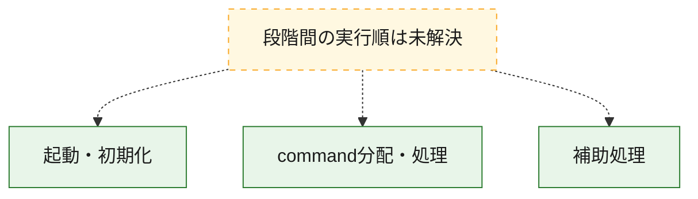
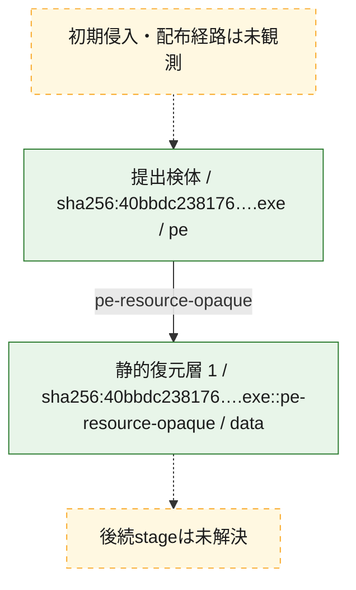
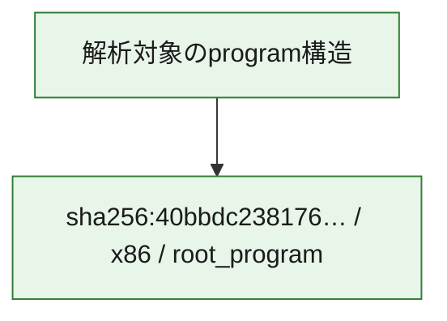

# 全体ロジック：40bbdc238176be8fb2fc89145aed45b7d0c0150191d1101a40df85070b0c4398

代表関数の静的証跡から、起動・初期化、command分配・処理の処理群を確認しました。

## 読み方

- phaseの掲載順は解析上の整理順です。observed_call_edgesがない段階間の実行順を断定しません。
- 図の実線は静的に観測した関係、点線と黄色のノードは未観測・未解決の関係を示します。
- 図は静的な要約であり、動的実行を再現するものではありません。
- 詳細な関数解説とfingerprintは[STATIC-LOGIC.md](STATIC-LOGIC.md)を参照してください。

## 静的可視化

### 実行フロー

### 感染チェーン

### モジュール関係

## 処理段階

### 1. 起動・初期化

entry pointから初期化と後続処理への移行を確認します。
確度: `confirmed_static_function_evidence`

- `40bbdc238176be8fb2fc89145aed45b7d0c0150191d1101a40df85070b0c4398:ghidra:18016d074` — 初期化と主要処理への分岐を行う入口関数です。 状態: `succeeded`、選定理由: `entry_point`, `meaningful_symbol_name`, `reviewed_call_centrality:5`, `role:entrypoint`

### 2. command分配・処理

受信commandやtaskの解釈、分配、個別handlerへの移行を確認します。
確度: `confirmed_static_function_evidence_with_limits`

- `40bbdc238176be8fb2fc89145aed45b7d0c0150191d1101a40df85070b0c4398:ghidra:18016d990` — commandの解釈、分配、または個別処理を担当する関数です。 状態: `limited_bad_instruction_or_flow`、選定理由: `meaningful_symbol_name`, `role:command_dispatch_or_handler`

### 3. 補助処理

主要処理を支える一般内部関数またはlibrary処理を確認します。
確度: `confirmed_static_function_evidence_with_limits`

- `40bbdc238176be8fb2fc89145aed45b7d0c0150191d1101a40df85070b0c4398:ghidra:180001020` — 検体内部の一般処理を実装する関数です。 状態: `succeeded`、選定理由: `context_representative`, `reviewed_call_centrality:3`
- `40bbdc238176be8fb2fc89145aed45b7d0c0150191d1101a40df85070b0c4398:ghidra:1800010a0` — 検体内部の一般処理を実装する関数です。 状態: `succeeded`、選定理由: `context_representative`, `reviewed_call_centrality:1`
- `40bbdc238176be8fb2fc89145aed45b7d0c0150191d1101a40df85070b0c4398:ghidra:180001130` — 検体内部の一般処理を実装する関数です。 状態: `succeeded`、選定理由: `context_representative`, `reviewed_call_centrality:1`
- `40bbdc238176be8fb2fc89145aed45b7d0c0150191d1101a40df85070b0c4398:ghidra:180001210` — 検体内部の一般処理を実装する関数です。 状態: `limited_bad_instruction_or_flow`、選定理由: `context_representative`
- `40bbdc238176be8fb2fc89145aed45b7d0c0150191d1101a40df85070b0c4398:ghidra:180001280` — 検体内部の一般処理を実装する関数です。 状態: `succeeded`、選定理由: `meaningful_symbol_name`
- `40bbdc238176be8fb2fc89145aed45b7d0c0150191d1101a40df85070b0c4398:ghidra:180001290` — 検体内部の一般処理を実装する関数です。 状態: `succeeded`、選定理由: `context_representative`, `reviewed_call_centrality:2`
- `40bbdc238176be8fb2fc89145aed45b7d0c0150191d1101a40df85070b0c4398:ghidra:1800012f0` — 検体内部の一般処理を実装する関数です。 状態: `succeeded`、選定理由: `context_representative`, `reviewed_call_centrality:4`
- `40bbdc238176be8fb2fc89145aed45b7d0c0150191d1101a40df85070b0c4398:ghidra:1800014a0` — 検体内部の一般処理を実装する関数です。 状態: `succeeded`、選定理由: `context_representative`
- `40bbdc238176be8fb2fc89145aed45b7d0c0150191d1101a40df85070b0c4398:ghidra:1800014f0` — 検体内部の一般処理を実装する関数です。 状態: `succeeded`、選定理由: `context_representative`
- `40bbdc238176be8fb2fc89145aed45b7d0c0150191d1101a40df85070b0c4398:ghidra:180001580` — 検体内部の一般処理を実装する関数です。 状態: `succeeded`、選定理由: `context_representative`, `reviewed_call_centrality:10`
- `40bbdc238176be8fb2fc89145aed45b7d0c0150191d1101a40df85070b0c4398:ghidra:180001650` — 検体内部の一般処理を実装する関数です。 状態: `limited_bad_instruction_or_flow`、選定理由: `context_representative`, `reviewed_call_centrality:3`
- `40bbdc238176be8fb2fc89145aed45b7d0c0150191d1101a40df85070b0c4398:ghidra:1800016f0` — 検体内部の一般処理を実装する関数です。 状態: `limited_bad_instruction_or_flow`、選定理由: `context_representative`, `reviewed_call_centrality:3`
- `40bbdc238176be8fb2fc89145aed45b7d0c0150191d1101a40df85070b0c4398:ghidra:1800017a0` — 検体内部の一般処理を実装する関数です。 状態: `succeeded`、選定理由: `context_representative`
- `40bbdc238176be8fb2fc89145aed45b7d0c0150191d1101a40df85070b0c4398:ghidra:180001840` — 検体内部の一般処理を実装する関数です。 状態: `succeeded`、選定理由: `context_representative`, `reviewed_call_centrality:3`
- `40bbdc238176be8fb2fc89145aed45b7d0c0150191d1101a40df85070b0c4398:ghidra:1800018e0` — 検体内部の一般処理を実装する関数です。 状態: `succeeded`、選定理由: `context_representative`, `reviewed_call_centrality:3`
- `40bbdc238176be8fb2fc89145aed45b7d0c0150191d1101a40df85070b0c4398:ghidra:1800019e0` — 検体内部の一般処理を実装する関数です。 状態: `succeeded`、選定理由: `context_representative`, `reviewed_call_centrality:7`
- `40bbdc238176be8fb2fc89145aed45b7d0c0150191d1101a40df85070b0c4398:ghidra:180001b00` — 検体内部の一般処理を実装する関数です。 状態: `succeeded`、選定理由: `context_representative`, `reviewed_call_centrality:7`
- `40bbdc238176be8fb2fc89145aed45b7d0c0150191d1101a40df85070b0c4398:ghidra:180001c20` — 検体内部の一般処理を実装する関数です。 状態: `limited_bad_instruction_or_flow`、選定理由: `context_representative`, `reviewed_call_centrality:2`
- `40bbdc238176be8fb2fc89145aed45b7d0c0150191d1101a40df85070b0c4398:ghidra:180001c60` — 検体内部の一般処理を実装する関数です。 状態: `succeeded`、選定理由: `context_representative`, `reviewed_call_centrality:4`
- `40bbdc238176be8fb2fc89145aed45b7d0c0150191d1101a40df85070b0c4398:ghidra:180001d80` — 検体内部の一般処理を実装する関数です。 状態: `succeeded`、選定理由: `context_representative`, `reviewed_call_centrality:4`
- `40bbdc238176be8fb2fc89145aed45b7d0c0150191d1101a40df85070b0c4398:ghidra:180001ed0` — 検体内部の一般処理を実装する関数です。 状態: `limited_bad_instruction_or_flow`、選定理由: `context_representative`, `reviewed_call_centrality:8`
- `40bbdc238176be8fb2fc89145aed45b7d0c0150191d1101a40df85070b0c4398:ghidra:180002040` — 検体内部の一般処理を実装する関数です。 状態: `succeeded`、選定理由: `context_representative`, `reviewed_call_centrality:4`
- `40bbdc238176be8fb2fc89145aed45b7d0c0150191d1101a40df85070b0c4398:ghidra:180002140` — 検体内部の一般処理を実装する関数です。 状態: `succeeded`、選定理由: `context_representative`, `reviewed_call_centrality:7`
- `40bbdc238176be8fb2fc89145aed45b7d0c0150191d1101a40df85070b0c4398:ghidra:1800022f0` — 検体内部の一般処理を実装する関数です。 状態: `succeeded`、選定理由: `context_representative`
- `40bbdc238176be8fb2fc89145aed45b7d0c0150191d1101a40df85070b0c4398:ghidra:180002360` — 検体内部の一般処理を実装する関数です。 状態: `succeeded`、選定理由: `context_representative`, `reviewed_call_centrality:2`
- `40bbdc238176be8fb2fc89145aed45b7d0c0150191d1101a40df85070b0c4398:ghidra:180002470` — 検体内部の一般処理を実装する関数です。 状態: `succeeded`、選定理由: `context_representative`, `reviewed_call_centrality:2`
- `40bbdc238176be8fb2fc89145aed45b7d0c0150191d1101a40df85070b0c4398:ghidra:180002580` — 検体内部の一般処理を実装する関数です。 状態: `succeeded`、選定理由: `context_representative`, `reviewed_call_centrality:2`
- `40bbdc238176be8fb2fc89145aed45b7d0c0150191d1101a40df85070b0c4398:ghidra:180002690` — 検体内部の一般処理を実装する関数です。 状態: `succeeded`、選定理由: `context_representative`, `reviewed_call_centrality:1`
- `40bbdc238176be8fb2fc89145aed45b7d0c0150191d1101a40df85070b0c4398:ghidra:1800026e0` — 検体内部の一般処理を実装する関数です。 状態: `succeeded`、選定理由: `context_representative`, `reviewed_call_centrality:2`
- `40bbdc238176be8fb2fc89145aed45b7d0c0150191d1101a40df85070b0c4398:ghidra:1800027f0` — 検体内部の一般処理を実装する関数です。 状態: `succeeded`、選定理由: `context_representative`, `reviewed_call_centrality:1`

## 観測したcall関係

- `40bbdc238176be8fb2fc89145aed45b7d0c0150191d1101a40df85070b0c4398:ghidra:180001130` → `40bbdc238176be8fb2fc89145aed45b7d0c0150191d1101a40df85070b0c4398:ghidra:180001290` （`support` → `support`）
- `40bbdc238176be8fb2fc89145aed45b7d0c0150191d1101a40df85070b0c4398:ghidra:180001650` → `40bbdc238176be8fb2fc89145aed45b7d0c0150191d1101a40df85070b0c4398:ghidra:180001580` （`support` → `support`）
- `40bbdc238176be8fb2fc89145aed45b7d0c0150191d1101a40df85070b0c4398:ghidra:1800016f0` → `40bbdc238176be8fb2fc89145aed45b7d0c0150191d1101a40df85070b0c4398:ghidra:180001580` （`support` → `support`）
- `40bbdc238176be8fb2fc89145aed45b7d0c0150191d1101a40df85070b0c4398:ghidra:1800019e0` → `40bbdc238176be8fb2fc89145aed45b7d0c0150191d1101a40df85070b0c4398:ghidra:180001020` （`support` → `support`）
- `40bbdc238176be8fb2fc89145aed45b7d0c0150191d1101a40df85070b0c4398:ghidra:180001b00` → `40bbdc238176be8fb2fc89145aed45b7d0c0150191d1101a40df85070b0c4398:ghidra:180001020` （`support` → `support`）
- `40bbdc238176be8fb2fc89145aed45b7d0c0150191d1101a40df85070b0c4398:ghidra:180002360` → `40bbdc238176be8fb2fc89145aed45b7d0c0150191d1101a40df85070b0c4398:ghidra:180001580` （`support` → `support`）
- `40bbdc238176be8fb2fc89145aed45b7d0c0150191d1101a40df85070b0c4398:ghidra:180002470` → `40bbdc238176be8fb2fc89145aed45b7d0c0150191d1101a40df85070b0c4398:ghidra:180001580` （`support` → `support`）
- `40bbdc238176be8fb2fc89145aed45b7d0c0150191d1101a40df85070b0c4398:ghidra:180002580` → `40bbdc238176be8fb2fc89145aed45b7d0c0150191d1101a40df85070b0c4398:ghidra:180001580` （`support` → `support`）
- `40bbdc238176be8fb2fc89145aed45b7d0c0150191d1101a40df85070b0c4398:ghidra:180002690` → `40bbdc238176be8fb2fc89145aed45b7d0c0150191d1101a40df85070b0c4398:ghidra:180001580` （`support` → `support`）
- `40bbdc238176be8fb2fc89145aed45b7d0c0150191d1101a40df85070b0c4398:ghidra:1800026e0` → `40bbdc238176be8fb2fc89145aed45b7d0c0150191d1101a40df85070b0c4398:ghidra:180001580` （`support` → `support`）
- `40bbdc238176be8fb2fc89145aed45b7d0c0150191d1101a40df85070b0c4398:ghidra:1800027f0` → `40bbdc238176be8fb2fc89145aed45b7d0c0150191d1101a40df85070b0c4398:ghidra:180001580` （`support` → `support`）
- `ghidra-function:1630061fde3ee9ac32add539` → `ghidra-function:c77f8726b3a69eacbd20f252` （`unclassified` → `unclassified`）
- `ghidra-function:1630061fde3ee9ac32add539` → `ghidra-function:fb5fd074472fa0d8b2dc67ad` （`unclassified` → `unclassified`）
- `ghidra-function:1af5af6b70b70a8b5decb2e5` → `ghidra-function:82822575c37c48dc2148769e` （`unclassified` → `unclassified`）
- `ghidra-function:1af5af6b70b70a8b5decb2e5` → `ghidra-function:fb5fd074472fa0d8b2dc67ad` （`unclassified` → `unclassified`）
- `ghidra-function:1d09533038c1ea4020078197` → `ghidra-function:82822575c37c48dc2148769e` （`unclassified` → `unclassified`）
- `ghidra-function:1d09533038c1ea4020078197` → `ghidra-function:fb5fd074472fa0d8b2dc67ad` （`unclassified` → `unclassified`）
- `ghidra-function:2a43e544c7e1e72f27d25360` → `ghidra-function:c77f8726b3a69eacbd20f252` （`unclassified` → `unclassified`）
- `ghidra-function:2a43e544c7e1e72f27d25360` → `ghidra-function:fb5fd074472fa0d8b2dc67ad` （`unclassified` → `unclassified`）
- `ghidra-function:2ca651b55d97222be08c3550` → `ghidra-function:56546831af929d02799472be` （`unclassified` → `unclassified`）
- `ghidra-function:2ca651b55d97222be08c3550` → `ghidra-function:e5db138dba0baacf68c65581` （`unclassified` → `unclassified`）
- `ghidra-function:34947222cd4f947da4e863ab` → `ghidra-external:a3f9f7638ffd0b6fd18671a2` （`unclassified` → `unclassified`）
- `ghidra-function:34947222cd4f947da4e863ab` → `ghidra-function:1b5913e177af5b76894610b1` （`unclassified` → `unclassified`）
- `ghidra-function:34947222cd4f947da4e863ab` → `ghidra-function:f18233738022354bb141c7d2` （`unclassified` → `unclassified`）
- `ghidra-function:451f3d33df04ca9c34303778` → `ghidra-function:0ea1dda1081507d099da9553` （`unclassified` → `unclassified`）
- `ghidra-function:451f3d33df04ca9c34303778` → `ghidra-function:56546831af929d02799472be` （`unclassified` → `unclassified`）
- `ghidra-function:4d9ac7f597949a4879ac1480` → `ghidra-function:a8d453c85266b86903aa48b1` （`unclassified` → `unclassified`）
- `ghidra-function:53e5078d85fd27953d8f3466` → `ghidra-function:fb5fd074472fa0d8b2dc67ad` （`unclassified` → `unclassified`）
- `ghidra-function:561fbd07ded990421cd86cf4` → `ghidra-external:a3f9f7638ffd0b6fd18671a2` （`unclassified` → `unclassified`）
- `ghidra-function:561fbd07ded990421cd86cf4` → `ghidra-function:2e758c4f0918cb5bbb42bf44` （`unclassified` → `unclassified`）
- `ghidra-function:561fbd07ded990421cd86cf4` → `ghidra-function:59496168c17d4efbab8c4931` （`unclassified` → `unclassified`）
- `ghidra-function:5a16f09e510eff8aaa154e47` → `ghidra-function:56546831af929d02799472be` （`unclassified` → `unclassified`）
- `ghidra-function:76649556f97e7761032ec0bb` → `ghidra-function:82822575c37c48dc2148769e` （`unclassified` → `unclassified`）
- `ghidra-function:76649556f97e7761032ec0bb` → `ghidra-function:fb5fd074472fa0d8b2dc67ad` （`unclassified` → `unclassified`）
- `ghidra-function:79aa28f18de6520310e75d93` → `ghidra-function:fac981ed00026cb3005fe987` （`unclassified` → `unclassified`）
- `ghidra-function:7f46b572e798f805e2bef336` → `ghidra-function:1da1be6187b12a0d3819d956` （`unclassified` → `unclassified`）
- `ghidra-function:7f46b572e798f805e2bef336` → `ghidra-function:7717966822a5a2561d01e9cc` （`unclassified` → `unclassified`）
- `ghidra-function:7f46b572e798f805e2bef336` → `ghidra-function:97a7170a573cc9e0730d191f` （`unclassified` → `unclassified`）
- `ghidra-function:7f46b572e798f805e2bef336` → `ghidra-function:a61e6b7e2a609a0a2a24015d` （`unclassified` → `unclassified`）
- `ghidra-function:9e315e1661d04d5c5bcd4477` → `ghidra-function:fb5fd074472fa0d8b2dc67ad` （`unclassified` → `unclassified`）
- `ghidra-function:a70f03911e9660b28ab904b3` → `ghidra-function:d82627d8328e6e05266272c7` （`unclassified` → `unclassified`）
- `ghidra-function:a8d453c85266b86903aa48b1` → `ghidra-external:a3f9f7638ffd0b6fd18671a2` （`unclassified` → `unclassified`）
- `ghidra-function:aa38b9ba39a0a2a8adca1b8c` → `ghidra-function:0ea1dda1081507d099da9553` （`unclassified` → `unclassified`）
- `ghidra-function:aa38b9ba39a0a2a8adca1b8c` → `ghidra-function:56546831af929d02799472be` （`unclassified` → `unclassified`）
- `ghidra-function:c6be095e42b4cc0f37d5ed0b` → `ghidra-function:3c680c249ef9b28c0dc79efb` （`unclassified` → `unclassified`）
- `ghidra-function:c6be095e42b4cc0f37d5ed0b` → `ghidra-function:56546831af929d02799472be` （`unclassified` → `unclassified`）
- `ghidra-function:c6be095e42b4cc0f37d5ed0b` → `ghidra-function:59496168c17d4efbab8c4931` （`unclassified` → `unclassified`）
- `ghidra-function:c6be095e42b4cc0f37d5ed0b` → `ghidra-function:e5db138dba0baacf68c65581` （`unclassified` → `unclassified`）
- `ghidra-function:c6be095e42b4cc0f37d5ed0b` → `ghidra-function:f5776fdd6dca50e9bf37c4e4` （`unclassified` → `unclassified`）
- `ghidra-function:d1e96b268fc2e2e64d332136` → `ghidra-function:56546831af929d02799472be` （`unclassified` → `unclassified`）
- `ghidra-function:d1e96b268fc2e2e64d332136` → `ghidra-function:6f4fafcb51f40740708aa7cd` （`unclassified` → `unclassified`）
- `ghidra-function:d1e96b268fc2e2e64d332136` → `ghidra-function:a70f03911e9660b28ab904b3` （`unclassified` → `unclassified`）
- `ghidra-function:d1e96b268fc2e2e64d332136` → `ghidra-function:bd323d27dad87dd70fd29967` （`unclassified` → `unclassified`）
- `ghidra-function:d504e5ca1f9efe4f37833395` → `ghidra-external:864184917f44a25e35dd2499` （`unclassified` → `unclassified`）
- `ghidra-function:d504e5ca1f9efe4f37833395` → `ghidra-function:0754323bf76cc59051c504a4` （`unclassified` → `unclassified`）
- `ghidra-function:d504e5ca1f9efe4f37833395` → `ghidra-function:99a5a7c8bd26ed5fc18eedc1` （`unclassified` → `unclassified`）
- `ghidra-function:d504e5ca1f9efe4f37833395` → `ghidra-function:c4999e277fb5803c7f57c8f5` （`unclassified` → `unclassified`）
- `ghidra-function:d504e5ca1f9efe4f37833395` → `ghidra-function:f1b547a84dd8972b930f8802` （`unclassified` → `unclassified`）
- `ghidra-function:e76af87186a1c8e1adb6122f` → `ghidra-external:a3f9f7638ffd0b6fd18671a2` （`unclassified` → `unclassified`）
- `ghidra-function:e76af87186a1c8e1adb6122f` → `ghidra-function:2e758c4f0918cb5bbb42bf44` （`unclassified` → `unclassified`）
- `ghidra-function:e76af87186a1c8e1adb6122f` → `ghidra-function:59496168c17d4efbab8c4931` （`unclassified` → `unclassified`）
- `ghidra-function:ed1b7c12df2ae2346a96dd26` → `ghidra-function:56546831af929d02799472be` （`unclassified` → `unclassified`）
- `ghidra-function:ed1b7c12df2ae2346a96dd26` → `ghidra-function:6f4fafcb51f40740708aa7cd` （`unclassified` → `unclassified`）
- `ghidra-function:ed1b7c12df2ae2346a96dd26` → `ghidra-function:a70f03911e9660b28ab904b3` （`unclassified` → `unclassified`）
- `ghidra-function:ed1b7c12df2ae2346a96dd26` → `ghidra-function:bd323d27dad87dd70fd29967` （`unclassified` → `unclassified`）
- `ghidra-function:f1c33af075bdaa0c669c9288` → `ghidra-function:82822575c37c48dc2148769e` （`unclassified` → `unclassified`）
- `ghidra-function:f1c33af075bdaa0c669c9288` → `ghidra-function:fb5fd074472fa0d8b2dc67ad` （`unclassified` → `unclassified`）
- `ghidra-function:fb5fd074472fa0d8b2dc67ad` → `ghidra-function:4ce7f1e9daf22d33aeec1146` （`unclassified` → `unclassified`）
- `ghidra-function:fb5fd074472fa0d8b2dc67ad` → `ghidra-function:82822575c37c48dc2148769e` （`unclassified` → `unclassified`）

## 解析範囲と制約

- 選定外関数は全体inventoryへ残しますが、関数本体の個別解説対象にはしていません。
- indirect call、難読化、packer、VM、壊れたcontrol flowによりcall関係が欠落する場合があります。
- 文書は静的解析に基づき、検体実行や外部通信による動的確認は行っていません。
