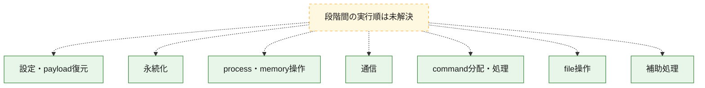
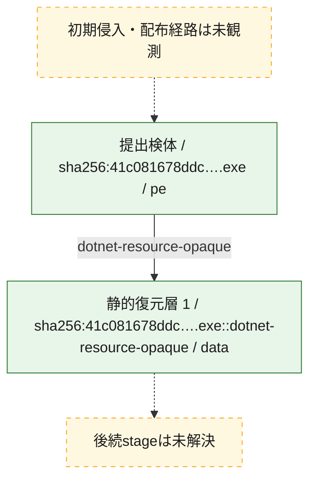
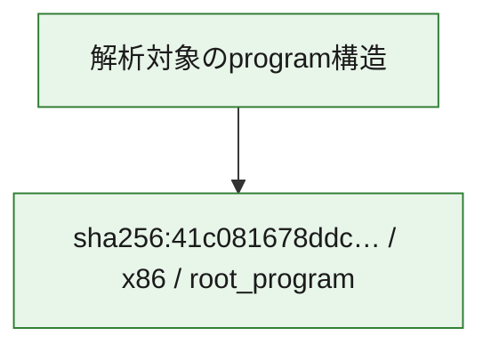

# 全体ロジック：41c081678ddcf41b409fcbaeba8d803742ae1a4931b2df0f5a5a8699d7636227

代表関数の静的証跡から、設定・payload復元、永続化、process・memory操作、通信、command分配・処理、file操作の処理群を確認しました。

## 読み方

- phaseの掲載順は解析上の整理順です。observed_call_edgesがない段階間の実行順を断定しません。
- 図の実線は静的に観測した関係、点線と黄色のノードは未観測・未解決の関係を示します。
- 図は静的な要約であり、動的実行を再現するものではありません。
- 詳細な関数解説とfingerprintは[STATIC-LOGIC.md](STATIC-LOGIC.md)を参照してください。

## 静的可視化

### 実行フロー

### 感染チェーン

### モジュール関係

## 処理段階

### 1. 設定・payload復元

設定、resource、payload、暗号化データの復元・変換を確認します。
確度: `confirmed_static_function_evidence`

- `41c081678ddcf41b409fcbaeba8d803742ae1a4931b2df0f5a5a8699d7636227:cil:0x060010f9` — 暗号、hash、encoding、または復号処理に関係する関数です。 状態: `succeeded`、選定理由: `large_function:instructions=412`, `reviewed_call_centrality:76`, `role:cryptographic_transform`
- `41c081678ddcf41b409fcbaeba8d803742ae1a4931b2df0f5a5a8699d7636227:cil:0x06001142` — 暗号、hash、encoding、または復号処理に関係する関数です。 状態: `succeeded`、選定理由: `large_function:instructions=148`, `reviewed_call_centrality:86`, `role:cryptographic_transform`
- `41c081678ddcf41b409fcbaeba8d803742ae1a4931b2df0f5a5a8699d7636227:cil:0x060013e0` — 暗号、hash、encoding、または復号処理に関係する関数です。 状態: `succeeded`、選定理由: `large_function:instructions=86`, `reviewed_call_centrality:46`, `role:cryptographic_transform`
- `41c081678ddcf41b409fcbaeba8d803742ae1a4931b2df0f5a5a8699d7636227:cil:0x060013e4` — 暗号、hash、encoding、または復号処理に関係する関数です。 状態: `succeeded`、選定理由: `large_function:instructions=394`, `reviewed_call_centrality:248`, `role:cryptographic_transform`
- `41c081678ddcf41b409fcbaeba8d803742ae1a4931b2df0f5a5a8699d7636227:cil:0x0600160d` — 暗号、hash、encoding、または復号処理に関係する関数です。 状態: `succeeded`、選定理由: `large_function:instructions=75`, `reviewed_call_centrality:52`, `role:cryptographic_transform`
- `41c081678ddcf41b409fcbaeba8d803742ae1a4931b2df0f5a5a8699d7636227:cil:0x0600177d` — 設定、resource、payloadなどの解析・変換を行う関数です。 状態: `succeeded`、選定理由: `reviewed_call_centrality:24`, `role:config_or_data_transform`
- `41c081678ddcf41b409fcbaeba8d803742ae1a4931b2df0f5a5a8699d7636227:cil:0x0600180a` — 暗号、hash、encoding、または復号処理に関係する関数です。 状態: `succeeded`、選定理由: `large_function:instructions=441`, `reviewed_call_centrality:206`, `role:cryptographic_transform`

### 2. 永続化

自動起動や永続化に関係する設定変更を確認します。
確度: `confirmed_static_function_evidence`

- `41c081678ddcf41b409fcbaeba8d803742ae1a4931b2df0f5a5a8699d7636227:cil:0x060013ea` — 自動起動または永続化に関係する処理を含む関数です。 状態: `succeeded`、選定理由: `large_function:instructions=92`, `reviewed_call_centrality:54`, `role:persistence`

### 3. process・memory操作

process、thread、module、memory操作と実行移行を確認します。
確度: `confirmed_static_function_evidence`

- `41c081678ddcf41b409fcbaeba8d803742ae1a4931b2df0f5a5a8699d7636227:cil:0x0600111d` — process、thread、module、またはmemory操作に関係する関数です。 状態: `succeeded`、選定理由: `large_function:instructions=167`, `reviewed_call_centrality:102`, `role:process_or_memory_operation`
- `41c081678ddcf41b409fcbaeba8d803742ae1a4931b2df0f5a5a8699d7636227:cil:0x06001145` — process、thread、module、またはmemory操作に関係する関数です。 状態: `succeeded`、選定理由: `large_function:instructions=221`, `reviewed_call_centrality:146`, `role:process_or_memory_operation`
- `41c081678ddcf41b409fcbaeba8d803742ae1a4931b2df0f5a5a8699d7636227:cil:0x060011d5` — process、thread、module、またはmemory操作に関係する関数です。 状態: `succeeded`、選定理由: `large_function:instructions=81`, `reviewed_call_centrality:50`, `role:process_or_memory_operation`
- `41c081678ddcf41b409fcbaeba8d803742ae1a4931b2df0f5a5a8699d7636227:cil:0x060013b3` — process、thread、module、またはmemory操作に関係する関数です。 状態: `succeeded`、選定理由: `large_function:instructions=73`, `reviewed_call_centrality:44`, `role:process_or_memory_operation`
- `41c081678ddcf41b409fcbaeba8d803742ae1a4931b2df0f5a5a8699d7636227:cil:0x060013df` — process、thread、module、またはmemory操作に関係する関数です。 状態: `succeeded`、選定理由: `large_function:instructions=183`, `reviewed_call_centrality:40`, `role:process_or_memory_operation`
- `41c081678ddcf41b409fcbaeba8d803742ae1a4931b2df0f5a5a8699d7636227:cil:0x060013e1` — process、thread、module、またはmemory操作に関係する関数です。 状態: `succeeded`、選定理由: `large_function:instructions=509`, `reviewed_call_centrality:94`, `role:process_or_memory_operation`

### 4. 通信

通信初期化、endpoint処理、送受信の役割を確認します。
確度: `confirmed_static_function_evidence`

- `41c081678ddcf41b409fcbaeba8d803742ae1a4931b2df0f5a5a8699d7636227:cil:0x06001201` — 通信初期化、送受信、またはendpoint処理に関係する関数です。 状態: `succeeded`、選定理由: `large_function:instructions=115`, `reviewed_call_centrality:74`, `role:network_communication`
- `41c081678ddcf41b409fcbaeba8d803742ae1a4931b2df0f5a5a8699d7636227:cil:0x06001203` — 通信初期化、送受信、またはendpoint処理に関係する関数です。 状態: `succeeded`、選定理由: `large_function:instructions=139`, `reviewed_call_centrality:70`, `role:network_communication`
- `41c081678ddcf41b409fcbaeba8d803742ae1a4931b2df0f5a5a8699d7636227:cil:0x0600120b` — 通信初期化、送受信、またはendpoint処理に関係する関数です。 状態: `succeeded`、選定理由: `large_function:instructions=115`, `reviewed_call_centrality:58`, `role:network_communication`
- `41c081678ddcf41b409fcbaeba8d803742ae1a4931b2df0f5a5a8699d7636227:cil:0x0600120c` — 通信初期化、送受信、またはendpoint処理に関係する関数です。 状態: `succeeded`、選定理由: `large_function:instructions=734`, `reviewed_call_centrality:426`, `role:network_communication`
- `41c081678ddcf41b409fcbaeba8d803742ae1a4931b2df0f5a5a8699d7636227:cil:0x0600160c` — 通信初期化、送受信、またはendpoint処理に関係する関数です。 状態: `succeeded`、選定理由: `large_function:instructions=157`, `reviewed_call_centrality:104`, `role:network_communication`
- `41c081678ddcf41b409fcbaeba8d803742ae1a4931b2df0f5a5a8699d7636227:cil:0x060016d8` — 通信初期化、送受信、またはendpoint処理に関係する関数です。 状態: `succeeded`、選定理由: `large_function:instructions=241`, `reviewed_call_centrality:54`, `role:network_communication`

### 5. command分配・処理

受信commandやtaskの解釈、分配、個別handlerへの移行を確認します。
確度: `confirmed_static_function_evidence`

- `41c081678ddcf41b409fcbaeba8d803742ae1a4931b2df0f5a5a8699d7636227:cil:0x060013e2` — commandの解釈、分配、または個別処理を担当する関数です。 状態: `succeeded`、選定理由: `large_function:instructions=96`, `reviewed_call_centrality:68`, `role:command_dispatch_or_handler`
- `41c081678ddcf41b409fcbaeba8d803742ae1a4931b2df0f5a5a8699d7636227:cil:0x060013e5` — commandの解釈、分配、または個別処理を担当する関数です。 状態: `succeeded`、選定理由: `large_function:instructions=141`, `reviewed_call_centrality:48`, `role:command_dispatch_or_handler`
- `41c081678ddcf41b409fcbaeba8d803742ae1a4931b2df0f5a5a8699d7636227:cil:0x060013e7` — commandの解釈、分配、または個別処理を担当する関数です。 状態: `succeeded`、選定理由: `large_function:instructions=162`, `reviewed_call_centrality:112`, `role:command_dispatch_or_handler`
- `41c081678ddcf41b409fcbaeba8d803742ae1a4931b2df0f5a5a8699d7636227:cil:0x060013e8` — commandの解釈、分配、または個別処理を担当する関数です。 状態: `succeeded`、選定理由: `large_function:instructions=107`, `reviewed_call_centrality:78`, `role:command_dispatch_or_handler`
- `41c081678ddcf41b409fcbaeba8d803742ae1a4931b2df0f5a5a8699d7636227:cil:0x060013e9` — commandの解釈、分配、または個別処理を担当する関数です。 状態: `succeeded`、選定理由: `large_function:instructions=206`, `reviewed_call_centrality:76`, `role:command_dispatch_or_handler`

### 6. file操作

fileやdirectoryの作成、読書き、削除を確認します。
確度: `confirmed_static_function_evidence`

- `41c081678ddcf41b409fcbaeba8d803742ae1a4931b2df0f5a5a8699d7636227:cil:0x0600154f` — fileまたはdirectoryの読書き・管理に関係する関数です。 状態: `succeeded`、選定理由: `large_function:instructions=149`, `reviewed_call_centrality:88`, `role:file_operation`
- `41c081678ddcf41b409fcbaeba8d803742ae1a4931b2df0f5a5a8699d7636227:cil:0x0600164b` — fileまたはdirectoryの読書き・管理に関係する関数です。 状態: `succeeded`、選定理由: `large_function:instructions=88`, `reviewed_call_centrality:44`, `role:file_operation`
- `41c081678ddcf41b409fcbaeba8d803742ae1a4931b2df0f5a5a8699d7636227:cil:0x0600164c` — fileまたはdirectoryの読書き・管理に関係する関数です。 状態: `succeeded`、選定理由: `large_function:instructions=100`, `reviewed_call_centrality:50`, `role:file_operation`
- `41c081678ddcf41b409fcbaeba8d803742ae1a4931b2df0f5a5a8699d7636227:cil:0x0600168c` — fileまたはdirectoryの読書き・管理に関係する関数です。 状態: `succeeded`、選定理由: `large_function:instructions=87`, `reviewed_call_centrality:58`, `role:file_operation`
- `41c081678ddcf41b409fcbaeba8d803742ae1a4931b2df0f5a5a8699d7636227:cil:0x06001698` — fileまたはdirectoryの読書き・管理に関係する関数です。 状態: `succeeded`、選定理由: `large_function:instructions=136`, `reviewed_call_centrality:60`, `role:file_operation`
- `41c081678ddcf41b409fcbaeba8d803742ae1a4931b2df0f5a5a8699d7636227:cil:0x06001699` — fileまたはdirectoryの読書き・管理に関係する関数です。 状態: `succeeded`、選定理由: `large_function:instructions=205`, `reviewed_call_centrality:70`, `role:file_operation`

### 7. 補助処理

主要処理を支える一般内部関数またはlibrary処理を確認します。
確度: `confirmed_static_function_evidence`

- `41c081678ddcf41b409fcbaeba8d803742ae1a4931b2df0f5a5a8699d7636227:cil:0x06001550` — 検体内部の一般処理を実装する関数です。 状態: `succeeded`、選定理由: `large_function:instructions=188`, `reviewed_call_centrality:110`

## 観測したcall関係

- 代表関数間で直接解決できた呼出関係はありません。

## 解析範囲と制約

- 選定外関数は全体inventoryへ残しますが、関数本体の個別解説対象にはしていません。
- indirect call、難読化、packer、VM、壊れたcontrol flowによりcall関係が欠落する場合があります。
- 文書は静的解析に基づき、検体実行や外部通信による動的確認は行っていません。
