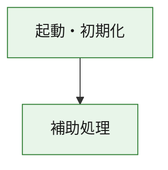
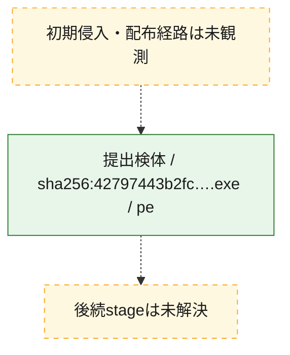
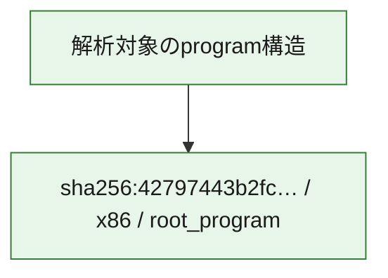

# 全体ロジック：42797443b2fc46e90f25949a3c61b6ee0c04459df15b703cedb1f0f812830b04

代表関数の静的証跡から、起動・初期化の処理群を確認しました。

## 読み方

- phaseの掲載順は解析上の整理順です。observed_call_edgesがない段階間の実行順を断定しません。
- 図の実線は静的に観測した関係、点線と黄色のノードは未観測・未解決の関係を示します。
- 図は静的な要約であり、動的実行を再現するものではありません。
- 詳細な関数解説とfingerprintは[STATIC-LOGIC.md](STATIC-LOGIC.md)を参照してください。

## 静的可視化

### 実行フロー

### 感染チェーン

### モジュール関係

## 処理段階

### 1. 起動・初期化

entry pointから初期化と後続処理への移行を確認します。
確度: `confirmed_static_function_evidence`

- `42797443b2fc46e90f25949a3c61b6ee0c04459df15b703cedb1f0f812830b04:ghidra:180001010` — 初期化と主要処理への分岐を行う入口関数です。 状態: `succeeded`、選定理由: `entry_point`, `meaningful_symbol_name`, `reviewed_call_centrality:22`, `role:entrypoint`, `small_program_complete_context`

### 2. 補助処理

主要処理を支える一般内部関数またはlibrary処理を確認します。
確度: `confirmed_static_function_evidence`

- `42797443b2fc46e90f25949a3c61b6ee0c04459df15b703cedb1f0f812830b04:ghidra:180001240` — 検体内部の一般処理を実装する関数です。 状態: `succeeded`、選定理由: `context_representative`, `reviewed_call_centrality:2`, `small_program_complete_context`
- `42797443b2fc46e90f25949a3c61b6ee0c04459df15b703cedb1f0f812830b04:ghidra:180001350` — 検体内部の一般処理を実装する関数です。 状態: `succeeded`、選定理由: `context_representative`, `reviewed_call_centrality:25`, `small_program_complete_context`
- `42797443b2fc46e90f25949a3c61b6ee0c04459df15b703cedb1f0f812830b04:ghidra:180003780` — 検体内部の一般処理を実装する関数です。 状態: `succeeded`、選定理由: `context_representative`, `reviewed_call_centrality:2`, `small_program_complete_context`
- `42797443b2fc46e90f25949a3c61b6ee0c04459df15b703cedb1f0f812830b04:ghidra:1800038e0` — 検体内部の一般処理を実装する関数です。 状態: `succeeded`、選定理由: `context_representative`, `reviewed_call_centrality:2`, `small_program_complete_context`

## 観測したcall関係

- `42797443b2fc46e90f25949a3c61b6ee0c04459df15b703cedb1f0f812830b04:ghidra:180001010` → `42797443b2fc46e90f25949a3c61b6ee0c04459df15b703cedb1f0f812830b04:ghidra:180001240` （`startup` → `support`）
- `42797443b2fc46e90f25949a3c61b6ee0c04459df15b703cedb1f0f812830b04:ghidra:180001010` → `42797443b2fc46e90f25949a3c61b6ee0c04459df15b703cedb1f0f812830b04:ghidra:180001350` （`startup` → `support`）
- `42797443b2fc46e90f25949a3c61b6ee0c04459df15b703cedb1f0f812830b04:ghidra:180001350` → `42797443b2fc46e90f25949a3c61b6ee0c04459df15b703cedb1f0f812830b04:ghidra:180001240` （`support` → `support`）
- `42797443b2fc46e90f25949a3c61b6ee0c04459df15b703cedb1f0f812830b04:ghidra:180001350` → `42797443b2fc46e90f25949a3c61b6ee0c04459df15b703cedb1f0f812830b04:ghidra:180003780` （`support` → `support`）
- `42797443b2fc46e90f25949a3c61b6ee0c04459df15b703cedb1f0f812830b04:ghidra:180001350` → `42797443b2fc46e90f25949a3c61b6ee0c04459df15b703cedb1f0f812830b04:ghidra:1800038e0` （`support` → `support`）
- `42797443b2fc46e90f25949a3c61b6ee0c04459df15b703cedb1f0f812830b04:ghidra:180003780` → `42797443b2fc46e90f25949a3c61b6ee0c04459df15b703cedb1f0f812830b04:ghidra:1800038e0` （`support` → `support`）
- `ghidra-function:1af5fcf91d33df32bf7a4977` → `ghidra-function:0af37511ca03870381b2ccaa` （`unclassified` → `unclassified`）
- `ghidra-function:1af5fcf91d33df32bf7a4977` → `ghidra-function:0ea50143c35572e68eed1599` （`unclassified` → `unclassified`）
- `ghidra-function:1af5fcf91d33df32bf7a4977` → `ghidra-function:15bcc4d183a997ec813b25c9` （`unclassified` → `unclassified`）
- `ghidra-function:1af5fcf91d33df32bf7a4977` → `ghidra-function:1edf04ef3186cc7337fc934c` （`unclassified` → `unclassified`）
- `ghidra-function:1af5fcf91d33df32bf7a4977` → `ghidra-function:33ab3b71c53618b74f4f682a` （`unclassified` → `unclassified`）
- `ghidra-function:1af5fcf91d33df32bf7a4977` → `ghidra-function:4209cce9e21197552e9ff3e2` （`unclassified` → `unclassified`）
- `ghidra-function:1af5fcf91d33df32bf7a4977` → `ghidra-function:66aa507fccc1f270b6312b7a` （`unclassified` → `unclassified`）
- `ghidra-function:1af5fcf91d33df32bf7a4977` → `ghidra-function:6f481b70ffb408c3667c06e4` （`unclassified` → `unclassified`）
- `ghidra-function:1af5fcf91d33df32bf7a4977` → `ghidra-function:9729e225fe2009295f77193d` （`unclassified` → `unclassified`）
- `ghidra-function:1af5fcf91d33df32bf7a4977` → `ghidra-function:a0059b254f0e634fa6352300` （`unclassified` → `unclassified`）
- `ghidra-function:1af5fcf91d33df32bf7a4977` → `ghidra-function:bfb640e8118a6484c826b487` （`unclassified` → `unclassified`）
- `ghidra-function:1af5fcf91d33df32bf7a4977` → `ghidra-function:fe64aeec6ea9fa438b2b424e` （`unclassified` → `unclassified`）
- `ghidra-function:5bb6c023dfbd97fd5258ced0` → `ghidra-function:6ea2439626163050de983982` （`unclassified` → `unclassified`）
- `ghidra-function:fe64aeec6ea9fa438b2b424e` → `ghidra-external:0cd1eb56f4883901c711eafc` （`unclassified` → `unclassified`）
- `ghidra-function:fe64aeec6ea9fa438b2b424e` → `ghidra-external:121837c4a0c70d80f8158b94` （`unclassified` → `unclassified`）
- `ghidra-function:fe64aeec6ea9fa438b2b424e` → `ghidra-external:20773d521e81502a8ae14118` （`unclassified` → `unclassified`）
- `ghidra-function:fe64aeec6ea9fa438b2b424e` → `ghidra-external:454710353880be90fbe687d5` （`unclassified` → `unclassified`）
- `ghidra-function:fe64aeec6ea9fa438b2b424e` → `ghidra-external:4629bbcf92ac2ccf226e3f6a` （`unclassified` → `unclassified`）
- `ghidra-function:fe64aeec6ea9fa438b2b424e` → `ghidra-external:6afe3d63ed6f7fa3f621c61b` （`unclassified` → `unclassified`）
- `ghidra-function:fe64aeec6ea9fa438b2b424e` → `ghidra-external:70719ff6bfc01a2481ddd53e` （`unclassified` → `unclassified`）
- `ghidra-function:fe64aeec6ea9fa438b2b424e` → `ghidra-external:7469788d4b3203b087511bed` （`unclassified` → `unclassified`）
- `ghidra-function:fe64aeec6ea9fa438b2b424e` → `ghidra-external:758633665e52aa66770d77c2` （`unclassified` → `unclassified`）
- `ghidra-function:fe64aeec6ea9fa438b2b424e` → `ghidra-external:9896c218862f741bf1ed2ffc` （`unclassified` → `unclassified`）
- `ghidra-function:fe64aeec6ea9fa438b2b424e` → `ghidra-external:a835757c7f8789afed148add` （`unclassified` → `unclassified`）
- `ghidra-function:fe64aeec6ea9fa438b2b424e` → `ghidra-external:b4bfd897573575e695878171` （`unclassified` → `unclassified`）
- `ghidra-function:fe64aeec6ea9fa438b2b424e` → `ghidra-external:bad76877d5638f1e83044ba3` （`unclassified` → `unclassified`）
- `ghidra-function:fe64aeec6ea9fa438b2b424e` → `ghidra-external:c6e5d089c03f8338674f2dfc` （`unclassified` → `unclassified`）
- `ghidra-function:fe64aeec6ea9fa438b2b424e` → `ghidra-external:cbd70d74df2e13e7dcab4e78` （`unclassified` → `unclassified`）
- `ghidra-function:fe64aeec6ea9fa438b2b424e` → `ghidra-external:cc8caae91a3f7baee4837c5a` （`unclassified` → `unclassified`）
- `ghidra-function:fe64aeec6ea9fa438b2b424e` → `ghidra-external:d6eda5d9fafbeecbe0a38bda` （`unclassified` → `unclassified`）
- `ghidra-function:fe64aeec6ea9fa438b2b424e` → `ghidra-external:e350a36700c9c625e73edeb3` （`unclassified` → `unclassified`）
- `ghidra-function:fe64aeec6ea9fa438b2b424e` → `ghidra-external:e4208efa48e347635fe6417a` （`unclassified` → `unclassified`）
- `ghidra-function:fe64aeec6ea9fa438b2b424e` → `ghidra-external:e7065ef5be50162d03c499c2` （`unclassified` → `unclassified`）
- `ghidra-function:fe64aeec6ea9fa438b2b424e` → `ghidra-external:faf37feef3cc7bffa9127103` （`unclassified` → `unclassified`）
- `ghidra-function:fe64aeec6ea9fa438b2b424e` → `ghidra-function:5bb6c023dfbd97fd5258ced0` （`unclassified` → `unclassified`）
- `ghidra-function:fe64aeec6ea9fa438b2b424e` → `ghidra-function:6ea2439626163050de983982` （`unclassified` → `unclassified`）
- `ghidra-function:fe64aeec6ea9fa438b2b424e` → `ghidra-function:bfb640e8118a6484c826b487` （`unclassified` → `unclassified`）

## 解析範囲と制約

- 選定外関数は全体inventoryへ残しますが、関数本体の個別解説対象にはしていません。
- indirect call、難読化、packer、VM、壊れたcontrol flowによりcall関係が欠落する場合があります。
- 文書は静的解析に基づき、検体実行や外部通信による動的確認は行っていません。
