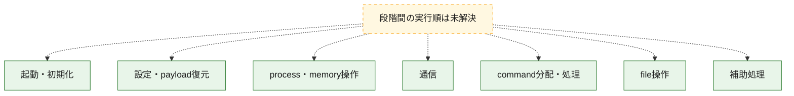
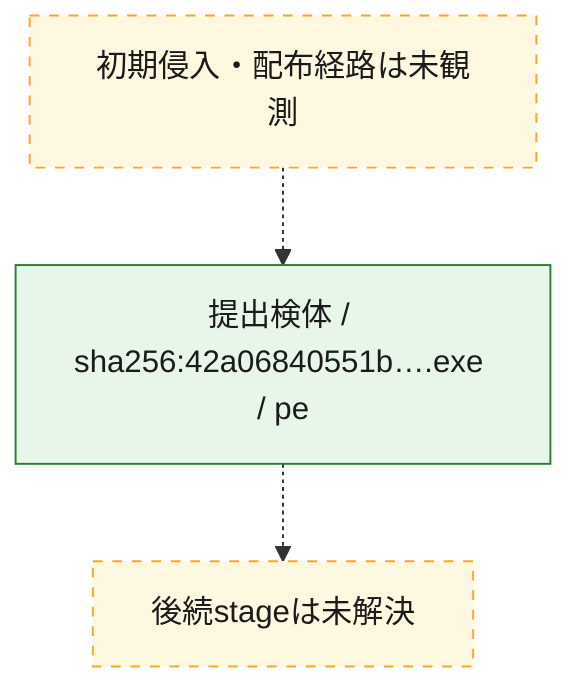
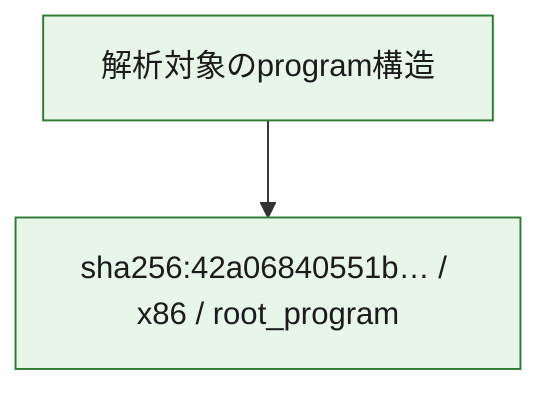

# 全体ロジック：42a06840551bf6478aa324a3c477157a6440b7de74e6229f32b298a5c9e6a939

代表関数の静的証跡から、起動・初期化、設定・payload復元、process・memory操作、通信、command分配・処理、file操作の処理群を確認しました。

## 読み方

- phaseの掲載順は解析上の整理順です。observed_call_edgesがない段階間の実行順を断定しません。
- 図の実線は静的に観測した関係、点線と黄色のノードは未観測・未解決の関係を示します。
- 図は静的な要約であり、動的実行を再現するものではありません。
- 詳細な関数解説とfingerprintは[STATIC-LOGIC.md](STATIC-LOGIC.md)を参照してください。

## 静的可視化

### 実行フロー

### 感染チェーン

### モジュール関係

## 処理段階

### 1. 起動・初期化

entry pointから初期化と後続処理への移行を確認します。
確度: `confirmed_static_function_evidence`

- `42a06840551bf6478aa324a3c477157a6440b7de74e6229f32b298a5c9e6a939:ghidra:1400dc620` — 初期化と主要処理への分岐を行う入口関数です。 状態: `succeeded`、選定理由: `entry_point`, `meaningful_symbol_name`, `probable_go_main_user_code`, `reviewed_call_centrality:15`, `role:entrypoint`
- `42a06840551bf6478aa324a3c477157a6440b7de74e6229f32b298a5c9e6a939:ghidra:1400dcce0` — 初期化と主要処理への分岐を行う入口関数です。 状態: `succeeded`、選定理由: `entry_point`, `meaningful_symbol_name`, `probable_go_main_user_code`, `reviewed_call_centrality:4`, `role:entrypoint`
- `42a06840551bf6478aa324a3c477157a6440b7de74e6229f32b298a5c9e6a939:ghidra:1400dcdc0` — 初期化と主要処理への分岐を行う入口関数です。 状態: `succeeded`、選定理由: `entry_point`, `meaningful_symbol_name`, `probable_go_main_user_code`, `reviewed_call_centrality:10`, `role:entrypoint`
- `42a06840551bf6478aa324a3c477157a6440b7de74e6229f32b298a5c9e6a939:ghidra:1400dd060` — 初期化と主要処理への分岐を行う入口関数です。 状態: `succeeded`、選定理由: `entry_point`, `meaningful_symbol_name`, `probable_go_main_user_code`, `reviewed_call_centrality:3`, `role:entrypoint`
- `42a06840551bf6478aa324a3c477157a6440b7de74e6229f32b298a5c9e6a939:ghidra:1400dd0a0` — 初期化と主要処理への分岐を行う入口関数です。 状態: `succeeded`、選定理由: `entry_point`, `meaningful_symbol_name`, `probable_go_main_user_code`, `reviewed_call_centrality:4`, `role:entrypoint`
- `42a06840551bf6478aa324a3c477157a6440b7de74e6229f32b298a5c9e6a939:ghidra:1400dd100` — 初期化と主要処理への分岐を行う入口関数です。 状態: `succeeded`、選定理由: `entry_point`, `meaningful_symbol_name`, `probable_go_main_user_code`, `reviewed_call_centrality:7`, `role:entrypoint`
- `42a06840551bf6478aa324a3c477157a6440b7de74e6229f32b298a5c9e6a939:ghidra:1400dd2c0` — 初期化と主要処理への分岐を行う入口関数です。 状態: `succeeded`、選定理由: `entry_point`, `meaningful_symbol_name`, `probable_go_main_user_code`, `reviewed_call_centrality:6`, `role:entrypoint`
- `42a06840551bf6478aa324a3c477157a6440b7de74e6229f32b298a5c9e6a939:ghidra:1400dd400` — 初期化と主要処理への分岐を行う入口関数です。 状態: `succeeded`、選定理由: `entry_point`, `meaningful_symbol_name`, `probable_go_main_user_code`, `reviewed_call_centrality:29`, `role:entrypoint`
- `42a06840551bf6478aa324a3c477157a6440b7de74e6229f32b298a5c9e6a939:ghidra:1400ddee0` — 初期化と主要処理への分岐を行う入口関数です。 状態: `succeeded`、選定理由: `entry_point`, `meaningful_symbol_name`, `probable_go_main_user_code`, `reviewed_call_centrality:3`, `role:entrypoint`
- `42a06840551bf6478aa324a3c477157a6440b7de74e6229f32b298a5c9e6a939:ghidra:1400ddf20` — 初期化と主要処理への分岐を行う入口関数です。 状態: `succeeded`、選定理由: `entry_point`, `meaningful_symbol_name`, `probable_go_main_user_code`, `reviewed_call_centrality:4`, `role:entrypoint`

### 2. 設定・payload復元

設定、resource、payload、暗号化データの復元・変換を確認します。
確度: `confirmed_static_function_evidence`

- `42a06840551bf6478aa324a3c477157a6440b7de74e6229f32b298a5c9e6a939:ghidra:14008a3c0` — 設定、resource、payloadなどの解析・変換を行う関数です。 状態: `succeeded`、選定理由: `meaningful_symbol_name`, `reviewed_call_centrality:4`, `role:config_or_data_transform`
- `42a06840551bf6478aa324a3c477157a6440b7de74e6229f32b298a5c9e6a939:ghidra:14008a520` — 設定、resource、payloadなどの解析・変換を行う関数です。 状態: `succeeded`、選定理由: `meaningful_symbol_name`, `reviewed_call_centrality:4`, `role:config_or_data_transform`
- `42a06840551bf6478aa324a3c477157a6440b7de74e6229f32b298a5c9e6a939:ghidra:14008a680` — 設定、resource、payloadなどの解析・変換を行う関数です。 状態: `succeeded`、選定理由: `meaningful_symbol_name`, `reviewed_call_centrality:5`, `role:config_or_data_transform`
- `42a06840551bf6478aa324a3c477157a6440b7de74e6229f32b298a5c9e6a939:ghidra:140098c40` — 設定、resource、payloadなどの解析・変換を行う関数です。 状態: `succeeded`、選定理由: `meaningful_symbol_name`, `reviewed_call_centrality:5`, `role:config_or_data_transform`
- `42a06840551bf6478aa324a3c477157a6440b7de74e6229f32b298a5c9e6a939:ghidra:1400b8660` — 暗号、hash、encoding、または復号処理に関係する関数です。 状態: `succeeded`、選定理由: `meaningful_symbol_name`, `reviewed_call_centrality:14`, `role:cryptographic_transform`
- `42a06840551bf6478aa324a3c477157a6440b7de74e6229f32b298a5c9e6a939:ghidra:1400b8cc0` — 暗号、hash、encoding、または復号処理に関係する関数です。 状態: `succeeded`、選定理由: `meaningful_symbol_name`, `reviewed_call_centrality:5`, `role:cryptographic_transform`
- `42a06840551bf6478aa324a3c477157a6440b7de74e6229f32b298a5c9e6a939:ghidra:1400b9260` — 暗号、hash、encoding、または復号処理に関係する関数です。 状態: `succeeded`、選定理由: `meaningful_symbol_name`, `reviewed_call_centrality:6`, `role:cryptographic_transform`

### 3. process・memory操作

process、thread、module、memory操作と実行移行を確認します。
確度: `confirmed_static_function_evidence`

- `42a06840551bf6478aa324a3c477157a6440b7de74e6229f32b298a5c9e6a939:ghidra:140098e60` — process、thread、module、またはmemory操作に関係する関数です。 状態: `succeeded`、選定理由: `meaningful_symbol_name`, `reviewed_call_centrality:6`, `role:process_or_memory_operation`
- `42a06840551bf6478aa324a3c477157a6440b7de74e6229f32b298a5c9e6a939:ghidra:140099b40` — process、thread、module、またはmemory操作に関係する関数です。 状態: `succeeded`、選定理由: `meaningful_symbol_name`, `reviewed_call_centrality:6`, `role:process_or_memory_operation`
- `42a06840551bf6478aa324a3c477157a6440b7de74e6229f32b298a5c9e6a939:ghidra:14009c6c0` — process、thread、module、またはmemory操作に関係する関数です。 状態: `succeeded`、選定理由: `meaningful_symbol_name`, `reviewed_call_centrality:3`, `role:process_or_memory_operation`

### 4. 通信

通信初期化、endpoint処理、送受信の役割を確認します。
確度: `confirmed_static_function_evidence`

- `42a06840551bf6478aa324a3c477157a6440b7de74e6229f32b298a5c9e6a939:ghidra:14009c3c0` — 通信初期化、送受信、またはendpoint処理に関係する関数です。 状態: `succeeded`、選定理由: `meaningful_symbol_name`, `reviewed_call_centrality:6`, `role:network_communication`
- `42a06840551bf6478aa324a3c477157a6440b7de74e6229f32b298a5c9e6a939:ghidra:1400a6fe0` — 通信初期化、送受信、またはendpoint処理に関係する関数です。 状態: `succeeded`、選定理由: `meaningful_symbol_name`, `reviewed_call_centrality:6`, `role:network_communication`

### 5. command分配・処理

受信commandやtaskの解釈、分配、個別handlerへの移行を確認します。
確度: `confirmed_static_function_evidence`

- `42a06840551bf6478aa324a3c477157a6440b7de74e6229f32b298a5c9e6a939:ghidra:14009a400` — commandの解釈、分配、または個別処理を担当する関数です。 状態: `succeeded`、選定理由: `meaningful_symbol_name`, `reviewed_call_centrality:5`, `role:command_dispatch_or_handler`
- `42a06840551bf6478aa324a3c477157a6440b7de74e6229f32b298a5c9e6a939:ghidra:1400b3f20` — commandの解釈、分配、または個別処理を担当する関数です。 状態: `succeeded`、選定理由: `meaningful_symbol_name`, `reviewed_call_centrality:7`, `role:command_dispatch_or_handler`

### 6. file操作

fileやdirectoryの作成、読書き、削除を確認します。
確度: `confirmed_static_function_evidence`

- `42a06840551bf6478aa324a3c477157a6440b7de74e6229f32b298a5c9e6a939:ghidra:1400984e0` — fileまたはdirectoryの読書き・管理に関係する関数です。 状態: `succeeded`、選定理由: `meaningful_symbol_name`, `reviewed_call_centrality:5`, `role:file_operation`
- `42a06840551bf6478aa324a3c477157a6440b7de74e6229f32b298a5c9e6a939:ghidra:140099740` — fileまたはdirectoryの読書き・管理に関係する関数です。 状態: `succeeded`、選定理由: `meaningful_symbol_name`, `reviewed_call_centrality:7`, `role:file_operation`
- `42a06840551bf6478aa324a3c477157a6440b7de74e6229f32b298a5c9e6a939:ghidra:140099840` — fileまたはdirectoryの読書き・管理に関係する関数です。 状態: `succeeded`、選定理由: `meaningful_symbol_name`, `reviewed_call_centrality:7`, `role:file_operation`
- `42a06840551bf6478aa324a3c477157a6440b7de74e6229f32b298a5c9e6a939:ghidra:14009b500` — fileまたはdirectoryの読書き・管理に関係する関数です。 状態: `succeeded`、選定理由: `meaningful_symbol_name`, `reviewed_call_centrality:6`, `role:file_operation`
- `42a06840551bf6478aa324a3c477157a6440b7de74e6229f32b298a5c9e6a939:ghidra:14009bdc0` — fileまたはdirectoryの読書き・管理に関係する関数です。 状態: `succeeded`、選定理由: `meaningful_symbol_name`, `reviewed_call_centrality:6`, `role:file_operation`
- `42a06840551bf6478aa324a3c477157a6440b7de74e6229f32b298a5c9e6a939:ghidra:1400b4aa0` — fileまたはdirectoryの読書き・管理に関係する関数です。 状態: `succeeded`、選定理由: `meaningful_symbol_name`, `reviewed_call_centrality:5`, `role:file_operation`

### 7. 補助処理

主要処理を支える一般内部関数またはlibrary処理を確認します。
確度: `confirmed_static_function_evidence`

- `42a06840551bf6478aa324a3c477157a6440b7de74e6229f32b298a5c9e6a939:ghidra:140001080` — compiler生成処理または汎用library処理とみられる関数です。 状態: `succeeded`、選定理由: `meaningful_symbol_name`, `reviewed_call_centrality:5`
- `42a06840551bf6478aa324a3c477157a6440b7de74e6229f32b298a5c9e6a939:ghidra:140078d00` — 検体内部の一般処理を実装する関数です。 状態: `succeeded`、選定理由: `meaningful_symbol_name`, `reviewed_call_centrality:3`

## 観測したcall関係

- `ghidra-function:0121c88f5bbb1520a322edf4` → `ghidra-external:5a71c2edc90e53fc9e867702` （`unclassified` → `unclassified`）
- `ghidra-function:0121c88f5bbb1520a322edf4` → `ghidra-external:66bb3f0b30b48df2fc86cf06` （`unclassified` → `unclassified`）
- `ghidra-function:0121c88f5bbb1520a322edf4` → `ghidra-external:7d8be7886c5345290825ba0c` （`unclassified` → `unclassified`）
- `ghidra-function:0121c88f5bbb1520a322edf4` → `ghidra-external:8b1e6449629e3f136e0cc37f` （`unclassified` → `unclassified`）
- `ghidra-function:0121c88f5bbb1520a322edf4` → `ghidra-external:b59ad378cf42d4ce38898ff0` （`unclassified` → `unclassified`）
- `ghidra-function:0121c88f5bbb1520a322edf4` → `ghidra-external:d93d249cbb2d622bfe88dd4f` （`unclassified` → `unclassified`）
- `ghidra-function:01b5ea48ef4af3891f0be90c` → `ghidra-external:0dbb94ed82cb1b80a22590d6` （`unclassified` → `unclassified`）
- `ghidra-function:01b5ea48ef4af3891f0be90c` → `ghidra-external:1ee652200c1219fa3bac0fac` （`unclassified` → `unclassified`）
- `ghidra-function:01b5ea48ef4af3891f0be90c` → `ghidra-external:351b53a5bd5d02eae1425957` （`unclassified` → `unclassified`）
- `ghidra-function:01b5ea48ef4af3891f0be90c` → `ghidra-external:73b6eaedb7c1a3daef870117` （`unclassified` → `unclassified`）
- `ghidra-function:01b5ea48ef4af3891f0be90c` → `ghidra-external:7d8be7886c5345290825ba0c` （`unclassified` → `unclassified`）
- `ghidra-function:01b5ea48ef4af3891f0be90c` → `ghidra-external:dd655015989c1ab7e0f4be8e` （`unclassified` → `unclassified`）
- `ghidra-function:0c9426b57fa43e272a5fdbd5` → `ghidra-external:2be80e148839e6343c8c65fd` （`unclassified` → `unclassified`）
- `ghidra-function:0c9426b57fa43e272a5fdbd5` → `ghidra-external:5b00f14de802818bde48c17f` （`unclassified` → `unclassified`）
- `ghidra-function:0c9426b57fa43e272a5fdbd5` → `ghidra-external:e0825608a194c3343fb18026` （`unclassified` → `unclassified`）
- `ghidra-function:11ee397f79a9d5f037edce9d` → `ghidra-external:385ea67e4bd6268e4d79c373` （`unclassified` → `unclassified`）
- `ghidra-function:11ee397f79a9d5f037edce9d` → `ghidra-external:7d8be7886c5345290825ba0c` （`unclassified` → `unclassified`）
- `ghidra-function:11ee397f79a9d5f037edce9d` → `ghidra-external:8c6572e9dbcd7bc69ea410bf` （`unclassified` → `unclassified`）
- `ghidra-function:19162328f37fa5d4e470aec2` → `ghidra-external:134cad8fc7b4e234c02788f3` （`unclassified` → `unclassified`）
- `ghidra-function:19162328f37fa5d4e470aec2` → `ghidra-external:2f9b41c5de0f1c6645feb170` （`unclassified` → `unclassified`）
- `ghidra-function:19162328f37fa5d4e470aec2` → `ghidra-external:30ab5d78e1b9da442aeb4be9` （`unclassified` → `unclassified`）
- `ghidra-function:19162328f37fa5d4e470aec2` → `ghidra-external:33f8718d58f1a49464e95128` （`unclassified` → `unclassified`）
- `ghidra-function:19162328f37fa5d4e470aec2` → `ghidra-external:4154a9df176c0eb3e872128b` （`unclassified` → `unclassified`）
- `ghidra-function:19162328f37fa5d4e470aec2` → `ghidra-external:4e55802b20e17b0ec2aba3d4` （`unclassified` → `unclassified`）
- `ghidra-function:19162328f37fa5d4e470aec2` → `ghidra-external:6d5d1029956ca67ebbaa4656` （`unclassified` → `unclassified`）
- `ghidra-function:19162328f37fa5d4e470aec2` → `ghidra-external:7d8be7886c5345290825ba0c` （`unclassified` → `unclassified`）
- `ghidra-function:19162328f37fa5d4e470aec2` → `ghidra-external:881b34c0d83936634a822bd1` （`unclassified` → `unclassified`）
- `ghidra-function:19162328f37fa5d4e470aec2` → `ghidra-external:9925a32078c90743ca8e8d88` （`unclassified` → `unclassified`）
- `ghidra-function:19162328f37fa5d4e470aec2` → `ghidra-external:b3b0653334259d9cf3246e54` （`unclassified` → `unclassified`）
- `ghidra-function:19162328f37fa5d4e470aec2` → `ghidra-external:b5abe8c83650900eb1ba23a0` （`unclassified` → `unclassified`）
- `ghidra-function:19162328f37fa5d4e470aec2` → `ghidra-external:cfa6c580df67a09ac864c125` （`unclassified` → `unclassified`）
- `ghidra-function:19162328f37fa5d4e470aec2` → `ghidra-external:d11bb277983243fe69918c24` （`unclassified` → `unclassified`）
- `ghidra-function:19162328f37fa5d4e470aec2` → `ghidra-external:e8350ebdfd373ad8582baec7` （`unclassified` → `unclassified`）
- `ghidra-function:1b5b9787213e651cb9badc84` → `ghidra-external:1e29d27a8d8a238d709c486d` （`unclassified` → `unclassified`）
- `ghidra-function:1b5b9787213e651cb9badc84` → `ghidra-external:4edbe981b323f6a925980cef` （`unclassified` → `unclassified`）
- `ghidra-function:1b5b9787213e651cb9badc84` → `ghidra-external:7d8be7886c5345290825ba0c` （`unclassified` → `unclassified`）
- `ghidra-function:1b5b9787213e651cb9badc84` → `ghidra-external:8c6572e9dbcd7bc69ea410bf` （`unclassified` → `unclassified`）
- `ghidra-function:1b5b9787213e651cb9badc84` → `ghidra-external:de1193886662a0ba3d87b020` （`unclassified` → `unclassified`）
- `ghidra-function:1b5b9787213e651cb9badc84` → `ghidra-external:f32cc429a779c2fc41add7c2` （`unclassified` → `unclassified`）
- `ghidra-function:26e850c5b3c141a5bb144ab5` → `ghidra-external:1df019c29131c459729745b3` （`unclassified` → `unclassified`）
- `ghidra-function:26e850c5b3c141a5bb144ab5` → `ghidra-external:3381e41240ad8052727a0d68` （`unclassified` → `unclassified`）
- `ghidra-function:26e850c5b3c141a5bb144ab5` → `ghidra-external:6a3c1192580653ffcd732996` （`unclassified` → `unclassified`）
- `ghidra-function:31635c8eb5abcb41fc21f319` → `ghidra-external:245d6126c13a120ffe61197a` （`unclassified` → `unclassified`）
- `ghidra-function:31635c8eb5abcb41fc21f319` → `ghidra-external:2921c887e2a324282291ce98` （`unclassified` → `unclassified`）
- `ghidra-function:31635c8eb5abcb41fc21f319` → `ghidra-external:7d8be7886c5345290825ba0c` （`unclassified` → `unclassified`）
- `ghidra-function:31635c8eb5abcb41fc21f319` → `ghidra-external:cfa6c580df67a09ac864c125` （`unclassified` → `unclassified`）
- `ghidra-function:31635c8eb5abcb41fc21f319` → `ghidra-external:fc2b6b5aefc7755322e25894` （`unclassified` → `unclassified`）
- `ghidra-function:36a3353bf70fdb377cde315f` → `ghidra-external:3bc19c5bcc2cde8cc69884a5` （`unclassified` → `unclassified`）
- `ghidra-function:36a3353bf70fdb377cde315f` → `ghidra-external:6d5d1029956ca67ebbaa4656` （`unclassified` → `unclassified`）
- `ghidra-function:36a3353bf70fdb377cde315f` → `ghidra-external:7d8be7886c5345290825ba0c` （`unclassified` → `unclassified`）
- `ghidra-function:36a3353bf70fdb377cde315f` → `ghidra-external:c8bb9f220bb4da399107e2cf` （`unclassified` → `unclassified`）
- `ghidra-function:36a3353bf70fdb377cde315f` → `ghidra-external:cfa6c580df67a09ac864c125` （`unclassified` → `unclassified`）
- `ghidra-function:3ae8c4be19100c19786e3c32` → `ghidra-external:11790ec9846794725c73f820` （`unclassified` → `unclassified`）
- `ghidra-function:3ae8c4be19100c19786e3c32` → `ghidra-external:1ee652200c1219fa3bac0fac` （`unclassified` → `unclassified`）
- `ghidra-function:3ae8c4be19100c19786e3c32` → `ghidra-external:26c56e9bfaf8f36be7033c9d` （`unclassified` → `unclassified`）
- `ghidra-function:3ae8c4be19100c19786e3c32` → `ghidra-external:7bc4cff1232727d98806d9fa` （`unclassified` → `unclassified`）
- `ghidra-function:3ae8c4be19100c19786e3c32` → `ghidra-external:7d8be7886c5345290825ba0c` （`unclassified` → `unclassified`）
- `ghidra-function:3ae8c4be19100c19786e3c32` → `ghidra-external:a2a66c8c43358efe40cb14ad` （`unclassified` → `unclassified`）
- `ghidra-function:3ae8c4be19100c19786e3c32` → `ghidra-external:b46ccd61a80890ae808a0b0b` （`unclassified` → `unclassified`）
- `ghidra-function:3ae8c4be19100c19786e3c32` → `ghidra-external:bb94719a640654d9d9a36d86` （`unclassified` → `unclassified`）
- `ghidra-function:3ae8c4be19100c19786e3c32` → `ghidra-external:de500c63f2359bfb0864f7c2` （`unclassified` → `unclassified`）
- `ghidra-function:3ae8c4be19100c19786e3c32` → `ghidra-external:e5b028f4072c74ad90485b28` （`unclassified` → `unclassified`）
- `ghidra-function:3c6c9d49a59cbf58896db639` → `ghidra-external:1e29d27a8d8a238d709c486d` （`unclassified` → `unclassified`）
- `ghidra-function:3c6c9d49a59cbf58896db639` → `ghidra-external:41d4dfe0d2b8ea41f2ace83b` （`unclassified` → `unclassified`）
- `ghidra-function:3c6c9d49a59cbf58896db639` → `ghidra-external:4edbe981b323f6a925980cef` （`unclassified` → `unclassified`）
- `ghidra-function:3c6c9d49a59cbf58896db639` → `ghidra-external:7d8be7886c5345290825ba0c` （`unclassified` → `unclassified`）
- `ghidra-function:3c6c9d49a59cbf58896db639` → `ghidra-external:8c6572e9dbcd7bc69ea410bf` （`unclassified` → `unclassified`）
- `ghidra-function:3c6c9d49a59cbf58896db639` → `ghidra-external:f32cc429a779c2fc41add7c2` （`unclassified` → `unclassified`）
- `ghidra-function:3c6c9d49a59cbf58896db639` → `ghidra-external:fc2b6b5aefc7755322e25894` （`unclassified` → `unclassified`）
- `ghidra-function:433e640cbb2fe5f33e23d4c7` → `ghidra-external:1e29d27a8d8a238d709c486d` （`unclassified` → `unclassified`）
- `ghidra-function:433e640cbb2fe5f33e23d4c7` → `ghidra-external:4edbe981b323f6a925980cef` （`unclassified` → `unclassified`）
- `ghidra-function:433e640cbb2fe5f33e23d4c7` → `ghidra-external:7d8be7886c5345290825ba0c` （`unclassified` → `unclassified`）
- `ghidra-function:433e640cbb2fe5f33e23d4c7` → `ghidra-external:8c6572e9dbcd7bc69ea410bf` （`unclassified` → `unclassified`）
- `ghidra-function:433e640cbb2fe5f33e23d4c7` → `ghidra-external:c5331624b3483849715ab8c9` （`unclassified` → `unclassified`）
- `ghidra-function:433e640cbb2fe5f33e23d4c7` → `ghidra-external:f32cc429a779c2fc41add7c2` （`unclassified` → `unclassified`）
- `ghidra-function:56b7a57651d147364eb74785` → `ghidra-external:26c56e9bfaf8f36be7033c9d` （`unclassified` → `unclassified`）
- `ghidra-function:56b7a57651d147364eb74785` → `ghidra-external:2cc7e0abd8234b35ceee8575` （`unclassified` → `unclassified`）
- `ghidra-function:56b7a57651d147364eb74785` → `ghidra-external:33124234d791fb15789844bd` （`unclassified` → `unclassified`）
- `ghidra-function:56b7a57651d147364eb74785` → `ghidra-external:7d8be7886c5345290825ba0c` （`unclassified` → `unclassified`）
- `ghidra-function:56b7a57651d147364eb74785` → `ghidra-external:a503c6fbbd9167c48c4a520b` （`unclassified` → `unclassified`）
- `ghidra-function:670a9f98a624f2a5cea557ea` → `ghidra-external:1e29d27a8d8a238d709c486d` （`unclassified` → `unclassified`）
- `ghidra-function:670a9f98a624f2a5cea557ea` → `ghidra-external:4edbe981b323f6a925980cef` （`unclassified` → `unclassified`）
- `ghidra-function:670a9f98a624f2a5cea557ea` → `ghidra-external:7d8be7886c5345290825ba0c` （`unclassified` → `unclassified`）
- `ghidra-function:670a9f98a624f2a5cea557ea` → `ghidra-external:7f1587c454c331aecd079316` （`unclassified` → `unclassified`）
- `ghidra-function:670a9f98a624f2a5cea557ea` → `ghidra-external:8c6572e9dbcd7bc69ea410bf` （`unclassified` → `unclassified`）
- `ghidra-function:6bbfb8b202e3e37e238ccfd0` → `ghidra-external:7d8be7886c5345290825ba0c` （`unclassified` → `unclassified`）
- `ghidra-function:6bbfb8b202e3e37e238ccfd0` → `ghidra-external:8ad0f4e504cc0be8f70f7503` （`unclassified` → `unclassified`）
- `ghidra-function:6bbfb8b202e3e37e238ccfd0` → `ghidra-external:d93d249cbb2d622bfe88dd4f` （`unclassified` → `unclassified`）
- `ghidra-function:6bbfb8b202e3e37e238ccfd0` → `ghidra-external:e89b13e159b01ae59cbe6a7e` （`unclassified` → `unclassified`）
- `ghidra-function:6ed28bff4c35e55d57492956` → `ghidra-external:1cc67c04306f0c249e40d0d2` （`unclassified` → `unclassified`）
- `ghidra-function:6ed28bff4c35e55d57492956` → `ghidra-external:6bfc7e90863115fe944bda11` （`unclassified` → `unclassified`）
- `ghidra-function:6ed28bff4c35e55d57492956` → `ghidra-external:6d5d1029956ca67ebbaa4656` （`unclassified` → `unclassified`）
- `ghidra-function:6ed28bff4c35e55d57492956` → `ghidra-external:735da8e0e3b5c8d551fff477` （`unclassified` → `unclassified`）
- `ghidra-function:6ed28bff4c35e55d57492956` → `ghidra-external:7d8be7886c5345290825ba0c` （`unclassified` → `unclassified`）
- `ghidra-function:6ed28bff4c35e55d57492956` → `ghidra-external:84477e00fe5f0e8f5bae92ae` （`unclassified` → `unclassified`）
- `ghidra-function:6ed28bff4c35e55d57492956` → `ghidra-external:e4b885d063cfca83bdaf5aab` （`unclassified` → `unclassified`）
- `ghidra-function:766c52cf21aa963f29f4e30d` → `ghidra-external:017d3a592ea2d7843c063e9b` （`unclassified` → `unclassified`）
- `ghidra-function:766c52cf21aa963f29f4e30d` → `ghidra-external:2f9b41c5de0f1c6645feb170` （`unclassified` → `unclassified`）
- `ghidra-function:766c52cf21aa963f29f4e30d` → `ghidra-external:44e7429b6f45c808cabfb12f` （`unclassified` → `unclassified`）
- `ghidra-function:766c52cf21aa963f29f4e30d` → `ghidra-external:7d8be7886c5345290825ba0c` （`unclassified` → `unclassified`）
- `ghidra-function:766c52cf21aa963f29f4e30d` → `ghidra-external:c7f0110b26566bddec6e749c` （`unclassified` → `unclassified`）
- `ghidra-function:766c52cf21aa963f29f4e30d` → `ghidra-external:cb3beacdb6675e0b98873b2c` （`unclassified` → `unclassified`）
- `ghidra-function:766c52cf21aa963f29f4e30d` → `ghidra-external:ed883c4bc71f7425e6764fa9` （`unclassified` → `unclassified`）
- `ghidra-function:885562f59c4bfd458284b5a8` → `ghidra-external:2921c887e2a324282291ce98` （`unclassified` → `unclassified`）
- `ghidra-function:885562f59c4bfd458284b5a8` → `ghidra-external:4154a9df176c0eb3e872128b` （`unclassified` → `unclassified`）
- `ghidra-function:885562f59c4bfd458284b5a8` → `ghidra-external:7792ddea12da97288f38f44c` （`unclassified` → `unclassified`）
- `ghidra-function:885562f59c4bfd458284b5a8` → `ghidra-external:cfa6c580df67a09ac864c125` （`unclassified` → `unclassified`）
- `ghidra-function:89242674013a135f9b2ed249` → `ghidra-external:1e29d27a8d8a238d709c486d` （`unclassified` → `unclassified`）
- `ghidra-function:89242674013a135f9b2ed249` → `ghidra-external:4edbe981b323f6a925980cef` （`unclassified` → `unclassified`）
- `ghidra-function:89242674013a135f9b2ed249` → `ghidra-external:7d8be7886c5345290825ba0c` （`unclassified` → `unclassified`）
- `ghidra-function:89242674013a135f9b2ed249` → `ghidra-external:8b919b7d6c073ca35d45e22d` （`unclassified` → `unclassified`）
- `ghidra-function:89242674013a135f9b2ed249` → `ghidra-external:8c6572e9dbcd7bc69ea410bf` （`unclassified` → `unclassified`）
- `ghidra-function:89242674013a135f9b2ed249` → `ghidra-external:f32cc429a779c2fc41add7c2` （`unclassified` → `unclassified`）
- `ghidra-function:abcb8ff9c051fa5fd4f49abb` → `ghidra-external:0bfeedbf13350e2787d27bb2` （`unclassified` → `unclassified`）
- `ghidra-function:abcb8ff9c051fa5fd4f49abb` → `ghidra-external:1e29d27a8d8a238d709c486d` （`unclassified` → `unclassified`）
- `ghidra-function:abcb8ff9c051fa5fd4f49abb` → `ghidra-external:4edbe981b323f6a925980cef` （`unclassified` → `unclassified`）
- `ghidra-function:abcb8ff9c051fa5fd4f49abb` → `ghidra-external:7d8be7886c5345290825ba0c` （`unclassified` → `unclassified`）
- `ghidra-function:abcb8ff9c051fa5fd4f49abb` → `ghidra-external:8c6572e9dbcd7bc69ea410bf` （`unclassified` → `unclassified`）
- `ghidra-function:abcb8ff9c051fa5fd4f49abb` → `ghidra-external:f32cc429a779c2fc41add7c2` （`unclassified` → `unclassified`）
- `ghidra-function:abcb8ff9c051fa5fd4f49abb` → `ghidra-external:fc2b6b5aefc7755322e25894` （`unclassified` → `unclassified`）
- `ghidra-function:acd3cee7bd36ff1aa9cb5963` → `ghidra-external:a503c6fbbd9167c48c4a520b` （`unclassified` → `unclassified`）
- `ghidra-function:acd3cee7bd36ff1aa9cb5963` → `ghidra-external:c3fea964ebb285a688cc7bc6` （`unclassified` → `unclassified`）
- `ghidra-function:acd3cee7bd36ff1aa9cb5963` → `ghidra-external:e0825608a194c3343fb18026` （`unclassified` → `unclassified`）
- `ghidra-function:afc379e8501cbfad10f791c3` → `ghidra-external:5cc34246f23f60b56f981904` （`unclassified` → `unclassified`）
- `ghidra-function:afc379e8501cbfad10f791c3` → `ghidra-external:6f4e963b3b0708f8915c5a79` （`unclassified` → `unclassified`）
- `ghidra-function:afc379e8501cbfad10f791c3` → `ghidra-external:7d8be7886c5345290825ba0c` （`unclassified` → `unclassified`）
- `ghidra-function:afc379e8501cbfad10f791c3` → `ghidra-external:de500c63f2359bfb0864f7c2` （`unclassified` → `unclassified`）
- `ghidra-function:cbb2f710060ab0061fdb0c8b` → `ghidra-external:1e29d27a8d8a238d709c486d` （`unclassified` → `unclassified`）
- `ghidra-function:cbb2f710060ab0061fdb0c8b` → `ghidra-external:4edbe981b323f6a925980cef` （`unclassified` → `unclassified`）
- `ghidra-function:cbb2f710060ab0061fdb0c8b` → `ghidra-external:7d8be7886c5345290825ba0c` （`unclassified` → `unclassified`）
- `ghidra-function:cbb2f710060ab0061fdb0c8b` → `ghidra-external:8c6572e9dbcd7bc69ea410bf` （`unclassified` → `unclassified`）
- `ghidra-function:cbb2f710060ab0061fdb0c8b` → `ghidra-external:f32cc429a779c2fc41add7c2` （`unclassified` → `unclassified`）
- `ghidra-function:cbb2f710060ab0061fdb0c8b` → `ghidra-external:fd1a8d7484880a3226824aa5` （`unclassified` → `unclassified`）
- `ghidra-function:cf0b69e13d95cf05ab6569cc` → `ghidra-external:0eaeeeff779dd59b9f6d3dfd` （`unclassified` → `unclassified`）
- `ghidra-function:cf0b69e13d95cf05ab6569cc` → `ghidra-external:4154a9df176c0eb3e872128b` （`unclassified` → `unclassified`）
- `ghidra-function:cf0b69e13d95cf05ab6569cc` → `ghidra-external:4e55802b20e17b0ec2aba3d4` （`unclassified` → `unclassified`）
- `ghidra-function:cf0b69e13d95cf05ab6569cc` → `ghidra-external:4edbe981b323f6a925980cef` （`unclassified` → `unclassified`）
- `ghidra-function:cf0b69e13d95cf05ab6569cc` → `ghidra-external:6d5d1029956ca67ebbaa4656` （`unclassified` → `unclassified`）
- `ghidra-function:cf0b69e13d95cf05ab6569cc` → `ghidra-external:6dbfa181bf99d58de3e052a6` （`unclassified` → `unclassified`）
- `ghidra-function:cf0b69e13d95cf05ab6569cc` → `ghidra-external:7d8be7886c5345290825ba0c` （`unclassified` → `unclassified`）
- `ghidra-function:cf0b69e13d95cf05ab6569cc` → `ghidra-external:a5da0e8ce894dcc48da48af6` （`unclassified` → `unclassified`）
- `ghidra-function:cf0b69e13d95cf05ab6569cc` → `ghidra-external:c8bb9f220bb4da399107e2cf` （`unclassified` → `unclassified`）
- `ghidra-function:cf0b69e13d95cf05ab6569cc` → `ghidra-external:cfa6c580df67a09ac864c125` （`unclassified` → `unclassified`）
- `ghidra-function:cf0b69e13d95cf05ab6569cc` → `ghidra-external:d11bb277983243fe69918c24` （`unclassified` → `unclassified`）
- `ghidra-function:cf0b69e13d95cf05ab6569cc` → `ghidra-external:e126ed171be7fc209ac937f8` （`unclassified` → `unclassified`）
- `ghidra-function:cf0b69e13d95cf05ab6569cc` → `ghidra-external:e8350ebdfd373ad8582baec7` （`unclassified` → `unclassified`）
- `ghidra-function:cf0b69e13d95cf05ab6569cc` → `ghidra-external:f0fd4e7419e5e3d283c874f0` （`unclassified` → `unclassified`）
- `ghidra-function:d52f350e725bc63c7cab043d` → `ghidra-external:1e29d27a8d8a238d709c486d` （`unclassified` → `unclassified`）
- `ghidra-function:d52f350e725bc63c7cab043d` → `ghidra-external:4edbe981b323f6a925980cef` （`unclassified` → `unclassified`）
- `ghidra-function:d52f350e725bc63c7cab043d` → `ghidra-external:7d8be7886c5345290825ba0c` （`unclassified` → `unclassified`）
- `ghidra-function:d52f350e725bc63c7cab043d` → `ghidra-external:8c6572e9dbcd7bc69ea410bf` （`unclassified` → `unclassified`）
- `ghidra-function:d52f350e725bc63c7cab043d` → `ghidra-external:a331598d7c1f42d75ccaf05c` （`unclassified` → `unclassified`）
- `ghidra-function:d52f350e725bc63c7cab043d` → `ghidra-external:f32cc429a779c2fc41add7c2` （`unclassified` → `unclassified`）
- `ghidra-function:e20a91091a8ac37625ea8aa8` → `ghidra-external:03e3499d9ed220b56eae8052` （`unclassified` → `unclassified`）
- `ghidra-function:e20a91091a8ac37625ea8aa8` → `ghidra-external:4154a9df176c0eb3e872128b` （`unclassified` → `unclassified`）
- `ghidra-function:e20a91091a8ac37625ea8aa8` → `ghidra-external:7792ddea12da97288f38f44c` （`unclassified` → `unclassified`）
- `ghidra-function:e20a91091a8ac37625ea8aa8` → `ghidra-external:cfa6c580df67a09ac864c125` （`unclassified` → `unclassified`）
- `ghidra-function:e5f600c692a45c2b32a6d3b6` → `ghidra-external:0aa1eb57b7fb43926813b02e` （`unclassified` → `unclassified`）
- `ghidra-function:e5f600c692a45c2b32a6d3b6` → `ghidra-external:0f521aebb2dbd315d3413a5b` （`unclassified` → `unclassified`）
- `ghidra-function:e5f600c692a45c2b32a6d3b6` → `ghidra-external:11790ec9846794725c73f820` （`unclassified` → `unclassified`）
- `ghidra-function:e5f600c692a45c2b32a6d3b6` → `ghidra-external:1cc67c04306f0c249e40d0d2` （`unclassified` → `unclassified`）
- `ghidra-function:e5f600c692a45c2b32a6d3b6` → `ghidra-external:249dfdc6b7cbe21db4e7ad8c` （`unclassified` → `unclassified`）
- `ghidra-function:e5f600c692a45c2b32a6d3b6` → `ghidra-external:30ba314e8a6b6daa182686f2` （`unclassified` → `unclassified`）
- `ghidra-function:e5f600c692a45c2b32a6d3b6` → `ghidra-external:33124234d791fb15789844bd` （`unclassified` → `unclassified`）
- `ghidra-function:e5f600c692a45c2b32a6d3b6` → `ghidra-external:44463801030949f347ca1448` （`unclassified` → `unclassified`）
- `ghidra-function:e5f600c692a45c2b32a6d3b6` → `ghidra-external:5a71c2edc90e53fc9e867702` （`unclassified` → `unclassified`）
- `ghidra-function:e5f600c692a45c2b32a6d3b6` → `ghidra-external:6bfc7e90863115fe944bda11` （`unclassified` → `unclassified`）
- `ghidra-function:e5f600c692a45c2b32a6d3b6` → `ghidra-external:6f4e963b3b0708f8915c5a79` （`unclassified` → `unclassified`）
- `ghidra-function:e5f600c692a45c2b32a6d3b6` → `ghidra-external:6f649e7ecdbbcb49bee0084d` （`unclassified` → `unclassified`）
- `ghidra-function:e5f600c692a45c2b32a6d3b6` → `ghidra-external:70c9f8861c9c0ba76f3a3d95` （`unclassified` → `unclassified`）
- `ghidra-function:e5f600c692a45c2b32a6d3b6` → `ghidra-external:7d8be7886c5345290825ba0c` （`unclassified` → `unclassified`）
- `ghidra-function:e5f600c692a45c2b32a6d3b6` → `ghidra-external:881b34c0d83936634a822bd1` （`unclassified` → `unclassified`）
- `ghidra-function:e5f600c692a45c2b32a6d3b6` → `ghidra-external:8ad0f4e504cc0be8f70f7503` （`unclassified` → `unclassified`）
- `ghidra-function:e5f600c692a45c2b32a6d3b6` → `ghidra-external:95042517cfa10cf6b8ad1029` （`unclassified` → `unclassified`）
- `ghidra-function:e5f600c692a45c2b32a6d3b6` → `ghidra-external:9a9a2a928054f0f7eb8bfc5a` （`unclassified` → `unclassified`）
- `ghidra-function:e5f600c692a45c2b32a6d3b6` → `ghidra-external:a2a66c8c43358efe40cb14ad` （`unclassified` → `unclassified`）
- `ghidra-function:e5f600c692a45c2b32a6d3b6` → `ghidra-external:a55c37828abbfb4a90f3e85e` （`unclassified` → `unclassified`）
- `ghidra-function:e5f600c692a45c2b32a6d3b6` → `ghidra-external:a6c7509ce68fa640c32bbfb2` （`unclassified` → `unclassified`）
- `ghidra-function:e5f600c692a45c2b32a6d3b6` → `ghidra-external:b5abe8c83650900eb1ba23a0` （`unclassified` → `unclassified`）
- `ghidra-function:e5f600c692a45c2b32a6d3b6` → `ghidra-external:bb94719a640654d9d9a36d86` （`unclassified` → `unclassified`）
- `ghidra-function:e5f600c692a45c2b32a6d3b6` → `ghidra-external:c8e7aa98bcd1ecd095d0fc5e` （`unclassified` → `unclassified`）
- `ghidra-function:e5f600c692a45c2b32a6d3b6` → `ghidra-external:cfa6c580df67a09ac864c125` （`unclassified` → `unclassified`）
- `ghidra-function:e5f600c692a45c2b32a6d3b6` → `ghidra-external:d905c6828e711db29e9f3d53` （`unclassified` → `unclassified`）
- `ghidra-function:e5f600c692a45c2b32a6d3b6` → `ghidra-external:de500c63f2359bfb0864f7c2` （`unclassified` → `unclassified`）
- `ghidra-function:e5f600c692a45c2b32a6d3b6` → `ghidra-external:e5b028f4072c74ad90485b28` （`unclassified` → `unclassified`）
- `ghidra-function:e5f600c692a45c2b32a6d3b6` → `ghidra-external:f32cc429a779c2fc41add7c2` （`unclassified` → `unclassified`）
- `ghidra-function:eb4872987caf669ba2170dcf` → `ghidra-external:7d8be7886c5345290825ba0c` （`unclassified` → `unclassified`）
- `ghidra-function:eb4872987caf669ba2170dcf` → `ghidra-external:8b1e6449629e3f136e0cc37f` （`unclassified` → `unclassified`）
- `ghidra-function:eb4872987caf669ba2170dcf` → `ghidra-external:a55c37828abbfb4a90f3e85e` （`unclassified` → `unclassified`）
- `ghidra-function:eb4872987caf669ba2170dcf` → `ghidra-external:b59ad378cf42d4ce38898ff0` （`unclassified` → `unclassified`）
- `ghidra-function:f3340fdc5c7828d53b4a8788` → `ghidra-external:1cc47244500adbd709ecabff` （`unclassified` → `unclassified`）
- `ghidra-function:f3340fdc5c7828d53b4a8788` → `ghidra-external:3fce0a6b2450bb0328f4e465` （`unclassified` → `unclassified`）
- `ghidra-function:f3340fdc5c7828d53b4a8788` → `ghidra-external:7121c7c24ad3b69a03bc91e9` （`unclassified` → `unclassified`）
- `ghidra-function:f3340fdc5c7828d53b4a8788` → `ghidra-external:7d8be7886c5345290825ba0c` （`unclassified` → `unclassified`）
- `ghidra-function:f3340fdc5c7828d53b4a8788` → `ghidra-external:f6e649b7f8a98432d216bb5a` （`unclassified` → `unclassified`）
- `ghidra-function:fcaface936c971d21deeef61` → `ghidra-external:4edbe981b323f6a925980cef` （`unclassified` → `unclassified`）
- `ghidra-function:fcaface936c971d21deeef61` → `ghidra-external:5c9937ca1f3f4b07bdcf910b` （`unclassified` → `unclassified`）
- `ghidra-function:fcaface936c971d21deeef61` → `ghidra-external:7d8be7886c5345290825ba0c` （`unclassified` → `unclassified`）
- `ghidra-function:fcaface936c971d21deeef61` → `ghidra-external:7e7b857e77ee4e41ba5aad31` （`unclassified` → `unclassified`）
- `ghidra-function:fcaface936c971d21deeef61` → `ghidra-external:f6f025bbc7dbb19c7b0830bc` （`unclassified` → `unclassified`）
- 残り11件は`static-logic.json`に記録しています。

## 解析範囲と制約

- 選定外関数は全体inventoryへ残しますが、関数本体の個別解説対象にはしていません。
- indirect call、難読化、packer、VM、壊れたcontrol flowによりcall関係が欠落する場合があります。
- 文書は静的解析に基づき、検体実行や外部通信による動的確認は行っていません。
