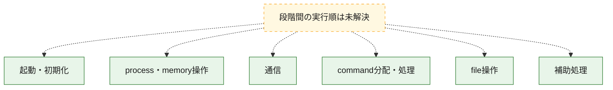
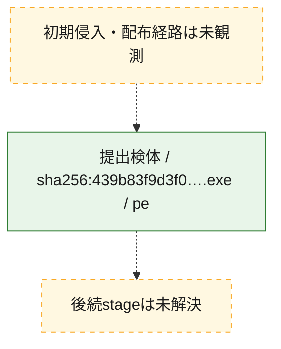
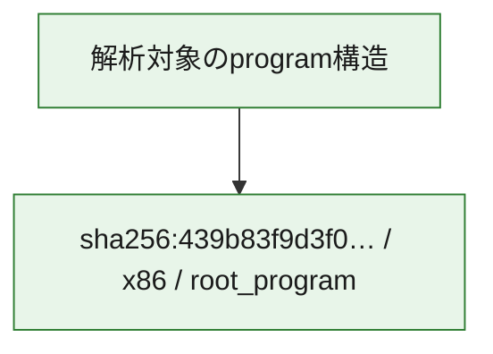

# 全体ロジック：439b83f9d3f075de229d97ca1f2ee6870db7f72accb003bfd88cfcc7fca51c8b

代表関数の静的証跡から、起動・初期化、process・memory操作、通信、command分配・処理、file操作の処理群を確認しました。

## 読み方

- phaseの掲載順は解析上の整理順です。observed_call_edgesがない段階間の実行順を断定しません。
- 図の実線は静的に観測した関係、点線と黄色のノードは未観測・未解決の関係を示します。
- 図は静的な要約であり、動的実行を再現するものではありません。
- 詳細な関数解説とfingerprintは[STATIC-LOGIC.md](STATIC-LOGIC.md)を参照してください。

## 静的可視化

### 実行フロー

### 感染チェーン

### モジュール関係

## 処理段階

### 1. 起動・初期化

entry pointから初期化と後続処理への移行を確認します。
確度: `confirmed_static_function_evidence`

- `439b83f9d3f075de229d97ca1f2ee6870db7f72accb003bfd88cfcc7fca51c8b:ghidra:14000ce20` — 初期化と主要処理への分岐を行う入口関数です。 状態: `succeeded`、選定理由: `entry_point`, `meaningful_symbol_name`, `reviewed_call_centrality:22`, `role:entrypoint`

### 2. process・memory操作

process、thread、module、memory操作と実行移行を確認します。
確度: `confirmed_static_function_evidence`

- `439b83f9d3f075de229d97ca1f2ee6870db7f72accb003bfd88cfcc7fca51c8b:ghidra:140001000` — process、thread、module、またはmemory操作に関係する関数です。 状態: `succeeded`、選定理由: `context_representative`, `reviewed_call_centrality:50`, `role:process_or_memory_operation`
- `439b83f9d3f075de229d97ca1f2ee6870db7f72accb003bfd88cfcc7fca51c8b:ghidra:1400037c0` — process、thread、module、またはmemory操作に関係する関数です。 状態: `succeeded`、選定理由: `context_representative`, `reviewed_call_centrality:47`, `role:process_or_memory_operation`

### 3. 通信

通信初期化、endpoint処理、送受信の役割を確認します。
確度: `confirmed_static_function_evidence`

- `439b83f9d3f075de229d97ca1f2ee6870db7f72accb003bfd88cfcc7fca51c8b:ghidra:140001ce0` — 通信初期化、送受信、またはendpoint処理に関係する関数です。 状態: `succeeded`、選定理由: `context_representative`, `reviewed_call_centrality:22`, `role:network_communication`

### 4. command分配・処理

受信commandやtaskの解釈、分配、個別handlerへの移行を確認します。
確度: `confirmed_static_function_evidence`

- `439b83f9d3f075de229d97ca1f2ee6870db7f72accb003bfd88cfcc7fca51c8b:ghidra:140002dd0` — commandの解釈、分配、または個別処理を担当する関数です。 状態: `succeeded`、選定理由: `context_representative`, `reviewed_call_centrality:4`, `role:command_dispatch_or_handler`
- `439b83f9d3f075de229d97ca1f2ee6870db7f72accb003bfd88cfcc7fca51c8b:ghidra:140002fe0` — commandの解釈、分配、または個別処理を担当する関数です。 状態: `succeeded`、選定理由: `context_representative`, `reviewed_call_centrality:11`, `role:command_dispatch_or_handler`
- `439b83f9d3f075de229d97ca1f2ee6870db7f72accb003bfd88cfcc7fca51c8b:ghidra:140003360` — commandの解釈、分配、または個別処理を担当する関数です。 状態: `succeeded`、選定理由: `context_representative`, `reviewed_call_centrality:17`, `role:command_dispatch_or_handler`

### 5. file操作

fileやdirectoryの作成、読書き、削除を確認します。
確度: `confirmed_static_function_evidence`

- `439b83f9d3f075de229d97ca1f2ee6870db7f72accb003bfd88cfcc7fca51c8b:ghidra:1400036b0` — fileまたはdirectoryの読書き・管理に関係する関数です。 状態: `succeeded`、選定理由: `context_representative`, `reviewed_call_centrality:14`, `role:file_operation`

### 6. 補助処理

主要処理を支える一般内部関数またはlibrary処理を確認します。
確度: `confirmed_static_function_evidence`

- `439b83f9d3f075de229d97ca1f2ee6870db7f72accb003bfd88cfcc7fca51c8b:ghidra:140001050` — 検体内部の一般処理を実装する関数です。 状態: `succeeded`、選定理由: `context_representative`, `reviewed_call_centrality:12`
- `439b83f9d3f075de229d97ca1f2ee6870db7f72accb003bfd88cfcc7fca51c8b:ghidra:140001210` — 検体内部の一般処理を実装する関数です。 状態: `succeeded`、選定理由: `context_representative`, `reviewed_call_centrality:15`
- `439b83f9d3f075de229d97ca1f2ee6870db7f72accb003bfd88cfcc7fca51c8b:ghidra:140001470` — 検体内部の一般処理を実装する関数です。 状態: `succeeded`、選定理由: `context_representative`, `reviewed_call_centrality:12`
- `439b83f9d3f075de229d97ca1f2ee6870db7f72accb003bfd88cfcc7fca51c8b:ghidra:140001600` — 検体内部の一般処理を実装する関数です。 状態: `succeeded`、選定理由: `context_representative`, `reviewed_call_centrality:13`
- `439b83f9d3f075de229d97ca1f2ee6870db7f72accb003bfd88cfcc7fca51c8b:ghidra:140001840` — 検体内部の一般処理を実装する関数です。 状態: `succeeded`、選定理由: `context_representative`, `reviewed_call_centrality:1`
- `439b83f9d3f075de229d97ca1f2ee6870db7f72accb003bfd88cfcc7fca51c8b:ghidra:140001900` — 検体内部の一般処理を実装する関数です。 状態: `succeeded`、選定理由: `context_representative`, `reviewed_call_centrality:10`
- `439b83f9d3f075de229d97ca1f2ee6870db7f72accb003bfd88cfcc7fca51c8b:ghidra:140001950` — 検体内部の一般処理を実装する関数です。 状態: `succeeded`、選定理由: `context_representative`, `reviewed_call_centrality:17`
- `439b83f9d3f075de229d97ca1f2ee6870db7f72accb003bfd88cfcc7fca51c8b:ghidra:140001c80` — 検体内部の一般処理を実装する関数です。 状態: `succeeded`、選定理由: `context_representative`, `reviewed_call_centrality:11`
- `439b83f9d3f075de229d97ca1f2ee6870db7f72accb003bfd88cfcc7fca51c8b:ghidra:1400020c0` — 検体内部の一般処理を実装する関数です。 状態: `succeeded`、選定理由: `context_representative`, `reviewed_call_centrality:10`
- `439b83f9d3f075de229d97ca1f2ee6870db7f72accb003bfd88cfcc7fca51c8b:ghidra:140002180` — 検体内部の一般処理を実装する関数です。 状態: `succeeded`、選定理由: `context_representative`, `reviewed_call_centrality:13`
- `439b83f9d3f075de229d97ca1f2ee6870db7f72accb003bfd88cfcc7fca51c8b:ghidra:140002390` — 検体内部の一般処理を実装する関数です。 状態: `succeeded`、選定理由: `context_representative`, `reviewed_call_centrality:15`
- `439b83f9d3f075de229d97ca1f2ee6870db7f72accb003bfd88cfcc7fca51c8b:ghidra:140002500` — 検体内部の一般処理を実装する関数です。 状態: `succeeded`、選定理由: `context_representative`, `reviewed_call_centrality:5`
- `439b83f9d3f075de229d97ca1f2ee6870db7f72accb003bfd88cfcc7fca51c8b:ghidra:1400025c0` — 検体内部の一般処理を実装する関数です。 状態: `succeeded`、選定理由: `context_representative`, `reviewed_call_centrality:4`
- `439b83f9d3f075de229d97ca1f2ee6870db7f72accb003bfd88cfcc7fca51c8b:ghidra:140002620` — 検体内部の一般処理を実装する関数です。 状態: `succeeded`、選定理由: `context_representative`, `reviewed_call_centrality:10`
- `439b83f9d3f075de229d97ca1f2ee6870db7f72accb003bfd88cfcc7fca51c8b:ghidra:1400026b0` — 検体内部の一般処理を実装する関数です。 状態: `succeeded`、選定理由: `context_representative`, `reviewed_call_centrality:5`
- `439b83f9d3f075de229d97ca1f2ee6870db7f72accb003bfd88cfcc7fca51c8b:ghidra:140002710` — 検体内部の一般処理を実装する関数です。 状態: `succeeded`、選定理由: `context_representative`, `reviewed_call_centrality:17`
- `439b83f9d3f075de229d97ca1f2ee6870db7f72accb003bfd88cfcc7fca51c8b:ghidra:140002810` — 検体内部の一般処理を実装する関数です。 状態: `succeeded`、選定理由: `context_representative`, `reviewed_call_centrality:9`
- `439b83f9d3f075de229d97ca1f2ee6870db7f72accb003bfd88cfcc7fca51c8b:ghidra:140002910` — 検体内部の一般処理を実装する関数です。 状態: `succeeded`、選定理由: `context_representative`, `reviewed_call_centrality:13`
- `439b83f9d3f075de229d97ca1f2ee6870db7f72accb003bfd88cfcc7fca51c8b:ghidra:140002a50` — 検体内部の一般処理を実装する関数です。 状態: `succeeded`、選定理由: `context_representative`, `reviewed_call_centrality:10`
- `439b83f9d3f075de229d97ca1f2ee6870db7f72accb003bfd88cfcc7fca51c8b:ghidra:140002b50` — 検体内部の一般処理を実装する関数です。 状態: `succeeded`、選定理由: `context_representative`, `reviewed_call_centrality:8`
- `439b83f9d3f075de229d97ca1f2ee6870db7f72accb003bfd88cfcc7fca51c8b:ghidra:140002c50` — 検体内部の一般処理を実装する関数です。 状態: `succeeded`、選定理由: `context_representative`, `reviewed_call_centrality:11`
- `439b83f9d3f075de229d97ca1f2ee6870db7f72accb003bfd88cfcc7fca51c8b:ghidra:1400033c0` — 検体内部の一般処理を実装する関数です。 状態: `succeeded`、選定理由: `context_representative`, `reviewed_call_centrality:17`
- `439b83f9d3f075de229d97ca1f2ee6870db7f72accb003bfd88cfcc7fca51c8b:ghidra:140003670` — 検体内部の一般処理を実装する関数です。 状態: `succeeded`、選定理由: `context_representative`, `reviewed_call_centrality:4`
- `439b83f9d3f075de229d97ca1f2ee6870db7f72accb003bfd88cfcc7fca51c8b:ghidra:1400036a0` — 検体内部の一般処理を実装する関数です。 状態: `succeeded`、選定理由: `meaningful_symbol_name`, `reviewed_call_centrality:2`

## 観測したcall関係

- 代表関数間で直接解決できた呼出関係はありません。

## 解析範囲と制約

- 選定外関数は全体inventoryへ残しますが、関数本体の個別解説対象にはしていません。
- indirect call、難読化、packer、VM、壊れたcontrol flowによりcall関係が欠落する場合があります。
- 文書は静的解析に基づき、検体実行や外部通信による動的確認は行っていません。
