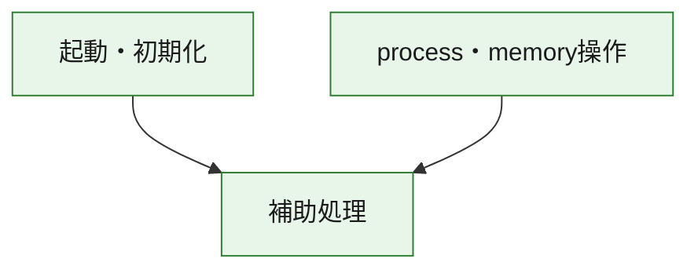
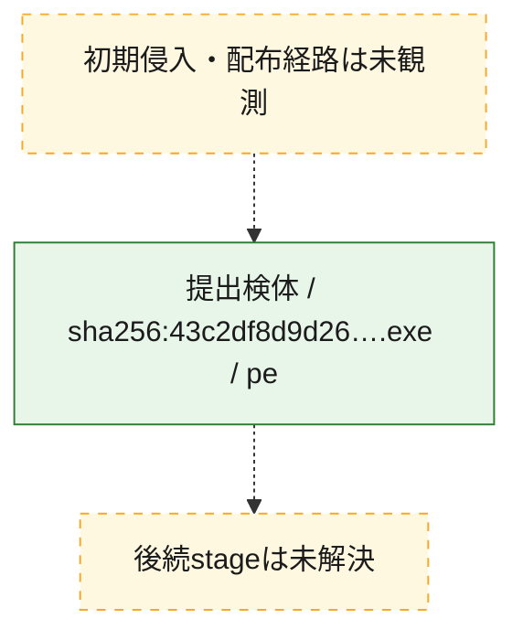
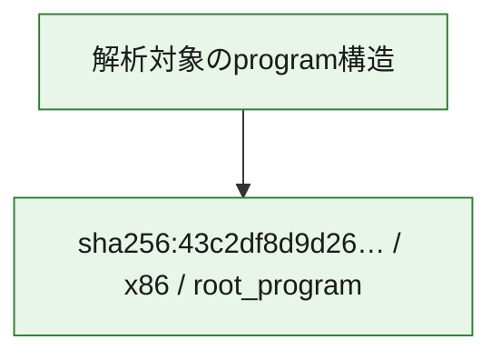

# 全体ロジック：43c2df8d9d262beec1153288cf47d77a4a0a147f7b24197a9a29bdf662e51d96

代表関数の静的証跡から、起動・初期化、process・memory操作の処理群を確認しました。

## 読み方

- phaseの掲載順は解析上の整理順です。observed_call_edgesがない段階間の実行順を断定しません。
- 図の実線は静的に観測した関係、点線と黄色のノードは未観測・未解決の関係を示します。
- 図は静的な要約であり、動的実行を再現するものではありません。
- 詳細な関数解説とfingerprintは[STATIC-LOGIC.md](STATIC-LOGIC.md)を参照してください。

## 静的可視化

### 実行フロー

### 感染チェーン

### モジュール関係

## 処理段階

### 1. 起動・初期化

entry pointから初期化と後続処理への移行を確認します。
確度: `confirmed_static_function_evidence`

- `43c2df8d9d262beec1153288cf47d77a4a0a147f7b24197a9a29bdf662e51d96:ghidra:140001440` — 初期化と主要処理への分岐を行う入口関数です。 状態: `succeeded`、選定理由: `entry_point`, `meaningful_symbol_name`, `reviewed_call_centrality:1`, `role:entrypoint`

### 2. process・memory操作

process、thread、module、memory操作と実行移行を確認します。
確度: `confirmed_static_function_evidence`

- `43c2df8d9d262beec1153288cf47d77a4a0a147f7b24197a9a29bdf662e51d96:ghidra:1400281b0` — process、thread、module、またはmemory操作に関係する関数です。 状態: `succeeded`、選定理由: `context_representative`, `reviewed_call_centrality:16`, `role:process_or_memory_operation`
- `43c2df8d9d262beec1153288cf47d77a4a0a147f7b24197a9a29bdf662e51d96:ghidra:140028210` — process、thread、module、またはmemory操作に関係する関数です。 状態: `succeeded`、選定理由: `context_representative`, `reviewed_call_centrality:12`, `role:process_or_memory_operation`

### 3. 補助処理

主要処理を支える一般内部関数またはlibrary処理を確認します。
確度: `confirmed_static_function_evidence_with_limits`

- `43c2df8d9d262beec1153288cf47d77a4a0a147f7b24197a9a29bdf662e51d96:ghidra:140001000` — 検体内部の一般処理を実装する関数です。 状態: `succeeded`、選定理由: `context_representative`
- `43c2df8d9d262beec1153288cf47d77a4a0a147f7b24197a9a29bdf662e51d96:ghidra:140001010` — 検体内部の一般処理を実装する関数です。 状態: `limited_bad_instruction_or_flow`、選定理由: `context_representative`, `reviewed_call_centrality:2`
- `43c2df8d9d262beec1153288cf47d77a4a0a147f7b24197a9a29bdf662e51d96:ghidra:140001020` — 検体内部の一般処理を実装する関数です。 状態: `succeeded`、選定理由: `context_representative`, `reviewed_call_centrality:35`
- `43c2df8d9d262beec1153288cf47d77a4a0a147f7b24197a9a29bdf662e51d96:ghidra:140001420` — 検体内部の一般処理を実装する関数です。 状態: `succeeded`、選定理由: `context_representative`, `reviewed_call_centrality:1`
- `43c2df8d9d262beec1153288cf47d77a4a0a147f7b24197a9a29bdf662e51d96:ghidra:140001460` — 検体内部の一般処理を実装する関数です。 状態: `limited_bad_instruction_or_flow`、選定理由: `context_representative`, `reviewed_call_centrality:2`
- `43c2df8d9d262beec1153288cf47d77a4a0a147f7b24197a9a29bdf662e51d96:ghidra:140001470` — 検体内部の一般処理を実装する関数です。 状態: `limited_bad_instruction_or_flow`、選定理由: `context_representative`, `reviewed_call_centrality:2`
- `43c2df8d9d262beec1153288cf47d77a4a0a147f7b24197a9a29bdf662e51d96:ghidra:140001480` — 検体内部の一般処理を実装する関数です。 状態: `succeeded`、選定理由: `context_representative`
- `43c2df8d9d262beec1153288cf47d77a4a0a147f7b24197a9a29bdf662e51d96:ghidra:140027ff0` — 検体内部の一般処理を実装する関数です。 状態: `succeeded`、選定理由: `context_representative`, `reviewed_call_centrality:1`
- `43c2df8d9d262beec1153288cf47d77a4a0a147f7b24197a9a29bdf662e51d96:ghidra:140028000` — compiler生成処理または汎用library処理とみられる関数です。 状態: `succeeded`、選定理由: `entry_point`, `meaningful_symbol_name`, `reviewed_call_centrality:7`
- `43c2df8d9d262beec1153288cf47d77a4a0a147f7b24197a9a29bdf662e51d96:ghidra:140028020` — compiler生成処理または汎用library処理とみられる関数です。 状態: `succeeded`、選定理由: `entry_point`, `meaningful_symbol_name`, `reviewed_call_centrality:4`
- `43c2df8d9d262beec1153288cf47d77a4a0a147f7b24197a9a29bdf662e51d96:ghidra:1400280a0` — 検体内部の一般処理を実装する関数です。 状態: `succeeded`、選定理由: `context_representative`
- `43c2df8d9d262beec1153288cf47d77a4a0a147f7b24197a9a29bdf662e51d96:ghidra:1400280b0` — 検体内部の一般処理を実装する関数です。 状態: `succeeded`、選定理由: `context_representative`, `reviewed_call_centrality:2`
- `43c2df8d9d262beec1153288cf47d77a4a0a147f7b24197a9a29bdf662e51d96:ghidra:140028380` — 検体内部の一般処理を実装する関数です。 状態: `succeeded`、選定理由: `context_representative`, `reviewed_call_centrality:4`
- `43c2df8d9d262beec1153288cf47d77a4a0a147f7b24197a9a29bdf662e51d96:ghidra:140028710` — 検体内部の一般処理を実装する関数です。 状態: `succeeded`、選定理由: `context_representative`
- `43c2df8d9d262beec1153288cf47d77a4a0a147f7b24197a9a29bdf662e51d96:ghidra:140028750` — 検体内部の一般処理を実装する関数です。 状態: `limited_bad_instruction_or_flow`、選定理由: `context_representative`, `reviewed_call_centrality:3`
- `43c2df8d9d262beec1153288cf47d77a4a0a147f7b24197a9a29bdf662e51d96:ghidra:140028760` — 検体内部の一般処理を実装する関数です。 状態: `succeeded`、選定理由: `context_representative`, `reviewed_call_centrality:2`
- `43c2df8d9d262beec1153288cf47d77a4a0a147f7b24197a9a29bdf662e51d96:ghidra:140028900` — 検体内部の一般処理を実装する関数です。 状態: `limited_bad_instruction_or_flow`、選定理由: `context_representative`, `reviewed_call_centrality:2`
- `43c2df8d9d262beec1153288cf47d77a4a0a147f7b24197a9a29bdf662e51d96:ghidra:140028ac0` — 検体内部の一般処理を実装する関数です。 状態: `limited_bad_instruction_or_flow`、選定理由: `context_representative`, `reviewed_call_centrality:10`
- `43c2df8d9d262beec1153288cf47d77a4a0a147f7b24197a9a29bdf662e51d96:ghidra:140028b30` — 検体内部の一般処理を実装する関数です。 状態: `succeeded`、選定理由: `context_representative`, `reviewed_call_centrality:5`
- `43c2df8d9d262beec1153288cf47d77a4a0a147f7b24197a9a29bdf662e51d96:ghidra:140028bc0` — 検体内部の一般処理を実装する関数です。 状態: `succeeded`、選定理由: `context_representative`, `reviewed_call_centrality:5`
- `43c2df8d9d262beec1153288cf47d77a4a0a147f7b24197a9a29bdf662e51d96:ghidra:140028c50` — 検体内部の一般処理を実装する関数です。 状態: `succeeded`、選定理由: `context_representative`, `reviewed_call_centrality:7`
- `43c2df8d9d262beec1153288cf47d77a4a0a147f7b24197a9a29bdf662e51d96:ghidra:140028d60` — 検体内部の一般処理を実装する関数です。 状態: `succeeded`、選定理由: `context_representative`, `reviewed_call_centrality:5`
- `43c2df8d9d262beec1153288cf47d77a4a0a147f7b24197a9a29bdf662e51d96:ghidra:140028d70` — 検体内部の一般処理を実装する関数です。 状態: `succeeded`、選定理由: `context_representative`
- `43c2df8d9d262beec1153288cf47d77a4a0a147f7b24197a9a29bdf662e51d96:ghidra:140028da0` — 検体内部の一般処理を実装する関数です。 状態: `succeeded`、選定理由: `context_representative`
- `43c2df8d9d262beec1153288cf47d77a4a0a147f7b24197a9a29bdf662e51d96:ghidra:140028df0` — 検体内部の一般処理を実装する関数です。 状態: `succeeded`、選定理由: `context_representative`, `reviewed_call_centrality:2`
- `43c2df8d9d262beec1153288cf47d77a4a0a147f7b24197a9a29bdf662e51d96:ghidra:140028e90` — 検体内部の一般処理を実装する関数です。 状態: `succeeded`、選定理由: `context_representative`, `reviewed_call_centrality:2`
- `43c2df8d9d262beec1153288cf47d77a4a0a147f7b24197a9a29bdf662e51d96:ghidra:140028f10` — 検体内部の一般処理を実装する関数です。 状態: `succeeded`、選定理由: `context_representative`, `reviewed_call_centrality:4`
- `43c2df8d9d262beec1153288cf47d77a4a0a147f7b24197a9a29bdf662e51d96:ghidra:140028f50` — 検体内部の一般処理を実装する関数です。 状態: `succeeded`、選定理由: `context_representative`
- `43c2df8d9d262beec1153288cf47d77a4a0a147f7b24197a9a29bdf662e51d96:ghidra:140028fd0` — 検体内部の一般処理を実装する関数です。 状態: `succeeded`、選定理由: `context_representative`, `reviewed_call_centrality:3`

## 観測したcall関係

- `43c2df8d9d262beec1153288cf47d77a4a0a147f7b24197a9a29bdf662e51d96:ghidra:140001020` → `43c2df8d9d262beec1153288cf47d77a4a0a147f7b24197a9a29bdf662e51d96:ghidra:140027ff0` （`support` → `support`）
- `43c2df8d9d262beec1153288cf47d77a4a0a147f7b24197a9a29bdf662e51d96:ghidra:140001020` → `43c2df8d9d262beec1153288cf47d77a4a0a147f7b24197a9a29bdf662e51d96:ghidra:140028020` （`support` → `support`）
- `43c2df8d9d262beec1153288cf47d77a4a0a147f7b24197a9a29bdf662e51d96:ghidra:140001020` → `43c2df8d9d262beec1153288cf47d77a4a0a147f7b24197a9a29bdf662e51d96:ghidra:140028380` （`support` → `support`）
- `43c2df8d9d262beec1153288cf47d77a4a0a147f7b24197a9a29bdf662e51d96:ghidra:140001020` → `43c2df8d9d262beec1153288cf47d77a4a0a147f7b24197a9a29bdf662e51d96:ghidra:140028750` （`support` → `support`）
- `43c2df8d9d262beec1153288cf47d77a4a0a147f7b24197a9a29bdf662e51d96:ghidra:140001020` → `43c2df8d9d262beec1153288cf47d77a4a0a147f7b24197a9a29bdf662e51d96:ghidra:140028d60` （`support` → `support`）
- `43c2df8d9d262beec1153288cf47d77a4a0a147f7b24197a9a29bdf662e51d96:ghidra:140001420` → `43c2df8d9d262beec1153288cf47d77a4a0a147f7b24197a9a29bdf662e51d96:ghidra:140001020` （`support` → `support`）
- `43c2df8d9d262beec1153288cf47d77a4a0a147f7b24197a9a29bdf662e51d96:ghidra:140001440` → `43c2df8d9d262beec1153288cf47d77a4a0a147f7b24197a9a29bdf662e51d96:ghidra:140001020` （`startup` → `support`）
- `43c2df8d9d262beec1153288cf47d77a4a0a147f7b24197a9a29bdf662e51d96:ghidra:140028000` → `43c2df8d9d262beec1153288cf47d77a4a0a147f7b24197a9a29bdf662e51d96:ghidra:140028ac0` （`support` → `support`）
- `43c2df8d9d262beec1153288cf47d77a4a0a147f7b24197a9a29bdf662e51d96:ghidra:140028000` → `43c2df8d9d262beec1153288cf47d77a4a0a147f7b24197a9a29bdf662e51d96:ghidra:140028d60` （`support` → `support`）
- `43c2df8d9d262beec1153288cf47d77a4a0a147f7b24197a9a29bdf662e51d96:ghidra:1400281b0` → `43c2df8d9d262beec1153288cf47d77a4a0a147f7b24197a9a29bdf662e51d96:ghidra:140028e90` （`execution` → `support`）
- `43c2df8d9d262beec1153288cf47d77a4a0a147f7b24197a9a29bdf662e51d96:ghidra:1400281b0` → `43c2df8d9d262beec1153288cf47d77a4a0a147f7b24197a9a29bdf662e51d96:ghidra:140028f10` （`execution` → `support`）
- `43c2df8d9d262beec1153288cf47d77a4a0a147f7b24197a9a29bdf662e51d96:ghidra:1400281b0` → `43c2df8d9d262beec1153288cf47d77a4a0a147f7b24197a9a29bdf662e51d96:ghidra:140028fd0` （`execution` → `support`）
- `43c2df8d9d262beec1153288cf47d77a4a0a147f7b24197a9a29bdf662e51d96:ghidra:140028210` → `43c2df8d9d262beec1153288cf47d77a4a0a147f7b24197a9a29bdf662e51d96:ghidra:1400281b0` （`execution` → `execution`）
- `43c2df8d9d262beec1153288cf47d77a4a0a147f7b24197a9a29bdf662e51d96:ghidra:140028210` → `43c2df8d9d262beec1153288cf47d77a4a0a147f7b24197a9a29bdf662e51d96:ghidra:140028e90` （`execution` → `support`）
- `43c2df8d9d262beec1153288cf47d77a4a0a147f7b24197a9a29bdf662e51d96:ghidra:140028210` → `43c2df8d9d262beec1153288cf47d77a4a0a147f7b24197a9a29bdf662e51d96:ghidra:140028f10` （`execution` → `support`）
- `43c2df8d9d262beec1153288cf47d77a4a0a147f7b24197a9a29bdf662e51d96:ghidra:140028210` → `43c2df8d9d262beec1153288cf47d77a4a0a147f7b24197a9a29bdf662e51d96:ghidra:140028fd0` （`execution` → `support`）
- `43c2df8d9d262beec1153288cf47d77a4a0a147f7b24197a9a29bdf662e51d96:ghidra:140028380` → `43c2df8d9d262beec1153288cf47d77a4a0a147f7b24197a9a29bdf662e51d96:ghidra:140028f10` （`support` → `support`）
- `43c2df8d9d262beec1153288cf47d77a4a0a147f7b24197a9a29bdf662e51d96:ghidra:140028760` → `43c2df8d9d262beec1153288cf47d77a4a0a147f7b24197a9a29bdf662e51d96:ghidra:140028d60` （`support` → `support`）
- `43c2df8d9d262beec1153288cf47d77a4a0a147f7b24197a9a29bdf662e51d96:ghidra:140028900` → `43c2df8d9d262beec1153288cf47d77a4a0a147f7b24197a9a29bdf662e51d96:ghidra:140028d60` （`support` → `support`）
- `43c2df8d9d262beec1153288cf47d77a4a0a147f7b24197a9a29bdf662e51d96:ghidra:140028c50` → `43c2df8d9d262beec1153288cf47d77a4a0a147f7b24197a9a29bdf662e51d96:ghidra:140028ac0` （`support` → `support`）
- `43c2df8d9d262beec1153288cf47d77a4a0a147f7b24197a9a29bdf662e51d96:ghidra:140028c50` → `43c2df8d9d262beec1153288cf47d77a4a0a147f7b24197a9a29bdf662e51d96:ghidra:140028d60` （`support` → `support`）
- `ghidra-function:0d36fdf4331d81b20cc1d361` → `ghidra-function:1762c73caeb62444aa7d6478` （`unclassified` → `unclassified`）
- `ghidra-function:0d36fdf4331d81b20cc1d361` → `ghidra-function:28987d1e6d95b8acb585d41d` （`unclassified` → `unclassified`）
- `ghidra-function:0d36fdf4331d81b20cc1d361` → `ghidra-function:3bb88c0e232500516558ac7e` （`unclassified` → `unclassified`）
- `ghidra-function:0d36fdf4331d81b20cc1d361` → `ghidra-function:41523f16d88ae3679b06ac35` （`unclassified` → `unclassified`）
- `ghidra-function:11bc22de930b343815276b12` → `ghidra-external:028bb9b0f4dc4aebcadec987` （`unclassified` → `unclassified`）
- `ghidra-function:1c47f898a984bb2d823b14e5` → `ghidra-external:22858deac7fe8a7d00c41665` （`unclassified` → `unclassified`）
- `ghidra-function:1c47f898a984bb2d823b14e5` → `ghidra-function:d9ae53b08ac259397ac9772e` （`unclassified` → `unclassified`）
- `ghidra-function:1fad23341d18ce0e32b5aaef` → `ghidra-external:b4b66479a171887dddf22fea` （`unclassified` → `unclassified`）
- `ghidra-function:1fad23341d18ce0e32b5aaef` → `ghidra-function:0d36fdf4331d81b20cc1d361` （`unclassified` → `unclassified`）
- `ghidra-function:1fad23341d18ce0e32b5aaef` → `ghidra-function:4f4b1adbdec19dcc75069fab` （`unclassified` → `unclassified`）
- `ghidra-function:1fad23341d18ce0e32b5aaef` → `ghidra-function:6ce55858a95268470e479c97` （`unclassified` → `unclassified`）
- `ghidra-function:1fad23341d18ce0e32b5aaef` → `ghidra-function:ae198ce3ff4e678deb64bdc2` （`unclassified` → `unclassified`）
- `ghidra-function:2204522f5a30096d843f1968` → `ghidra-external:cba0fc96f53db08f413fa94e` （`unclassified` → `unclassified`）
- `ghidra-function:2204522f5a30096d843f1968` → `ghidra-function:ae198ce3ff4e678deb64bdc2` （`unclassified` → `unclassified`）
- `ghidra-function:31170c7d47c917e715cd8409` → `ghidra-function:6702b9eaa55b232f4f9f72f0` （`unclassified` → `unclassified`）
- `ghidra-function:5260875eac0405788c7e66cb` → `ghidra-external:028bb9b0f4dc4aebcadec987` （`unclassified` → `unclassified`）
- `ghidra-function:5260875eac0405788c7e66cb` → `ghidra-external:0ce1f7e46eb65fe3b8603320` （`unclassified` → `unclassified`）
- `ghidra-function:5260875eac0405788c7e66cb` → `ghidra-external:25a1efc3a72da814c5d88584` （`unclassified` → `unclassified`）
- `ghidra-function:5260875eac0405788c7e66cb` → `ghidra-external:2c048a4089a746950dd0d814` （`unclassified` → `unclassified`）
- `ghidra-function:5260875eac0405788c7e66cb` → `ghidra-external:4e96108152988651fa9dd715` （`unclassified` → `unclassified`）
- `ghidra-function:5260875eac0405788c7e66cb` → `ghidra-external:4e9f401a804f979b45ce55ba` （`unclassified` → `unclassified`）
- `ghidra-function:5260875eac0405788c7e66cb` → `ghidra-external:679d863ad7ec08b773d8c05b` （`unclassified` → `unclassified`）
- `ghidra-function:5260875eac0405788c7e66cb` → `ghidra-external:80fae66820f7d43d6dfe7fd7` （`unclassified` → `unclassified`）
- `ghidra-function:5260875eac0405788c7e66cb` → `ghidra-external:89de22aac756eaa3766d162d` （`unclassified` → `unclassified`）
- `ghidra-function:5260875eac0405788c7e66cb` → `ghidra-external:8bfa6173810ae0a1845a5a44` （`unclassified` → `unclassified`）
- `ghidra-function:5260875eac0405788c7e66cb` → `ghidra-external:9c801a17c9faf84db984fc16` （`unclassified` → `unclassified`）
- `ghidra-function:5260875eac0405788c7e66cb` → `ghidra-external:a041a034ee25106844ab98fc` （`unclassified` → `unclassified`）
- `ghidra-function:5260875eac0405788c7e66cb` → `ghidra-external:a62e29740baa8258e410d7ef` （`unclassified` → `unclassified`）
- `ghidra-function:5260875eac0405788c7e66cb` → `ghidra-external:cb148984b94fb6ba611854f0` （`unclassified` → `unclassified`）
- `ghidra-function:5260875eac0405788c7e66cb` → `ghidra-external:cb39c0e37dc36fde829f0b07` （`unclassified` → `unclassified`）
- `ghidra-function:5260875eac0405788c7e66cb` → `ghidra-external:d75d42020f64828ca0173c5d` （`unclassified` → `unclassified`）
- `ghidra-function:5260875eac0405788c7e66cb` → `ghidra-function:18520b6fcedb8835211b4f26` （`unclassified` → `unclassified`）
- `ghidra-function:5260875eac0405788c7e66cb` → `ghidra-function:19635d60a32ebf07b25f1d05` （`unclassified` → `unclassified`）
- `ghidra-function:5260875eac0405788c7e66cb` → `ghidra-function:2329c596a60f664abef7884b` （`unclassified` → `unclassified`）
- `ghidra-function:5260875eac0405788c7e66cb` → `ghidra-function:565af65fbe85f0ebf1686cf6` （`unclassified` → `unclassified`）
- `ghidra-function:5260875eac0405788c7e66cb` → `ghidra-function:644acf20d4d82d681d5ac51b` （`unclassified` → `unclassified`）
- `ghidra-function:5260875eac0405788c7e66cb` → `ghidra-function:9ee98c920f580561a3cc5d76` （`unclassified` → `unclassified`）
- `ghidra-function:5260875eac0405788c7e66cb` → `ghidra-function:a50540d99df487fc69f794dc` （`unclassified` → `unclassified`）
- `ghidra-function:5260875eac0405788c7e66cb` → `ghidra-function:ae198ce3ff4e678deb64bdc2` （`unclassified` → `unclassified`）
- `ghidra-function:5260875eac0405788c7e66cb` → `ghidra-function:c6312e72ad2d17f535af0ebb` （`unclassified` → `unclassified`）
- `ghidra-function:5260875eac0405788c7e66cb` → `ghidra-function:ca4574216c38a76eb79a7f53` （`unclassified` → `unclassified`）
- `ghidra-function:5260875eac0405788c7e66cb` → `ghidra-function:cdc0bb1f63c8d6eae60a9110` （`unclassified` → `unclassified`）
- `ghidra-function:5260875eac0405788c7e66cb` → `ghidra-function:d2f204f29b67ec648a954ac2` （`unclassified` → `unclassified`）
- `ghidra-function:5260875eac0405788c7e66cb` → `ghidra-function:d2fdab5ddf4c1529e8b964b2` （`unclassified` → `unclassified`）
- `ghidra-function:5260875eac0405788c7e66cb` → `ghidra-function:d9ae53b08ac259397ac9772e` （`unclassified` → `unclassified`）
- `ghidra-function:5260875eac0405788c7e66cb` → `ghidra-function:eb89761e13346361aad1b1a5` （`unclassified` → `unclassified`）
- `ghidra-function:59d0f55182e27dc279141db4` → `ghidra-function:5260875eac0405788c7e66cb` （`unclassified` → `unclassified`）
- `ghidra-function:81377648a92873dfddca4a66` → `ghidra-external:028bb9b0f4dc4aebcadec987` （`unclassified` → `unclassified`）
- `ghidra-function:8b82bf8b152b3743a96dc232` → `ghidra-external:b4b66479a171887dddf22fea` （`unclassified` → `unclassified`）
- `ghidra-function:8b82bf8b152b3743a96dc232` → `ghidra-function:0d36fdf4331d81b20cc1d361` （`unclassified` → `unclassified`）
- `ghidra-function:8b82bf8b152b3743a96dc232` → `ghidra-function:4f4b1adbdec19dcc75069fab` （`unclassified` → `unclassified`）
- `ghidra-function:8b82bf8b152b3743a96dc232` → `ghidra-function:6ce55858a95268470e479c97` （`unclassified` → `unclassified`）
- `ghidra-function:8b82bf8b152b3743a96dc232` → `ghidra-function:ae198ce3ff4e678deb64bdc2` （`unclassified` → `unclassified`）
- `ghidra-function:9ee98c920f580561a3cc5d76` → `ghidra-external:028bb9b0f4dc4aebcadec987` （`unclassified` → `unclassified`）
- `ghidra-function:9ee98c920f580561a3cc5d76` → `ghidra-external:e3cdffac7189386c5fb108c4` （`unclassified` → `unclassified`）
- `ghidra-function:9ee98c920f580561a3cc5d76` → `ghidra-function:81377648a92873dfddca4a66` （`unclassified` → `unclassified`）
- `ghidra-function:9f693fa2a09f7481b7af2900` → `ghidra-function:0e09677fcc7d7239c7d6a7e5` （`unclassified` → `unclassified`）
- `ghidra-function:a5f8c2a78510cd2683452482` → `ghidra-external:028bb9b0f4dc4aebcadec987` （`unclassified` → `unclassified`）
- `ghidra-function:a5f8c2a78510cd2683452482` → `ghidra-external:22858deac7fe8a7d00c41665` （`unclassified` → `unclassified`）
- `ghidra-function:a5f8c2a78510cd2683452482` → `ghidra-external:9ff3cb31fda643a4b3cda4ae` （`unclassified` → `unclassified`）
- `ghidra-function:a5f8c2a78510cd2683452482` → `ghidra-external:cb148984b94fb6ba611854f0` （`unclassified` → `unclassified`）
- `ghidra-function:a5f8c2a78510cd2683452482` → `ghidra-external:e3cdffac7189386c5fb108c4` （`unclassified` → `unclassified`）
- `ghidra-function:a5f8c2a78510cd2683452482` → `ghidra-function:11bc22de930b343815276b12` （`unclassified` → `unclassified`）
- `ghidra-function:a5f8c2a78510cd2683452482` → `ghidra-function:3bb88c0e232500516558ac7e` （`unclassified` → `unclassified`）
- `ghidra-function:a5f8c2a78510cd2683452482` → `ghidra-function:81377648a92873dfddca4a66` （`unclassified` → `unclassified`）
- `ghidra-function:a5f8c2a78510cd2683452482` → `ghidra-function:9c6585790256cb45eee798a0` （`unclassified` → `unclassified`）
- `ghidra-function:a5f8c2a78510cd2683452482` → `ghidra-function:d090a422bc726e87e599ef6b` （`unclassified` → `unclassified`）
- `ghidra-function:a5f8c2a78510cd2683452482` → `ghidra-function:d9ae53b08ac259397ac9772e` （`unclassified` → `unclassified`）
- `ghidra-function:a5f8c2a78510cd2683452482` → `ghidra-function:f0e82ed9fea83e98a08b0110` （`unclassified` → `unclassified`）
- `ghidra-function:a8243903a5ad4f0547ecc420` → `ghidra-function:5260875eac0405788c7e66cb` （`unclassified` → `unclassified`）
- `ghidra-function:b0a398292504060b41450f6b` → `ghidra-external:4e9f401a804f979b45ce55ba` （`unclassified` → `unclassified`）
- `ghidra-function:b0a398292504060b41450f6b` → `ghidra-external:72d7adcef24bfd026d50da2a` （`unclassified` → `unclassified`）
- `ghidra-function:bf4f957398c302091644a9b9` → `ghidra-external:cba0fc96f53db08f413fa94e` （`unclassified` → `unclassified`）
- `ghidra-function:bf4f957398c302091644a9b9` → `ghidra-function:ae198ce3ff4e678deb64bdc2` （`unclassified` → `unclassified`）
- `ghidra-function:ca4574216c38a76eb79a7f53` → `ghidra-function:e6067c10cf6aa2f310068bbf` （`unclassified` → `unclassified`）
- `ghidra-function:cdc0bb1f63c8d6eae60a9110` → `ghidra-external:028bb9b0f4dc4aebcadec987` （`unclassified` → `unclassified`）
- `ghidra-function:cdc0bb1f63c8d6eae60a9110` → `ghidra-function:6ce55858a95268470e479c97` （`unclassified` → `unclassified`）
- `ghidra-function:d52d63e4933e443e7857d090` → `ghidra-external:3956b73a22fb6b319654af5c` （`unclassified` → `unclassified`）
- `ghidra-function:d52d63e4933e443e7857d090` → `ghidra-function:1762c73caeb62444aa7d6478` （`unclassified` → `unclassified`）
- `ghidra-function:d52d63e4933e443e7857d090` → `ghidra-function:28987d1e6d95b8acb585d41d` （`unclassified` → `unclassified`）
- `ghidra-function:d73063d82550e232b223b5ed` → `ghidra-external:028bb9b0f4dc4aebcadec987` （`unclassified` → `unclassified`）
- `ghidra-function:d73063d82550e232b223b5ed` → `ghidra-external:e3cdffac7189386c5fb108c4` （`unclassified` → `unclassified`）
- `ghidra-function:d73063d82550e232b223b5ed` → `ghidra-function:11bc22de930b343815276b12` （`unclassified` → `unclassified`）
- `ghidra-function:d73063d82550e232b223b5ed` → `ghidra-function:3bb88c0e232500516558ac7e` （`unclassified` → `unclassified`）
- `ghidra-function:d73063d82550e232b223b5ed` → `ghidra-function:81377648a92873dfddca4a66` （`unclassified` → `unclassified`）
- `ghidra-function:d73063d82550e232b223b5ed` → `ghidra-function:9c6585790256cb45eee798a0` （`unclassified` → `unclassified`）
- `ghidra-function:d73063d82550e232b223b5ed` → `ghidra-function:a5f8c2a78510cd2683452482` （`unclassified` → `unclassified`）
- `ghidra-function:d73063d82550e232b223b5ed` → `ghidra-function:d090a422bc726e87e599ef6b` （`unclassified` → `unclassified`）
- `ghidra-function:d73063d82550e232b223b5ed` → `ghidra-function:f0e82ed9fea83e98a08b0110` （`unclassified` → `unclassified`）
- `ghidra-function:f9348b2124b2bf632e95e268` → `ghidra-external:b4b66479a171887dddf22fea` （`unclassified` → `unclassified`）
- `ghidra-function:f9348b2124b2bf632e95e268` → `ghidra-function:1762c73caeb62444aa7d6478` （`unclassified` → `unclassified`）
- `ghidra-function:f9348b2124b2bf632e95e268` → `ghidra-function:28987d1e6d95b8acb585d41d` （`unclassified` → `unclassified`）
- `ghidra-function:fade692d6b3934d7407e7ca9` → `ghidra-function:0e09677fcc7d7239c7d6a7e5` （`unclassified` → `unclassified`）

## 解析範囲と制約

- 選定外関数は全体inventoryへ残しますが、関数本体の個別解説対象にはしていません。
- indirect call、難読化、packer、VM、壊れたcontrol flowによりcall関係が欠落する場合があります。
- 文書は静的解析に基づき、検体実行や外部通信による動的確認は行っていません。
