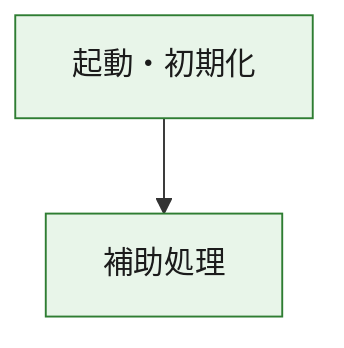
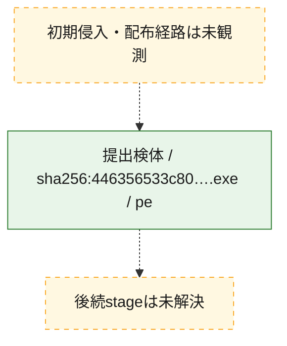
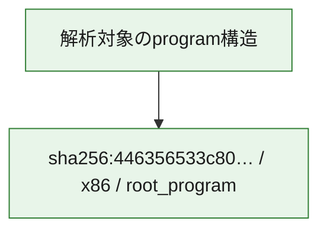

# 全体ロジック：446356533c809d5f4659cd918dc9796ee30180054369cc5563a5997e291e7d9d

代表関数の静的証跡から、起動・初期化の処理群を確認しました。

## 読み方

- phaseの掲載順は解析上の整理順です。observed_call_edgesがない段階間の実行順を断定しません。
- 図の実線は静的に観測した関係、点線と黄色のノードは未観測・未解決の関係を示します。
- 図は静的な要約であり、動的実行を再現するものではありません。
- 詳細な関数解説とfingerprintは[STATIC-LOGIC.md](STATIC-LOGIC.md)を参照してください。

## 静的可視化

### 実行フロー

### 感染チェーン

### モジュール関係

## 処理段階

### 1. 起動・初期化

entry pointから初期化と後続処理への移行を確認します。
確度: `confirmed_static_function_evidence`

- `446356533c809d5f4659cd918dc9796ee30180054369cc5563a5997e291e7d9d:ghidra:180001010` — 初期化と主要処理への分岐を行う入口関数です。 状態: `succeeded`、選定理由: `entry_point`, `meaningful_symbol_name`, `reviewed_call_centrality:22`, `role:entrypoint`, `small_program_complete_context`

### 2. 補助処理

主要処理を支える一般内部関数またはlibrary処理を確認します。
確度: `confirmed_static_function_evidence`

- `446356533c809d5f4659cd918dc9796ee30180054369cc5563a5997e291e7d9d:ghidra:180001240` — 検体内部の一般処理を実装する関数です。 状態: `succeeded`、選定理由: `context_representative`, `reviewed_call_centrality:2`, `small_program_complete_context`
- `446356533c809d5f4659cd918dc9796ee30180054369cc5563a5997e291e7d9d:ghidra:180001350` — 検体内部の一般処理を実装する関数です。 状態: `succeeded`、選定理由: `context_representative`, `reviewed_call_centrality:25`, `small_program_complete_context`
- `446356533c809d5f4659cd918dc9796ee30180054369cc5563a5997e291e7d9d:ghidra:180003780` — 検体内部の一般処理を実装する関数です。 状態: `succeeded`、選定理由: `context_representative`, `reviewed_call_centrality:2`, `small_program_complete_context`
- `446356533c809d5f4659cd918dc9796ee30180054369cc5563a5997e291e7d9d:ghidra:1800038e0` — 検体内部の一般処理を実装する関数です。 状態: `succeeded`、選定理由: `context_representative`, `reviewed_call_centrality:2`, `small_program_complete_context`

## 観測したcall関係

- `446356533c809d5f4659cd918dc9796ee30180054369cc5563a5997e291e7d9d:ghidra:180001010` → `446356533c809d5f4659cd918dc9796ee30180054369cc5563a5997e291e7d9d:ghidra:180001240` （`startup` → `support`）
- `446356533c809d5f4659cd918dc9796ee30180054369cc5563a5997e291e7d9d:ghidra:180001010` → `446356533c809d5f4659cd918dc9796ee30180054369cc5563a5997e291e7d9d:ghidra:180001350` （`startup` → `support`）
- `446356533c809d5f4659cd918dc9796ee30180054369cc5563a5997e291e7d9d:ghidra:180001350` → `446356533c809d5f4659cd918dc9796ee30180054369cc5563a5997e291e7d9d:ghidra:180001240` （`support` → `support`）
- `446356533c809d5f4659cd918dc9796ee30180054369cc5563a5997e291e7d9d:ghidra:180001350` → `446356533c809d5f4659cd918dc9796ee30180054369cc5563a5997e291e7d9d:ghidra:180003780` （`support` → `support`）
- `446356533c809d5f4659cd918dc9796ee30180054369cc5563a5997e291e7d9d:ghidra:180001350` → `446356533c809d5f4659cd918dc9796ee30180054369cc5563a5997e291e7d9d:ghidra:1800038e0` （`support` → `support`）
- `446356533c809d5f4659cd918dc9796ee30180054369cc5563a5997e291e7d9d:ghidra:180003780` → `446356533c809d5f4659cd918dc9796ee30180054369cc5563a5997e291e7d9d:ghidra:1800038e0` （`support` → `support`）
- `ghidra-function:4f3ff689e79b59193578d2a3` → `ghidra-function:111207802acaae27186b66bb` （`unclassified` → `unclassified`）
- `ghidra-function:4f3ff689e79b59193578d2a3` → `ghidra-function:2217029317a1ccb7c93690f9` （`unclassified` → `unclassified`）
- `ghidra-function:4f3ff689e79b59193578d2a3` → `ghidra-function:25876c0808f41608a180e21d` （`unclassified` → `unclassified`）
- `ghidra-function:4f3ff689e79b59193578d2a3` → `ghidra-function:26ffdf4a90b728becd58822f` （`unclassified` → `unclassified`）
- `ghidra-function:4f3ff689e79b59193578d2a3` → `ghidra-function:344ef153523eaf8ebd74d19b` （`unclassified` → `unclassified`）
- `ghidra-function:4f3ff689e79b59193578d2a3` → `ghidra-function:4df16854a76a267e1b464c29` （`unclassified` → `unclassified`）
- `ghidra-function:4f3ff689e79b59193578d2a3` → `ghidra-function:5102ba866a7d0026acfcb8c4` （`unclassified` → `unclassified`）
- `ghidra-function:4f3ff689e79b59193578d2a3` → `ghidra-function:7cded8e06283b7574e77cb10` （`unclassified` → `unclassified`）
- `ghidra-function:4f3ff689e79b59193578d2a3` → `ghidra-function:8520d539ec701cfd079e93e2` （`unclassified` → `unclassified`）
- `ghidra-function:4f3ff689e79b59193578d2a3` → `ghidra-function:8f80e3575397c56edca2ba98` （`unclassified` → `unclassified`）
- `ghidra-function:4f3ff689e79b59193578d2a3` → `ghidra-function:d4482d5eb6f1d2dfef787186` （`unclassified` → `unclassified`）
- `ghidra-function:4f3ff689e79b59193578d2a3` → `ghidra-function:e5c8327cc4cb0c950625ab57` （`unclassified` → `unclassified`）
- `ghidra-function:8520d539ec701cfd079e93e2` → `ghidra-external:0202dfd5476f1f415b51fd9d` （`unclassified` → `unclassified`）
- `ghidra-function:8520d539ec701cfd079e93e2` → `ghidra-external:1d277b98589910cec74bd8fd` （`unclassified` → `unclassified`）
- `ghidra-function:8520d539ec701cfd079e93e2` → `ghidra-external:1d749e03c9b9044b97d82d6a` （`unclassified` → `unclassified`）
- `ghidra-function:8520d539ec701cfd079e93e2` → `ghidra-external:2560c92f02f5fb231b9e1eb1` （`unclassified` → `unclassified`）
- `ghidra-function:8520d539ec701cfd079e93e2` → `ghidra-external:28fc7f087021ebd51d604b1d` （`unclassified` → `unclassified`）
- `ghidra-function:8520d539ec701cfd079e93e2` → `ghidra-external:2a04b24358f5e0026ec2516e` （`unclassified` → `unclassified`）
- `ghidra-function:8520d539ec701cfd079e93e2` → `ghidra-external:3818ba856cf2fe1b482b6299` （`unclassified` → `unclassified`）
- `ghidra-function:8520d539ec701cfd079e93e2` → `ghidra-external:50d64430ead258e9ce52aad6` （`unclassified` → `unclassified`）
- `ghidra-function:8520d539ec701cfd079e93e2` → `ghidra-external:54608b37c7ffa35c0fd57bf5` （`unclassified` → `unclassified`）
- `ghidra-function:8520d539ec701cfd079e93e2` → `ghidra-external:557c71be0ab157a1d7275bb5` （`unclassified` → `unclassified`）
- `ghidra-function:8520d539ec701cfd079e93e2` → `ghidra-external:596b8b886e98078abe7ebebf` （`unclassified` → `unclassified`）
- `ghidra-function:8520d539ec701cfd079e93e2` → `ghidra-external:6eb4f92b5b4bb53b873c804a` （`unclassified` → `unclassified`）
- `ghidra-function:8520d539ec701cfd079e93e2` → `ghidra-external:801503ef0520735bbfcab4c3` （`unclassified` → `unclassified`）
- `ghidra-function:8520d539ec701cfd079e93e2` → `ghidra-external:960fbc7414cb3b19b3d079ab` （`unclassified` → `unclassified`）
- `ghidra-function:8520d539ec701cfd079e93e2` → `ghidra-external:b45ce402d9ea662545116f80` （`unclassified` → `unclassified`）
- `ghidra-function:8520d539ec701cfd079e93e2` → `ghidra-external:c79f8891d9e3e7cec9a8448f` （`unclassified` → `unclassified`）
- `ghidra-function:8520d539ec701cfd079e93e2` → `ghidra-external:d28c47d46ff9e75a1350dea2` （`unclassified` → `unclassified`）
- `ghidra-function:8520d539ec701cfd079e93e2` → `ghidra-external:d8c1bd4dc0ca420aa540d2df` （`unclassified` → `unclassified`）
- `ghidra-function:8520d539ec701cfd079e93e2` → `ghidra-external:db8f480ecb248e124615ab64` （`unclassified` → `unclassified`）
- `ghidra-function:8520d539ec701cfd079e93e2` → `ghidra-external:f19cc6417911242ef640f715` （`unclassified` → `unclassified`）
- `ghidra-function:8520d539ec701cfd079e93e2` → `ghidra-external:f728c298f4340ab1151cc049` （`unclassified` → `unclassified`）
- `ghidra-function:8520d539ec701cfd079e93e2` → `ghidra-function:2217029317a1ccb7c93690f9` （`unclassified` → `unclassified`）
- `ghidra-function:8520d539ec701cfd079e93e2` → `ghidra-function:8f4264d8bc018d7e63d87f27` （`unclassified` → `unclassified`）
- `ghidra-function:8520d539ec701cfd079e93e2` → `ghidra-function:d500dab7e4a4a52e57535d57` （`unclassified` → `unclassified`）
- `ghidra-function:8f4264d8bc018d7e63d87f27` → `ghidra-function:d500dab7e4a4a52e57535d57` （`unclassified` → `unclassified`）

## 解析範囲と制約

- 選定外関数は全体inventoryへ残しますが、関数本体の個別解説対象にはしていません。
- indirect call、難読化、packer、VM、壊れたcontrol flowによりcall関係が欠落する場合があります。
- 文書は静的解析に基づき、検体実行や外部通信による動的確認は行っていません。
