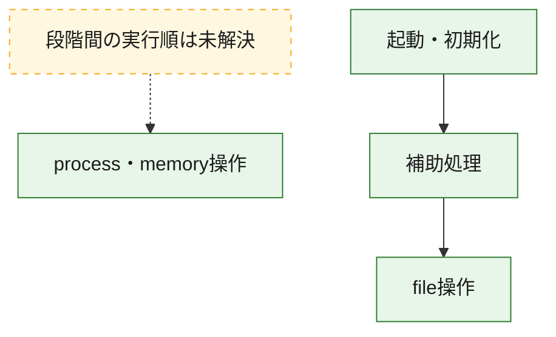
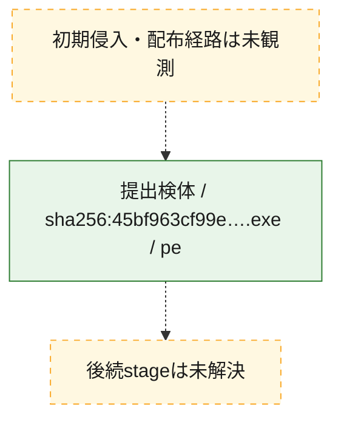
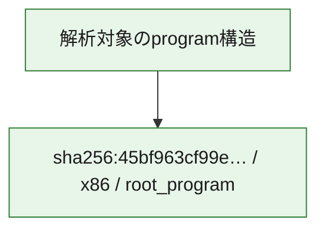

# 全体ロジック：45bf963cf99e7417b323f265ea94ded4e71a82153b39e483e45213898bfa65c0

代表関数の静的証跡から、起動・初期化、process・memory操作、file操作の処理群を確認しました。

## 読み方

- phaseの掲載順は解析上の整理順です。observed_call_edgesがない段階間の実行順を断定しません。
- 図の実線は静的に観測した関係、点線と黄色のノードは未観測・未解決の関係を示します。
- 図は静的な要約であり、動的実行を再現するものではありません。
- 詳細な関数解説とfingerprintは[STATIC-LOGIC.md](STATIC-LOGIC.md)を参照してください。

## 静的可視化

### 実行フロー

### 感染チェーン

### モジュール関係

## 処理段階

### 1. 起動・初期化

entry pointから初期化と後続処理への移行を確認します。
確度: `confirmed_static_function_evidence`

- `45bf963cf99e7417b323f265ea94ded4e71a82153b39e483e45213898bfa65c0:ghidra:2c0013e0` — 初期化と主要処理への分岐を行う入口関数です。 状態: `succeeded`、選定理由: `entry_point`, `meaningful_symbol_name`, `reviewed_call_centrality:1`, `role:entrypoint`

### 2. process・memory操作

process、thread、module、memory操作と実行移行を確認します。
確度: `confirmed_static_function_evidence`

- `45bf963cf99e7417b323f265ea94ded4e71a82153b39e483e45213898bfa65c0:ghidra:2c0018f0` — process、thread、module、またはmemory操作に関係する関数です。 状態: `succeeded`、選定理由: `context_representative`, `reviewed_call_centrality:16`, `role:process_or_memory_operation`
- `45bf963cf99e7417b323f265ea94ded4e71a82153b39e483e45213898bfa65c0:ghidra:2c001960` — process、thread、module、またはmemory操作に関係する関数です。 状態: `succeeded`、選定理由: `context_representative`, `reviewed_call_centrality:12`, `role:process_or_memory_operation`

### 3. file操作

fileやdirectoryの作成、読書き、削除を確認します。
確度: `confirmed_static_function_evidence`

- `45bf963cf99e7417b323f265ea94ded4e71a82153b39e483e45213898bfa65c0:ghidra:2c001480` — fileまたはdirectoryの読書き・管理に関係する関数です。 状態: `succeeded`、選定理由: `context_representative`, `reviewed_call_centrality:10`, `role:file_operation`

### 4. 補助処理

主要処理を支える一般内部関数またはlibrary処理を確認します。
確度: `confirmed_static_function_evidence_with_limits`

- `45bf963cf99e7417b323f265ea94ded4e71a82153b39e483e45213898bfa65c0:ghidra:2c001000` — 検体内部の一般処理を実装する関数です。 状態: `succeeded`、選定理由: `context_representative`
- `45bf963cf99e7417b323f265ea94ded4e71a82153b39e483e45213898bfa65c0:ghidra:2c001010` — 検体内部の一般処理を実装する関数です。 状態: `succeeded`、選定理由: `context_representative`, `reviewed_call_centrality:6`
- `45bf963cf99e7417b323f265ea94ded4e71a82153b39e483e45213898bfa65c0:ghidra:2c001140` — 検体内部の一般処理を実装する関数です。 状態: `succeeded`、選定理由: `context_representative`, `reviewed_call_centrality:1`
- `45bf963cf99e7417b323f265ea94ded4e71a82153b39e483e45213898bfa65c0:ghidra:2c001190` — 検体内部の一般処理を実装する関数です。 状態: `succeeded`、選定理由: `context_representative`, `reviewed_call_centrality:21`
- `45bf963cf99e7417b323f265ea94ded4e71a82153b39e483e45213898bfa65c0:ghidra:2c001410` — 検体内部の一般処理を実装する関数です。 状態: `succeeded`、選定理由: `context_representative`, `reviewed_call_centrality:1`
- `45bf963cf99e7417b323f265ea94ded4e71a82153b39e483e45213898bfa65c0:ghidra:2c001440` — 検体内部の一般処理を実装する関数です。 状態: `succeeded`、選定理由: `context_representative`, `reviewed_call_centrality:1`
- `45bf963cf99e7417b323f265ea94ded4e71a82153b39e483e45213898bfa65c0:ghidra:2c001460` — 検体内部の一般処理を実装する関数です。 状態: `succeeded`、選定理由: `context_representative`, `reviewed_call_centrality:1`
- `45bf963cf99e7417b323f265ea94ded4e71a82153b39e483e45213898bfa65c0:ghidra:2c001470` — 検体内部の一般処理を実装する関数です。 状態: `succeeded`、選定理由: `context_representative`
- `45bf963cf99e7417b323f265ea94ded4e71a82153b39e483e45213898bfa65c0:ghidra:2c001540` — 検体内部の一般処理を実装する関数です。 状態: `succeeded`、選定理由: `context_representative`, `reviewed_call_centrality:2`
- `45bf963cf99e7417b323f265ea94ded4e71a82153b39e483e45213898bfa65c0:ghidra:2c001570` — 検体内部の一般処理を実装する関数です。 状態: `succeeded`、選定理由: `context_representative`, `reviewed_call_centrality:2`
- `45bf963cf99e7417b323f265ea94ded4e71a82153b39e483e45213898bfa65c0:ghidra:2c001610` — 検体内部の一般処理を実装する関数です。 状態: `succeeded`、選定理由: `context_representative`
- `45bf963cf99e7417b323f265ea94ded4e71a82153b39e483e45213898bfa65c0:ghidra:2c001660` — 検体内部の一般処理を実装する関数です。 状態: `succeeded`、選定理由: `context_representative`, `reviewed_call_centrality:1`
- `45bf963cf99e7417b323f265ea94ded4e71a82153b39e483e45213898bfa65c0:ghidra:2c0016e0` — 検体内部の一般処理を実装する関数です。 状態: `succeeded`、選定理由: `context_representative`, `reviewed_call_centrality:2`
- `45bf963cf99e7417b323f265ea94ded4e71a82153b39e483e45213898bfa65c0:ghidra:2c001700` — 検体内部の一般処理を実装する関数です。 状態: `succeeded`、選定理由: `context_representative`, `reviewed_call_centrality:1`
- `45bf963cf99e7417b323f265ea94ded4e71a82153b39e483e45213898bfa65c0:ghidra:2c001710` — compiler生成処理または汎用library処理とみられる関数です。 状態: `succeeded`、選定理由: `entry_point`, `meaningful_symbol_name`, `reviewed_call_centrality:1`
- `45bf963cf99e7417b323f265ea94ded4e71a82153b39e483e45213898bfa65c0:ghidra:2c001740` — compiler生成処理または汎用library処理とみられる関数です。 状態: `succeeded`、選定理由: `entry_point`, `meaningful_symbol_name`, `reviewed_call_centrality:3`
- `45bf963cf99e7417b323f265ea94ded4e71a82153b39e483e45213898bfa65c0:ghidra:2c0017d0` — 検体内部の一般処理を実装する関数です。 状態: `succeeded`、選定理由: `context_representative`
- `45bf963cf99e7417b323f265ea94ded4e71a82153b39e483e45213898bfa65c0:ghidra:2c0017e0` — 検体内部の一般処理を実装する関数です。 状態: `succeeded`、選定理由: `context_representative`, `reviewed_call_centrality:2`
- `45bf963cf99e7417b323f265ea94ded4e71a82153b39e483e45213898bfa65c0:ghidra:2c0018e0` — 検体内部の一般処理を実装する関数です。 状態: `succeeded`、選定理由: `context_representative`, `reviewed_call_centrality:3`
- `45bf963cf99e7417b323f265ea94ded4e71a82153b39e483e45213898bfa65c0:ghidra:2c001ad0` — 検体内部の一般処理を実装する関数です。 状態: `succeeded`、選定理由: `context_representative`, `reviewed_call_centrality:4`
- `45bf963cf99e7417b323f265ea94ded4e71a82153b39e483e45213898bfa65c0:ghidra:2c001e30` — 検体内部の一般処理を実装する関数です。 状態: `succeeded`、選定理由: `context_representative`
- `45bf963cf99e7417b323f265ea94ded4e71a82153b39e483e45213898bfa65c0:ghidra:2c001e70` — 検体内部の一般処理を実装する関数です。 状態: `limited_bad_instruction_or_flow`、選定理由: `context_representative`, `reviewed_call_centrality:3`
- `45bf963cf99e7417b323f265ea94ded4e71a82153b39e483e45213898bfa65c0:ghidra:2c001e80` — 検体内部の一般処理を実装する関数です。 状態: `limited_bad_instruction_or_flow`、選定理由: `context_representative`, `reviewed_call_centrality:2`
- `45bf963cf99e7417b323f265ea94ded4e71a82153b39e483e45213898bfa65c0:ghidra:2c002040` — 検体内部の一般処理を実装する関数です。 状態: `limited_bad_instruction_or_flow`、選定理由: `context_representative`, `reviewed_call_centrality:9`
- `45bf963cf99e7417b323f265ea94ded4e71a82153b39e483e45213898bfa65c0:ghidra:2c0020c0` — 検体内部の一般処理を実装する関数です。 状態: `succeeded`、選定理由: `context_representative`, `reviewed_call_centrality:5`
- `45bf963cf99e7417b323f265ea94ded4e71a82153b39e483e45213898bfa65c0:ghidra:2c002140` — 検体内部の一般処理を実装する関数です。 状態: `succeeded`、選定理由: `context_representative`, `reviewed_call_centrality:5`
- `45bf963cf99e7417b323f265ea94ded4e71a82153b39e483e45213898bfa65c0:ghidra:2c0021e0` — 検体内部の一般処理を実装する関数です。 状態: `succeeded`、選定理由: `context_representative`, `reviewed_call_centrality:9`
- `45bf963cf99e7417b323f265ea94ded4e71a82153b39e483e45213898bfa65c0:ghidra:2c0022e0` — 検体内部の一般処理を実装する関数です。 状態: `succeeded`、選定理由: `context_representative`

## 観測したcall関係

- `45bf963cf99e7417b323f265ea94ded4e71a82153b39e483e45213898bfa65c0:ghidra:2c001010` → `45bf963cf99e7417b323f265ea94ded4e71a82153b39e483e45213898bfa65c0:ghidra:2c001700` （`support` → `support`）
- `45bf963cf99e7417b323f265ea94ded4e71a82153b39e483e45213898bfa65c0:ghidra:2c001010` → `45bf963cf99e7417b323f265ea94ded4e71a82153b39e483e45213898bfa65c0:ghidra:2c001e70` （`support` → `support`）
- `45bf963cf99e7417b323f265ea94ded4e71a82153b39e483e45213898bfa65c0:ghidra:2c001190` → `45bf963cf99e7417b323f265ea94ded4e71a82153b39e483e45213898bfa65c0:ghidra:2c0016e0` （`support` → `support`）
- `45bf963cf99e7417b323f265ea94ded4e71a82153b39e483e45213898bfa65c0:ghidra:2c001190` → `45bf963cf99e7417b323f265ea94ded4e71a82153b39e483e45213898bfa65c0:ghidra:2c001740` （`support` → `support`）
- `45bf963cf99e7417b323f265ea94ded4e71a82153b39e483e45213898bfa65c0:ghidra:2c001190` → `45bf963cf99e7417b323f265ea94ded4e71a82153b39e483e45213898bfa65c0:ghidra:2c0018e0` （`support` → `support`）
- `45bf963cf99e7417b323f265ea94ded4e71a82153b39e483e45213898bfa65c0:ghidra:2c001190` → `45bf963cf99e7417b323f265ea94ded4e71a82153b39e483e45213898bfa65c0:ghidra:2c001ad0` （`support` → `support`）
- `45bf963cf99e7417b323f265ea94ded4e71a82153b39e483e45213898bfa65c0:ghidra:2c0013e0` → `45bf963cf99e7417b323f265ea94ded4e71a82153b39e483e45213898bfa65c0:ghidra:2c001190` （`startup` → `support`）
- `45bf963cf99e7417b323f265ea94ded4e71a82153b39e483e45213898bfa65c0:ghidra:2c001410` → `45bf963cf99e7417b323f265ea94ded4e71a82153b39e483e45213898bfa65c0:ghidra:2c001190` （`support` → `support`）
- `45bf963cf99e7417b323f265ea94ded4e71a82153b39e483e45213898bfa65c0:ghidra:2c001570` → `45bf963cf99e7417b323f265ea94ded4e71a82153b39e483e45213898bfa65c0:ghidra:2c001480` （`support` → `file_activity`）
- `45bf963cf99e7417b323f265ea94ded4e71a82153b39e483e45213898bfa65c0:ghidra:2c001570` → `45bf963cf99e7417b323f265ea94ded4e71a82153b39e483e45213898bfa65c0:ghidra:2c001540` （`support` → `support`）
- `45bf963cf99e7417b323f265ea94ded4e71a82153b39e483e45213898bfa65c0:ghidra:2c001710` → `45bf963cf99e7417b323f265ea94ded4e71a82153b39e483e45213898bfa65c0:ghidra:2c0021e0` （`support` → `support`）
- `45bf963cf99e7417b323f265ea94ded4e71a82153b39e483e45213898bfa65c0:ghidra:2c001740` → `45bf963cf99e7417b323f265ea94ded4e71a82153b39e483e45213898bfa65c0:ghidra:2c0021e0` （`support` → `support`）
- `45bf963cf99e7417b323f265ea94ded4e71a82153b39e483e45213898bfa65c0:ghidra:2c001960` → `45bf963cf99e7417b323f265ea94ded4e71a82153b39e483e45213898bfa65c0:ghidra:2c0018f0` （`execution` → `execution`）
- `45bf963cf99e7417b323f265ea94ded4e71a82153b39e483e45213898bfa65c0:ghidra:2c001e80` → `45bf963cf99e7417b323f265ea94ded4e71a82153b39e483e45213898bfa65c0:ghidra:2c0018e0` （`support` → `support`）
- `45bf963cf99e7417b323f265ea94ded4e71a82153b39e483e45213898bfa65c0:ghidra:2c0021e0` → `45bf963cf99e7417b323f265ea94ded4e71a82153b39e483e45213898bfa65c0:ghidra:2c0018e0` （`support` → `support`）
- `45bf963cf99e7417b323f265ea94ded4e71a82153b39e483e45213898bfa65c0:ghidra:2c0021e0` → `45bf963cf99e7417b323f265ea94ded4e71a82153b39e483e45213898bfa65c0:ghidra:2c002040` （`support` → `support`）
- `ghidra-function:0059e6daa26c06d865098ef9` → `ghidra-function:0d80c41e7a986caacb244a34` （`unclassified` → `unclassified`）
- `ghidra-function:01ab8926480cfc91ce406d48` → `ghidra-external:a9db2fe8ce2a1839ab2cc5e0` （`unclassified` → `unclassified`）
- `ghidra-function:01ab8926480cfc91ce406d48` → `ghidra-function:2c75cb0bb920ffbea9512638` （`unclassified` → `unclassified`）
- `ghidra-function:01ab8926480cfc91ce406d48` → `ghidra-function:5389f09dacc7bf1963043177` （`unclassified` → `unclassified`）
- `ghidra-function:01ab8926480cfc91ce406d48` → `ghidra-function:c4035941b6787bec88325dd8` （`unclassified` → `unclassified`）
- `ghidra-function:01ab8926480cfc91ce406d48` → `ghidra-function:f23a3ae5d08494edd9cce281` （`unclassified` → `unclassified`）
- `ghidra-function:03ba869c155103803f14a787` → `ghidra-function:ac7c5bc95c868ef16dad8fd3` （`unclassified` → `unclassified`）
- `ghidra-function:0ba09ab10cf35a2c3c936fc7` → `ghidra-function:ac7c5bc95c868ef16dad8fd3` （`unclassified` → `unclassified`）
- `ghidra-function:0bf267939457febbff315138` → `ghidra-function:5d7d1f6eae5a46018b3a2bf8` （`unclassified` → `unclassified`）
- `ghidra-function:0bf267939457febbff315138` → `ghidra-function:b07257cd1b2f48f8dcb21610` （`unclassified` → `unclassified`）
- `ghidra-function:0bf267939457febbff315138` → `ghidra-function:b34e6fad41057254f84c7704` （`unclassified` → `unclassified`）
- `ghidra-function:0bf267939457febbff315138` → `ghidra-function:d67eff6e26264550afcb8404` （`unclassified` → `unclassified`）
- `ghidra-function:1c7d647feb386fdd9e0966af` → `ghidra-external:fad2a022160f137f944eb229` （`unclassified` → `unclassified`）
- `ghidra-function:1c7d647feb386fdd9e0966af` → `ghidra-function:0bf267939457febbff315138` （`unclassified` → `unclassified`）
- `ghidra-function:1c7d647feb386fdd9e0966af` → `ghidra-function:3ab32823daccfecf908b991b` （`unclassified` → `unclassified`）
- `ghidra-function:1c7d647feb386fdd9e0966af` → `ghidra-function:770af74d0914a2897dcb8469` （`unclassified` → `unclassified`）
- `ghidra-function:1c7d647feb386fdd9e0966af` → `ghidra-function:862741eb86151e35b43a41c5` （`unclassified` → `unclassified`）
- `ghidra-function:3217135de400a186accae85f` → `ghidra-external:69f5987ceb5bb65df1c49911` （`unclassified` → `unclassified`）
- `ghidra-function:3217135de400a186accae85f` → `ghidra-function:d715f46bb28c3d9575115475` （`unclassified` → `unclassified`）
- `ghidra-function:405267a7fb184fcbb8091109` → `ghidra-external:6fa23a53585af51455b2fd7e` （`unclassified` → `unclassified`）
- `ghidra-function:48f75a4d595ba664a6aa5197` → `ghidra-external:22eb492bdc4b47cf681e2931` （`unclassified` → `unclassified`）
- `ghidra-function:48f75a4d595ba664a6aa5197` → `ghidra-external:50f02381dddb3ba78bb8e1b8` （`unclassified` → `unclassified`）
- `ghidra-function:48f75a4d595ba664a6aa5197` → `ghidra-external:a0e1cc0a692d34c4d20bad1c` （`unclassified` → `unclassified`）
- `ghidra-function:48f75a4d595ba664a6aa5197` → `ghidra-external:a375715d5baa183e2a822460` （`unclassified` → `unclassified`）
- `ghidra-function:48f75a4d595ba664a6aa5197` → `ghidra-external:b7f4263ac572cb547a9bbfb4` （`unclassified` → `unclassified`）
- `ghidra-function:48f75a4d595ba664a6aa5197` → `ghidra-function:1f149fa2fa2c1ea69ea7ea93` （`unclassified` → `unclassified`）
- `ghidra-function:48f75a4d595ba664a6aa5197` → `ghidra-function:226504ec17063a277e367411` （`unclassified` → `unclassified`）
- `ghidra-function:48f75a4d595ba664a6aa5197` → `ghidra-function:4d3fb0faf78ead8180b24722` （`unclassified` → `unclassified`）
- `ghidra-function:48f75a4d595ba664a6aa5197` → `ghidra-function:843dde1d9b050212e9308c83` （`unclassified` → `unclassified`）
- `ghidra-function:48f75a4d595ba664a6aa5197` → `ghidra-function:d67eff6e26264550afcb8404` （`unclassified` → `unclassified`）
- `ghidra-function:48f75a4d595ba664a6aa5197` → `ghidra-function:d715f46bb28c3d9575115475` （`unclassified` → `unclassified`）
- `ghidra-function:48f75a4d595ba664a6aa5197` → `ghidra-function:e14198b664605105e63e110d` （`unclassified` → `unclassified`）
- `ghidra-function:5e7c9ba9d8d6d1b8bacf2a22` → `ghidra-external:22eb492bdc4b47cf681e2931` （`unclassified` → `unclassified`）
- `ghidra-function:5e7c9ba9d8d6d1b8bacf2a22` → `ghidra-external:b7f4263ac572cb547a9bbfb4` （`unclassified` → `unclassified`）
- `ghidra-function:5e7c9ba9d8d6d1b8bacf2a22` → `ghidra-function:1f149fa2fa2c1ea69ea7ea93` （`unclassified` → `unclassified`）
- `ghidra-function:5e7c9ba9d8d6d1b8bacf2a22` → `ghidra-function:226504ec17063a277e367411` （`unclassified` → `unclassified`）
- `ghidra-function:5e7c9ba9d8d6d1b8bacf2a22` → `ghidra-function:48f75a4d595ba664a6aa5197` （`unclassified` → `unclassified`）
- `ghidra-function:5e7c9ba9d8d6d1b8bacf2a22` → `ghidra-function:4d3fb0faf78ead8180b24722` （`unclassified` → `unclassified`）
- `ghidra-function:5e7c9ba9d8d6d1b8bacf2a22` → `ghidra-function:843dde1d9b050212e9308c83` （`unclassified` → `unclassified`）
- `ghidra-function:5e7c9ba9d8d6d1b8bacf2a22` → `ghidra-function:d67eff6e26264550afcb8404` （`unclassified` → `unclassified`）
- `ghidra-function:5e7c9ba9d8d6d1b8bacf2a22` → `ghidra-function:e14198b664605105e63e110d` （`unclassified` → `unclassified`）
- `ghidra-function:894d635ca3f974b00521c6dc` → `ghidra-external:22eb492bdc4b47cf681e2931` （`unclassified` → `unclassified`）
- `ghidra-function:894d635ca3f974b00521c6dc` → `ghidra-external:b7f4263ac572cb547a9bbfb4` （`unclassified` → `unclassified`）
- `ghidra-function:894d635ca3f974b00521c6dc` → `ghidra-function:226504ec17063a277e367411` （`unclassified` → `unclassified`）
- `ghidra-function:9340ebe32550d2104db71818` → `ghidra-external:b7f4263ac572cb547a9bbfb4` （`unclassified` → `unclassified`）
- `ghidra-function:9340ebe32550d2104db71818` → `ghidra-external:da74b2934e4ed644f07e4e22` （`unclassified` → `unclassified`）
- `ghidra-function:9340ebe32550d2104db71818` → `ghidra-function:0059e6daa26c06d865098ef9` （`unclassified` → `unclassified`）
- `ghidra-function:9340ebe32550d2104db71818` → `ghidra-function:11a6a80795fe9487e651321f` （`unclassified` → `unclassified`）
- `ghidra-function:9340ebe32550d2104db71818` → `ghidra-function:8af4af5110388a887a06070b` （`unclassified` → `unclassified`）
- `ghidra-function:9340ebe32550d2104db71818` → `ghidra-function:a3e67e4ef01b918ecaa28c3c` （`unclassified` → `unclassified`）
- `ghidra-function:943d07225da24e43df287863` → `ghidra-external:fad2a022160f137f944eb229` （`unclassified` → `unclassified`）
- `ghidra-function:943d07225da24e43df287863` → `ghidra-function:5d7d1f6eae5a46018b3a2bf8` （`unclassified` → `unclassified`）
- `ghidra-function:943d07225da24e43df287863` → `ghidra-function:b34e6fad41057254f84c7704` （`unclassified` → `unclassified`）
- `ghidra-function:9c01ad25ceeed592ee1dcffd` → `ghidra-external:91d85850d6a836894e905f60` （`unclassified` → `unclassified`）
- `ghidra-function:abba713baa3969bc53ee30c8` → `ghidra-external:c797dbcc87e9b50e84aec2c6` （`unclassified` → `unclassified`）
- `ghidra-function:abba713baa3969bc53ee30c8` → `ghidra-function:5d7d1f6eae5a46018b3a2bf8` （`unclassified` → `unclassified`）
- `ghidra-function:abba713baa3969bc53ee30c8` → `ghidra-function:b34e6fad41057254f84c7704` （`unclassified` → `unclassified`）
- `ghidra-function:ac7c5bc95c868ef16dad8fd3` → `ghidra-external:3e299d3b05163d07711d0ec3` （`unclassified` → `unclassified`）
- `ghidra-function:ac7c5bc95c868ef16dad8fd3` → `ghidra-external:423456a28c6a7602489385e5` （`unclassified` → `unclassified`）
- `ghidra-function:ac7c5bc95c868ef16dad8fd3` → `ghidra-external:4ecc91e61b1d2e3281f8d8ac` （`unclassified` → `unclassified`）
- `ghidra-function:ac7c5bc95c868ef16dad8fd3` → `ghidra-external:60a18577877dc8d8298b784e` （`unclassified` → `unclassified`）
- `ghidra-function:ac7c5bc95c868ef16dad8fd3` → `ghidra-external:8d65eb1fc79311d2d20752b2` （`unclassified` → `unclassified`）
- `ghidra-function:ac7c5bc95c868ef16dad8fd3` → `ghidra-external:a9db2fe8ce2a1839ab2cc5e0` （`unclassified` → `unclassified`）
- `ghidra-function:ac7c5bc95c868ef16dad8fd3` → `ghidra-external:adfd0465441601f3f132a58d` （`unclassified` → `unclassified`）
- `ghidra-function:ac7c5bc95c868ef16dad8fd3` → `ghidra-external:bf5a7d9c773f18afac2f2141` （`unclassified` → `unclassified`）
- `ghidra-function:ac7c5bc95c868ef16dad8fd3` → `ghidra-external:f8e656dbf53974cdcdb8ab75` （`unclassified` → `unclassified`）
- `ghidra-function:ac7c5bc95c868ef16dad8fd3` → `ghidra-function:06b1a7c96c86537952716fe9` （`unclassified` → `unclassified`）
- `ghidra-function:ac7c5bc95c868ef16dad8fd3` → `ghidra-function:0957b58247bbe178b0dcb07f` （`unclassified` → `unclassified`）
- `ghidra-function:ac7c5bc95c868ef16dad8fd3` → `ghidra-function:405267a7fb184fcbb8091109` （`unclassified` → `unclassified`）
- `ghidra-function:ac7c5bc95c868ef16dad8fd3` → `ghidra-function:49435bdf71f25e978b0a0be6` （`unclassified` → `unclassified`）
- `ghidra-function:ac7c5bc95c868ef16dad8fd3` → `ghidra-function:862741eb86151e35b43a41c5` （`unclassified` → `unclassified`）
- `ghidra-function:ac7c5bc95c868ef16dad8fd3` → `ghidra-function:894d635ca3f974b00521c6dc` （`unclassified` → `unclassified`）
- `ghidra-function:ac7c5bc95c868ef16dad8fd3` → `ghidra-function:b846360766aeb6268a5082cd` （`unclassified` → `unclassified`）
- `ghidra-function:ac7c5bc95c868ef16dad8fd3` → `ghidra-function:d36b73b16078bf57fac34537` （`unclassified` → `unclassified`）
- `ghidra-function:af041c8b47a9764783a54db9` → `ghidra-function:dccf1a5831feeaf9f5374c72` （`unclassified` → `unclassified`）
- `ghidra-function:b06bed1ef76da92fbeadcd66` → `ghidra-function:1c7d647feb386fdd9e0966af` （`unclassified` → `unclassified`）
- `ghidra-function:d36b73b16078bf57fac34537` → `ghidra-external:b7f4263ac572cb547a9bbfb4` （`unclassified` → `unclassified`）
- `ghidra-function:d36b73b16078bf57fac34537` → `ghidra-function:1c7d647feb386fdd9e0966af` （`unclassified` → `unclassified`）
- `ghidra-function:d4798ce1a4ad0c26669de44e` → `ghidra-external:223f7a7e3ec4be58ccabcccd` （`unclassified` → `unclassified`）
- `ghidra-function:d4798ce1a4ad0c26669de44e` → `ghidra-function:862741eb86151e35b43a41c5` （`unclassified` → `unclassified`）
- `ghidra-function:dec77509139575036cc45805` → `ghidra-function:01ab8926480cfc91ce406d48` （`unclassified` → `unclassified`）
- `ghidra-function:dec77509139575036cc45805` → `ghidra-function:af041c8b47a9764783a54db9` （`unclassified` → `unclassified`）
- `ghidra-function:e025f31cfcb68d0f5c7874b2` → `ghidra-external:6fa23a53585af51455b2fd7e` （`unclassified` → `unclassified`）
- `ghidra-function:e7b8c4da3bf5a997cf1d0d1b` → `ghidra-external:6fa23a53585af51455b2fd7e` （`unclassified` → `unclassified`）
- `ghidra-function:fb604ea0ea753464ec67c130` → `ghidra-external:6fa23a53585af51455b2fd7e` （`unclassified` → `unclassified`）

## 解析範囲と制約

- 選定外関数は全体inventoryへ残しますが、関数本体の個別解説対象にはしていません。
- indirect call、難読化、packer、VM、壊れたcontrol flowによりcall関係が欠落する場合があります。
- 文書は静的解析に基づき、検体実行や外部通信による動的確認は行っていません。
