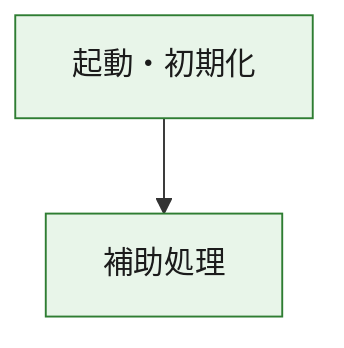
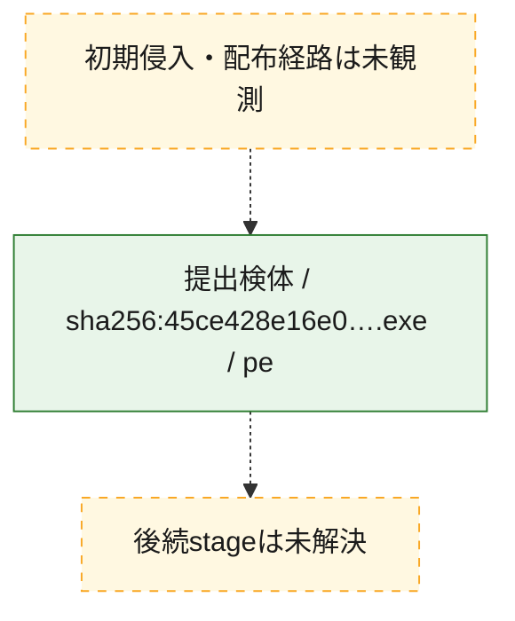
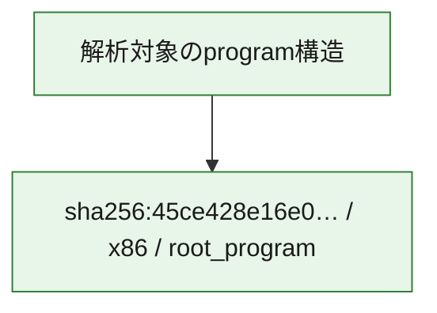

# 全体ロジック：45ce428e16e0a892f74371a4ce4c909bc738e88da9af93c9ef9165f793e48e12

代表関数の静的証跡から、起動・初期化の処理群を確認しました。

## 読み方

- phaseの掲載順は解析上の整理順です。observed_call_edgesがない段階間の実行順を断定しません。
- 図の実線は静的に観測した関係、点線と黄色のノードは未観測・未解決の関係を示します。
- 図は静的な要約であり、動的実行を再現するものではありません。
- 詳細な関数解説とfingerprintは[STATIC-LOGIC.md](STATIC-LOGIC.md)を参照してください。

## 静的可視化

### 実行フロー

### 感染チェーン

### モジュール関係

## 処理段階

### 1. 起動・初期化

entry pointから初期化と後続処理への移行を確認します。
確度: `confirmed_static_function_evidence`

- `45ce428e16e0a892f74371a4ce4c909bc738e88da9af93c9ef9165f793e48e12:ghidra:180001010` — 初期化と主要処理への分岐を行う入口関数です。 状態: `succeeded`、選定理由: `entry_point`, `meaningful_symbol_name`, `reviewed_call_centrality:22`, `role:entrypoint`, `small_program_complete_context`

### 2. 補助処理

主要処理を支える一般内部関数またはlibrary処理を確認します。
確度: `confirmed_static_function_evidence`

- `45ce428e16e0a892f74371a4ce4c909bc738e88da9af93c9ef9165f793e48e12:ghidra:180001240` — 検体内部の一般処理を実装する関数です。 状態: `succeeded`、選定理由: `context_representative`, `reviewed_call_centrality:2`, `small_program_complete_context`
- `45ce428e16e0a892f74371a4ce4c909bc738e88da9af93c9ef9165f793e48e12:ghidra:180001350` — 検体内部の一般処理を実装する関数です。 状態: `succeeded`、選定理由: `context_representative`, `reviewed_call_centrality:25`, `small_program_complete_context`
- `45ce428e16e0a892f74371a4ce4c909bc738e88da9af93c9ef9165f793e48e12:ghidra:180003780` — 検体内部の一般処理を実装する関数です。 状態: `succeeded`、選定理由: `context_representative`, `reviewed_call_centrality:2`, `small_program_complete_context`
- `45ce428e16e0a892f74371a4ce4c909bc738e88da9af93c9ef9165f793e48e12:ghidra:1800038e0` — 検体内部の一般処理を実装する関数です。 状態: `succeeded`、選定理由: `context_representative`, `reviewed_call_centrality:2`, `small_program_complete_context`

## 観測したcall関係

- `45ce428e16e0a892f74371a4ce4c909bc738e88da9af93c9ef9165f793e48e12:ghidra:180001010` → `45ce428e16e0a892f74371a4ce4c909bc738e88da9af93c9ef9165f793e48e12:ghidra:180001240` （`startup` → `support`）
- `45ce428e16e0a892f74371a4ce4c909bc738e88da9af93c9ef9165f793e48e12:ghidra:180001010` → `45ce428e16e0a892f74371a4ce4c909bc738e88da9af93c9ef9165f793e48e12:ghidra:180001350` （`startup` → `support`）
- `45ce428e16e0a892f74371a4ce4c909bc738e88da9af93c9ef9165f793e48e12:ghidra:180001350` → `45ce428e16e0a892f74371a4ce4c909bc738e88da9af93c9ef9165f793e48e12:ghidra:180001240` （`support` → `support`）
- `45ce428e16e0a892f74371a4ce4c909bc738e88da9af93c9ef9165f793e48e12:ghidra:180001350` → `45ce428e16e0a892f74371a4ce4c909bc738e88da9af93c9ef9165f793e48e12:ghidra:180003780` （`support` → `support`）
- `45ce428e16e0a892f74371a4ce4c909bc738e88da9af93c9ef9165f793e48e12:ghidra:180001350` → `45ce428e16e0a892f74371a4ce4c909bc738e88da9af93c9ef9165f793e48e12:ghidra:1800038e0` （`support` → `support`）
- `45ce428e16e0a892f74371a4ce4c909bc738e88da9af93c9ef9165f793e48e12:ghidra:180003780` → `45ce428e16e0a892f74371a4ce4c909bc738e88da9af93c9ef9165f793e48e12:ghidra:1800038e0` （`support` → `support`）
- `ghidra-function:1305c24329e9c95fec186630` → `ghidra-function:02a72c78212362c1cbe69e42` （`unclassified` → `unclassified`）
- `ghidra-function:1305c24329e9c95fec186630` → `ghidra-function:0fcf8d00c0515c95044b2d67` （`unclassified` → `unclassified`）
- `ghidra-function:1305c24329e9c95fec186630` → `ghidra-function:13304a1729c94328a8035788` （`unclassified` → `unclassified`）
- `ghidra-function:1305c24329e9c95fec186630` → `ghidra-function:1742395c46188e5bf000aa21` （`unclassified` → `unclassified`）
- `ghidra-function:1305c24329e9c95fec186630` → `ghidra-function:1c637fae5cd5b33a751ab44d` （`unclassified` → `unclassified`）
- `ghidra-function:1305c24329e9c95fec186630` → `ghidra-function:38294f06b3760f204f05c47b` （`unclassified` → `unclassified`）
- `ghidra-function:1305c24329e9c95fec186630` → `ghidra-function:39c0d079163968fcf1896103` （`unclassified` → `unclassified`）
- `ghidra-function:1305c24329e9c95fec186630` → `ghidra-function:960875321a564c9e96975147` （`unclassified` → `unclassified`）
- `ghidra-function:1305c24329e9c95fec186630` → `ghidra-function:9a85f95f080e331aafbc653c` （`unclassified` → `unclassified`）
- `ghidra-function:1305c24329e9c95fec186630` → `ghidra-function:c2a902726c6ee80725e75e52` （`unclassified` → `unclassified`）
- `ghidra-function:1305c24329e9c95fec186630` → `ghidra-function:fd28e42c237154aa02463bbf` （`unclassified` → `unclassified`）
- `ghidra-function:1305c24329e9c95fec186630` → `ghidra-function:fe344b28514a399137cecf26` （`unclassified` → `unclassified`）
- `ghidra-function:4d4f8fe3901846c0eb5c6335` → `ghidra-function:0b1c7f52b898829835218c70` （`unclassified` → `unclassified`）
- `ghidra-function:fe344b28514a399137cecf26` → `ghidra-external:11c31767b43bbcde20e43ec2` （`unclassified` → `unclassified`）
- `ghidra-function:fe344b28514a399137cecf26` → `ghidra-external:2689d1d28c72b9581bbce66c` （`unclassified` → `unclassified`）
- `ghidra-function:fe344b28514a399137cecf26` → `ghidra-external:2b46f9bd00b809337a652168` （`unclassified` → `unclassified`）
- `ghidra-function:fe344b28514a399137cecf26` → `ghidra-external:3665820fced22c15ad097389` （`unclassified` → `unclassified`）
- `ghidra-function:fe344b28514a399137cecf26` → `ghidra-external:3a57bf14a02cbcf9f34ccc38` （`unclassified` → `unclassified`）
- `ghidra-function:fe344b28514a399137cecf26` → `ghidra-external:49fd9daba9baedc96d574cf6` （`unclassified` → `unclassified`）
- `ghidra-function:fe344b28514a399137cecf26` → `ghidra-external:538e1011d5bcdba64c70ebc1` （`unclassified` → `unclassified`）
- `ghidra-function:fe344b28514a399137cecf26` → `ghidra-external:580c4a1a02482dcd5968b2b3` （`unclassified` → `unclassified`）
- `ghidra-function:fe344b28514a399137cecf26` → `ghidra-external:75ae7c17a74e399ef4ce4d3e` （`unclassified` → `unclassified`）
- `ghidra-function:fe344b28514a399137cecf26` → `ghidra-external:7d14699b4fcab12c09afde93` （`unclassified` → `unclassified`）
- `ghidra-function:fe344b28514a399137cecf26` → `ghidra-external:878cf8f7d7d264333efac13c` （`unclassified` → `unclassified`）
- `ghidra-function:fe344b28514a399137cecf26` → `ghidra-external:8c0db2546aeaac6a03dc98fe` （`unclassified` → `unclassified`）
- `ghidra-function:fe344b28514a399137cecf26` → `ghidra-external:94af3c4ab7b5f87a8cc0e3fc` （`unclassified` → `unclassified`）
- `ghidra-function:fe344b28514a399137cecf26` → `ghidra-external:a08a8859e02bccc7c440d02f` （`unclassified` → `unclassified`）
- `ghidra-function:fe344b28514a399137cecf26` → `ghidra-external:a451823ee2239f4a742cdc7f` （`unclassified` → `unclassified`）
- `ghidra-function:fe344b28514a399137cecf26` → `ghidra-external:a6c383626e4958e88b40f092` （`unclassified` → `unclassified`）
- `ghidra-function:fe344b28514a399137cecf26` → `ghidra-external:b08b57cbae5974e9785d80cf` （`unclassified` → `unclassified`）
- `ghidra-function:fe344b28514a399137cecf26` → `ghidra-external:b52cff3a24c920c73e7c39e1` （`unclassified` → `unclassified`）
- `ghidra-function:fe344b28514a399137cecf26` → `ghidra-external:b5554cec2c05ee3053ea8ed2` （`unclassified` → `unclassified`）
- `ghidra-function:fe344b28514a399137cecf26` → `ghidra-external:be46b5296345fd8b667310a5` （`unclassified` → `unclassified`）
- `ghidra-function:fe344b28514a399137cecf26` → `ghidra-external:e3e6d339a5088b7d4bf4c3e0` （`unclassified` → `unclassified`）
- `ghidra-function:fe344b28514a399137cecf26` → `ghidra-function:0b1c7f52b898829835218c70` （`unclassified` → `unclassified`）
- `ghidra-function:fe344b28514a399137cecf26` → `ghidra-function:1c637fae5cd5b33a751ab44d` （`unclassified` → `unclassified`）
- `ghidra-function:fe344b28514a399137cecf26` → `ghidra-function:4d4f8fe3901846c0eb5c6335` （`unclassified` → `unclassified`）

## 解析範囲と制約

- 選定外関数は全体inventoryへ残しますが、関数本体の個別解説対象にはしていません。
- indirect call、難読化、packer、VM、壊れたcontrol flowによりcall関係が欠落する場合があります。
- 文書は静的解析に基づき、検体実行や外部通信による動的確認は行っていません。
