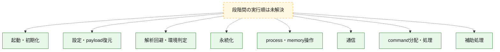
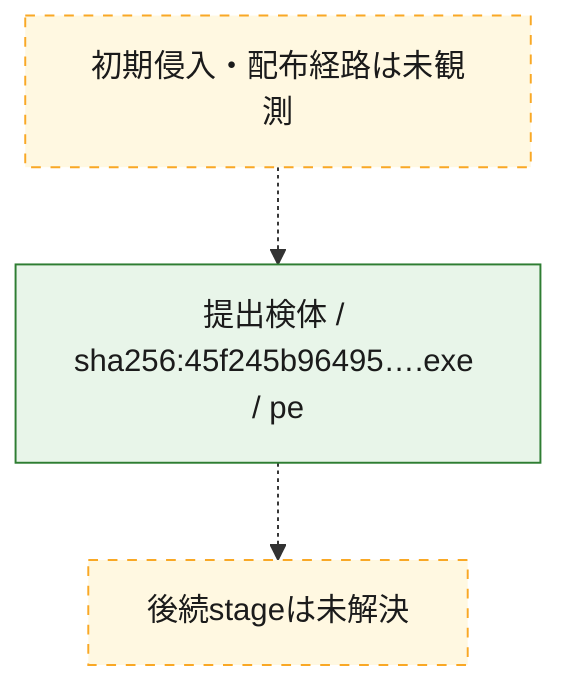
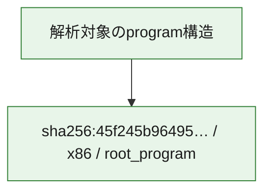

# 全体ロジック：45f245b964952e7ab59f50597ba1458ea8a3dfe42f0bc9a12696af02a810fbac

代表関数の静的証跡から、起動・初期化、設定・payload復元、解析回避・環境判定、永続化、process・memory操作、通信、command分配・処理の処理群を確認しました。

## 読み方

- phaseの掲載順は解析上の整理順です。observed_call_edgesがない段階間の実行順を断定しません。
- 図の実線は静的に観測した関係、点線と黄色のノードは未観測・未解決の関係を示します。
- 図は静的な要約であり、動的実行を再現するものではありません。
- 詳細な関数解説とfingerprintは[STATIC-LOGIC.md](STATIC-LOGIC.md)を参照してください。

## 静的可視化

### 実行フロー

### 感染チェーン

### モジュール関係

## 処理段階

### 1. 起動・初期化

entry pointから初期化と後続処理への移行を確認します。
確度: `confirmed_static_function_evidence`

- `45f245b964952e7ab59f50597ba1458ea8a3dfe42f0bc9a12696af02a810fbac:cil:0x06000059` — 初期化と主要処理への分岐を行う入口関数です。 状態: `succeeded`、選定理由: `entry_point`, `reviewed_call_centrality:6`
- `45f245b964952e7ab59f50597ba1458ea8a3dfe42f0bc9a12696af02a810fbac:cil:0x0600005e` — 初期化と主要処理への分岐を行う入口関数です。 状態: `succeeded`、選定理由: `entry_point`, `reviewed_call_centrality:6`
- `45f245b964952e7ab59f50597ba1458ea8a3dfe42f0bc9a12696af02a810fbac:cil:0x0600005f` — 初期化と主要処理への分岐を行う入口関数です。 状態: `succeeded`、選定理由: `entry_point`, `large_function:instructions=400`, `reviewed_call_centrality:82`
- `45f245b964952e7ab59f50597ba1458ea8a3dfe42f0bc9a12696af02a810fbac:cil:0x06000060` — 初期化と主要処理への分岐を行う入口関数です。 状態: `succeeded`、選定理由: `entry_point`, `reviewed_call_centrality:2`

### 2. 設定・payload復元

設定、resource、payload、暗号化データの復元・変換を確認します。
確度: `confirmed_static_function_evidence`

- `45f245b964952e7ab59f50597ba1458ea8a3dfe42f0bc9a12696af02a810fbac:cil:0x0600000e` — 暗号、hash、encoding、または復号処理に関係する関数です。 状態: `succeeded`、選定理由: `reviewed_call_centrality:24`, `role:cryptographic_transform`
- `45f245b964952e7ab59f50597ba1458ea8a3dfe42f0bc9a12696af02a810fbac:cil:0x0600000f` — 設定、resource、payloadなどの解析・変換を行う関数です。 状態: `succeeded`、選定理由: `reviewed_call_centrality:24`, `role:config_or_data_transform`
- `45f245b964952e7ab59f50597ba1458ea8a3dfe42f0bc9a12696af02a810fbac:cil:0x06000073` — 暗号、hash、encoding、または復号処理に関係する関数です。 状態: `succeeded`、選定理由: `reviewed_call_centrality:20`, `role:cryptographic_transform`
- `45f245b964952e7ab59f50597ba1458ea8a3dfe42f0bc9a12696af02a810fbac:cil:0x06000074` — 暗号、hash、encoding、または復号処理に関係する関数です。 状態: `succeeded`、選定理由: `reviewed_call_centrality:20`, `role:cryptographic_transform`

### 3. 解析回避・環境判定

debugger、sandbox、仮想環境、時間差などの判定を確認します。
確度: `confirmed_static_function_evidence`

- `45f245b964952e7ab59f50597ba1458ea8a3dfe42f0bc9a12696af02a810fbac:cil:0x0600001d` — debugger、仮想環境、sandbox、または時間差の確認に関係する関数です。 状態: `succeeded`、選定理由: `large_function:instructions=189`, `reviewed_call_centrality:34`, `role:anti_analysis`
- `45f245b964952e7ab59f50597ba1458ea8a3dfe42f0bc9a12696af02a810fbac:cil:0x06000071` — debugger、仮想環境、sandbox、または時間差の確認に関係する関数です。 状態: `succeeded`、選定理由: `large_function:instructions=69`, `reviewed_call_centrality:32`, `role:anti_analysis`

### 4. 永続化

自動起動や永続化に関係する設定変更を確認します。
確度: `confirmed_static_function_evidence`

- `45f245b964952e7ab59f50597ba1458ea8a3dfe42f0bc9a12696af02a810fbac:cil:0x06000082` — 自動起動または永続化に関係する処理を含む関数です。 状態: `succeeded`、選定理由: `large_function:instructions=220`, `reviewed_call_centrality:56`, `role:persistence`
- `45f245b964952e7ab59f50597ba1458ea8a3dfe42f0bc9a12696af02a810fbac:cil:0x06000085` — 自動起動または永続化に関係する処理を含む関数です。 状態: `succeeded`、選定理由: `large_function:instructions=153`, `reviewed_call_centrality:44`, `role:persistence`
- `45f245b964952e7ab59f50597ba1458ea8a3dfe42f0bc9a12696af02a810fbac:cil:0x0600008f` — 自動起動または永続化に関係する処理を含む関数です。 状態: `succeeded`、選定理由: `reviewed_call_centrality:18`, `role:persistence`

### 5. process・memory操作

process、thread、module、memory操作と実行移行を確認します。
確度: `confirmed_static_function_evidence`

- `45f245b964952e7ab59f50597ba1458ea8a3dfe42f0bc9a12696af02a810fbac:cil:0x0600006f` — process、thread、module、またはmemory操作に関係する関数です。 状態: `succeeded`、選定理由: `reviewed_call_centrality:22`, `role:process_or_memory_operation`

### 6. 通信

通信初期化、endpoint処理、送受信の役割を確認します。
確度: `confirmed_static_function_evidence`

- `45f245b964952e7ab59f50597ba1458ea8a3dfe42f0bc9a12696af02a810fbac:cil:0x0600001b` — 通信初期化、送受信、またはendpoint処理に関係する関数です。 状態: `succeeded`、選定理由: `large_function:instructions=185`, `reviewed_call_centrality:38`, `role:network_communication`
- `45f245b964952e7ab59f50597ba1458ea8a3dfe42f0bc9a12696af02a810fbac:cil:0x0600001f` — 通信初期化、送受信、またはendpoint処理に関係する関数です。 状態: `succeeded`、選定理由: `large_function:instructions=140`, `reviewed_call_centrality:36`, `role:network_communication`
- `45f245b964952e7ab59f50597ba1458ea8a3dfe42f0bc9a12696af02a810fbac:cil:0x06000021` — 通信初期化、送受信、またはendpoint処理に関係する関数です。 状態: `succeeded`、選定理由: `large_function:instructions=151`, `reviewed_call_centrality:30`, `role:network_communication`
- `45f245b964952e7ab59f50597ba1458ea8a3dfe42f0bc9a12696af02a810fbac:cil:0x06000023` — 通信初期化、送受信、またはendpoint処理に関係する関数です。 状態: `succeeded`、選定理由: `large_function:instructions=163`, `reviewed_call_centrality:42`, `role:network_communication`
- `45f245b964952e7ab59f50597ba1458ea8a3dfe42f0bc9a12696af02a810fbac:cil:0x06000025` — 通信初期化、送受信、またはendpoint処理に関係する関数です。 状態: `succeeded`、選定理由: `large_function:instructions=225`, `reviewed_call_centrality:34`, `role:network_communication`
- `45f245b964952e7ab59f50597ba1458ea8a3dfe42f0bc9a12696af02a810fbac:cil:0x06000027` — 通信初期化、送受信、またはendpoint処理に関係する関数です。 状態: `succeeded`、選定理由: `large_function:instructions=233`, `reviewed_call_centrality:34`, `role:network_communication`
- `45f245b964952e7ab59f50597ba1458ea8a3dfe42f0bc9a12696af02a810fbac:cil:0x06000037` — 通信初期化、送受信、またはendpoint処理に関係する関数です。 状態: `succeeded`、選定理由: `large_function:instructions=325`, `reviewed_call_centrality:30`, `role:network_communication`
- `45f245b964952e7ab59f50597ba1458ea8a3dfe42f0bc9a12696af02a810fbac:cil:0x06000039` — 通信初期化、送受信、またはendpoint処理に関係する関数です。 状態: `succeeded`、選定理由: `large_function:instructions=269`, `reviewed_call_centrality:32`, `role:network_communication`
- `45f245b964952e7ab59f50597ba1458ea8a3dfe42f0bc9a12696af02a810fbac:cil:0x0600003b` — 通信初期化、送受信、またはendpoint処理に関係する関数です。 状態: `succeeded`、選定理由: `large_function:instructions=136`, `reviewed_call_centrality:38`, `role:network_communication`
- `45f245b964952e7ab59f50597ba1458ea8a3dfe42f0bc9a12696af02a810fbac:cil:0x06000051` — 通信初期化、送受信、またはendpoint処理に関係する関数です。 状態: `succeeded`、選定理由: `large_function:instructions=206`, `reviewed_call_centrality:24`, `role:network_communication`
- `45f245b964952e7ab59f50597ba1458ea8a3dfe42f0bc9a12696af02a810fbac:cil:0x06000053` — 通信初期化、送受信、またはendpoint処理に関係する関数です。 状態: `succeeded`、選定理由: `large_function:instructions=246`, `reviewed_call_centrality:38`, `role:network_communication`
- `45f245b964952e7ab59f50597ba1458ea8a3dfe42f0bc9a12696af02a810fbac:cil:0x06000055` — 通信初期化、送受信、またはendpoint処理に関係する関数です。 状態: `succeeded`、選定理由: `large_function:instructions=126`, `reviewed_call_centrality:20`, `role:network_communication`
- `45f245b964952e7ab59f50597ba1458ea8a3dfe42f0bc9a12696af02a810fbac:cil:0x06000057` — 通信初期化、送受信、またはendpoint処理に関係する関数です。 状態: `succeeded`、選定理由: `large_function:instructions=158`, `reviewed_call_centrality:26`, `role:network_communication`
- `45f245b964952e7ab59f50597ba1458ea8a3dfe42f0bc9a12696af02a810fbac:cil:0x0600005b` — 通信初期化、送受信、またはendpoint処理に関係する関数です。 状態: `succeeded`、選定理由: `reviewed_call_centrality:40`, `role:network_communication`
- `45f245b964952e7ab59f50597ba1458ea8a3dfe42f0bc9a12696af02a810fbac:cil:0x06000089` — 通信初期化、送受信、またはendpoint処理に関係する関数です。 状態: `succeeded`、選定理由: `large_function:instructions=93`, `reviewed_call_centrality:16`, `role:network_communication`

### 7. command分配・処理

受信commandやtaskの解釈、分配、個別handlerへの移行を確認します。
確度: `confirmed_static_function_evidence`

- `45f245b964952e7ab59f50597ba1458ea8a3dfe42f0bc9a12696af02a810fbac:cil:0x0600000c` — commandの解釈、分配、または個別処理を担当する関数です。 状態: `succeeded`、選定理由: `large_function:instructions=419`, `reviewed_call_centrality:56`, `role:command_dispatch_or_handler`
- `45f245b964952e7ab59f50597ba1458ea8a3dfe42f0bc9a12696af02a810fbac:cil:0x06000091` — commandの解釈、分配、または個別処理を担当する関数です。 状態: `succeeded`、選定理由: `large_function:instructions=81`, `reviewed_call_centrality:42`, `role:command_dispatch_or_handler`

### 8. 補助処理

主要処理を支える一般内部関数またはlibrary処理を確認します。
確度: `confirmed_static_function_evidence`

- `45f245b964952e7ab59f50597ba1458ea8a3dfe42f0bc9a12696af02a810fbac:cil:0x06000072` — 検体内部の一般処理を実装する関数です。 状態: `succeeded`、選定理由: `reviewed_call_centrality:20`

## 観測したcall関係

- 代表関数間で直接解決できた呼出関係はありません。

## 解析範囲と制約

- 選定外関数は全体inventoryへ残しますが、関数本体の個別解説対象にはしていません。
- indirect call、難読化、packer、VM、壊れたcontrol flowによりcall関係が欠落する場合があります。
- 文書は静的解析に基づき、検体実行や外部通信による動的確認は行っていません。
