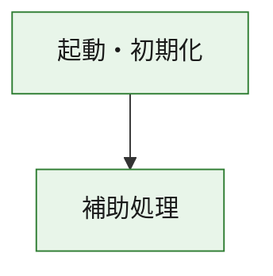
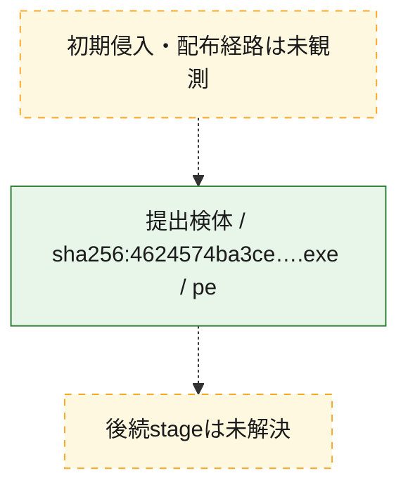
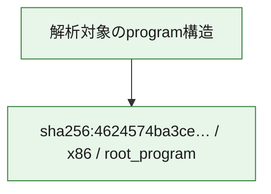

# 全体ロジック：4624574ba3ce31d0fca9a001add1ddb0cc9e79f229984cb3b09d74085e9e9530

代表関数の静的証跡から、起動・初期化の処理群を確認しました。

## 読み方

- phaseの掲載順は解析上の整理順です。observed_call_edgesがない段階間の実行順を断定しません。
- 図の実線は静的に観測した関係、点線と黄色のノードは未観測・未解決の関係を示します。
- 図は静的な要約であり、動的実行を再現するものではありません。
- 詳細な関数解説とfingerprintは[STATIC-LOGIC.md](STATIC-LOGIC.md)を参照してください。

## 静的可視化

### 実行フロー

### 感染チェーン

### モジュール関係

## 処理段階

### 1. 起動・初期化

entry pointから初期化と後続処理への移行を確認します。
確度: `confirmed_static_function_evidence`

- `4624574ba3ce31d0fca9a001add1ddb0cc9e79f229984cb3b09d74085e9e9530:ghidra:180001010` — 初期化と主要処理への分岐を行う入口関数です。 状態: `succeeded`、選定理由: `entry_point`, `meaningful_symbol_name`, `reviewed_call_centrality:22`, `role:entrypoint`, `small_program_complete_context`

### 2. 補助処理

主要処理を支える一般内部関数またはlibrary処理を確認します。
確度: `confirmed_static_function_evidence`

- `4624574ba3ce31d0fca9a001add1ddb0cc9e79f229984cb3b09d74085e9e9530:ghidra:180001240` — 検体内部の一般処理を実装する関数です。 状態: `succeeded`、選定理由: `context_representative`, `reviewed_call_centrality:2`, `small_program_complete_context`
- `4624574ba3ce31d0fca9a001add1ddb0cc9e79f229984cb3b09d74085e9e9530:ghidra:180001350` — 検体内部の一般処理を実装する関数です。 状態: `succeeded`、選定理由: `context_representative`, `reviewed_call_centrality:25`, `small_program_complete_context`
- `4624574ba3ce31d0fca9a001add1ddb0cc9e79f229984cb3b09d74085e9e9530:ghidra:180003780` — 検体内部の一般処理を実装する関数です。 状態: `succeeded`、選定理由: `context_representative`, `reviewed_call_centrality:2`, `small_program_complete_context`
- `4624574ba3ce31d0fca9a001add1ddb0cc9e79f229984cb3b09d74085e9e9530:ghidra:1800038e0` — 検体内部の一般処理を実装する関数です。 状態: `succeeded`、選定理由: `context_representative`, `reviewed_call_centrality:2`, `small_program_complete_context`

## 観測したcall関係

- `4624574ba3ce31d0fca9a001add1ddb0cc9e79f229984cb3b09d74085e9e9530:ghidra:180001010` → `4624574ba3ce31d0fca9a001add1ddb0cc9e79f229984cb3b09d74085e9e9530:ghidra:180001240` （`startup` → `support`）
- `4624574ba3ce31d0fca9a001add1ddb0cc9e79f229984cb3b09d74085e9e9530:ghidra:180001010` → `4624574ba3ce31d0fca9a001add1ddb0cc9e79f229984cb3b09d74085e9e9530:ghidra:180001350` （`startup` → `support`）
- `4624574ba3ce31d0fca9a001add1ddb0cc9e79f229984cb3b09d74085e9e9530:ghidra:180001350` → `4624574ba3ce31d0fca9a001add1ddb0cc9e79f229984cb3b09d74085e9e9530:ghidra:180001240` （`support` → `support`）
- `4624574ba3ce31d0fca9a001add1ddb0cc9e79f229984cb3b09d74085e9e9530:ghidra:180001350` → `4624574ba3ce31d0fca9a001add1ddb0cc9e79f229984cb3b09d74085e9e9530:ghidra:180003780` （`support` → `support`）
- `4624574ba3ce31d0fca9a001add1ddb0cc9e79f229984cb3b09d74085e9e9530:ghidra:180001350` → `4624574ba3ce31d0fca9a001add1ddb0cc9e79f229984cb3b09d74085e9e9530:ghidra:1800038e0` （`support` → `support`）
- `4624574ba3ce31d0fca9a001add1ddb0cc9e79f229984cb3b09d74085e9e9530:ghidra:180003780` → `4624574ba3ce31d0fca9a001add1ddb0cc9e79f229984cb3b09d74085e9e9530:ghidra:1800038e0` （`support` → `support`）
- `ghidra-function:1efb17c70bd95e03f4b58de2` → `ghidra-function:25dc2554a58fb5fdfa4413e7` （`unclassified` → `unclassified`）
- `ghidra-function:497170eb7a271ce3f5b18d0b` → `ghidra-external:1a11ad567462df2c9f10f334` （`unclassified` → `unclassified`）
- `ghidra-function:497170eb7a271ce3f5b18d0b` → `ghidra-external:1a30e520a8c513c396f904d7` （`unclassified` → `unclassified`）
- `ghidra-function:497170eb7a271ce3f5b18d0b` → `ghidra-external:348536840353eb1defbfc9a8` （`unclassified` → `unclassified`）
- `ghidra-function:497170eb7a271ce3f5b18d0b` → `ghidra-external:3f3acbd8b66cd413300c7b02` （`unclassified` → `unclassified`）
- `ghidra-function:497170eb7a271ce3f5b18d0b` → `ghidra-external:4d3ee9405c5890624b351cd3` （`unclassified` → `unclassified`）
- `ghidra-function:497170eb7a271ce3f5b18d0b` → `ghidra-external:5b9d64c9e9abf00bd6725aac` （`unclassified` → `unclassified`）
- `ghidra-function:497170eb7a271ce3f5b18d0b` → `ghidra-external:5c3eb4a0ea5e14fddd4e11d9` （`unclassified` → `unclassified`）
- `ghidra-function:497170eb7a271ce3f5b18d0b` → `ghidra-external:6ccb0a339ed242ca1b0d3b20` （`unclassified` → `unclassified`）
- `ghidra-function:497170eb7a271ce3f5b18d0b` → `ghidra-external:76b70dc6347d070ede3ee7bd` （`unclassified` → `unclassified`）
- `ghidra-function:497170eb7a271ce3f5b18d0b` → `ghidra-external:7e0e21135baf095d841fe64a` （`unclassified` → `unclassified`）
- `ghidra-function:497170eb7a271ce3f5b18d0b` → `ghidra-external:842c6498605ce189a794a8a6` （`unclassified` → `unclassified`）
- `ghidra-function:497170eb7a271ce3f5b18d0b` → `ghidra-external:930a7814e4eeba93132b84ad` （`unclassified` → `unclassified`）
- `ghidra-function:497170eb7a271ce3f5b18d0b` → `ghidra-external:aa3a1103c4721e25160259f9` （`unclassified` → `unclassified`）
- `ghidra-function:497170eb7a271ce3f5b18d0b` → `ghidra-external:cbf22a098743c9c890df0d90` （`unclassified` → `unclassified`）
- `ghidra-function:497170eb7a271ce3f5b18d0b` → `ghidra-external:d5ec9da167c1b96e1d73f6f9` （`unclassified` → `unclassified`）
- `ghidra-function:497170eb7a271ce3f5b18d0b` → `ghidra-external:d8a570828aa855a65f7e0d5c` （`unclassified` → `unclassified`）
- `ghidra-function:497170eb7a271ce3f5b18d0b` → `ghidra-external:e64a1e09b3638fc9523c7686` （`unclassified` → `unclassified`）
- `ghidra-function:497170eb7a271ce3f5b18d0b` → `ghidra-external:e675ef7dcaa3664bc7fda883` （`unclassified` → `unclassified`）
- `ghidra-function:497170eb7a271ce3f5b18d0b` → `ghidra-external:f07bace017a123a4ea614aaa` （`unclassified` → `unclassified`）
- `ghidra-function:497170eb7a271ce3f5b18d0b` → `ghidra-external:f09226aea218818964fe588d` （`unclassified` → `unclassified`）
- `ghidra-function:497170eb7a271ce3f5b18d0b` → `ghidra-external:f88801e3fc35eaeca4616550` （`unclassified` → `unclassified`）
- `ghidra-function:497170eb7a271ce3f5b18d0b` → `ghidra-function:1efb17c70bd95e03f4b58de2` （`unclassified` → `unclassified`）
- `ghidra-function:497170eb7a271ce3f5b18d0b` → `ghidra-function:25dc2554a58fb5fdfa4413e7` （`unclassified` → `unclassified`）
- `ghidra-function:497170eb7a271ce3f5b18d0b` → `ghidra-function:f1449c183c57f73e6122c75c` （`unclassified` → `unclassified`）
- `ghidra-function:bf22cb7eecbcf5ef5ebb6972` → `ghidra-function:037181fa27abbc0da5a51356` （`unclassified` → `unclassified`）
- `ghidra-function:bf22cb7eecbcf5ef5ebb6972` → `ghidra-function:0ee2342a076d8a45859eb745` （`unclassified` → `unclassified`）
- `ghidra-function:bf22cb7eecbcf5ef5ebb6972` → `ghidra-function:427edf1b4da6e4704d096615` （`unclassified` → `unclassified`）
- `ghidra-function:bf22cb7eecbcf5ef5ebb6972` → `ghidra-function:497170eb7a271ce3f5b18d0b` （`unclassified` → `unclassified`）
- `ghidra-function:bf22cb7eecbcf5ef5ebb6972` → `ghidra-function:78d0566603fb6cc20dd5461f` （`unclassified` → `unclassified`）
- `ghidra-function:bf22cb7eecbcf5ef5ebb6972` → `ghidra-function:a4fd4fa24ef33efa14a708ef` （`unclassified` → `unclassified`）
- `ghidra-function:bf22cb7eecbcf5ef5ebb6972` → `ghidra-function:c61552d5bfee812c77744505` （`unclassified` → `unclassified`）
- `ghidra-function:bf22cb7eecbcf5ef5ebb6972` → `ghidra-function:e220de58fce10fa8b159a327` （`unclassified` → `unclassified`）
- `ghidra-function:bf22cb7eecbcf5ef5ebb6972` → `ghidra-function:f1449c183c57f73e6122c75c` （`unclassified` → `unclassified`）
- `ghidra-function:bf22cb7eecbcf5ef5ebb6972` → `ghidra-function:f23b7a936e01b717a176643d` （`unclassified` → `unclassified`）
- `ghidra-function:bf22cb7eecbcf5ef5ebb6972` → `ghidra-function:f390cc76cf849efd2fae3b3a` （`unclassified` → `unclassified`）
- `ghidra-function:bf22cb7eecbcf5ef5ebb6972` → `ghidra-function:f6f14f8c9d5f7daf31c2fc28` （`unclassified` → `unclassified`）

## 解析範囲と制約

- 選定外関数は全体inventoryへ残しますが、関数本体の個別解説対象にはしていません。
- indirect call、難読化、packer、VM、壊れたcontrol flowによりcall関係が欠落する場合があります。
- 文書は静的解析に基づき、検体実行や外部通信による動的確認は行っていません。
