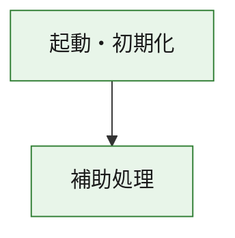
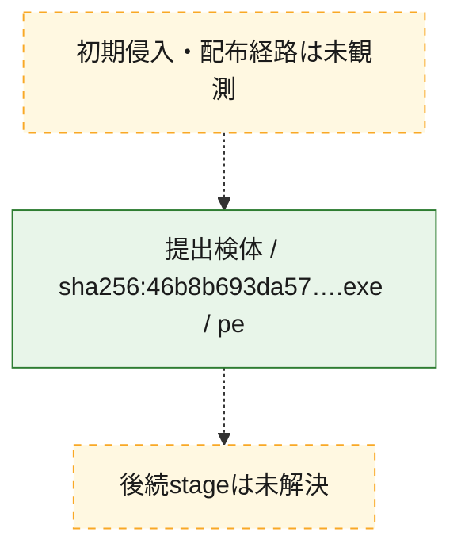
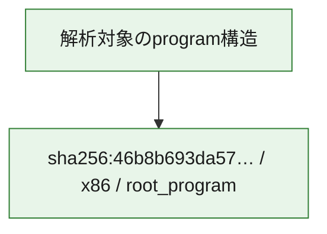

# 全体ロジック：46b8b693da57439bdc4f7016dc62054de63f9405dd0f43a5e9bcd9dc8b65921b

代表関数の静的証跡から、起動・初期化の処理群を確認しました。

## 読み方

- phaseの掲載順は解析上の整理順です。observed_call_edgesがない段階間の実行順を断定しません。
- 図の実線は静的に観測した関係、点線と黄色のノードは未観測・未解決の関係を示します。
- 図は静的な要約であり、動的実行を再現するものではありません。
- 詳細な関数解説とfingerprintは[STATIC-LOGIC.md](STATIC-LOGIC.md)を参照してください。

## 静的可視化

### 実行フロー

### 感染チェーン

### モジュール関係

## 処理段階

### 1. 起動・初期化

entry pointから初期化と後続処理への移行を確認します。
確度: `confirmed_static_function_evidence`

- `46b8b693da57439bdc4f7016dc62054de63f9405dd0f43a5e9bcd9dc8b65921b:ghidra:180001010` — 初期化と主要処理への分岐を行う入口関数です。 状態: `succeeded`、選定理由: `entry_point`, `meaningful_symbol_name`, `reviewed_call_centrality:22`, `role:entrypoint`, `small_program_complete_context`

### 2. 補助処理

主要処理を支える一般内部関数またはlibrary処理を確認します。
確度: `confirmed_static_function_evidence`

- `46b8b693da57439bdc4f7016dc62054de63f9405dd0f43a5e9bcd9dc8b65921b:ghidra:180001240` — 検体内部の一般処理を実装する関数です。 状態: `succeeded`、選定理由: `context_representative`, `reviewed_call_centrality:2`, `small_program_complete_context`
- `46b8b693da57439bdc4f7016dc62054de63f9405dd0f43a5e9bcd9dc8b65921b:ghidra:180001350` — 検体内部の一般処理を実装する関数です。 状態: `succeeded`、選定理由: `context_representative`, `reviewed_call_centrality:25`, `small_program_complete_context`
- `46b8b693da57439bdc4f7016dc62054de63f9405dd0f43a5e9bcd9dc8b65921b:ghidra:180003780` — 検体内部の一般処理を実装する関数です。 状態: `succeeded`、選定理由: `context_representative`, `reviewed_call_centrality:2`, `small_program_complete_context`
- `46b8b693da57439bdc4f7016dc62054de63f9405dd0f43a5e9bcd9dc8b65921b:ghidra:1800038e0` — 検体内部の一般処理を実装する関数です。 状態: `succeeded`、選定理由: `context_representative`, `reviewed_call_centrality:2`, `small_program_complete_context`

## 観測したcall関係

- `46b8b693da57439bdc4f7016dc62054de63f9405dd0f43a5e9bcd9dc8b65921b:ghidra:180001010` → `46b8b693da57439bdc4f7016dc62054de63f9405dd0f43a5e9bcd9dc8b65921b:ghidra:180001240` （`startup` → `support`）
- `46b8b693da57439bdc4f7016dc62054de63f9405dd0f43a5e9bcd9dc8b65921b:ghidra:180001010` → `46b8b693da57439bdc4f7016dc62054de63f9405dd0f43a5e9bcd9dc8b65921b:ghidra:180001350` （`startup` → `support`）
- `46b8b693da57439bdc4f7016dc62054de63f9405dd0f43a5e9bcd9dc8b65921b:ghidra:180001350` → `46b8b693da57439bdc4f7016dc62054de63f9405dd0f43a5e9bcd9dc8b65921b:ghidra:180001240` （`support` → `support`）
- `46b8b693da57439bdc4f7016dc62054de63f9405dd0f43a5e9bcd9dc8b65921b:ghidra:180001350` → `46b8b693da57439bdc4f7016dc62054de63f9405dd0f43a5e9bcd9dc8b65921b:ghidra:180003780` （`support` → `support`）
- `46b8b693da57439bdc4f7016dc62054de63f9405dd0f43a5e9bcd9dc8b65921b:ghidra:180001350` → `46b8b693da57439bdc4f7016dc62054de63f9405dd0f43a5e9bcd9dc8b65921b:ghidra:1800038e0` （`support` → `support`）
- `46b8b693da57439bdc4f7016dc62054de63f9405dd0f43a5e9bcd9dc8b65921b:ghidra:180003780` → `46b8b693da57439bdc4f7016dc62054de63f9405dd0f43a5e9bcd9dc8b65921b:ghidra:1800038e0` （`support` → `support`）
- `ghidra-function:0f11bbbb8517eed289bca1d1` → `ghidra-external:088a7aec7a8e3c15e52083f2` （`unclassified` → `unclassified`）
- `ghidra-function:0f11bbbb8517eed289bca1d1` → `ghidra-external:0d3a11fe12fdef6f14faf0a1` （`unclassified` → `unclassified`）
- `ghidra-function:0f11bbbb8517eed289bca1d1` → `ghidra-external:2d791ccd4df2dd10c30b2fcc` （`unclassified` → `unclassified`）
- `ghidra-function:0f11bbbb8517eed289bca1d1` → `ghidra-external:56e2d6d343b84b1796e4505f` （`unclassified` → `unclassified`）
- `ghidra-function:0f11bbbb8517eed289bca1d1` → `ghidra-external:7c44379bcb6de5572c9dfae3` （`unclassified` → `unclassified`）
- `ghidra-function:0f11bbbb8517eed289bca1d1` → `ghidra-external:8f4c4e4abbc5097798face80` （`unclassified` → `unclassified`）
- `ghidra-function:0f11bbbb8517eed289bca1d1` → `ghidra-external:9ac59bfd1a017f277fd2797a` （`unclassified` → `unclassified`）
- `ghidra-function:0f11bbbb8517eed289bca1d1` → `ghidra-external:a2f0f3bd7042e749a4291473` （`unclassified` → `unclassified`）
- `ghidra-function:0f11bbbb8517eed289bca1d1` → `ghidra-external:a54e0a0a9013e253e36edb27` （`unclassified` → `unclassified`）
- `ghidra-function:0f11bbbb8517eed289bca1d1` → `ghidra-external:aab9ff07bd27d841114fe7e7` （`unclassified` → `unclassified`）
- `ghidra-function:0f11bbbb8517eed289bca1d1` → `ghidra-external:ab596f3d46ef8850387726ef` （`unclassified` → `unclassified`）
- `ghidra-function:0f11bbbb8517eed289bca1d1` → `ghidra-external:ac0003166d71772fe09aecc2` （`unclassified` → `unclassified`）
- `ghidra-function:0f11bbbb8517eed289bca1d1` → `ghidra-external:b14b6d625087d2aa6d0d081b` （`unclassified` → `unclassified`）
- `ghidra-function:0f11bbbb8517eed289bca1d1` → `ghidra-external:b1e9c1a5d758559aaf7b9a00` （`unclassified` → `unclassified`）
- `ghidra-function:0f11bbbb8517eed289bca1d1` → `ghidra-external:b2e356f35f74fdad28a32024` （`unclassified` → `unclassified`）
- `ghidra-function:0f11bbbb8517eed289bca1d1` → `ghidra-external:b8d18ac743a9de7edc4963cb` （`unclassified` → `unclassified`）
- `ghidra-function:0f11bbbb8517eed289bca1d1` → `ghidra-external:d34cb79e9e5fc95c75cf3ca7` （`unclassified` → `unclassified`）
- `ghidra-function:0f11bbbb8517eed289bca1d1` → `ghidra-external:d48699fc17c8caae22e65dd7` （`unclassified` → `unclassified`）
- `ghidra-function:0f11bbbb8517eed289bca1d1` → `ghidra-external:dc9289e63816c5fb8c04da28` （`unclassified` → `unclassified`）
- `ghidra-function:0f11bbbb8517eed289bca1d1` → `ghidra-external:f2afafd60e6a22867ca16cf5` （`unclassified` → `unclassified`）
- `ghidra-function:0f11bbbb8517eed289bca1d1` → `ghidra-external:fade2f27bf7136ac151ef6b6` （`unclassified` → `unclassified`）
- `ghidra-function:0f11bbbb8517eed289bca1d1` → `ghidra-function:15380290e3b70b9a57ec275f` （`unclassified` → `unclassified`）
- `ghidra-function:0f11bbbb8517eed289bca1d1` → `ghidra-function:a3debcf031310ab48c83e381` （`unclassified` → `unclassified`）
- `ghidra-function:0f11bbbb8517eed289bca1d1` → `ghidra-function:ae22e4cd306832da40905670` （`unclassified` → `unclassified`）
- `ghidra-function:a3debcf031310ab48c83e381` → `ghidra-function:ae22e4cd306832da40905670` （`unclassified` → `unclassified`）
- `ghidra-function:a4341e1cf18ebcb699855865` → `ghidra-function:0f11bbbb8517eed289bca1d1` （`unclassified` → `unclassified`）
- `ghidra-function:a4341e1cf18ebcb699855865` → `ghidra-function:15380290e3b70b9a57ec275f` （`unclassified` → `unclassified`）
- `ghidra-function:a4341e1cf18ebcb699855865` → `ghidra-function:239ca520456eff0e459598c6` （`unclassified` → `unclassified`）
- `ghidra-function:a4341e1cf18ebcb699855865` → `ghidra-function:2709acdfdfa254cbbb46f92c` （`unclassified` → `unclassified`）
- `ghidra-function:a4341e1cf18ebcb699855865` → `ghidra-function:2b535e5c49c2ac7fc710ff54` （`unclassified` → `unclassified`）
- `ghidra-function:a4341e1cf18ebcb699855865` → `ghidra-function:316fa2d51386301cccd56df3` （`unclassified` → `unclassified`）
- `ghidra-function:a4341e1cf18ebcb699855865` → `ghidra-function:9972c6b39a760102fb139e4d` （`unclassified` → `unclassified`）
- `ghidra-function:a4341e1cf18ebcb699855865` → `ghidra-function:bae7e740b763303391a8a9e9` （`unclassified` → `unclassified`）
- `ghidra-function:a4341e1cf18ebcb699855865` → `ghidra-function:ca406f8ee623c34de2be528e` （`unclassified` → `unclassified`）
- `ghidra-function:a4341e1cf18ebcb699855865` → `ghidra-function:cd5103faa0fa94ef8296e39e` （`unclassified` → `unclassified`）
- `ghidra-function:a4341e1cf18ebcb699855865` → `ghidra-function:e957433f678cbb3e3c7c8b7d` （`unclassified` → `unclassified`）
- `ghidra-function:a4341e1cf18ebcb699855865` → `ghidra-function:ea30424ce9c3e1dfaa0f17d6` （`unclassified` → `unclassified`）

## 解析範囲と制約

- 選定外関数は全体inventoryへ残しますが、関数本体の個別解説対象にはしていません。
- indirect call、難読化、packer、VM、壊れたcontrol flowによりcall関係が欠落する場合があります。
- 文書は静的解析に基づき、検体実行や外部通信による動的確認は行っていません。
