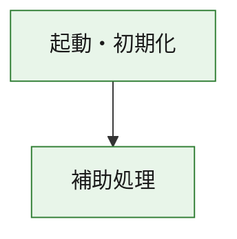
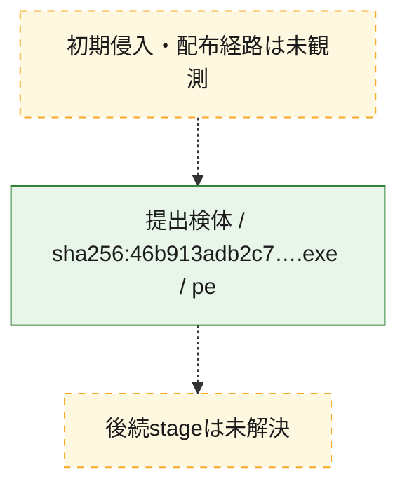
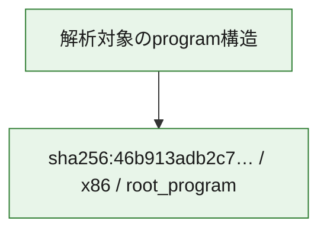

# 全体ロジック：46b913adb2c7e0d8e7b93ecb3ca164bd6a25b0482ad78cf4462ecf9da5ae205e

代表関数の静的証跡から、起動・初期化の処理群を確認しました。

## 読み方

- phaseの掲載順は解析上の整理順です。observed_call_edgesがない段階間の実行順を断定しません。
- 図の実線は静的に観測した関係、点線と黄色のノードは未観測・未解決の関係を示します。
- 図は静的な要約であり、動的実行を再現するものではありません。
- 詳細な関数解説とfingerprintは[STATIC-LOGIC.md](STATIC-LOGIC.md)を参照してください。

## 静的可視化

### 実行フロー

### 感染チェーン

### モジュール関係

## 処理段階

### 1. 起動・初期化

entry pointから初期化と後続処理への移行を確認します。
確度: `confirmed_static_function_evidence`

- `46b913adb2c7e0d8e7b93ecb3ca164bd6a25b0482ad78cf4462ecf9da5ae205e:ghidra:180001010` — 初期化と主要処理への分岐を行う入口関数です。 状態: `succeeded`、選定理由: `entry_point`, `meaningful_symbol_name`, `reviewed_call_centrality:22`, `role:entrypoint`, `small_program_complete_context`

### 2. 補助処理

主要処理を支える一般内部関数またはlibrary処理を確認します。
確度: `confirmed_static_function_evidence`

- `46b913adb2c7e0d8e7b93ecb3ca164bd6a25b0482ad78cf4462ecf9da5ae205e:ghidra:180001240` — 検体内部の一般処理を実装する関数です。 状態: `succeeded`、選定理由: `context_representative`, `reviewed_call_centrality:2`, `small_program_complete_context`
- `46b913adb2c7e0d8e7b93ecb3ca164bd6a25b0482ad78cf4462ecf9da5ae205e:ghidra:180001350` — 検体内部の一般処理を実装する関数です。 状態: `succeeded`、選定理由: `context_representative`, `reviewed_call_centrality:25`, `small_program_complete_context`
- `46b913adb2c7e0d8e7b93ecb3ca164bd6a25b0482ad78cf4462ecf9da5ae205e:ghidra:180003780` — 検体内部の一般処理を実装する関数です。 状態: `succeeded`、選定理由: `context_representative`, `reviewed_call_centrality:2`, `small_program_complete_context`
- `46b913adb2c7e0d8e7b93ecb3ca164bd6a25b0482ad78cf4462ecf9da5ae205e:ghidra:1800038e0` — 検体内部の一般処理を実装する関数です。 状態: `succeeded`、選定理由: `context_representative`, `reviewed_call_centrality:2`, `small_program_complete_context`

## 観測したcall関係

- `46b913adb2c7e0d8e7b93ecb3ca164bd6a25b0482ad78cf4462ecf9da5ae205e:ghidra:180001010` → `46b913adb2c7e0d8e7b93ecb3ca164bd6a25b0482ad78cf4462ecf9da5ae205e:ghidra:180001240` （`startup` → `support`）
- `46b913adb2c7e0d8e7b93ecb3ca164bd6a25b0482ad78cf4462ecf9da5ae205e:ghidra:180001010` → `46b913adb2c7e0d8e7b93ecb3ca164bd6a25b0482ad78cf4462ecf9da5ae205e:ghidra:180001350` （`startup` → `support`）
- `46b913adb2c7e0d8e7b93ecb3ca164bd6a25b0482ad78cf4462ecf9da5ae205e:ghidra:180001350` → `46b913adb2c7e0d8e7b93ecb3ca164bd6a25b0482ad78cf4462ecf9da5ae205e:ghidra:180001240` （`support` → `support`）
- `46b913adb2c7e0d8e7b93ecb3ca164bd6a25b0482ad78cf4462ecf9da5ae205e:ghidra:180001350` → `46b913adb2c7e0d8e7b93ecb3ca164bd6a25b0482ad78cf4462ecf9da5ae205e:ghidra:180003780` （`support` → `support`）
- `46b913adb2c7e0d8e7b93ecb3ca164bd6a25b0482ad78cf4462ecf9da5ae205e:ghidra:180001350` → `46b913adb2c7e0d8e7b93ecb3ca164bd6a25b0482ad78cf4462ecf9da5ae205e:ghidra:1800038e0` （`support` → `support`）
- `46b913adb2c7e0d8e7b93ecb3ca164bd6a25b0482ad78cf4462ecf9da5ae205e:ghidra:180003780` → `46b913adb2c7e0d8e7b93ecb3ca164bd6a25b0482ad78cf4462ecf9da5ae205e:ghidra:1800038e0` （`support` → `support`）
- `ghidra-function:5c1dedded1e478ddc8d1a7ac` → `ghidra-function:789d7c375448843ae434c7bc` （`unclassified` → `unclassified`）
- `ghidra-function:88d8e5d8637d6c6aaae8e267` → `ghidra-function:11b5ba6b6e526fb1cd8237f5` （`unclassified` → `unclassified`）
- `ghidra-function:88d8e5d8637d6c6aaae8e267` → `ghidra-function:1bd36599b8c1a92b24f272a8` （`unclassified` → `unclassified`）
- `ghidra-function:88d8e5d8637d6c6aaae8e267` → `ghidra-function:57ed4e8fbc4d4daaee3bed6e` （`unclassified` → `unclassified`）
- `ghidra-function:88d8e5d8637d6c6aaae8e267` → `ghidra-function:85c00d24b937643323b1ddc3` （`unclassified` → `unclassified`）
- `ghidra-function:88d8e5d8637d6c6aaae8e267` → `ghidra-function:8d0fdeb31821aec28ae1c7c5` （`unclassified` → `unclassified`）
- `ghidra-function:88d8e5d8637d6c6aaae8e267` → `ghidra-function:917c319a51f02eccb3670db2` （`unclassified` → `unclassified`）
- `ghidra-function:88d8e5d8637d6c6aaae8e267` → `ghidra-function:930727554080d91484f65e17` （`unclassified` → `unclassified`）
- `ghidra-function:88d8e5d8637d6c6aaae8e267` → `ghidra-function:93bccc4fee6d63779e5987bf` （`unclassified` → `unclassified`）
- `ghidra-function:88d8e5d8637d6c6aaae8e267` → `ghidra-function:9ca2097fd64cd7e646dab8ca` （`unclassified` → `unclassified`）
- `ghidra-function:88d8e5d8637d6c6aaae8e267` → `ghidra-function:a97f76a986d834f1311bd97b` （`unclassified` → `unclassified`）
- `ghidra-function:88d8e5d8637d6c6aaae8e267` → `ghidra-function:e80b4e61f6a45042500be921` （`unclassified` → `unclassified`）
- `ghidra-function:88d8e5d8637d6c6aaae8e267` → `ghidra-function:eb0b481fc090b00ee11f5a94` （`unclassified` → `unclassified`）
- `ghidra-function:a97f76a986d834f1311bd97b` → `ghidra-external:0c1b6b805c4915c54988bb63` （`unclassified` → `unclassified`）
- `ghidra-function:a97f76a986d834f1311bd97b` → `ghidra-external:1cb61372fe8abd7c79431614` （`unclassified` → `unclassified`）
- `ghidra-function:a97f76a986d834f1311bd97b` → `ghidra-external:2244125e31cff9c18f0853f3` （`unclassified` → `unclassified`）
- `ghidra-function:a97f76a986d834f1311bd97b` → `ghidra-external:423a1f19904e35eddb262f06` （`unclassified` → `unclassified`）
- `ghidra-function:a97f76a986d834f1311bd97b` → `ghidra-external:494171c3bba9f1df4ed7426c` （`unclassified` → `unclassified`）
- `ghidra-function:a97f76a986d834f1311bd97b` → `ghidra-external:58969abb901967aa33eca323` （`unclassified` → `unclassified`）
- `ghidra-function:a97f76a986d834f1311bd97b` → `ghidra-external:5c3c109733a76eebbb031a31` （`unclassified` → `unclassified`）
- `ghidra-function:a97f76a986d834f1311bd97b` → `ghidra-external:71101e34ecf84d8bdc58e58d` （`unclassified` → `unclassified`）
- `ghidra-function:a97f76a986d834f1311bd97b` → `ghidra-external:785c2db9367cf43a3fab1e2d` （`unclassified` → `unclassified`）
- `ghidra-function:a97f76a986d834f1311bd97b` → `ghidra-external:7fa235c723cfb047633b724c` （`unclassified` → `unclassified`）
- `ghidra-function:a97f76a986d834f1311bd97b` → `ghidra-external:8862f9cff281bbd5ef2fdbd7` （`unclassified` → `unclassified`）
- `ghidra-function:a97f76a986d834f1311bd97b` → `ghidra-external:a83cb975a8c2420ab677b939` （`unclassified` → `unclassified`）
- `ghidra-function:a97f76a986d834f1311bd97b` → `ghidra-external:aafe78d523ee54a1ca91e6f2` （`unclassified` → `unclassified`）
- `ghidra-function:a97f76a986d834f1311bd97b` → `ghidra-external:b138bc25b62072e7e48f1b68` （`unclassified` → `unclassified`）
- `ghidra-function:a97f76a986d834f1311bd97b` → `ghidra-external:b1fd0ba281982f185be7cc87` （`unclassified` → `unclassified`）
- `ghidra-function:a97f76a986d834f1311bd97b` → `ghidra-external:c260bea07ea0bf52e82bc14b` （`unclassified` → `unclassified`）
- `ghidra-function:a97f76a986d834f1311bd97b` → `ghidra-external:cbd3fbd35ab033bdda485866` （`unclassified` → `unclassified`）
- `ghidra-function:a97f76a986d834f1311bd97b` → `ghidra-external:d87b5bd7591624dd60ee9b9f` （`unclassified` → `unclassified`）
- `ghidra-function:a97f76a986d834f1311bd97b` → `ghidra-external:ea50d2b36eee2cec255ee78f` （`unclassified` → `unclassified`）
- `ghidra-function:a97f76a986d834f1311bd97b` → `ghidra-external:eda6e7688539229cb1f0dc7b` （`unclassified` → `unclassified`）
- `ghidra-function:a97f76a986d834f1311bd97b` → `ghidra-external:faccd3943ccaa11cc2dc9b7a` （`unclassified` → `unclassified`）
- `ghidra-function:a97f76a986d834f1311bd97b` → `ghidra-function:57ed4e8fbc4d4daaee3bed6e` （`unclassified` → `unclassified`）
- `ghidra-function:a97f76a986d834f1311bd97b` → `ghidra-function:5c1dedded1e478ddc8d1a7ac` （`unclassified` → `unclassified`）
- `ghidra-function:a97f76a986d834f1311bd97b` → `ghidra-function:789d7c375448843ae434c7bc` （`unclassified` → `unclassified`）

## 解析範囲と制約

- 選定外関数は全体inventoryへ残しますが、関数本体の個別解説対象にはしていません。
- indirect call、難読化、packer、VM、壊れたcontrol flowによりcall関係が欠落する場合があります。
- 文書は静的解析に基づき、検体実行や外部通信による動的確認は行っていません。
