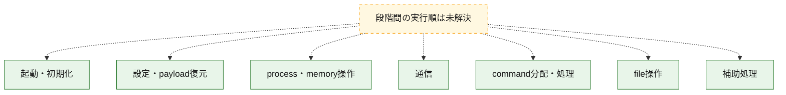
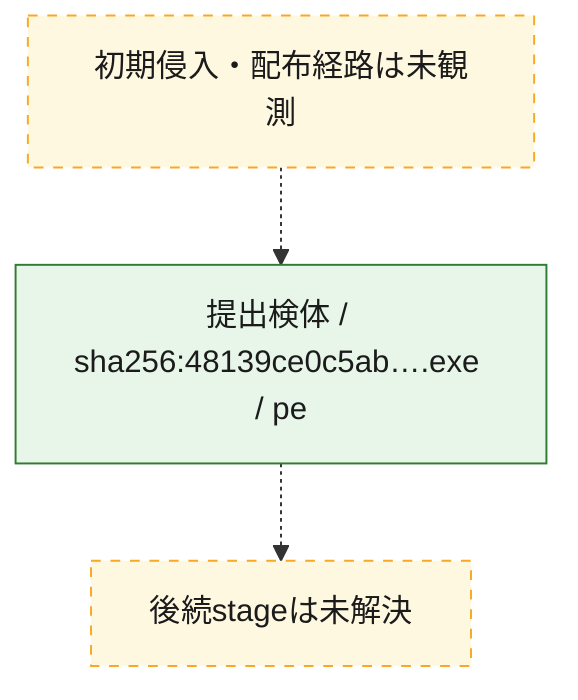
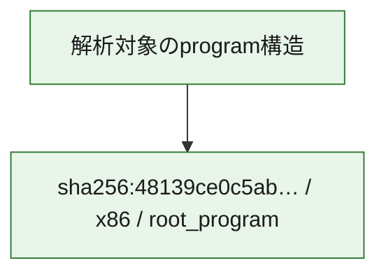

# 全体ロジック：48139ce0c5abb601cca6a634ef33579b63c3cc109cc3aa7439c6d2e415e4b504

代表関数の静的証跡から、起動・初期化、設定・payload復元、process・memory操作、通信、command分配・処理、file操作の処理群を確認しました。

## 読み方

- phaseの掲載順は解析上の整理順です。observed_call_edgesがない段階間の実行順を断定しません。
- 図の実線は静的に観測した関係、点線と黄色のノードは未観測・未解決の関係を示します。
- 図は静的な要約であり、動的実行を再現するものではありません。
- 詳細な関数解説とfingerprintは[STATIC-LOGIC.md](STATIC-LOGIC.md)を参照してください。

## 静的可視化

### 実行フロー

### 感染チェーン

### モジュール関係

## 処理段階

### 1. 起動・初期化

entry pointから初期化と後続処理への移行を確認します。
確度: `confirmed_static_function_evidence_with_limits`

- `48139ce0c5abb601cca6a634ef33579b63c3cc109cc3aa7439c6d2e415e4b504:ghidra:1400afb00` — 初期化と主要処理への分岐を行う入口関数です。 状態: `succeeded`、選定理由: `entry_point`, `meaningful_symbol_name`, `probable_go_main_user_code`, `reviewed_call_centrality:4`, `role:entrypoint`
- `48139ce0c5abb601cca6a634ef33579b63c3cc109cc3aa7439c6d2e415e4b504:ghidra:1400afe80` — 初期化と主要処理への分岐を行う入口関数です。 状態: `succeeded`、選定理由: `entry_point`, `meaningful_symbol_name`, `probable_go_main_user_code`, `reviewed_call_centrality:4`, `role:entrypoint`
- `48139ce0c5abb601cca6a634ef33579b63c3cc109cc3aa7439c6d2e415e4b504:ghidra:1400aff00` — 初期化と主要処理への分岐を行う入口関数です。 状態: `failed`、選定理由: `entry_point`, `meaningful_symbol_name`, `probable_go_main_user_code`, `role:entrypoint`
- `48139ce0c5abb601cca6a634ef33579b63c3cc109cc3aa7439c6d2e415e4b504:ghidra:1400d4360` — 初期化と主要処理への分岐を行う入口関数です。 状態: `succeeded`、選定理由: `entry_point`, `meaningful_symbol_name`, `probable_go_main_user_code`, `reviewed_call_centrality:29`, `role:entrypoint`
- `48139ce0c5abb601cca6a634ef33579b63c3cc109cc3aa7439c6d2e415e4b504:ghidra:1400f0800` — 初期化と主要処理への分岐を行う入口関数です。 状態: `succeeded`、選定理由: `entry_point`, `meaningful_symbol_name`, `probable_go_main_user_code`, `reviewed_call_centrality:22`, `role:entrypoint`
- `48139ce0c5abb601cca6a634ef33579b63c3cc109cc3aa7439c6d2e415e4b504:ghidra:1400f7840` — 初期化と主要処理への分岐を行う入口関数です。 状態: `succeeded`、選定理由: `entry_point`, `meaningful_symbol_name`, `probable_go_main_user_code`, `reviewed_call_centrality:19`, `role:entrypoint`
- `48139ce0c5abb601cca6a634ef33579b63c3cc109cc3aa7439c6d2e415e4b504:ghidra:1400fafc0` — 初期化と主要処理への分岐を行う入口関数です。 状態: `succeeded`、選定理由: `entry_point`, `meaningful_symbol_name`, `probable_go_main_user_code`, `reviewed_call_centrality:24`, `role:entrypoint`
- `48139ce0c5abb601cca6a634ef33579b63c3cc109cc3aa7439c6d2e415e4b504:ghidra:1400ff880` — 初期化と主要処理への分岐を行う入口関数です。 状態: `succeeded`、選定理由: `entry_point`, `meaningful_symbol_name`, `probable_go_main_user_code`, `reviewed_call_centrality:22`, `role:entrypoint`
- `48139ce0c5abb601cca6a634ef33579b63c3cc109cc3aa7439c6d2e415e4b504:ghidra:140105b20` — 初期化と主要処理への分岐を行う入口関数です。 状態: `succeeded`、選定理由: `entry_point`, `meaningful_symbol_name`, `probable_go_main_user_code`, `reviewed_call_centrality:24`, `role:entrypoint`
- `48139ce0c5abb601cca6a634ef33579b63c3cc109cc3aa7439c6d2e415e4b504:ghidra:14010bda0` — 初期化と主要処理への分岐を行う入口関数です。 状態: `succeeded`、選定理由: `entry_point`, `meaningful_symbol_name`, `probable_go_main_user_code`, `reviewed_call_centrality:25`, `role:entrypoint`
- `48139ce0c5abb601cca6a634ef33579b63c3cc109cc3aa7439c6d2e415e4b504:ghidra:1401208e0` — 初期化と主要処理への分岐を行う入口関数です。 状態: `succeeded`、選定理由: `entry_point`, `meaningful_symbol_name`, `probable_go_main_user_code`, `reviewed_call_centrality:24`, `role:entrypoint`
- `48139ce0c5abb601cca6a634ef33579b63c3cc109cc3aa7439c6d2e415e4b504:ghidra:140126260` — 初期化と主要処理への分岐を行う入口関数です。 状態: `succeeded`、選定理由: `entry_point`, `meaningful_symbol_name`, `probable_go_main_user_code`, `reviewed_call_centrality:31`, `role:entrypoint`
- `48139ce0c5abb601cca6a634ef33579b63c3cc109cc3aa7439c6d2e415e4b504:ghidra:140130780` — 初期化と主要処理への分岐を行う入口関数です。 状態: `succeeded`、選定理由: `entry_point`, `meaningful_symbol_name`, `probable_go_main_user_code`, `reviewed_call_centrality:18`, `role:entrypoint`
- `48139ce0c5abb601cca6a634ef33579b63c3cc109cc3aa7439c6d2e415e4b504:ghidra:1401367e0` — 初期化と主要処理への分岐を行う入口関数です。 状態: `succeeded`、選定理由: `entry_point`, `meaningful_symbol_name`, `probable_go_main_user_code`, `reviewed_call_centrality:22`, `role:entrypoint`
- `48139ce0c5abb601cca6a634ef33579b63c3cc109cc3aa7439c6d2e415e4b504:ghidra:14013e400` — 初期化と主要処理への分岐を行う入口関数です。 状態: `succeeded`、選定理由: `entry_point`, `meaningful_symbol_name`, `probable_go_main_user_code`, `reviewed_call_centrality:27`, `role:entrypoint`
- `48139ce0c5abb601cca6a634ef33579b63c3cc109cc3aa7439c6d2e415e4b504:ghidra:140149a00` — 初期化と主要処理への分岐を行う入口関数です。 状態: `succeeded`、選定理由: `entry_point`, `meaningful_symbol_name`, `probable_go_main_user_code`, `reviewed_call_centrality:22`, `role:entrypoint`
- `48139ce0c5abb601cca6a634ef33579b63c3cc109cc3aa7439c6d2e415e4b504:ghidra:140151600` — 初期化と主要処理への分岐を行う入口関数です。 状態: `succeeded`、選定理由: `entry_point`, `meaningful_symbol_name`, `probable_go_main_user_code`, `reviewed_call_centrality:28`, `role:entrypoint`
- `48139ce0c5abb601cca6a634ef33579b63c3cc109cc3aa7439c6d2e415e4b504:ghidra:14015a3e0` — 初期化と主要処理への分岐を行う入口関数です。 状態: `succeeded`、選定理由: `entry_point`, `meaningful_symbol_name`, `probable_go_main_user_code`, `reviewed_call_centrality:21`, `role:entrypoint`
- `48139ce0c5abb601cca6a634ef33579b63c3cc109cc3aa7439c6d2e415e4b504:ghidra:14015db00` — 初期化と主要処理への分岐を行う入口関数です。 状態: `succeeded`、選定理由: `entry_point`, `meaningful_symbol_name`, `probable_go_main_user_code`, `reviewed_call_centrality:22`, `role:entrypoint`
- `48139ce0c5abb601cca6a634ef33579b63c3cc109cc3aa7439c6d2e415e4b504:ghidra:140161fc0` — 初期化と主要処理への分岐を行う入口関数です。 状態: `succeeded`、選定理由: `entry_point`, `meaningful_symbol_name`, `probable_go_main_user_code`, `reviewed_call_centrality:20`, `role:entrypoint`
- `48139ce0c5abb601cca6a634ef33579b63c3cc109cc3aa7439c6d2e415e4b504:ghidra:140168000` — 初期化と主要処理への分岐を行う入口関数です。 状態: `succeeded`、選定理由: `entry_point`, `meaningful_symbol_name`, `probable_go_main_user_code`, `reviewed_call_centrality:19`, `role:entrypoint`
- `48139ce0c5abb601cca6a634ef33579b63c3cc109cc3aa7439c6d2e415e4b504:ghidra:140168de0` — 初期化と主要処理への分岐を行う入口関数です。 状態: `succeeded`、選定理由: `entry_point`, `meaningful_symbol_name`, `probable_go_main_user_code`, `reviewed_call_centrality:18`, `role:entrypoint`
- `48139ce0c5abb601cca6a634ef33579b63c3cc109cc3aa7439c6d2e415e4b504:ghidra:14016e060` — 初期化と主要処理への分岐を行う入口関数です。 状態: `succeeded`、選定理由: `entry_point`, `meaningful_symbol_name`, `probable_go_main_user_code`, `reviewed_call_centrality:20`, `role:entrypoint`
- `48139ce0c5abb601cca6a634ef33579b63c3cc109cc3aa7439c6d2e415e4b504:ghidra:140172540` — 初期化と主要処理への分岐を行う入口関数です。 状態: `succeeded`、選定理由: `entry_point`, `meaningful_symbol_name`, `probable_go_main_user_code`, `reviewed_call_centrality:21`, `role:entrypoint`
- `48139ce0c5abb601cca6a634ef33579b63c3cc109cc3aa7439c6d2e415e4b504:ghidra:140176a20` — 初期化と主要処理への分岐を行う入口関数です。 状態: `succeeded`、選定理由: `entry_point`, `meaningful_symbol_name`, `probable_go_main_user_code`, `reviewed_call_centrality:18`, `role:entrypoint`

### 2. 設定・payload復元

設定、resource、payload、暗号化データの復元・変換を確認します。
確度: `confirmed_static_function_evidence`

- `48139ce0c5abb601cca6a634ef33579b63c3cc109cc3aa7439c6d2e415e4b504:ghidra:140082540` — 設定、resource、payloadなどの解析・変換を行う関数です。 状態: `succeeded`、選定理由: `meaningful_symbol_name`, `reviewed_call_centrality:4`, `role:config_or_data_transform`

### 3. process・memory操作

process、thread、module、memory操作と実行移行を確認します。
確度: `confirmed_static_function_evidence`

- `48139ce0c5abb601cca6a634ef33579b63c3cc109cc3aa7439c6d2e415e4b504:ghidra:1400972e0` — process、thread、module、またはmemory操作に関係する関数です。 状態: `succeeded`、選定理由: `meaningful_symbol_name`, `reviewed_call_centrality:6`, `role:process_or_memory_operation`

### 4. 通信

通信初期化、endpoint処理、送受信の役割を確認します。
確度: `confirmed_static_function_evidence`

- `48139ce0c5abb601cca6a634ef33579b63c3cc109cc3aa7439c6d2e415e4b504:ghidra:140097c00` — 通信初期化、送受信、またはendpoint処理に関係する関数です。 状態: `succeeded`、選定理由: `meaningful_symbol_name`, `reviewed_call_centrality:6`, `role:network_communication`

### 5. command分配・処理

受信commandやtaskの解釈、分配、個別handlerへの移行を確認します。
確度: `confirmed_static_function_evidence`

- `48139ce0c5abb601cca6a634ef33579b63c3cc109cc3aa7439c6d2e415e4b504:ghidra:140096e00` — commandの解釈、分配、または個別処理を担当する関数です。 状態: `succeeded`、選定理由: `meaningful_symbol_name`, `reviewed_call_centrality:5`, `role:command_dispatch_or_handler`

### 6. file操作

fileやdirectoryの作成、読書き、削除を確認します。
確度: `confirmed_static_function_evidence`

- `48139ce0c5abb601cca6a634ef33579b63c3cc109cc3aa7439c6d2e415e4b504:ghidra:1400977c0` — fileまたはdirectoryの読書き・管理に関係する関数です。 状態: `succeeded`、選定理由: `meaningful_symbol_name`, `reviewed_call_centrality:6`, `role:file_operation`

### 7. 補助処理

主要処理を支える一般内部関数またはlibrary処理を確認します。
確度: `confirmed_static_function_evidence`

- `48139ce0c5abb601cca6a634ef33579b63c3cc109cc3aa7439c6d2e415e4b504:ghidra:140001080` — compiler生成処理または汎用library処理とみられる関数です。 状態: `succeeded`、選定理由: `meaningful_symbol_name`, `reviewed_call_centrality:5`
- `48139ce0c5abb601cca6a634ef33579b63c3cc109cc3aa7439c6d2e415e4b504:ghidra:1400748c0` — 検体内部の一般処理を実装する関数です。 状態: `succeeded`、選定理由: `meaningful_symbol_name`, `reviewed_call_centrality:3`

## 観測したcall関係

- `ghidra-function:0d63b2cff4d472e3414236da` → `ghidra-external:0ab5de58bd4af63bcaca0fb1` （`unclassified` → `unclassified`）
- `ghidra-function:0d63b2cff4d472e3414236da` → `ghidra-external:11a283149059172701a1dbad` （`unclassified` → `unclassified`）
- `ghidra-function:0d63b2cff4d472e3414236da` → `ghidra-external:16e1caead4ec3e46004dbccd` （`unclassified` → `unclassified`）
- `ghidra-function:0d63b2cff4d472e3414236da` → `ghidra-external:292464f317aa7448013ef0a7` （`unclassified` → `unclassified`）
- `ghidra-function:0d63b2cff4d472e3414236da` → `ghidra-external:37bb7f6c06d2dcd863c00c04` （`unclassified` → `unclassified`）
- `ghidra-function:0d63b2cff4d472e3414236da` → `ghidra-external:4050daf07f33330538306ba9` （`unclassified` → `unclassified`）
- `ghidra-function:0d63b2cff4d472e3414236da` → `ghidra-external:549d9ff8cdf7108575696195` （`unclassified` → `unclassified`）
- `ghidra-function:0d63b2cff4d472e3414236da` → `ghidra-external:69b7683ac164f17d1e0d3bbc` （`unclassified` → `unclassified`）
- `ghidra-function:0d63b2cff4d472e3414236da` → `ghidra-external:7d11fa8d1812af7aff2713b6` （`unclassified` → `unclassified`）
- `ghidra-function:0d63b2cff4d472e3414236da` → `ghidra-external:a3fd1b10dd7fa6e949a10139` （`unclassified` → `unclassified`）
- `ghidra-function:0d63b2cff4d472e3414236da` → `ghidra-external:a5da0a399dc611898e2d7ed0` （`unclassified` → `unclassified`）
- `ghidra-function:0d63b2cff4d472e3414236da` → `ghidra-external:b199e7af3c4cba4ed00c9f8a` （`unclassified` → `unclassified`）
- `ghidra-function:0d63b2cff4d472e3414236da` → `ghidra-external:ce2e123a4ee1b79cf8678f89` （`unclassified` → `unclassified`）
- `ghidra-function:0d63b2cff4d472e3414236da` → `ghidra-external:d24c4f614804041bb6eb5133` （`unclassified` → `unclassified`）
- `ghidra-function:0d63b2cff4d472e3414236da` → `ghidra-external:de597663ed534f8c2064e8a0` （`unclassified` → `unclassified`）
- `ghidra-function:0d63b2cff4d472e3414236da` → `ghidra-external:de9d9fe82ef13f43977e1c4b` （`unclassified` → `unclassified`）
- `ghidra-function:0d63b2cff4d472e3414236da` → `ghidra-external:e2c31ce4a90e44f6f68900b3` （`unclassified` → `unclassified`）
- `ghidra-function:0d63b2cff4d472e3414236da` → `ghidra-external:ea5c29ba85e8e854663747e4` （`unclassified` → `unclassified`）
- `ghidra-function:0d63b2cff4d472e3414236da` → `ghidra-external:fe04be2e2836fc1414385eb8` （`unclassified` → `unclassified`）
- `ghidra-function:15a3f6fc7a63adc18071cfa5` → `ghidra-external:079c03d9b17facb42eb1ccbc` （`unclassified` → `unclassified`）
- `ghidra-function:15a3f6fc7a63adc18071cfa5` → `ghidra-external:d4bf2cd8a51b5f56ae21253d` （`unclassified` → `unclassified`）
- `ghidra-function:15a3f6fc7a63adc18071cfa5` → `ghidra-external:e712b2f36f8feda2e1e06b2f` （`unclassified` → `unclassified`）
- `ghidra-function:219e34c6bb39401de1d1bd3b` → `ghidra-external:0ab5de58bd4af63bcaca0fb1` （`unclassified` → `unclassified`）
- `ghidra-function:219e34c6bb39401de1d1bd3b` → `ghidra-external:11a283149059172701a1dbad` （`unclassified` → `unclassified`）
- `ghidra-function:219e34c6bb39401de1d1bd3b` → `ghidra-external:16e1caead4ec3e46004dbccd` （`unclassified` → `unclassified`）
- `ghidra-function:219e34c6bb39401de1d1bd3b` → `ghidra-external:292464f317aa7448013ef0a7` （`unclassified` → `unclassified`）
- `ghidra-function:219e34c6bb39401de1d1bd3b` → `ghidra-external:34f958f66f0a66327cb57eae` （`unclassified` → `unclassified`）
- `ghidra-function:219e34c6bb39401de1d1bd3b` → `ghidra-external:37bb7f6c06d2dcd863c00c04` （`unclassified` → `unclassified`）
- `ghidra-function:219e34c6bb39401de1d1bd3b` → `ghidra-external:3e365428c0695841f1ea1556` （`unclassified` → `unclassified`）
- `ghidra-function:219e34c6bb39401de1d1bd3b` → `ghidra-external:4050daf07f33330538306ba9` （`unclassified` → `unclassified`）
- `ghidra-function:219e34c6bb39401de1d1bd3b` → `ghidra-external:549d9ff8cdf7108575696195` （`unclassified` → `unclassified`）
- `ghidra-function:219e34c6bb39401de1d1bd3b` → `ghidra-external:69b7683ac164f17d1e0d3bbc` （`unclassified` → `unclassified`）
- `ghidra-function:219e34c6bb39401de1d1bd3b` → `ghidra-external:7d11fa8d1812af7aff2713b6` （`unclassified` → `unclassified`）
- `ghidra-function:219e34c6bb39401de1d1bd3b` → `ghidra-external:854687dc9a3375fb334c4758` （`unclassified` → `unclassified`）
- `ghidra-function:219e34c6bb39401de1d1bd3b` → `ghidra-external:a3fd1b10dd7fa6e949a10139` （`unclassified` → `unclassified`）
- `ghidra-function:219e34c6bb39401de1d1bd3b` → `ghidra-external:a5da0a399dc611898e2d7ed0` （`unclassified` → `unclassified`）
- `ghidra-function:219e34c6bb39401de1d1bd3b` → `ghidra-external:ad82616c17c835b24b6e0b35` （`unclassified` → `unclassified`）
- `ghidra-function:219e34c6bb39401de1d1bd3b` → `ghidra-external:b199e7af3c4cba4ed00c9f8a` （`unclassified` → `unclassified`）
- `ghidra-function:219e34c6bb39401de1d1bd3b` → `ghidra-external:c5c96f7f01e7a6a6227fe73b` （`unclassified` → `unclassified`）
- `ghidra-function:219e34c6bb39401de1d1bd3b` → `ghidra-external:ce2e123a4ee1b79cf8678f89` （`unclassified` → `unclassified`）
- `ghidra-function:219e34c6bb39401de1d1bd3b` → `ghidra-external:d24c4f614804041bb6eb5133` （`unclassified` → `unclassified`）
- `ghidra-function:219e34c6bb39401de1d1bd3b` → `ghidra-external:de597663ed534f8c2064e8a0` （`unclassified` → `unclassified`）
- `ghidra-function:219e34c6bb39401de1d1bd3b` → `ghidra-external:de9d9fe82ef13f43977e1c4b` （`unclassified` → `unclassified`）
- `ghidra-function:219e34c6bb39401de1d1bd3b` → `ghidra-external:ea5c29ba85e8e854663747e4` （`unclassified` → `unclassified`）
- `ghidra-function:219e34c6bb39401de1d1bd3b` → `ghidra-external:eef39c310d04ec5dbb86e46f` （`unclassified` → `unclassified`）
- `ghidra-function:219e34c6bb39401de1d1bd3b` → `ghidra-external:fe04be2e2836fc1414385eb8` （`unclassified` → `unclassified`）
- `ghidra-function:2e043357f4ca3a1d08e1fc36` → `ghidra-external:0ab5de58bd4af63bcaca0fb1` （`unclassified` → `unclassified`）
- `ghidra-function:2e043357f4ca3a1d08e1fc36` → `ghidra-external:11a283149059172701a1dbad` （`unclassified` → `unclassified`）
- `ghidra-function:2e043357f4ca3a1d08e1fc36` → `ghidra-external:16e1caead4ec3e46004dbccd` （`unclassified` → `unclassified`）
- `ghidra-function:2e043357f4ca3a1d08e1fc36` → `ghidra-external:17ea6806a6e5150f48d042ea` （`unclassified` → `unclassified`）
- `ghidra-function:2e043357f4ca3a1d08e1fc36` → `ghidra-external:1af86e2f34da2b5e4a76e913` （`unclassified` → `unclassified`）
- `ghidra-function:2e043357f4ca3a1d08e1fc36` → `ghidra-external:292464f317aa7448013ef0a7` （`unclassified` → `unclassified`）
- `ghidra-function:2e043357f4ca3a1d08e1fc36` → `ghidra-external:37bb7f6c06d2dcd863c00c04` （`unclassified` → `unclassified`）
- `ghidra-function:2e043357f4ca3a1d08e1fc36` → `ghidra-external:3e8c844c1b973a5ab102d01e` （`unclassified` → `unclassified`）
- `ghidra-function:2e043357f4ca3a1d08e1fc36` → `ghidra-external:4050daf07f33330538306ba9` （`unclassified` → `unclassified`）
- `ghidra-function:2e043357f4ca3a1d08e1fc36` → `ghidra-external:549d9ff8cdf7108575696195` （`unclassified` → `unclassified`）
- `ghidra-function:2e043357f4ca3a1d08e1fc36` → `ghidra-external:564d1aee633ce4c8163ea12a` （`unclassified` → `unclassified`）
- `ghidra-function:2e043357f4ca3a1d08e1fc36` → `ghidra-external:69b7683ac164f17d1e0d3bbc` （`unclassified` → `unclassified`）
- `ghidra-function:2e043357f4ca3a1d08e1fc36` → `ghidra-external:7d11fa8d1812af7aff2713b6` （`unclassified` → `unclassified`）
- `ghidra-function:2e043357f4ca3a1d08e1fc36` → `ghidra-external:854687dc9a3375fb334c4758` （`unclassified` → `unclassified`）
- `ghidra-function:2e043357f4ca3a1d08e1fc36` → `ghidra-external:8b80494dc9a9858c0f860dd1` （`unclassified` → `unclassified`）
- `ghidra-function:2e043357f4ca3a1d08e1fc36` → `ghidra-external:a3fd1b10dd7fa6e949a10139` （`unclassified` → `unclassified`）
- `ghidra-function:2e043357f4ca3a1d08e1fc36` → `ghidra-external:a477c6d8056f1df592848715` （`unclassified` → `unclassified`）
- `ghidra-function:2e043357f4ca3a1d08e1fc36` → `ghidra-external:a5da0a399dc611898e2d7ed0` （`unclassified` → `unclassified`）
- `ghidra-function:2e043357f4ca3a1d08e1fc36` → `ghidra-external:b0c04783959f1211e4cd3eff` （`unclassified` → `unclassified`）
- `ghidra-function:2e043357f4ca3a1d08e1fc36` → `ghidra-external:b199e7af3c4cba4ed00c9f8a` （`unclassified` → `unclassified`）
- `ghidra-function:2e043357f4ca3a1d08e1fc36` → `ghidra-external:ce2e123a4ee1b79cf8678f89` （`unclassified` → `unclassified`）
- `ghidra-function:2e043357f4ca3a1d08e1fc36` → `ghidra-external:ce51ae8fa38e4add4fa0d262` （`unclassified` → `unclassified`）
- `ghidra-function:2e043357f4ca3a1d08e1fc36` → `ghidra-external:d24c4f614804041bb6eb5133` （`unclassified` → `unclassified`）
- `ghidra-function:2e043357f4ca3a1d08e1fc36` → `ghidra-external:db6e8576474a0e61ab66e5e1` （`unclassified` → `unclassified`）
- `ghidra-function:2e043357f4ca3a1d08e1fc36` → `ghidra-external:de597663ed534f8c2064e8a0` （`unclassified` → `unclassified`）
- `ghidra-function:2e043357f4ca3a1d08e1fc36` → `ghidra-external:de9d9fe82ef13f43977e1c4b` （`unclassified` → `unclassified`）
- `ghidra-function:2e043357f4ca3a1d08e1fc36` → `ghidra-external:e2c31ce4a90e44f6f68900b3` （`unclassified` → `unclassified`）
- `ghidra-function:2e043357f4ca3a1d08e1fc36` → `ghidra-external:ea5c29ba85e8e854663747e4` （`unclassified` → `unclassified`）
- `ghidra-function:2e043357f4ca3a1d08e1fc36` → `ghidra-external:fe04be2e2836fc1414385eb8` （`unclassified` → `unclassified`）
- `ghidra-function:2eacca393c1430d72d3a963f` → `ghidra-external:0ab5de58bd4af63bcaca0fb1` （`unclassified` → `unclassified`）
- `ghidra-function:2eacca393c1430d72d3a963f` → `ghidra-external:11a283149059172701a1dbad` （`unclassified` → `unclassified`）
- `ghidra-function:2eacca393c1430d72d3a963f` → `ghidra-external:16e1caead4ec3e46004dbccd` （`unclassified` → `unclassified`）
- `ghidra-function:2eacca393c1430d72d3a963f` → `ghidra-external:24642c379d1d90ea4121d235` （`unclassified` → `unclassified`）
- `ghidra-function:2eacca393c1430d72d3a963f` → `ghidra-external:292464f317aa7448013ef0a7` （`unclassified` → `unclassified`）
- `ghidra-function:2eacca393c1430d72d3a963f` → `ghidra-external:4050daf07f33330538306ba9` （`unclassified` → `unclassified`）
- `ghidra-function:2eacca393c1430d72d3a963f` → `ghidra-external:549d9ff8cdf7108575696195` （`unclassified` → `unclassified`）
- `ghidra-function:2eacca393c1430d72d3a963f` → `ghidra-external:69b7683ac164f17d1e0d3bbc` （`unclassified` → `unclassified`）
- `ghidra-function:2eacca393c1430d72d3a963f` → `ghidra-external:7d11fa8d1812af7aff2713b6` （`unclassified` → `unclassified`）
- `ghidra-function:2eacca393c1430d72d3a963f` → `ghidra-external:a3fd1b10dd7fa6e949a10139` （`unclassified` → `unclassified`）
- `ghidra-function:2eacca393c1430d72d3a963f` → `ghidra-external:a5da0a399dc611898e2d7ed0` （`unclassified` → `unclassified`）
- `ghidra-function:2eacca393c1430d72d3a963f` → `ghidra-external:b199e7af3c4cba4ed00c9f8a` （`unclassified` → `unclassified`）
- `ghidra-function:2eacca393c1430d72d3a963f` → `ghidra-external:ce2e123a4ee1b79cf8678f89` （`unclassified` → `unclassified`）
- `ghidra-function:2eacca393c1430d72d3a963f` → `ghidra-external:ce51ae8fa38e4add4fa0d262` （`unclassified` → `unclassified`）
- `ghidra-function:2eacca393c1430d72d3a963f` → `ghidra-external:d24c4f614804041bb6eb5133` （`unclassified` → `unclassified`）
- `ghidra-function:2eacca393c1430d72d3a963f` → `ghidra-external:de597663ed534f8c2064e8a0` （`unclassified` → `unclassified`）
- `ghidra-function:2eacca393c1430d72d3a963f` → `ghidra-external:de9d9fe82ef13f43977e1c4b` （`unclassified` → `unclassified`）
- `ghidra-function:2eacca393c1430d72d3a963f` → `ghidra-external:e8a2b091d8fc0f558811d211` （`unclassified` → `unclassified`）
- `ghidra-function:2eacca393c1430d72d3a963f` → `ghidra-external:ea5c29ba85e8e854663747e4` （`unclassified` → `unclassified`）
- `ghidra-function:2eacca393c1430d72d3a963f` → `ghidra-external:fe04be2e2836fc1414385eb8` （`unclassified` → `unclassified`）
- `ghidra-function:352d1fc1ecbbdf7271942712` → `ghidra-external:0ab5de58bd4af63bcaca0fb1` （`unclassified` → `unclassified`）
- `ghidra-function:352d1fc1ecbbdf7271942712` → `ghidra-external:11a283149059172701a1dbad` （`unclassified` → `unclassified`）
- `ghidra-function:352d1fc1ecbbdf7271942712` → `ghidra-external:16e1caead4ec3e46004dbccd` （`unclassified` → `unclassified`）
- `ghidra-function:352d1fc1ecbbdf7271942712` → `ghidra-external:292464f317aa7448013ef0a7` （`unclassified` → `unclassified`）
- `ghidra-function:352d1fc1ecbbdf7271942712` → `ghidra-external:37bb7f6c06d2dcd863c00c04` （`unclassified` → `unclassified`）
- `ghidra-function:352d1fc1ecbbdf7271942712` → `ghidra-external:4050daf07f33330538306ba9` （`unclassified` → `unclassified`）
- `ghidra-function:352d1fc1ecbbdf7271942712` → `ghidra-external:549d9ff8cdf7108575696195` （`unclassified` → `unclassified`）
- `ghidra-function:352d1fc1ecbbdf7271942712` → `ghidra-external:69b7683ac164f17d1e0d3bbc` （`unclassified` → `unclassified`）
- `ghidra-function:352d1fc1ecbbdf7271942712` → `ghidra-external:7d11fa8d1812af7aff2713b6` （`unclassified` → `unclassified`）
- `ghidra-function:352d1fc1ecbbdf7271942712` → `ghidra-external:a3fd1b10dd7fa6e949a10139` （`unclassified` → `unclassified`）
- `ghidra-function:352d1fc1ecbbdf7271942712` → `ghidra-external:a5da0a399dc611898e2d7ed0` （`unclassified` → `unclassified`）
- `ghidra-function:352d1fc1ecbbdf7271942712` → `ghidra-external:b199e7af3c4cba4ed00c9f8a` （`unclassified` → `unclassified`）
- `ghidra-function:352d1fc1ecbbdf7271942712` → `ghidra-external:c939e04262a43084307127e5` （`unclassified` → `unclassified`）
- `ghidra-function:352d1fc1ecbbdf7271942712` → `ghidra-external:ce2e123a4ee1b79cf8678f89` （`unclassified` → `unclassified`）
- `ghidra-function:352d1fc1ecbbdf7271942712` → `ghidra-external:ce51ae8fa38e4add4fa0d262` （`unclassified` → `unclassified`）
- `ghidra-function:352d1fc1ecbbdf7271942712` → `ghidra-external:d24c4f614804041bb6eb5133` （`unclassified` → `unclassified`）
- `ghidra-function:352d1fc1ecbbdf7271942712` → `ghidra-external:d42ac03c08c50ad52039b84a` （`unclassified` → `unclassified`）
- `ghidra-function:352d1fc1ecbbdf7271942712` → `ghidra-external:da82581014a3a67123469620` （`unclassified` → `unclassified`）
- `ghidra-function:352d1fc1ecbbdf7271942712` → `ghidra-external:de597663ed534f8c2064e8a0` （`unclassified` → `unclassified`）
- `ghidra-function:352d1fc1ecbbdf7271942712` → `ghidra-external:de9d9fe82ef13f43977e1c4b` （`unclassified` → `unclassified`）
- `ghidra-function:352d1fc1ecbbdf7271942712` → `ghidra-external:ea5c29ba85e8e854663747e4` （`unclassified` → `unclassified`）
- `ghidra-function:352d1fc1ecbbdf7271942712` → `ghidra-external:fe04be2e2836fc1414385eb8` （`unclassified` → `unclassified`）
- `ghidra-function:3bc7d22f1f0c52a994fb3c7a` → `ghidra-external:11a283149059172701a1dbad` （`unclassified` → `unclassified`）
- `ghidra-function:3bc7d22f1f0c52a994fb3c7a` → `ghidra-external:3c5e5138b9f87dbb2d5b38c6` （`unclassified` → `unclassified`）
- `ghidra-function:3bc7d22f1f0c52a994fb3c7a` → `ghidra-external:3e365428c0695841f1ea1556` （`unclassified` → `unclassified`）
- `ghidra-function:3bc7d22f1f0c52a994fb3c7a` → `ghidra-external:d24c4f614804041bb6eb5133` （`unclassified` → `unclassified`）
- `ghidra-function:3bc7d22f1f0c52a994fb3c7a` → `ghidra-external:d26aa143ac87edad53be32a9` （`unclassified` → `unclassified`）
- `ghidra-function:3bc7d22f1f0c52a994fb3c7a` → `ghidra-external:fb306a6378f3dd823875bfe2` （`unclassified` → `unclassified`）
- `ghidra-function:4e200f930e329d8aaf485a1b` → `ghidra-external:0ab5de58bd4af63bcaca0fb1` （`unclassified` → `unclassified`）
- `ghidra-function:4e200f930e329d8aaf485a1b` → `ghidra-external:11a283149059172701a1dbad` （`unclassified` → `unclassified`）
- `ghidra-function:4e200f930e329d8aaf485a1b` → `ghidra-external:16e1caead4ec3e46004dbccd` （`unclassified` → `unclassified`）
- `ghidra-function:4e200f930e329d8aaf485a1b` → `ghidra-external:292464f317aa7448013ef0a7` （`unclassified` → `unclassified`）
- `ghidra-function:4e200f930e329d8aaf485a1b` → `ghidra-external:4050daf07f33330538306ba9` （`unclassified` → `unclassified`）
- `ghidra-function:4e200f930e329d8aaf485a1b` → `ghidra-external:549d9ff8cdf7108575696195` （`unclassified` → `unclassified`）
- `ghidra-function:4e200f930e329d8aaf485a1b` → `ghidra-external:69b7683ac164f17d1e0d3bbc` （`unclassified` → `unclassified`）
- `ghidra-function:4e200f930e329d8aaf485a1b` → `ghidra-external:6bdbd1e9d6b45f687d6491bb` （`unclassified` → `unclassified`）
- `ghidra-function:4e200f930e329d8aaf485a1b` → `ghidra-external:7d11fa8d1812af7aff2713b6` （`unclassified` → `unclassified`）
- `ghidra-function:4e200f930e329d8aaf485a1b` → `ghidra-external:a3fd1b10dd7fa6e949a10139` （`unclassified` → `unclassified`）
- `ghidra-function:4e200f930e329d8aaf485a1b` → `ghidra-external:a5da0a399dc611898e2d7ed0` （`unclassified` → `unclassified`）
- `ghidra-function:4e200f930e329d8aaf485a1b` → `ghidra-external:b199e7af3c4cba4ed00c9f8a` （`unclassified` → `unclassified`）
- `ghidra-function:4e200f930e329d8aaf485a1b` → `ghidra-external:ce2e123a4ee1b79cf8678f89` （`unclassified` → `unclassified`）
- `ghidra-function:4e200f930e329d8aaf485a1b` → `ghidra-external:d24c4f614804041bb6eb5133` （`unclassified` → `unclassified`）
- `ghidra-function:4e200f930e329d8aaf485a1b` → `ghidra-external:de597663ed534f8c2064e8a0` （`unclassified` → `unclassified`）
- `ghidra-function:4e200f930e329d8aaf485a1b` → `ghidra-external:de9d9fe82ef13f43977e1c4b` （`unclassified` → `unclassified`）
- `ghidra-function:4e200f930e329d8aaf485a1b` → `ghidra-external:ea5c29ba85e8e854663747e4` （`unclassified` → `unclassified`）
- `ghidra-function:4e200f930e329d8aaf485a1b` → `ghidra-external:fe04be2e2836fc1414385eb8` （`unclassified` → `unclassified`）
- `ghidra-function:54ea2d20d1f6a08ff63d5b65` → `ghidra-external:37bb7f6c06d2dcd863c00c04` （`unclassified` → `unclassified`）
- `ghidra-function:54ea2d20d1f6a08ff63d5b65` → `ghidra-external:3ea10507a7b94f18c6cfbc7c` （`unclassified` → `unclassified`）
- `ghidra-function:54ea2d20d1f6a08ff63d5b65` → `ghidra-external:791414e2c51eb0596c3f8580` （`unclassified` → `unclassified`）
- `ghidra-function:54ea2d20d1f6a08ff63d5b65` → `ghidra-external:d24c4f614804041bb6eb5133` （`unclassified` → `unclassified`）
- `ghidra-function:5f07cb7626411473d815b08b` → `ghidra-external:0ab5de58bd4af63bcaca0fb1` （`unclassified` → `unclassified`）
- `ghidra-function:5f07cb7626411473d815b08b` → `ghidra-external:11a283149059172701a1dbad` （`unclassified` → `unclassified`）
- `ghidra-function:5f07cb7626411473d815b08b` → `ghidra-external:16e1caead4ec3e46004dbccd` （`unclassified` → `unclassified`）
- `ghidra-function:5f07cb7626411473d815b08b` → `ghidra-external:292464f317aa7448013ef0a7` （`unclassified` → `unclassified`）
- `ghidra-function:5f07cb7626411473d815b08b` → `ghidra-external:4050daf07f33330538306ba9` （`unclassified` → `unclassified`）
- `ghidra-function:5f07cb7626411473d815b08b` → `ghidra-external:549d9ff8cdf7108575696195` （`unclassified` → `unclassified`）
- `ghidra-function:5f07cb7626411473d815b08b` → `ghidra-external:6571da63d00367240a47d6eb` （`unclassified` → `unclassified`）
- `ghidra-function:5f07cb7626411473d815b08b` → `ghidra-external:69b7683ac164f17d1e0d3bbc` （`unclassified` → `unclassified`）
- `ghidra-function:5f07cb7626411473d815b08b` → `ghidra-external:7d11fa8d1812af7aff2713b6` （`unclassified` → `unclassified`）
- `ghidra-function:5f07cb7626411473d815b08b` → `ghidra-external:a3fd1b10dd7fa6e949a10139` （`unclassified` → `unclassified`）
- `ghidra-function:5f07cb7626411473d815b08b` → `ghidra-external:a5da0a399dc611898e2d7ed0` （`unclassified` → `unclassified`）
- `ghidra-function:5f07cb7626411473d815b08b` → `ghidra-external:b199e7af3c4cba4ed00c9f8a` （`unclassified` → `unclassified`）
- `ghidra-function:5f07cb7626411473d815b08b` → `ghidra-external:c939e04262a43084307127e5` （`unclassified` → `unclassified`）
- `ghidra-function:5f07cb7626411473d815b08b` → `ghidra-external:ce2e123a4ee1b79cf8678f89` （`unclassified` → `unclassified`）
- `ghidra-function:5f07cb7626411473d815b08b` → `ghidra-external:ce51ae8fa38e4add4fa0d262` （`unclassified` → `unclassified`）
- `ghidra-function:5f07cb7626411473d815b08b` → `ghidra-external:d24c4f614804041bb6eb5133` （`unclassified` → `unclassified`）
- `ghidra-function:5f07cb7626411473d815b08b` → `ghidra-external:de597663ed534f8c2064e8a0` （`unclassified` → `unclassified`）
- `ghidra-function:5f07cb7626411473d815b08b` → `ghidra-external:de9d9fe82ef13f43977e1c4b` （`unclassified` → `unclassified`）
- `ghidra-function:5f07cb7626411473d815b08b` → `ghidra-external:e8a2b091d8fc0f558811d211` （`unclassified` → `unclassified`）
- `ghidra-function:5f07cb7626411473d815b08b` → `ghidra-external:ea5c29ba85e8e854663747e4` （`unclassified` → `unclassified`）
- `ghidra-function:5f07cb7626411473d815b08b` → `ghidra-external:fe04be2e2836fc1414385eb8` （`unclassified` → `unclassified`）
- `ghidra-function:6221b0970b5ae6780f11bca8` → `ghidra-external:0ab5de58bd4af63bcaca0fb1` （`unclassified` → `unclassified`）
- `ghidra-function:6221b0970b5ae6780f11bca8` → `ghidra-external:1146c105b3ed43ed9cc74126` （`unclassified` → `unclassified`）
- `ghidra-function:6221b0970b5ae6780f11bca8` → `ghidra-external:11a283149059172701a1dbad` （`unclassified` → `unclassified`）
- `ghidra-function:6221b0970b5ae6780f11bca8` → `ghidra-external:16e1caead4ec3e46004dbccd` （`unclassified` → `unclassified`）
- `ghidra-function:6221b0970b5ae6780f11bca8` → `ghidra-external:225e9fa6e346a89f745f7736` （`unclassified` → `unclassified`）
- `ghidra-function:6221b0970b5ae6780f11bca8` → `ghidra-external:292464f317aa7448013ef0a7` （`unclassified` → `unclassified`）
- `ghidra-function:6221b0970b5ae6780f11bca8` → `ghidra-external:2e40a8b76574c8889ba12cfc` （`unclassified` → `unclassified`）
- `ghidra-function:6221b0970b5ae6780f11bca8` → `ghidra-external:2f3980d504d33048b2642ddf` （`unclassified` → `unclassified`）
- `ghidra-function:6221b0970b5ae6780f11bca8` → `ghidra-external:37bb7f6c06d2dcd863c00c04` （`unclassified` → `unclassified`）
- `ghidra-function:6221b0970b5ae6780f11bca8` → `ghidra-external:4050daf07f33330538306ba9` （`unclassified` → `unclassified`）
- `ghidra-function:6221b0970b5ae6780f11bca8` → `ghidra-external:549d9ff8cdf7108575696195` （`unclassified` → `unclassified`）
- `ghidra-function:6221b0970b5ae6780f11bca8` → `ghidra-external:69b7683ac164f17d1e0d3bbc` （`unclassified` → `unclassified`）
- `ghidra-function:6221b0970b5ae6780f11bca8` → `ghidra-external:713000b1899f97da8b8d532b` （`unclassified` → `unclassified`）
- `ghidra-function:6221b0970b5ae6780f11bca8` → `ghidra-external:7d11fa8d1812af7aff2713b6` （`unclassified` → `unclassified`）
- `ghidra-function:6221b0970b5ae6780f11bca8` → `ghidra-external:80b4f52e46302425b56fe255` （`unclassified` → `unclassified`）
- `ghidra-function:6221b0970b5ae6780f11bca8` → `ghidra-external:a3fd1b10dd7fa6e949a10139` （`unclassified` → `unclassified`）
- `ghidra-function:6221b0970b5ae6780f11bca8` → `ghidra-external:a5da0a399dc611898e2d7ed0` （`unclassified` → `unclassified`）
- `ghidra-function:6221b0970b5ae6780f11bca8` → `ghidra-external:b199e7af3c4cba4ed00c9f8a` （`unclassified` → `unclassified`）
- `ghidra-function:6221b0970b5ae6780f11bca8` → `ghidra-external:c939e04262a43084307127e5` （`unclassified` → `unclassified`）
- `ghidra-function:6221b0970b5ae6780f11bca8` → `ghidra-external:ce2e123a4ee1b79cf8678f89` （`unclassified` → `unclassified`）
- `ghidra-function:6221b0970b5ae6780f11bca8` → `ghidra-external:ce51ae8fa38e4add4fa0d262` （`unclassified` → `unclassified`）
- `ghidra-function:6221b0970b5ae6780f11bca8` → `ghidra-external:d24c4f614804041bb6eb5133` （`unclassified` → `unclassified`）
- `ghidra-function:6221b0970b5ae6780f11bca8` → `ghidra-external:d42ac03c08c50ad52039b84a` （`unclassified` → `unclassified`）
- `ghidra-function:6221b0970b5ae6780f11bca8` → `ghidra-external:da82581014a3a67123469620` （`unclassified` → `unclassified`）
- `ghidra-function:6221b0970b5ae6780f11bca8` → `ghidra-external:de597663ed534f8c2064e8a0` （`unclassified` → `unclassified`）
- `ghidra-function:6221b0970b5ae6780f11bca8` → `ghidra-external:de9d9fe82ef13f43977e1c4b` （`unclassified` → `unclassified`）
- `ghidra-function:6221b0970b5ae6780f11bca8` → `ghidra-external:e1e544fa2b6803fa1c7a78f0` （`unclassified` → `unclassified`）
- `ghidra-function:6221b0970b5ae6780f11bca8` → `ghidra-external:e8be6553f57db2a44054c6fe` （`unclassified` → `unclassified`）
- `ghidra-function:6221b0970b5ae6780f11bca8` → `ghidra-external:ea5c29ba85e8e854663747e4` （`unclassified` → `unclassified`）
- `ghidra-function:6221b0970b5ae6780f11bca8` → `ghidra-external:f17b6fe075c663653afb10f4` （`unclassified` → `unclassified`）
- `ghidra-function:6221b0970b5ae6780f11bca8` → `ghidra-external:fe04be2e2836fc1414385eb8` （`unclassified` → `unclassified`）
- `ghidra-function:779612e6c103b54bf2f3fd75` → `ghidra-external:11a283149059172701a1dbad` （`unclassified` → `unclassified`）
- `ghidra-function:779612e6c103b54bf2f3fd75` → `ghidra-external:13c691ae9001baf6da1e981c` （`unclassified` → `unclassified`）
- `ghidra-function:779612e6c103b54bf2f3fd75` → `ghidra-external:abe44e98f7cfc308525e18aa` （`unclassified` → `unclassified`）
- 残り339件は`static-logic.json`に記録しています。

## 解析範囲と制約

- 選定外関数は全体inventoryへ残しますが、関数本体の個別解説対象にはしていません。
- indirect call、難読化、packer、VM、壊れたcontrol flowによりcall関係が欠落する場合があります。
- 文書は静的解析に基づき、検体実行や外部通信による動的確認は行っていません。
