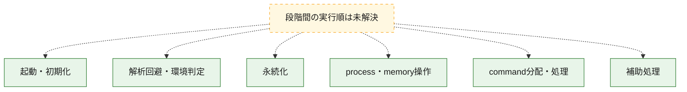
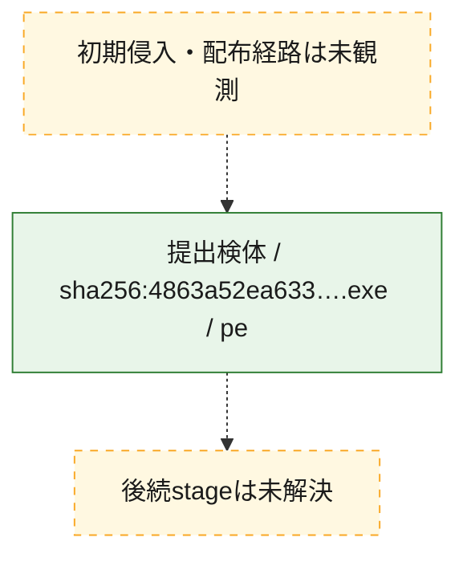
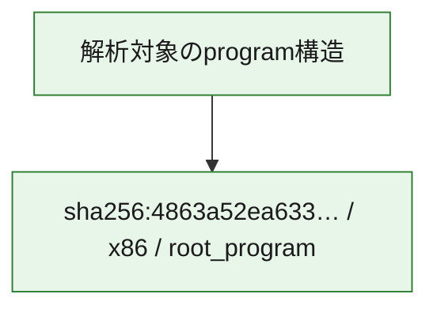

# 全体ロジック：4863a52ea633c1894b1331ae5cf4470e43be15e09765983a5f2bc853a6578a56

代表関数の静的証跡から、起動・初期化、解析回避・環境判定、永続化、process・memory操作、command分配・処理の処理群を確認しました。

## 読み方

- phaseの掲載順は解析上の整理順です。observed_call_edgesがない段階間の実行順を断定しません。
- 図の実線は静的に観測した関係、点線と黄色のノードは未観測・未解決の関係を示します。
- 図は静的な要約であり、動的実行を再現するものではありません。
- 詳細な関数解説とfingerprintは[STATIC-LOGIC.md](STATIC-LOGIC.md)を参照してください。

## 静的可視化

### 実行フロー

### 感染チェーン

### モジュール関係

## 処理段階

### 1. 起動・初期化

entry pointから初期化と後続処理への移行を確認します。
確度: `confirmed_static_function_evidence`

- `4863a52ea633c1894b1331ae5cf4470e43be15e09765983a5f2bc853a6578a56:ghidra:140001000` — 初期化と主要処理への分岐を行う入口関数です。 状態: `succeeded`、選定理由: `entry_point`, `meaningful_symbol_name`, `reviewed_call_centrality:1`, `role:entrypoint`, `small_program_complete_context`

### 2. 解析回避・環境判定

debugger、sandbox、仮想環境、時間差などの判定を確認します。
確度: `confirmed_static_function_evidence`

- `4863a52ea633c1894b1331ae5cf4470e43be15e09765983a5f2bc853a6578a56:ghidra:1400013e0` — debugger、仮想環境、sandbox、または時間差の確認に関係する関数です。 状態: `succeeded`、選定理由: `context_representative`, `reviewed_call_centrality:36`, `role:anti_analysis`, `small_program_complete_context`

### 3. 永続化

自動起動や永続化に関係する設定変更を確認します。
確度: `confirmed_static_function_evidence`

- `4863a52ea633c1894b1331ae5cf4470e43be15e09765983a5f2bc853a6578a56:ghidra:140004580` — 自動起動または永続化に関係する処理を含む関数です。 状態: `succeeded`、選定理由: `context_representative`, `reviewed_call_centrality:8`, `role:persistence`, `small_program_complete_context`

### 4. process・memory操作

process、thread、module、memory操作と実行移行を確認します。
確度: `confirmed_static_function_evidence`

- `4863a52ea633c1894b1331ae5cf4470e43be15e09765983a5f2bc853a6578a56:ghidra:140002930` — process、thread、module、またはmemory操作に関係する関数です。 状態: `succeeded`、選定理由: `context_representative`, `reviewed_call_centrality:7`, `role:process_or_memory_operation`, `small_program_complete_context`
- `4863a52ea633c1894b1331ae5cf4470e43be15e09765983a5f2bc853a6578a56:ghidra:140002bb0` — process、thread、module、またはmemory操作に関係する関数です。 状態: `succeeded`、選定理由: `context_representative`, `reviewed_call_centrality:11`, `role:process_or_memory_operation`, `small_program_complete_context`

### 5. command分配・処理

受信commandやtaskの解釈、分配、個別handlerへの移行を確認します。
確度: `confirmed_static_function_evidence_with_limits`

- `4863a52ea633c1894b1331ae5cf4470e43be15e09765983a5f2bc853a6578a56:ghidra:140001020` — commandの解釈、分配、または個別処理を担当する関数です。 状態: `succeeded`、選定理由: `context_representative`, `reviewed_call_centrality:32`, `role:command_dispatch_or_handler`, `small_program_complete_context`
- `4863a52ea633c1894b1331ae5cf4470e43be15e09765983a5f2bc853a6578a56:ghidra:140003cd0` — commandの解釈、分配、または個別処理を担当する関数です。 状態: `succeeded`、選定理由: `context_representative`, `reviewed_call_centrality:1`, `role:command_dispatch_or_handler`, `small_program_complete_context`
- `4863a52ea633c1894b1331ae5cf4470e43be15e09765983a5f2bc853a6578a56:ghidra:140003d20` — commandの解釈、分配、または個別処理を担当する関数です。 状態: `limited_bad_instruction_or_flow`、選定理由: `context_representative`, `reviewed_call_centrality:3`, `role:command_dispatch_or_handler`, `small_program_complete_context`
- `4863a52ea633c1894b1331ae5cf4470e43be15e09765983a5f2bc853a6578a56:ghidra:140003d90` — commandの解釈、分配、または個別処理を担当する関数です。 状態: `limited_bad_instruction_or_flow`、選定理由: `context_representative`, `reviewed_call_centrality:5`, `role:command_dispatch_or_handler`, `small_program_complete_context`
- `4863a52ea633c1894b1331ae5cf4470e43be15e09765983a5f2bc853a6578a56:ghidra:140003e20` — commandの解釈、分配、または個別処理を担当する関数です。 状態: `limited_bad_instruction_or_flow`、選定理由: `context_representative`, `reviewed_call_centrality:3`, `role:command_dispatch_or_handler`, `small_program_complete_context`
- `4863a52ea633c1894b1331ae5cf4470e43be15e09765983a5f2bc853a6578a56:ghidra:140003f80` — commandの解釈、分配、または個別処理を担当する関数です。 状態: `succeeded`、選定理由: `context_representative`, `reviewed_call_centrality:1`, `role:command_dispatch_or_handler`, `small_program_complete_context`
- `4863a52ea633c1894b1331ae5cf4470e43be15e09765983a5f2bc853a6578a56:ghidra:140004850` — commandの解釈、分配、または個別処理を担当する関数です。 状態: `succeeded`、選定理由: `context_representative`, `reviewed_call_centrality:15`, `role:command_dispatch_or_handler`, `small_program_complete_context`
- `4863a52ea633c1894b1331ae5cf4470e43be15e09765983a5f2bc853a6578a56:ghidra:140004e10` — commandの解釈、分配、または個別処理を担当する関数です。 状態: `limited_bad_instruction_or_flow`、選定理由: `meaningful_symbol_name`, `reviewed_call_centrality:7`, `role:command_dispatch_or_handler`, `small_program_complete_context`

### 6. 補助処理

主要処理を支える一般内部関数またはlibrary処理を確認します。
確度: `confirmed_static_function_evidence`

- `4863a52ea633c1894b1331ae5cf4470e43be15e09765983a5f2bc853a6578a56:ghidra:1400013a0` — 検体内部の一般処理を実装する関数です。 状態: `succeeded`、選定理由: `context_representative`, `reviewed_call_centrality:1`, `small_program_complete_context`
- `4863a52ea633c1894b1331ae5cf4470e43be15e09765983a5f2bc853a6578a56:ghidra:140002800` — 検体内部の一般処理を実装する関数です。 状態: `succeeded`、選定理由: `context_representative`, `reviewed_call_centrality:11`, `small_program_complete_context`
- `4863a52ea633c1894b1331ae5cf4470e43be15e09765983a5f2bc853a6578a56:ghidra:140002a80` — 検体内部の一般処理を実装する関数です。 状態: `succeeded`、選定理由: `context_representative`, `reviewed_call_centrality:1`, `small_program_complete_context`
- `4863a52ea633c1894b1331ae5cf4470e43be15e09765983a5f2bc853a6578a56:ghidra:140002ad0` — 検体内部の一般処理を実装する関数です。 状態: `succeeded`、選定理由: `context_representative`, `reviewed_call_centrality:5`, `small_program_complete_context`
- `4863a52ea633c1894b1331ae5cf4470e43be15e09765983a5f2bc853a6578a56:ghidra:140003c30` — compiler生成処理または汎用library処理とみられる関数です。 状態: `succeeded`、選定理由: `entry_point`, `meaningful_symbol_name`, `reviewed_call_centrality:3`, `small_program_complete_context`
- `4863a52ea633c1894b1331ae5cf4470e43be15e09765983a5f2bc853a6578a56:ghidra:140003ff0` — 検体内部の一般処理を実装する関数です。 状態: `succeeded`、選定理由: `context_representative`, `reviewed_call_centrality:2`, `small_program_complete_context`
- `4863a52ea633c1894b1331ae5cf4470e43be15e09765983a5f2bc853a6578a56:ghidra:140004060` — 検体内部の一般処理を実装する関数です。 状態: `succeeded`、選定理由: `context_representative`, `reviewed_call_centrality:4`, `small_program_complete_context`
- `4863a52ea633c1894b1331ae5cf4470e43be15e09765983a5f2bc853a6578a56:ghidra:140004370` — 検体内部の一般処理を実装する関数です。 状態: `succeeded`、選定理由: `context_representative`, `reviewed_call_centrality:11`, `small_program_complete_context`
- `4863a52ea633c1894b1331ae5cf4470e43be15e09765983a5f2bc853a6578a56:ghidra:140004510` — 検体内部の一般処理を実装する関数です。 状態: `succeeded`、選定理由: `context_representative`, `reviewed_call_centrality:6`, `small_program_complete_context`
- `4863a52ea633c1894b1331ae5cf4470e43be15e09765983a5f2bc853a6578a56:ghidra:140004690` — 検体内部の一般処理を実装する関数です。 状態: `succeeded`、選定理由: `meaningful_symbol_name`, `small_program_complete_context`
- `4863a52ea633c1894b1331ae5cf4470e43be15e09765983a5f2bc853a6578a56:ghidra:1400046a0` — 検体内部の一般処理を実装する関数です。 状態: `succeeded`、選定理由: `context_representative`, `reviewed_call_centrality:7`, `small_program_complete_context`
- `4863a52ea633c1894b1331ae5cf4470e43be15e09765983a5f2bc853a6578a56:ghidra:140004720` — 検体内部の一般処理を実装する関数です。 状態: `succeeded`、選定理由: `context_representative`, `reviewed_call_centrality:5`, `small_program_complete_context`
- `4863a52ea633c1894b1331ae5cf4470e43be15e09765983a5f2bc853a6578a56:ghidra:140004750` — 検体内部の一般処理を実装する関数です。 状態: `succeeded`、選定理由: `context_representative`, `reviewed_call_centrality:5`, `small_program_complete_context`
- `4863a52ea633c1894b1331ae5cf4470e43be15e09765983a5f2bc853a6578a56:ghidra:1400047c0` — 検体内部の一般処理を実装する関数です。 状態: `succeeded`、選定理由: `context_representative`, `reviewed_call_centrality:5`, `small_program_complete_context`
- `4863a52ea633c1894b1331ae5cf4470e43be15e09765983a5f2bc853a6578a56:ghidra:1400049f0` — 検体内部の一般処理を実装する関数です。 状態: `succeeded`、選定理由: `context_representative`, `reviewed_call_centrality:5`, `small_program_complete_context`
- `4863a52ea633c1894b1331ae5cf4470e43be15e09765983a5f2bc853a6578a56:ghidra:140004ab0` — 検体内部の一般処理を実装する関数です。 状態: `succeeded`、選定理由: `context_representative`, `reviewed_call_centrality:2`, `small_program_complete_context`
- `4863a52ea633c1894b1331ae5cf4470e43be15e09765983a5f2bc853a6578a56:ghidra:140004d10` — 検体内部の一般処理を実装する関数です。 状態: `succeeded`、選定理由: `context_representative`, `reviewed_call_centrality:1`, `small_program_complete_context`
- `4863a52ea633c1894b1331ae5cf4470e43be15e09765983a5f2bc853a6578a56:ghidra:140004dd0` — 検体内部の一般処理を実装する関数です。 状態: `succeeded`、選定理由: `context_representative`, `reviewed_call_centrality:3`, `small_program_complete_context`

## 観測したcall関係

- 代表関数間で直接解決できた呼出関係はありません。

## 解析範囲と制約

- 選定外関数は全体inventoryへ残しますが、関数本体の個別解説対象にはしていません。
- indirect call、難読化、packer、VM、壊れたcontrol flowによりcall関係が欠落する場合があります。
- 文書は静的解析に基づき、検体実行や外部通信による動的確認は行っていません。
