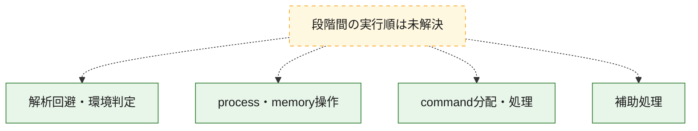
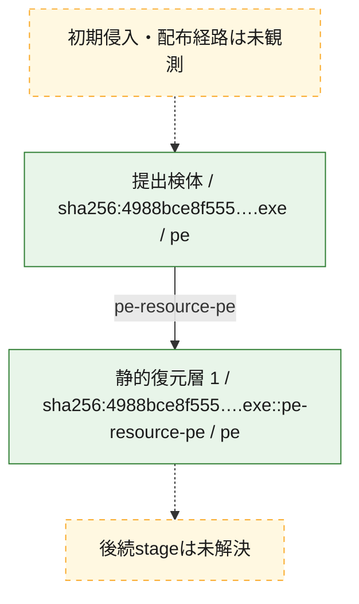
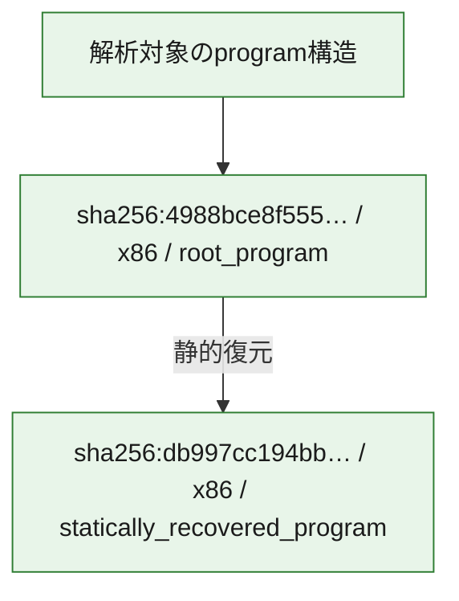

# 全体ロジック：4988bce8f555c18bed84659c87dcd00461c62537c3fd752ecc9ff3947eb9b562

代表関数の静的証跡から、解析回避・環境判定、process・memory操作、command分配・処理の処理群を確認しました。

## 読み方

- phaseの掲載順は解析上の整理順です。observed_call_edgesがない段階間の実行順を断定しません。
- 図の実線は静的に観測した関係、点線と黄色のノードは未観測・未解決の関係を示します。
- 図は静的な要約であり、動的実行を再現するものではありません。
- 詳細な関数解説とfingerprintは[STATIC-LOGIC.md](STATIC-LOGIC.md)を参照してください。

## 静的可視化

### 実行フロー

### 感染チェーン

### モジュール関係

## 処理段階

### 1. 解析回避・環境判定

debugger、sandbox、仮想環境、時間差などの判定を確認します。
確度: `confirmed_static_function_evidence`

- `4988bce8f555c18bed84659c87dcd00461c62537c3fd752ecc9ff3947eb9b562:ghidra:1400010c0` — debugger、仮想環境、sandbox、または時間差の確認に関係する関数です。 状態: `succeeded`、選定理由: `context_representative`, `reviewed_call_centrality:2`, `role:anti_analysis`
- `4988bce8f555c18bed84659c87dcd00461c62537c3fd752ecc9ff3947eb9b562:ghidra:140001160` — debugger、仮想環境、sandbox、または時間差の確認に関係する関数です。 状態: `succeeded`、選定理由: `context_representative`, `reviewed_call_centrality:2`, `role:anti_analysis`

### 2. process・memory操作

process、thread、module、memory操作と実行移行を確認します。
確度: `confirmed_static_function_evidence`

- `db997cc194bb7b4c562d7b3e2ee94486e90667d1a56a69121608476830fe42c9:ghidra:180002eb0` — process、thread、module、またはmemory操作に関係する関数です。 状態: `succeeded`、選定理由: `context_representative`, `reviewed_call_centrality:3`, `role:process_or_memory_operation`
- `db997cc194bb7b4c562d7b3e2ee94486e90667d1a56a69121608476830fe42c9:ghidra:18000a230` — process、thread、module、またはmemory操作に関係する関数です。 状態: `succeeded`、選定理由: `entry_point`, `meaningful_symbol_name`, `reviewed_call_centrality:5`, `role:process_or_memory_operation`
- `db997cc194bb7b4c562d7b3e2ee94486e90667d1a56a69121608476830fe42c9:ghidra:18000a400` — process、thread、module、またはmemory操作に関係する関数です。 状態: `succeeded`、選定理由: `entry_point`, `meaningful_symbol_name`, `reviewed_call_centrality:5`, `role:process_or_memory_operation`
- `db997cc194bb7b4c562d7b3e2ee94486e90667d1a56a69121608476830fe42c9:ghidra:18000a690` — process、thread、module、またはmemory操作に関係する関数です。 状態: `succeeded`、選定理由: `entry_point`, `meaningful_symbol_name`, `role:process_or_memory_operation`

### 3. command分配・処理

受信commandやtaskの解釈、分配、個別handlerへの移行を確認します。
確度: `confirmed_static_function_evidence`

- `db997cc194bb7b4c562d7b3e2ee94486e90667d1a56a69121608476830fe42c9:ghidra:180001030` — commandの解釈、分配、または個別処理を担当する関数です。 状態: `succeeded`、選定理由: `context_representative`, `reviewed_call_centrality:1`, `role:command_dispatch_or_handler`
- `db997cc194bb7b4c562d7b3e2ee94486e90667d1a56a69121608476830fe42c9:ghidra:1800010c0` — commandの解釈、分配、または個別処理を担当する関数です。 状態: `succeeded`、選定理由: `context_representative`, `reviewed_call_centrality:3`, `role:command_dispatch_or_handler`
- `db997cc194bb7b4c562d7b3e2ee94486e90667d1a56a69121608476830fe42c9:ghidra:180001370` — commandの解釈、分配、または個別処理を担当する関数です。 状態: `succeeded`、選定理由: `context_representative`, `reviewed_call_centrality:6`, `role:command_dispatch_or_handler`
- `db997cc194bb7b4c562d7b3e2ee94486e90667d1a56a69121608476830fe42c9:ghidra:180001460` — commandの解釈、分配、または個別処理を担当する関数です。 状態: `succeeded`、選定理由: `context_representative`, `reviewed_call_centrality:6`, `role:command_dispatch_or_handler`
- `db997cc194bb7b4c562d7b3e2ee94486e90667d1a56a69121608476830fe42c9:ghidra:180001740` — commandの解釈、分配、または個別処理を担当する関数です。 状態: `succeeded`、選定理由: `context_representative`, `reviewed_call_centrality:2`, `role:command_dispatch_or_handler`
- `db997cc194bb7b4c562d7b3e2ee94486e90667d1a56a69121608476830fe42c9:ghidra:180001950` — commandの解釈、分配、または個別処理を担当する関数です。 状態: `succeeded`、選定理由: `context_representative`, `reviewed_call_centrality:6`, `role:command_dispatch_or_handler`
- `db997cc194bb7b4c562d7b3e2ee94486e90667d1a56a69121608476830fe42c9:ghidra:180001c90` — commandの解釈、分配、または個別処理を担当する関数です。 状態: `succeeded`、選定理由: `context_representative`, `reviewed_call_centrality:14`, `role:command_dispatch_or_handler`
- `db997cc194bb7b4c562d7b3e2ee94486e90667d1a56a69121608476830fe42c9:ghidra:180002250` — commandの解釈、分配、または個別処理を担当する関数です。 状態: `succeeded`、選定理由: `context_representative`, `reviewed_call_centrality:13`, `role:command_dispatch_or_handler`
- `db997cc194bb7b4c562d7b3e2ee94486e90667d1a56a69121608476830fe42c9:ghidra:180002690` — commandの解釈、分配、または個別処理を担当する関数です。 状態: `succeeded`、選定理由: `context_representative`, `reviewed_call_centrality:21`, `role:command_dispatch_or_handler`
- `db997cc194bb7b4c562d7b3e2ee94486e90667d1a56a69121608476830fe42c9:ghidra:180002cc0` — commandの解釈、分配、または個別処理を担当する関数です。 状態: `succeeded`、選定理由: `context_representative`, `reviewed_call_centrality:4`, `role:command_dispatch_or_handler`
- `db997cc194bb7b4c562d7b3e2ee94486e90667d1a56a69121608476830fe42c9:ghidra:180009f40` — commandの解釈、分配、または個別処理を担当する関数です。 状態: `succeeded`、選定理由: `entry_point`, `meaningful_symbol_name`, `reviewed_call_centrality:2`, `role:command_dispatch_or_handler`
- `db997cc194bb7b4c562d7b3e2ee94486e90667d1a56a69121608476830fe42c9:ghidra:180010100` — commandの解釈、分配、または個別処理を担当する関数です。 状態: `succeeded`、選定理由: `entry_point`, `meaningful_symbol_name`, `reviewed_call_centrality:4`, `role:command_dispatch_or_handler`
- `4988bce8f555c18bed84659c87dcd00461c62537c3fd752ecc9ff3947eb9b562:ghidra:140001780` — commandの解釈、分配、または個別処理を担当する関数です。 状態: `succeeded`、選定理由: `context_representative`, `reviewed_call_centrality:4`, `role:command_dispatch_or_handler`

### 4. 補助処理

主要処理を支える一般内部関数またはlibrary処理を確認します。
確度: `confirmed_static_function_evidence`

- `db997cc194bb7b4c562d7b3e2ee94486e90667d1a56a69121608476830fe42c9:ghidra:180001000` — 検体内部の一般処理を実装する関数です。 状態: `succeeded`、選定理由: `context_representative`, `reviewed_call_centrality:1`
- `db997cc194bb7b4c562d7b3e2ee94486e90667d1a56a69121608476830fe42c9:ghidra:1800010b0` — 検体内部の一般処理を実装する関数です。 状態: `succeeded`、選定理由: `context_representative`, `reviewed_call_centrality:2`
- `db997cc194bb7b4c562d7b3e2ee94486e90667d1a56a69121608476830fe42c9:ghidra:180001100` — 検体内部の一般処理を実装する関数です。 状態: `succeeded`、選定理由: `context_representative`
- `db997cc194bb7b4c562d7b3e2ee94486e90667d1a56a69121608476830fe42c9:ghidra:180001110` — 検体内部の一般処理を実装する関数です。 状態: `succeeded`、選定理由: `context_representative`
- `db997cc194bb7b4c562d7b3e2ee94486e90667d1a56a69121608476830fe42c9:ghidra:180001120` — 検体内部の一般処理を実装する関数です。 状態: `succeeded`、選定理由: `context_representative`, `reviewed_call_centrality:4`
- `db997cc194bb7b4c562d7b3e2ee94486e90667d1a56a69121608476830fe42c9:ghidra:180001190` — 検体内部の一般処理を実装する関数です。 状態: `succeeded`、選定理由: `context_representative`, `reviewed_call_centrality:5`
- `db997cc194bb7b4c562d7b3e2ee94486e90667d1a56a69121608476830fe42c9:ghidra:180001240` — 検体内部の一般処理を実装する関数です。 状態: `succeeded`、選定理由: `context_representative`, `reviewed_call_centrality:8`
- `db997cc194bb7b4c562d7b3e2ee94486e90667d1a56a69121608476830fe42c9:ghidra:180001530` — 検体内部の一般処理を実装する関数です。 状態: `succeeded`、選定理由: `context_representative`, `reviewed_call_centrality:4`
- `db997cc194bb7b4c562d7b3e2ee94486e90667d1a56a69121608476830fe42c9:ghidra:1800017d0` — 検体内部の一般処理を実装する関数です。 状態: `succeeded`、選定理由: `context_representative`, `reviewed_call_centrality:4`
- `db997cc194bb7b4c562d7b3e2ee94486e90667d1a56a69121608476830fe42c9:ghidra:180001b80` — 検体内部の一般処理を実装する関数です。 状態: `succeeded`、選定理由: `context_representative`, `reviewed_call_centrality:4`
- `db997cc194bb7b4c562d7b3e2ee94486e90667d1a56a69121608476830fe42c9:ghidra:180002100` — 検体内部の一般処理を実装する関数です。 状態: `succeeded`、選定理由: `context_representative`, `reviewed_call_centrality:6`
- `db997cc194bb7b4c562d7b3e2ee94486e90667d1a56a69121608476830fe42c9:ghidra:1800024d0` — 検体内部の一般処理を実装する関数です。 状態: `succeeded`、選定理由: `context_representative`, `reviewed_call_centrality:1`
- `db997cc194bb7b4c562d7b3e2ee94486e90667d1a56a69121608476830fe42c9:ghidra:180002510` — 検体内部の一般処理を実装する関数です。 状態: `succeeded`、選定理由: `context_representative`, `reviewed_call_centrality:8`
- `db997cc194bb7b4c562d7b3e2ee94486e90667d1a56a69121608476830fe42c9:ghidra:180002a90` — 検体内部の一般処理を実装する関数です。 状態: `succeeded`、選定理由: `context_representative`, `reviewed_call_centrality:10`
- `db997cc194bb7b4c562d7b3e2ee94486e90667d1a56a69121608476830fe42c9:ghidra:180002da0` — 検体内部の一般処理を実装する関数です。 状態: `succeeded`、選定理由: `context_representative`, `reviewed_call_centrality:4`
- `db997cc194bb7b4c562d7b3e2ee94486e90667d1a56a69121608476830fe42c9:ghidra:18000cec0` — 検体内部の一般処理を実装する関数です。 状態: `succeeded`、選定理由: `meaningful_symbol_name`
- `4988bce8f555c18bed84659c87dcd00461c62537c3fd752ecc9ff3947eb9b562:ghidra:140001000` — 検体内部の一般処理を実装する関数です。 状態: `succeeded`、選定理由: `context_representative`, `reviewed_call_centrality:1`
- `4988bce8f555c18bed84659c87dcd00461c62537c3fd752ecc9ff3947eb9b562:ghidra:140001010` — 検体内部の一般処理を実装する関数です。 状態: `succeeded`、選定理由: `context_representative`, `reviewed_call_centrality:1`
- `4988bce8f555c18bed84659c87dcd00461c62537c3fd752ecc9ff3947eb9b562:ghidra:140001020` — 検体内部の一般処理を実装する関数です。 状態: `succeeded`、選定理由: `context_representative`
- `4988bce8f555c18bed84659c87dcd00461c62537c3fd752ecc9ff3947eb9b562:ghidra:140001080` — 検体内部の一般処理を実装する関数です。 状態: `succeeded`、選定理由: `context_representative`, `reviewed_call_centrality:2`
- `4988bce8f555c18bed84659c87dcd00461c62537c3fd752ecc9ff3947eb9b562:ghidra:140001110` — 検体内部の一般処理を実装する関数です。 状態: `succeeded`、選定理由: `context_representative`, `reviewed_call_centrality:1`
- `4988bce8f555c18bed84659c87dcd00461c62537c3fd752ecc9ff3947eb9b562:ghidra:140001140` — 検体内部の一般処理を実装する関数です。 状態: `succeeded`、選定理由: `context_representative`, `reviewed_call_centrality:1`
- `4988bce8f555c18bed84659c87dcd00461c62537c3fd752ecc9ff3947eb9b562:ghidra:140001150` — 検体内部の一般処理を実装する関数です。 状態: `succeeded`、選定理由: `context_representative`, `reviewed_call_centrality:1`
- `4988bce8f555c18bed84659c87dcd00461c62537c3fd752ecc9ff3947eb9b562:ghidra:1400011b0` — 検体内部の一般処理を実装する関数です。 状態: `succeeded`、選定理由: `context_representative`
- `4988bce8f555c18bed84659c87dcd00461c62537c3fd752ecc9ff3947eb9b562:ghidra:140001230` — 検体内部の一般処理を実装する関数です。 状態: `succeeded`、選定理由: `context_representative`, `reviewed_call_centrality:2`
- `4988bce8f555c18bed84659c87dcd00461c62537c3fd752ecc9ff3947eb9b562:ghidra:140001260` — 検体内部の一般処理を実装する関数です。 状態: `succeeded`、選定理由: `context_representative`
- `4988bce8f555c18bed84659c87dcd00461c62537c3fd752ecc9ff3947eb9b562:ghidra:140001480` — 検体内部の一般処理を実装する関数です。 状態: `succeeded`、選定理由: `context_representative`, `reviewed_call_centrality:2`
- `4988bce8f555c18bed84659c87dcd00461c62537c3fd752ecc9ff3947eb9b562:ghidra:140001490` — 検体内部の一般処理を実装する関数です。 状態: `succeeded`、選定理由: `context_representative`, `reviewed_call_centrality:1`
- `4988bce8f555c18bed84659c87dcd00461c62537c3fd752ecc9ff3947eb9b562:ghidra:1400014a0` — 検体内部の一般処理を実装する関数です。 状態: `succeeded`、選定理由: `context_representative`, `reviewed_call_centrality:1`
- `4988bce8f555c18bed84659c87dcd00461c62537c3fd752ecc9ff3947eb9b562:ghidra:1400014b0` — 検体内部の一般処理を実装する関数です。 状態: `succeeded`、選定理由: `context_representative`, `reviewed_call_centrality:1`
- `4988bce8f555c18bed84659c87dcd00461c62537c3fd752ecc9ff3947eb9b562:ghidra:1400014c0` — 検体内部の一般処理を実装する関数です。 状態: `succeeded`、選定理由: `context_representative`, `reviewed_call_centrality:1`
- `4988bce8f555c18bed84659c87dcd00461c62537c3fd752ecc9ff3947eb9b562:ghidra:1400014d0` — 検体内部の一般処理を実装する関数です。 状態: `succeeded`、選定理由: `context_representative`, `reviewed_call_centrality:2`
- `4988bce8f555c18bed84659c87dcd00461c62537c3fd752ecc9ff3947eb9b562:ghidra:140001500` — 検体内部の一般処理を実装する関数です。 状態: `succeeded`、選定理由: `context_representative`, `reviewed_call_centrality:2`
- `4988bce8f555c18bed84659c87dcd00461c62537c3fd752ecc9ff3947eb9b562:ghidra:140001530` — 検体内部の一般処理を実装する関数です。 状態: `succeeded`、選定理由: `context_representative`, `reviewed_call_centrality:2`
- `4988bce8f555c18bed84659c87dcd00461c62537c3fd752ecc9ff3947eb9b562:ghidra:140001560` — 検体内部の一般処理を実装する関数です。 状態: `succeeded`、選定理由: `context_representative`, `reviewed_call_centrality:2`
- `4988bce8f555c18bed84659c87dcd00461c62537c3fd752ecc9ff3947eb9b562:ghidra:140001590` — 検体内部の一般処理を実装する関数です。 状態: `succeeded`、選定理由: `context_representative`, `reviewed_call_centrality:2`
- `4988bce8f555c18bed84659c87dcd00461c62537c3fd752ecc9ff3947eb9b562:ghidra:1400015b0` — 検体内部の一般処理を実装する関数です。 状態: `succeeded`、選定理由: `context_representative`, `reviewed_call_centrality:1`
- `4988bce8f555c18bed84659c87dcd00461c62537c3fd752ecc9ff3947eb9b562:ghidra:1400015c0` — 検体内部の一般処理を実装する関数です。 状態: `succeeded`、選定理由: `context_representative`, `reviewed_call_centrality:1`
- `4988bce8f555c18bed84659c87dcd00461c62537c3fd752ecc9ff3947eb9b562:ghidra:1400015d0` — 検体内部の一般処理を実装する関数です。 状態: `succeeded`、選定理由: `context_representative`, `reviewed_call_centrality:1`
- `4988bce8f555c18bed84659c87dcd00461c62537c3fd752ecc9ff3947eb9b562:ghidra:1400015e0` — 検体内部の一般処理を実装する関数です。 状態: `succeeded`、選定理由: `context_representative`, `reviewed_call_centrality:2`
- `4988bce8f555c18bed84659c87dcd00461c62537c3fd752ecc9ff3947eb9b562:ghidra:140001600` — 検体内部の一般処理を実装する関数です。 状態: `succeeded`、選定理由: `context_representative`, `reviewed_call_centrality:2`
- `4988bce8f555c18bed84659c87dcd00461c62537c3fd752ecc9ff3947eb9b562:ghidra:140001690` — 検体内部の一般処理を実装する関数です。 状態: `succeeded`、選定理由: `context_representative`, `reviewed_call_centrality:3`
- `4988bce8f555c18bed84659c87dcd00461c62537c3fd752ecc9ff3947eb9b562:ghidra:140001750` — 検体内部の一般処理を実装する関数です。 状態: `succeeded`、選定理由: `context_representative`, `reviewed_call_centrality:2`
- `4988bce8f555c18bed84659c87dcd00461c62537c3fd752ecc9ff3947eb9b562:ghidra:140001830` — 検体内部の一般処理を実装する関数です。 状態: `succeeded`、選定理由: `context_representative`, `reviewed_call_centrality:7`
- `4988bce8f555c18bed84659c87dcd00461c62537c3fd752ecc9ff3947eb9b562:ghidra:14000cb20` — 検体内部の一般処理を実装する関数です。 状態: `succeeded`、選定理由: `meaningful_symbol_name`

## 観測したcall関係

- 代表関数間で直接解決できた呼出関係はありません。

## 解析範囲と制約

- 選定外関数は全体inventoryへ残しますが、関数本体の個別解説対象にはしていません。
- indirect call、難読化、packer、VM、壊れたcontrol flowによりcall関係が欠落する場合があります。
- 文書は静的解析に基づき、検体実行や外部通信による動的確認は行っていません。
