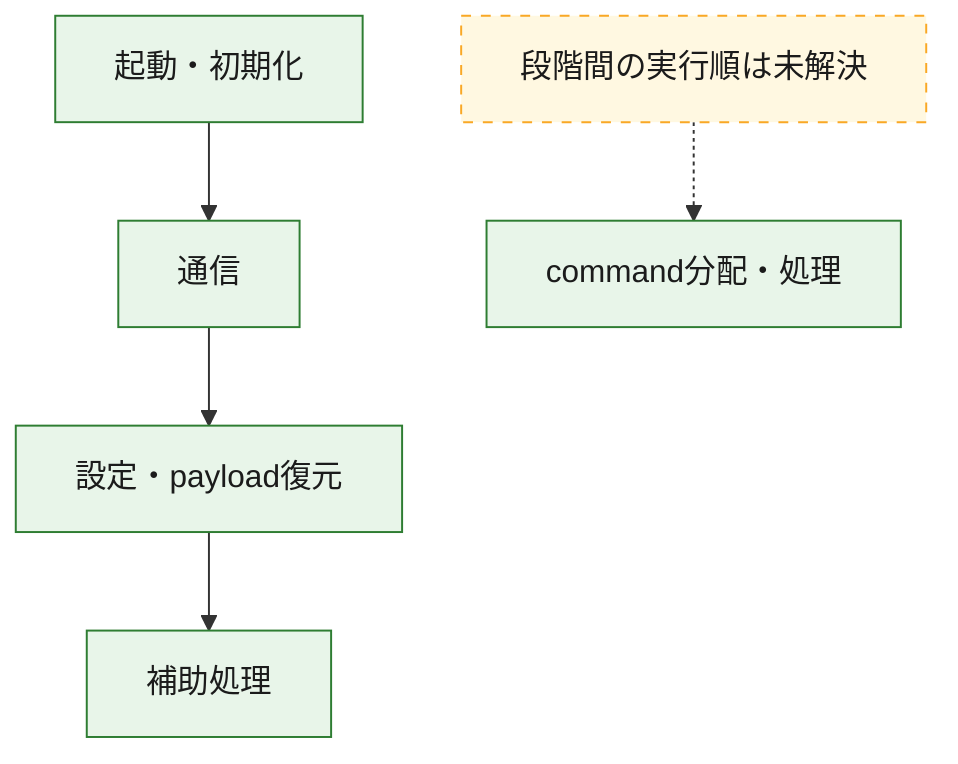
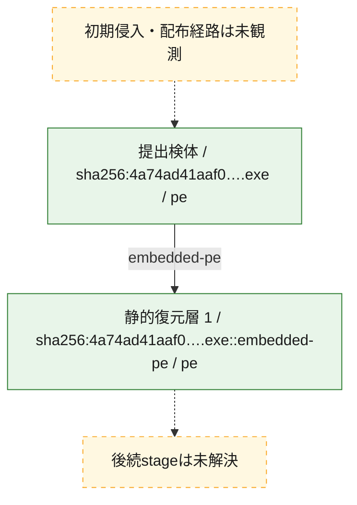
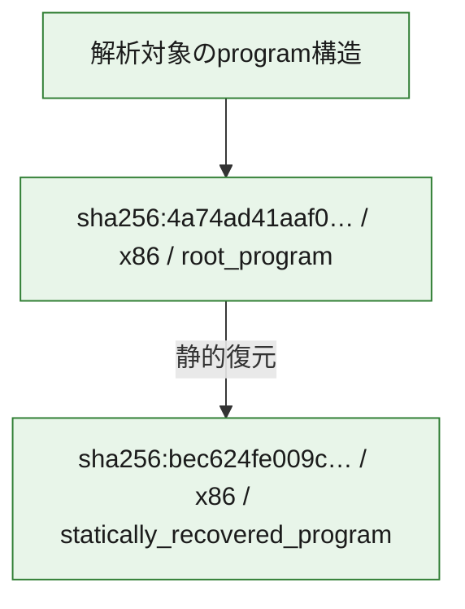

# 全体ロジック：4a74ad41aaf0453cd4f984912c695b7a1b763dee7665580a6900c8f79ff80072

代表関数の静的証跡から、起動・初期化、設定・payload復元、通信、command分配・処理の処理群を確認しました。

## 読み方

- phaseの掲載順は解析上の整理順です。observed_call_edgesがない段階間の実行順を断定しません。
- 図の実線は静的に観測した関係、点線と黄色のノードは未観測・未解決の関係を示します。
- 図は静的な要約であり、動的実行を再現するものではありません。
- 詳細な関数解説とfingerprintは[STATIC-LOGIC.md](STATIC-LOGIC.md)を参照してください。

## 静的可視化

### 実行フロー

### 感染チェーン

### モジュール関係

## 処理段階

### 1. 起動・初期化

entry pointから初期化と後続処理への移行を確認します。
確度: `confirmed_static_function_evidence`

- `bec624fe009c0b0b6534102573587fc54a1f99fc553f5487f07842728ed581df:ghidra:3317f1350` — 初期化と主要処理への分岐を行う入口関数です。 状態: `succeeded`、選定理由: `entry_point`, `meaningful_symbol_name`, `reviewed_call_centrality:5`, `role:entrypoint`
- `4a74ad41aaf0453cd4f984912c695b7a1b763dee7665580a6900c8f79ff80072:ghidra:1401eff80` — 初期化と主要処理への分岐を行う入口関数です。 状態: `succeeded`、選定理由: `entry_point`, `meaningful_symbol_name`, `probable_go_main_user_code`, `reviewed_call_centrality:23`, `role:entrypoint`
- `4a74ad41aaf0453cd4f984912c695b7a1b763dee7665580a6900c8f79ff80072:ghidra:1401f0aa0` — 初期化と主要処理への分岐を行う入口関数です。 状態: `succeeded`、選定理由: `entry_point`, `meaningful_symbol_name`, `reviewed_call_centrality:3`, `role:entrypoint`
- `4a74ad41aaf0453cd4f984912c695b7a1b763dee7665580a6900c8f79ff80072:ghidra:1401f0ae0` — 初期化と主要処理への分岐を行う入口関数です。 状態: `succeeded`、選定理由: `entry_point`, `meaningful_symbol_name`, `reviewed_call_centrality:1`, `role:entrypoint`
- `4a74ad41aaf0453cd4f984912c695b7a1b763dee7665580a6900c8f79ff80072:ghidra:1401f0b70` — 初期化と主要処理への分岐を行う入口関数です。 状態: `succeeded`、選定理由: `entry_point`, `meaningful_symbol_name`, `reviewed_call_centrality:1`, `role:entrypoint`
- `4a74ad41aaf0453cd4f984912c695b7a1b763dee7665580a6900c8f79ff80072:ghidra:1401f1000` — 初期化と主要処理への分岐を行う入口関数です。 状態: `succeeded`、選定理由: `entry_point`, `meaningful_symbol_name`, `reviewed_call_centrality:1`, `role:entrypoint`
- `4a74ad41aaf0453cd4f984912c695b7a1b763dee7665580a6900c8f79ff80072:ghidra:1401f1180` — 初期化と主要処理への分岐を行う入口関数です。 状態: `succeeded`、選定理由: `entry_point`, `meaningful_symbol_name`, `reviewed_call_centrality:3`, `role:entrypoint`
- `4a74ad41aaf0453cd4f984912c695b7a1b763dee7665580a6900c8f79ff80072:ghidra:1401f11a0` — 初期化と主要処理への分岐を行う入口関数です。 状態: `succeeded`、選定理由: `entry_point`, `meaningful_symbol_name`, `reviewed_call_centrality:1`, `role:entrypoint`
- `4a74ad41aaf0453cd4f984912c695b7a1b763dee7665580a6900c8f79ff80072:ghidra:1401f1330` — 初期化と主要処理への分岐を行う入口関数です。 状態: `succeeded`、選定理由: `entry_point`, `meaningful_symbol_name`, `reviewed_call_centrality:4`, `role:entrypoint`

### 2. 設定・payload復元

設定、resource、payload、暗号化データの復元・変換を確認します。
確度: `confirmed_static_function_evidence`

- `bec624fe009c0b0b6534102573587fc54a1f99fc553f5487f07842728ed581df:ghidra:3317f3480` — 設定、resource、payloadなどの解析・変換を行う関数です。 状態: `succeeded`、選定理由: `entry_point`, `meaningful_symbol_name`, `reviewed_call_centrality:17`, `role:config_or_data_transform`
- `bec624fe009c0b0b6534102573587fc54a1f99fc553f5487f07842728ed581df:ghidra:3317f3840` — 設定、resource、payloadなどの解析・変換を行う関数です。 状態: `succeeded`、選定理由: `entry_point`, `meaningful_symbol_name`, `reviewed_call_centrality:15`, `role:config_or_data_transform`
- `bec624fe009c0b0b6534102573587fc54a1f99fc553f5487f07842728ed581df:ghidra:3317f5860` — 設定、resource、payloadなどの解析・変換を行う関数です。 状態: `succeeded`、選定理由: `entry_point`, `meaningful_symbol_name`, `reviewed_call_centrality:3`, `role:config_or_data_transform`
- `bec624fe009c0b0b6534102573587fc54a1f99fc553f5487f07842728ed581df:ghidra:3317f5ad0` — 設定、resource、payloadなどの解析・変換を行う関数です。 状態: `succeeded`、選定理由: `entry_point`, `meaningful_symbol_name`, `reviewed_call_centrality:2`, `role:config_or_data_transform`
- `bec624fe009c0b0b6534102573587fc54a1f99fc553f5487f07842728ed581df:ghidra:3317f5d50` — 設定、resource、payloadなどの解析・変換を行う関数です。 状態: `succeeded`、選定理由: `entry_point`, `meaningful_symbol_name`, `reviewed_call_centrality:3`, `role:config_or_data_transform`
- `bec624fe009c0b0b6534102573587fc54a1f99fc553f5487f07842728ed581df:ghidra:3317f5f20` — 設定、resource、payloadなどの解析・変換を行う関数です。 状態: `succeeded`、選定理由: `entry_point`, `meaningful_symbol_name`, `reviewed_call_centrality:2`, `role:config_or_data_transform`
- `4a74ad41aaf0453cd4f984912c695b7a1b763dee7665580a6900c8f79ff80072:ghidra:140002110` — 設定、resource、payloadなどの解析・変換を行う関数です。 状態: `succeeded`、選定理由: `meaningful_symbol_name`, `reviewed_call_centrality:14`, `role:config_or_data_transform`
- `4a74ad41aaf0453cd4f984912c695b7a1b763dee7665580a6900c8f79ff80072:ghidra:14000c680` — 設定、resource、payloadなどの解析・変換を行う関数です。 状態: `succeeded`、選定理由: `meaningful_symbol_name`, `reviewed_call_centrality:4`, `role:config_or_data_transform`
- `4a74ad41aaf0453cd4f984912c695b7a1b763dee7665580a6900c8f79ff80072:ghidra:14000de60` — 設定、resource、payloadなどの解析・変換を行う関数です。 状態: `succeeded`、選定理由: `meaningful_symbol_name`, `reviewed_call_centrality:17`, `role:config_or_data_transform`
- `4a74ad41aaf0453cd4f984912c695b7a1b763dee7665580a6900c8f79ff80072:ghidra:14000e220` — 設定、resource、payloadなどの解析・変換を行う関数です。 状態: `succeeded`、選定理由: `meaningful_symbol_name`, `reviewed_call_centrality:16`, `role:config_or_data_transform`
- `4a74ad41aaf0453cd4f984912c695b7a1b763dee7665580a6900c8f79ff80072:ghidra:14000e9c0` — 設定、resource、payloadなどの解析・変換を行う関数です。 状態: `succeeded`、選定理由: `meaningful_symbol_name`, `reviewed_call_centrality:19`, `role:config_or_data_transform`
- `4a74ad41aaf0453cd4f984912c695b7a1b763dee7665580a6900c8f79ff80072:ghidra:140015fc0` — 設定、resource、payloadなどの解析・変換を行う関数です。 状態: `succeeded`、選定理由: `meaningful_symbol_name`, `reviewed_call_centrality:3`, `role:config_or_data_transform`
- `4a74ad41aaf0453cd4f984912c695b7a1b763dee7665580a6900c8f79ff80072:ghidra:140016020` — 暗号、hash、encoding、または復号処理に関係する関数です。 状態: `succeeded`、選定理由: `meaningful_symbol_name`, `reviewed_call_centrality:17`, `role:cryptographic_transform`
- `4a74ad41aaf0453cd4f984912c695b7a1b763dee7665580a6900c8f79ff80072:ghidra:140016e10` — 設定、resource、payloadなどの解析・変換を行う関数です。 状態: `succeeded`、選定理由: `meaningful_symbol_name`, `reviewed_call_centrality:11`, `role:config_or_data_transform`
- `4a74ad41aaf0453cd4f984912c695b7a1b763dee7665580a6900c8f79ff80072:ghidra:140016f40` — 設定、resource、payloadなどの解析・変換を行う関数です。 状態: `succeeded`、選定理由: `meaningful_symbol_name`, `reviewed_call_centrality:7`, `role:config_or_data_transform`
- `4a74ad41aaf0453cd4f984912c695b7a1b763dee7665580a6900c8f79ff80072:ghidra:1400175f0` — 暗号、hash、encoding、または復号処理に関係する関数です。 状態: `succeeded`、選定理由: `meaningful_symbol_name`, `reviewed_call_centrality:4`, `role:cryptographic_transform`
- `4a74ad41aaf0453cd4f984912c695b7a1b763dee7665580a6900c8f79ff80072:ghidra:140017870` — 暗号、hash、encoding、または復号処理に関係する関数です。 状態: `succeeded`、選定理由: `meaningful_symbol_name`, `reviewed_call_centrality:2`, `role:cryptographic_transform`
- `4a74ad41aaf0453cd4f984912c695b7a1b763dee7665580a6900c8f79ff80072:ghidra:140019fe0` — 設定、resource、payloadなどの解析・変換を行う関数です。 状態: `succeeded`、選定理由: `meaningful_symbol_name`, `reviewed_call_centrality:17`, `role:config_or_data_transform`
- `4a74ad41aaf0453cd4f984912c695b7a1b763dee7665580a6900c8f79ff80072:ghidra:140026000` — 設定、resource、payloadなどの解析・変換を行う関数です。 状態: `succeeded`、選定理由: `meaningful_symbol_name`, `reviewed_call_centrality:23`, `role:config_or_data_transform`
- `4a74ad41aaf0453cd4f984912c695b7a1b763dee7665580a6900c8f79ff80072:ghidra:14003b320` — 設定、resource、payloadなどの解析・変換を行う関数です。 状態: `succeeded`、選定理由: `meaningful_symbol_name`, `reviewed_call_centrality:16`, `role:config_or_data_transform`
- `4a74ad41aaf0453cd4f984912c695b7a1b763dee7665580a6900c8f79ff80072:ghidra:140040aa0` — 設定、resource、payloadなどの解析・変換を行う関数です。 状態: `succeeded`、選定理由: `meaningful_symbol_name`, `reviewed_call_centrality:33`, `role:config_or_data_transform`
- `4a74ad41aaf0453cd4f984912c695b7a1b763dee7665580a6900c8f79ff80072:ghidra:140057c50` — 設定、resource、payloadなどの解析・変換を行う関数です。 状態: `succeeded`、選定理由: `meaningful_symbol_name`, `reviewed_call_centrality:2`, `role:config_or_data_transform`
- `4a74ad41aaf0453cd4f984912c695b7a1b763dee7665580a6900c8f79ff80072:ghidra:140058380` — 設定、resource、payloadなどの解析・変換を行う関数です。 状態: `succeeded`、選定理由: `meaningful_symbol_name`, `reviewed_call_centrality:3`, `role:config_or_data_transform`

### 3. 通信

通信初期化、endpoint処理、送受信の役割を確認します。
確度: `confirmed_static_function_evidence`

- `4a74ad41aaf0453cd4f984912c695b7a1b763dee7665580a6900c8f79ff80072:ghidra:14003c4e0` — 通信初期化、送受信、またはendpoint処理に関係する関数です。 状態: `succeeded`、選定理由: `meaningful_symbol_name`, `reviewed_call_centrality:17`, `role:network_communication`
- `4a74ad41aaf0453cd4f984912c695b7a1b763dee7665580a6900c8f79ff80072:ghidra:140042c70` — 通信初期化、送受信、またはendpoint処理に関係する関数です。 状態: `succeeded`、選定理由: `meaningful_symbol_name`, `reviewed_call_centrality:44`, `role:network_communication`

### 4. command分配・処理

受信commandやtaskの解釈、分配、個別handlerへの移行を確認します。
確度: `confirmed_static_function_evidence`

- `bec624fe009c0b0b6534102573587fc54a1f99fc553f5487f07842728ed581df:ghidra:331803d20` — commandの解釈、分配、または個別処理を担当する関数です。 状態: `succeeded`、選定理由: `entry_point`, `meaningful_symbol_name`, `reviewed_call_centrality:5`, `role:command_dispatch_or_handler`
- `4a74ad41aaf0453cd4f984912c695b7a1b763dee7665580a6900c8f79ff80072:ghidra:1400675c0` — commandの解釈、分配、または個別処理を担当する関数です。 状態: `succeeded`、選定理由: `meaningful_symbol_name`, `role:command_dispatch_or_handler`

### 5. 補助処理

主要処理を支える一般内部関数またはlibrary処理を確認します。
確度: `confirmed_static_function_evidence`

- `bec624fe009c0b0b6534102573587fc54a1f99fc553f5487f07842728ed581df:ghidra:3317f3360` — 検体内部の一般処理を実装する関数です。 状態: `succeeded`、選定理由: `entry_point`, `meaningful_symbol_name`, `reviewed_call_centrality:3`
- `bec624fe009c0b0b6534102573587fc54a1f99fc553f5487f07842728ed581df:ghidra:3317f33f0` — 検体内部の一般処理を実装する関数です。 状態: `succeeded`、選定理由: `entry_point`, `meaningful_symbol_name`, `reviewed_call_centrality:3`
- `bec624fe009c0b0b6534102573587fc54a1f99fc553f5487f07842728ed581df:ghidra:3317f4d30` — 検体内部の一般処理を実装する関数です。 状態: `succeeded`、選定理由: `entry_point`, `meaningful_symbol_name`
- `bec624fe009c0b0b6534102573587fc54a1f99fc553f5487f07842728ed581df:ghidra:3317f4d40` — 検体内部の一般処理を実装する関数です。 状態: `succeeded`、選定理由: `entry_point`, `meaningful_symbol_name`
- `bec624fe009c0b0b6534102573587fc54a1f99fc553f5487f07842728ed581df:ghidra:3317f4d60` — 検体内部の一般処理を実装する関数です。 状態: `succeeded`、選定理由: `entry_point`, `meaningful_symbol_name`
- `bec624fe009c0b0b6534102573587fc54a1f99fc553f5487f07842728ed581df:ghidra:3317f4d80` — 検体内部の一般処理を実装する関数です。 状態: `succeeded`、選定理由: `entry_point`, `meaningful_symbol_name`, `reviewed_call_centrality:1`
- `bec624fe009c0b0b6534102573587fc54a1f99fc553f5487f07842728ed581df:ghidra:3317f4dc0` — 検体内部の一般処理を実装する関数です。 状態: `succeeded`、選定理由: `entry_point`, `meaningful_symbol_name`
- `bec624fe009c0b0b6534102573587fc54a1f99fc553f5487f07842728ed581df:ghidra:3317f4ec0` — 検体内部の一般処理を実装する関数です。 状態: `succeeded`、選定理由: `entry_point`, `meaningful_symbol_name`, `reviewed_call_centrality:4`
- `bec624fe009c0b0b6534102573587fc54a1f99fc553f5487f07842728ed581df:ghidra:3317f5740` — 検体内部の一般処理を実装する関数です。 状態: `succeeded`、選定理由: `entry_point`, `meaningful_symbol_name`
- `bec624fe009c0b0b6534102573587fc54a1f99fc553f5487f07842728ed581df:ghidra:3317f5790` — 検体内部の一般処理を実装する関数です。 状態: `succeeded`、選定理由: `entry_point`, `meaningful_symbol_name`, `reviewed_call_centrality:2`
- `bec624fe009c0b0b6534102573587fc54a1f99fc553f5487f07842728ed581df:ghidra:3317f60e0` — 検体内部の一般処理を実装する関数です。 状態: `succeeded`、選定理由: `entry_point`, `meaningful_symbol_name`, `reviewed_call_centrality:4`
- `bec624fe009c0b0b6534102573587fc54a1f99fc553f5487f07842728ed581df:ghidra:3317f6260` — 検体内部の一般処理を実装する関数です。 状態: `succeeded`、選定理由: `entry_point`, `meaningful_symbol_name`, `reviewed_call_centrality:3`
- `bec624fe009c0b0b6534102573587fc54a1f99fc553f5487f07842728ed581df:ghidra:3317f63e0` — 検体内部の一般処理を実装する関数です。 状態: `succeeded`、選定理由: `entry_point`, `meaningful_symbol_name`, `reviewed_call_centrality:1`
- `bec624fe009c0b0b6534102573587fc54a1f99fc553f5487f07842728ed581df:ghidra:3317f64d0` — 検体内部の一般処理を実装する関数です。 状態: `succeeded`、選定理由: `entry_point`, `meaningful_symbol_name`, `reviewed_call_centrality:1`
- `bec624fe009c0b0b6534102573587fc54a1f99fc553f5487f07842728ed581df:ghidra:3317f6550` — 検体内部の一般処理を実装する関数です。 状態: `succeeded`、選定理由: `entry_point`, `meaningful_symbol_name`
- `bec624fe009c0b0b6534102573587fc54a1f99fc553f5487f07842728ed581df:ghidra:3317f6580` — 検体内部の一般処理を実装する関数です。 状態: `succeeded`、選定理由: `entry_point`, `meaningful_symbol_name`
- `bec624fe009c0b0b6534102573587fc54a1f99fc553f5487f07842728ed581df:ghidra:3317f65c0` — 検体内部の一般処理を実装する関数です。 状態: `succeeded`、選定理由: `entry_point`, `meaningful_symbol_name`, `reviewed_call_centrality:3`
- `bec624fe009c0b0b6534102573587fc54a1f99fc553f5487f07842728ed581df:ghidra:3317f65d0` — 検体内部の一般処理を実装する関数です。 状態: `succeeded`、選定理由: `entry_point`, `meaningful_symbol_name`, `reviewed_call_centrality:1`
- `bec624fe009c0b0b6534102573587fc54a1f99fc553f5487f07842728ed581df:ghidra:3317f6640` — 検体内部の一般処理を実装する関数です。 状態: `succeeded`、選定理由: `entry_point`, `meaningful_symbol_name`, `reviewed_call_centrality:1`
- `bec624fe009c0b0b6534102573587fc54a1f99fc553f5487f07842728ed581df:ghidra:3317f6660` — 検体内部の一般処理を実装する関数です。 状態: `succeeded`、選定理由: `entry_point`, `meaningful_symbol_name`
- `bec624fe009c0b0b6534102573587fc54a1f99fc553f5487f07842728ed581df:ghidra:3317f66c0` — 検体内部の一般処理を実装する関数です。 状態: `succeeded`、選定理由: `entry_point`, `meaningful_symbol_name`, `reviewed_call_centrality:2`
- `bec624fe009c0b0b6534102573587fc54a1f99fc553f5487f07842728ed581df:ghidra:3317f67a0` — 検体内部の一般処理を実装する関数です。 状態: `succeeded`、選定理由: `entry_point`, `meaningful_symbol_name`
- `bec624fe009c0b0b6534102573587fc54a1f99fc553f5487f07842728ed581df:ghidra:3317f6860` — 検体内部の一般処理を実装する関数です。 状態: `succeeded`、選定理由: `entry_point`, `meaningful_symbol_name`, `reviewed_call_centrality:1`
- `bec624fe009c0b0b6534102573587fc54a1f99fc553f5487f07842728ed581df:ghidra:331802b10` — compiler生成処理または汎用library処理とみられる関数です。 状態: `succeeded`、選定理由: `entry_point`, `meaningful_symbol_name`, `reviewed_call_centrality:1`
- `4a74ad41aaf0453cd4f984912c695b7a1b763dee7665580a6900c8f79ff80072:ghidra:1400014d0` — 検体内部の一般処理を実装する関数です。 状態: `succeeded`、選定理由: `entry_point`, `meaningful_symbol_name`, `reviewed_call_centrality:1`
- `4a74ad41aaf0453cd4f984912c695b7a1b763dee7665580a6900c8f79ff80072:ghidra:1401202a0` — compiler生成処理または汎用library処理とみられる関数です。 状態: `succeeded`、選定理由: `entry_point`, `meaningful_symbol_name`, `reviewed_call_centrality:1`
- `4a74ad41aaf0453cd4f984912c695b7a1b763dee7665580a6900c8f79ff80072:ghidra:1401202d0` — compiler生成処理または汎用library処理とみられる関数です。 状態: `succeeded`、選定理由: `entry_point`, `meaningful_symbol_name`, `reviewed_call_centrality:2`
- `4a74ad41aaf0453cd4f984912c695b7a1b763dee7665580a6900c8f79ff80072:ghidra:140132560` — compiler生成処理または汎用library処理とみられる関数です。 状態: `succeeded`、選定理由: `entry_point`, `meaningful_symbol_name`, `reviewed_call_centrality:14`

## 観測したcall関係

- `4a74ad41aaf0453cd4f984912c695b7a1b763dee7665580a6900c8f79ff80072:ghidra:14000de60` → `4a74ad41aaf0453cd4f984912c695b7a1b763dee7665580a6900c8f79ff80072:ghidra:14000c680` （`configuration` → `configuration`）
- `4a74ad41aaf0453cd4f984912c695b7a1b763dee7665580a6900c8f79ff80072:ghidra:14000e220` → `4a74ad41aaf0453cd4f984912c695b7a1b763dee7665580a6900c8f79ff80072:ghidra:14000c680` （`configuration` → `configuration`）
- `4a74ad41aaf0453cd4f984912c695b7a1b763dee7665580a6900c8f79ff80072:ghidra:14000e9c0` → `4a74ad41aaf0453cd4f984912c695b7a1b763dee7665580a6900c8f79ff80072:ghidra:14000e220` （`configuration` → `configuration`）
- `4a74ad41aaf0453cd4f984912c695b7a1b763dee7665580a6900c8f79ff80072:ghidra:140015fc0` → `4a74ad41aaf0453cd4f984912c695b7a1b763dee7665580a6900c8f79ff80072:ghidra:14000e9c0` （`configuration` → `configuration`）
- `4a74ad41aaf0453cd4f984912c695b7a1b763dee7665580a6900c8f79ff80072:ghidra:140016f40` → `4a74ad41aaf0453cd4f984912c695b7a1b763dee7665580a6900c8f79ff80072:ghidra:140016e10` （`configuration` → `configuration`）
- `4a74ad41aaf0453cd4f984912c695b7a1b763dee7665580a6900c8f79ff80072:ghidra:1400175f0` → `4a74ad41aaf0453cd4f984912c695b7a1b763dee7665580a6900c8f79ff80072:ghidra:140017870` （`configuration` → `configuration`）
- `4a74ad41aaf0453cd4f984912c695b7a1b763dee7665580a6900c8f79ff80072:ghidra:140040aa0` → `4a74ad41aaf0453cd4f984912c695b7a1b763dee7665580a6900c8f79ff80072:ghidra:140026000` （`configuration` → `configuration`）
- `4a74ad41aaf0453cd4f984912c695b7a1b763dee7665580a6900c8f79ff80072:ghidra:140042c70` → `4a74ad41aaf0453cd4f984912c695b7a1b763dee7665580a6900c8f79ff80072:ghidra:14003b320` （`communication` → `configuration`）
- `4a74ad41aaf0453cd4f984912c695b7a1b763dee7665580a6900c8f79ff80072:ghidra:140042c70` → `4a74ad41aaf0453cd4f984912c695b7a1b763dee7665580a6900c8f79ff80072:ghidra:14003c4e0` （`communication` → `communication`）
- `4a74ad41aaf0453cd4f984912c695b7a1b763dee7665580a6900c8f79ff80072:ghidra:140042c70` → `4a74ad41aaf0453cd4f984912c695b7a1b763dee7665580a6900c8f79ff80072:ghidra:140040aa0` （`communication` → `configuration`）
- `4a74ad41aaf0453cd4f984912c695b7a1b763dee7665580a6900c8f79ff80072:ghidra:140058380` → `4a74ad41aaf0453cd4f984912c695b7a1b763dee7665580a6900c8f79ff80072:ghidra:140057c50` （`configuration` → `configuration`）
- `4a74ad41aaf0453cd4f984912c695b7a1b763dee7665580a6900c8f79ff80072:ghidra:1401eff80` → `4a74ad41aaf0453cd4f984912c695b7a1b763dee7665580a6900c8f79ff80072:ghidra:140042c70` （`startup` → `communication`）
- `bec624fe009c0b0b6534102573587fc54a1f99fc553f5487f07842728ed581df:ghidra:3317f5860` → `bec624fe009c0b0b6534102573587fc54a1f99fc553f5487f07842728ed581df:ghidra:3317f4ec0` （`configuration` → `support`）
- `bec624fe009c0b0b6534102573587fc54a1f99fc553f5487f07842728ed581df:ghidra:3317f5ad0` → `bec624fe009c0b0b6534102573587fc54a1f99fc553f5487f07842728ed581df:ghidra:3317f4ec0` （`configuration` → `support`）
- `bec624fe009c0b0b6534102573587fc54a1f99fc553f5487f07842728ed581df:ghidra:3317f5d50` → `bec624fe009c0b0b6534102573587fc54a1f99fc553f5487f07842728ed581df:ghidra:3317f4ec0` （`configuration` → `support`）
- `bec624fe009c0b0b6534102573587fc54a1f99fc553f5487f07842728ed581df:ghidra:3317f5f20` → `bec624fe009c0b0b6534102573587fc54a1f99fc553f5487f07842728ed581df:ghidra:3317f4ec0` （`configuration` → `support`）
- `ghidra-function:020a9604e0cb3e737476f340` → `ghidra-external:923da582bae7ba8a5b4bb822` （`unclassified` → `unclassified`）
- `ghidra-function:020a9604e0cb3e737476f340` → `ghidra-function:7516e1b2b3df362f16e3dc41` （`unclassified` → `unclassified`）
- `ghidra-function:020a9604e0cb3e737476f340` → `ghidra-function:954711d7d476641b73f36903` （`unclassified` → `unclassified`）
- `ghidra-function:060658860ea8f75acee54e1f` → `ghidra-external:3d363672c39d94b4aa117546` （`unclassified` → `unclassified`）
- `ghidra-function:060658860ea8f75acee54e1f` → `ghidra-function:19d180b17dade926cd8799f7` （`unclassified` → `unclassified`）
- `ghidra-function:060658860ea8f75acee54e1f` → `ghidra-function:f45906388a2d752b5bce1142` （`unclassified` → `unclassified`）
- `ghidra-function:0efa72203c4d1d24990f350f` → `ghidra-external:3ccaf1be85fa76ea257497ea` （`unclassified` → `unclassified`）
- `ghidra-function:0efa72203c4d1d24990f350f` → `ghidra-external:3d363672c39d94b4aa117546` （`unclassified` → `unclassified`）
- `ghidra-function:0efa72203c4d1d24990f350f` → `ghidra-external:643d2ab568f33c44133821d7` （`unclassified` → `unclassified`）
- `ghidra-function:0efa72203c4d1d24990f350f` → `ghidra-function:f2a13d4db948638a38885a40` （`unclassified` → `unclassified`）
- `ghidra-function:11ce70545d4516919c3c09ad` → `ghidra-external:3d363672c39d94b4aa117546` （`unclassified` → `unclassified`）
- `ghidra-function:11ce70545d4516919c3c09ad` → `ghidra-function:19d180b17dade926cd8799f7` （`unclassified` → `unclassified`）
- `ghidra-function:11ce70545d4516919c3c09ad` → `ghidra-function:f45906388a2d752b5bce1142` （`unclassified` → `unclassified`）
- `ghidra-function:1754ad6f34a8b3dc99dfd724` → `ghidra-external:a9f7aa9bddcb4569b918f841` （`unclassified` → `unclassified`）
- `ghidra-function:1754ad6f34a8b3dc99dfd724` → `ghidra-function:e306ddd78c4b2026dda6dfb3` （`unclassified` → `unclassified`）
- `ghidra-function:1b2d2e5984bc9904a60f47b3` → `ghidra-external:643d2ab568f33c44133821d7` （`unclassified` → `unclassified`）
- `ghidra-function:1b2d2e5984bc9904a60f47b3` → `ghidra-external:87e34b260e70b607ecd26dce` （`unclassified` → `unclassified`）
- `ghidra-function:1b2d2e5984bc9904a60f47b3` → `ghidra-external:ff8db4b4189b0c53f968872f` （`unclassified` → `unclassified`）
- `ghidra-function:1b2d2e5984bc9904a60f47b3` → `ghidra-function:1d21a928065b640358240aff` （`unclassified` → `unclassified`）
- `ghidra-function:1b2d2e5984bc9904a60f47b3` → `ghidra-function:2814c71d9c68f47bf0348933` （`unclassified` → `unclassified`）
- `ghidra-function:1b2d2e5984bc9904a60f47b3` → `ghidra-function:83d9da62662149d57f42723f` （`unclassified` → `unclassified`）
- `ghidra-function:1b2d2e5984bc9904a60f47b3` → `ghidra-function:bdfbfeed6faad6eaceb71521` （`unclassified` → `unclassified`）
- `ghidra-function:1b2d2e5984bc9904a60f47b3` → `ghidra-function:c6644b3b88fbbc457cc145d7` （`unclassified` → `unclassified`）
- `ghidra-function:1b2d2e5984bc9904a60f47b3` → `ghidra-function:ccf77bbc4cc0534eda0029a0` （`unclassified` → `unclassified`）
- `ghidra-function:1b2d2e5984bc9904a60f47b3` → `ghidra-function:d3ad5841d8e98e7bf7bf1247` （`unclassified` → `unclassified`）
- `ghidra-function:1b2d2e5984bc9904a60f47b3` → `ghidra-function:f5a4673f45afe6284da467df` （`unclassified` → `unclassified`）
- `ghidra-function:1b2d2e5984bc9904a60f47b3` → `ghidra-function:f86741e18ea79ff6cc8ed52f` （`unclassified` → `unclassified`）
- `ghidra-function:24bbc070460eebade5bbeb86` → `ghidra-external:9440d79aeda695e74a187bda` （`unclassified` → `unclassified`）
- `ghidra-function:294e9e286561b01eeb2a73f5` → `ghidra-external:1ee624730096e405c618ebfa` （`unclassified` → `unclassified`）
- `ghidra-function:294e9e286561b01eeb2a73f5` → `ghidra-external:202661768a28a798679b9835` （`unclassified` → `unclassified`）
- `ghidra-function:294e9e286561b01eeb2a73f5` → `ghidra-external:55a69057d5b213fab3bb3d26` （`unclassified` → `unclassified`）
- `ghidra-function:294e9e286561b01eeb2a73f5` → `ghidra-external:9489bcff54794f1af3596562` （`unclassified` → `unclassified`）
- `ghidra-function:294e9e286561b01eeb2a73f5` → `ghidra-external:ea940c6561f275ff72388c30` （`unclassified` → `unclassified`）
- `ghidra-function:294e9e286561b01eeb2a73f5` → `ghidra-external:ed4976482b330ca434f01b32` （`unclassified` → `unclassified`）
- `ghidra-function:294e9e286561b01eeb2a73f5` → `ghidra-function:09798d4203797b2a0c4553f9` （`unclassified` → `unclassified`）
- `ghidra-function:294e9e286561b01eeb2a73f5` → `ghidra-function:257f4653b8c9c863b4c6fcf0` （`unclassified` → `unclassified`）
- `ghidra-function:294e9e286561b01eeb2a73f5` → `ghidra-function:61ba2188bcf791ce489999db` （`unclassified` → `unclassified`）
- `ghidra-function:294e9e286561b01eeb2a73f5` → `ghidra-function:667683774ddf4200ae9a6e75` （`unclassified` → `unclassified`）
- `ghidra-function:294e9e286561b01eeb2a73f5` → `ghidra-function:75b0c47e4bb3eeda4617e41a` （`unclassified` → `unclassified`）
- `ghidra-function:294e9e286561b01eeb2a73f5` → `ghidra-function:99d395527a65b54c10d7ad07` （`unclassified` → `unclassified`）
- `ghidra-function:294e9e286561b01eeb2a73f5` → `ghidra-function:c721d80baf28d335281cc3aa` （`unclassified` → `unclassified`）
- `ghidra-function:3596d1b118bc47f09a6e9f5e` → `ghidra-external:1ee624730096e405c618ebfa` （`unclassified` → `unclassified`）
- `ghidra-function:3596d1b118bc47f09a6e9f5e` → `ghidra-external:202661768a28a798679b9835` （`unclassified` → `unclassified`）
- `ghidra-function:3596d1b118bc47f09a6e9f5e` → `ghidra-external:ea940c6561f275ff72388c30` （`unclassified` → `unclassified`）
- `ghidra-function:3596d1b118bc47f09a6e9f5e` → `ghidra-external:ed4976482b330ca434f01b32` （`unclassified` → `unclassified`）
- `ghidra-function:3596d1b118bc47f09a6e9f5e` → `ghidra-function:667683774ddf4200ae9a6e75` （`unclassified` → `unclassified`）
- `ghidra-function:3596d1b118bc47f09a6e9f5e` → `ghidra-function:87ee5f6e4a9b121208ce302b` （`unclassified` → `unclassified`）
- `ghidra-function:3596d1b118bc47f09a6e9f5e` → `ghidra-function:c721d80baf28d335281cc3aa` （`unclassified` → `unclassified`）
- `ghidra-function:3596d1b118bc47f09a6e9f5e` → `ghidra-function:d59b589d914ec25e3d4a4444` （`unclassified` → `unclassified`）
- `ghidra-function:38bf183b1c86480a22987551` → `ghidra-function:45438800541fbb7f86cd9318` （`unclassified` → `unclassified`）
- `ghidra-function:38bf183b1c86480a22987551` → `ghidra-function:7c3e8df3a687344989924156` （`unclassified` → `unclassified`）
- `ghidra-function:38bf183b1c86480a22987551` → `ghidra-function:d2d41110be2defe161de15f1` （`unclassified` → `unclassified`）
- `ghidra-function:428e56367004871a873730b7` → `ghidra-external:5e46aa05d90a90c855164b68` （`unclassified` → `unclassified`）
- `ghidra-function:428e56367004871a873730b7` → `ghidra-external:d78ee4b3db21f91f760bf3c6` （`unclassified` → `unclassified`）
- `ghidra-function:428e56367004871a873730b7` → `ghidra-function:9633e2317f4c839a54c7aa44` （`unclassified` → `unclassified`）
- `ghidra-function:4beec77f8baaa47c25e448e2` → `ghidra-external:6a9f0d18d163b85bb0d6cc1a` （`unclassified` → `unclassified`）
- `ghidra-function:51c4b5ee24bd22645aece61b` → `ghidra-external:54e69e44c21f4a6f474563ed` （`unclassified` → `unclassified`）
- `ghidra-function:51c4b5ee24bd22645aece61b` → `ghidra-external:5e46aa05d90a90c855164b68` （`unclassified` → `unclassified`）
- `ghidra-function:51c4b5ee24bd22645aece61b` → `ghidra-function:72ae554b4deab3e0c805249f` （`unclassified` → `unclassified`）
- `ghidra-function:54f8f549b859a62f1a0e8939` → `ghidra-external:3ccaf1be85fa76ea257497ea` （`unclassified` → `unclassified`）
- `ghidra-function:54f8f549b859a62f1a0e8939` → `ghidra-external:3d363672c39d94b4aa117546` （`unclassified` → `unclassified`）
- `ghidra-function:5b3a58cfa4e34040b55de1b4` → `ghidra-external:e6bce9221913801549f6263d` （`unclassified` → `unclassified`）
- `ghidra-function:616e5c9e996639f7ee219636` → `ghidra-external:58859a8c5cbc539dfe21d588` （`unclassified` → `unclassified`）
- `ghidra-function:6436a27bc9a5bac4b7ec7d53` → `ghidra-external:15b98b801abf2c12eaaf4be1` （`unclassified` → `unclassified`）
- `ghidra-function:6436a27bc9a5bac4b7ec7d53` → `ghidra-external:202661768a28a798679b9835` （`unclassified` → `unclassified`）
- `ghidra-function:6436a27bc9a5bac4b7ec7d53` → `ghidra-external:55a69057d5b213fab3bb3d26` （`unclassified` → `unclassified`）
- `ghidra-function:6436a27bc9a5bac4b7ec7d53` → `ghidra-external:57fa3ab7cd5dad6c686611be` （`unclassified` → `unclassified`）
- `ghidra-function:6436a27bc9a5bac4b7ec7d53` → `ghidra-external:7c7c6b13043cb22dc7329389` （`unclassified` → `unclassified`）
- `ghidra-function:6436a27bc9a5bac4b7ec7d53` → `ghidra-external:9b1d8fe4529a2cb88ce609b8` （`unclassified` → `unclassified`）
- `ghidra-function:6436a27bc9a5bac4b7ec7d53` → `ghidra-external:ea940c6561f275ff72388c30` （`unclassified` → `unclassified`）
- `ghidra-function:6436a27bc9a5bac4b7ec7d53` → `ghidra-function:099e7657e03d72f31ee8c124` （`unclassified` → `unclassified`）
- `ghidra-function:6436a27bc9a5bac4b7ec7d53` → `ghidra-function:31dff1cc236832784488d97d` （`unclassified` → `unclassified`）
- `ghidra-function:6436a27bc9a5bac4b7ec7d53` → `ghidra-function:45a5ab29455cff1f90426004` （`unclassified` → `unclassified`）
- `ghidra-function:6436a27bc9a5bac4b7ec7d53` → `ghidra-function:667683774ddf4200ae9a6e75` （`unclassified` → `unclassified`）
- `ghidra-function:6436a27bc9a5bac4b7ec7d53` → `ghidra-function:d621710d42e4b8e44e3eca9c` （`unclassified` → `unclassified`）
- `ghidra-function:6436a27bc9a5bac4b7ec7d53` → `ghidra-function:d6442a4dc65f09df2bfb95c8` （`unclassified` → `unclassified`）
- `ghidra-function:6b0b203e8d652a3a9df2f6c0` → `ghidra-function:4adbad3b6662fa45e22afb94` （`unclassified` → `unclassified`）
- `ghidra-function:6b0eb2f3e18c9b5e6429265f` → `ghidra-external:16f97dfb995a586512bc1f7c` （`unclassified` → `unclassified`）
- `ghidra-function:6b0eb2f3e18c9b5e6429265f` → `ghidra-external:202661768a28a798679b9835` （`unclassified` → `unclassified`）
- `ghidra-function:6b0eb2f3e18c9b5e6429265f` → `ghidra-external:2bae88bb828327d31c423eb3` （`unclassified` → `unclassified`）
- `ghidra-function:6b0eb2f3e18c9b5e6429265f` → `ghidra-external:382adac7240ed944c37999a1` （`unclassified` → `unclassified`）
- `ghidra-function:6b0eb2f3e18c9b5e6429265f` → `ghidra-external:393cb34dde2c2191ef2cf2a7` （`unclassified` → `unclassified`）
- `ghidra-function:6b0eb2f3e18c9b5e6429265f` → `ghidra-external:55a69057d5b213fab3bb3d26` （`unclassified` → `unclassified`）
- `ghidra-function:6b0eb2f3e18c9b5e6429265f` → `ghidra-external:57fa3ab7cd5dad6c686611be` （`unclassified` → `unclassified`）
- `ghidra-function:6b0eb2f3e18c9b5e6429265f` → `ghidra-external:674d102b70a2b3eb74917478` （`unclassified` → `unclassified`）
- `ghidra-function:6b0eb2f3e18c9b5e6429265f` → `ghidra-external:9048edbf71fc581e1f0ef315` （`unclassified` → `unclassified`）
- `ghidra-function:6b0eb2f3e18c9b5e6429265f` → `ghidra-external:9489bcff54794f1af3596562` （`unclassified` → `unclassified`）
- `ghidra-function:6b0eb2f3e18c9b5e6429265f` → `ghidra-external:9b1d8fe4529a2cb88ce609b8` （`unclassified` → `unclassified`）
- `ghidra-function:6b0eb2f3e18c9b5e6429265f` → `ghidra-external:a18c2a9ffcbb2d071b0c16c8` （`unclassified` → `unclassified`）
- `ghidra-function:6b0eb2f3e18c9b5e6429265f` → `ghidra-external:b8c5aff3967c7347d1759c40` （`unclassified` → `unclassified`）
- `ghidra-function:6b0eb2f3e18c9b5e6429265f` → `ghidra-external:bdb93a164fd15244928c4514` （`unclassified` → `unclassified`）
- `ghidra-function:6b0eb2f3e18c9b5e6429265f` → `ghidra-external:d66d1198bece6381988c1970` （`unclassified` → `unclassified`）
- `ghidra-function:6b0eb2f3e18c9b5e6429265f` → `ghidra-external:ea940c6561f275ff72388c30` （`unclassified` → `unclassified`）
- `ghidra-function:6b0eb2f3e18c9b5e6429265f` → `ghidra-external:ed4976482b330ca434f01b32` （`unclassified` → `unclassified`）
- `ghidra-function:6b0eb2f3e18c9b5e6429265f` → `ghidra-external:f2068e27d1720d6a5d4b82cc` （`unclassified` → `unclassified`）
- `ghidra-function:6b0eb2f3e18c9b5e6429265f` → `ghidra-function:079e7e0f8a8776f6d82bd0d1` （`unclassified` → `unclassified`）
- `ghidra-function:6b0eb2f3e18c9b5e6429265f` → `ghidra-function:099e7657e03d72f31ee8c124` （`unclassified` → `unclassified`）
- `ghidra-function:6b0eb2f3e18c9b5e6429265f` → `ghidra-function:3980aa4f1f89d35c00e8feed` （`unclassified` → `unclassified`）
- `ghidra-function:6b0eb2f3e18c9b5e6429265f` → `ghidra-function:3bbd137fc20c87609effeae2` （`unclassified` → `unclassified`）
- `ghidra-function:6b0eb2f3e18c9b5e6429265f` → `ghidra-function:45a5ab29455cff1f90426004` （`unclassified` → `unclassified`）
- `ghidra-function:6b0eb2f3e18c9b5e6429265f` → `ghidra-function:5cd5e10e94f6b6dda337ff2c` （`unclassified` → `unclassified`）
- `ghidra-function:6b0eb2f3e18c9b5e6429265f` → `ghidra-function:6436a27bc9a5bac4b7ec7d53` （`unclassified` → `unclassified`）
- `ghidra-function:6b0eb2f3e18c9b5e6429265f` → `ghidra-function:667683774ddf4200ae9a6e75` （`unclassified` → `unclassified`）
- `ghidra-function:6b0eb2f3e18c9b5e6429265f` → `ghidra-function:6bf5dbf2bb1fb684e4a67ca2` （`unclassified` → `unclassified`）
- `ghidra-function:6b0eb2f3e18c9b5e6429265f` → `ghidra-function:6db7c6a99b707dec7cf4596f` （`unclassified` → `unclassified`）
- `ghidra-function:6b0eb2f3e18c9b5e6429265f` → `ghidra-function:6e5c3fa8570b228c2af90ff9` （`unclassified` → `unclassified`）
- `ghidra-function:6b0eb2f3e18c9b5e6429265f` → `ghidra-function:8942a8b7958e037851f29df9` （`unclassified` → `unclassified`）
- `ghidra-function:6b0eb2f3e18c9b5e6429265f` → `ghidra-function:8fff06ed1453ce3a7648e67b` （`unclassified` → `unclassified`）
- `ghidra-function:6b0eb2f3e18c9b5e6429265f` → `ghidra-function:9eb86f24e9244daf0ef88451` （`unclassified` → `unclassified`）
- `ghidra-function:6b0eb2f3e18c9b5e6429265f` → `ghidra-function:a1a5c28d8f28575c70e7a485` （`unclassified` → `unclassified`）
- `ghidra-function:6b0eb2f3e18c9b5e6429265f` → `ghidra-function:b0dfdeea79618a218140e795` （`unclassified` → `unclassified`）
- `ghidra-function:6b0eb2f3e18c9b5e6429265f` → `ghidra-function:bf5ef010f80d5bd75754d22d` （`unclassified` → `unclassified`）
- `ghidra-function:6b0eb2f3e18c9b5e6429265f` → `ghidra-function:d6442a4dc65f09df2bfb95c8` （`unclassified` → `unclassified`）
- `ghidra-function:6b0eb2f3e18c9b5e6429265f` → `ghidra-function:e4943ea75df211ddf7eea209` （`unclassified` → `unclassified`）
- `ghidra-function:6b0eb2f3e18c9b5e6429265f` → `ghidra-function:f5f7d02195868eec34553e38` （`unclassified` → `unclassified`）
- `ghidra-function:6b0eb2f3e18c9b5e6429265f` → `ghidra-function:fbfffa2c6bb0085333bc03f1` （`unclassified` → `unclassified`）
- `ghidra-function:723d62b06a9e50cf4af962b0` → `ghidra-external:2077662d4cec883dfc2394fa` （`unclassified` → `unclassified`）
- `ghidra-function:723d62b06a9e50cf4af962b0` → `ghidra-external:4290378d319d06d528e37fd9` （`unclassified` → `unclassified`）
- `ghidra-function:723d62b06a9e50cf4af962b0` → `ghidra-external:974e096ab00bf9ce7a30193e` （`unclassified` → `unclassified`）
- `ghidra-function:723d62b06a9e50cf4af962b0` → `ghidra-external:ac725302d60f9b98ff156c91` （`unclassified` → `unclassified`）
- `ghidra-function:723d62b06a9e50cf4af962b0` → `ghidra-external:be1497ab63b04f0d75e29a95` （`unclassified` → `unclassified`）
- `ghidra-function:723d62b06a9e50cf4af962b0` → `ghidra-external:e3685e84e2d9e715796db514` （`unclassified` → `unclassified`）
- `ghidra-function:723d62b06a9e50cf4af962b0` → `ghidra-external:ea940c6561f275ff72388c30` （`unclassified` → `unclassified`）
- `ghidra-function:723d62b06a9e50cf4af962b0` → `ghidra-external:fd7287d8b56f87885b8df932` （`unclassified` → `unclassified`）
- `ghidra-function:723d62b06a9e50cf4af962b0` → `ghidra-function:099e7657e03d72f31ee8c124` （`unclassified` → `unclassified`）
- `ghidra-function:723d62b06a9e50cf4af962b0` → `ghidra-function:25753939993af64eca2778fc` （`unclassified` → `unclassified`）
- `ghidra-function:723d62b06a9e50cf4af962b0` → `ghidra-function:667683774ddf4200ae9a6e75` （`unclassified` → `unclassified`）
- `ghidra-function:723d62b06a9e50cf4af962b0` → `ghidra-function:7ccc353af385e6ea420275df` （`unclassified` → `unclassified`）
- `ghidra-function:723d62b06a9e50cf4af962b0` → `ghidra-function:8b1f2f76dbeceb96bdbbf962` （`unclassified` → `unclassified`）
- `ghidra-function:723d62b06a9e50cf4af962b0` → `ghidra-function:96f3cbacc153eb62b77d84c8` （`unclassified` → `unclassified`）
- `ghidra-function:723d62b06a9e50cf4af962b0` → `ghidra-function:b48ff75fa136070599249670` （`unclassified` → `unclassified`）
- `ghidra-function:75d3415ad40cb5478cd7ce2f` → `ghidra-external:1ee624730096e405c618ebfa` （`unclassified` → `unclassified`）
- `ghidra-function:75d3415ad40cb5478cd7ce2f` → `ghidra-external:202661768a28a798679b9835` （`unclassified` → `unclassified`）
- `ghidra-function:75d3415ad40cb5478cd7ce2f` → `ghidra-external:382adac7240ed944c37999a1` （`unclassified` → `unclassified`）
- `ghidra-function:75d3415ad40cb5478cd7ce2f` → `ghidra-external:4290378d319d06d528e37fd9` （`unclassified` → `unclassified`）
- `ghidra-function:75d3415ad40cb5478cd7ce2f` → `ghidra-external:55a69057d5b213fab3bb3d26` （`unclassified` → `unclassified`）
- `ghidra-function:75d3415ad40cb5478cd7ce2f` → `ghidra-external:8209a069a64eb988e23381d4` （`unclassified` → `unclassified`）
- `ghidra-function:75d3415ad40cb5478cd7ce2f` → `ghidra-external:b79c0b471c226387106d79fd` （`unclassified` → `unclassified`）
- `ghidra-function:75d3415ad40cb5478cd7ce2f` → `ghidra-external:cb958380ba9dbf438d718e93` （`unclassified` → `unclassified`）
- `ghidra-function:75d3415ad40cb5478cd7ce2f` → `ghidra-external:d66d1198bece6381988c1970` （`unclassified` → `unclassified`）
- `ghidra-function:75d3415ad40cb5478cd7ce2f` → `ghidra-external:ea940c6561f275ff72388c30` （`unclassified` → `unclassified`）
- `ghidra-function:75d3415ad40cb5478cd7ce2f` → `ghidra-external:ff5e504cf14c3ec6900b22a3` （`unclassified` → `unclassified`）
- `ghidra-function:75d3415ad40cb5478cd7ce2f` → `ghidra-function:079e7e0f8a8776f6d82bd0d1` （`unclassified` → `unclassified`）
- `ghidra-function:75d3415ad40cb5478cd7ce2f` → `ghidra-function:1637b7d3b323abe49f1dd2de` （`unclassified` → `unclassified`）
- `ghidra-function:75d3415ad40cb5478cd7ce2f` → `ghidra-function:2d73da3bf3734beca12bc471` （`unclassified` → `unclassified`）
- `ghidra-function:75d3415ad40cb5478cd7ce2f` → `ghidra-function:3980aa4f1f89d35c00e8feed` （`unclassified` → `unclassified`）
- `ghidra-function:75d3415ad40cb5478cd7ce2f` → `ghidra-function:667683774ddf4200ae9a6e75` （`unclassified` → `unclassified`）
- `ghidra-function:75d3415ad40cb5478cd7ce2f` → `ghidra-function:6bf5dbf2bb1fb684e4a67ca2` （`unclassified` → `unclassified`）
- `ghidra-function:75d3415ad40cb5478cd7ce2f` → `ghidra-function:6e5c3fa8570b228c2af90ff9` （`unclassified` → `unclassified`）
- `ghidra-function:75d3415ad40cb5478cd7ce2f` → `ghidra-function:7a8ea3ce87d80f2cd42df308` （`unclassified` → `unclassified`）
- `ghidra-function:75d3415ad40cb5478cd7ce2f` → `ghidra-function:86f4d16f432bd5eebec9e889` （`unclassified` → `unclassified`）
- `ghidra-function:75d3415ad40cb5478cd7ce2f` → `ghidra-function:c53e15132686f6299646b952` （`unclassified` → `unclassified`）
- `ghidra-function:75d3415ad40cb5478cd7ce2f` → `ghidra-function:d6442a4dc65f09df2bfb95c8` （`unclassified` → `unclassified`）
- `ghidra-function:7c6c2b17287b2401be7acef9` → `ghidra-external:73a875c5d3b1dc51730bd0b2` （`unclassified` → `unclassified`）
- `ghidra-function:82f5011597dc636bd02e616b` → `ghidra-function:f22e6f2b056cb07a0ef0a2ae` （`unclassified` → `unclassified`）
- `ghidra-function:87beccbd40a24ddfa18a74fe` → `ghidra-external:a090ad32a7cf5a4e9f6cb46f` （`unclassified` → `unclassified`）
- `ghidra-function:87beccbd40a24ddfa18a74fe` → `ghidra-external:d70b987ede54b33c47d8974d` （`unclassified` → `unclassified`）
- `ghidra-function:87beccbd40a24ddfa18a74fe` → `ghidra-function:155ab70e11387f351820dc10` （`unclassified` → `unclassified`）
- `ghidra-function:87beccbd40a24ddfa18a74fe` → `ghidra-function:8942a8b7958e037851f29df9` （`unclassified` → `unclassified`）
- `ghidra-function:87beccbd40a24ddfa18a74fe` → `ghidra-function:8bc1e9bacba40456e2b7c5d0` （`unclassified` → `unclassified`）
- `ghidra-function:87beccbd40a24ddfa18a74fe` → `ghidra-function:920bb930c34f43e6bb3a8c8b` （`unclassified` → `unclassified`）
- `ghidra-function:87beccbd40a24ddfa18a74fe` → `ghidra-function:d995098ef0b030ddcd3b110c` （`unclassified` → `unclassified`）
- `ghidra-function:87beccbd40a24ddfa18a74fe` → `ghidra-function:f4baca0a4a24c6dca6987e6f` （`unclassified` → `unclassified`）
- `ghidra-function:87beccbd40a24ddfa18a74fe` → `ghidra-function:faad5da34730a86ded646a24` （`unclassified` → `unclassified`）
- `ghidra-function:8800d71d561ec2523ccf1c9b` → `ghidra-external:b8c5aff3967c7347d1759c40` （`unclassified` → `unclassified`）
- `ghidra-function:8800d71d561ec2523ccf1c9b` → `ghidra-external:ea940c6561f275ff72388c30` （`unclassified` → `unclassified`）
- `ghidra-function:8800d71d561ec2523ccf1c9b` → `ghidra-function:723d62b06a9e50cf4af962b0` （`unclassified` → `unclassified`）
- `ghidra-function:8fff06ed1453ce3a7648e67b` → `ghidra-external:16f97dfb995a586512bc1f7c` （`unclassified` → `unclassified`）
- `ghidra-function:8fff06ed1453ce3a7648e67b` → `ghidra-external:1ee624730096e405c618ebfa` （`unclassified` → `unclassified`）
- `ghidra-function:8fff06ed1453ce3a7648e67b` → `ghidra-external:202661768a28a798679b9835` （`unclassified` → `unclassified`）
- `ghidra-function:8fff06ed1453ce3a7648e67b` → `ghidra-external:55a69057d5b213fab3bb3d26` （`unclassified` → `unclassified`）
- `ghidra-function:8fff06ed1453ce3a7648e67b` → `ghidra-external:8601ac613fff8d8e00151f77` （`unclassified` → `unclassified`）
- `ghidra-function:8fff06ed1453ce3a7648e67b` → `ghidra-external:9bd7e37b018337c731b41289` （`unclassified` → `unclassified`）
- `ghidra-function:8fff06ed1453ce3a7648e67b` → `ghidra-external:d6150f955b92f1a8f37a0a9c` （`unclassified` → `unclassified`）
- `ghidra-function:8fff06ed1453ce3a7648e67b` → `ghidra-external:ea940c6561f275ff72388c30` （`unclassified` → `unclassified`）
- `ghidra-function:8fff06ed1453ce3a7648e67b` → `ghidra-function:1637b7d3b323abe49f1dd2de` （`unclassified` → `unclassified`）
- `ghidra-function:8fff06ed1453ce3a7648e67b` → `ghidra-function:295676356ec4e5058f2b9fe2` （`unclassified` → `unclassified`）
- `ghidra-function:8fff06ed1453ce3a7648e67b` → `ghidra-function:667683774ddf4200ae9a6e75` （`unclassified` → `unclassified`）
- `ghidra-function:8fff06ed1453ce3a7648e67b` → `ghidra-function:bf96b017962644cf5feac9e9` （`unclassified` → `unclassified`）
- `ghidra-function:8fff06ed1453ce3a7648e67b` → `ghidra-function:c295b8ba628a2d08bee8507e` （`unclassified` → `unclassified`）
- `ghidra-function:8fff06ed1453ce3a7648e67b` → `ghidra-function:d6442a4dc65f09df2bfb95c8` （`unclassified` → `unclassified`）
- `ghidra-function:95c292abb29b305997367633` → `ghidra-external:1ee624730096e405c618ebfa` （`unclassified` → `unclassified`）
- `ghidra-function:95c292abb29b305997367633` → `ghidra-external:ea940c6561f275ff72388c30` （`unclassified` → `unclassified`）
- `ghidra-function:95c292abb29b305997367633` → `ghidra-external:ed4976482b330ca434f01b32` （`unclassified` → `unclassified`）
- 残り165件は`static-logic.json`に記録しています。

## 解析範囲と制約

- 選定外関数は全体inventoryへ残しますが、関数本体の個別解説対象にはしていません。
- indirect call、難読化、packer、VM、壊れたcontrol flowによりcall関係が欠落する場合があります。
- 文書は静的解析に基づき、検体実行や外部通信による動的確認は行っていません。
