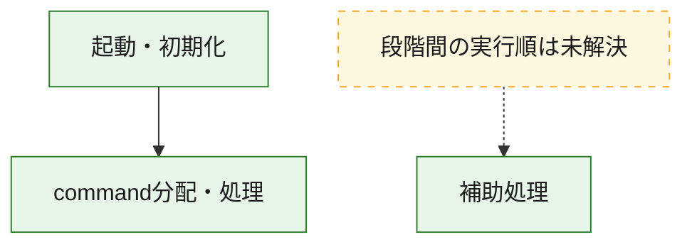
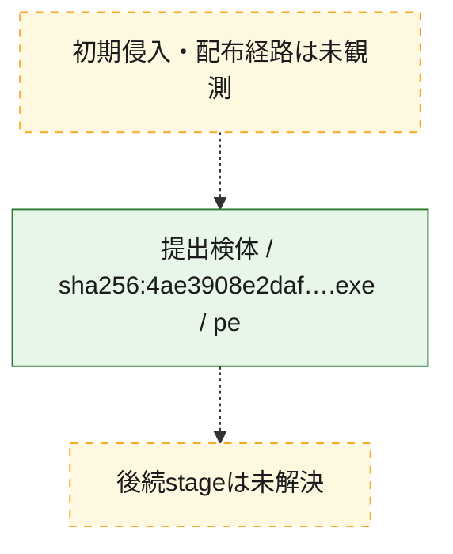
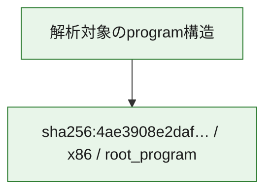

# 全体ロジック：4ae3908e2daf0d4ddf63935ef64b29d1707d217354168bad94bbdfec85e045f5

代表関数の静的証跡から、起動・初期化、command分配・処理の処理群を確認しました。

## 読み方

- phaseの掲載順は解析上の整理順です。observed_call_edgesがない段階間の実行順を断定しません。
- 図の実線は静的に観測した関係、点線と黄色のノードは未観測・未解決の関係を示します。
- 図は静的な要約であり、動的実行を再現するものではありません。
- 詳細な関数解説とfingerprintは[STATIC-LOGIC.md](STATIC-LOGIC.md)を参照してください。

## 静的可視化

### 実行フロー

### 感染チェーン

### モジュール関係

## 処理段階

### 1. 起動・初期化

entry pointから初期化と後続処理への移行を確認します。
確度: `confirmed_static_function_evidence`

- `4ae3908e2daf0d4ddf63935ef64b29d1707d217354168bad94bbdfec85e045f5:ghidra:1401a0348` — 初期化と主要処理への分岐を行う入口関数です。 状態: `succeeded`、選定理由: `entry_point`, `meaningful_symbol_name`, `reviewed_call_centrality:22`, `role:entrypoint`

### 2. command分配・処理

受信commandやtaskの解釈、分配、個別handlerへの移行を確認します。
確度: `confirmed_static_function_evidence_with_limits`

- `4ae3908e2daf0d4ddf63935ef64b29d1707d217354168bad94bbdfec85e045f5:ghidra:1401cf660` — commandの解釈、分配、または個別処理を担当する関数です。 状態: `limited_bad_instruction_or_flow`、選定理由: `meaningful_symbol_name`, `reviewed_call_centrality:1`, `role:command_dispatch_or_handler`

### 3. 補助処理

主要処理を支える一般内部関数またはlibrary処理を確認します。
確度: `confirmed_static_function_evidence_with_limits`

- `4ae3908e2daf0d4ddf63935ef64b29d1707d217354168bad94bbdfec85e045f5:ghidra:140001000` — 検体内部の一般処理を実装する関数です。 状態: `succeeded`、選定理由: `context_representative`, `reviewed_call_centrality:2`
- `4ae3908e2daf0d4ddf63935ef64b29d1707d217354168bad94bbdfec85e045f5:ghidra:140001060` — 検体内部の一般処理を実装する関数です。 状態: `succeeded`、選定理由: `context_representative`, `reviewed_call_centrality:2`
- `4ae3908e2daf0d4ddf63935ef64b29d1707d217354168bad94bbdfec85e045f5:ghidra:1400010c0` — 検体内部の一般処理を実装する関数です。 状態: `succeeded`、選定理由: `context_representative`, `reviewed_call_centrality:2`
- `4ae3908e2daf0d4ddf63935ef64b29d1707d217354168bad94bbdfec85e045f5:ghidra:140001100` — 検体内部の一般処理を実装する関数です。 状態: `succeeded`、選定理由: `context_representative`, `reviewed_call_centrality:2`
- `4ae3908e2daf0d4ddf63935ef64b29d1707d217354168bad94bbdfec85e045f5:ghidra:140001140` — 検体内部の一般処理を実装する関数です。 状態: `succeeded`、選定理由: `context_representative`, `reviewed_call_centrality:2`
- `4ae3908e2daf0d4ddf63935ef64b29d1707d217354168bad94bbdfec85e045f5:ghidra:140001180` — 検体内部の一般処理を実装する関数です。 状態: `succeeded`、選定理由: `context_representative`, `reviewed_call_centrality:2`
- `4ae3908e2daf0d4ddf63935ef64b29d1707d217354168bad94bbdfec85e045f5:ghidra:1400011c0` — 検体内部の一般処理を実装する関数です。 状態: `succeeded`、選定理由: `context_representative`, `reviewed_call_centrality:2`
- `4ae3908e2daf0d4ddf63935ef64b29d1707d217354168bad94bbdfec85e045f5:ghidra:140001200` — 検体内部の一般処理を実装する関数です。 状態: `succeeded`、選定理由: `context_representative`, `reviewed_call_centrality:2`
- `4ae3908e2daf0d4ddf63935ef64b29d1707d217354168bad94bbdfec85e045f5:ghidra:140001240` — 検体内部の一般処理を実装する関数です。 状態: `succeeded`、選定理由: `context_representative`, `reviewed_call_centrality:2`
- `4ae3908e2daf0d4ddf63935ef64b29d1707d217354168bad94bbdfec85e045f5:ghidra:140001280` — 検体内部の一般処理を実装する関数です。 状態: `succeeded`、選定理由: `context_representative`, `reviewed_call_centrality:2`
- `4ae3908e2daf0d4ddf63935ef64b29d1707d217354168bad94bbdfec85e045f5:ghidra:1400012c0` — 検体内部の一般処理を実装する関数です。 状態: `succeeded`、選定理由: `context_representative`, `reviewed_call_centrality:2`
- `4ae3908e2daf0d4ddf63935ef64b29d1707d217354168bad94bbdfec85e045f5:ghidra:140001300` — 検体内部の一般処理を実装する関数です。 状態: `succeeded`、選定理由: `context_representative`, `reviewed_call_centrality:2`
- `4ae3908e2daf0d4ddf63935ef64b29d1707d217354168bad94bbdfec85e045f5:ghidra:140001350` — 検体内部の一般処理を実装する関数です。 状態: `succeeded`、選定理由: `context_representative`, `reviewed_call_centrality:2`
- `4ae3908e2daf0d4ddf63935ef64b29d1707d217354168bad94bbdfec85e045f5:ghidra:1400013e0` — 検体内部の一般処理を実装する関数です。 状態: `succeeded`、選定理由: `context_representative`, `reviewed_call_centrality:3`
- `4ae3908e2daf0d4ddf63935ef64b29d1707d217354168bad94bbdfec85e045f5:ghidra:140001480` — 検体内部の一般処理を実装する関数です。 状態: `succeeded`、選定理由: `context_representative`, `reviewed_call_centrality:2`
- `4ae3908e2daf0d4ddf63935ef64b29d1707d217354168bad94bbdfec85e045f5:ghidra:1400014dc` — 検体内部の一般処理を実装する関数です。 状態: `succeeded`、選定理由: `context_representative`, `reviewed_call_centrality:2`
- `4ae3908e2daf0d4ddf63935ef64b29d1707d217354168bad94bbdfec85e045f5:ghidra:140001514` — 検体内部の一般処理を実装する関数です。 状態: `succeeded`、選定理由: `context_representative`, `reviewed_call_centrality:2`
- `4ae3908e2daf0d4ddf63935ef64b29d1707d217354168bad94bbdfec85e045f5:ghidra:140001544` — 検体内部の一般処理を実装する関数です。 状態: `succeeded`、選定理由: `context_representative`, `reviewed_call_centrality:4`
- `4ae3908e2daf0d4ddf63935ef64b29d1707d217354168bad94bbdfec85e045f5:ghidra:1400015dc` — 検体内部の一般処理を実装する関数です。 状態: `succeeded`、選定理由: `context_representative`, `reviewed_call_centrality:2`
- `4ae3908e2daf0d4ddf63935ef64b29d1707d217354168bad94bbdfec85e045f5:ghidra:1400015fc` — 検体内部の一般処理を実装する関数です。 状態: `succeeded`、選定理由: `context_representative`, `reviewed_call_centrality:2`
- `4ae3908e2daf0d4ddf63935ef64b29d1707d217354168bad94bbdfec85e045f5:ghidra:14000164c` — 検体内部の一般処理を実装する関数です。 状態: `succeeded`、選定理由: `context_representative`, `reviewed_call_centrality:2`
- `4ae3908e2daf0d4ddf63935ef64b29d1707d217354168bad94bbdfec85e045f5:ghidra:1400016a8` — 検体内部の一般処理を実装する関数です。 状態: `succeeded`、選定理由: `context_representative`, `reviewed_call_centrality:2`
- `4ae3908e2daf0d4ddf63935ef64b29d1707d217354168bad94bbdfec85e045f5:ghidra:1400016d4` — 検体内部の一般処理を実装する関数です。 状態: `succeeded`、選定理由: `context_representative`, `reviewed_call_centrality:2`
- `4ae3908e2daf0d4ddf63935ef64b29d1707d217354168bad94bbdfec85e045f5:ghidra:140001750` — 検体内部の一般処理を実装する関数です。 状態: `limited_bad_instruction_or_flow`、選定理由: `context_representative`, `reviewed_call_centrality:3`
- `4ae3908e2daf0d4ddf63935ef64b29d1707d217354168bad94bbdfec85e045f5:ghidra:1400018d0` — 検体内部の一般処理を実装する関数です。 状態: `succeeded`、選定理由: `context_representative`, `reviewed_call_centrality:4`
- `4ae3908e2daf0d4ddf63935ef64b29d1707d217354168bad94bbdfec85e045f5:ghidra:1400019e0` — 検体内部の一般処理を実装する関数です。 状態: `succeeded`、選定理由: `context_representative`, `reviewed_call_centrality:1`
- `4ae3908e2daf0d4ddf63935ef64b29d1707d217354168bad94bbdfec85e045f5:ghidra:140001b60` — 検体内部の一般処理を実装する関数です。 状態: `succeeded`、選定理由: `context_representative`
- `4ae3908e2daf0d4ddf63935ef64b29d1707d217354168bad94bbdfec85e045f5:ghidra:140001bc0` — 検体内部の一般処理を実装する関数です。 状態: `succeeded`、選定理由: `context_representative`
- `4ae3908e2daf0d4ddf63935ef64b29d1707d217354168bad94bbdfec85e045f5:ghidra:140001c40` — 検体内部の一般処理を実装する関数です。 状態: `succeeded`、選定理由: `context_representative`, `reviewed_call_centrality:1`
- `4ae3908e2daf0d4ddf63935ef64b29d1707d217354168bad94bbdfec85e045f5:ghidra:140007810` — 検体内部の一般処理を実装する関数です。 状態: `succeeded`、選定理由: `meaningful_symbol_name`

## 観測したcall関係

- `4ae3908e2daf0d4ddf63935ef64b29d1707d217354168bad94bbdfec85e045f5:ghidra:1400018d0` → `4ae3908e2daf0d4ddf63935ef64b29d1707d217354168bad94bbdfec85e045f5:ghidra:140001750` （`support` → `support`）
- `4ae3908e2daf0d4ddf63935ef64b29d1707d217354168bad94bbdfec85e045f5:ghidra:1401a0348` → `4ae3908e2daf0d4ddf63935ef64b29d1707d217354168bad94bbdfec85e045f5:ghidra:1401cf660` （`startup` → `dispatch`）
- `ghidra-function:105be3949e0d2b507aa9bf3f` → `ghidra-function:4061c356517d116655679d52` （`unclassified` → `unclassified`）
- `ghidra-function:105be3949e0d2b507aa9bf3f` → `ghidra-function:493d0be15f1f7dc39af89779` （`unclassified` → `unclassified`）
- `ghidra-function:105be3949e0d2b507aa9bf3f` → `ghidra-function:74241739713a306be1c9de81` （`unclassified` → `unclassified`）
- `ghidra-function:105be3949e0d2b507aa9bf3f` → `ghidra-function:7994dec63c21075562123180` （`unclassified` → `unclassified`）
- `ghidra-function:1654743b09132d272f3510b8` → `ghidra-function:6e04e01e6fec3cd7222f5735` （`unclassified` → `unclassified`）
- `ghidra-function:1654743b09132d272f3510b8` → `ghidra-function:d09c9c6111301b93bce5a83b` （`unclassified` → `unclassified`）
- `ghidra-function:17fb12a91b6b2de4f401a35c` → `ghidra-function:7cbf5d8f789eb0de0b939a9c` （`unclassified` → `unclassified`）
- `ghidra-function:17fb12a91b6b2de4f401a35c` → `ghidra-function:d09c9c6111301b93bce5a83b` （`unclassified` → `unclassified`）
- `ghidra-function:211a7e6468c926ee385f09a9` → `ghidra-function:7cbf5d8f789eb0de0b939a9c` （`unclassified` → `unclassified`）
- `ghidra-function:211a7e6468c926ee385f09a9` → `ghidra-function:d09c9c6111301b93bce5a83b` （`unclassified` → `unclassified`）
- `ghidra-function:29a2cd96fcc8ba1a98b3179c` → `ghidra-function:13524f34112571ae87db1dfd` （`unclassified` → `unclassified`）
- `ghidra-function:29a2cd96fcc8ba1a98b3179c` → `ghidra-function:d09c9c6111301b93bce5a83b` （`unclassified` → `unclassified`）
- `ghidra-function:34b30e063c49d80bc9f4d428` → `ghidra-function:35fff6b17a83ac939b058931` （`unclassified` → `unclassified`）
- `ghidra-function:34b30e063c49d80bc9f4d428` → `ghidra-function:d09c9c6111301b93bce5a83b` （`unclassified` → `unclassified`）
- `ghidra-function:409968473ba9d3a532c57448` → `ghidra-function:6e04e01e6fec3cd7222f5735` （`unclassified` → `unclassified`）
- `ghidra-function:409968473ba9d3a532c57448` → `ghidra-function:d09c9c6111301b93bce5a83b` （`unclassified` → `unclassified`）
- `ghidra-function:417ca519aeceb8d2bbb0390d` → `ghidra-function:9bc76a4d106d62dd7fedb7d3` （`unclassified` → `unclassified`）
- `ghidra-function:417ca519aeceb8d2bbb0390d` → `ghidra-function:d09c9c6111301b93bce5a83b` （`unclassified` → `unclassified`）
- `ghidra-function:493d0be15f1f7dc39af89779` → `ghidra-function:410e59ad2eefe9c744ea2078` （`unclassified` → `unclassified`）
- `ghidra-function:493d0be15f1f7dc39af89779` → `ghidra-function:5a342efa2a3820369fb700a4` （`unclassified` → `unclassified`）
- `ghidra-function:50c029cfe0a29e14a1655af1` → `ghidra-function:6e04e01e6fec3cd7222f5735` （`unclassified` → `unclassified`）
- `ghidra-function:50c029cfe0a29e14a1655af1` → `ghidra-function:d09c9c6111301b93bce5a83b` （`unclassified` → `unclassified`）
- `ghidra-function:5ceded8a64458f375ef74bb7` → `ghidra-function:21c04b360583169ca9652820` （`unclassified` → `unclassified`）
- `ghidra-function:5ceded8a64458f375ef74bb7` → `ghidra-function:d09c9c6111301b93bce5a83b` （`unclassified` → `unclassified`）
- `ghidra-function:6017219d63b76beefc44358c` → `ghidra-function:9bc76a4d106d62dd7fedb7d3` （`unclassified` → `unclassified`）
- `ghidra-function:6017219d63b76beefc44358c` → `ghidra-function:d09c9c6111301b93bce5a83b` （`unclassified` → `unclassified`）
- `ghidra-function:63f5437dd3c0e7d3d0cd9aff` → `ghidra-function:de9d15b8a7a8f7c25cab01a1` （`unclassified` → `unclassified`）
- `ghidra-function:695a8e2c675b310a6df722e8` → `ghidra-function:9bc76a4d106d62dd7fedb7d3` （`unclassified` → `unclassified`）
- `ghidra-function:695a8e2c675b310a6df722e8` → `ghidra-function:d09c9c6111301b93bce5a83b` （`unclassified` → `unclassified`）
- `ghidra-function:7af1ed9911172a414302896f` → `ghidra-function:7cbf5d8f789eb0de0b939a9c` （`unclassified` → `unclassified`）
- `ghidra-function:7af1ed9911172a414302896f` → `ghidra-function:d09c9c6111301b93bce5a83b` （`unclassified` → `unclassified`）
- `ghidra-function:7bad795da33c3ff6b05c21b7` → `ghidra-function:7cbf5d8f789eb0de0b939a9c` （`unclassified` → `unclassified`）
- `ghidra-function:7bad795da33c3ff6b05c21b7` → `ghidra-function:d09c9c6111301b93bce5a83b` （`unclassified` → `unclassified`）
- `ghidra-function:7d148eb7bcf0cb21b9c3ebe4` → `ghidra-function:7cbf5d8f789eb0de0b939a9c` （`unclassified` → `unclassified`）
- `ghidra-function:7d148eb7bcf0cb21b9c3ebe4` → `ghidra-function:d09c9c6111301b93bce5a83b` （`unclassified` → `unclassified`）
- `ghidra-function:97892012dac3c0c669b7b9c8` → `ghidra-external:033d41f9395f8278147b26d5` （`unclassified` → `unclassified`）
- `ghidra-function:97892012dac3c0c669b7b9c8` → `ghidra-function:0face694588f1b89bcd833e7` （`unclassified` → `unclassified`）
- `ghidra-function:97892012dac3c0c669b7b9c8` → `ghidra-function:5ce07f3df22d0cd1e3837fed` （`unclassified` → `unclassified`）
- `ghidra-function:97892012dac3c0c669b7b9c8` → `ghidra-function:d09c9c6111301b93bce5a83b` （`unclassified` → `unclassified`）
- `ghidra-function:b5dff9984d3dd174720508ab` → `ghidra-function:7cbf5d8f789eb0de0b939a9c` （`unclassified` → `unclassified`）
- `ghidra-function:b5dff9984d3dd174720508ab` → `ghidra-function:d09c9c6111301b93bce5a83b` （`unclassified` → `unclassified`）
- `ghidra-function:b6a27f57607cca4a4d838368` → `ghidra-function:7cbf5d8f789eb0de0b939a9c` （`unclassified` → `unclassified`）
- `ghidra-function:b6a27f57607cca4a4d838368` → `ghidra-function:d09c9c6111301b93bce5a83b` （`unclassified` → `unclassified`）
- `ghidra-function:bd3f0fa456a76a5c870413ec` → `ghidra-function:a73ed1ed3630c611464a064e` （`unclassified` → `unclassified`）
- `ghidra-function:bd3f0fa456a76a5c870413ec` → `ghidra-function:deca4072cac09a24caff7cd6` （`unclassified` → `unclassified`）
- `ghidra-function:bd3f0fa456a76a5c870413ec` → `ghidra-function:ef53a25b2d92f5b26faa0f84` （`unclassified` → `unclassified`）
- `ghidra-function:c174dd22defa9a91918f37a0` → `ghidra-function:13524f34112571ae87db1dfd` （`unclassified` → `unclassified`）
- `ghidra-function:c174dd22defa9a91918f37a0` → `ghidra-function:d09c9c6111301b93bce5a83b` （`unclassified` → `unclassified`）
- `ghidra-function:d4cc4204d9ca0fe3090e6dbf` → `ghidra-function:6e04e01e6fec3cd7222f5735` （`unclassified` → `unclassified`）
- `ghidra-function:d4cc4204d9ca0fe3090e6dbf` → `ghidra-function:d09c9c6111301b93bce5a83b` （`unclassified` → `unclassified`）
- `ghidra-function:da73d37dfda6437474de951b` → `ghidra-function:5a342efa2a3820369fb700a4` （`unclassified` → `unclassified`）
- `ghidra-function:ebe0b4926984dff51a637a5d` → `ghidra-function:7cbf5d8f789eb0de0b939a9c` （`unclassified` → `unclassified`）
- `ghidra-function:ebe0b4926984dff51a637a5d` → `ghidra-function:d09c9c6111301b93bce5a83b` （`unclassified` → `unclassified`）
- `ghidra-function:ec9ee9ec4cf99d6b0ee90914` → `ghidra-function:7cbf5d8f789eb0de0b939a9c` （`unclassified` → `unclassified`）
- `ghidra-function:ec9ee9ec4cf99d6b0ee90914` → `ghidra-function:d09c9c6111301b93bce5a83b` （`unclassified` → `unclassified`）
- `ghidra-function:f2fed551f7665365421f1a67` → `ghidra-external:0de28f53809de98227e6ad4d` （`unclassified` → `unclassified`）
- `ghidra-function:f2fed551f7665365421f1a67` → `ghidra-external:38d9009e45e1c539b2df7425` （`unclassified` → `unclassified`）
- `ghidra-function:f2fed551f7665365421f1a67` → `ghidra-external:6b3b441898e5cbdb745b2fb7` （`unclassified` → `unclassified`）
- `ghidra-function:f2fed551f7665365421f1a67` → `ghidra-external:787deb2b9131d27bd0653dad` （`unclassified` → `unclassified`）
- `ghidra-function:f2fed551f7665365421f1a67` → `ghidra-external:988b08a9da6546b53b7c4437` （`unclassified` → `unclassified`）
- `ghidra-function:f2fed551f7665365421f1a67` → `ghidra-external:ba5514e1664b64b7596aa25b` （`unclassified` → `unclassified`）
- `ghidra-function:f2fed551f7665365421f1a67` → `ghidra-external:bcbe60b46caf09c3f3fc3cc1` （`unclassified` → `unclassified`）
- `ghidra-function:f2fed551f7665365421f1a67` → `ghidra-external:c2e286aaf3ac8ecce4472544` （`unclassified` → `unclassified`）
- `ghidra-function:f2fed551f7665365421f1a67` → `ghidra-function:0a326c869c3974a8880dff37` （`unclassified` → `unclassified`）
- `ghidra-function:f2fed551f7665365421f1a67` → `ghidra-function:0d721ffe1b63759fd2fad139` （`unclassified` → `unclassified`）
- `ghidra-function:f2fed551f7665365421f1a67` → `ghidra-function:0d85fe7241f85733867bdaf2` （`unclassified` → `unclassified`）
- `ghidra-function:f2fed551f7665365421f1a67` → `ghidra-function:170ea0076ea8a8c6d57f7517` （`unclassified` → `unclassified`）
- `ghidra-function:f2fed551f7665365421f1a67` → `ghidra-function:1f7b0d20d529943cdbaaf004` （`unclassified` → `unclassified`）
- `ghidra-function:f2fed551f7665365421f1a67` → `ghidra-function:26257549b775467e7dd81438` （`unclassified` → `unclassified`）
- `ghidra-function:f2fed551f7665365421f1a67` → `ghidra-function:2cc3982a4d5081570ec0a4a7` （`unclassified` → `unclassified`）
- `ghidra-function:f2fed551f7665365421f1a67` → `ghidra-function:6300193ea47719dfda3bf4f8` （`unclassified` → `unclassified`）
- `ghidra-function:f2fed551f7665365421f1a67` → `ghidra-function:6ad8fa8b6e38cdf19023ea15` （`unclassified` → `unclassified`）
- `ghidra-function:f2fed551f7665365421f1a67` → `ghidra-function:7996faea701c43f5a4ae20bf` （`unclassified` → `unclassified`）
- `ghidra-function:f2fed551f7665365421f1a67` → `ghidra-function:87793935de9ae0eda8eb8b88` （`unclassified` → `unclassified`）
- `ghidra-function:f2fed551f7665365421f1a67` → `ghidra-function:c9ab75e3396887ee86553ba8` （`unclassified` → `unclassified`）
- `ghidra-function:f2fed551f7665365421f1a67` → `ghidra-function:e64eea333b8227d4e8dbb852` （`unclassified` → `unclassified`）
- `ghidra-function:f2fed551f7665365421f1a67` → `ghidra-function:fc0a2efa64136a15392d241f` （`unclassified` → `unclassified`）
- `ghidra-function:fa7fa49b0b6e7ed426734f2e` → `ghidra-function:35fff6b17a83ac939b058931` （`unclassified` → `unclassified`）
- `ghidra-function:fa7fa49b0b6e7ed426734f2e` → `ghidra-function:d09c9c6111301b93bce5a83b` （`unclassified` → `unclassified`）

## 解析範囲と制約

- 選定外関数は全体inventoryへ残しますが、関数本体の個別解説対象にはしていません。
- indirect call、難読化、packer、VM、壊れたcontrol flowによりcall関係が欠落する場合があります。
- 文書は静的解析に基づき、検体実行や外部通信による動的確認は行っていません。
