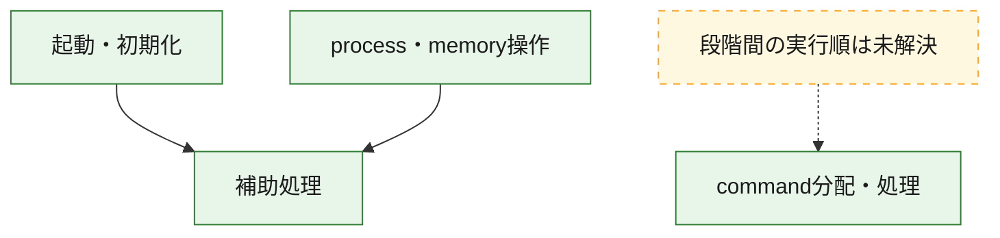
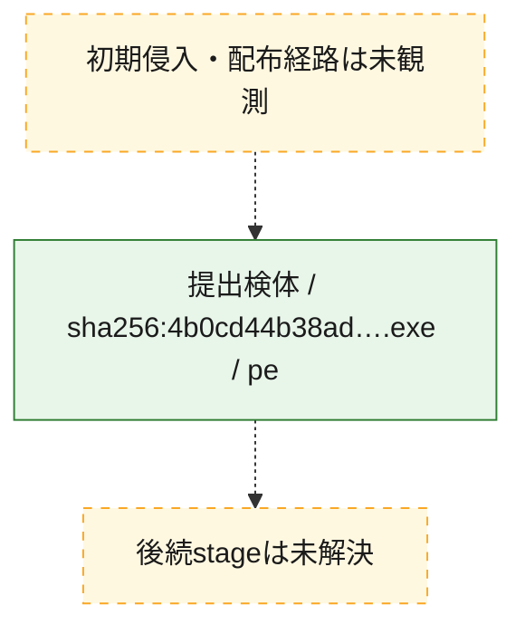
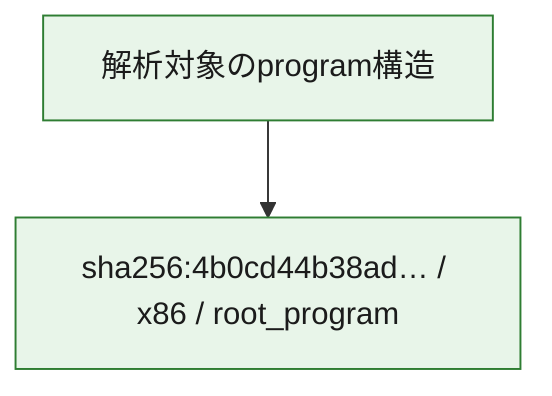

# 全体ロジック：4b0cd44b38ad25e8a3ed2933f1a0b8b37a5edbf9e28ed85b82913da6f0248573

代表関数の静的証跡から、起動・初期化、process・memory操作、command分配・処理の処理群を確認しました。

## 読み方

- phaseの掲載順は解析上の整理順です。observed_call_edgesがない段階間の実行順を断定しません。
- 図の実線は静的に観測した関係、点線と黄色のノードは未観測・未解決の関係を示します。
- 図は静的な要約であり、動的実行を再現するものではありません。
- 詳細な関数解説とfingerprintは[STATIC-LOGIC.md](STATIC-LOGIC.md)を参照してください。

## 静的可視化

### 実行フロー

### 感染チェーン

### モジュール関係

## 処理段階

### 1. 起動・初期化

entry pointから初期化と後続処理への移行を確認します。
確度: `confirmed_static_function_evidence`

- `4b0cd44b38ad25e8a3ed2933f1a0b8b37a5edbf9e28ed85b82913da6f0248573:ghidra:140001460` — 初期化と主要処理への分岐を行う入口関数です。 状態: `succeeded`、選定理由: `entry_point`, `meaningful_symbol_name`, `reviewed_call_centrality:31`, `role:entrypoint`

### 2. process・memory操作

process、thread、module、memory操作と実行移行を確認します。
確度: `confirmed_static_function_evidence`

- `4b0cd44b38ad25e8a3ed2933f1a0b8b37a5edbf9e28ed85b82913da6f0248573:ghidra:140001800` — process、thread、module、またはmemory操作に関係する関数です。 状態: `succeeded`、選定理由: `context_representative`, `reviewed_call_centrality:16`, `role:process_or_memory_operation`
- `4b0cd44b38ad25e8a3ed2933f1a0b8b37a5edbf9e28ed85b82913da6f0248573:ghidra:140001860` — process、thread、module、またはmemory操作に関係する関数です。 状態: `succeeded`、選定理由: `context_representative`, `reviewed_call_centrality:12`, `role:process_or_memory_operation`

### 3. command分配・処理

受信commandやtaskの解釈、分配、個別handlerへの移行を確認します。
確度: `confirmed_static_function_evidence`

- `4b0cd44b38ad25e8a3ed2933f1a0b8b37a5edbf9e28ed85b82913da6f0248573:ghidra:1400014d0` — commandの解釈、分配、または個別処理を担当する関数です。 状態: `succeeded`、選定理由: `context_representative`, `reviewed_call_centrality:11`, `role:command_dispatch_or_handler`

### 4. 補助処理

主要処理を支える一般内部関数またはlibrary処理を確認します。
確度: `confirmed_static_function_evidence_with_limits`

- `4b0cd44b38ad25e8a3ed2933f1a0b8b37a5edbf9e28ed85b82913da6f0248573:ghidra:140001000` — 検体内部の一般処理を実装する関数です。 状態: `succeeded`、選定理由: `context_representative`
- `4b0cd44b38ad25e8a3ed2933f1a0b8b37a5edbf9e28ed85b82913da6f0248573:ghidra:140001010` — 検体内部の一般処理を実装する関数です。 状態: `succeeded`、選定理由: `context_representative`
- `4b0cd44b38ad25e8a3ed2933f1a0b8b37a5edbf9e28ed85b82913da6f0248573:ghidra:140001030` — 検体内部の一般処理を実装する関数です。 状態: `limited_bad_instruction_or_flow`、選定理由: `context_representative`, `reviewed_call_centrality:2`
- `4b0cd44b38ad25e8a3ed2933f1a0b8b37a5edbf9e28ed85b82913da6f0248573:ghidra:140001040` — 検体内部の一般処理を実装する関数です。 状態: `succeeded`、選定理由: `context_representative`, `reviewed_call_centrality:33`
- `4b0cd44b38ad25e8a3ed2933f1a0b8b37a5edbf9e28ed85b82913da6f0248573:ghidra:1400010a0` — 検体内部の一般処理を実装する関数です。 状態: `succeeded`、選定理由: `context_representative`, `reviewed_call_centrality:31`
- `4b0cd44b38ad25e8a3ed2933f1a0b8b37a5edbf9e28ed85b82913da6f0248573:ghidra:140001480` — 検体内部の一般処理を実装する関数です。 状態: `succeeded`、選定理由: `context_representative`, `reviewed_call_centrality:31`
- `4b0cd44b38ad25e8a3ed2933f1a0b8b37a5edbf9e28ed85b82913da6f0248573:ghidra:1400014a0` — 検体内部の一般処理を実装する関数です。 状態: `limited_bad_instruction_or_flow`、選定理由: `context_representative`, `reviewed_call_centrality:2`
- `4b0cd44b38ad25e8a3ed2933f1a0b8b37a5edbf9e28ed85b82913da6f0248573:ghidra:1400014b0` — 検体内部の一般処理を実装する関数です。 状態: `limited_bad_instruction_or_flow`、選定理由: `context_representative`, `reviewed_call_centrality:2`
- `4b0cd44b38ad25e8a3ed2933f1a0b8b37a5edbf9e28ed85b82913da6f0248573:ghidra:1400014c0` — 検体内部の一般処理を実装する関数です。 状態: `succeeded`、選定理由: `context_representative`
- `4b0cd44b38ad25e8a3ed2933f1a0b8b37a5edbf9e28ed85b82913da6f0248573:ghidra:140001600` — 検体内部の一般処理を実装する関数です。 状態: `succeeded`、選定理由: `context_representative`
- `4b0cd44b38ad25e8a3ed2933f1a0b8b37a5edbf9e28ed85b82913da6f0248573:ghidra:140001650` — 検体内部の一般処理を実装する関数です。 状態: `limited_bad_instruction_or_flow`、選定理由: `context_representative`, `reviewed_call_centrality:2`
- `4b0cd44b38ad25e8a3ed2933f1a0b8b37a5edbf9e28ed85b82913da6f0248573:ghidra:1400016d0` — 検体内部の一般処理を実装する関数です。 状態: `limited_bad_instruction_or_flow`、選定理由: `context_representative`, `reviewed_call_centrality:6`
- `4b0cd44b38ad25e8a3ed2933f1a0b8b37a5edbf9e28ed85b82913da6f0248573:ghidra:1400016f0` — 検体内部の一般処理を実装する関数です。 状態: `succeeded`、選定理由: `context_representative`, `reviewed_call_centrality:4`
- `4b0cd44b38ad25e8a3ed2933f1a0b8b37a5edbf9e28ed85b82913da6f0248573:ghidra:140001700` — 検体内部の一般処理を実装する関数です。 状態: `succeeded`、選定理由: `context_representative`, `reviewed_call_centrality:2`
- `4b0cd44b38ad25e8a3ed2933f1a0b8b37a5edbf9e28ed85b82913da6f0248573:ghidra:1400019d0` — 検体内部の一般処理を実装する関数です。 状態: `succeeded`、選定理由: `context_representative`, `reviewed_call_centrality:7`
- `4b0cd44b38ad25e8a3ed2933f1a0b8b37a5edbf9e28ed85b82913da6f0248573:ghidra:140001d70` — 検体内部の一般処理を実装する関数です。 状態: `succeeded`、選定理由: `context_representative`
- `4b0cd44b38ad25e8a3ed2933f1a0b8b37a5edbf9e28ed85b82913da6f0248573:ghidra:140001db0` — 検体内部の一般処理を実装する関数です。 状態: `limited_bad_instruction_or_flow`、選定理由: `context_representative`, `reviewed_call_centrality:6`
- `4b0cd44b38ad25e8a3ed2933f1a0b8b37a5edbf9e28ed85b82913da6f0248573:ghidra:140001dc0` — 検体内部の一般処理を実装する関数です。 状態: `succeeded`、選定理由: `context_representative`, `reviewed_call_centrality:4`
- `4b0cd44b38ad25e8a3ed2933f1a0b8b37a5edbf9e28ed85b82913da6f0248573:ghidra:140001dd0` — 検体内部の一般処理を実装する関数です。 状態: `succeeded`、選定理由: `context_representative`, `reviewed_call_centrality:3`
- `4b0cd44b38ad25e8a3ed2933f1a0b8b37a5edbf9e28ed85b82913da6f0248573:ghidra:140001e50` — 検体内部の一般処理を実装する関数です。 状態: `succeeded`、選定理由: `context_representative`, `reviewed_call_centrality:4`
- `4b0cd44b38ad25e8a3ed2933f1a0b8b37a5edbf9e28ed85b82913da6f0248573:ghidra:140001e80` — 検体内部の一般処理を実装する関数です。 状態: `succeeded`、選定理由: `context_representative`, `reviewed_call_centrality:3`
- `4b0cd44b38ad25e8a3ed2933f1a0b8b37a5edbf9e28ed85b82913da6f0248573:ghidra:140001ef0` — 検体内部の一般処理を実装する関数です。 状態: `succeeded`、選定理由: `context_representative`, `reviewed_call_centrality:4`
- `4b0cd44b38ad25e8a3ed2933f1a0b8b37a5edbf9e28ed85b82913da6f0248573:ghidra:140001f30` — 検体内部の一般処理を実装する関数です。 状態: `succeeded`、選定理由: `context_representative`, `reviewed_call_centrality:4`
- `4b0cd44b38ad25e8a3ed2933f1a0b8b37a5edbf9e28ed85b82913da6f0248573:ghidra:140001f40` — 検体内部の一般処理を実装する関数です。 状態: `succeeded`、選定理由: `context_representative`, `reviewed_call_centrality:4`
- `4b0cd44b38ad25e8a3ed2933f1a0b8b37a5edbf9e28ed85b82913da6f0248573:ghidra:140001f50` — 検体内部の一般処理を実装する関数です。 状態: `succeeded`、選定理由: `context_representative`
- `4b0cd44b38ad25e8a3ed2933f1a0b8b37a5edbf9e28ed85b82913da6f0248573:ghidra:140001f60` — 検体内部の一般処理を実装する関数です。 状態: `succeeded`、選定理由: `context_representative`, `reviewed_call_centrality:4`
- `4b0cd44b38ad25e8a3ed2933f1a0b8b37a5edbf9e28ed85b82913da6f0248573:ghidra:140001f70` — 検体内部の一般処理を実装する関数です。 状態: `succeeded`、選定理由: `context_representative`
- `4b0cd44b38ad25e8a3ed2933f1a0b8b37a5edbf9e28ed85b82913da6f0248573:ghidra:140001f80` — 検体内部の一般処理を実装する関数です。 状態: `succeeded`、選定理由: `context_representative`, `reviewed_call_centrality:6`

## 観測したcall関係

- `4b0cd44b38ad25e8a3ed2933f1a0b8b37a5edbf9e28ed85b82913da6f0248573:ghidra:140001040` → `4b0cd44b38ad25e8a3ed2933f1a0b8b37a5edbf9e28ed85b82913da6f0248573:ghidra:1400016d0` （`support` → `support`）
- `4b0cd44b38ad25e8a3ed2933f1a0b8b37a5edbf9e28ed85b82913da6f0248573:ghidra:140001040` → `4b0cd44b38ad25e8a3ed2933f1a0b8b37a5edbf9e28ed85b82913da6f0248573:ghidra:1400016f0` （`support` → `support`）
- `4b0cd44b38ad25e8a3ed2933f1a0b8b37a5edbf9e28ed85b82913da6f0248573:ghidra:140001040` → `4b0cd44b38ad25e8a3ed2933f1a0b8b37a5edbf9e28ed85b82913da6f0248573:ghidra:1400019d0` （`support` → `support`）
- `4b0cd44b38ad25e8a3ed2933f1a0b8b37a5edbf9e28ed85b82913da6f0248573:ghidra:140001040` → `4b0cd44b38ad25e8a3ed2933f1a0b8b37a5edbf9e28ed85b82913da6f0248573:ghidra:140001db0` （`support` → `support`）
- `4b0cd44b38ad25e8a3ed2933f1a0b8b37a5edbf9e28ed85b82913da6f0248573:ghidra:140001040` → `4b0cd44b38ad25e8a3ed2933f1a0b8b37a5edbf9e28ed85b82913da6f0248573:ghidra:140001dc0` （`support` → `support`）
- `4b0cd44b38ad25e8a3ed2933f1a0b8b37a5edbf9e28ed85b82913da6f0248573:ghidra:140001040` → `4b0cd44b38ad25e8a3ed2933f1a0b8b37a5edbf9e28ed85b82913da6f0248573:ghidra:140001ef0` （`support` → `support`）
- `4b0cd44b38ad25e8a3ed2933f1a0b8b37a5edbf9e28ed85b82913da6f0248573:ghidra:140001040` → `4b0cd44b38ad25e8a3ed2933f1a0b8b37a5edbf9e28ed85b82913da6f0248573:ghidra:140001f30` （`support` → `support`）
- `4b0cd44b38ad25e8a3ed2933f1a0b8b37a5edbf9e28ed85b82913da6f0248573:ghidra:140001040` → `4b0cd44b38ad25e8a3ed2933f1a0b8b37a5edbf9e28ed85b82913da6f0248573:ghidra:140001f40` （`support` → `support`）
- `4b0cd44b38ad25e8a3ed2933f1a0b8b37a5edbf9e28ed85b82913da6f0248573:ghidra:140001040` → `4b0cd44b38ad25e8a3ed2933f1a0b8b37a5edbf9e28ed85b82913da6f0248573:ghidra:140001f60` （`support` → `support`）
- `4b0cd44b38ad25e8a3ed2933f1a0b8b37a5edbf9e28ed85b82913da6f0248573:ghidra:140001040` → `4b0cd44b38ad25e8a3ed2933f1a0b8b37a5edbf9e28ed85b82913da6f0248573:ghidra:140001f80` （`support` → `support`）
- `4b0cd44b38ad25e8a3ed2933f1a0b8b37a5edbf9e28ed85b82913da6f0248573:ghidra:1400010a0` → `4b0cd44b38ad25e8a3ed2933f1a0b8b37a5edbf9e28ed85b82913da6f0248573:ghidra:1400016d0` （`support` → `support`）
- `4b0cd44b38ad25e8a3ed2933f1a0b8b37a5edbf9e28ed85b82913da6f0248573:ghidra:1400010a0` → `4b0cd44b38ad25e8a3ed2933f1a0b8b37a5edbf9e28ed85b82913da6f0248573:ghidra:1400016f0` （`support` → `support`）
- `4b0cd44b38ad25e8a3ed2933f1a0b8b37a5edbf9e28ed85b82913da6f0248573:ghidra:1400010a0` → `4b0cd44b38ad25e8a3ed2933f1a0b8b37a5edbf9e28ed85b82913da6f0248573:ghidra:1400019d0` （`support` → `support`）
- `4b0cd44b38ad25e8a3ed2933f1a0b8b37a5edbf9e28ed85b82913da6f0248573:ghidra:1400010a0` → `4b0cd44b38ad25e8a3ed2933f1a0b8b37a5edbf9e28ed85b82913da6f0248573:ghidra:140001db0` （`support` → `support`）
- `4b0cd44b38ad25e8a3ed2933f1a0b8b37a5edbf9e28ed85b82913da6f0248573:ghidra:1400010a0` → `4b0cd44b38ad25e8a3ed2933f1a0b8b37a5edbf9e28ed85b82913da6f0248573:ghidra:140001dc0` （`support` → `support`）
- `4b0cd44b38ad25e8a3ed2933f1a0b8b37a5edbf9e28ed85b82913da6f0248573:ghidra:1400010a0` → `4b0cd44b38ad25e8a3ed2933f1a0b8b37a5edbf9e28ed85b82913da6f0248573:ghidra:140001ef0` （`support` → `support`）
- `4b0cd44b38ad25e8a3ed2933f1a0b8b37a5edbf9e28ed85b82913da6f0248573:ghidra:1400010a0` → `4b0cd44b38ad25e8a3ed2933f1a0b8b37a5edbf9e28ed85b82913da6f0248573:ghidra:140001f30` （`support` → `support`）
- `4b0cd44b38ad25e8a3ed2933f1a0b8b37a5edbf9e28ed85b82913da6f0248573:ghidra:1400010a0` → `4b0cd44b38ad25e8a3ed2933f1a0b8b37a5edbf9e28ed85b82913da6f0248573:ghidra:140001f40` （`support` → `support`）
- `4b0cd44b38ad25e8a3ed2933f1a0b8b37a5edbf9e28ed85b82913da6f0248573:ghidra:1400010a0` → `4b0cd44b38ad25e8a3ed2933f1a0b8b37a5edbf9e28ed85b82913da6f0248573:ghidra:140001f60` （`support` → `support`）
- `4b0cd44b38ad25e8a3ed2933f1a0b8b37a5edbf9e28ed85b82913da6f0248573:ghidra:1400010a0` → `4b0cd44b38ad25e8a3ed2933f1a0b8b37a5edbf9e28ed85b82913da6f0248573:ghidra:140001f80` （`support` → `support`）
- `4b0cd44b38ad25e8a3ed2933f1a0b8b37a5edbf9e28ed85b82913da6f0248573:ghidra:140001460` → `4b0cd44b38ad25e8a3ed2933f1a0b8b37a5edbf9e28ed85b82913da6f0248573:ghidra:1400016d0` （`startup` → `support`）
- `4b0cd44b38ad25e8a3ed2933f1a0b8b37a5edbf9e28ed85b82913da6f0248573:ghidra:140001460` → `4b0cd44b38ad25e8a3ed2933f1a0b8b37a5edbf9e28ed85b82913da6f0248573:ghidra:1400016f0` （`startup` → `support`）
- `4b0cd44b38ad25e8a3ed2933f1a0b8b37a5edbf9e28ed85b82913da6f0248573:ghidra:140001460` → `4b0cd44b38ad25e8a3ed2933f1a0b8b37a5edbf9e28ed85b82913da6f0248573:ghidra:1400019d0` （`startup` → `support`）
- `4b0cd44b38ad25e8a3ed2933f1a0b8b37a5edbf9e28ed85b82913da6f0248573:ghidra:140001460` → `4b0cd44b38ad25e8a3ed2933f1a0b8b37a5edbf9e28ed85b82913da6f0248573:ghidra:140001db0` （`startup` → `support`）
- `4b0cd44b38ad25e8a3ed2933f1a0b8b37a5edbf9e28ed85b82913da6f0248573:ghidra:140001460` → `4b0cd44b38ad25e8a3ed2933f1a0b8b37a5edbf9e28ed85b82913da6f0248573:ghidra:140001dc0` （`startup` → `support`）
- `4b0cd44b38ad25e8a3ed2933f1a0b8b37a5edbf9e28ed85b82913da6f0248573:ghidra:140001460` → `4b0cd44b38ad25e8a3ed2933f1a0b8b37a5edbf9e28ed85b82913da6f0248573:ghidra:140001ef0` （`startup` → `support`）
- `4b0cd44b38ad25e8a3ed2933f1a0b8b37a5edbf9e28ed85b82913da6f0248573:ghidra:140001460` → `4b0cd44b38ad25e8a3ed2933f1a0b8b37a5edbf9e28ed85b82913da6f0248573:ghidra:140001f30` （`startup` → `support`）
- `4b0cd44b38ad25e8a3ed2933f1a0b8b37a5edbf9e28ed85b82913da6f0248573:ghidra:140001460` → `4b0cd44b38ad25e8a3ed2933f1a0b8b37a5edbf9e28ed85b82913da6f0248573:ghidra:140001f40` （`startup` → `support`）
- `4b0cd44b38ad25e8a3ed2933f1a0b8b37a5edbf9e28ed85b82913da6f0248573:ghidra:140001460` → `4b0cd44b38ad25e8a3ed2933f1a0b8b37a5edbf9e28ed85b82913da6f0248573:ghidra:140001f60` （`startup` → `support`）
- `4b0cd44b38ad25e8a3ed2933f1a0b8b37a5edbf9e28ed85b82913da6f0248573:ghidra:140001460` → `4b0cd44b38ad25e8a3ed2933f1a0b8b37a5edbf9e28ed85b82913da6f0248573:ghidra:140001f80` （`startup` → `support`）
- `4b0cd44b38ad25e8a3ed2933f1a0b8b37a5edbf9e28ed85b82913da6f0248573:ghidra:140001480` → `4b0cd44b38ad25e8a3ed2933f1a0b8b37a5edbf9e28ed85b82913da6f0248573:ghidra:1400016d0` （`support` → `support`）
- `4b0cd44b38ad25e8a3ed2933f1a0b8b37a5edbf9e28ed85b82913da6f0248573:ghidra:140001480` → `4b0cd44b38ad25e8a3ed2933f1a0b8b37a5edbf9e28ed85b82913da6f0248573:ghidra:1400016f0` （`support` → `support`）
- `4b0cd44b38ad25e8a3ed2933f1a0b8b37a5edbf9e28ed85b82913da6f0248573:ghidra:140001480` → `4b0cd44b38ad25e8a3ed2933f1a0b8b37a5edbf9e28ed85b82913da6f0248573:ghidra:1400019d0` （`support` → `support`）
- `4b0cd44b38ad25e8a3ed2933f1a0b8b37a5edbf9e28ed85b82913da6f0248573:ghidra:140001480` → `4b0cd44b38ad25e8a3ed2933f1a0b8b37a5edbf9e28ed85b82913da6f0248573:ghidra:140001db0` （`support` → `support`）
- `4b0cd44b38ad25e8a3ed2933f1a0b8b37a5edbf9e28ed85b82913da6f0248573:ghidra:140001480` → `4b0cd44b38ad25e8a3ed2933f1a0b8b37a5edbf9e28ed85b82913da6f0248573:ghidra:140001dc0` （`support` → `support`）
- `4b0cd44b38ad25e8a3ed2933f1a0b8b37a5edbf9e28ed85b82913da6f0248573:ghidra:140001480` → `4b0cd44b38ad25e8a3ed2933f1a0b8b37a5edbf9e28ed85b82913da6f0248573:ghidra:140001ef0` （`support` → `support`）
- `4b0cd44b38ad25e8a3ed2933f1a0b8b37a5edbf9e28ed85b82913da6f0248573:ghidra:140001480` → `4b0cd44b38ad25e8a3ed2933f1a0b8b37a5edbf9e28ed85b82913da6f0248573:ghidra:140001f30` （`support` → `support`）
- `4b0cd44b38ad25e8a3ed2933f1a0b8b37a5edbf9e28ed85b82913da6f0248573:ghidra:140001480` → `4b0cd44b38ad25e8a3ed2933f1a0b8b37a5edbf9e28ed85b82913da6f0248573:ghidra:140001f40` （`support` → `support`）
- `4b0cd44b38ad25e8a3ed2933f1a0b8b37a5edbf9e28ed85b82913da6f0248573:ghidra:140001480` → `4b0cd44b38ad25e8a3ed2933f1a0b8b37a5edbf9e28ed85b82913da6f0248573:ghidra:140001f60` （`support` → `support`）
- `4b0cd44b38ad25e8a3ed2933f1a0b8b37a5edbf9e28ed85b82913da6f0248573:ghidra:140001480` → `4b0cd44b38ad25e8a3ed2933f1a0b8b37a5edbf9e28ed85b82913da6f0248573:ghidra:140001f80` （`support` → `support`）
- `4b0cd44b38ad25e8a3ed2933f1a0b8b37a5edbf9e28ed85b82913da6f0248573:ghidra:140001800` → `4b0cd44b38ad25e8a3ed2933f1a0b8b37a5edbf9e28ed85b82913da6f0248573:ghidra:140001dd0` （`execution` → `support`）
- `4b0cd44b38ad25e8a3ed2933f1a0b8b37a5edbf9e28ed85b82913da6f0248573:ghidra:140001800` → `4b0cd44b38ad25e8a3ed2933f1a0b8b37a5edbf9e28ed85b82913da6f0248573:ghidra:140001e50` （`execution` → `support`）
- `4b0cd44b38ad25e8a3ed2933f1a0b8b37a5edbf9e28ed85b82913da6f0248573:ghidra:140001800` → `4b0cd44b38ad25e8a3ed2933f1a0b8b37a5edbf9e28ed85b82913da6f0248573:ghidra:140001e80` （`execution` → `support`）
- `4b0cd44b38ad25e8a3ed2933f1a0b8b37a5edbf9e28ed85b82913da6f0248573:ghidra:140001860` → `4b0cd44b38ad25e8a3ed2933f1a0b8b37a5edbf9e28ed85b82913da6f0248573:ghidra:140001800` （`execution` → `execution`）
- `4b0cd44b38ad25e8a3ed2933f1a0b8b37a5edbf9e28ed85b82913da6f0248573:ghidra:140001860` → `4b0cd44b38ad25e8a3ed2933f1a0b8b37a5edbf9e28ed85b82913da6f0248573:ghidra:140001dd0` （`execution` → `support`）
- `4b0cd44b38ad25e8a3ed2933f1a0b8b37a5edbf9e28ed85b82913da6f0248573:ghidra:140001860` → `4b0cd44b38ad25e8a3ed2933f1a0b8b37a5edbf9e28ed85b82913da6f0248573:ghidra:140001e50` （`execution` → `support`）
- `4b0cd44b38ad25e8a3ed2933f1a0b8b37a5edbf9e28ed85b82913da6f0248573:ghidra:140001860` → `4b0cd44b38ad25e8a3ed2933f1a0b8b37a5edbf9e28ed85b82913da6f0248573:ghidra:140001e80` （`execution` → `support`）
- `4b0cd44b38ad25e8a3ed2933f1a0b8b37a5edbf9e28ed85b82913da6f0248573:ghidra:1400019d0` → `4b0cd44b38ad25e8a3ed2933f1a0b8b37a5edbf9e28ed85b82913da6f0248573:ghidra:140001e50` （`support` → `support`）
- `ghidra-function:0ee12c0fd10cf50ef3291d2a` → `ghidra-function:9846cc9c1881dbaf07fd4797` （`unclassified` → `unclassified`）
- `ghidra-function:0fa0713e34e67afa7844e15b` → `ghidra-external:1791e6bb51ecaf502ac2945e` （`unclassified` → `unclassified`）
- `ghidra-function:0fa0713e34e67afa7844e15b` → `ghidra-external:229b08ef1687d5fbdd55a51b` （`unclassified` → `unclassified`）
- `ghidra-function:0fa0713e34e67afa7844e15b` → `ghidra-external:4b17d6c8dedf1446d2c660ad` （`unclassified` → `unclassified`）
- `ghidra-function:0fa0713e34e67afa7844e15b` → `ghidra-external:57f93cbb2f4e322256d746dc` （`unclassified` → `unclassified`）
- `ghidra-function:0fa0713e34e67afa7844e15b` → `ghidra-external:64beb106b55e042e80184dc7` （`unclassified` → `unclassified`）
- `ghidra-function:0fa0713e34e67afa7844e15b` → `ghidra-external:7ae14a149b7704c1dbc354be` （`unclassified` → `unclassified`）
- `ghidra-function:0fa0713e34e67afa7844e15b` → `ghidra-external:8187830113ec370ef3c37536` （`unclassified` → `unclassified`）
- `ghidra-function:0fa0713e34e67afa7844e15b` → `ghidra-external:89ac4db3b0367bba73a25800` （`unclassified` → `unclassified`）
- `ghidra-function:0fa0713e34e67afa7844e15b` → `ghidra-external:8b3011ff60d70138d339b22b` （`unclassified` → `unclassified`）
- `ghidra-function:0fa0713e34e67afa7844e15b` → `ghidra-external:8d9816b77d8d04769a448520` （`unclassified` → `unclassified`）
- `ghidra-function:0fa0713e34e67afa7844e15b` → `ghidra-external:8f72c5071f586070484d3621` （`unclassified` → `unclassified`）
- `ghidra-function:0fa0713e34e67afa7844e15b` → `ghidra-external:9766b50ea2baf6f7fae2bbab` （`unclassified` → `unclassified`）
- `ghidra-function:0fa0713e34e67afa7844e15b` → `ghidra-external:c8f3d0882ae068e90c66a773` （`unclassified` → `unclassified`）
- `ghidra-function:0fa0713e34e67afa7844e15b` → `ghidra-external:efd3afde8fb9e632a7fc135c` （`unclassified` → `unclassified`）
- `ghidra-function:0fa0713e34e67afa7844e15b` → `ghidra-function:150b32481e79cd4e9f8dfdcd` （`unclassified` → `unclassified`）
- `ghidra-function:0fa0713e34e67afa7844e15b` → `ghidra-function:3f507efff0a7d4578055c68a` （`unclassified` → `unclassified`）
- `ghidra-function:0fa0713e34e67afa7844e15b` → `ghidra-function:40e5988e6071b58cf3cc044b` （`unclassified` → `unclassified`）
- `ghidra-function:0fa0713e34e67afa7844e15b` → `ghidra-function:510acfccc3cad24a3dd2d889` （`unclassified` → `unclassified`）
- `ghidra-function:0fa0713e34e67afa7844e15b` → `ghidra-function:68acde8db8184359a3aba7a9` （`unclassified` → `unclassified`）
- `ghidra-function:0fa0713e34e67afa7844e15b` → `ghidra-function:6d88569e13e6c82012f79d44` （`unclassified` → `unclassified`）
- `ghidra-function:0fa0713e34e67afa7844e15b` → `ghidra-function:82bdc18deb6b541d6daf1b46` （`unclassified` → `unclassified`）
- `ghidra-function:0fa0713e34e67afa7844e15b` → `ghidra-function:875e4d5f44968fd16d4c03b8` （`unclassified` → `unclassified`）
- `ghidra-function:0fa0713e34e67afa7844e15b` → `ghidra-function:ab846ac96fdbf4c4960414ef` （`unclassified` → `unclassified`）
- `ghidra-function:0fa0713e34e67afa7844e15b` → `ghidra-function:b256ca23d152bb32cd7c4d63` （`unclassified` → `unclassified`）
- `ghidra-function:0fa0713e34e67afa7844e15b` → `ghidra-function:ba23c424b167fce8250659d1` （`unclassified` → `unclassified`）
- `ghidra-function:0fa0713e34e67afa7844e15b` → `ghidra-function:bd4877e7bfb205651f0beebf` （`unclassified` → `unclassified`）
- `ghidra-function:0fa0713e34e67afa7844e15b` → `ghidra-function:c5ddbccedcb9e8e0d5307aa9` （`unclassified` → `unclassified`）
- `ghidra-function:0fa0713e34e67afa7844e15b` → `ghidra-function:cbc7caec05cc0357e2358695` （`unclassified` → `unclassified`）
- `ghidra-function:0fa0713e34e67afa7844e15b` → `ghidra-function:e69e32bd18ceceae2bbb2921` （`unclassified` → `unclassified`）
- `ghidra-function:11e97fb484fafd2818dec491` → `ghidra-function:9bb655b804f2aef95fafccc2` （`unclassified` → `unclassified`）
- `ghidra-function:1729b657380133cfd3b0f093` → `ghidra-external:31799e69c77404faa74016ce` （`unclassified` → `unclassified`）
- `ghidra-function:1729b657380133cfd3b0f093` → `ghidra-function:b256ca23d152bb32cd7c4d63` （`unclassified` → `unclassified`）
- `ghidra-function:1744b884b108beb40a9e2d4b` → `ghidra-external:1791e6bb51ecaf502ac2945e` （`unclassified` → `unclassified`）
- `ghidra-function:27018320ebb72aa2e5ce696e` → `ghidra-external:1791e6bb51ecaf502ac2945e` （`unclassified` → `unclassified`）
- `ghidra-function:27018320ebb72aa2e5ce696e` → `ghidra-external:229b08ef1687d5fbdd55a51b` （`unclassified` → `unclassified`）
- `ghidra-function:27018320ebb72aa2e5ce696e` → `ghidra-external:4b17d6c8dedf1446d2c660ad` （`unclassified` → `unclassified`）
- `ghidra-function:27018320ebb72aa2e5ce696e` → `ghidra-external:57f93cbb2f4e322256d746dc` （`unclassified` → `unclassified`）
- `ghidra-function:27018320ebb72aa2e5ce696e` → `ghidra-external:64beb106b55e042e80184dc7` （`unclassified` → `unclassified`）
- `ghidra-function:27018320ebb72aa2e5ce696e` → `ghidra-external:7ae14a149b7704c1dbc354be` （`unclassified` → `unclassified`）
- `ghidra-function:27018320ebb72aa2e5ce696e` → `ghidra-external:8187830113ec370ef3c37536` （`unclassified` → `unclassified`）
- `ghidra-function:27018320ebb72aa2e5ce696e` → `ghidra-external:89ac4db3b0367bba73a25800` （`unclassified` → `unclassified`）
- `ghidra-function:27018320ebb72aa2e5ce696e` → `ghidra-external:8b3011ff60d70138d339b22b` （`unclassified` → `unclassified`）
- `ghidra-function:27018320ebb72aa2e5ce696e` → `ghidra-external:8d9816b77d8d04769a448520` （`unclassified` → `unclassified`）
- `ghidra-function:27018320ebb72aa2e5ce696e` → `ghidra-external:8f72c5071f586070484d3621` （`unclassified` → `unclassified`）
- `ghidra-function:27018320ebb72aa2e5ce696e` → `ghidra-external:9766b50ea2baf6f7fae2bbab` （`unclassified` → `unclassified`）
- `ghidra-function:27018320ebb72aa2e5ce696e` → `ghidra-external:c8f3d0882ae068e90c66a773` （`unclassified` → `unclassified`）
- `ghidra-function:27018320ebb72aa2e5ce696e` → `ghidra-external:efd3afde8fb9e632a7fc135c` （`unclassified` → `unclassified`）
- `ghidra-function:27018320ebb72aa2e5ce696e` → `ghidra-function:150b32481e79cd4e9f8dfdcd` （`unclassified` → `unclassified`）
- `ghidra-function:27018320ebb72aa2e5ce696e` → `ghidra-function:3f507efff0a7d4578055c68a` （`unclassified` → `unclassified`）
- `ghidra-function:27018320ebb72aa2e5ce696e` → `ghidra-function:40e5988e6071b58cf3cc044b` （`unclassified` → `unclassified`）
- `ghidra-function:27018320ebb72aa2e5ce696e` → `ghidra-function:510acfccc3cad24a3dd2d889` （`unclassified` → `unclassified`）
- `ghidra-function:27018320ebb72aa2e5ce696e` → `ghidra-function:68acde8db8184359a3aba7a9` （`unclassified` → `unclassified`）
- `ghidra-function:27018320ebb72aa2e5ce696e` → `ghidra-function:6d88569e13e6c82012f79d44` （`unclassified` → `unclassified`）
- `ghidra-function:27018320ebb72aa2e5ce696e` → `ghidra-function:82bdc18deb6b541d6daf1b46` （`unclassified` → `unclassified`）
- `ghidra-function:27018320ebb72aa2e5ce696e` → `ghidra-function:875e4d5f44968fd16d4c03b8` （`unclassified` → `unclassified`）
- `ghidra-function:27018320ebb72aa2e5ce696e` → `ghidra-function:ab846ac96fdbf4c4960414ef` （`unclassified` → `unclassified`）
- `ghidra-function:27018320ebb72aa2e5ce696e` → `ghidra-function:b256ca23d152bb32cd7c4d63` （`unclassified` → `unclassified`）
- `ghidra-function:27018320ebb72aa2e5ce696e` → `ghidra-function:ba23c424b167fce8250659d1` （`unclassified` → `unclassified`）
- `ghidra-function:27018320ebb72aa2e5ce696e` → `ghidra-function:bd4877e7bfb205651f0beebf` （`unclassified` → `unclassified`）
- `ghidra-function:27018320ebb72aa2e5ce696e` → `ghidra-function:c5ddbccedcb9e8e0d5307aa9` （`unclassified` → `unclassified`）
- `ghidra-function:27018320ebb72aa2e5ce696e` → `ghidra-function:cbc7caec05cc0357e2358695` （`unclassified` → `unclassified`）
- `ghidra-function:27018320ebb72aa2e5ce696e` → `ghidra-function:e69e32bd18ceceae2bbb2921` （`unclassified` → `unclassified`）
- `ghidra-function:28511f54cd700ae86c44efaf` → `ghidra-function:9846cc9c1881dbaf07fd4797` （`unclassified` → `unclassified`）
- `ghidra-function:3f507efff0a7d4578055c68a` → `ghidra-external:1791e6bb51ecaf502ac2945e` （`unclassified` → `unclassified`）
- `ghidra-function:3f507efff0a7d4578055c68a` → `ghidra-external:a3b814e6d06700f7b8f5606d` （`unclassified` → `unclassified`）
- `ghidra-function:3f507efff0a7d4578055c68a` → `ghidra-function:68bfdb9e1e3058667d4a9753` （`unclassified` → `unclassified`）
- `ghidra-function:438760d1f3e953c8de6feb45` → `ghidra-external:1791e6bb51ecaf502ac2945e` （`unclassified` → `unclassified`）
- `ghidra-function:438760d1f3e953c8de6feb45` → `ghidra-external:229b08ef1687d5fbdd55a51b` （`unclassified` → `unclassified`）
- `ghidra-function:438760d1f3e953c8de6feb45` → `ghidra-external:4b17d6c8dedf1446d2c660ad` （`unclassified` → `unclassified`）
- `ghidra-function:438760d1f3e953c8de6feb45` → `ghidra-external:57f93cbb2f4e322256d746dc` （`unclassified` → `unclassified`）
- `ghidra-function:438760d1f3e953c8de6feb45` → `ghidra-external:64beb106b55e042e80184dc7` （`unclassified` → `unclassified`）
- `ghidra-function:438760d1f3e953c8de6feb45` → `ghidra-external:707688ef3cd0cfecc76ac66c` （`unclassified` → `unclassified`）
- `ghidra-function:438760d1f3e953c8de6feb45` → `ghidra-external:7ae14a149b7704c1dbc354be` （`unclassified` → `unclassified`）
- `ghidra-function:438760d1f3e953c8de6feb45` → `ghidra-external:805af9ca99cb55fc961b17ca` （`unclassified` → `unclassified`）
- `ghidra-function:438760d1f3e953c8de6feb45` → `ghidra-external:8187830113ec370ef3c37536` （`unclassified` → `unclassified`）
- `ghidra-function:438760d1f3e953c8de6feb45` → `ghidra-external:89ac4db3b0367bba73a25800` （`unclassified` → `unclassified`）
- `ghidra-function:438760d1f3e953c8de6feb45` → `ghidra-external:8b3011ff60d70138d339b22b` （`unclassified` → `unclassified`）
- `ghidra-function:438760d1f3e953c8de6feb45` → `ghidra-external:8d9816b77d8d04769a448520` （`unclassified` → `unclassified`）
- `ghidra-function:438760d1f3e953c8de6feb45` → `ghidra-external:8f72c5071f586070484d3621` （`unclassified` → `unclassified`）
- `ghidra-function:438760d1f3e953c8de6feb45` → `ghidra-external:9766b50ea2baf6f7fae2bbab` （`unclassified` → `unclassified`）
- `ghidra-function:438760d1f3e953c8de6feb45` → `ghidra-external:c8f3d0882ae068e90c66a773` （`unclassified` → `unclassified`）
- `ghidra-function:438760d1f3e953c8de6feb45` → `ghidra-external:efd3afde8fb9e632a7fc135c` （`unclassified` → `unclassified`）
- `ghidra-function:438760d1f3e953c8de6feb45` → `ghidra-function:150b32481e79cd4e9f8dfdcd` （`unclassified` → `unclassified`）
- `ghidra-function:438760d1f3e953c8de6feb45` → `ghidra-function:3f507efff0a7d4578055c68a` （`unclassified` → `unclassified`）
- `ghidra-function:438760d1f3e953c8de6feb45` → `ghidra-function:40e5988e6071b58cf3cc044b` （`unclassified` → `unclassified`）
- `ghidra-function:438760d1f3e953c8de6feb45` → `ghidra-function:510acfccc3cad24a3dd2d889` （`unclassified` → `unclassified`）
- `ghidra-function:438760d1f3e953c8de6feb45` → `ghidra-function:68acde8db8184359a3aba7a9` （`unclassified` → `unclassified`）
- `ghidra-function:438760d1f3e953c8de6feb45` → `ghidra-function:6d88569e13e6c82012f79d44` （`unclassified` → `unclassified`）
- `ghidra-function:438760d1f3e953c8de6feb45` → `ghidra-function:82bdc18deb6b541d6daf1b46` （`unclassified` → `unclassified`）
- `ghidra-function:438760d1f3e953c8de6feb45` → `ghidra-function:875e4d5f44968fd16d4c03b8` （`unclassified` → `unclassified`）
- `ghidra-function:438760d1f3e953c8de6feb45` → `ghidra-function:ab846ac96fdbf4c4960414ef` （`unclassified` → `unclassified`）
- `ghidra-function:438760d1f3e953c8de6feb45` → `ghidra-function:b256ca23d152bb32cd7c4d63` （`unclassified` → `unclassified`）
- `ghidra-function:438760d1f3e953c8de6feb45` → `ghidra-function:ba23c424b167fce8250659d1` （`unclassified` → `unclassified`）
- `ghidra-function:438760d1f3e953c8de6feb45` → `ghidra-function:bd4877e7bfb205651f0beebf` （`unclassified` → `unclassified`）
- `ghidra-function:438760d1f3e953c8de6feb45` → `ghidra-function:c5ddbccedcb9e8e0d5307aa9` （`unclassified` → `unclassified`）
- `ghidra-function:438760d1f3e953c8de6feb45` → `ghidra-function:cbc7caec05cc0357e2358695` （`unclassified` → `unclassified`）
- `ghidra-function:438760d1f3e953c8de6feb45` → `ghidra-function:e69e32bd18ceceae2bbb2921` （`unclassified` → `unclassified`）
- `ghidra-function:5d786c624f97c9b18ae67cd3` → `ghidra-external:1791e6bb51ecaf502ac2945e` （`unclassified` → `unclassified`）
- `ghidra-function:68bfdb9e1e3058667d4a9753` → `ghidra-external:1791e6bb51ecaf502ac2945e` （`unclassified` → `unclassified`）
- `ghidra-function:787677a634ab0f1c97d54add` → `ghidra-external:1791e6bb51ecaf502ac2945e` （`unclassified` → `unclassified`）
- `ghidra-function:787677a634ab0f1c97d54add` → `ghidra-external:a3b814e6d06700f7b8f5606d` （`unclassified` → `unclassified`）
- `ghidra-function:787677a634ab0f1c97d54add` → `ghidra-function:1744b884b108beb40a9e2d4b` （`unclassified` → `unclassified`）
- `ghidra-function:787677a634ab0f1c97d54add` → `ghidra-function:4a2a8f55792fe6b445d82627` （`unclassified` → `unclassified`）
- `ghidra-function:787677a634ab0f1c97d54add` → `ghidra-function:5d786c624f97c9b18ae67cd3` （`unclassified` → `unclassified`）
- `ghidra-function:787677a634ab0f1c97d54add` → `ghidra-function:68bfdb9e1e3058667d4a9753` （`unclassified` → `unclassified`）
- `ghidra-function:787677a634ab0f1c97d54add` → `ghidra-function:6fe12adb0a2264e1b83da802` （`unclassified` → `unclassified`）
- `ghidra-function:787677a634ab0f1c97d54add` → `ghidra-function:a627105ec04e65acd0195854` （`unclassified` → `unclassified`）
- `ghidra-function:787677a634ab0f1c97d54add` → `ghidra-function:f279d699654d788423b0e73f` （`unclassified` → `unclassified`）
- `ghidra-function:875e4d5f44968fd16d4c03b8` → `ghidra-function:d317a89098838ee2cce85cc9` （`unclassified` → `unclassified`）
- `ghidra-function:ba23c424b167fce8250659d1` → `ghidra-external:9766b50ea2baf6f7fae2bbab` （`unclassified` → `unclassified`）
- `ghidra-function:ba23c424b167fce8250659d1` → `ghidra-external:c8f3d0882ae068e90c66a773` （`unclassified` → `unclassified`）
- `ghidra-function:c5ddbccedcb9e8e0d5307aa9` → `ghidra-function:9846cc9c1881dbaf07fd4797` （`unclassified` → `unclassified`）
- `ghidra-function:d25f7f9ada6c3f478d47f4fe` → `ghidra-external:1791e6bb51ecaf502ac2945e` （`unclassified` → `unclassified`）
- `ghidra-function:d25f7f9ada6c3f478d47f4fe` → `ghidra-external:229b08ef1687d5fbdd55a51b` （`unclassified` → `unclassified`）
- `ghidra-function:d25f7f9ada6c3f478d47f4fe` → `ghidra-external:4b17d6c8dedf1446d2c660ad` （`unclassified` → `unclassified`）
- `ghidra-function:d25f7f9ada6c3f478d47f4fe` → `ghidra-external:57f93cbb2f4e322256d746dc` （`unclassified` → `unclassified`）
- `ghidra-function:d25f7f9ada6c3f478d47f4fe` → `ghidra-external:64beb106b55e042e80184dc7` （`unclassified` → `unclassified`）
- `ghidra-function:d25f7f9ada6c3f478d47f4fe` → `ghidra-external:7ae14a149b7704c1dbc354be` （`unclassified` → `unclassified`）
- `ghidra-function:d25f7f9ada6c3f478d47f4fe` → `ghidra-external:8187830113ec370ef3c37536` （`unclassified` → `unclassified`）
- `ghidra-function:d25f7f9ada6c3f478d47f4fe` → `ghidra-external:89ac4db3b0367bba73a25800` （`unclassified` → `unclassified`）
- `ghidra-function:d25f7f9ada6c3f478d47f4fe` → `ghidra-external:8b3011ff60d70138d339b22b` （`unclassified` → `unclassified`）
- `ghidra-function:d25f7f9ada6c3f478d47f4fe` → `ghidra-external:8d9816b77d8d04769a448520` （`unclassified` → `unclassified`）
- `ghidra-function:d25f7f9ada6c3f478d47f4fe` → `ghidra-external:8f72c5071f586070484d3621` （`unclassified` → `unclassified`）
- `ghidra-function:d25f7f9ada6c3f478d47f4fe` → `ghidra-external:9766b50ea2baf6f7fae2bbab` （`unclassified` → `unclassified`）
- `ghidra-function:d25f7f9ada6c3f478d47f4fe` → `ghidra-external:c8f3d0882ae068e90c66a773` （`unclassified` → `unclassified`）
- `ghidra-function:d25f7f9ada6c3f478d47f4fe` → `ghidra-external:efd3afde8fb9e632a7fc135c` （`unclassified` → `unclassified`）
- `ghidra-function:d25f7f9ada6c3f478d47f4fe` → `ghidra-function:150b32481e79cd4e9f8dfdcd` （`unclassified` → `unclassified`）
- `ghidra-function:d25f7f9ada6c3f478d47f4fe` → `ghidra-function:3f507efff0a7d4578055c68a` （`unclassified` → `unclassified`）
- `ghidra-function:d25f7f9ada6c3f478d47f4fe` → `ghidra-function:40e5988e6071b58cf3cc044b` （`unclassified` → `unclassified`）
- `ghidra-function:d25f7f9ada6c3f478d47f4fe` → `ghidra-function:510acfccc3cad24a3dd2d889` （`unclassified` → `unclassified`）
- `ghidra-function:d25f7f9ada6c3f478d47f4fe` → `ghidra-function:68acde8db8184359a3aba7a9` （`unclassified` → `unclassified`）
- `ghidra-function:d25f7f9ada6c3f478d47f4fe` → `ghidra-function:6d88569e13e6c82012f79d44` （`unclassified` → `unclassified`）
- `ghidra-function:d25f7f9ada6c3f478d47f4fe` → `ghidra-function:82bdc18deb6b541d6daf1b46` （`unclassified` → `unclassified`）
- `ghidra-function:d25f7f9ada6c3f478d47f4fe` → `ghidra-function:875e4d5f44968fd16d4c03b8` （`unclassified` → `unclassified`）
- `ghidra-function:d25f7f9ada6c3f478d47f4fe` → `ghidra-function:ab846ac96fdbf4c4960414ef` （`unclassified` → `unclassified`）
- `ghidra-function:d25f7f9ada6c3f478d47f4fe` → `ghidra-function:b256ca23d152bb32cd7c4d63` （`unclassified` → `unclassified`）
- `ghidra-function:d25f7f9ada6c3f478d47f4fe` → `ghidra-function:ba23c424b167fce8250659d1` （`unclassified` → `unclassified`）
- `ghidra-function:d25f7f9ada6c3f478d47f4fe` → `ghidra-function:bd4877e7bfb205651f0beebf` （`unclassified` → `unclassified`）
- `ghidra-function:d25f7f9ada6c3f478d47f4fe` → `ghidra-function:c5ddbccedcb9e8e0d5307aa9` （`unclassified` → `unclassified`）
- `ghidra-function:d25f7f9ada6c3f478d47f4fe` → `ghidra-function:cbc7caec05cc0357e2358695` （`unclassified` → `unclassified`）
- `ghidra-function:d25f7f9ada6c3f478d47f4fe` → `ghidra-function:e69e32bd18ceceae2bbb2921` （`unclassified` → `unclassified`）
- `ghidra-function:da9b3e701228eb480130d33e` → `ghidra-function:9846cc9c1881dbaf07fd4797` （`unclassified` → `unclassified`）
- `ghidra-function:ddcb492fd3faddf110826b36` → `ghidra-external:15f8292d99f67ab7ea4c3012` （`unclassified` → `unclassified`）
- `ghidra-function:ddcb492fd3faddf110826b36` → `ghidra-function:1b238414697c0173f5a8eaba` （`unclassified` → `unclassified`）
- `ghidra-function:ddcb492fd3faddf110826b36` → `ghidra-function:a230f72add7ab5563f18ae38` （`unclassified` → `unclassified`）
- `ghidra-function:ddcb492fd3faddf110826b36` → `ghidra-function:a2e594a80dd9a34ae6a28860` （`unclassified` → `unclassified`）
- `ghidra-function:ddcb492fd3faddf110826b36` → `ghidra-function:a75408de04127e5a0b83b3d7` （`unclassified` → `unclassified`）
- `ghidra-function:ddcb492fd3faddf110826b36` → `ghidra-function:d3d6212a76e92cf74d979ebb` （`unclassified` → `unclassified`）
- `ghidra-function:f279d699654d788423b0e73f` → `ghidra-external:1791e6bb51ecaf502ac2945e` （`unclassified` → `unclassified`）
- `ghidra-function:f279d699654d788423b0e73f` → `ghidra-external:31799e69c77404faa74016ce` （`unclassified` → `unclassified`）
- `ghidra-function:f279d699654d788423b0e73f` → `ghidra-external:650cae6a202c46e57f5c7937` （`unclassified` → `unclassified`）
- 残り9件は`static-logic.json`に記録しています。

## 解析範囲と制約

- 選定外関数は全体inventoryへ残しますが、関数本体の個別解説対象にはしていません。
- indirect call、難読化、packer、VM、壊れたcontrol flowによりcall関係が欠落する場合があります。
- 文書は静的解析に基づき、検体実行や外部通信による動的確認は行っていません。
