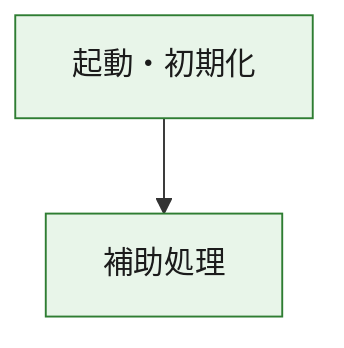
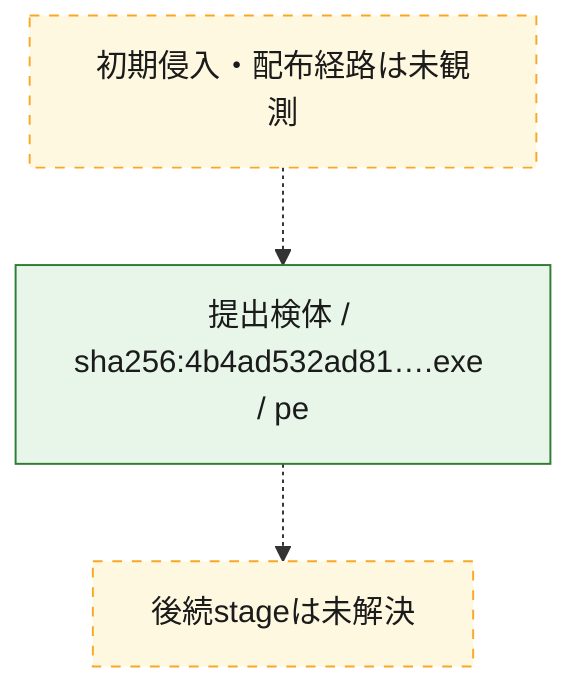
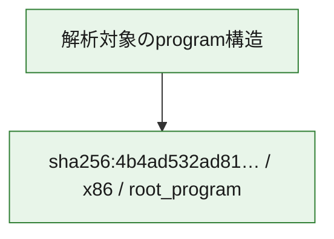

# 全体ロジック：4b4ad532ad81d4c07f7de4b68007c7f569b972515b61304037feef29c06b2a22

代表関数の静的証跡から、起動・初期化の処理群を確認しました。

## 読み方

- phaseの掲載順は解析上の整理順です。observed_call_edgesがない段階間の実行順を断定しません。
- 図の実線は静的に観測した関係、点線と黄色のノードは未観測・未解決の関係を示します。
- 図は静的な要約であり、動的実行を再現するものではありません。
- 詳細な関数解説とfingerprintは[STATIC-LOGIC.md](STATIC-LOGIC.md)を参照してください。

## 静的可視化

### 実行フロー

### 感染チェーン

### モジュール関係

## 処理段階

### 1. 起動・初期化

entry pointから初期化と後続処理への移行を確認します。
確度: `confirmed_static_function_evidence`

- `4b4ad532ad81d4c07f7de4b68007c7f569b972515b61304037feef29c06b2a22:ghidra:180001010` — 初期化と主要処理への分岐を行う入口関数です。 状態: `succeeded`、選定理由: `entry_point`, `meaningful_symbol_name`, `reviewed_call_centrality:22`, `role:entrypoint`, `small_program_complete_context`

### 2. 補助処理

主要処理を支える一般内部関数またはlibrary処理を確認します。
確度: `confirmed_static_function_evidence`

- `4b4ad532ad81d4c07f7de4b68007c7f569b972515b61304037feef29c06b2a22:ghidra:180001240` — 検体内部の一般処理を実装する関数です。 状態: `succeeded`、選定理由: `context_representative`, `reviewed_call_centrality:2`, `small_program_complete_context`
- `4b4ad532ad81d4c07f7de4b68007c7f569b972515b61304037feef29c06b2a22:ghidra:180001350` — 検体内部の一般処理を実装する関数です。 状態: `succeeded`、選定理由: `context_representative`, `reviewed_call_centrality:25`, `small_program_complete_context`
- `4b4ad532ad81d4c07f7de4b68007c7f569b972515b61304037feef29c06b2a22:ghidra:180003780` — 検体内部の一般処理を実装する関数です。 状態: `succeeded`、選定理由: `context_representative`, `reviewed_call_centrality:2`, `small_program_complete_context`
- `4b4ad532ad81d4c07f7de4b68007c7f569b972515b61304037feef29c06b2a22:ghidra:1800038e0` — 検体内部の一般処理を実装する関数です。 状態: `succeeded`、選定理由: `context_representative`, `reviewed_call_centrality:2`, `small_program_complete_context`

## 観測したcall関係

- `4b4ad532ad81d4c07f7de4b68007c7f569b972515b61304037feef29c06b2a22:ghidra:180001010` → `4b4ad532ad81d4c07f7de4b68007c7f569b972515b61304037feef29c06b2a22:ghidra:180001240` （`startup` → `support`）
- `4b4ad532ad81d4c07f7de4b68007c7f569b972515b61304037feef29c06b2a22:ghidra:180001010` → `4b4ad532ad81d4c07f7de4b68007c7f569b972515b61304037feef29c06b2a22:ghidra:180001350` （`startup` → `support`）
- `4b4ad532ad81d4c07f7de4b68007c7f569b972515b61304037feef29c06b2a22:ghidra:180001350` → `4b4ad532ad81d4c07f7de4b68007c7f569b972515b61304037feef29c06b2a22:ghidra:180001240` （`support` → `support`）
- `4b4ad532ad81d4c07f7de4b68007c7f569b972515b61304037feef29c06b2a22:ghidra:180001350` → `4b4ad532ad81d4c07f7de4b68007c7f569b972515b61304037feef29c06b2a22:ghidra:180003780` （`support` → `support`）
- `4b4ad532ad81d4c07f7de4b68007c7f569b972515b61304037feef29c06b2a22:ghidra:180001350` → `4b4ad532ad81d4c07f7de4b68007c7f569b972515b61304037feef29c06b2a22:ghidra:1800038e0` （`support` → `support`）
- `4b4ad532ad81d4c07f7de4b68007c7f569b972515b61304037feef29c06b2a22:ghidra:180003780` → `4b4ad532ad81d4c07f7de4b68007c7f569b972515b61304037feef29c06b2a22:ghidra:1800038e0` （`support` → `support`）
- `ghidra-function:018322d2cab624fc20523f39` → `ghidra-external:01e4bcab17eeda624f05e345` （`unclassified` → `unclassified`）
- `ghidra-function:018322d2cab624fc20523f39` → `ghidra-external:0ff446c86dcd028706af2412` （`unclassified` → `unclassified`）
- `ghidra-function:018322d2cab624fc20523f39` → `ghidra-external:14c24925a1fab11b4527eed1` （`unclassified` → `unclassified`）
- `ghidra-function:018322d2cab624fc20523f39` → `ghidra-external:163d3cc3943ddbc1b087209f` （`unclassified` → `unclassified`）
- `ghidra-function:018322d2cab624fc20523f39` → `ghidra-external:18158e01c06a851466c1482c` （`unclassified` → `unclassified`）
- `ghidra-function:018322d2cab624fc20523f39` → `ghidra-external:249e79179c67c7dd5c9d7a83` （`unclassified` → `unclassified`）
- `ghidra-function:018322d2cab624fc20523f39` → `ghidra-external:2a07f17916f3fe400ea6c724` （`unclassified` → `unclassified`）
- `ghidra-function:018322d2cab624fc20523f39` → `ghidra-external:339381aada0488e9b1250b76` （`unclassified` → `unclassified`）
- `ghidra-function:018322d2cab624fc20523f39` → `ghidra-external:45d30b9b45398fe92730fd2e` （`unclassified` → `unclassified`）
- `ghidra-function:018322d2cab624fc20523f39` → `ghidra-external:4b46e3cb40a451bc5c13e3a2` （`unclassified` → `unclassified`）
- `ghidra-function:018322d2cab624fc20523f39` → `ghidra-external:56964126dced55bff3023608` （`unclassified` → `unclassified`）
- `ghidra-function:018322d2cab624fc20523f39` → `ghidra-external:69e0d02736dff49da796f766` （`unclassified` → `unclassified`）
- `ghidra-function:018322d2cab624fc20523f39` → `ghidra-external:7b7d34d95285ca19000286bb` （`unclassified` → `unclassified`）
- `ghidra-function:018322d2cab624fc20523f39` → `ghidra-external:837d1f9778bd17fa3a5ab857` （`unclassified` → `unclassified`）
- `ghidra-function:018322d2cab624fc20523f39` → `ghidra-external:94fe0561a893288476591008` （`unclassified` → `unclassified`）
- `ghidra-function:018322d2cab624fc20523f39` → `ghidra-external:982b319055e8cae701dfcea3` （`unclassified` → `unclassified`）
- `ghidra-function:018322d2cab624fc20523f39` → `ghidra-external:ad3af0d6310051e330db7bc5` （`unclassified` → `unclassified`）
- `ghidra-function:018322d2cab624fc20523f39` → `ghidra-external:b0bc6245366ee4f0a54a433b` （`unclassified` → `unclassified`）
- `ghidra-function:018322d2cab624fc20523f39` → `ghidra-external:cf5cdf44ddb8850af7382725` （`unclassified` → `unclassified`）
- `ghidra-function:018322d2cab624fc20523f39` → `ghidra-external:d5df4f9c4eac49bf02ffee8e` （`unclassified` → `unclassified`）
- `ghidra-function:018322d2cab624fc20523f39` → `ghidra-external:e5743624478efdac49088d35` （`unclassified` → `unclassified`）
- `ghidra-function:018322d2cab624fc20523f39` → `ghidra-function:0550a763bf97b435565e9353` （`unclassified` → `unclassified`）
- `ghidra-function:018322d2cab624fc20523f39` → `ghidra-function:1286b0bbfd5b802922538f76` （`unclassified` → `unclassified`）
- `ghidra-function:018322d2cab624fc20523f39` → `ghidra-function:9dde26c01597d9211c38a878` （`unclassified` → `unclassified`）
- `ghidra-function:9dde26c01597d9211c38a878` → `ghidra-function:0550a763bf97b435565e9353` （`unclassified` → `unclassified`）
- `ghidra-function:c89e56d3e4fcd816a33f2583` → `ghidra-function:018322d2cab624fc20523f39` （`unclassified` → `unclassified`）
- `ghidra-function:c89e56d3e4fcd816a33f2583` → `ghidra-function:06c3b7e309b8af314ca3c37b` （`unclassified` → `unclassified`）
- `ghidra-function:c89e56d3e4fcd816a33f2583` → `ghidra-function:1286b0bbfd5b802922538f76` （`unclassified` → `unclassified`）
- `ghidra-function:c89e56d3e4fcd816a33f2583` → `ghidra-function:20f239443f6b13eca9e3ad71` （`unclassified` → `unclassified`）
- `ghidra-function:c89e56d3e4fcd816a33f2583` → `ghidra-function:325ee9a63459cf0ca22b81df` （`unclassified` → `unclassified`）
- `ghidra-function:c89e56d3e4fcd816a33f2583` → `ghidra-function:589922bcf614a0b2d2c18901` （`unclassified` → `unclassified`）
- `ghidra-function:c89e56d3e4fcd816a33f2583` → `ghidra-function:69fe1b7b5e0d18addc6f8b8c` （`unclassified` → `unclassified`）
- `ghidra-function:c89e56d3e4fcd816a33f2583` → `ghidra-function:94ee27a0836c9e2628b057e0` （`unclassified` → `unclassified`）
- `ghidra-function:c89e56d3e4fcd816a33f2583` → `ghidra-function:a0060f543cc3ef7d2e660355` （`unclassified` → `unclassified`）
- `ghidra-function:c89e56d3e4fcd816a33f2583` → `ghidra-function:affcd37a0d0cc68c15323442` （`unclassified` → `unclassified`）
- `ghidra-function:c89e56d3e4fcd816a33f2583` → `ghidra-function:eb99815c1a37e90d0c4ec653` （`unclassified` → `unclassified`）
- `ghidra-function:c89e56d3e4fcd816a33f2583` → `ghidra-function:f0a5f5848085ff80ac5a5ddb` （`unclassified` → `unclassified`）

## 解析範囲と制約

- 選定外関数は全体inventoryへ残しますが、関数本体の個別解説対象にはしていません。
- indirect call、難読化、packer、VM、壊れたcontrol flowによりcall関係が欠落する場合があります。
- 文書は静的解析に基づき、検体実行や外部通信による動的確認は行っていません。
