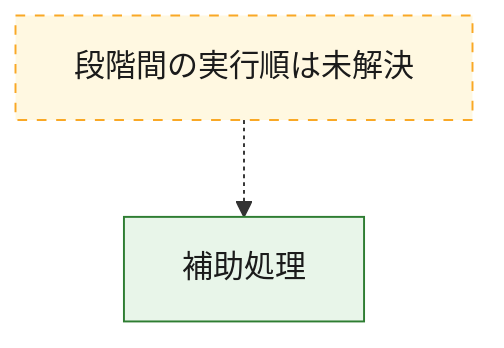
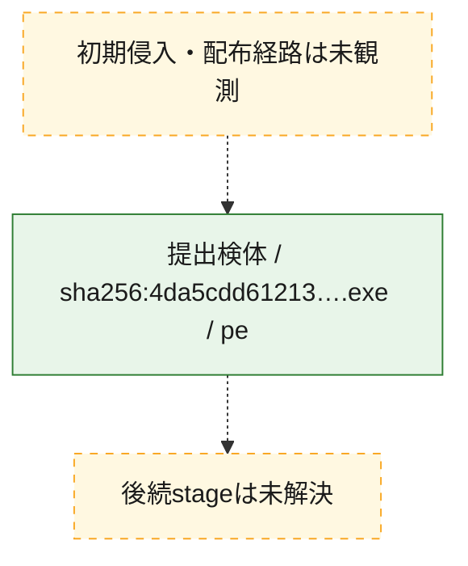
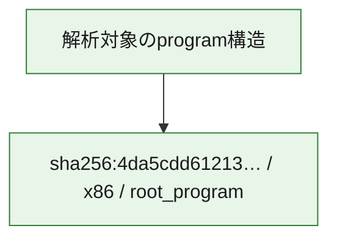

# 全体ロジック：4da5cdd61213038b7374fe450de2ef067cb226393509cb3269456ffbe334d225

代表関数から主要なmalware処理段階を自動分類できませんでした。

## 読み方

- phaseの掲載順は解析上の整理順です。observed_call_edgesがない段階間の実行順を断定しません。
- 図の実線は静的に観測した関係、点線と黄色のノードは未観測・未解決の関係を示します。
- 図は静的な要約であり、動的実行を再現するものではありません。
- 詳細な関数解説とfingerprintは[STATIC-LOGIC.md](STATIC-LOGIC.md)を参照してください。

## 静的可視化

### 実行フロー

### 感染チェーン

### モジュール関係

## 処理段階

### 1. 補助処理

主要処理を支える一般内部関数またはlibrary処理を確認します。
確度: `confirmed_static_function_evidence_with_limits`

- `4da5cdd61213038b7374fe450de2ef067cb226393509cb3269456ffbe334d225:ghidra:1400041c0` — 検体内部の一般処理を実装する関数です。 状態: `limited_bad_instruction_or_flow`、選定理由: `context_representative`, `reviewed_call_centrality:1`
- `4da5cdd61213038b7374fe450de2ef067cb226393509cb3269456ffbe334d225:ghidra:1400043ec` — 検体内部の一般処理を実装する関数です。 状態: `limited_bad_instruction_or_flow`、選定理由: `context_representative`, `reviewed_call_centrality:1`
- `4da5cdd61213038b7374fe450de2ef067cb226393509cb3269456ffbe334d225:ghidra:140004410` — 検体内部の一般処理を実装する関数です。 状態: `limited_bad_instruction_or_flow`、選定理由: `context_representative`, `reviewed_call_centrality:1`
- `4da5cdd61213038b7374fe450de2ef067cb226393509cb3269456ffbe334d225:ghidra:140004438` — 検体内部の一般処理を実装する関数です。 状態: `limited_bad_instruction_or_flow`、選定理由: `context_representative`, `reviewed_call_centrality:1`
- `4da5cdd61213038b7374fe450de2ef067cb226393509cb3269456ffbe334d225:ghidra:140004474` — 検体内部の一般処理を実装する関数です。 状態: `limited_bad_instruction_or_flow`、選定理由: `context_representative`, `reviewed_call_centrality:1`
- `4da5cdd61213038b7374fe450de2ef067cb226393509cb3269456ffbe334d225:ghidra:14000449c` — 検体内部の一般処理を実装する関数です。 状態: `limited_bad_instruction_or_flow`、選定理由: `context_representative`, `reviewed_call_centrality:1`
- `4da5cdd61213038b7374fe450de2ef067cb226393509cb3269456ffbe334d225:ghidra:140004500` — 検体内部の一般処理を実装する関数です。 状態: `limited_bad_instruction_or_flow`、選定理由: `context_representative`, `reviewed_call_centrality:1`
- `4da5cdd61213038b7374fe450de2ef067cb226393509cb3269456ffbe334d225:ghidra:140004584` — 検体内部の一般処理を実装する関数です。 状態: `limited_bad_instruction_or_flow`、選定理由: `context_representative`, `reviewed_call_centrality:1`
- `4da5cdd61213038b7374fe450de2ef067cb226393509cb3269456ffbe334d225:ghidra:1400045fc` — 検体内部の一般処理を実装する関数です。 状態: `limited_bad_instruction_or_flow`、選定理由: `context_representative`, `reviewed_call_centrality:1`
- `4da5cdd61213038b7374fe450de2ef067cb226393509cb3269456ffbe334d225:ghidra:140004668` — 検体内部の一般処理を実装する関数です。 状態: `limited_bad_instruction_or_flow`、選定理由: `context_representative`, `reviewed_call_centrality:1`
- `4da5cdd61213038b7374fe450de2ef067cb226393509cb3269456ffbe334d225:ghidra:140004794` — 検体内部の一般処理を実装する関数です。 状態: `limited_bad_instruction_or_flow`、選定理由: `context_representative`, `reviewed_call_centrality:1`
- `4da5cdd61213038b7374fe450de2ef067cb226393509cb3269456ffbe334d225:ghidra:1400048c0` — 検体内部の一般処理を実装する関数です。 状態: `limited_bad_instruction_or_flow`、選定理由: `context_representative`, `reviewed_call_centrality:1`
- `4da5cdd61213038b7374fe450de2ef067cb226393509cb3269456ffbe334d225:ghidra:140004960` — 検体内部の一般処理を実装する関数です。 状態: `limited_bad_instruction_or_flow`、選定理由: `context_representative`, `reviewed_call_centrality:1`
- `4da5cdd61213038b7374fe450de2ef067cb226393509cb3269456ffbe334d225:ghidra:1400049dc` — 検体内部の一般処理を実装する関数です。 状態: `limited_bad_instruction_or_flow`、選定理由: `context_representative`, `reviewed_call_centrality:1`
- `4da5cdd61213038b7374fe450de2ef067cb226393509cb3269456ffbe334d225:ghidra:140004a54` — 検体内部の一般処理を実装する関数です。 状態: `limited_bad_instruction_or_flow`、選定理由: `context_representative`, `reviewed_call_centrality:1`
- `4da5cdd61213038b7374fe450de2ef067cb226393509cb3269456ffbe334d225:ghidra:140004adc` — 検体内部の一般処理を実装する関数です。 状態: `limited_bad_instruction_or_flow`、選定理由: `context_representative`, `reviewed_call_centrality:1`
- `4da5cdd61213038b7374fe450de2ef067cb226393509cb3269456ffbe334d225:ghidra:140004b64` — 検体内部の一般処理を実装する関数です。 状態: `limited_bad_instruction_or_flow`、選定理由: `context_representative`, `reviewed_call_centrality:1`
- `4da5cdd61213038b7374fe450de2ef067cb226393509cb3269456ffbe334d225:ghidra:140004b7c` — 検体内部の一般処理を実装する関数です。 状態: `limited_bad_instruction_or_flow`、選定理由: `context_representative`, `reviewed_call_centrality:1`
- `4da5cdd61213038b7374fe450de2ef067cb226393509cb3269456ffbe334d225:ghidra:140004c1c` — 検体内部の一般処理を実装する関数です。 状態: `limited_bad_instruction_or_flow`、選定理由: `context_representative`, `reviewed_call_centrality:1`
- `4da5cdd61213038b7374fe450de2ef067cb226393509cb3269456ffbe334d225:ghidra:140004ca4` — 検体内部の一般処理を実装する関数です。 状態: `limited_bad_instruction_or_flow`、選定理由: `context_representative`, `reviewed_call_centrality:1`
- `4da5cdd61213038b7374fe450de2ef067cb226393509cb3269456ffbe334d225:ghidra:140004d14` — 検体内部の一般処理を実装する関数です。 状態: `limited_bad_instruction_or_flow`、選定理由: `context_representative`, `reviewed_call_centrality:1`
- `4da5cdd61213038b7374fe450de2ef067cb226393509cb3269456ffbe334d225:ghidra:140004d74` — 検体内部の一般処理を実装する関数です。 状態: `limited_bad_instruction_or_flow`、選定理由: `context_representative`, `reviewed_call_centrality:1`
- `4da5cdd61213038b7374fe450de2ef067cb226393509cb3269456ffbe334d225:ghidra:140004dc8` — 検体内部の一般処理を実装する関数です。 状態: `limited_bad_instruction_or_flow`、選定理由: `context_representative`, `reviewed_call_centrality:1`
- `4da5cdd61213038b7374fe450de2ef067cb226393509cb3269456ffbe334d225:ghidra:140004e40` — 検体内部の一般処理を実装する関数です。 状態: `limited_bad_instruction_or_flow`、選定理由: `context_representative`, `reviewed_call_centrality:1`
- `4da5cdd61213038b7374fe450de2ef067cb226393509cb3269456ffbe334d225:ghidra:140004e9c` — 検体内部の一般処理を実装する関数です。 状態: `limited_bad_instruction_or_flow`、選定理由: `context_representative`, `reviewed_call_centrality:1`
- `4da5cdd61213038b7374fe450de2ef067cb226393509cb3269456ffbe334d225:ghidra:140004ef4` — 検体内部の一般処理を実装する関数です。 状態: `limited_bad_instruction_or_flow`、選定理由: `context_representative`, `reviewed_call_centrality:1`
- `4da5cdd61213038b7374fe450de2ef067cb226393509cb3269456ffbe334d225:ghidra:140004f7c` — 検体内部の一般処理を実装する関数です。 状態: `limited_bad_instruction_or_flow`、選定理由: `context_representative`, `reviewed_call_centrality:1`
- `4da5cdd61213038b7374fe450de2ef067cb226393509cb3269456ffbe334d225:ghidra:140004ffc` — 検体内部の一般処理を実装する関数です。 状態: `limited_bad_instruction_or_flow`、選定理由: `context_representative`, `reviewed_call_centrality:1`
- `4da5cdd61213038b7374fe450de2ef067cb226393509cb3269456ffbe334d225:ghidra:140005050` — 検体内部の一般処理を実装する関数です。 状態: `limited_bad_instruction_or_flow`、選定理由: `context_representative`, `reviewed_call_centrality:1`
- `4da5cdd61213038b7374fe450de2ef067cb226393509cb3269456ffbe334d225:ghidra:1400050e4` — 検体内部の一般処理を実装する関数です。 状態: `limited_bad_instruction_or_flow`、選定理由: `context_representative`, `reviewed_call_centrality:1`
- `4da5cdd61213038b7374fe450de2ef067cb226393509cb3269456ffbe334d225:ghidra:140005138` — 検体内部の一般処理を実装する関数です。 状態: `limited_bad_instruction_or_flow`、選定理由: `context_representative`, `reviewed_call_centrality:1`
- `4da5cdd61213038b7374fe450de2ef067cb226393509cb3269456ffbe334d225:ghidra:1400051d0` — 検体内部の一般処理を実装する関数です。 状態: `limited_bad_instruction_or_flow`、選定理由: `context_representative`, `reviewed_call_centrality:1`

## 観測したcall関係

- `ghidra-function:082539949538167e4c420eda` → `ghidra-external:fd2f7059a0d1283f047a0709` （`unclassified` → `unclassified`）
- `ghidra-function:0f545627b1c18f086d4edf9e` → `ghidra-external:fd2f7059a0d1283f047a0709` （`unclassified` → `unclassified`）
- `ghidra-function:19bc1db2cf900093203ae156` → `ghidra-external:fd2f7059a0d1283f047a0709` （`unclassified` → `unclassified`）
- `ghidra-function:1d96b6711e88f49e62bde40b` → `ghidra-external:fd2f7059a0d1283f047a0709` （`unclassified` → `unclassified`）
- `ghidra-function:1f7b3fa577cc7b857c00d1f9` → `ghidra-external:fd2f7059a0d1283f047a0709` （`unclassified` → `unclassified`）
- `ghidra-function:2367ee9273055e94781696b5` → `ghidra-external:fd2f7059a0d1283f047a0709` （`unclassified` → `unclassified`）
- `ghidra-function:2c149b7bcb407d700f104f43` → `ghidra-external:fd2f7059a0d1283f047a0709` （`unclassified` → `unclassified`）
- `ghidra-function:34a8d013ced3e72cfc8050dc` → `ghidra-external:fd2f7059a0d1283f047a0709` （`unclassified` → `unclassified`）
- `ghidra-function:52f3d91188f46ae89ad12dd1` → `ghidra-external:fd2f7059a0d1283f047a0709` （`unclassified` → `unclassified`）
- `ghidra-function:5cb7cdfcff1fe3e280bbefdb` → `ghidra-external:fd2f7059a0d1283f047a0709` （`unclassified` → `unclassified`）
- `ghidra-function:63d410336485ea2571640b91` → `ghidra-external:fd2f7059a0d1283f047a0709` （`unclassified` → `unclassified`）
- `ghidra-function:6cc12c256c5663f5f1898c1d` → `ghidra-external:fd2f7059a0d1283f047a0709` （`unclassified` → `unclassified`）
- `ghidra-function:72503e08df04a97bc8dafa7d` → `ghidra-external:fd2f7059a0d1283f047a0709` （`unclassified` → `unclassified`）
- `ghidra-function:7c08e53141d1db64785dc8e3` → `ghidra-external:fd2f7059a0d1283f047a0709` （`unclassified` → `unclassified`）
- `ghidra-function:7fc6d3d11e24f1cf42876829` → `ghidra-external:fd2f7059a0d1283f047a0709` （`unclassified` → `unclassified`）
- `ghidra-function:84b2a61354ff34333cfe43dd` → `ghidra-external:fd2f7059a0d1283f047a0709` （`unclassified` → `unclassified`）
- `ghidra-function:896bfea5685dff31f46c3e90` → `ghidra-external:fd2f7059a0d1283f047a0709` （`unclassified` → `unclassified`）
- `ghidra-function:8afc98736717fe8c5edff804` → `ghidra-external:fd2f7059a0d1283f047a0709` （`unclassified` → `unclassified`）
- `ghidra-function:9ae824c717c40ef2d3efa995` → `ghidra-external:fd2f7059a0d1283f047a0709` （`unclassified` → `unclassified`）
- `ghidra-function:a3c6ef7f30e75c0ebfb75236` → `ghidra-external:fd2f7059a0d1283f047a0709` （`unclassified` → `unclassified`）
- `ghidra-function:a603ed1c7ccc60a4ae66cc90` → `ghidra-external:fd2f7059a0d1283f047a0709` （`unclassified` → `unclassified`）
- `ghidra-function:a7f828c1570aebe04309e822` → `ghidra-external:fd2f7059a0d1283f047a0709` （`unclassified` → `unclassified`）
- `ghidra-function:b19a2e53d7c44e74d106b91b` → `ghidra-external:fd2f7059a0d1283f047a0709` （`unclassified` → `unclassified`）
- `ghidra-function:b55e36ce3009b42ea51f3ea9` → `ghidra-external:fd2f7059a0d1283f047a0709` （`unclassified` → `unclassified`）
- `ghidra-function:bb74769a62d6f4f07d7f8c1c` → `ghidra-external:fd2f7059a0d1283f047a0709` （`unclassified` → `unclassified`）
- `ghidra-function:bd48eb80e4410033942a6b77` → `ghidra-external:fd2f7059a0d1283f047a0709` （`unclassified` → `unclassified`）
- `ghidra-function:d4c435086e308168942f8f80` → `ghidra-external:fd2f7059a0d1283f047a0709` （`unclassified` → `unclassified`）
- `ghidra-function:d4efa75bff584a577def2381` → `ghidra-external:fd2f7059a0d1283f047a0709` （`unclassified` → `unclassified`）
- `ghidra-function:d6caeb89033f874e86c8f643` → `ghidra-external:fd2f7059a0d1283f047a0709` （`unclassified` → `unclassified`）
- `ghidra-function:dbcf5a3d88af9a10c21f4519` → `ghidra-external:fd2f7059a0d1283f047a0709` （`unclassified` → `unclassified`）
- `ghidra-function:ef617611eb4282e0fd73ade0` → `ghidra-external:fd2f7059a0d1283f047a0709` （`unclassified` → `unclassified`）
- `ghidra-function:f0759fca55f07308275f4e6b` → `ghidra-external:fd2f7059a0d1283f047a0709` （`unclassified` → `unclassified`）

## 解析範囲と制約

- 選定外関数は全体inventoryへ残しますが、関数本体の個別解説対象にはしていません。
- indirect call、難読化、packer、VM、壊れたcontrol flowによりcall関係が欠落する場合があります。
- 文書は静的解析に基づき、検体実行や外部通信による動的確認は行っていません。
