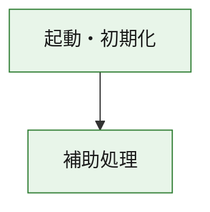
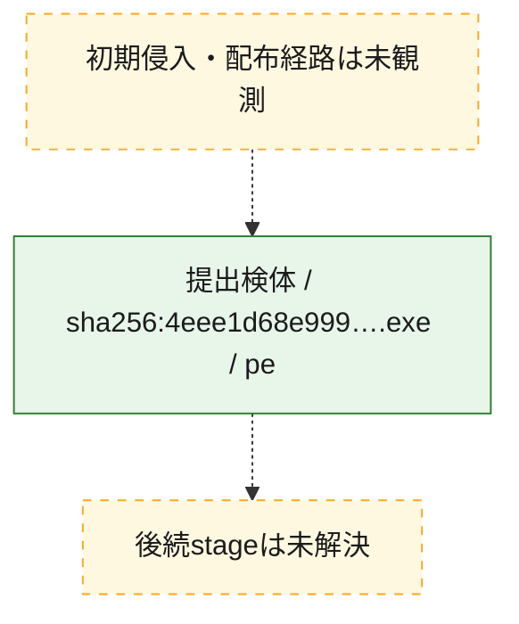
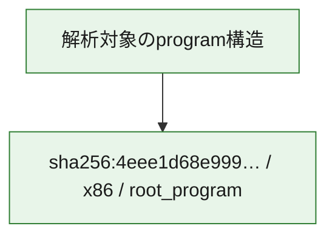

# 全体ロジック：4eee1d68e999a19f7ff536353bae7388dae609d2873610fcb7868acbddc59684

代表関数の静的証跡から、起動・初期化の処理群を確認しました。

## 読み方

- phaseの掲載順は解析上の整理順です。observed_call_edgesがない段階間の実行順を断定しません。
- 図の実線は静的に観測した関係、点線と黄色のノードは未観測・未解決の関係を示します。
- 図は静的な要約であり、動的実行を再現するものではありません。
- 詳細な関数解説とfingerprintは[STATIC-LOGIC.md](STATIC-LOGIC.md)を参照してください。

## 静的可視化

### 実行フロー

### 感染チェーン

### モジュール関係

## 処理段階

### 1. 起動・初期化

entry pointから初期化と後続処理への移行を確認します。
確度: `confirmed_static_function_evidence`

- `4eee1d68e999a19f7ff536353bae7388dae609d2873610fcb7868acbddc59684:ghidra:180001010` — 初期化と主要処理への分岐を行う入口関数です。 状態: `succeeded`、選定理由: `entry_point`, `meaningful_symbol_name`, `reviewed_call_centrality:22`, `role:entrypoint`, `small_program_complete_context`

### 2. 補助処理

主要処理を支える一般内部関数またはlibrary処理を確認します。
確度: `confirmed_static_function_evidence`

- `4eee1d68e999a19f7ff536353bae7388dae609d2873610fcb7868acbddc59684:ghidra:180001240` — 検体内部の一般処理を実装する関数です。 状態: `succeeded`、選定理由: `context_representative`, `reviewed_call_centrality:2`, `small_program_complete_context`
- `4eee1d68e999a19f7ff536353bae7388dae609d2873610fcb7868acbddc59684:ghidra:180001350` — 検体内部の一般処理を実装する関数です。 状態: `succeeded`、選定理由: `context_representative`, `reviewed_call_centrality:25`, `small_program_complete_context`
- `4eee1d68e999a19f7ff536353bae7388dae609d2873610fcb7868acbddc59684:ghidra:180003780` — 検体内部の一般処理を実装する関数です。 状態: `succeeded`、選定理由: `context_representative`, `reviewed_call_centrality:2`, `small_program_complete_context`
- `4eee1d68e999a19f7ff536353bae7388dae609d2873610fcb7868acbddc59684:ghidra:1800038e0` — 検体内部の一般処理を実装する関数です。 状態: `succeeded`、選定理由: `context_representative`, `reviewed_call_centrality:2`, `small_program_complete_context`

## 観測したcall関係

- `4eee1d68e999a19f7ff536353bae7388dae609d2873610fcb7868acbddc59684:ghidra:180001010` → `4eee1d68e999a19f7ff536353bae7388dae609d2873610fcb7868acbddc59684:ghidra:180001240` （`startup` → `support`）
- `4eee1d68e999a19f7ff536353bae7388dae609d2873610fcb7868acbddc59684:ghidra:180001010` → `4eee1d68e999a19f7ff536353bae7388dae609d2873610fcb7868acbddc59684:ghidra:180001350` （`startup` → `support`）
- `4eee1d68e999a19f7ff536353bae7388dae609d2873610fcb7868acbddc59684:ghidra:180001350` → `4eee1d68e999a19f7ff536353bae7388dae609d2873610fcb7868acbddc59684:ghidra:180001240` （`support` → `support`）
- `4eee1d68e999a19f7ff536353bae7388dae609d2873610fcb7868acbddc59684:ghidra:180001350` → `4eee1d68e999a19f7ff536353bae7388dae609d2873610fcb7868acbddc59684:ghidra:180003780` （`support` → `support`）
- `4eee1d68e999a19f7ff536353bae7388dae609d2873610fcb7868acbddc59684:ghidra:180001350` → `4eee1d68e999a19f7ff536353bae7388dae609d2873610fcb7868acbddc59684:ghidra:1800038e0` （`support` → `support`）
- `4eee1d68e999a19f7ff536353bae7388dae609d2873610fcb7868acbddc59684:ghidra:180003780` → `4eee1d68e999a19f7ff536353bae7388dae609d2873610fcb7868acbddc59684:ghidra:1800038e0` （`support` → `support`）
- `ghidra-function:136a3f75d2bb25354e7ce563` → `ghidra-function:0f056ec132dfea816944a629` （`unclassified` → `unclassified`）
- `ghidra-function:136a3f75d2bb25354e7ce563` → `ghidra-function:552f59294ea5fe9067b08c17` （`unclassified` → `unclassified`）
- `ghidra-function:136a3f75d2bb25354e7ce563` → `ghidra-function:6375cc57993b71350a056562` （`unclassified` → `unclassified`）
- `ghidra-function:136a3f75d2bb25354e7ce563` → `ghidra-function:916936d1f160bdd7323c75bb` （`unclassified` → `unclassified`）
- `ghidra-function:136a3f75d2bb25354e7ce563` → `ghidra-function:be9915cfe005dac8abb8932e` （`unclassified` → `unclassified`）
- `ghidra-function:136a3f75d2bb25354e7ce563` → `ghidra-function:ca95bda1423a58e393503aa1` （`unclassified` → `unclassified`）
- `ghidra-function:136a3f75d2bb25354e7ce563` → `ghidra-function:dcb8f3f08bd1cc1d75718b2c` （`unclassified` → `unclassified`）
- `ghidra-function:136a3f75d2bb25354e7ce563` → `ghidra-function:df6df644a348ac7037d06426` （`unclassified` → `unclassified`）
- `ghidra-function:136a3f75d2bb25354e7ce563` → `ghidra-function:e3256fa5ab24936ed695e7d7` （`unclassified` → `unclassified`）
- `ghidra-function:136a3f75d2bb25354e7ce563` → `ghidra-function:e534138c7c88f3999693545b` （`unclassified` → `unclassified`）
- `ghidra-function:136a3f75d2bb25354e7ce563` → `ghidra-function:f319b7be5ecb63f9d79b336b` （`unclassified` → `unclassified`）
- `ghidra-function:136a3f75d2bb25354e7ce563` → `ghidra-function:f90b1d9eae013f93ae95878d` （`unclassified` → `unclassified`）
- `ghidra-function:6375cc57993b71350a056562` → `ghidra-external:0aa3540639880c85c374a4da` （`unclassified` → `unclassified`）
- `ghidra-function:6375cc57993b71350a056562` → `ghidra-external:1a1a041d3fb841eaacb9a0da` （`unclassified` → `unclassified`）
- `ghidra-function:6375cc57993b71350a056562` → `ghidra-external:1e8986157edb2a9ad438174c` （`unclassified` → `unclassified`）
- `ghidra-function:6375cc57993b71350a056562` → `ghidra-external:202f98b8cf1de81736d1432d` （`unclassified` → `unclassified`）
- `ghidra-function:6375cc57993b71350a056562` → `ghidra-external:3280c65d5a113a751ca7892c` （`unclassified` → `unclassified`）
- `ghidra-function:6375cc57993b71350a056562` → `ghidra-external:3e4221c9a53ba8bbd74c44f6` （`unclassified` → `unclassified`）
- `ghidra-function:6375cc57993b71350a056562` → `ghidra-external:6675c5613a3e76b1e7c8fc66` （`unclassified` → `unclassified`）
- `ghidra-function:6375cc57993b71350a056562` → `ghidra-external:67d3085e3c7c065ef23c376e` （`unclassified` → `unclassified`）
- `ghidra-function:6375cc57993b71350a056562` → `ghidra-external:7066306dd25f6f098bb21d59` （`unclassified` → `unclassified`）
- `ghidra-function:6375cc57993b71350a056562` → `ghidra-external:7321c759f817a892865e0ff7` （`unclassified` → `unclassified`）
- `ghidra-function:6375cc57993b71350a056562` → `ghidra-external:800434730f81e4f7ccc4a9bb` （`unclassified` → `unclassified`）
- `ghidra-function:6375cc57993b71350a056562` → `ghidra-external:86f9ad0baebfe769111dca76` （`unclassified` → `unclassified`）
- `ghidra-function:6375cc57993b71350a056562` → `ghidra-external:908f9c2c207708ebe2c34b86` （`unclassified` → `unclassified`）
- `ghidra-function:6375cc57993b71350a056562` → `ghidra-external:9fb07966a514bfedbf17bba1` （`unclassified` → `unclassified`）
- `ghidra-function:6375cc57993b71350a056562` → `ghidra-external:c16076b1075a6deee4989e72` （`unclassified` → `unclassified`）
- `ghidra-function:6375cc57993b71350a056562` → `ghidra-external:c7da85ab4bffe0a137f10b13` （`unclassified` → `unclassified`）
- `ghidra-function:6375cc57993b71350a056562` → `ghidra-external:d9e70ce8f1a6038484da09fb` （`unclassified` → `unclassified`）
- `ghidra-function:6375cc57993b71350a056562` → `ghidra-external:e10782760150a24db4545047` （`unclassified` → `unclassified`）
- `ghidra-function:6375cc57993b71350a056562` → `ghidra-external:ebd10b1542939cf28653b067` （`unclassified` → `unclassified`）
- `ghidra-function:6375cc57993b71350a056562` → `ghidra-external:eeff882d1492a1af27930d5c` （`unclassified` → `unclassified`）
- `ghidra-function:6375cc57993b71350a056562` → `ghidra-external:f5872928d22ab89986e8ee91` （`unclassified` → `unclassified`）
- `ghidra-function:6375cc57993b71350a056562` → `ghidra-function:a19ecea64bbad357ba2d68c2` （`unclassified` → `unclassified`）
- `ghidra-function:6375cc57993b71350a056562` → `ghidra-function:ba690aaa4df6b65e261123b8` （`unclassified` → `unclassified`）
- `ghidra-function:6375cc57993b71350a056562` → `ghidra-function:ca95bda1423a58e393503aa1` （`unclassified` → `unclassified`）
- `ghidra-function:ba690aaa4df6b65e261123b8` → `ghidra-function:a19ecea64bbad357ba2d68c2` （`unclassified` → `unclassified`）

## 解析範囲と制約

- 選定外関数は全体inventoryへ残しますが、関数本体の個別解説対象にはしていません。
- indirect call、難読化、packer、VM、壊れたcontrol flowによりcall関係が欠落する場合があります。
- 文書は静的解析に基づき、検体実行や外部通信による動的確認は行っていません。
