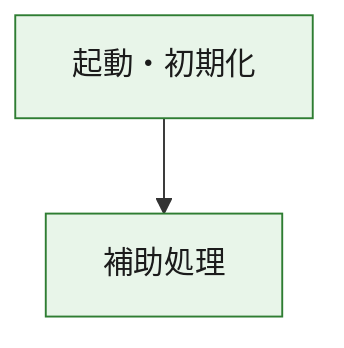
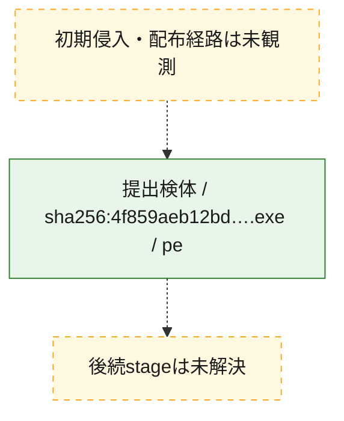
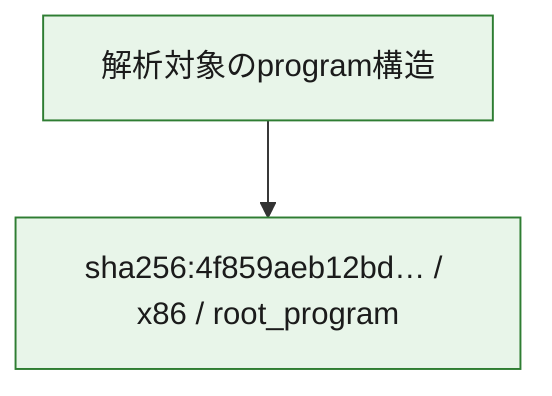

# 全体ロジック：4f859aeb12bd1611b86143b8754b5cb7f631015894df20f0881bc43f996ec67e

代表関数の静的証跡から、起動・初期化の処理群を確認しました。

## 読み方

- phaseの掲載順は解析上の整理順です。observed_call_edgesがない段階間の実行順を断定しません。
- 図の実線は静的に観測した関係、点線と黄色のノードは未観測・未解決の関係を示します。
- 図は静的な要約であり、動的実行を再現するものではありません。
- 詳細な関数解説とfingerprintは[STATIC-LOGIC.md](STATIC-LOGIC.md)を参照してください。

## 静的可視化

### 実行フロー

### 感染チェーン

### モジュール関係

## 処理段階

### 1. 起動・初期化

entry pointから初期化と後続処理への移行を確認します。
確度: `confirmed_static_function_evidence`

- `4f859aeb12bd1611b86143b8754b5cb7f631015894df20f0881bc43f996ec67e:ghidra:180001010` — 初期化と主要処理への分岐を行う入口関数です。 状態: `succeeded`、選定理由: `entry_point`, `meaningful_symbol_name`, `reviewed_call_centrality:22`, `role:entrypoint`, `small_program_complete_context`

### 2. 補助処理

主要処理を支える一般内部関数またはlibrary処理を確認します。
確度: `confirmed_static_function_evidence`

- `4f859aeb12bd1611b86143b8754b5cb7f631015894df20f0881bc43f996ec67e:ghidra:180001240` — 検体内部の一般処理を実装する関数です。 状態: `succeeded`、選定理由: `context_representative`, `reviewed_call_centrality:2`, `small_program_complete_context`
- `4f859aeb12bd1611b86143b8754b5cb7f631015894df20f0881bc43f996ec67e:ghidra:180001350` — 検体内部の一般処理を実装する関数です。 状態: `succeeded`、選定理由: `context_representative`, `reviewed_call_centrality:25`, `small_program_complete_context`
- `4f859aeb12bd1611b86143b8754b5cb7f631015894df20f0881bc43f996ec67e:ghidra:180003780` — 検体内部の一般処理を実装する関数です。 状態: `succeeded`、選定理由: `context_representative`, `reviewed_call_centrality:2`, `small_program_complete_context`
- `4f859aeb12bd1611b86143b8754b5cb7f631015894df20f0881bc43f996ec67e:ghidra:1800038e0` — 検体内部の一般処理を実装する関数です。 状態: `succeeded`、選定理由: `context_representative`, `reviewed_call_centrality:2`, `small_program_complete_context`

## 観測したcall関係

- `4f859aeb12bd1611b86143b8754b5cb7f631015894df20f0881bc43f996ec67e:ghidra:180001010` → `4f859aeb12bd1611b86143b8754b5cb7f631015894df20f0881bc43f996ec67e:ghidra:180001240` （`startup` → `support`）
- `4f859aeb12bd1611b86143b8754b5cb7f631015894df20f0881bc43f996ec67e:ghidra:180001010` → `4f859aeb12bd1611b86143b8754b5cb7f631015894df20f0881bc43f996ec67e:ghidra:180001350` （`startup` → `support`）
- `4f859aeb12bd1611b86143b8754b5cb7f631015894df20f0881bc43f996ec67e:ghidra:180001350` → `4f859aeb12bd1611b86143b8754b5cb7f631015894df20f0881bc43f996ec67e:ghidra:180001240` （`support` → `support`）
- `4f859aeb12bd1611b86143b8754b5cb7f631015894df20f0881bc43f996ec67e:ghidra:180001350` → `4f859aeb12bd1611b86143b8754b5cb7f631015894df20f0881bc43f996ec67e:ghidra:180003780` （`support` → `support`）
- `4f859aeb12bd1611b86143b8754b5cb7f631015894df20f0881bc43f996ec67e:ghidra:180001350` → `4f859aeb12bd1611b86143b8754b5cb7f631015894df20f0881bc43f996ec67e:ghidra:1800038e0` （`support` → `support`）
- `4f859aeb12bd1611b86143b8754b5cb7f631015894df20f0881bc43f996ec67e:ghidra:180003780` → `4f859aeb12bd1611b86143b8754b5cb7f631015894df20f0881bc43f996ec67e:ghidra:1800038e0` （`support` → `support`）
- `ghidra-function:1d9946d72e19d7cecf207038` → `ghidra-function:1524eecd38e3ceb1d30af5ff` （`unclassified` → `unclassified`）
- `ghidra-function:1d9946d72e19d7cecf207038` → `ghidra-function:20edf3721d66a34291d73ce5` （`unclassified` → `unclassified`）
- `ghidra-function:1d9946d72e19d7cecf207038` → `ghidra-function:42f22a8f6aa9f370c020ee05` （`unclassified` → `unclassified`）
- `ghidra-function:1d9946d72e19d7cecf207038` → `ghidra-function:527972a54ccd96c5f8536f8c` （`unclassified` → `unclassified`）
- `ghidra-function:1d9946d72e19d7cecf207038` → `ghidra-function:5693ff115b10af8b9d17fcb4` （`unclassified` → `unclassified`）
- `ghidra-function:1d9946d72e19d7cecf207038` → `ghidra-function:5733714b21c48bde8a286e93` （`unclassified` → `unclassified`）
- `ghidra-function:1d9946d72e19d7cecf207038` → `ghidra-function:60d34e193c7da2cf1141c907` （`unclassified` → `unclassified`）
- `ghidra-function:1d9946d72e19d7cecf207038` → `ghidra-function:a4143651003cb179a73643d4` （`unclassified` → `unclassified`）
- `ghidra-function:1d9946d72e19d7cecf207038` → `ghidra-function:b27d4f0b1d05f30aa9a7c721` （`unclassified` → `unclassified`）
- `ghidra-function:1d9946d72e19d7cecf207038` → `ghidra-function:c21b9e62d697858ede37c2ca` （`unclassified` → `unclassified`）
- `ghidra-function:1d9946d72e19d7cecf207038` → `ghidra-function:e62f482f1770cba69dfc8c00` （`unclassified` → `unclassified`）
- `ghidra-function:1d9946d72e19d7cecf207038` → `ghidra-function:fb328a54fb7691db80a6625d` （`unclassified` → `unclassified`）
- `ghidra-function:6c6ecd0024588fc126afeeef` → `ghidra-function:2c62603108f426ce93e8ebcc` （`unclassified` → `unclassified`）
- `ghidra-function:a4143651003cb179a73643d4` → `ghidra-external:000633195e4ea06e16374be3` （`unclassified` → `unclassified`）
- `ghidra-function:a4143651003cb179a73643d4` → `ghidra-external:07deb9d9b8c187374aea3ebc` （`unclassified` → `unclassified`）
- `ghidra-function:a4143651003cb179a73643d4` → `ghidra-external:09f40017c4048c56cf04c99e` （`unclassified` → `unclassified`）
- `ghidra-function:a4143651003cb179a73643d4` → `ghidra-external:17127c14ca1d8a4c2fb6a730` （`unclassified` → `unclassified`）
- `ghidra-function:a4143651003cb179a73643d4` → `ghidra-external:23600d311ada92a16fdb898a` （`unclassified` → `unclassified`）
- `ghidra-function:a4143651003cb179a73643d4` → `ghidra-external:271d4e77462931486774f74d` （`unclassified` → `unclassified`）
- `ghidra-function:a4143651003cb179a73643d4` → `ghidra-external:36dfbeb158ff9fa6685bd460` （`unclassified` → `unclassified`）
- `ghidra-function:a4143651003cb179a73643d4` → `ghidra-external:3d0743550d6304a714f9e405` （`unclassified` → `unclassified`）
- `ghidra-function:a4143651003cb179a73643d4` → `ghidra-external:425070c7b690a48bb114c118` （`unclassified` → `unclassified`）
- `ghidra-function:a4143651003cb179a73643d4` → `ghidra-external:56769b53a9ed324e4db700a6` （`unclassified` → `unclassified`）
- `ghidra-function:a4143651003cb179a73643d4` → `ghidra-external:720de2cb3b3cccc1107953ff` （`unclassified` → `unclassified`）
- `ghidra-function:a4143651003cb179a73643d4` → `ghidra-external:80cf0db84e4cee0802ecff86` （`unclassified` → `unclassified`）
- `ghidra-function:a4143651003cb179a73643d4` → `ghidra-external:87edbcd2ec2b7d59d83df0ee` （`unclassified` → `unclassified`）
- `ghidra-function:a4143651003cb179a73643d4` → `ghidra-external:986014fd7a9c49a345e26d7c` （`unclassified` → `unclassified`）
- `ghidra-function:a4143651003cb179a73643d4` → `ghidra-external:aeb32f0fa68395e23dcfc8df` （`unclassified` → `unclassified`）
- `ghidra-function:a4143651003cb179a73643d4` → `ghidra-external:b190a7b05cd6c69886474471` （`unclassified` → `unclassified`）
- `ghidra-function:a4143651003cb179a73643d4` → `ghidra-external:b2f5776d97b7ff6da360c946` （`unclassified` → `unclassified`）
- `ghidra-function:a4143651003cb179a73643d4` → `ghidra-external:bcba90319e0fb98b28a348cb` （`unclassified` → `unclassified`）
- `ghidra-function:a4143651003cb179a73643d4` → `ghidra-external:d27c1db522dc3483e2238405` （`unclassified` → `unclassified`）
- `ghidra-function:a4143651003cb179a73643d4` → `ghidra-external:ecb31906c9027558c5a300b7` （`unclassified` → `unclassified`）
- `ghidra-function:a4143651003cb179a73643d4` → `ghidra-external:fe20b6923010451381feca06` （`unclassified` → `unclassified`）
- `ghidra-function:a4143651003cb179a73643d4` → `ghidra-function:20edf3721d66a34291d73ce5` （`unclassified` → `unclassified`）
- `ghidra-function:a4143651003cb179a73643d4` → `ghidra-function:2c62603108f426ce93e8ebcc` （`unclassified` → `unclassified`）
- `ghidra-function:a4143651003cb179a73643d4` → `ghidra-function:6c6ecd0024588fc126afeeef` （`unclassified` → `unclassified`）

## 解析範囲と制約

- 選定外関数は全体inventoryへ残しますが、関数本体の個別解説対象にはしていません。
- indirect call、難読化、packer、VM、壊れたcontrol flowによりcall関係が欠落する場合があります。
- 文書は静的解析に基づき、検体実行や外部通信による動的確認は行っていません。
