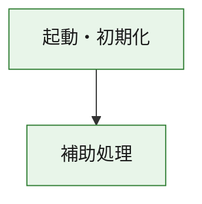
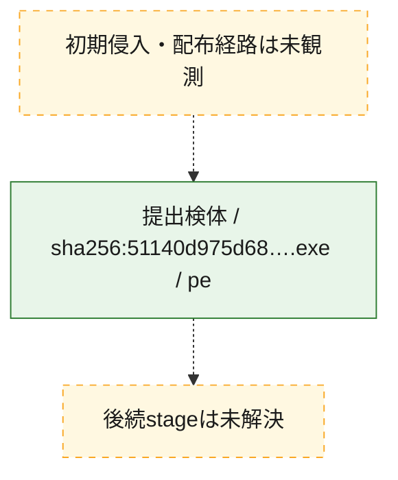
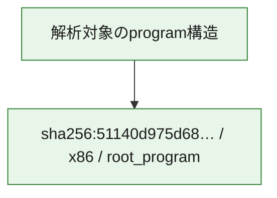

# 全体ロジック：51140d975d6868cb97c33fd0c5cae6c39e9780a2a84c9f06c1f5a97ddd1dcedb

代表関数の静的証跡から、起動・初期化の処理群を確認しました。

## 読み方

- phaseの掲載順は解析上の整理順です。observed_call_edgesがない段階間の実行順を断定しません。
- 図の実線は静的に観測した関係、点線と黄色のノードは未観測・未解決の関係を示します。
- 図は静的な要約であり、動的実行を再現するものではありません。
- 詳細な関数解説とfingerprintは[STATIC-LOGIC.md](STATIC-LOGIC.md)を参照してください。

## 静的可視化

### 実行フロー

### 感染チェーン

### モジュール関係

## 処理段階

### 1. 起動・初期化

entry pointから初期化と後続処理への移行を確認します。
確度: `confirmed_static_function_evidence`

- `51140d975d6868cb97c33fd0c5cae6c39e9780a2a84c9f06c1f5a97ddd1dcedb:ghidra:180001010` — 初期化と主要処理への分岐を行う入口関数です。 状態: `succeeded`、選定理由: `entry_point`, `meaningful_symbol_name`, `reviewed_call_centrality:22`, `role:entrypoint`, `small_program_complete_context`

### 2. 補助処理

主要処理を支える一般内部関数またはlibrary処理を確認します。
確度: `confirmed_static_function_evidence`

- `51140d975d6868cb97c33fd0c5cae6c39e9780a2a84c9f06c1f5a97ddd1dcedb:ghidra:180001240` — 検体内部の一般処理を実装する関数です。 状態: `succeeded`、選定理由: `context_representative`, `reviewed_call_centrality:2`, `small_program_complete_context`
- `51140d975d6868cb97c33fd0c5cae6c39e9780a2a84c9f06c1f5a97ddd1dcedb:ghidra:180001350` — 検体内部の一般処理を実装する関数です。 状態: `succeeded`、選定理由: `context_representative`, `reviewed_call_centrality:25`, `small_program_complete_context`
- `51140d975d6868cb97c33fd0c5cae6c39e9780a2a84c9f06c1f5a97ddd1dcedb:ghidra:180003780` — 検体内部の一般処理を実装する関数です。 状態: `succeeded`、選定理由: `context_representative`, `reviewed_call_centrality:2`, `small_program_complete_context`
- `51140d975d6868cb97c33fd0c5cae6c39e9780a2a84c9f06c1f5a97ddd1dcedb:ghidra:1800038e0` — 検体内部の一般処理を実装する関数です。 状態: `succeeded`、選定理由: `context_representative`, `reviewed_call_centrality:2`, `small_program_complete_context`

## 観測したcall関係

- `51140d975d6868cb97c33fd0c5cae6c39e9780a2a84c9f06c1f5a97ddd1dcedb:ghidra:180001010` → `51140d975d6868cb97c33fd0c5cae6c39e9780a2a84c9f06c1f5a97ddd1dcedb:ghidra:180001240` （`startup` → `support`）
- `51140d975d6868cb97c33fd0c5cae6c39e9780a2a84c9f06c1f5a97ddd1dcedb:ghidra:180001010` → `51140d975d6868cb97c33fd0c5cae6c39e9780a2a84c9f06c1f5a97ddd1dcedb:ghidra:180001350` （`startup` → `support`）
- `51140d975d6868cb97c33fd0c5cae6c39e9780a2a84c9f06c1f5a97ddd1dcedb:ghidra:180001350` → `51140d975d6868cb97c33fd0c5cae6c39e9780a2a84c9f06c1f5a97ddd1dcedb:ghidra:180001240` （`support` → `support`）
- `51140d975d6868cb97c33fd0c5cae6c39e9780a2a84c9f06c1f5a97ddd1dcedb:ghidra:180001350` → `51140d975d6868cb97c33fd0c5cae6c39e9780a2a84c9f06c1f5a97ddd1dcedb:ghidra:180003780` （`support` → `support`）
- `51140d975d6868cb97c33fd0c5cae6c39e9780a2a84c9f06c1f5a97ddd1dcedb:ghidra:180001350` → `51140d975d6868cb97c33fd0c5cae6c39e9780a2a84c9f06c1f5a97ddd1dcedb:ghidra:1800038e0` （`support` → `support`）
- `51140d975d6868cb97c33fd0c5cae6c39e9780a2a84c9f06c1f5a97ddd1dcedb:ghidra:180003780` → `51140d975d6868cb97c33fd0c5cae6c39e9780a2a84c9f06c1f5a97ddd1dcedb:ghidra:1800038e0` （`support` → `support`）
- `ghidra-function:42c4f840be94221e9e688fae` → `ghidra-function:07911918072c6b9ffdbb38ba` （`unclassified` → `unclassified`）
- `ghidra-function:42c4f840be94221e9e688fae` → `ghidra-function:0d34d3f4dd493def5de3031f` （`unclassified` → `unclassified`）
- `ghidra-function:42c4f840be94221e9e688fae` → `ghidra-function:2521f56225173254aec69507` （`unclassified` → `unclassified`）
- `ghidra-function:42c4f840be94221e9e688fae` → `ghidra-function:30558861807c41b0d1c5eb7f` （`unclassified` → `unclassified`）
- `ghidra-function:42c4f840be94221e9e688fae` → `ghidra-function:5a97b869a972902f91696942` （`unclassified` → `unclassified`）
- `ghidra-function:42c4f840be94221e9e688fae` → `ghidra-function:b4eac705f37107b820b04618` （`unclassified` → `unclassified`）
- `ghidra-function:42c4f840be94221e9e688fae` → `ghidra-function:bb4e13e2ce14f5a4ac930fe3` （`unclassified` → `unclassified`）
- `ghidra-function:42c4f840be94221e9e688fae` → `ghidra-function:d25c360bedc995d253ec371f` （`unclassified` → `unclassified`）
- `ghidra-function:42c4f840be94221e9e688fae` → `ghidra-function:df3bd3136350a2a246803d51` （`unclassified` → `unclassified`）
- `ghidra-function:42c4f840be94221e9e688fae` → `ghidra-function:e28f6b6366a71ba22b449426` （`unclassified` → `unclassified`）
- `ghidra-function:42c4f840be94221e9e688fae` → `ghidra-function:e4d33899449d50b70e6071d0` （`unclassified` → `unclassified`）
- `ghidra-function:42c4f840be94221e9e688fae` → `ghidra-function:e938988134a8d267807d0d72` （`unclassified` → `unclassified`）
- `ghidra-function:538e76510b1c8bd802fe228a` → `ghidra-function:7869fcde76199f73418329c8` （`unclassified` → `unclassified`）
- `ghidra-function:5a97b869a972902f91696942` → `ghidra-external:147cd117e09ec901bb8fddb7` （`unclassified` → `unclassified`）
- `ghidra-function:5a97b869a972902f91696942` → `ghidra-external:1caa83b37340055675137b14` （`unclassified` → `unclassified`）
- `ghidra-function:5a97b869a972902f91696942` → `ghidra-external:27ffc38c4ae4581f0929970b` （`unclassified` → `unclassified`）
- `ghidra-function:5a97b869a972902f91696942` → `ghidra-external:2ce6724a8af182843f46e768` （`unclassified` → `unclassified`）
- `ghidra-function:5a97b869a972902f91696942` → `ghidra-external:2d7a1377c25cf086c1ed872b` （`unclassified` → `unclassified`）
- `ghidra-function:5a97b869a972902f91696942` → `ghidra-external:3087758aa02535c7189b38f4` （`unclassified` → `unclassified`）
- `ghidra-function:5a97b869a972902f91696942` → `ghidra-external:3e67cd53e674df85038d970f` （`unclassified` → `unclassified`）
- `ghidra-function:5a97b869a972902f91696942` → `ghidra-external:415c2ba0356b2fce841cd691` （`unclassified` → `unclassified`）
- `ghidra-function:5a97b869a972902f91696942` → `ghidra-external:43964a1a2319d496aa6c5f89` （`unclassified` → `unclassified`）
- `ghidra-function:5a97b869a972902f91696942` → `ghidra-external:48dbb4974628541140c42849` （`unclassified` → `unclassified`）
- `ghidra-function:5a97b869a972902f91696942` → `ghidra-external:4df3a348848a2db6e7b2c83b` （`unclassified` → `unclassified`）
- `ghidra-function:5a97b869a972902f91696942` → `ghidra-external:57ff4826c8f4ad9cba785f2f` （`unclassified` → `unclassified`）
- `ghidra-function:5a97b869a972902f91696942` → `ghidra-external:694019669dbce32742a634b4` （`unclassified` → `unclassified`）
- `ghidra-function:5a97b869a972902f91696942` → `ghidra-external:74bff210e162a1665905109e` （`unclassified` → `unclassified`）
- `ghidra-function:5a97b869a972902f91696942` → `ghidra-external:788356b8ac2301ef44e52cc8` （`unclassified` → `unclassified`）
- `ghidra-function:5a97b869a972902f91696942` → `ghidra-external:b051c76a732aef545372b5a3` （`unclassified` → `unclassified`）
- `ghidra-function:5a97b869a972902f91696942` → `ghidra-external:b82622ffebe378d286d9e4b9` （`unclassified` → `unclassified`）
- `ghidra-function:5a97b869a972902f91696942` → `ghidra-external:b9c7e484f21dd0ee87fdab9b` （`unclassified` → `unclassified`）
- `ghidra-function:5a97b869a972902f91696942` → `ghidra-external:ce8759341d94f5b6687d2323` （`unclassified` → `unclassified`）
- `ghidra-function:5a97b869a972902f91696942` → `ghidra-external:fbd528c912e6bf65cd067042` （`unclassified` → `unclassified`）
- `ghidra-function:5a97b869a972902f91696942` → `ghidra-external:fd07b6b9ea24d91559384ed7` （`unclassified` → `unclassified`）
- `ghidra-function:5a97b869a972902f91696942` → `ghidra-function:538e76510b1c8bd802fe228a` （`unclassified` → `unclassified`）
- `ghidra-function:5a97b869a972902f91696942` → `ghidra-function:7869fcde76199f73418329c8` （`unclassified` → `unclassified`）
- `ghidra-function:5a97b869a972902f91696942` → `ghidra-function:bb4e13e2ce14f5a4ac930fe3` （`unclassified` → `unclassified`）

## 解析範囲と制約

- 選定外関数は全体inventoryへ残しますが、関数本体の個別解説対象にはしていません。
- indirect call、難読化、packer、VM、壊れたcontrol flowによりcall関係が欠落する場合があります。
- 文書は静的解析に基づき、検体実行や外部通信による動的確認は行っていません。
