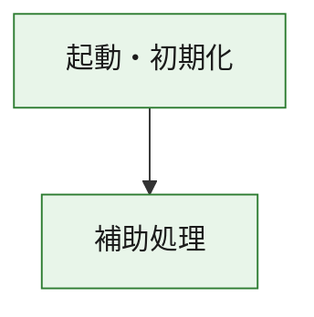
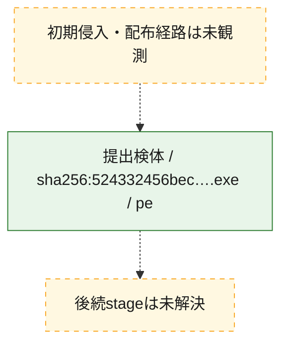
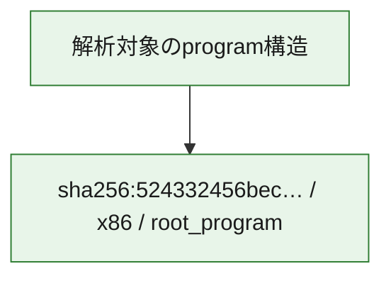

# 全体ロジック：524332456bec6ec0a34fded706c29145e6392dc881d9732c65aa8808a2515550

代表関数の静的証跡から、起動・初期化の処理群を確認しました。

## 読み方

- phaseの掲載順は解析上の整理順です。observed_call_edgesがない段階間の実行順を断定しません。
- 図の実線は静的に観測した関係、点線と黄色のノードは未観測・未解決の関係を示します。
- 図は静的な要約であり、動的実行を再現するものではありません。
- 詳細な関数解説とfingerprintは[STATIC-LOGIC.md](STATIC-LOGIC.md)を参照してください。

## 静的可視化

### 実行フロー

### 感染チェーン

### モジュール関係

## 処理段階

### 1. 起動・初期化

entry pointから初期化と後続処理への移行を確認します。
確度: `confirmed_static_function_evidence`

- `524332456bec6ec0a34fded706c29145e6392dc881d9732c65aa8808a2515550:ghidra:180001010` — 初期化と主要処理への分岐を行う入口関数です。 状態: `succeeded`、選定理由: `entry_point`, `meaningful_symbol_name`, `reviewed_call_centrality:22`, `role:entrypoint`, `small_program_complete_context`

### 2. 補助処理

主要処理を支える一般内部関数またはlibrary処理を確認します。
確度: `confirmed_static_function_evidence`

- `524332456bec6ec0a34fded706c29145e6392dc881d9732c65aa8808a2515550:ghidra:180001240` — 検体内部の一般処理を実装する関数です。 状態: `succeeded`、選定理由: `context_representative`, `reviewed_call_centrality:2`, `small_program_complete_context`
- `524332456bec6ec0a34fded706c29145e6392dc881d9732c65aa8808a2515550:ghidra:180001350` — 検体内部の一般処理を実装する関数です。 状態: `succeeded`、選定理由: `context_representative`, `reviewed_call_centrality:25`, `small_program_complete_context`
- `524332456bec6ec0a34fded706c29145e6392dc881d9732c65aa8808a2515550:ghidra:180003780` — 検体内部の一般処理を実装する関数です。 状態: `succeeded`、選定理由: `context_representative`, `reviewed_call_centrality:2`, `small_program_complete_context`
- `524332456bec6ec0a34fded706c29145e6392dc881d9732c65aa8808a2515550:ghidra:1800038e0` — 検体内部の一般処理を実装する関数です。 状態: `succeeded`、選定理由: `context_representative`, `reviewed_call_centrality:2`, `small_program_complete_context`

## 観測したcall関係

- `524332456bec6ec0a34fded706c29145e6392dc881d9732c65aa8808a2515550:ghidra:180001010` → `524332456bec6ec0a34fded706c29145e6392dc881d9732c65aa8808a2515550:ghidra:180001240` （`startup` → `support`）
- `524332456bec6ec0a34fded706c29145e6392dc881d9732c65aa8808a2515550:ghidra:180001010` → `524332456bec6ec0a34fded706c29145e6392dc881d9732c65aa8808a2515550:ghidra:180001350` （`startup` → `support`）
- `524332456bec6ec0a34fded706c29145e6392dc881d9732c65aa8808a2515550:ghidra:180001350` → `524332456bec6ec0a34fded706c29145e6392dc881d9732c65aa8808a2515550:ghidra:180001240` （`support` → `support`）
- `524332456bec6ec0a34fded706c29145e6392dc881d9732c65aa8808a2515550:ghidra:180001350` → `524332456bec6ec0a34fded706c29145e6392dc881d9732c65aa8808a2515550:ghidra:180003780` （`support` → `support`）
- `524332456bec6ec0a34fded706c29145e6392dc881d9732c65aa8808a2515550:ghidra:180001350` → `524332456bec6ec0a34fded706c29145e6392dc881d9732c65aa8808a2515550:ghidra:1800038e0` （`support` → `support`）
- `524332456bec6ec0a34fded706c29145e6392dc881d9732c65aa8808a2515550:ghidra:180003780` → `524332456bec6ec0a34fded706c29145e6392dc881d9732c65aa8808a2515550:ghidra:1800038e0` （`support` → `support`）
- `ghidra-function:6b69d8487ae82839722004dc` → `ghidra-function:2b41d222f73d47ada37871d7` （`unclassified` → `unclassified`）
- `ghidra-function:6b69d8487ae82839722004dc` → `ghidra-function:42441f4e040fb67b1d036183` （`unclassified` → `unclassified`）
- `ghidra-function:6b69d8487ae82839722004dc` → `ghidra-function:7846eb2acced95d92d1ba47b` （`unclassified` → `unclassified`）
- `ghidra-function:6b69d8487ae82839722004dc` → `ghidra-function:8d737a5c3dcfb3beb982b0ba` （`unclassified` → `unclassified`）
- `ghidra-function:6b69d8487ae82839722004dc` → `ghidra-function:9ff3a21bda7fd710c3487ebe` （`unclassified` → `unclassified`）
- `ghidra-function:6b69d8487ae82839722004dc` → `ghidra-function:a5e52362e7bf429cdf0d579f` （`unclassified` → `unclassified`）
- `ghidra-function:6b69d8487ae82839722004dc` → `ghidra-function:be2243a4363719cac254a1ff` （`unclassified` → `unclassified`）
- `ghidra-function:6b69d8487ae82839722004dc` → `ghidra-function:d0177c6041a544556a3ebbc6` （`unclassified` → `unclassified`）
- `ghidra-function:6b69d8487ae82839722004dc` → `ghidra-function:d6d9c522a661eebba2e1eed6` （`unclassified` → `unclassified`）
- `ghidra-function:6b69d8487ae82839722004dc` → `ghidra-function:ea3a1684207a933bc170ffe6` （`unclassified` → `unclassified`）
- `ghidra-function:6b69d8487ae82839722004dc` → `ghidra-function:ea4cdc7db03324bd0299867e` （`unclassified` → `unclassified`）
- `ghidra-function:6b69d8487ae82839722004dc` → `ghidra-function:f77add5c7d6f8c450b9d792e` （`unclassified` → `unclassified`）
- `ghidra-function:8d737a5c3dcfb3beb982b0ba` → `ghidra-external:064ae45364586347787dbe8f` （`unclassified` → `unclassified`）
- `ghidra-function:8d737a5c3dcfb3beb982b0ba` → `ghidra-external:066b12eb801700c3fa8119e2` （`unclassified` → `unclassified`）
- `ghidra-function:8d737a5c3dcfb3beb982b0ba` → `ghidra-external:0ac1debf97c4d1a1ba364963` （`unclassified` → `unclassified`）
- `ghidra-function:8d737a5c3dcfb3beb982b0ba` → `ghidra-external:15ebb088f09783902feb819b` （`unclassified` → `unclassified`）
- `ghidra-function:8d737a5c3dcfb3beb982b0ba` → `ghidra-external:211f1a122893581a46d2d0ed` （`unclassified` → `unclassified`）
- `ghidra-function:8d737a5c3dcfb3beb982b0ba` → `ghidra-external:394dac3a1f9a2033d0e0e896` （`unclassified` → `unclassified`）
- `ghidra-function:8d737a5c3dcfb3beb982b0ba` → `ghidra-external:41f07661e8b6630aacf68033` （`unclassified` → `unclassified`）
- `ghidra-function:8d737a5c3dcfb3beb982b0ba` → `ghidra-external:5001a02219c55d5a02734c24` （`unclassified` → `unclassified`）
- `ghidra-function:8d737a5c3dcfb3beb982b0ba` → `ghidra-external:6ee0666b6c800af36637995f` （`unclassified` → `unclassified`）
- `ghidra-function:8d737a5c3dcfb3beb982b0ba` → `ghidra-external:779d6f6e8861626917d11c9e` （`unclassified` → `unclassified`）
- `ghidra-function:8d737a5c3dcfb3beb982b0ba` → `ghidra-external:824943144477f8dd3bd478cb` （`unclassified` → `unclassified`）
- `ghidra-function:8d737a5c3dcfb3beb982b0ba` → `ghidra-external:9e450ec2855e792ab6fd61bc` （`unclassified` → `unclassified`）
- `ghidra-function:8d737a5c3dcfb3beb982b0ba` → `ghidra-external:ab4d5b69b69a6db8f18709d7` （`unclassified` → `unclassified`）
- `ghidra-function:8d737a5c3dcfb3beb982b0ba` → `ghidra-external:ad0c3b27cb5cfa82f607c2dd` （`unclassified` → `unclassified`）
- `ghidra-function:8d737a5c3dcfb3beb982b0ba` → `ghidra-external:ada4acecbf10287dfaddd9b7` （`unclassified` → `unclassified`）
- `ghidra-function:8d737a5c3dcfb3beb982b0ba` → `ghidra-external:dab7d3bf04994941c7cf66eb` （`unclassified` → `unclassified`）
- `ghidra-function:8d737a5c3dcfb3beb982b0ba` → `ghidra-external:df6edc8ec8cc4d7cae5fd0a9` （`unclassified` → `unclassified`）
- `ghidra-function:8d737a5c3dcfb3beb982b0ba` → `ghidra-external:f1cb54d4d15717df9313fe9c` （`unclassified` → `unclassified`）
- `ghidra-function:8d737a5c3dcfb3beb982b0ba` → `ghidra-external:f69b6447d0744282891f5ca6` （`unclassified` → `unclassified`）
- `ghidra-function:8d737a5c3dcfb3beb982b0ba` → `ghidra-external:fd6dde7108673f1f075a3fd4` （`unclassified` → `unclassified`）
- `ghidra-function:8d737a5c3dcfb3beb982b0ba` → `ghidra-external:feb78f59cb7a3a9baf753300` （`unclassified` → `unclassified`）
- `ghidra-function:8d737a5c3dcfb3beb982b0ba` → `ghidra-function:2b41d222f73d47ada37871d7` （`unclassified` → `unclassified`）
- `ghidra-function:8d737a5c3dcfb3beb982b0ba` → `ghidra-function:d2b50b0cf2211c00eecd6000` （`unclassified` → `unclassified`）
- `ghidra-function:8d737a5c3dcfb3beb982b0ba` → `ghidra-function:fcb6ad5e4461b0deb696a0cd` （`unclassified` → `unclassified`）
- `ghidra-function:fcb6ad5e4461b0deb696a0cd` → `ghidra-function:d2b50b0cf2211c00eecd6000` （`unclassified` → `unclassified`）

## 解析範囲と制約

- 選定外関数は全体inventoryへ残しますが、関数本体の個別解説対象にはしていません。
- indirect call、難読化、packer、VM、壊れたcontrol flowによりcall関係が欠落する場合があります。
- 文書は静的解析に基づき、検体実行や外部通信による動的確認は行っていません。
