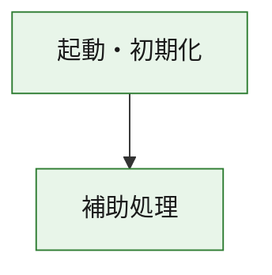
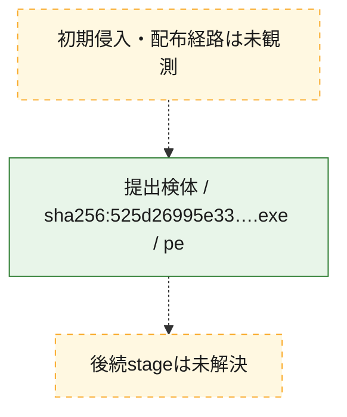
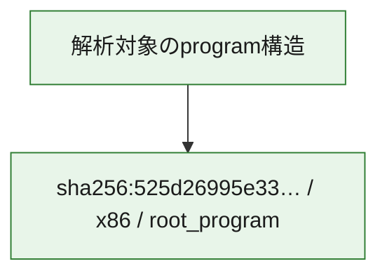

# 全体ロジック：525d26995e33a51239499d755f02a84a01e5ec662d564336952012693da4949b

代表関数の静的証跡から、起動・初期化の処理群を確認しました。

## 読み方

- phaseの掲載順は解析上の整理順です。observed_call_edgesがない段階間の実行順を断定しません。
- 図の実線は静的に観測した関係、点線と黄色のノードは未観測・未解決の関係を示します。
- 図は静的な要約であり、動的実行を再現するものではありません。
- 詳細な関数解説とfingerprintは[STATIC-LOGIC.md](STATIC-LOGIC.md)を参照してください。

## 静的可視化

### 実行フロー

### 感染チェーン

### モジュール関係

## 処理段階

### 1. 起動・初期化

entry pointから初期化と後続処理への移行を確認します。
確度: `confirmed_static_function_evidence`

- `525d26995e33a51239499d755f02a84a01e5ec662d564336952012693da4949b:ghidra:180001010` — 初期化と主要処理への分岐を行う入口関数です。 状態: `succeeded`、選定理由: `entry_point`, `meaningful_symbol_name`, `reviewed_call_centrality:22`, `role:entrypoint`, `small_program_complete_context`

### 2. 補助処理

主要処理を支える一般内部関数またはlibrary処理を確認します。
確度: `confirmed_static_function_evidence`

- `525d26995e33a51239499d755f02a84a01e5ec662d564336952012693da4949b:ghidra:180001240` — 検体内部の一般処理を実装する関数です。 状態: `succeeded`、選定理由: `context_representative`, `reviewed_call_centrality:2`, `small_program_complete_context`
- `525d26995e33a51239499d755f02a84a01e5ec662d564336952012693da4949b:ghidra:180001350` — 検体内部の一般処理を実装する関数です。 状態: `succeeded`、選定理由: `context_representative`, `reviewed_call_centrality:25`, `small_program_complete_context`
- `525d26995e33a51239499d755f02a84a01e5ec662d564336952012693da4949b:ghidra:180003780` — 検体内部の一般処理を実装する関数です。 状態: `succeeded`、選定理由: `context_representative`, `reviewed_call_centrality:2`, `small_program_complete_context`
- `525d26995e33a51239499d755f02a84a01e5ec662d564336952012693da4949b:ghidra:1800038e0` — 検体内部の一般処理を実装する関数です。 状態: `succeeded`、選定理由: `context_representative`, `reviewed_call_centrality:2`, `small_program_complete_context`

## 観測したcall関係

- `525d26995e33a51239499d755f02a84a01e5ec662d564336952012693da4949b:ghidra:180001010` → `525d26995e33a51239499d755f02a84a01e5ec662d564336952012693da4949b:ghidra:180001240` （`startup` → `support`）
- `525d26995e33a51239499d755f02a84a01e5ec662d564336952012693da4949b:ghidra:180001010` → `525d26995e33a51239499d755f02a84a01e5ec662d564336952012693da4949b:ghidra:180001350` （`startup` → `support`）
- `525d26995e33a51239499d755f02a84a01e5ec662d564336952012693da4949b:ghidra:180001350` → `525d26995e33a51239499d755f02a84a01e5ec662d564336952012693da4949b:ghidra:180001240` （`support` → `support`）
- `525d26995e33a51239499d755f02a84a01e5ec662d564336952012693da4949b:ghidra:180001350` → `525d26995e33a51239499d755f02a84a01e5ec662d564336952012693da4949b:ghidra:180003780` （`support` → `support`）
- `525d26995e33a51239499d755f02a84a01e5ec662d564336952012693da4949b:ghidra:180001350` → `525d26995e33a51239499d755f02a84a01e5ec662d564336952012693da4949b:ghidra:1800038e0` （`support` → `support`）
- `525d26995e33a51239499d755f02a84a01e5ec662d564336952012693da4949b:ghidra:180003780` → `525d26995e33a51239499d755f02a84a01e5ec662d564336952012693da4949b:ghidra:1800038e0` （`support` → `support`）
- `ghidra-function:4ffb03e0c236d45a534e68f5` → `ghidra-external:086a6b54847995bc742410f3` （`unclassified` → `unclassified`）
- `ghidra-function:4ffb03e0c236d45a534e68f5` → `ghidra-external:16434076026f5e47883603f7` （`unclassified` → `unclassified`）
- `ghidra-function:4ffb03e0c236d45a534e68f5` → `ghidra-external:1b587a04aff5a2f32b1ef916` （`unclassified` → `unclassified`）
- `ghidra-function:4ffb03e0c236d45a534e68f5` → `ghidra-external:1cc6d5d00359f969048534e1` （`unclassified` → `unclassified`）
- `ghidra-function:4ffb03e0c236d45a534e68f5` → `ghidra-external:31a717ef879d7d391ca0b9d7` （`unclassified` → `unclassified`）
- `ghidra-function:4ffb03e0c236d45a534e68f5` → `ghidra-external:3f457269319faada1809b0cb` （`unclassified` → `unclassified`）
- `ghidra-function:4ffb03e0c236d45a534e68f5` → `ghidra-external:45bfa7296dfc53397d9eb35e` （`unclassified` → `unclassified`）
- `ghidra-function:4ffb03e0c236d45a534e68f5` → `ghidra-external:7db1a26c0896164b564a6441` （`unclassified` → `unclassified`）
- `ghidra-function:4ffb03e0c236d45a534e68f5` → `ghidra-external:854961170f474d877dd3ed3e` （`unclassified` → `unclassified`）
- `ghidra-function:4ffb03e0c236d45a534e68f5` → `ghidra-external:90a0daf2b4b80033604d300b` （`unclassified` → `unclassified`）
- `ghidra-function:4ffb03e0c236d45a534e68f5` → `ghidra-external:9830b863e93cb1de1c61455a` （`unclassified` → `unclassified`）
- `ghidra-function:4ffb03e0c236d45a534e68f5` → `ghidra-external:a03379237290e21fd019220a` （`unclassified` → `unclassified`）
- `ghidra-function:4ffb03e0c236d45a534e68f5` → `ghidra-external:a68270ed4e8475b63df6999d` （`unclassified` → `unclassified`）
- `ghidra-function:4ffb03e0c236d45a534e68f5` → `ghidra-external:ac5b709044bac3aa881c5930` （`unclassified` → `unclassified`）
- `ghidra-function:4ffb03e0c236d45a534e68f5` → `ghidra-external:aedc15a1d3e2410da93edde2` （`unclassified` → `unclassified`）
- `ghidra-function:4ffb03e0c236d45a534e68f5` → `ghidra-external:b9f914501e7e9560b84757ec` （`unclassified` → `unclassified`）
- `ghidra-function:4ffb03e0c236d45a534e68f5` → `ghidra-external:bc9fb2ff3498536752ae0b67` （`unclassified` → `unclassified`）
- `ghidra-function:4ffb03e0c236d45a534e68f5` → `ghidra-external:ca1f30c0527a4f40dbc6ff64` （`unclassified` → `unclassified`）
- `ghidra-function:4ffb03e0c236d45a534e68f5` → `ghidra-external:cd4d414edc13923dd891b01d` （`unclassified` → `unclassified`）
- `ghidra-function:4ffb03e0c236d45a534e68f5` → `ghidra-external:dd1255d1defa2ef2562e189d` （`unclassified` → `unclassified`）
- `ghidra-function:4ffb03e0c236d45a534e68f5` → `ghidra-external:efeb8260a6a5cff0c035037c` （`unclassified` → `unclassified`）
- `ghidra-function:4ffb03e0c236d45a534e68f5` → `ghidra-function:5e8f401f03fdf53b44cb82f9` （`unclassified` → `unclassified`）
- `ghidra-function:4ffb03e0c236d45a534e68f5` → `ghidra-function:d48ddd67c5ee1aea7d884340` （`unclassified` → `unclassified`）
- `ghidra-function:4ffb03e0c236d45a534e68f5` → `ghidra-function:d57bf9a08d98c080834747e9` （`unclassified` → `unclassified`）
- `ghidra-function:5e8f401f03fdf53b44cb82f9` → `ghidra-function:d57bf9a08d98c080834747e9` （`unclassified` → `unclassified`）
- `ghidra-function:d573e33b5ac20e1d3fecf725` → `ghidra-function:0dc52444aff85d0d280c8e67` （`unclassified` → `unclassified`）
- `ghidra-function:d573e33b5ac20e1d3fecf725` → `ghidra-function:1edc161b13cd01391fc3a833` （`unclassified` → `unclassified`）
- `ghidra-function:d573e33b5ac20e1d3fecf725` → `ghidra-function:24bcf318f2dda85a9760f686` （`unclassified` → `unclassified`）
- `ghidra-function:d573e33b5ac20e1d3fecf725` → `ghidra-function:36af953c2757f8a7cef771a0` （`unclassified` → `unclassified`）
- `ghidra-function:d573e33b5ac20e1d3fecf725` → `ghidra-function:3992312bb81ddd5babc2c541` （`unclassified` → `unclassified`）
- `ghidra-function:d573e33b5ac20e1d3fecf725` → `ghidra-function:3fb4e60610c8f05f9083b023` （`unclassified` → `unclassified`）
- `ghidra-function:d573e33b5ac20e1d3fecf725` → `ghidra-function:44504e8ce467ada00460df5d` （`unclassified` → `unclassified`）
- `ghidra-function:d573e33b5ac20e1d3fecf725` → `ghidra-function:4ffb03e0c236d45a534e68f5` （`unclassified` → `unclassified`）
- `ghidra-function:d573e33b5ac20e1d3fecf725` → `ghidra-function:9fa61c5412df60245f5f9577` （`unclassified` → `unclassified`）
- `ghidra-function:d573e33b5ac20e1d3fecf725` → `ghidra-function:d48ddd67c5ee1aea7d884340` （`unclassified` → `unclassified`）
- `ghidra-function:d573e33b5ac20e1d3fecf725` → `ghidra-function:d4fa9c8846459dbcb1bab52f` （`unclassified` → `unclassified`）
- `ghidra-function:d573e33b5ac20e1d3fecf725` → `ghidra-function:fea11df4f1fc655498fd42f7` （`unclassified` → `unclassified`）

## 解析範囲と制約

- 選定外関数は全体inventoryへ残しますが、関数本体の個別解説対象にはしていません。
- indirect call、難読化、packer、VM、壊れたcontrol flowによりcall関係が欠落する場合があります。
- 文書は静的解析に基づき、検体実行や外部通信による動的確認は行っていません。
