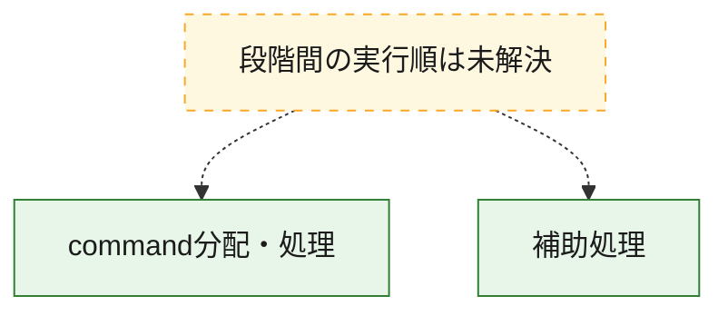
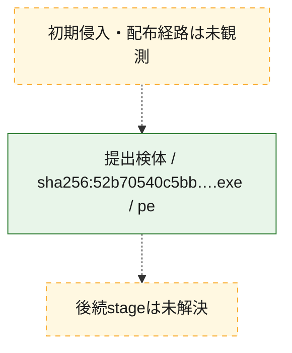
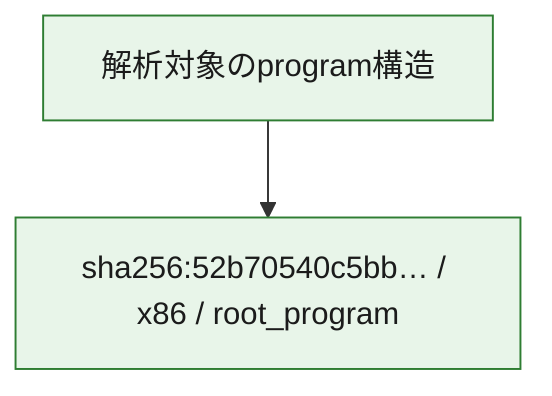

# 全体ロジック：52b70540c5bb90fa31db0b4f68bff5becd3e56a45e19aebc7ca18cd26a81b815

代表関数の静的証跡から、command分配・処理の処理群を確認しました。

## 読み方

- phaseの掲載順は解析上の整理順です。observed_call_edgesがない段階間の実行順を断定しません。
- 図の実線は静的に観測した関係、点線と黄色のノードは未観測・未解決の関係を示します。
- 図は静的な要約であり、動的実行を再現するものではありません。
- 詳細な関数解説とfingerprintは[STATIC-LOGIC.md](STATIC-LOGIC.md)を参照してください。

## 静的可視化

### 実行フロー

### 感染チェーン

### モジュール関係

## 処理段階

### 1. command分配・処理

受信commandやtaskの解釈、分配、個別handlerへの移行を確認します。
確度: `confirmed_static_function_evidence`

- `52b70540c5bb90fa31db0b4f68bff5becd3e56a45e19aebc7ca18cd26a81b815:cil:0x06000045` — commandの解釈、分配、または個別処理を担当する関数です。 状態: `succeeded`、選定理由: `large_function:instructions=112`, `reviewed_call_centrality:26`, `role:command_dispatch_or_handler`
- `52b70540c5bb90fa31db0b4f68bff5becd3e56a45e19aebc7ca18cd26a81b815:cil:0x06000050` — commandの解釈、分配、または個別処理を担当する関数です。 状態: `succeeded`、選定理由: `reviewed_call_centrality:16`, `role:command_dispatch_or_handler`
- `52b70540c5bb90fa31db0b4f68bff5becd3e56a45e19aebc7ca18cd26a81b815:cil:0x0600005c` — commandの解釈、分配、または個別処理を担当する関数です。 状態: `succeeded`、選定理由: `large_function:instructions=217`, `reviewed_call_centrality:56`, `role:command_dispatch_or_handler`
- `52b70540c5bb90fa31db0b4f68bff5becd3e56a45e19aebc7ca18cd26a81b815:cil:0x0600005d` — commandの解釈、分配、または個別処理を担当する関数です。 状態: `succeeded`、選定理由: `reviewed_call_centrality:12`, `role:command_dispatch_or_handler`

### 2. 補助処理

主要処理を支える一般内部関数またはlibrary処理を確認します。
確度: `confirmed_static_function_evidence`

- `52b70540c5bb90fa31db0b4f68bff5becd3e56a45e19aebc7ca18cd26a81b815:cil:0x06000003` — 検体内部の一般処理を実装する関数です。 状態: `succeeded`、選定理由: `reviewed_call_centrality:14`
- `52b70540c5bb90fa31db0b4f68bff5becd3e56a45e19aebc7ca18cd26a81b815:cil:0x06000004` — 検体内部の一般処理を実装する関数です。 状態: `succeeded`、選定理由: `reviewed_call_centrality:8`
- `52b70540c5bb90fa31db0b4f68bff5becd3e56a45e19aebc7ca18cd26a81b815:cil:0x06000007` — 検体内部の一般処理を実装する関数です。 状態: `succeeded`、選定理由: `reviewed_call_centrality:2`
- `52b70540c5bb90fa31db0b4f68bff5becd3e56a45e19aebc7ca18cd26a81b815:cil:0x0600000a` — 検体内部の一般処理を実装する関数です。 状態: `succeeded`、選定理由: `reviewed_call_centrality:2`
- `52b70540c5bb90fa31db0b4f68bff5becd3e56a45e19aebc7ca18cd26a81b815:cil:0x0600000b` — 検体内部の一般処理を実装する関数です。 状態: `succeeded`、選定理由: `reviewed_call_centrality:2`
- `52b70540c5bb90fa31db0b4f68bff5becd3e56a45e19aebc7ca18cd26a81b815:cil:0x06000011` — compiler生成処理または汎用library処理とみられる関数です。 状態: `succeeded`、選定理由: `reviewed_call_centrality:6`
- `52b70540c5bb90fa31db0b4f68bff5becd3e56a45e19aebc7ca18cd26a81b815:cil:0x0600001c` — 検体内部の一般処理を実装する関数です。 状態: `succeeded`、選定理由: `reviewed_call_centrality:2`
- `52b70540c5bb90fa31db0b4f68bff5becd3e56a45e19aebc7ca18cd26a81b815:cil:0x06000021` — compiler生成処理または汎用library処理とみられる関数です。 状態: `succeeded`、選定理由: `reviewed_call_centrality:4`
- `52b70540c5bb90fa31db0b4f68bff5becd3e56a45e19aebc7ca18cd26a81b815:cil:0x06000030` — 検体内部の一般処理を実装する関数です。 状態: `succeeded`、選定理由: `reviewed_call_centrality:2`
- `52b70540c5bb90fa31db0b4f68bff5becd3e56a45e19aebc7ca18cd26a81b815:cil:0x06000031` — 検体内部の一般処理を実装する関数です。 状態: `succeeded`、選定理由: `reviewed_call_centrality:2`
- `52b70540c5bb90fa31db0b4f68bff5becd3e56a45e19aebc7ca18cd26a81b815:cil:0x06000039` — 検体内部の一般処理を実装する関数です。 状態: `succeeded`、選定理由: `reviewed_call_centrality:2`
- `52b70540c5bb90fa31db0b4f68bff5becd3e56a45e19aebc7ca18cd26a81b815:cil:0x0600003b` — compiler生成処理または汎用library処理とみられる関数です。 状態: `succeeded`、選定理由: `reviewed_call_centrality:6`
- `52b70540c5bb90fa31db0b4f68bff5becd3e56a45e19aebc7ca18cd26a81b815:cil:0x0600003c` — 検体内部の一般処理を実装する関数です。 状態: `succeeded`、選定理由: `reviewed_call_centrality:2`
- `52b70540c5bb90fa31db0b4f68bff5becd3e56a45e19aebc7ca18cd26a81b815:cil:0x0600003d` — 検体内部の一般処理を実装する関数です。 状態: `succeeded`、選定理由: `large_function:instructions=90`, `reviewed_call_centrality:24`
- `52b70540c5bb90fa31db0b4f68bff5becd3e56a45e19aebc7ca18cd26a81b815:cil:0x06000042` — compiler生成処理または汎用library処理とみられる関数です。 状態: `succeeded`、選定理由: `large_function:instructions=164`, `reviewed_call_centrality:34`
- `52b70540c5bb90fa31db0b4f68bff5becd3e56a45e19aebc7ca18cd26a81b815:cil:0x06000043` — compiler生成処理または汎用library処理とみられる関数です。 状態: `succeeded`、選定理由: `reviewed_call_centrality:4`
- `52b70540c5bb90fa31db0b4f68bff5becd3e56a45e19aebc7ca18cd26a81b815:cil:0x06000044` — 検体内部の一般処理を実装する関数です。 状態: `succeeded`、選定理由: `reviewed_call_centrality:12`
- `52b70540c5bb90fa31db0b4f68bff5becd3e56a45e19aebc7ca18cd26a81b815:cil:0x06000046` — 検体内部の一般処理を実装する関数です。 状態: `succeeded`、選定理由: `reviewed_call_centrality:18`
- `52b70540c5bb90fa31db0b4f68bff5becd3e56a45e19aebc7ca18cd26a81b815:cil:0x06000047` — 検体内部の一般処理を実装する関数です。 状態: `succeeded`、選定理由: `reviewed_call_centrality:6`
- `52b70540c5bb90fa31db0b4f68bff5becd3e56a45e19aebc7ca18cd26a81b815:cil:0x0600004d` — compiler生成処理または汎用library処理とみられる関数です。 状態: `succeeded`、選定理由: `reviewed_call_centrality:12`
- `52b70540c5bb90fa31db0b4f68bff5becd3e56a45e19aebc7ca18cd26a81b815:cil:0x0600004e` — 検体内部の一般処理を実装する関数です。 状態: `succeeded`、選定理由: `large_function:instructions=87`, `reviewed_call_centrality:22`
- `52b70540c5bb90fa31db0b4f68bff5becd3e56a45e19aebc7ca18cd26a81b815:cil:0x0600004f` — 検体内部の一般処理を実装する関数です。 状態: `succeeded`、選定理由: `large_function:instructions=107`, `reviewed_call_centrality:26`
- `52b70540c5bb90fa31db0b4f68bff5becd3e56a45e19aebc7ca18cd26a81b815:cil:0x06000051` — 検体内部の一般処理を実装する関数です。 状態: `succeeded`、選定理由: `reviewed_call_centrality:16`
- `52b70540c5bb90fa31db0b4f68bff5becd3e56a45e19aebc7ca18cd26a81b815:cil:0x06000052` — 検体内部の一般処理を実装する関数です。 状態: `succeeded`、選定理由: `reviewed_call_centrality:16`
- `52b70540c5bb90fa31db0b4f68bff5becd3e56a45e19aebc7ca18cd26a81b815:cil:0x06000053` — 検体内部の一般処理を実装する関数です。 状態: `succeeded`、選定理由: `reviewed_call_centrality:6`
- `52b70540c5bb90fa31db0b4f68bff5becd3e56a45e19aebc7ca18cd26a81b815:cil:0x06000054` — 検体内部の一般処理を実装する関数です。 状態: `succeeded`、選定理由: `large_function:instructions=133`, `reviewed_call_centrality:34`
- `52b70540c5bb90fa31db0b4f68bff5becd3e56a45e19aebc7ca18cd26a81b815:cil:0x06000055` — compiler生成処理または汎用library処理とみられる関数です。 状態: `succeeded`、選定理由: `reviewed_call_centrality:2`
- `52b70540c5bb90fa31db0b4f68bff5becd3e56a45e19aebc7ca18cd26a81b815:cil:0x0600005f` — 検体内部の一般処理を実装する関数です。 状態: `succeeded`、選定理由: `reviewed_call_centrality:4`

## 観測したcall関係

- 代表関数間で直接解決できた呼出関係はありません。

## 解析範囲と制約

- 選定外関数は全体inventoryへ残しますが、関数本体の個別解説対象にはしていません。
- indirect call、難読化、packer、VM、壊れたcontrol flowによりcall関係が欠落する場合があります。
- 文書は静的解析に基づき、検体実行や外部通信による動的確認は行っていません。
